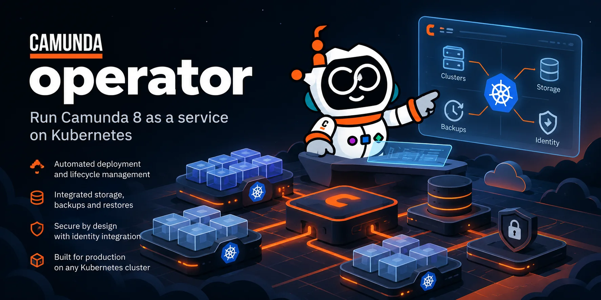

# Camunda Operator



[](https://artifacthub.io/packages/search?repo=camunda-operator)

A Kubernetes operator for Camunda 8 Self-Managed as a platform. Use it to offer [Camunda 8.9+](https://docs.camunda.io/) as a service to the teams in your organization, on infrastructure that you run.

One operator runs the orchestration clusters, their Elasticsearch or PostgreSQL storage, the management plane, and Optimize, and connects them for you. A PostgreSQL server that you run yourself works too. A platform team writes the sizing and the versions once, in presets and releases. Each new cluster is then a few lines.

The operator runs on any Kubernetes cluster that meets the [requirements](https://konsole-is.github.io/camunda-operator/dev/installation/#requirements), including bare metal. It never creates cloud resources such as buckets or IAM roles, so you bring those yourself.

The documentation is at **[konsole-is.github.io/camunda-operator](https://konsole-is.github.io/camunda-operator/)**. It opens at the latest release. The version selector in its header also has the docs of each release and the `dev` docs of main.

> [!WARNING]
> The operator is in early development. The API group is `core.camunda.io/v1`, but the API can still change before the first stable release.

## Features

| Area | What you get | Kinds |
| --- | --- | --- |
| Orchestration | Zeebe, the gateway, Operate, Tasklist, Admin, and optionally Connectors, in any [topology configuration](https://konsole-is.github.io/camunda-operator/dev/crds/camundacluster/#topology) | `CamundaCluster` |
| Management plane | Management Identity, Console, Web Modeler, and optionally Keycloak | `CamundaManagementCluster` |
| Optimize | One Optimize for each cluster that needs it | `CamundaOptimize` |
| Storage | Elasticsearch through ECK, PostgreSQL through CloudNativePG, and logical databases on any PostgreSQL server | `ElasticsearchCluster`, `DatabaseServer`, `Database` |
| Backup and restore | Backups to a bucket, on demand or on a schedule, restores into a suspended cluster, and point-in-time restore of PostgreSQL | `LogicalBackup*`, `BackupSchedule`, `LogicalRestore*`, `PointInTimeRestore` |
| Operations | Version upgrades that refuse a downgrade, suspend and resume, storage growth, and password rotation | The [operations guide](https://konsole-is.github.io/camunda-operator/dev/guides/operations/) |
| Authentication and license | Basic authentication or OIDC, and the license key, shared by many clusters | `CamundaPlatformConfig` |
| Fleet management | Presets for the sizing, and releases for the versions and the images | `*Preset`, `CamundaRelease` |

The [CRD reference](https://konsole-is.github.io/camunda-operator/dev/crds/) lists every kind with every field.

## Examples

[`config/example`](config/example) holds complete setups that you can apply. There is a cluster on Elasticsearch, a cluster on PostgreSQL, and a management plane with Keycloak or with your own identity provider. Each directory has a README with the apply order.

The cluster of the PostgreSQL example is below. It names a preset and a release, and the platform config and the storage that the same example creates before it.

```yaml
apiVersion: core.camunda.io/v1
kind: CamundaCluster
metadata:
  name: my-cluster
  namespace: my-cluster-ns
spec:
  presetRef: small
  releaseRef: camunda-8-9
  platformConfigRef: my-platform-config
  storageRef: my-storage-config
```

The broker count, the volumes, and the resources come from the preset `small`. The Camunda version comes from the release `camunda-8-9`. The [presets guide](https://konsole-is.github.io/camunda-operator/dev/guides/presets/) explains both kinds.

## Install

Check the [requirements](https://konsole-is.github.io/camunda-operator/dev/installation/#requirements) first. A few optional features need another operator, and only when you use them. An `ElasticsearchCluster` needs ECK, a `DatabaseServer` needs CloudNativePG, and a Keycloak that the operator runs needs the Keycloak Operator. This operator does not install them.

```bash
helm install camunda-operator \
  oci://ghcr.io/konsole-is/charts/camunda-operator \
  --version <version> \
  --namespace camunda-operator-system \
  --create-namespace
```

The [installation guide](https://konsole-is.github.io/camunda-operator/dev/installation/) covers plain manifests, signature verification, CRDs installed separately, upgrades, and removal.

## Run your first cluster

[Getting started](https://konsole-is.github.io/camunda-operator/dev/getting-started/) takes you from an empty Kubernetes cluster to a running Camunda cluster that you can log in to.

## Documentation

The [documentation site](https://konsole-is.github.io/camunda-operator/) has a version for each minor release and a `dev` version for main. The site opens at `latest`, the newest release. The links in this README go to `dev`, which matches the code on main.

- [Getting started](https://konsole-is.github.io/camunda-operator/dev/getting-started/)
- [Installation](https://konsole-is.github.io/camunda-operator/dev/installation/)
- [Architecture](https://konsole-is.github.io/camunda-operator/dev/architecture/): how the resources relate and the rules the operator follows
- [Observability](https://konsole-is.github.io/camunda-operator/dev/observability/): the metrics of the operator, and the dashboards and alerts that ship with it
- [Use the API types from Go](https://konsole-is.github.io/camunda-operator/dev/go-api/): the api module for programs that create or read the CRs
- Guides: [presets](https://konsole-is.github.io/camunda-operator/dev/guides/presets/), [secondary storage](https://konsole-is.github.io/camunda-operator/dev/guides/secondary-storage/), [authentication](https://konsole-is.github.io/camunda-operator/dev/guides/authentication/), [management plane](https://konsole-is.github.io/camunda-operator/dev/guides/management-plane/), [backup](https://konsole-is.github.io/camunda-operator/dev/guides/backup/), [operations](https://konsole-is.github.io/camunda-operator/dev/guides/operations/)
- [CRD reference](https://konsole-is.github.io/camunda-operator/dev/crds/)

## Development

```bash
make test           # unit and envtest suites (needs Docker for the PostgreSQL testcontainer)
make lint           # golangci-lint, the line-split shape of calls, and the version pins of config/example
make vulncheck      # known vulnerabilities that the code can reach (run it with the Go of .tool-versions)
make all            # generate manifests and deepcopy, fmt, vet, build
make test-e2e       # end-to-end suite on a new kind cluster (needs Docker and kind)
make helm-generate  # regenerate dist/chart/ from config/
make docs-serve     # preview the documentation site
```

`dist/chart/values.yaml`, `dist/chart/values.schema.json`, and `dist/chart/templates/` are generated. Change the defaults in `config/` and run `make helm-generate`.

Issues and pull requests are welcome at [github.com/konsole-is/camunda-operator](https://github.com/konsole-is/camunda-operator).

## License

Apache License 2.0.
