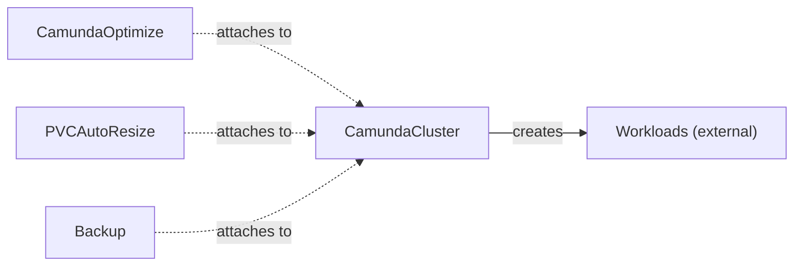
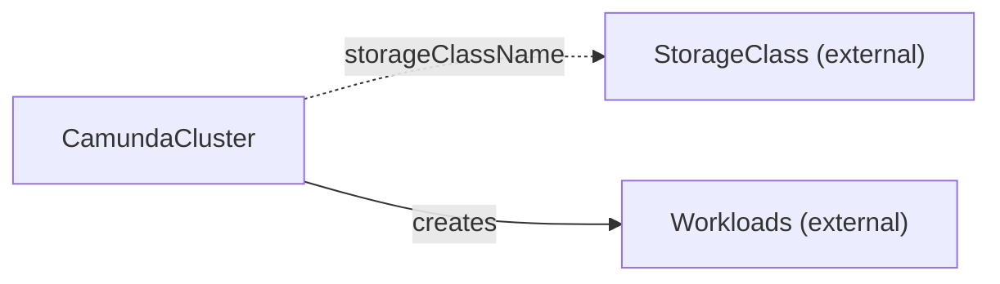
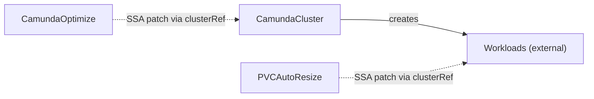
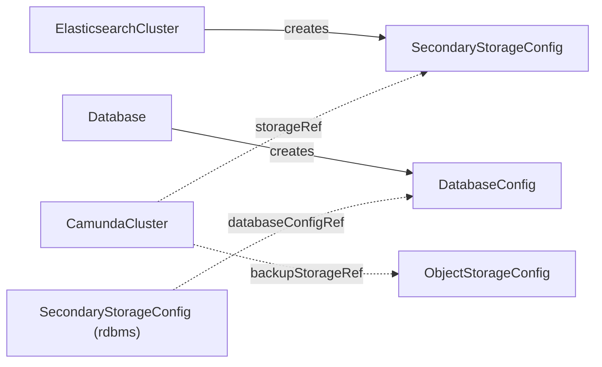
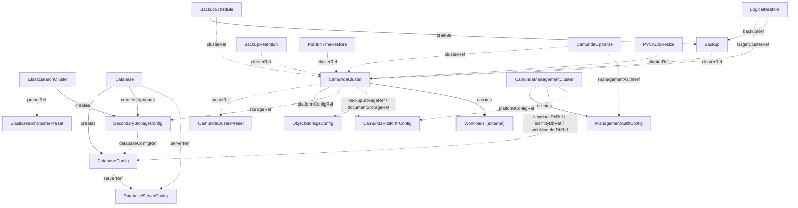

# Architecture

The Camunda Operator manages Camunda 8.9+ orchestration clusters and the features that attach to them.
This page describes the design principles behind its API surface: how the core cluster resource stays small, how every other capability connects to it, and what the operator does and does not take responsibility for.

## The extension model

The core principle: **features attach to workloads; workloads don't know about features.**

`CamundaCluster` describes the orchestration cluster — the Camunda workload set — and nothing else.
Every other capability is its own CRD with its own controller that discovers the cluster and augments it from the outside.
The `CamundaCluster` controller has no plugin interfaces, no sub-reconcilers for extensions, and no code dependencies on any extension controller.
A failure in an extension never blocks cluster reconciliation, and extensions can be created, updated, or deleted independently of the cluster's lifecycle.

This mirrors how the Kubernetes ecosystem itself works.
cert-manager writes Secrets; the HorizontalPodAutoscaler patches replicas on a Deployment.
Neither goes through a central coordinator: controllers attach themselves to resources and extend them in small, well-scoped ways.

To make discovery possible, the operator labels every workload it creates with `camunda.io/cluster` (the owning cluster's name) and `camunda.io/component` (the workload's role).
Extensions find workloads through these labels or reference the cluster directly via `clusterRef`.

## How features connect

Features connect to the core through three mechanisms.

### 1. Explicit inputs for immutable concerns (before creation)

Some configuration must be known before a resource is created because it cannot be changed afterward.
The primary example is storage class names on StatefulSet PVC templates: `spec.zeebe.storageClassName` must be set when the `CamundaCluster` is created.

The `CamundaCluster` takes a storage class name — the same field you would set to `standard` or `gp3` — and does not care where that StorageClass came from.
A composition layer above may provision a special-purpose StorageClass (for example an encrypted one) before creating the cluster, but that is a prerequisite sequencing concern of the layer above, never of this operator.

### 2. `clusterRef` and SSA patching for runtime concerns (after creation)

Extensions reference a `CamundaCluster` via `clusterRef` to read its spec — for example which components are active — and optionally patch fields back onto it using Server-Side Apply (SSA).

Each patching extension owns a dedicated SSA field manager, so its writes are tracked and removed cleanly when the extension is deleted, and no two controllers fight over the same fields.
For example, `CamundaOptimize` patches exporter configuration onto the cluster spec, and `PVCAutoResize` patches resize annotations onto live PVCs.

To react to changes on the referenced cluster, extension controllers set up a watch on `CamundaCluster` with a mapping function that resolves back to the referencing CR.
A field indexer on `.spec.clusterRef.name` makes this an O(1) lookup — the same pattern Ingress controllers use to watch Services.
The extension controller never reconciles the `CamundaCluster` itself; the watch is only a trigger to re-reconcile its own CR with the latest cluster state.

### 3. Contract CRDs for data passing

Controllers pass structured data to each other through contract CRDs rather than direct references or shared fields.

Each contract CRD — `SecondaryStorageConfig`, `ObjectStorageConfig`, `DatabaseServerConfig`, `DatabaseConfig`, `ManagementAuthConfig` — is a typed interface that carries connection details, credential references, and configuration.
The producing controller creates the contract CR; the consuming controller reads it via a named reference.
This decouples producer and consumer completely: the operator reads an `ObjectStorageConfig` without knowing whether it was created by a composition layer above, a Crossplane composite, or you applying a manifest by hand.

Contract CRDs have lightweight validation-only controllers that check referenced secrets and CRs exist and surface the result as status conditions.
They never provision anything.

## CRD overview

The operator's 19 CRDs and how they relate.
Solid arrows mean "creates/provisions"; dotted arrows mean "reads/references/patches".

See the [CRD Overview](crds/index.md) for the full inventory, the reconciler dependency graph, and per-CRD reference documentation.

## Deployment context

This operator is the bottom layer of a three-operator stack.
A cloud operator (managing cloud infrastructure such as buckets, database servers, and encrypted volumes) and a SaaS operator (managing platform extensions such as ingress and monitoring) may run above it: they create CRs of this operator — a composition layer above may create a `CamundaCluster`, contract CRs, or extension CRs — but this operator has zero knowledge of them, takes no code dependency on them, and works standalone on any Kubernetes cluster.

## Support policy

- **Camunda 8.9+ only.** The operator targets the unified orchestration-cluster architecture introduced with Camunda 8.9. There is no version-conditional rendering and no support for earlier component topologies.
- **Minor releases are the test matrix.** The operator is tested against Camunda minor releases; features that land in a patch release are treated as part of the next minor.
- **Clean slate.** There is no migration or adoption path from earlier Camunda operators: no ZeebeCluster compatibility, no adoption of pre-existing StatefulSets or ECK resources.
