# Camunda Operator: Architecture Proposal

Architectural proposal for the Camunda operator.

## Table of Contents

- [Where We Are Today](#where-we-are-today)
- [New Architecture Benefits](#benefits)
  - [Camunda Internal](#camunda-internal)
  - [For The Platform](#for-the-platform)
  - [For The Customer](#for-customers)
- [The Inspiration](#the-inspiration-externalmonitoring)
- [The Proposed Direction](#the-proposed-direction)
  - [Core Principle](#core-principle-features-attach-to-workloads-workloads-dont-know-about-features)
  - [How Features Interact with Workloads](#how-features-connect-to-the-core)
- [Target Architecture](#target-architecture)
  - [The Operators](#the-operators)
  - [Deployment Models](#deployment-models)
  - [Information Flow](#information-flow)
  - [Reconciliation Independence](#reconciliation-independence)
  - [Operator CRD List](#operator-crd-list)
  - [Complete Overview](#complete-overview)
  - [Replacement for current operator](#replacement-for-current-operator)
  - [Self-Managed (minimal)](#self-managed-minimal)
  - [All Operators Combined](#all-operators-combined)
- [Proposed CRD Design](#proposed-crd-design)
  - [Core] [1. Platform Config: CamundaPlatformConfig](#1-platform-config-camundaplatformconfig)
  - [Core] [2. Contract CRDs](#2-contract-crds)
  - [Core] [3. The Core CR: CamundaCluster](#3-the-core-cr-camundacluster)
  - [Core] [4. Elasticsearch Cluster: ElasticsearchCluster](#4-elasticsearch-cluster-elasticsearchcluster)
  - [Core] [5. PVC Auto-Resize: PVCAutoResize](#5-pvc-auto-resize-pvcautoresize)
  - [Core] [6. Backup System: Backup, BackupSchedule, BackupRetention](#6-backup-system-backup-backupschedule-backupretention)
  - [Core] [7. Restore System: PointInTimeRestore, LogicalRestore](#7-restore-system-pointintimerestore-logicalrestore)
  - [Core] [8. Optimize: CamundaOptimize](#8-optimize-camundaoptimize)
  - [Core] [9. Management Plane: CamundaManagementCluster](#9-management-plane-camundamanagementcluster)
  - [Cloud] [10. Cloud Account: CloudAccount](#10-cloud-account-cloudaccount)
  - [Cloud] [11. Cloud Network Config: CloudNetworkConfig](#11-cloud-network-config-cloudnetworkconfig)
  - [Cloud] [12. Cloud-Managed KMS Keys: CloudKMSKey](#12-cloud-managed-kms-keys-cloudkmskey)
  - [Cloud] [13. Volume Encryption: EncryptedVolume](#13-volume-encryption-encryptedvolume)
  - [Cloud] [14. Cloud Object Storage: CloudObjectStorage](#14-cloud-object-storage-cloudobjectstorage)
  - [Cloud] [15. Cloud Database Server: CloudDatabaseServer](#15-cloud-database-server-clouddatabaseserver)
  - [Core] [16. Database: Database](#16-database-database)
  - [Cloud] [17. Cloud Cluster Composition: CloudCamundaCluster](#17-cloud-cluster-composition-cloudcamundacluster)
  - [Cloud] [18. Cloud Management Composition: CloudCamundaManagementCluster](#18-cloud-management-composition-cloudcamundamanagementcluster)
  - [SaaS] [19. External Encryption Key: ExternalEncryptionKey](#19-external-encryption-key-externalencryptionkey)
  - [SaaS] [20. Cloud Scheduling: SaaSSchedulingPolicy](#20-cloud-scheduling-saasschedulingpolicy)
  - [SaaS] [21. Ingress Management: SaaSIngressManager](#21-ingress-management-saasingressmanager)
  - [SaaS] [22. Private Connectivity: PrivateConnectivity](#22-private-connectivity-privateconnectivity)
  - [SaaS] [23. External Monitoring: ExternalMonitoring](#23-external-monitoring-externalmonitoring)
- [Migration and adoption strategy](#migration-and-adoption-strategy)

---

## Where We Are Today

As the platform has grown, the `ZeebeCluster` CRD has become the single coordination point for both core orchestration,
cloud infrastructure and anything related strictly to how we run things in SaaS.

### Current ZeebeCluster Spec (simplified)

Coordinates everything in one massive spec.

```yaml
apiVersion: cloud.camunda.io/v1
kind: ZeebeCluster
metadata:
  name: my-cluster
spec:
  domain: "example.camunda.io" # not an orchestration cluster concern

  # --- Core orchestration ---
  zeebe: { ... }
  elasticsearch: { ... } # arguably not an orchestration cluster concern
  operate: { ... }
  tasklist: { ... }
  optimize: { ... } # part of management apps
  connectorBridge: { ... }
  identity: { ... }
  gateway: { ... }
  suspend: false
  playMode: false
  reconciliation: { ... }
  backup: { ... } # cloud & core mixed (cloud buckets+zeebe configuration)

  # --- Cloud metadata (used for saas labels, network policy, scheduling concerns) ---
  orgId: "org-123"
  availabilityClass: Advanced
  cloud:
    clusterPlan: { ... }
    salesPlan: { ... }
    channel: { ... }
    generation: { ... }
    internal: false

  # --- Cloud infrastructure ---
  encryption:
    protectionLevel: External
    primaryKeyId: "arn:aws:kms:..."
    secondaryKeyId: "arn:aws:kms:..."
```

### Current Controller Architecture

The diagram below shows the full reconciliation path we have in the ZeebeCluster controller.

```mermaid
graph TD
  ZC[ZeebeCluster Controller<br/><i>reconcileInternal&lpar;&rpar;</i>]

  %% ── Phase 1: Gate checks ──────────────────────────────
  ZC --> Paused{paused?<br/><small>label or spec</small>}
  Paused -->|yes| NOOP([no-op return])
  Paused -->|no| Deleted{deleting?}
  Deleted -->|yes| DelPath([delete PVCs<br/>remove finalizer])
  Deleted -->|no| Transition

  %% ── Phase 2: Transition detection ─────────────────────
  Transition[Detect Transition<br/><small>created · updated · suspended · resumed</small>]
  Transition --> NS[Create / Update Namespace]
  NS --> |"ES &lt; 8.5 → baseline<br/>ES ≥ 8.5 → restricted"| NSLabels[Apply Pod Security Labels]

  %% ── Phase 3: Account (blocking) ───────────────────────
  NSLabels --> Account[Account Reconciler]
  Account -->|creates| XRole[XRole<br/><small>Crossplane IAM Role</small>]
  Account -->|writes| StatusAcct["status.AccountId<br/>status.ReplicationAccountId"]
  Account -->|"❌ error → blocks everything"| FAIL_A([return error])

  %% ── Phase 4: Encryption (blocking, conditional) ───────
  Account --> EncCheck{encryption<br/>protectionLevel?}
  EncCheck -->|Provider / empty| EncSkip[no encryption resources]
  EncCheck -->|External| EncExt[Reconcile External Keys]

  EncExt --> PrimKey{primaryKeyId<br/>set?}
  PrimKey -->|no| FAIL_E([error: missing key])
  PrimKey -->|yes| EEK1[Create EEK<br/><small>primary</small>]
  EEK1 --> SecKey{secondaryKeyId<br/>set?}
  SecKey -->|yes| EEK2[Create EEK<br/><small>secondary</small>]
  SecKey -->|no| EncStor

  EEK2 --> EncStor[Create EncryptedVolume<br/>+ EEKGrants + ServiceAccount]
  EncStor --> EncReady{encrypted volume<br/>ready?}
  EncReady -->|yes| EncOpts["return []cluster.Option<br/><small>custom storage classes</small>"]
  EncReady -->|no, first time| FAIL_E2([blocks everything])
  EncReady -->|"no, secondary key err<br/>(already configured)"| EncUnhealthy[mark unhealthy<br/>continue]

  %% ── Phase 5: Cloud Object Storage (conditional, blocking) ───
  EncOpts --> RSEnabled{cloudObjectStorage<br/>enabled?}
  EncSkip --> RSEnabled
  EncUnhealthy --> RSEnabled

  RSEnabled -->|no| PCEnabled
  RSEnabled -->|yes| DocCheck{version ≥ 8.7?<br/><small>document handling</small>}

  DocCheck -->|yes| SuspendDoc{suspended +<br/>deleteDisks?}
  SuspendDoc -->|yes| DelDocStor([Delete Document Storage])
  SuspendDoc -->|no| DocStor[Reconcile<br/>Document Storage]
  DocCheck -->|no| BackupCheck

  DocStor --> BackupCheck{hotBackups?<br/><small>version ≥ 8.2.4<br/>+ annotation</small>}
  DelDocStor --> BackupCheck
  BackupCheck -->|yes| BucketRegions{bucketRegions<br/>set?}
  BucketRegions -->|yes| BackupSync[Create CloudObjectStorage<br/>+ sync regions]
  BucketRegions -->|no| BackupSimple[Create CloudObjectStorage]
  BackupCheck -->|no| RSOpts

  BackupSync --> RSOpts["return []cluster.Option<br/><small>backup + document storage</small>"]
  BackupSimple --> RSOpts

  %% ── Phase 6: Private Connectivity (conditional) ───────
  RSOpts --> PCEnabled{privateConnectivity<br/>enabled?}
  PCEnabled -->|no| SuspendCheck
  PCEnabled -->|yes| PCExists{PC resource<br/>exists in ns?}
  PCExists -->|no| SuspendCheck
  PCExists -->|yes| PCPatch[Patch PC Status]
  PCPatch --> SuspendCheck

  %% ── Phase 7: Suspend gate ─────────────────────────────
  SuspendCheck{spec.suspend?}
  SuspendCheck -->|yes| SuspendPath

  subgraph SuspendPath [Suspend Reconciliation]
    direction TB
    SS1[Scale down ES] --> SS2[Suspend batch jobs]
    SS2 --> SS3[Suspend cron jobs]
    SS3 --> SS4[Scale down Deployments]
    SS4 --> SS5[Scale down StatefulSets]
    SS5 --> SS6[Suspend backup schedules]
    SS6 --> DeleteDisk{suspendStrategy<br/>== deleteDisks?}
    DeleteDisk -->|yes| SS7[Delete ES jobs<br/>Delete doc storage<br/>Delete all PVCs]
    DeleteDisk -->|no| SuspendDone([return Suspended])
    SS7 --> SuspendDone
  end

  SuspendCheck -->|no| ResumeCheck

  %% ── Phase 8: Resume + Pre-build config ────────────────
  ResumeCheck[Resume backup schedules<br/>if were suspended]
  ResumeCheck --> UpdateInit[Init Update<br/><small>generation mismatch?</small>]
  UpdateInit --> PlayMode{spec.playMode?}
  PlayMode -->|yes| PMEnv["Inject env vars<br/><small>READERBACKOFF, BULK_SIZE</small>"]
  PlayMode -->|no| CamExp

  PMEnv --> CamExp
  CamExp{camunda exporter<br/>mode?}
  CamExp -->|"version &lt; 8.8"| CamExpOff[Exporter disabled]
  CamExp -->|"version ≥ 8.8"| CamExpAnno{annotation<br/>override?}
  CamExpAnno -->|yes| CamExpSet["Use annotation value"]
  CamExpAnno -->|no| CamExpCfg["Use config default"]

  %% ── Phase 9: Cluster Builder (conditional composition) ─
  CamExpOff --> Build
  CamExpSet --> Build
  CamExpCfg --> Build

  Build[Cluster Builder<br/><small>NewZeebeCluster&lpar;&rpar;</small>]

  Build --> GWCheck{version ≥ 8.9?<br/><small>camundaGateway</small>}
  GWCheck -->|yes| GW[CamundaGateway<br/>+ CamundaZeebe]
  GWCheck -->|no| LegacyZeebe[Zeebe Broker<br/>+ Gateway]

  GW --> OptCheck
  LegacyZeebe --> OptCheck

  OptCheck{hasOptimize?<br/><small>image ≠ empty</small>}
  OptCheck -->|yes| Opt[Optimize]
  OptCheck -->|no| ConnCheck

  Opt --> ConnCheck{connectorBridge<br/>replicas set?}
  ConnCheck -->|yes| Conn[Connectors]
  ConnCheck -->|no| NPCheck

  Conn --> NPCheck
  NPCheck{network policies<br/>enabled?<br/><small>env var · stage · internal · trial</small>}
  NPCheck -->|yes| NP[NetworkPolicies]
  NPCheck -->|no| NPDel[Delete NetworkPolicies]

  NP --> Resources
  NPDel --> Resources

  %% ── Phase 10: Resource creation ───────────────────────
  subgraph Resources [Create / Update All Resources]
    direction LR
    R_Addons[Addons<br/><small>OIDC · ESAuth<br/>BackupRetention</small>]
    R_ES[Elasticsearch]
    R_Conn[Connectors]
    R_GW[Gateway]
    R_Zeebe[Zeebe]
    R_Opt[Optimize]
    R_TL[Tasklist]
    R_Op[Operate]
  end

  Resources --> Cleanup[Cleanup stale resources]
  Cleanup --> Status[Write final status]

  %% ── Styling ───────────────────────────────────────────
  classDef gate fill:#ffeeba,stroke:#856404,color:#856404
  classDef fail fill:#f8d7da,stroke:#721c24,color:#721c24
  classDef cloud fill:#d1ecf1,stroke:#0c5460,color:#0c5460
  classDef resource fill:#d4edda,stroke:#155724,color:#155724

  class Paused,Deleted,EncCheck,PrimKey,SecKey,EncReady,RSEnabled,DocCheck,SuspendDoc,BackupCheck,BucketRegions,PCEnabled,PCExists,SuspendCheck,DeleteDisk,PlayMode,CamExp,CamExpAnno,GWCheck,OptCheck,ConnCheck,NPCheck gate
  class FAIL_A,FAIL_E,FAIL_E2,NOOP,DelPath fail
  class XRole,EEK1,EEK2,EncStor,DocStor,BackupSync,BackupSimple,PCPatch cloud
  class R_Addons,R_ES,R_Conn,R_GW,R_Zeebe,R_Opt,R_TL,R_Op resource
```

With this graph in mind, when adding a new feature to this controller:

- Where does it fit in the reconciliation?
- Should it block other things from reconciling?
- Where do the changes cascade to?
- How do we test this change with confidence?

These are hard to answer. The path above is a single sequential chain, so inserting a new step means picking a position
among tightly coupled phases. Making a new feature blocking means nothing works when it breaks, and making it parallel
is practically impossible given the complexity this would add to an already complicated reconciliation flow.

Excluding dead ends, there are **14,400 distinct paths** through this graph that reach `Write final status`. A new
conditional or resource type can have side effects on any of them, and tracing every branch to find out is not
realistic. A single new feature with one conditional (enabled/disabled) doubles that to 28,800. A feature with three
branches (e.g. provider A, provider B, disabled) triples it to 43,200.

This is before considering the resource builder's internal conditional logic and the version-specific branching within
each component builder. The diagram above only covers the main reconciliation path for constructing core Kubernetes
resources. 5 version branches within a statefulset builder means we have potentially over 100'000 ways to arrive at a
rendered resource, and we have over 30 resources managed within the controller.

If you've arrived at the same conclusion as me: **this is not scalable**.

<details>
<summary>How we got 14,400</summary>

Counting the distinct paths through each phase that reach `Write final status` (dead ends excluded):

| Phase                          | Branches                                                                | Paths |
| ------------------------------ | ----------------------------------------------------------------------- | ----- |
| Encryption (phases 3-4)        | Provider/empty; External with 2 SecKey options x 2 EncReady outcomes    | 5     |
| Cloud Object Storage (phase 5) | disabled; enabled x DocCheck x SuspendDoc x BackupCheck x BucketRegions | 10    |
| Private Connectivity (phase 6) | disabled; enabled + not exists; enabled + exists                        | 3     |
| SuspendCheck (phase 7)         | must be `no` to reach bottom                                            | 1     |
| Pre-build config (phase 8)     | PlayMode (2) x CamundaExporter mode (3)                                 | 6     |
| Cluster Builder (phase 9)      | GWCheck x OptCheck x ConnCheck x NPCheck                                | 16    |

**Total: 5 x 10 x 3 x 1 x 6 x 16 = 14,400**

</details>

---

## Benefits

The benefits and problems we are solving with the re-architecture.

### Camunda internal

The current architecture centralizes all behavior in the ZeebeCluster reconciliation loop. As described in the problem
statement, this has already led to a large and growing number of execution paths (e.g. 14k+), driven by the interaction
of multiple features within a shared control flow.

This structure introduces increasing overhead in day-to-day development and makes the system progressively harder to
extend, reason about, and test.

The proposed approach addresses these issues by decoupling features into independent controllers with clearly defined
responsibilities.

#### Reduced implementation overhead

The most immediate issue with the current architecture is the cost of implementing even simple features.

Because all functionality is embedded in a shared reconciliation loop, adding a feature is not a local change. It
requires understanding where it fits into an already complex control flow, how it interacts with existing phases, and
how to integrate it without introducing unintended side effects.

This overhead is already visible in practice. A significant portion of development time is spent navigating the
architecture rather than implementing the feature itself. A reasonable estimate is that at least 20% of feature
development time is currently lost due to architectural complexity, inefficient integration points, and difficulty in
testing. This is likely conservative.

By isolating features into independent controllers, implementation becomes local. A feature can be developed within its
own scope, with a clear lifecycle and without requiring detailed knowledge of unrelated parts of the system.

With 5 engineers in a team, this cost compounds fast. The complexity also compounds fast as outlined in the problem
statement, making this increasingly worse. The reality is that over a single year of feature development, this compounds
into the cost of at least a 6th engineer.

#### Reduced coupling and cognitive load

In the current model, features are implicitly coupled through shared reconciliation logic. Changes to one feature can
affect others, even when there is no direct relationship between them.

This implicit coupling makes the system harder to reason about as more features are added. Understanding or debugging a
single feature often requires understanding large parts of the operator.

By separating concerns into independent controllers, each component has a clearly defined responsibility. Engineers can
work on or debug a feature without needing a full mental model of the entire system.

This also improves onboarding. New developers can focus on a single domain (e.g. a specific CRD) rather than needing to
understand the full system.

#### Sustainable development velocity

Because all features are funneled through a shared reconciliation loop, development is effectively serialized. Each new
feature increases the complexity of the system and the cost of making further changes.

This effect compounds over time. Each additional feature increases the cost of future changes, slowing down development
as the system grows.

By decoupling features into independent controllers, the system grows by composition rather than entanglement. A new
feature introduces its own logic without increasing the interaction surface of existing features.

The system can scale without slowing down feature development.

Failures are also easier to isolate. Each controller reports its own conditions, allowing debugging to be scoped to a
single component rather than tracing through a shared control flow.

#### Clear ownership boundaries

A centralized architecture makes ownership difficult to define, as most changes require modifications to shared logic.

With feature-specific controllers, ownership can be aligned with clear boundaries. This reduces cross-cutting changes
and simplifies collaboration.

This also enables shared ownership across teams. Core, cloud, and SaaS concerns can evolve independently without
requiring cross-cutting changes to a shared reconciliation loop.

### For the platform

#### Foundation for future capabilities

The CRD-based extension model allows new features to be introduced without modifying the core. This enables the system
to evolve by composition rather than increasing coupling within a shared reconciliation loop.

As outlined in the architecture proposal, features such as RDBMS support, point-in-time restore, logical restore, and
database provisioning can be implemented as independent components, rather than compounding into additional execution
paths in a central controller.

This is particularly relevant given the current roadmap. Upcoming features such as RDBMS support, multi-region
deployments, and automatic restores are expected to be introduced in the near term. In the current architecture, these
will further increase the complexity of the operator, slowing down development and increasing the cost and risk of
future changes.

With the proposed approach, these features can be introduced as independent components, without increasing the
complexity of existing systems.

#### Every feature directly benefits customers

Because `camunda-operator` and `camunda-cloud-operator` are the same operators that power SaaS, every feature built for
the platform is immediately available to self-managed users. There is no separate product track or feature backport
process. The investment is shared.

Both operators are open source. This opens the door to community contributions, faster issue discovery, and external
validation of the platform's infrastructure layer. Bugs found by self-managed users in production are bugs found before
they affect SaaS, and vice versa.

### For customers

#### Self-managed becomes a viable deployment model

There is currently no straightforward way for users to deploy Camunda in a self-managed cloud environment.

Setting up a cluster requires:

- Provisioning and configuring cloud infrastructure (IAM, policies, buckets, storage, networking, encryption...)
- Integrating these components correctly
- Translating this setup into Helm values or Terraform modules and understanding every part of the Camunda stack

This creates a high operational barrier and requires significant infrastructure expertise.

As a result, users are effectively faced with two options:

- Adopt SaaS
- Or not adopt at all

Self-managed deployment in cloud environments is technically possible, but not practically accessible for most users.

We are therefore pushing users toward SaaS not because of product preference, but because of operational complexity.
This has direct product impact.

User behavior strongly supports this.

The recently introduced metrics endpoint feature, which allows users to integrate with their own monitoring systems, has
seen rapid adoption. Within two months, more than 60 production clusters have external monitoring enabled.

This shows that users are already operating and integrating with their own cloud infrastructure.

The same pattern is reflected in feature requests. Capabilities such as private connectivity are driven by users needing
to integrate Camunda into their existing cloud environments, rather than consuming it purely as a managed service.

The barrier to self-managed deployments is therefore not infrastructure ownership, but the complexity of deploying and
operating Camunda itself.

Users are clearly willing and able to manage surrounding infrastructure. The difficulty lies specifically in running
Camunda.

The proposed approach removes this barrier.

With `camunda-cloud-operator`, users do not need to define or understand infrastructure. They declare the desired
system, and the operator provisions and manages the required resources.

This shifts responsibility for infrastructure from the user to the platform. Camunda moves away from being an
operational burden toward a system that manages its own lifecycle, while reusing the same infrastructure capabilities
that power the SaaS offering.

As a result:

- Self-managed deployments become a viable option for a broader set of users
- Operating a self-managed deployment no longer requires infrastructure expertise and approaches the simplicity of using
  SaaS
- Investments into SaaS infrastructure directly benefit self-managed deployments as well

This directly improves adoption and reduces the need to compensate for operational complexity through SaaS-specific
features.

#### Operator-managed platform services

The operator manages core platform services such as backup, restore, and secondary storage.

Users get declarative backup scheduling, retention, and restore (including cross-cluster and point-in-time recovery)
through CRDs rather than manual API calls and scripts.

For secondary storage, enterprises can use PostgreSQL instead of Elasticsearch. The operator handles the full lifecycle
of the database, including provisioning, configuration, and backup/restore.

This removes the need for users to manually operate and integrate these components, shifting responsibility from the
user to the platform.

#### Standardized cluster configurations

Platform teams can define standardized cluster configurations as reusable presets.

Instead of configuring clusters from scratch, users select a preset (e.g. small, medium, large) and optionally override
a limited set of parameters such as replicas or resource limits.

This removes the need for operational users to understand internal Camunda configuration details such as partitioning,
replication factors, or low-level environment settings.

Configuration becomes:

- consistent across environments
- easier to reason about
- centrally managed by platform teams

This aligns cluster configuration with a platform model, where complexity is handled once and reused, rather than
repeatedly exposed to every user.

---

## The Inspiration: ExternalMonitoring

There is already one feature in the operator that demonstrates the independence properties we should strive for with all
extensions to the core orchestration cluster: **ExternalMonitoring**. It's worth looking at because it shows the
decoupling we're aiming for, even though the proposed architecture uses different discovery mechanisms for most other
extensions.

```yaml
apiVersion: cloud.camunda.io/v1
kind: ExternalMonitoring
metadata:
  name: my-cluster-monitoring
  namespace: my-cluster-ns
spec:
  prometheusExporter:
    metricsEndpointPath: "/metrics/my-cluster"
    basicAuth:
      params: { ... }
  collector:
    resources: { ... }
  targetAllocator:
    resources: { ... }
  podMonitorSelector: {}
  serviceMonitorSelector: {}
  interval: 20
```

What makes this work:

- **Fully independent lifecycle.** It can be created, updated, or deleted without affecting the ZeebeCluster
  reconciliation loop. A failure in ExternalMonitoring does not block the cluster.
- **Self-contained controller.** Its controller creates OpenTelemetry Collectors, Target Allocators, and Ingresses. It
  does not call into the ZeebeCluster controller or vice versa.
- **ZeebeCluster has zero knowledge of it.** No fields on ZeebeClusterSpec, no sub-reconciler, no Owns, no Watches.
- **Discovers workloads by convention.** It operates in the same namespace and uses label selectors on
  PodMonitor/ServiceMonitor resources to find what to scrape.

These independence properties: independent lifecycle, self-contained controller, zero coupling from the core CR, are
what the proposed architecture aims to achieve for all extensions. The specific discovery mechanism varies: most
extensions use an explicit `clusterRef` to reference CamundaCluster, while ExternalMonitoring continues to use label
selectors (which suits its metrics-scraping use case). The proposal also adds typed CRD refs for version-aware data
passing, SSA-patching for runtime workload modification, and explicit prerequisite sequencing.

---

## The Proposed Direction

### Core Principle: Features Attach to Workloads, Workloads Don't Know About Features

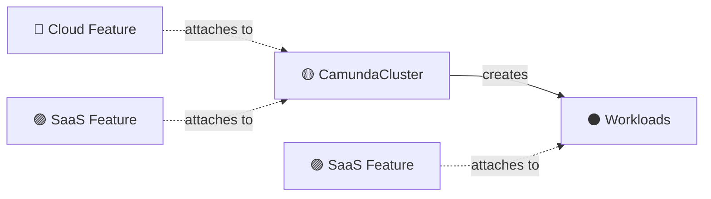

_🟡 core operator · 🔵 cloud operator · 🟣 saas operator · ⚫ external_

Instead of the core CR orchestrating features top-down, features extend the workload from the outside. The
core CR describes the orchestration cluster. All features discover it and augment it.

This mirrors how the Kubernetes ecosystem works. cert-manager writes Secrets. HPA patches replicas on a Deployment.
Neither goes through a central coordinator. Controllers attach themselves to resources and extend them in small,
well-scoped ways.

### How Features Connect to the Core

Features connect to the core through three mechanisms:

**1. Explicit inputs for immutable concerns (before creation)**


_🟡 core operator · 🔵 cloud operator · ⚫ external_

Some configuration must be known before a resource is created because it cannot be changed afterward. The primary
example is storage class names on StatefulSet PVC templates. These are genuinely separate lifecycle steps:

- Create `EncryptedVolume` -> it provisions encrypted StorageClasses
- Create `CamundaCluster` with `spec.zeebe.storageClassName` and `spec.elasticsearch.storageClassName` pointing at those
  StorageClasses

The CamundaCluster doesn't know about encryption. It just takes a storage class name, the same field a self-managed user
would set to `"standard"` or `"gp3"`. Where that StorageClass came from is not its concern. Encryption is an optional
prerequisite for cluster creation, not a feature the cluster orchestrates.

**2. `clusterRef` and SSA-patching for runtime concerns (after creation)**


_🟡 core operator · 🟣 saas operator · ⚫ external_

Extensions reference CamundaCluster via `clusterRef` to read its spec (e.g. which components are active) and optionally
SSA-patch fields back onto it (e.g. scheduling policy, extra env vars). Each extension owns its own SSA field manager.
The core controller has no plugin interfaces or code dependencies on extensions.

To react to changes on the referenced CamundaCluster, extension controllers set up a watch on CamundaCluster with a
mapping function that resolves back to the referencing CR. A field indexer on `.spec.clusterRef.name` makes this an
O(1) lookup. This is the same pattern used throughout the Kubernetes ecosystem (e.g., Ingress controllers watching
Services). The extension controller never reconciles CamundaCluster itself, it only uses the watch as a trigger to
re-reconcile its own CR with the latest cluster state.

**3. Contract CRDs for cross-operator data passing**

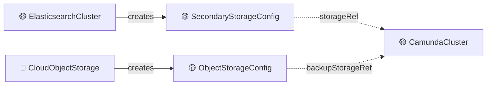
_🟡 core operator · 🔵 cloud operator_

Controllers pass structured data to each other through contract CRDs rather than direct references or shared fields.
Each contract CRD (`SecondaryStorageConfig`, `ObjectStorageConfig`, `DatabaseServerConfig`, `DatabaseConfig`) is a typed
interface that carries connection details, credentials, and configuration. The producing controller creates the contract
CR; the consuming controller reads it via a named reference. This decouples operators completely -- the core operator
reads an `ObjectStorageConfig` without knowing whether it was created by `CloudObjectStorage`, a Crossplane composite,
or a user applying a manifest by hand.

## Target Architecture

### The Operators

The architecture splits into three operators, each managing a distinct set of CRDs.

- camunda-operator
- camunda-cloud-operator
- camunda-saas-operator

They connect exclusively through CRDs and status fields. Each operator is unaware of the layer above it:
`camunda-operator` has no knowledge of `camunda-cloud-operator`, and the cloud operator has no knowledge of
`camunda-saas-operator`.

> [!NOTE] 
> The graphs include planned future features (RDBMS support via CloudDatabaseServer/Database, restore
> controllers, management plane CRDs) that do not yet exist in the camunda-operator but are features Camunda supports.

#### camunda-operator

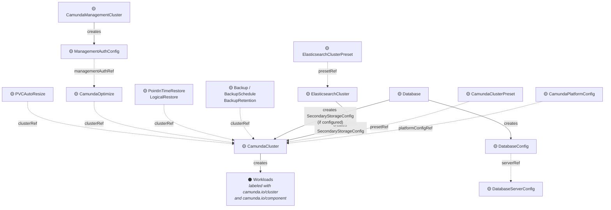

_🟡 core operator ⚫ external_

Manages the core platform: cluster lifecycle, presets, platform config, storage backends, backup/restore, Optimize, and
the management plane. The cloud operator creates `CamundaCluster` and `CamundaManagementCluster` CRs that this operator
reconciles. The saas operator SSA-patches workloads created by this operator.

#### camunda-cloud-operator

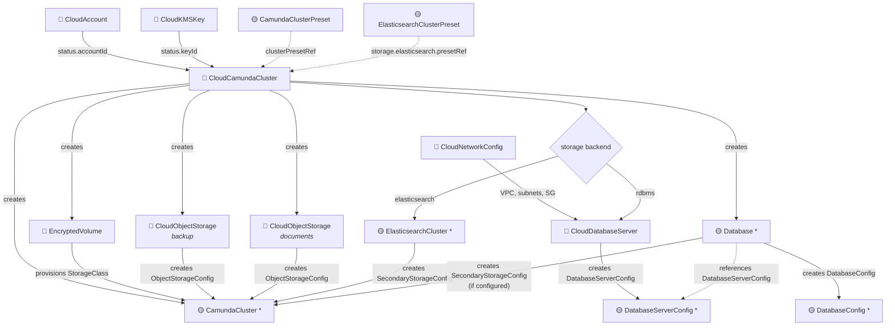

_🟡 core operator · 🔵 cloud operator · ⚫ external_

Manages cloud infrastructure: accounts, network config, encryption, storage, cloud databases, and the composition layers
(CloudCamundaCluster, CloudCamundaManagementCluster). Creates core operator CRs but doesn't reconcile their internals.

#### camunda-saas-operator

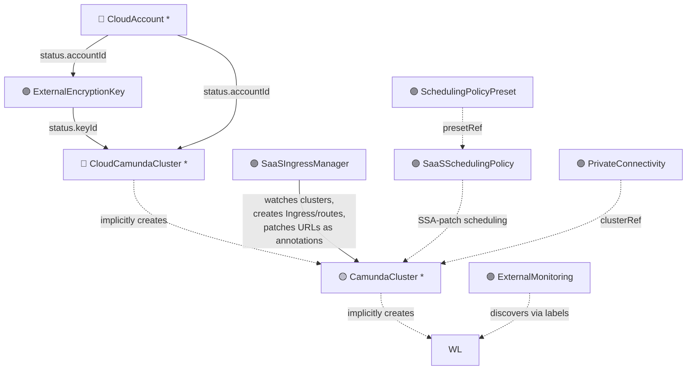

_🟡 core operator · 🔵 cloud operator · 🟣 saas operator · ⚫ external_

Manages SaaS platform extensions: BYOK encryption keys, saas ingress management, scheduling policies, private
connectivity, and external monitoring. These controllers are fully independent. They discover workloads created by the
core operator via label selectors or CamundaCluster references and attach to them via SSA-patching. None have ordering
dependencies on each other or on the core/cloud operators.

### Deployment Models

Users (and camunda) can run these operators in parallel depending on use case.

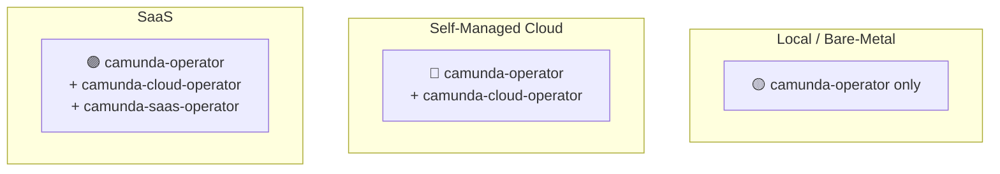

_🟡 core operator · 🔵 cloud operator · 🟣 saas operator · ⚫ external_

Each layer is additive:

- **Local / bare-metal**: camunda-operator only. For local development, on-prem, or custom setups without cloud provider
  integration.
- **Self-managed cloud**: camunda-operator + camunda-cloud-operator. For self-managed deployments on AWS, GCP, or Azure
  where you want operator-managed cloud infrastructure (encrypted volumes, cloud databases, cloud object storage).
- **SaaS**: camunda-operator + camunda-cloud-operator + camunda-saas-operator. Adds SaaS platform extensions (ingress
  management, scheduling policies, private connectivity, external monitoring, BYOK encryption).

### Information Flow

There are two categories of cloud features (**prerequisites** and **extensions**) with different information flow
patterns:

**Prerequisites** (must complete before CamundaCluster creation):

| From                 | To                                       | Mechanism                                                  | Required?                                         |
| -------------------- | ---------------------------------------- | ---------------------------------------------------------- | ------------------------------------------------- |
| CloudAccount         | EncryptedVolume, CloudObjectStorage      | Status field (`accountId`)                                 | No (only if cloud features needed)                |
| CloudNetworkConfig   | CloudDatabaseServer, PrivateConnectivity | Status fields (VPC, subnets, security groups)              | No (only if cloud infrastructure needed)          |
| EncryptedVolume      | CamundaCluster spec                      | Provisions StorageClass, name referenced in CamundaCluster | No (only if custom encryption needed)             |
| CloudDatabaseServer  | Database                                 | DatabaseServerConfig CR (server connection details)        | No (local/bare-metal provisions DB manually)      |
| Database             | CamundaCluster                           | DatabaseConfig CR + optionally SecondaryStorageConfig CR   | No (can create database config manually)          |
| ElasticsearchCluster | CamundaCluster                           | SecondaryStorageConfig CR                                  | No (can create secondary storage config manually) |

**Extensions** (attach to running workloads or provide optional config):

| From                 | To                  | Mechanism                                                                       | Required?      |
| -------------------- | ------------------- | ------------------------------------------------------------------------------- |----------------|
| CloudObjectStorage   | CamundaCluster      | ObjectStorageConfig CR referenced via `backupStorageRef` / `documentStorageRef` | No             |
| SaaSSchedulingPolicy | CamundaCluster      | SSA-patch: `scheduling` fields on per-component specs                           | No (SaaS only) |
| SaaSIngressManager   | CamundaCluster      | Watches clusters, creates Ingresses, SSA-patches URLs as annotations            | No (SaaS only) |
| PrivateConnectivity  | CamundaCluster      | Discovers via clusterRef, manages VPC endpoints                                 | No (SaaS only) |
| ExternalMonitoring   | Workloads           | Discovers via labels, scrapes metrics                                           | No             |

Every cloud feature is optional. The CamundaCluster controller works without any of them.

### Reconciliation Independence

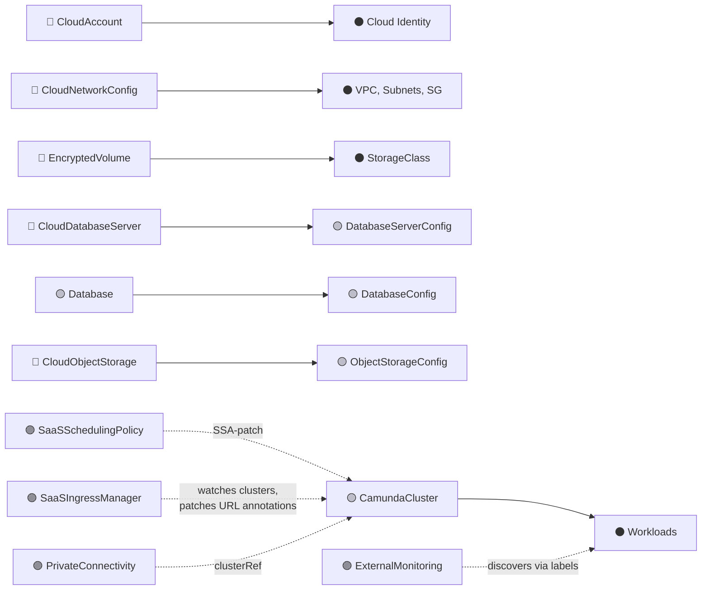

_🟡 core operator · 🔵 cloud operator · 🟣 saas operator · ⚫ external_

Each row is an independent reconciliation loop. No controller blocks another. Solid arrows create resources; dotted
arrows read or attach without blocking the target. The sequencing between prerequisites and CamundaCluster creation is
handled by the composition layer (CloudCamundaCluster), not by the individual controllers.

### SaaS Control Plane Flow

The SaaS control plane's interaction with the operator is minimal. It creates 4-5 resources for basic cluster creation
and does not interact with Database, CloudObjectStorage, EncryptedVolume, or any internal building blocks.
CloudCamundaCluster handles all internal orchestration.

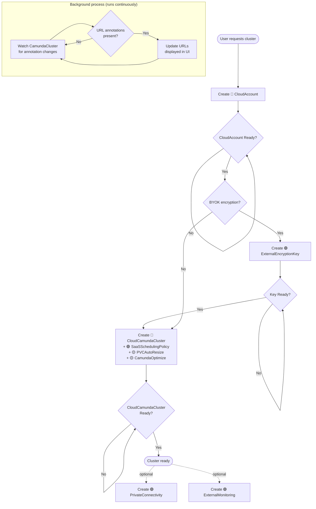

_🟡 core operator · 🔵 cloud operator · 🟣 saas operator_

The control plane creates a `CloudAccount` (step 1), optionally an `ExternalEncryptionKey` for BYOK (step 2), then a
`CloudCamundaCluster`, `SaaSSchedulingPolicy`, `PVCAutoResize`, and `CamundaOptimize` (step 3). The `SaaSIngressManager`
(a cluster-scoped singleton) watches all clusters and patches URL annotations onto `CamundaCluster`. The control
plane reads these annotations (step 4) to determine cluster endpoints. After creation, `PrivateConnectivity` and
`ExternalMonitoring` can be added optionally.

---

### Operator CRD List

List of CRDs

**camunda-operator** (core platform):

| CRD                                       | Scope     | Purpose                                           |
| ----------------------------------------- | --------- | ------------------------------------------------- |
| CamundaPlatformConfig                     | Cluster   | Shared OIDC, license, image registry              |
| CamundaClusterPreset                      | Cluster   | Standardized cluster sizing                       |
| CamundaCluster                            | Namespace | Core orchestration cluster                        |
| ElasticsearchClusterPreset                | Cluster   | Standardized ES sizing                            |
| ElasticsearchCluster                      | Namespace | Manages ES for secondary storage                  |
| Database                                  | Cluster   | Bootstraps logical databases and users            |
| DatabaseServerConfig                      | Cluster   | Contract: database server connection details      |
| DatabaseConfig                            | Cluster   | Contract: logical database connection details     |
| SecondaryStorageConfig                    | Cluster   | Contract: secondary storage for CamundaCluster    |
| ObjectStorageConfig                       | Cluster   | Contract: bucket storage for backups/documents    |
| Backup / BackupSchedule / BackupRetention | Namespace | Backup lifecycle                                  |
| PointInTimeRestore / LogicalRestore       | Namespace | Restore operations                                |
| CamundaOptimize                           | Namespace | Optimize deployment                               |
| CamundaManagementCluster                  | Cluster   | Management plane (Console, Web Modeler, Identity) |
| ManagementAuthConfig                      | Cluster   | Contract: Management Identity OIDC configuration  |
| PVCAutoResize                             | Namespace | PVC auto-resize annotations for topolvm           |

**camunda-cloud-operator** (cloud infrastructure):

| CRD                           | Scope   | Purpose                                                |
| ----------------------------- | ------- | ------------------------------------------------------ |
| CloudAccount                  | Cluster | Cloud provider IAM identity                            |
| CloudNetworkConfig            | Cluster | VPC, subnets, security groups (discovered or explicit) |
| CloudKMSKey                   | Cluster | Cloud-managed encryption keys                          |
| EncryptedVolume               | Cluster | Encrypted StorageClass provisioning                    |
| CloudObjectStorage            | Cluster | Cloud bucket provisioning                              |
| CloudDatabaseServer           | Cluster | Managed database server provisioning                   |
| CloudDatabaseServerPreset     | Cluster | Standardized RDBMS server sizing                       |
| CloudCamundaCluster           | Cluster | Composition layer for cloud clusters                   |
| CloudCamundaManagementCluster | Cluster | Composition layer for cloud management plane           |

**camunda-saas-operator** (SaaS platform extensions):

| CRD                    | Scope     | Purpose                                        |
| ---------------------- | --------- | ---------------------------------------------- |
| SchedulingPolicyPreset | Cluster   | Default scheduling rules per cloud environment |
| SaaSSchedulingPolicy   | Namespace | Patches scheduling fields on CamundaCluster    |
| ExternalEncryptionKey  | Cluster   | BYOK encryption key management                 |
| SaaSIngressManager     | Cluster   | Automatic ingress creation for all clusters    |
| PrivateConnectivity    | Namespace | VPC endpoints for private access               |
| ExternalMonitoring     | Namespace | OTel Collector and monitoring setup            |

The test for the split: can you run the previous layer without the next one? Yes at every boundary. Local and bare-metal
setups work with just camunda-operator. Self-managed cloud works with camunda-operator + camunda-cloud-operator. SaaS
adds camunda-saas-operator for platform-level extensions.

### Complete Overview

The following diagrams show how everything fits together.

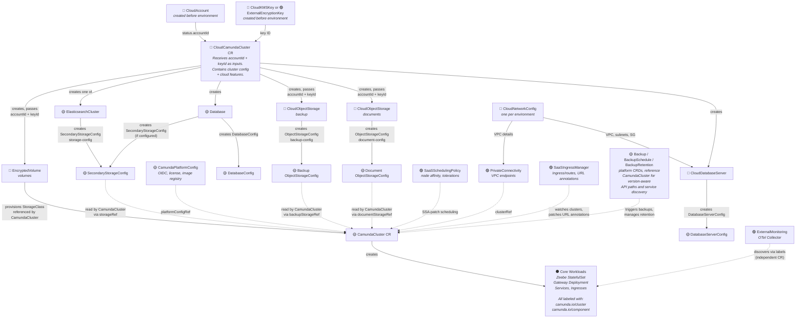

_🟡 core operator · 🔵 cloud operator · 🟣 saas operator · ⚫ external_

### Replacement for current operator

The following diagram shows only the CRDs required to fully replace the current operator:

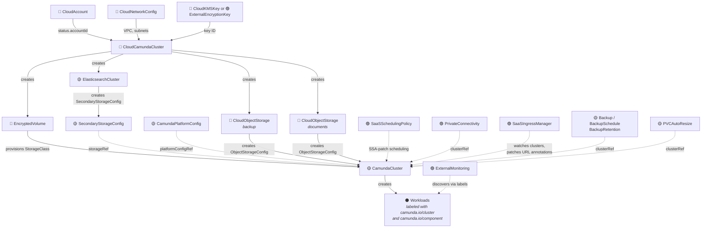

_🟡 core operator · 🔵 cloud operator · 🟣 saas operator · ⚫ external_

### Self-Managed (minimal)

Example of a minimal setup a user could do with the core camunda-operator.

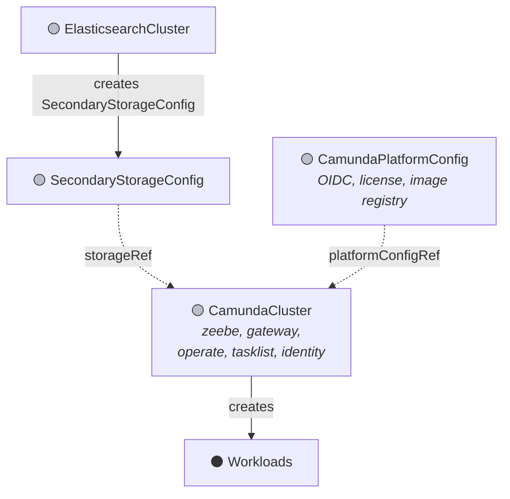

### All Operators Combined

```mermaid
graph TB
    subgraph cloud ["camunda-cloud-operator"]
        CDBSP["🔵 CloudDatabaseServerPreset"]
        CA["🔵 CloudAccount"]
        CNC["🔵 CloudNetworkConfig"]
        CKMS["🔵 CloudKMSKey"]
        CCE["🔵 CloudCamundaCluster"]
        CCMC2["🔵 CloudCamundaManagementCluster"]
        CDBS["🔵 CloudDatabaseServer"]
        ESTOR["🔵 EncryptedVolume"]
        RS["🔵 CloudObjectStorage"]

        CA -->|"status.accountId"| CCE
        CNC -->|"VPC, subnets, SG"| CDBS
    end

    subgraph core ["camunda-operator"]
        PFC["🟡 CamundaPlatformConfig"]
        CCP["🟡 CamundaClusterPreset"]
        CC["🟡 CamundaCluster"]
        ESCP["🟡 ElasticsearchClusterPreset"]
        ESC["🟡 ElasticsearchCluster"]
        DB["🟡 Database"]
        DBSC["🟡 DatabaseServerConfig"]
        DBC["🟡 DatabaseConfig"]
        BK["🟡 Backup / BackupSchedule<br/>BackupRetention"]
        RST["🟡 PointInTimeRestore<br/>LogicalRestore"]
        OPT["🟡 CamundaOptimize"]
        CMC["🟡 CamundaManagementCluster"]
        MAC["🟡 ManagementAuthConfig"]
        PAR["🟡 PVCAutoResize"]

        PFC -.->|platformConfigRef| CC
        ESCP -.->|presetRef| ESC
        ESC -->|"creates SecondaryStorageConfig"| CC
        CC -->|creates| WL["⚫ Workloads<br/><i>labeled with camunda.io/cluster<br/>and camunda.io/component</i>"]
        BK -.->|clusterRef| CC
        RST -.->|clusterRef| CC
        OPT -.->|clusterRef| CC
        OPT -.->|managementAuthRef| MAC
        PAR -.->|clusterRef| CC
        CMC -->|"creates"| MAC
        DB -->|"creates"| DBC
        DBC -.->|serverRef| DBSC
    end

    subgraph saas ["camunda-saas-operator"]
        EEK["🟣 ExternalEncryptionKey"]
        IM["🟣 SaaSIngressManager"]
        SPPR["🟣 SchedulingPolicyPreset"]
        CSP["🟣 SaaSSchedulingPolicy"]
        PC["🟣 PrivateConnectivity"]
        EM["🟣 ExternalMonitoring"]
    end

    CCE -->|creates| ESTOR
    CCE -->|creates| RS
    CCE -->|"creates one of"| ESC
    CCE -->|creates| CDBS
    CCE -->|creates| DB
    CCE -->|creates| CC
    ESTOR -->|"provisions StorageClass"| CC
    RS -->|"creates ObjectStorageConfig"| CC
    CDBS -->|"creates DatabaseServerConfig"| DBSC
    DB -->|"creates DatabaseConfig"| DBC
    DB -->|"creates SecondaryStorageConfig<br/>(if configured)"| CC

    CSP -.->|"SSA-patch scheduling"| WL
    PC -.->|clusterRef| CC
    EM -.->|"discovers via labels"| WL

    cloud ~~~ core ~~~ saas
```

_🟡 core operator · 🔵 cloud operator · 🟣 saas operator · ⚫ external_

---

## Proposed CRD Design

This section walks through every CRD across all three operators: core platform (1-9), cloud infrastructure (10-18), and
SaaS extensions (19-23). Each CRD description includes its spec, what it creates, and how it connects to other CRDs.

<details>
<summary><h3>1. Platform Config: CamundaPlatformConfig</h3></summary>

Shared platform settings (OIDC provider, license, image registry, etc.) are defined in a cluster-scoped
`CamundaPlatformConfig` CRD. Each CamundaCluster references one via `platformConfigRef`, allowing multiple clusters to
share the same configuration without duplicating it.

```yaml
apiVersion: camunda.io/v1
kind: CamundaPlatformConfig # cluster-scoped, one per environment
metadata:
  name: default
spec:
  # OIDC provider configuration, supports any OIDC-compliant IdP
  auth:
    method: oidc # basic | oidc
    oidc:
      issuerUrl: "https://login.example.com/realms/camunda"
      issuerBackendUrl: "https://login.internal.svc.cluster.local/realms/camunda" # optional, for split-horizon DNS
      jwksUrl: "https://login.example.com/realms/camunda/protocol/openid-connect/certs"
      tokenUrl: "https://login.example.com/realms/camunda/protocol/openid-connect/token"
      authUrl: "https://login.example.com/realms/camunda/protocol/openid-connect/auth"

      # Default OIDC client credentials, shared across all clusters
      # Can be overridden per-preset or per-cluster
      clientId: "camunda-orchestration"
      audience: "camunda-orchestration"
      clientSecretRef:
        name: "oidc-credentials"
        namespace: "camunda-system"
        key: "client-secret"

  # License
  licenseSecretRef:
    name: "camunda-license"
    namespace: "camunda-system"
    key: "license-key"

  # Default image registry for Camunda components
  imageRegistry: "registry.example.com/camunda"
```

- **Auth is provider-agnostic.** The fields match the standard OIDC discovery spec: issuer, JWKS, token, auth endpoints.
  Works with Keycloak, Auth0, Entra, Okta, or any OIDC provider.
- **OIDC client credentials default here**, shared across all clusters (matching how SaaS works, one client for the
  environment). Presets and individual CamundaClusters can override with per-cluster credentials if needed.
- **License and image registry** are shared, and you don't want to repeat these on every cluster.
- **Updatable at runtime**: the operator watches this CRD. Changing the image registry or OIDC endpoints propagates to
  all clusters without restarting the operator.

</details>

<details>
<summary><h3>2. Contract CRDs</h3></summary>

Contract CRDs are typed interfaces between operators. They carry connection details, credentials, and configuration from
one component to another without coupling the controllers. Each contract CRD is created by a specific controller
(referenced below) or manually by self-managed users who provision their own infrastructure.

#### SecondaryStorageConfig

`SecondaryStorageConfig` is the contract for the database backend (Elasticsearch or RDBMS):

```yaml
apiVersion: camunda.io/v1
kind: SecondaryStorageConfig # cluster-scoped
metadata:
  name: my-storage-config
spec:
  type: elasticsearch # elasticsearch | rdbms
  elasticsearch:
    endpoint: "https://my-es-cluster:9200"
    # Secret must contain keys matching usernameKey and passwordKey.
    # Values are plaintext strings. User needs read/write access to indices.
    credentialsSecretRef:
      name: "es-credentials"
      namespace: "camunda-cluster-ns"
      usernameKey: "username"
      passwordKey: "password"
  # Optional for RDBMS
  # rdbms:
  #   databaseConfigRef: "my-camunda-db"  # references a DatabaseConfig CR
```

When `type` is `rdbms`, connection details come from a [`DatabaseConfig`](#16-database-database) CR via
`databaseConfigRef`. The optional `backupCredentialsSecretRef` provides a separate database user with backup/restore
privileges (pg_dump/pg_restore).

Created by [`ElasticsearchCluster`](#4-elasticsearch-cluster-elasticsearchcluster) or
[`Database`](#16-database-database) when `secondaryStorageConfig` is configured. Can also be created manually.

#### ObjectStorageConfig

`ObjectStorageConfig` is the contract for bucket storage (backup, documents):

```yaml
apiVersion: camunda.io/v1
kind: ObjectStorageConfig # cluster-scoped
metadata:
  name: my-backup-config
spec:
  provider: aws # aws | gcp | azure
  type: S3 # S3 | GCS | AzureBlob
  bucketId: "arn:aws:s3:::my-cluster-backup-bucket"
  bucketName: "my-cluster-backup-bucket"
  basePath: "backups"
  accountId: "arn:aws:iam::123456789012:role/my-zeebe-role"
```

Created by [`CloudObjectStorage`](#14-cloud-object-storage-cloudobjectstorage). Can also be created manually.

#### DatabaseServerConfig

`DatabaseServerConfig` provides the connection details for a managed database server instance. It is referenced by
`Database` CRs (which create databases in a server) to connect to the server using credentials with permission to create
databases:

```yaml
apiVersion: camunda.io/v1
kind: DatabaseServerConfig # cluster-scoped
metadata:
  name: my-db-server
spec:
  engine: postgres # postgres | oracle | mariadb
  host: "my-db-server.abc123.us-east-1.rds.amazonaws.com"
  port: 5432
  # Secret must contain keys matching usernameKey and passwordKey.
  # This is the user used by the Database controller to bootstrap databases and users.
  adminCredentialsSecretRef:
    name: "db-admin-credentials"
    namespace: "camunda-system"
    usernameKey: "username"
    passwordKey: "password"
  # When WAL is enabled, point in time recovery can be done via restore controller
  # back to at most retention period.
  pitr:
    enabled: true
    retentionPeriodDays: 7
```

Created by [`CloudDatabaseServer`](#15-cloud-database-server-clouddatabaseserver). Can also be created manually for
self-managed database servers.

#### DatabaseConfig

`DatabaseConfig` provides the connection details for a specific logical database:

```yaml
apiVersion: camunda.io/v1
kind: DatabaseConfig # cluster-scoped
metadata:
  name: my-camunda-db
spec:
  serverRef: "my-db-server" # references a DatabaseServerConfig
  databaseName: "camunda"
  # Secret must contain keys matching usernameKey and passwordKey.
  # This is the application user with read/write access to databaseName.
  credentialsSecretRef:
    name: "db-app-credentials"
    namespace: "camunda-system"
    usernameKey: "username"
    passwordKey: "password"
  # optional: user with backup/restore permissions
  backupCredentialsSecretRef:
    name: "db-backup-credentials"
    namespace: "camunda-system"
    usernameKey: "username"
    passwordKey: "password"
```

Created by [`Database`](#16-database-database). Can also be created manually.

#### ManagementAuthConfig

ManagementAuthConfig contains the Management Identity OIDC configuration needed by components outside the Orchestration
Cluster (Optimize, Console, Web Modeler). It is created by the Created by
[`CamundaManagementCluster`](#9-management-plane-camundamanagementcluster). controller as output. In SaaS, this CR is
shipped directly per environment on saas operator deployments and does not require a management cluster.

```yaml
apiVersion: camunda.io/v1
kind: ManagementAuthConfig # cluster-scoped
metadata:
  name: management-auth
spec:
  # Management Identity service URL
  baseUrl: "https://identity.camunda.example.com"

  # OIDC endpoints
  issuerUrl: "https://identity.camunda.example.com/auth/realms/camunda-platform"
  issuerBackendUrl: "https://identity.internal.svc.cluster.local/auth/realms/camunda-platform"
  tokenUrl: "https://identity.camunda.example.com/auth/realms/camunda-platform/protocol/openid-connect/token"
  jwksUrl: "https://identity.camunda.example.com/auth/realms/camunda-platform/protocol/openid-connect/certs"

  # Default M2M client credentials
  clientId: "camunda-management"
  audience: "camunda-management"
  clientSecretRef:
    name: "management-auth-secret"
    namespace: "camunda-system"
    key: "client-secret"
```

Referenced by `CamundaOptimize` via `managementAuthRef`. Components use these OIDC endpoints to validate tokens and
acquire M2M credentials for inter-component communication within the management plane.

</details>

<details>
<summary><h3>3. The Core CR: CamundaCluster</h3></summary>

The core orchestration cluster CR moves to a neutral API group (`camunda.io`) and separates itself from cloud-specific
concerns. It is a self-contained description of a Camunda orchestration cluster that can be deployed in any environment:
cloud, on-prem, or local development.

The CR gives the user full control over deployment topology. Each Camunda application can run **embedded** (inside
another application's process) or **standalone** (its own Deployment). All apps share the same binary and config model,
and the only difference is which Spring profiles are activated. This means the topology is a configuration choice, not a
hard-coded layout.

**Zeebe** is always required and always standalone (it's a StatefulSet). The **gateway**, **operate**, **tasklist**, and
**identity** can each be embedded or standalone. When embedded, they run inside the nearest standalone application up
the chain: if gateway is standalone, embedded apps run inside it; if gateway is also embedded, they run inside zeebe.
**Connectors** are always standalone when enabled.

This makes the CR flexible enough to support any deployment model:

- **All-in-one**: everything embedded in zeebe (simplest, good for development)
- **Zeebe + Gateway**: gateway runs standalone with operate/tasklist/identity embedded (balanced, current 8.9 default)
- **Fully separated**: each app as its own Deployment (maximum control over scaling and resources)
- **Any mix**: operate standalone but tasklist embedded, etc.

#### Version-aware rendering

`CamundaCluster` supports all actively deployed Camunda versions. The CRD shape is the same regardless of version; the
controller handles version-specific differences during manifest rendering.

For pre-8.9 clusters (which predate the unified binary and embedded mode), the controller:

- Sets all components to `mode: Standalone` (each component runs as its own Deployment with its own image)
- Selects the correct per-component container images for the target version
- Maps the known configuration (resources, replicas, env vars) to the appropriate per-component manifests

Version-agnostic concerns work identically across all versions:

- Auth configuration flows from `CamundaPlatformConfig` regardless of version
- `ObjectStorageConfig` and `SecondaryStorageConfig` contract CRDs are version-agnostic
- Cloud infrastructure (`EncryptedVolume`, `CloudObjectStorage`, etc.) is independent of application version

**Optimize** is not part of CamundaCluster. It belongs to the management plane (alongside Console and Web Modeler), uses
a separate auth system (Management Identity), and has a different deployment lifecycle. It is managed by its own
`CamundaOptimize` CRD.

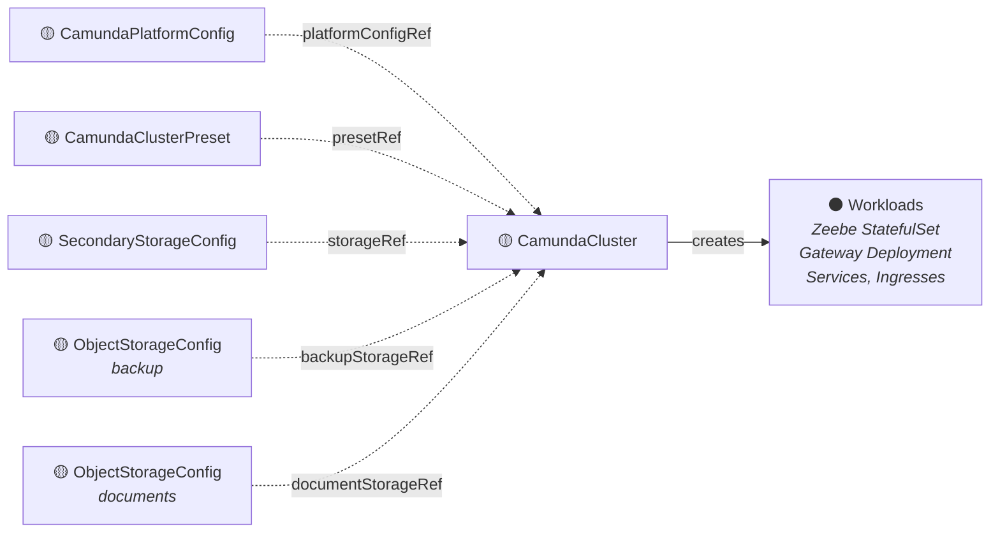

#### Cluster Presets

Cluster presets are defined as their own CRDs, specifically `CamundaClusterPreset`:

```yaml
apiVersion: camunda.io/v1
kind: CamundaClusterPreset # cluster-scoped
metadata:
  name: medium
spec:
  # Reuses the CamundaCluster.Spec type directly
  cluster:
    version: "8.9.0"

    podLabels:
      company.com/team: "automation-ops"
    podAnnotations:
      company.com/cluster-preset: "medium"

    zeebe:
      replicas: 3
      partitions: 3
      replicationFactor: 3
      resources:
        requests: { cpu: "1", memory: "2Gi" }
      storageClassName: "ssd"
      storageSize: "32Gi"
      extraEnv:
        - name: JAVA_OPTS
          value: "-Xmx4g"
      extraEnvFrom:
        - configMapRef:
            name: "zeebe-overrides"
      # scheduling:
      #   nodeAffinity: { ... }
      #   tolerations: [ ... ]

    gateway:
      mode: Standalone
      replicas: 2
      resources:
        requests: { cpu: "500m", memory: "1Gi" }
      # scheduling:
      #   nodeAffinity: { ... }
      #   tolerations: [ ... ]

    operate:
      mode: Embedded

    tasklist:
      mode: Embedded

    identity:
      mode: Embedded

    connectors:
      replicas: 1
      resources:
        requests: { cpu: "250m", memory: "512Mi" }

  # PVC auto-resize configuration (outside the cluster spec so types stay separate).
  # When set, the preset controller creates a PVCAutoResize CR for clusters referencing this preset.
  # autoResize:
  #   storageLimit: "100Gi"
  #   threshold: "20%"
  #   increase: "10Gi"
```

A CamundaCluster can use either a preset, an inline component config, or both (for certain fields).

```yaml
# Option A: preset only
spec:
  platformConfigRef: "default"
  presetRef: "medium"
  version: "8.10.0"            # optional -- overrides the preset's version

# Option B: preset + per-cluster overrides
spec:
  platformConfigRef: "default"
  presetRef: "medium"
  version: "8.10.0"
  zeebe:
    replicas: 5                # override preset's replica count
    resources:
      requests:
        memory: "8Gi"          # override preset's memory request
    extraEnv:
      - name: JAVA_OPTS
        value: "-Xmx6g"

# Option C: full inline config (no preset)
spec:
  platformConfigRef: "default"
  version: "8.9.0"
  zeebe:
    replicas: 3
    # ...
  gateway:
    mode: Standalone
    # ...
```

Presets define the full component configuration as a baseline. Per-component overrides use pointer fields for sizing
(replicas, resources, storage) and slice fields for env vars. A small, intentional surface limited to fields that
commonly vary per-cluster. Absent override fields use the preset value; present fields replace it. The `scheduling`
field is an exception: if set on the CamundaCluster, it replaces the preset's scheduling entirely (no merge), since
partial scheduling overrides are error-prone. Full inline config remains available for clusters that don't fit any
preset.

**Presets** enable platform teams to define standardized cluster sizes as `CamundaClusterPreset` CRDs. The presets can
also define PVC auto-resize configuration; when auto-resize is configured in a preset, the preset controller
automatically creates a `PVCAutoResize` CR for clusters that reference it.

#### Full CamundaCluster Spec

The full CamundaCluster spec (inline mode):

```yaml
apiVersion: camunda.io/v1
kind: CamundaCluster
metadata:
  name: my-cluster
  namespace: my-cluster-ns
spec:
  platformConfigRef: "default" # references CamundaPlatformConfig
  version: "8.9.0"

  # External URL -- deterministic, set by the creator before the cluster exists.
  # Used for OIDC redirect URLs and application config.
  # The operator does NOT create Ingress resources -- users or SaaS ingress manager handle that.
  externalUrl: "https://my-cluster.camunda.example.com"

  # Service account annotations for workload identity (IRSA, GCP Workload Identity, etc.)
  # serviceAccount:
  #   annotations:
  #     eks.amazonaws.com/role-arn: "arn:aws:iam::123456789012:role/my-zeebe-role"

  # Per-cluster OIDC client credentials (optional -- overrides platform config defaults)
  # If not set, uses auth from CamundaPlatformConfig
  # auth:
  #   clientId: "my-cluster-client"
  #   audience: "my-cluster-client"
  #   clientSecretRef:
  #     name: "my-cluster-oidc-secret"
  #     key: "client-secret"

  zeebe:
    # Optional: override the StatefulSet name for zeebe.
    # If not set, derived from the CamundaCluster name.
    # Required during migration to match the existing StatefulSet name
    # so that existing PVCs (named <sts-name>-<ordinal>) re-attach automatically.
    # statefulSetName: "my-existing-sts-name"
    replicas: 3 # Could also be pointers at some point if we create a rebalancing/scaling controller in the future
    partitions: 3
    replicationFactor: 3
    resources: { ... }
    storageClassName: "ssd"
    storageSize: "32Gi"
    extraEnv: # optional, individual env vars
      - name: JAVA_OPTS
        value: "-Xmx4g"
    extraEnvFrom: # optional, bulk env from ConfigMap/Secret
      - configMapRef:
          name: "zeebe-overrides"
    # podAnnotations: {}
    # podLabels: {}
    # scheduling:
    #   nodeAffinity: { ... }
    #   tolerations: [ ... ]
    #   podAffinity: { ... }

  gateway:
    mode: Standalone # Standalone | Embedded
    replicas: 2 # pointers in case someone wants to deploy HPA
    resources: { ... }
    # extraEnv: []
    # extraEnvFrom: []
    # podAnnotations: {}
    # podLabels: {}
    # scheduling:
    #   nodeAffinity: { ... }
    #   tolerations: [ ... ]
    #   podAffinity: { ... }

  operate:
    mode: Embedded # runs inside gateway (since gateway is Standalone)
    # replicas: 2
    # resources: { ... }
    # extraEnv: []
    # extraEnvFrom: []
    # podAnnotations: {}
    # podLabels: {}
    # scheduling:
    #   nodeAffinity: { ... }
    #   tolerations: [ ... ]
    #   podAffinity: { ... }

  tasklist:
    mode: Embedded # runs inside gateway
    # replicas: 2
    # resources: { ... }
    # extraEnv: []
    # extraEnvFrom: []
    # podAnnotations: {}
    # podLabels: {}
    # scheduling:
    #   nodeAffinity: { ... }
    #   tolerations: [ ... ]
    #   podAffinity: { ... }

  identity:
    mode: Embedded # runs inside gateway
    # replicas: 2
    # resources: { ... }
    # extraEnv: []
    # extraEnvFrom: []
    # podAnnotations: {}
    # podLabels: {}
    # scheduling:
    #   nodeAffinity: { ... }
    #   tolerations: [ ... ]
    #   podAffinity: { ... }

  connectors:
    replicas: 2
    resources: { ... }
    # extraEnv: []
    # extraEnvFrom: []
    # podAnnotations: {}
    # podLabels: {}
    # scheduling:
    #   nodeAffinity: { ... }
    #   tolerations: [ ... ]
    #   podAffinity: { ... }

  # Top-level extra config applied to ALL workloads.
  # Allows users to provide a single configuration across apps.
  # extraEnv: []
  # extraEnvFrom: []
  # podAnnotations: {}
  # podLabels: {}
  # scheduling:
  #   nodeAffinity: { ... }
  #   tolerations: [ ... ]
  #   podAffinity: { ... }

  # Storage backend references a SecondaryStorageConfig (cluster-scoped)
  storageRef: "my-storage-config" # required

  # Optional bucket storage references ObjectStorageConfig CRs (cluster-scoped)
  backupStorageRef: "my-backup-config"
  # documentStorageRef: "my-document-config"

  # Optional: create ServiceMonitors for Prometheus scraping.
  # When enabled, the operator creates a ServiceMonitor per standalone component.
  # monitoring:
  #   serviceMonitor:
  #     enabled: true
  #     labels: {}          # extra labels applied to all ServiceMonitors
  #     annotations: {}     # extra annotations applied to all ServiceMonitors

  suspend: false # scale down workloads
  pause: false # pause reconciliation on this cluster

status:
  # Conditions are the primary status mechanism.
  # One condition per standalone component, plus an aggregate Ready condition.
  conditions:
    # One condition per standalone component (embedded apps don't get their own)
    - type: ZeebeReady
      status: "True"
      reason: Healthy
      message: "All 3 zeebe replicas are ready"
    - type: GatewayReady # includes embedded operate/tasklist/identity
      status: "True"
      reason: Healthy
      message: "All 2 gateway replicas are ready"
    - type: Ready
      status: "True"
      reason: Healthy

  observedGeneration: 5
```

The CamundaCluster status uses **conditions exclusively** for health reporting. One condition per standalone component,
plus an aggregate `Ready`. No custom health enums, no URL fields, no cloud-specific state.

Additional configuration is supplied through:

- **`platformConfigRef`**: references a `CamundaPlatformConfig` for shared settings (OIDC, license, image registry,
  ingress)
- **`presetRef`**: references a `CamundaClusterPreset` for standardized cluster sizing. Per-component sizing (replicas,
  resources) and env var fields can optionally override preset values
- **`extraEnv` / `extraEnvFrom`**: per-component and top-level env var overrides (Spring Boot precedence, no config
  merging)
- **`storageRef`**: **required** reference to a `SecondaryStorageConfig` CR (database backend). A CamundaCluster without
  secondary storage is not a full Camunda cluster, and users who only need the engine can deploy a StatefulSet directly
  (not supported).
- **`backupStorageRef`** / **`documentStorageRef`**: optional references to `ObjectStorageConfig` CRs (bucket storage)

</details>

<details>
<summary><h3>4. Elasticsearch Cluster: ElasticsearchCluster</h3></summary>

ElasticsearchCluster manages the full lifecycle of an Elasticsearch instance for use as secondary storage. It deploys an
ECK `Elasticsearch` CR, monitors its health, and creates a `SecondaryStorageConfig` CR with the ES connection details.

ElasticsearchCluster is an independent component with its own suspension lifecycle. It does not reference or depend on a
CamundaCluster. The `CloudCamundaCluster` composition layer can suspend both `CamundaCluster` and `ElasticsearchCluster`
through its own fields, but neither controls the other directly.

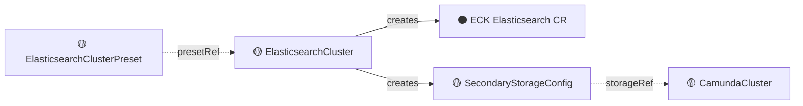

Like CamundaCluster, ElasticsearchCluster supports either a preset or inline config or a mix of the two. Presets can
also define PVC auto-resize configuration in the same fashion as the CamundaCluster presets.

**ElasticsearchClusterPreset:**

```yaml
apiVersion: camunda.io/v1
kind: ElasticsearchClusterPreset # cluster-scoped
metadata:
  name: standard
spec:
  # Reuses the ElasticsearchCluster.Spec type directly
  cluster:
    version: "8.16.0"
    replicas: 3
    resources:
      requests: { cpu: "1", memory: "2Gi" }
    storageSize: "64Gi"
    storageClassName: "ssd"
    # extraEnv: []
    # extraEnvFrom: []
    # podAnnotations: {}
    # podLabels: {}
    # scheduling:
    #   nodeAffinity: { ... }
    #   tolerations: [ ... ]
    #   podAffinity: { ... }

  # PVC auto-resize configuration (outside the cluster spec)
  # autoResize:
  #   storageLimit: "200Gi"
  #   threshold: "20%"
  #   increase: "20Gi"
```

**ElasticsearchCluster:**

```yaml
apiVersion: camunda.io/v1
kind: ElasticsearchCluster
metadata:
  name: my-cluster-es
  namespace: my-cluster-ns
spec:
  # Preset or inline config. When using a preset, per-cluster overrides
  # (replicas, resources, storageSize) are optional pointer fields.
  # presetRef: "standard"
  # version: "8.17.0"
  # replicas: 5               # optional -- overrides the preset's replica count
  # resources:                 # optional -- overrides the preset's resources
  #   requests: { memory: "4Gi" }

  # Inline config (if no preset)
  version: "8.16.0"
  replicas: 3
  resources:
    requests: { cpu: "1", memory: "2Gi" }
  storageSize: "64Gi"
  storageClassName: "ssd"
  # extraEnv: []
  # extraEnvFrom: []
  # podAnnotations: {}
  # podLabels: {}
  # scheduling:
  #   nodeAffinity: { ... }
  #   tolerations: [ ... ]
  #   podAffinity: { ... }

  # Optional: override the name of the ECK Elasticsearch CR to manage.
  # If not set, derived from the ElasticsearchCluster CR name.
  # Required during migration to match the existing ECK CR name.
  # eckResourceName: "my-existing-es-name"

  # Name of the SecondaryStorageConfig CR to create
  secondaryStorageConfig: "my-storage-config"

  # Optional: create ServiceMonitors for Prometheus scraping.
  # When enabled, the operator creates a ServiceMonitor per standalone component.
  # monitoring:
  #   serviceMonitor:
  #     enabled: true
  #     labels: {}          # extra labels applied to all ServiceMonitors
  #     annotations: {}     # extra annotations applied to all ServiceMonitors

  suspend: false

status:
  conditions:
    - type: Ready
      status: "True"
```

**Controller behavior:**

1. Deploys an ECK `Elasticsearch` CR with the specified version, replicas, resources, and storage
2. Monitors the ECK CR's health and reflects it in the ElasticsearchCluster conditions
3. Creates a `SecondaryStorageConfig` CR named `spec.secondaryStorageConfig` with the ES endpoint and auto-generated
   credentials
4. When `spec.suspend: true`, scales the ECK CR replicas to zero and reports `Suspended` condition

</details>

<details>
<summary><h3>5. PVC Auto-Resize: PVCAutoResize</h3></summary>

PVCAutoResize manages PVC auto-resize annotations for the topolvm pvc-autoresizer. It discovers Zeebe and Elasticsearch
PVCs by cluster labels and SSA-patches `resize.topolvm.io/*` annotations directly on PVC objects. Since StatefulSet PVC
templates are immutable after creation, the controller patches existing PVCs rather than relying on the template.

This follows the extension pattern: PVCAutoResize attaches to a cluster's PVCs from the outside without requiring
changes to the CamundaCluster or ElasticsearchCluster specs.

```yaml
apiVersion: camunda.io/v1
kind: PVCAutoResize
metadata:
  name: my-cluster-autoresize
  namespace: my-cluster-ns
spec:
  clusterRef:
    name: my-cluster
    # namespace: my-cluster-ns  # defaults to the CR's namespace if not set

  # Note: could also apply more generally via label selectors if desired
  zeebe:
    storageLimit: "100Gi"
    threshold: "20%"
    increase: "10Gi"

  elasticsearch:
    storageLimit: "200Gi"
    threshold: "20%"
    increase: "20Gi"

status:
  conditions:
    - type: Ready
      status: "True"
```

**Controller behavior:**

- Discovers PVCs by labels
- SSA-patches `resize.topolvm.io/storage_limit`, `resize.topolvm.io/threshold`, and `resize.topolvm.io/increase`
  annotations on each PVC
- Uses its own field manager (`PVCAutoResize/annotations`) so it only manages the auto-resize annotation fields
- Reconciles on config changes, updating annotations on existing PVCs

**Preset integration.** When a CamundaCluster or ElasticsearchCluster references a preset that includes auto-resize
configuration, the preset controller creates a `PVCAutoResize` CR in the cluster's namespace with the preset values.
This means users who use presets get auto-resize configured automatically without creating the CR manually.

</details>

<details>
<summary><h3>6. Backup System: Backup, BackupSchedule, BackupRetention</h3></summary>

The backup system is core platform functionality (`camunda.io` API group). In the current operator, the backup
controller works around not having direct access to the ZeebeCluster, leading to heuristics for determining API paths
and service endpoints.

In the proposed architecture, the backup CRDs **explicitly reference the CamundaCluster** they operate on. This gives
the controller access to the cluster's version, topology, and storage configuration, so it can determine the correct
backup procedures directly.

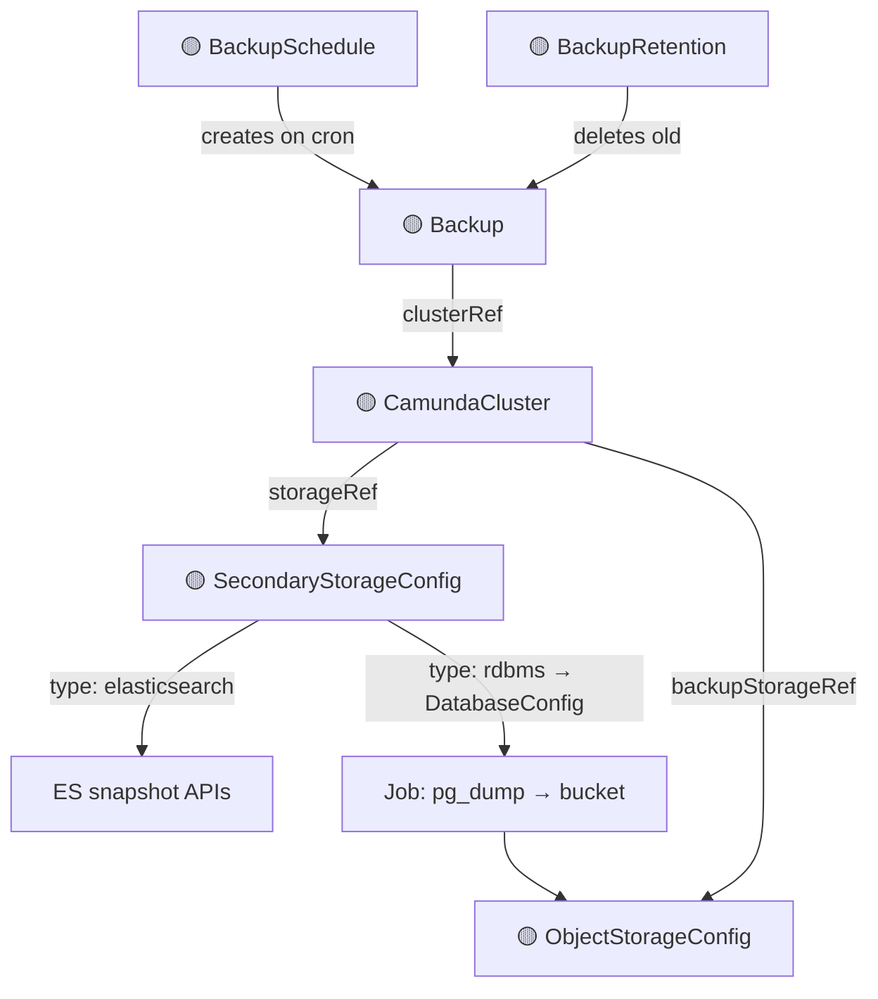

```yaml
apiVersion: camunda.io/v1
kind: Backup
metadata:
  name: my-cluster-backup-001
  namespace: my-cluster-ns
spec:
  clusterRef:
    name: my-cluster
    # namespace: my-cluster-ns  # defaults to the CR's namespace if not set

---
apiVersion: camunda.io/v1
kind: BackupSchedule
metadata:
  name: my-cluster-schedule
  namespace: my-cluster-ns
spec:
  clusterRef:
    name: my-cluster
    # namespace: my-cluster-ns  # defaults to the CR's namespace if not set
  schedule: "0 2 * * *" # cron expression

---
apiVersion: camunda.io/v1
kind: BackupRetention
metadata:
  name: my-cluster-retention
  namespace: my-cluster-ns
spec:
  clusterRef:
    name: my-cluster
    # namespace: my-cluster-ns  # defaults to the CR's namespace if not set
  retainedCount: 3
```

**Controller behavior:**

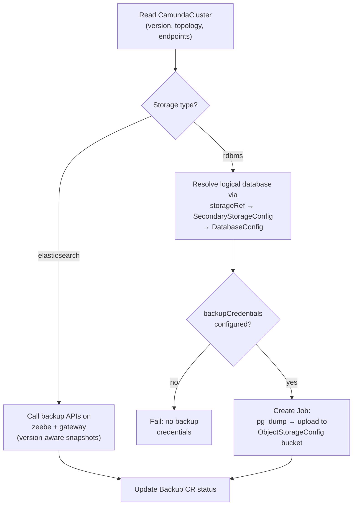

- Reads the referenced CamundaCluster to determine version, topology (which apps are standalone vs embedded), and
  service endpoints
- Reads the cluster's `storageRef` to determine secondary storage type
- **ES**: uses version-aware logic to call the correct backup APIs on zeebe and gateway (existing snapshot behavior)
- **RDBMS**: the controller resolves the specific logical database via the CamundaCluster's `storageRef` →
  `SecondaryStorageConfig` → `DatabaseConfig` chain. It creates a **Job** that connects to that database using
  `backupCredentialsSecretRef` from the SecondaryStorageConfig, runs `pg_dump`, and uploads the dump to the backup
  bucket (referenced via the cluster's `backupStorageRef` / `ObjectStorageConfig`). The Backup CR status tracks the
  Job's progress. Fails if no backup credentials are configured.
- BackupSchedule creates Backup CRDs on a cron schedule
- BackupRetention lists completed Backups and deletes old ones beyond the retained count

</details>

<details>
<summary><h3>7. Restore System: PointInTimeRestore, LogicalRestore</h3></summary>

Restore is modeled as two separate CRDs to cleanly handle the different recovery strategies:

**PointInTimeRestore** (RDBMS only, dedicated server):

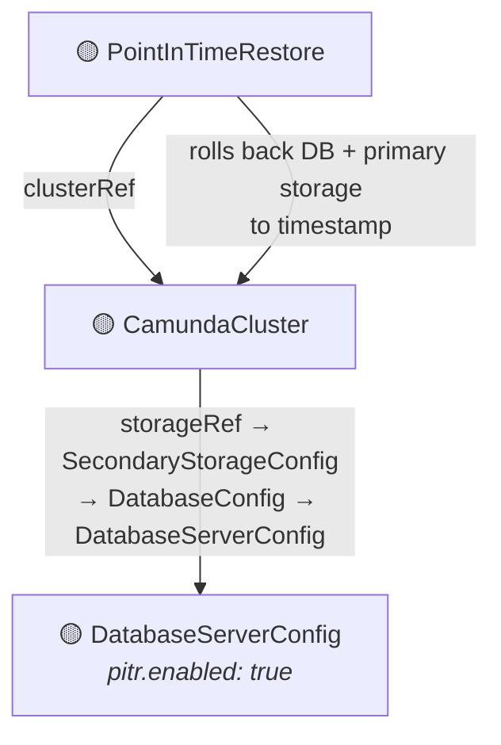

**LogicalRestore** (any storage type):

```mermaid
graph TD
    LR["🟡 LogicalRestore"] -->|backupRef| B["🟡 Backup"]
    LR -->|targetClusterRef| CC2["🟡 CamundaCluster"]
    LR -->|"restores from dump/snapshot"| CC2
```

- **PointInTimeRestore**: in-place, same-cluster recovery for RDBMS when the DatabaseServerConfig has
  `pitr.enabled: true`. WAL archiving is enabled at the database server level (by `CloudDatabaseServer` via Crossplane).
  When PITR is enabled, the CamundaCluster controller auto-enables continuous backup of zeebe's primary storage so that
  both database and primary storage can be restored to the same point in time. No Backup CR needed. **Constraint:** PITR
  operates at the database server level. It rolls back the entire instance, not a single logical database. A validating
  webhook rejects `PointInTimeRestore` creation if the `DatabaseServerConfig` is referenced by more than one `Database`
  CR (shared server). PITR requires a dedicated server per cluster.
- **LogicalRestore**: cross-cluster restore for any storage type (ES or RDBMS). Requires a Backup CR as input.

```yaml
apiVersion: camunda.io/v1
kind: PointInTimeRestore
metadata:
  name: my-restore
  namespace: my-cluster-ns
spec:
  # In-place restore, same cluster, same database
  clusterRef:
    name: my-cluster
    # namespace: my-cluster-ns  # defaults to the CR's namespace if not set

  # Point in time to recover to (RFC 3339 timestamp)
  timestamp: "2026-04-03T14:30:00Z"

status:
  phase: Completed # Pending | RestoringSecondaryStorage | RestoringPrimaryStorage | Completed | Failed
  conditions:
    - type: Ready
      status: "True"

---
apiVersion: camunda.io/v1
kind: LogicalRestore
metadata:
  name: my-restore
  namespace: my-cluster-ns
spec:
  # Reference to the Backup CR to restore from
  backupRef:
    name: my-cluster-backup-001
    namespace: my-cluster-ns

  # Target cluster -- the cluster to restore into (can be different from source)
  targetClusterRef:
    name: my-cluster-restored
    # namespace: my-cluster-ns  # defaults to the CR's namespace if not set

status:
  phase: Completed # Pending | ValidatingCompatibility | RestoringSecondaryStorage | RestoringPrimaryStorage | Completed | Failed
  conditions:
    - type: Ready
      status: "True"
```

**Prerequisites:** The cluster must be suspended (`suspend: true`) before creating a restore CR. The restore controller
validates this and rejects the restore if the cluster is running. This is a deliberate design choice: the restore
controller does not own the `suspend` field on the CamundaCluster (the CamundaCluster controller or CloudCamundaCluster
owns it), so the user or composition layer is responsible for suspending and unsuspending the cluster around the restore
operation.

**PointInTimeRestore controller behavior:**

```mermaid
flowchart TD
    V1{"Cluster<br/>suspended?"} -->|no| REJECT1["Reject"]
    V1 -->|yes| V2{"pitr.enabled<br/>on DatabaseServerConfig?"}
    V2 -->|no| REJECT2["Reject"]
    V2 -->|yes| V3{"Timestamp within<br/>retention period?"}
    V3 -->|no| REJECT3["Reject"]
    V3 -->|yes| RESTORE_DB["Restore DB to timestamp<br/>(recovery_target_time + WAL replay)"]
    RESTORE_DB --> READ_POS["Read exporter_position table<br/>to find per-partition offsets"]
    READ_POS --> RESTORE_PS["Restore primary storage<br/>from continuous backups<br/>to matching position"]
    RESTORE_PS --> DONE["Complete ✓<br/>User unsuspends cluster"]
```

1. Validates that the cluster is suspended
2. Validates that the cluster's DatabaseServerConfig (resolved via the DatabaseConfig chain) has `pitrEnabled: true`
3. Validates that the requested timestamp is within the `pitrRetentionPeriod` reported in the DatabaseServerConfig
   status
4. Restores the database to the target timestamp using PostgreSQL PITR (`recovery_target_time` + WAL replay). This is an
   in-place restore on the same database instance
5. Reads the `exporter_position` table from the restored RDBMS to determine how far each partition had exported
6. Restores primary storage from the continuous backups to match
7. Reports completion. The user or composition layer unsuspends the cluster.

**LogicalRestore controller behavior:**

```mermaid
flowchart TD
    V1{"Target cluster<br/>suspended?"} -->|no| REJECT1["Reject"]
    V1 -->|yes| V2{"Backup exists<br/>and completed?"}
    V2 -->|no| REJECT2["Reject"]
    V2 -->|yes| READ["Read storage type from<br/>backup's SecondaryStorageConfig"]
    READ --> V3{"Target cluster<br/>compatible?"}
    V3 -->|no| REJECT3["Reject"]
    V3 -->|yes| STORAGE{"Storage type?"}

    STORAGE -->|elasticsearch| ES_RESTORE["Restore from ES snapshots<br/>via Camunda snapshot APIs"]
    STORAGE -->|rdbms| RDBMS_RESTORE["Create Job:<br/>download dump → pg_restore"]

    ES_RESTORE --> PS["Restore primary storage<br/>from backup"]
    RDBMS_RESTORE --> PS
    PS --> DONE["Complete ✓<br/>User unsuspends cluster"]
```

1. Validates that the target cluster is suspended
2. Validates that the referenced Backup exists and is completed
3. Reads the backup's source `SecondaryStorageConfig` to determine storage type (ES or RDBMS)
4. Validates target cluster compatibility (version, topology)
5. **ES**: restores from ES snapshots included in the backup via Camunda's snapshot APIs (no Job needed)
6. **RDBMS**: creates a **Job** that downloads the logical dump from the backup bucket and runs `pg_restore` against the
   target database using the target cluster's `backupCredentialsSecretRef`. The LogicalRestore CR status tracks the
   Job's progress.
7. Restores primary storage from the backup
8. Reports completion. The user or composition layer unsuspends the target cluster.

</details>

<details>
<summary><h3>8. Optimize: CamundaOptimize</h3></summary>

Optimize is not part of the Orchestration Cluster. It uses Management Identity for auth (not the Orchestration Cluster's
built-in Identity) and has its own deployment lifecycle. However, it is **always per-cluster**: each Optimize instance
reads data from one cluster's Elasticsearch storage. It is an extension to a CamundaCluster, not a shared
management-plane component.

```mermaid
graph LR
    MAC["🟡 ManagementAuthConfig"] -.->|managementAuthRef| OPT
    OPT["🟡 CamundaOptimize"] -->|clusterRef| CC["🟡 CamundaCluster"]
    OPT -->|"SSA-patch extraEnv<br/>(enable legacy exporter)"| CC
    CC -->|storageRef| SSC["🟡 SecondaryStorageConfig"]
    SSC -->|"ES endpoint"| ES["⚫ Elasticsearch"]
    OPT -->|"reads zeebe-record indices"| ES
    OPT -->|creates| WL["⚫ Optimize Webapp<br/>+ Importer"]
```

```yaml
apiVersion: camunda.io/v1
kind: CamundaOptimize
metadata:
  name: my-cluster-optimize
  namespace: my-cluster-ns
spec:
  # Management Identity auth references a ManagementAuthConfig CR
  # Created by CamundaManagementCluster (self-managed) or control plane (SaaS)
  managementAuthRef: "management-auth"

  # Required, the CamundaCluster this Optimize reads from.
  # The controller derives the storage endpoint from the cluster's storageRef.
  # Also applies camunda.io/cluster labels to Optimize workloads,
  # making them discoverable by runtime extensions (PrivateConnectivity, ExternalMonitoring).
  clusterRef:
    name: my-cluster
    # namespace: my-cluster-ns  # defaults to the CR's namespace if not set

  # Optimize webapp
  webapp:
    replicas: 1
    resources: { ... }
    # extraEnv: []
    # extraEnvFrom: []
    # podAnnotations: {}
    # podLabels: {}
    # scheduling:
    #   nodeAffinity: { ... }
    #   tolerations: [ ... ]
    #   podAffinity: { ... }

  # Optimize importer (separate deployment, reads zeebe-record indices from ES)
  importer:
    replicas: 1
    resources: { ... }
    # extraEnv: []
    # extraEnvFrom: []
    # podAnnotations: {}
    # podLabels: {}
    # scheduling:
    #   nodeAffinity: { ... }
    #   tolerations: [ ... ]
    #   podAffinity: { ... }

  # Optional: create ServiceMonitors for Prometheus scraping.
  # When enabled, the operator creates a ServiceMonitor per standalone component.
  # monitoring:
  #   serviceMonitor:
  #     enabled: true
  #     labels: {}          # extra labels applied to all ServiceMonitors
  #     annotations: {}     # extra annotations applied to all ServiceMonitors

status:
  conditions:
    - type: Ready
      status: "True"
```

**Controller behavior:**

- SSA-patches `spec.zeebe.extraEnv` on the referenced CamundaCluster to enable the Legacy Zeebe Exporter with a fixed
  prefix (`zeebe-record`). This is the only way Optimize's source indices get created. The legacy exporter is disabled
  by default since Camunda 8.8.
- Reads the referenced CamundaCluster's `storageRef` to resolve the `SecondaryStorageConfig` and connect to
  Elasticsearch/OpenSearch
- Configures the Optimize importer with `CAMUNDA_OPTIMIZE_ZEEBE_NAME=zeebe-record` to match the exporter prefix. No
  index prefix fields are needed on the CRD. The operator controls both sides.
- Deploys the Optimize webapp and importer deployments
- Uses its own Management Identity auth config, independent of the Orchestration Cluster's auth

Optimize connects directly to Elasticsearch and does not talk to the CamundaCluster API. It reads from `zeebe-record`
indices written by the Legacy Zeebe Exporter and writes its own analytics indices.

In SaaS, a CamundaOptimize is created per cluster (each cluster has its own ES, so each gets its own Optimize).
Self-managed users create one CamundaOptimize pointing at their cluster.

</details>

<details>
<summary><h3>9. Management Plane: CamundaManagementCluster</h3></summary>

The Camunda management plane (**Console**, **Web Modeler**, and **Management Identity**) is deployed **once per
platform** and shared across all clusters. They use Management Identity (backed by Keycloak or an external OIDC
provider) for authentication.

The management plane follows the same infrastructure pattern as the orchestration side: external infrastructure is
provisioned separately and referenced via typed CRDs.

**Infrastructure dependencies:**

- **PostgreSQL**: three logical databases are needed. One each for Keycloak, Management Identity, and Web Modeler. In
  cloud environments, `CloudDatabaseServer` provisions the server instance and `Database` bootstraps each logical
  database. Users can provision the databases manually. Each database is represented by a `DatabaseConfig` CR that the
  `CamundaManagementCluster` references.
- **Keycloak**: deployed via the official [Keycloak Operator](https://www.keycloak.org/operator/installation). The
  `CamundaManagementCluster` controller creates a `Keycloak` CR (reconciled by the external Keycloak Operator), not a
  custom Keycloak deployment.

```mermaid
graph TD
    subgraph "camunda-cloud-operator (provisions infra)"
        CDBS_M["🔵 CloudDatabaseServer<br/><i>shared DB server</i>"]
    end

    subgraph "camunda-operator (database bootstrapping + management cluster)"
        PG_KC["🟡 Database<br/><i>Keycloak DB</i>"]
        PG_ID["🟡 Database<br/><i>Identity DB</i>"]
        PG_WM["🟡 Database<br/><i>Web Modeler DB</i>"]
    end

    CDBS_M -->|"creates DatabaseServerConfig"| DBSC_M["🟡 DatabaseServerConfig<br/><i>mgmt-db-server</i>"]
    PG_KC -->|"creates DatabaseConfig"| DC_KC["🟡 DatabaseConfig<br/><i>keycloak-db</i>"]
    PG_ID -->|"creates DatabaseConfig"| DC_ID["🟡 DatabaseConfig<br/><i>identity-db</i>"]
    PG_WM -->|"creates DatabaseConfig"| DC_WM["🟡 DatabaseConfig<br/><i>webmodeler-db</i>"]

    subgraph "camunda-operator (CamundaManagementCluster)"
        MC["🟡 CamundaManagementCluster"]
        MC -->|"creates Keycloak CR"| KC["⚫ Keycloak<br/><i>reconciled by Keycloak Operator</i>"]
        MC -->|creates| MI["🟡 Management Identity"]
        MC -->|creates| CON["🟡 Console"]
        MC -->|creates| WM["🟡 Web Modeler"]

        KC --> MI
        MI --> CON
        MI --> WM
    end

    DC_KC -.->|"keycloakDbRef"| MC
    DC_ID -.->|"identityDbRef"| MC
    DC_WM -.->|"webModelerDbRef"| MC
```

_🟡 core operator · 🔵 cloud operator · 🟣 saas operator · ⚫ external_

```yaml
apiVersion: camunda.io/v1
kind: CamundaManagementCluster # cluster-scoped
metadata:
  name: management
spec:
  # Namespace where management plane workloads are created.
  # Defaults to "<name>-camunda" if not set.
  targetNamespace: "camunda-management"

  # PostgreSQL database references (DatabaseConfig CRs, cluster-scoped)
  keycloakDbRef: "keycloak-db"
  identityDbRef: "identity-db"
  webModelerDbRef: "webmodeler-db"

  # Keycloak configuration
  keycloak:
    # image: "camunda/keycloak:quay-optimized-26.3.2"
    replicas: 1
    resources: { ... }

  # Management Identity
  identity:
    replicas: 1
    resources: { ... }

  # Console
  console:
    enabled: true
    replicas: 1
    resources: { ... }

  # Web Modeler
  webModeler:
    enabled: true
    replicas: 1
    resources: { ... }
    mail:
      fromAddress: "noreply@example.com"
      smtpHost: "smtp.example.com"

  # Auth defaults from CamundaPlatformConfig, overridable here
  # auth: { ... }

status:
  conditions:
    - type: KeycloakReady
      status: "True"
    - type: IdentityReady
      status: "True"
    - type: ConsoleReady
      status: "True"
    - type: WebModelerReady
      status: "True"
    - type: Ready
      status: "True"
```

**Key design points:**

- **Keycloak is not managed by our operator**: we create a `Keycloak` CR and the Keycloak Operator reconciles it. Same
  as how we don't manage Elasticsearch directly in the orchestration cluster.
- **DatabaseConfig CRD** is a typed contract in `camunda.io` (like SecondaryStorageConfig/ObjectStorageConfig). It
  references a `DatabaseServerConfig` for server connection details and contains the database name and application
  credentials ref. Created by `Database` (core operator) or manually.
- **Local / bare-metal without cloud operator**: user creates `DatabaseServerConfig` and `DatabaseConfig` CRs manually
  pointing at their existing databases (on-prem Postgres, etc.). Self-managed cloud users can use
  `camunda-cloud-operator` to automate this via `CloudDatabaseServer`.
- **Console discovers clusters** via a ping mechanism. CamundaClusters self-register with Console. No cluster refs
  needed on the management side.
- **ManagementAuthConfig CR** is created as an output. It contains Management Identity endpoint, OIDC issuer URL, and
  default client credentials. Referenced by `CamundaOptimize` (and any future component that needs Management Identity
  auth). In SaaS, the control plane creates this CR directly without a CamundaManagementCluster.

</details>

Cloud infrastructure CRDs add cloud provider integration. They provision IAM identities, encryption keys, storage,
databases, and compose these into full cloud-managed clusters.

<details>
<summary><h3>10. Cloud Account: CloudAccount</h3></summary>

The cloud account is a cluster-scoped CRD that manages the IAM identity cloud features use to interact with cloud
provider APIs. The cloud provider is determined by which Crossplane provider is installed, and the cloud CRDs themselves
are provider-agnostic.

```yaml
apiVersion: cloud.camunda.io/v1
kind: CloudAccount # cluster-scoped
metadata:
  name: my-cluster-account
  # annotations:
  #   # Crossplane resource adoption. Used during migration from ZeebeCluster.
  #   # The controller passes this to the Crossplane composite as
  #   # crossplane.io/external-name, adopting the existing cloud role
  #   # instead of creating a new one. Omit for new clusters.
  #   # Removed by the controller automatically once adoption is verified.
  #   cloud.camunda.io/adopt-external-name: "my-cluster"
spec:

status:
  provider: aws # resolved from installed Crossplane provider
  accountId: "arn:aws:iam::123456789012:role/my-zeebe-role"
  conditions:
    - type: Ready
      status: "True"
```

**Controller behavior:**

- Creates the cloud-specific IAM resource (AWS IAM Role, GCP Service Account, Azure Managed Identity) based on the
  installed Crossplane provider
- Starts with a minimal base identity. Additional permissions are attached by EncryptedVolume and CloudObjectStorage
  controllers as needed (least-privilege)
- Writes the provider-specific account identifier to `status.accountId`

**How other features use it:**

```mermaid
graph LR
    CA["🔵 CloudAccount"] -->|status.accountId| ES["🔵 EncryptedVolume"]
    CA -->|status.accountId| RS["🔵 CloudObjectStorage"]
    CA -->|status.accountId| EEK["🟣 ExternalEncryptionKey"]
```

- The `status.accountId` is passed as a plain string to EncryptedVolume and CloudObjectStorage specs, which use it to
  create IAM policies granting the identity access to their resources
- ExternalEncryptionKey references the account ID so users know which identity to grant KMS access to in their cloud
  provider console
- The account ID flows through as a value, not as a field on CamundaCluster

</details>

<details>
<summary><h3>11. Cloud Network Config: CloudNetworkConfig</h3></summary>

CloudNetworkConfig describes the network environment where the Kubernetes cluster runs. It is cluster-scoped (one per
environment) and provides VPC, subnet, and security group details needed by other cloud CRDs.

Every spec field is optional. If set, the controller copies it to status directly. If empty, the controller discovers
the value from the running K8s environment (requires the cloud operator's ServiceAccount to have read-only network
permissions via IRSA/Workload Identity). If all spec fields are provided, no discovery is needed and the controller sets
Ready immediately.

In SaaS, this CR is created automatically when the operator is deployed into a K8s environment.

```yaml
apiVersion: cloud.camunda.io/v1
kind: CloudNetworkConfig # cluster-scoped, one per environment
metadata:
  name: default
spec:
  # All fields optional. If empty, discovered from the running K8s cluster.
  # If set, used as-is (no discovery needed for that field).
  # region: "us-east-1"
  # availabilityZones: ["us-east-1a", "us-east-1b", "us-east-1c"]
  # vpcId: "vpc-abc123"
  # clusterSecurityGroupId: "sg-xyz789"
  # privateSubnetIds: ["subnet-1a", "subnet-2b", "subnet-3c"]

status:
  # Resolved values (discovered or copied from spec)
  region: "us-east-1"
  availabilityZones: ["us-east-1a", "us-east-1b", "us-east-1c"]
  vpcId: "vpc-abc123"
  clusterSecurityGroupId: "sg-xyz789"
  privateSubnetIds: ["subnet-1a", "subnet-2b", "subnet-3c"]
  conditions:
    - type: Ready
      status: "True"
```

**Controller behavior:**

- For each spec field: if set, copy to status. If empty, discover from the K8s environment using the operator's own
  cloud credentials.
- Once all status fields are resolved, set Ready: True.
- Discovery uses read-only cloud APIs (e.g., `eks:DescribeCluster`, `ec2:DescribeVpcs` on AWS). These permissions are on
  the cloud operator's ServiceAccount, not on CloudAccount.

**Primary consumers:**

- **CloudDatabaseServer**: reads VPC, private subnets, security group, and AZs to create an opinionated DB subnet group
  and security rules.
- **PrivateConnectivity**: reads VPC for endpoint creation.

</details>

<details>
<summary><h3>12. Cloud-Managed KMS Keys: CloudKMSKey</h3></summary>

For Software and Hardware protection levels, the encryption keys are cloud-managed. Camunda provisions and owns them in
the cloud provider's KMS. The `CloudKMSKey` CRD handles this provisioning. For External protection level, the user
manages their own keys via `ExternalEncryptionKey` and this CRD is not needed.

```yaml
apiVersion: cloud.camunda.io/v1
kind: CloudKMSKey
metadata:
  name: my-cluster-kms-key
  namespace: my-cluster-ns
  # annotations:
  #   # Crossplane resource adoption. Used during migration from ZeebeCluster.
  #   # The controller passes this to the Crossplane composite as
  #   # crossplane.io/external-name, adopting the existing cloud key
  #   # instead of creating a new one. Omit for new clusters.
  #   # Removed by the controller automatically once adoption is verified.
  #   cloud.camunda.io/adopt-external-name: "1234abcd-12ab-34cd-56ef-1234567890ab"
spec:
  protectionLevel: software # software | hardware
  accountId: "arn:aws:iam::123456789012:role/my-zeebe-role"

status:
  keyId: "arn:aws:kms:us-west-2:111122223333:key/1234abcd-12ab-34cd-56ef-1234567890ab"
  conditions:
    - type: Ready
      status: "True"
```

**Controller behavior:**

1. Based on `spec.protectionLevel`, provisions a KMS key in the cloud (software-backed or HSM-backed)
2. Grants `spec.accountId` usage permissions on the key
3. Reports the provider-specific key identifier in `status.keyId`

CloudKMSKey is created **before** CloudCamundaCluster (alongside CloudAccount). The `status.keyId` is then passed to
CloudCamundaCluster, which forwards it to EncryptedVolume and CloudObjectStorage.

</details>

<details>
<summary><h3>13. Volume Encryption: EncryptedVolume</h3></summary>

> **Renamed from `EncryptedStorage`.** The legacy operator already defines an `EncryptedStorage` CRD in the
> `cloud.camunda.io` API group. Since CRD names in Kubernetes are `<plural>.<group>`, having two separate CRD
> definitions for the same resource name in the same group would require conversion webhooks or an API group change.
> Renaming to `EncryptedVolume` avoids this collision and better describes what the CRD manages (encrypted volumes, not
> storage in general).

EncryptedVolume provisions an encrypted StorageClass that the CamundaCluster references for its PVC templates. Since PVC
storage classes are immutable after StatefulSet creation, this is a prerequisite, and it must be ready before the
cluster is created.

```mermaid
graph LR
    KMS["🔵 CloudKMSKey /<br/>🟣 ExternalEncryptionKey"] -->|keyId| ES
    CA["🔵 CloudAccount"] -->|accountId| ES
    ES["🔵 EncryptedVolume"] -->|provisions| SC["⚫ StorageClass"]
    SC -.->|"spec.zeebe.storageClassName"| CC["🟡 CamundaCluster"]
```

```yaml
apiVersion: cloud.camunda.io/v1
kind: EncryptedVolume # cluster-scoped
metadata:
  name: my-cluster-encryption
spec:
  # IAM identity that needs access to the encrypted storage
  accountId: "arn:aws:iam::123456789012:role/my-zeebe-role"

  # Name of the StorageClass to provision
  storageClassName: "encrypted-ssd"

  # KMS key identifier, provider-specific format
  keyId: "arn:aws:kms:us-west-2:111122223333:key/1234abcd-12ab-34cd-56ef-1234567890ab"

status:
  conditions:
    - type: Ready
      status: "True"
```

**Controller behavior:**

1. Provisions an encrypted StorageClass named `spec.storageClassName` using the KMS key `spec.keyId`
2. Creates IAM policies granting `spec.accountId` access to the KMS key and storage class

The CamundaCluster has no knowledge of encryption. It just takes a `storageClassName`, the same field a self-managed
user would set to `"standard"` or `"gp3"`. The orchestration of "create encryption first, then cluster" is the
responsibility of the operator consumer (the SaaS control plane, a GitOps pipeline, or a human).

</details>

<details>
<summary><h3>14. Cloud Object Storage: CloudObjectStorage</h3></summary>

> **Renamed from `RemoteStorage`.** The legacy operator already defines a `RemoteStorage` CRD in the `cloud.camunda.io`
> API group. Since CRD names in Kubernetes are `<plural>.<group>`, having two separate CRD definitions for the same
> resource name in the same group would require conversion webhooks or an API group change. Renaming to
> `CloudObjectStorage` avoids this collision and is more descriptive, since this CRD specifically manages cloud object
> storage (S3 buckets, GCS buckets).

CloudObjectStorage provisions cloud buckets and writes the bucket details to an **`ObjectStorageConfig` CR**, a typed
CRD defined in `camunda.io` that serves as the contract between the cloud operator and the core operator. The
CamundaCluster references this ObjectStorageConfig by name, and its controller reads the bucket details and maps them to
the correct version-specific env vars.

This keeps CloudObjectStorage completely version-agnostic. It just provisions infrastructure and creates an
ObjectStorageConfig CR. The CamundaCluster controller is the only place that understands how different Camunda versions
consume bucket configuration.

CloudObjectStorage supports two modes:

- **Create mode**: provisions a new cloud bucket, sets up IAM policies, and creates an ObjectStorageConfig CR.
- **Existing bucket mode** (`existingBucketRef`): references an existing ObjectStorageConfig to read bucket details
  from. Skips bucket creation. Grants `accountId` IAM permissions scoped to `basePath`, and creates a **new**
  ObjectStorageConfig CR with the bucket details + cluster-specific base path. This supports shared buckets (one bucket,
  multiple clusters with different base paths) and externally provisioned buckets.

Cloud object storage can itself be encrypted with KMS keys. This is separate from volume encryption (EncryptedVolume).
Volume encryption protects PersistentVolume data at rest, while cloud object storage encryption protects bucket
contents.

```mermaid
graph LR
    CA["🔵 CloudAccount"] -->|accountId| RS
    KMS["🔵 CloudKMSKey /<br/>🟣 ExternalEncryptionKey"] -.->|"keyId (optional)"| RS

    RS["🔵 CloudObjectStorage"]
    RS -->|"create mode:<br/>provisions bucket"| Bucket["⚫ Cloud Bucket"]
    RS -->|creates| OSC_NEW["🟡 ObjectStorageConfig<br/><i>new, with basePath</i>"]

    EXISTING["🟡 ObjectStorageConfig<br/><i>existing bucket</i>"] -.->|"existingBucketRef:<br/>reads bucket details"| RS
    RS -->|"grants IAM on basePath"| Bucket

    OSC_NEW -.->|"backupStorageRef /<br/>documentStorageRef"| CC["🟡 CamundaCluster"]
```

```yaml
apiVersion: cloud.camunda.io/v1
kind: CloudObjectStorage # cluster-scoped
metadata:
  name: my-cluster-backup-storage
  # annotations:
  #   # Crossplane resource adoption. Used during migration from ZeebeCluster.
  #   # The controller passes this to the Crossplane composite as
  #   # crossplane.io/external-name, adopting the existing cloud bucket
  #   # instead of creating a new one. Omit for new clusters.
  #   # Removed by the controller automatically once adoption is verified.
  #   cloud.camunda.io/adopt-external-name: "my-cluster-backup-bucket"
spec:
  # IAM identity that needs access to the bucket
  accountId: "arn:aws:iam::123456789012:role/my-zeebe-role"

  # Name and base path of the ObjectStorageConfig CR to create
  objectStorageConfig:
    name: "my-backup-config" # defaults to CR name
    basePath: "backups"

  # --- Option A: create a new bucket ---
  bucket:
    region: "us-east-1"
    # Optional: enables cross-region replication to this region
    # replicationRegion: "eu-west-1"

    # Bucket-level encryption with KMS keys (optional)
    encryption:
      keyId: "arn:aws:kms:us-west-2:111122223333:key/1234abcd..."
      replicationKeyId: "arn:aws:kms:eu-west-1:111122223333:key/5678efgh..."

    objectLifecycle:
      deleteRules:
        - daysSinceCreation: 30
          prefix: "backups/"

  # --- Option B: use an existing bucket ---
  # References an existing ObjectStorageConfig to read bucket details from.
  # Skips bucket creation. Grants accountId IAM permissions scoped to basePath
  # and creates a new ObjectStorageConfig with the cluster-specific base path.
  # existingBucketRef: "shared-backup-bucket-config"

status:
  conditions:
    - type: Ready
      status: "True"
```

The controller creates an `ObjectStorageConfig` CR with the provisioned bucket details:

```yaml
apiVersion: camunda.io/v1
kind: ObjectStorageConfig # cluster-scoped
metadata:
  name: my-backup-config # same as spec.objectStorageConfig.name
spec:
  provider: aws # aws | gcp | azure
  type: S3 # S3 | GCS | AzureBlob
  bucketId: "arn:aws:s3:::my-cluster-backup-bucket"
  bucketName: "my-cluster-backup-bucket"
  basePath: "backups"
  accountId: "arn:aws:iam::123456789012:role/my-zeebe-role"
```

The CamundaCluster controller reads the ObjectStorageConfig CR and translates its typed fields into the correct env vars
for its Camunda version. Because it's a CRD with a schema, field mismatches are caught at admission time rather than at
reconciliation.

**Controller behavior:**

1. Provisions the bucket using the installed Crossplane provider
2. Creates IAM policies granting `spec.accountId` access to the provisioned bucket
3. If encryption is configured, provisions the bucket with KMS encryption using the provided key IDs
4. Creates an `ObjectStorageConfig` CR named `spec.objectStorageConfig.name` with the bucket details
5. Reports bucket details in status

**How this connects to CamundaCluster:**

CamundaCluster references the ObjectStorageConfig CR by name. The user (or CloudCamundaCluster) passes the same name to
both CloudObjectStorage and CamundaCluster:

```yaml
# On CloudObjectStorage
spec:
  objectStorageConfig:
    name: "my-backup-config"
    basePath: "backups"

# On CamundaCluster
spec:
  backupStorageRef: "my-backup-config"  # ObjectStorageConfig (cluster-scoped)
```

The CamundaCluster controller reads the ObjectStorageConfig CR, maps the typed fields to the correct env vars for its
Camunda version, and configures the workloads. If the ObjectStorageConfig CR doesn't exist yet (CloudObjectStorage
hasn't finished provisioning), the zeebe component stays blocked via a guard until it appears. There is no partial
configuration and no restarts needed.

This pattern keeps version-specific logic in one place (CamundaCluster controller) and keeps CloudObjectStorage
completely unaware of Camunda versions.

</details>

<details>
<summary><h3>15. Cloud Database Server: CloudDatabaseServer</h3></summary>

CloudDatabaseServer provisions a managed database server instance (e.g., RDS PostgreSQL, Cloud SQL, Aurora). It handles
the infrastructure-level concerns: instance class, storage, engine version. Once the server is ready, it creates a
`DatabaseServerConfig` CR with the connection details so that `Database` CRs can reference it.

Like CamundaCluster and ElasticsearchCluster, CloudDatabaseServer supports presets:

```yaml
apiVersion: cloud.camunda.io/v1
kind: CloudDatabaseServerPreset # cluster-scoped
metadata:
  name: standard
spec:
  # Reuses the CloudDatabaseServer.Spec type directly
  server:
    engine: postgres
    engineVersion: "17"
    instanceClass: "db.r6g.large"
    storageSize: "100Gi"
    pitr:
      enabled: true
      retentionPeriod: "7d"
```

```mermaid
graph LR
    CNC["🔵 CloudNetworkConfig"] -->|"VPC, subnets, SG"| CDBS
    CDBS["🔵 CloudDatabaseServer"] -->|provisions| RDS["⚫ Managed DB Instance"]
    CDBS -->|creates| DBSC["🟡 DatabaseServerConfig"]
    DBSC -.->|referenced by| DB["🟡 Database"]
```

```yaml
apiVersion: cloud.camunda.io/v1
kind: CloudDatabaseServer # cluster-scoped
metadata:
  name: my-db-server
spec:
  engine: postgres # postgres | whatever else
  engineVersion: "17"
  instanceClass: "db.r6g.large"
  storageSize: "100Gi"

  # PITR configuration. Managed by Crossplane, reconciled automatically.
  # Enabling/disabling does not cause database downtime.
  pitr:
    enabled: true
    retentionPeriod: "7d" # how far back PITR can restore

  # References CloudNetworkConfig for VPC, subnets, and security groups.
  networkConfigRef: "default"

  # Where to write the admin credentials Secret.
  adminCredentialsSecret:
    name: "my-db-server-credentials"
    namespace: "camunda-system"

  # Name of the DatabaseServerConfig CR to create with connection details (defaults to cr name)
  databaseServerConfig: "my-db-server"

status:
  conditions:
    - type: Ready
      status: "True"
```

**Controller behavior:**

1. Reads the referenced `CloudNetworkConfig` (defaults to `"default"`) for VPC, private subnets, security group, and
   availability zones
2. Creates a DB subnet group from the private subnets and configures security rules using the cluster security group
3. Provisions the managed database instance using the installed Crossplane provider
4. If `pitr.enabled` is true, configures automated backups and WAL archiving on the managed instance via Crossplane
   (e.g., RDS automated backups with the specified retention period). Crossplane reconciles drift automatically, so
   disabling or re-enabling PITR is a spec change with no manual intervention.
5. Generates admin credentials and writes them to the Secret specified by `spec.adminCredentialsSecret`
6. Creates a `DatabaseServerConfig` CR named `spec.databaseServerConfig` with host, port, engine, admin credentials, and
   PITR configuration from the spec (`pitr.enabled`, `pitr.retentionPeriod`)
7. Reports status

Creates a `DatabaseServerConfig` CR with the connection details (see [Contract CRDs](#2-contract-crds)).

</details>

<details>
<summary><h3>16. Database: Database</h3></summary>

Database is a core CRD (`camunda.io`) that bootstraps a logical database and application users within any existing
PostgreSQL server, whether cloud-managed (RDS, Cloud SQL, Aurora) or self-hosted. It reads the referenced
`DatabaseServerConfig` (cluster-scoped) to connect using admin credentials, creates the database and users via standard
SQL (`CREATE DATABASE`, `CREATE USER`), and outputs a `DatabaseConfig` CR. Because the controller only issues SQL
commands, it does not require any cloud infrastructure or Crossplane providers, only network access to the database
server and admin credentials from the `DatabaseServerConfig`.

**Validation:** A validating webhook rejects `Database` creation if another `Database` CR referencing the same
`serverRef` already uses the same `databaseName`. This prevents accidental collisions on shared servers.

This separation allows multiple logical databases to share a single server instance, which is both cost-effective and
operationally simpler than provisioning a separate server per database.

```mermaid
graph TD
    DBSC["🟡 DatabaseServerConfig<br/><i>cluster-scoped</i>"] -->|"admin credentials +<br/>connection details"| DB1["🟡 Database<br/><i>camunda</i>"]
    DBSC --> DB2["🟡 Database<br/><i>keycloak</i>"]
    DBSC --> DB3["🟡 Database<br/><i>webmodeler</i>"]
    DB1 -->|creates| DC1["🟡 DatabaseConfig"]
    DB1 -->|"creates (optional)"| SSC["🟡 SecondaryStorageConfig"]
    DB2 -->|creates| DC2["🟡 DatabaseConfig"]
    DB3 -->|creates| DC3["🟡 DatabaseConfig"]
```

```yaml
apiVersion: camunda.io/v1
kind: Database # cluster-scoped
metadata:
  name: my-camunda-db
spec:
  # Namespace where credential Secrets are created.
  # Defaults to the operator namespace if not set.
  targetNamespace: "my-cluster-ns"

  # References the server to create the database in
  serverRef: "my-db-server" # references a DatabaseServerConfig

  # Name of the database to create
  databaseName: "camunda"

  # Application credentials, always created.
  # Controller creates a Secret with keys "username" and "password".
  applicationCredentials:
    secretName: "my-camunda-db-app" # defaults to <cr>-credentials
    secretNamespace: "camunda-system"

  # Backup/restore credentials are opt-out.
  # Controller creates a separate Secret with keys "username" and "password".
  # This user is granted pg_dump/pg_restore privileges (or equivalent).
  backupCredentials:
    disabled: false
    secretName: "my-camunda-db-backup" # defaults to <cr>-backup-credentials
    secretNamespace: "camunda-system"

  # Name of the DatabaseConfig CR to create
  databaseConfig: "my-camunda-db" # defaults to cr name

  # Optional: if set, creates a SecondaryStorageConfig referencing this database.
  # Omit for databases not used as Camunda secondary storage (e.g., Keycloak, Web Modeler).
  # secondaryStorageConfig: "my-storage-config"

status:
  conditions:
    - type: Ready
      status: "True"
```

**Controller behavior:**

1. Reads the referenced `DatabaseServerConfig` to get connection details and admin credentials
2. Connects to the server and runs `CREATE DATABASE` + `CREATE USER` with appropriate privileges
3. Creates the application user and writes credentials to `spec.applicationCredentials.secretName` (keys: `username`,
   `password`)
4. If `spec.backupCredentials` is not disabled, creates a separate user with backup/restore permissions and writes
   credentials to `spec.backupCredentials.secretName` (keys: `username`, `password`)
5. Creates a `DatabaseConfig` CR named `spec.databaseConfig` with serverRef, databaseName, and application credentials
   wired in
6. Reports status
7. If `spec.secondaryStorageConfig` is set, creates a `SecondaryStorageConfig` CR with type `rdbms`, referencing the
   DatabaseConfig and wiring in the backup credentials Secret from `spec.backupCredentials.secretName`.

Creates a `DatabaseConfig` CR with the connection details for the logical database (see
[Contract CRDs](#2-contract-crds)).

</details>

<details>
<summary><h3>17. Cloud Cluster Composition: CloudCamundaCluster</h3></summary>

The building blocks above (CamundaCluster, EncryptedVolume, CloudObjectStorage, CloudAccount, etc.) are independently
usable CRDs. But expecting a user to create them in the right order, wait for readiness, and wire status outputs to spec
inputs is a poor experience. The composition layer solves this.

CloudCamundaCluster does not have its own preset CRD. Instead, it composes from existing presets via references:

- `clusterPresetRef` → references a `CamundaClusterPreset` (passed through to the CamundaCluster it creates)
- `storage.elasticsearch.presetRef` → references an `ElasticsearchClusterPreset`
- `storage.rdbms.presetRef` → references a `CloudDatabaseServerPreset`

This avoids duplicating sizing definitions. Presets define "how big", CloudCamundaCluster defines "what to create and
how to wire it."

**CloudCamundaCluster with presets:**

```yaml
apiVersion: cloud.camunda.io/v1
kind: CloudCamundaCluster # cluster-scoped
metadata:
  name: my-cluster
spec:
  platformConfigRef: "default"

  # Namespace where CamundaCluster and all namespaced resources are created.
  # Defaults to "<name>-camunda" if not set.
  targetNamespace: "my-cluster-camunda"

  # Preset refs: passed through to the CRDs this controller creates
  clusterPresetRef: "medium" # → CamundaCluster

  # Per-cluster infrastructure inputs
  accountId: "arn:aws:iam::123456789012:role/my-zeebe-role"

  # Storage backend (one of: elasticsearch, rdbms, or storageRef)
  storage:
    # Option A: create ElasticsearchCluster from a preset
    elasticsearch:
      presetRef: "standard" # → ElasticsearchClusterPreset

    # Option B: create ElasticsearchCluster inline (same type as ElasticsearchCluster.Spec)
    # elasticsearch:
    #   replicas: 3
    #   resources:
    #     requests: { cpu: "1", memory: "2Gi" }
    #   storageSize: "64Gi"
    #   storageClassName: "ssd"
    # rdbms:
    #   # Option A: create a new database server from a preset
    #   server:
    #     presetRef: "standard"               # → CloudDatabaseServerPreset
    #
    #   # Option B: create a new database server inline (same type as CloudDatabaseServer.Spec)
    #   # server:
    #   #   engine: postgres
    #   #   engineVersion: "17"
    #   #   instanceClass: "db.r6g.large"
    #   #   storageSize: "100Gi"
    #   #   pitr:
    #   #     enabled: true
    #   #     retentionPeriod: "7d"
    #
    #   # Option C: reference an existing database server (creates Database only)
    #   # databaseServerConfigRef: "shared-db-server"
  # OR reference an existing SecondaryStorageConfig (skip creating storage entirely)
  # storageRef: "my-existing-storage-config"

  # Optional: encrypted volume storage. Creates an EncryptedVolume CR.
  # If omitted, CamundaCluster uses the default StorageClass.
  volumeEncryption:
    keyId: "arn:aws:kms:us-west-2:111122223333:key/1234abcd..."

  # Optional: backup bucket. Creates a CloudObjectStorage CR.
  backupStorage:
    replicationRegion: "eu-west-1"
    encryption:
      keyId: "arn:aws:kms:us-west-2:111122223333:key/1234abcd..."
      replicationKeyId: "arn:aws:kms:..."
  # OR reference an existing ObjectStorageConfig:
  # backupStorageRef: "my-existing-backup-config"

  # Optional: document bucket. Creates a CloudObjectStorage CR.
  documentStorage:
    replicationRegion: "eu-west-1"
    encryption:
      keyId: "arn:aws:kms:..."
      replicationKeyId: "arn:aws:kms:..."
  # OR reference an existing ObjectStorageConfig:
  # documentStorageRef: "my-existing-document-config"

status:
  conditions:
    - type: EncryptedVolumeReady
      status: "True"
    - type: DocumentStorageReady
      status: "True"
    - type: BackupStorageReady
      status: "True"
    - type: SecondaryStorageReady
      status: "True"
    - type: CamundaClusterReady
      status: "False"
      reason: Creating
      message: "Still creating stuff"
    - type: Ready
      status: "False"
      reason: Creating
```

**CloudCamundaCluster with inline config (no presets):**

```yaml
apiVersion: cloud.camunda.io/v1
kind: CloudCamundaCluster # cluster-scoped
metadata:
  name: my-cluster
spec:
  platformConfigRef: "default"
  targetNamespace: "my-cluster-camunda"

  accountId: "arn:aws:iam::123456789012:role/my-zeebe-role"

  # Inline cluster config (no clusterPresetRef
  cluster: # uses CamundaCluster spec type from: camunda-operator/api/v1/camundacluster_types.go
    version: "8.9.0"
    zeebe:
      replicas: 3
      partitions: 3
      replicationFactor: 3
      resources:
        requests: { cpu: "2", memory: "4Gi" }
      storageSize: "32Gi"
    gateway:
      mode: Standalone
      replicas: 2
      resources:
        requests: { cpu: "1", memory: "2Gi" }
    operate:
      mode: Embedded
    tasklist:
      mode: Embedded
    identity:
      mode: Embedded
    connectors:
      replicas: 1
      resources:
        requests: { cpu: "250m", memory: "512Mi" }

  # Inline storage config (no presetRef)
  storage:
    elasticsearch: # uses ElasticsearchCluster type from: camunda-operator/api/v1/elasticsearchcluster_types.go
      replicas: 3
      resources:
        requests: { cpu: "1", memory: "2Gi" }
      storageSize: "64Gi"

  # Optional: encrypted storage -> Creates EncryptedVolume CR.
  volumeEncryption:
    keyId: "arn:aws:kms:..."

  # Optional: backups bucket -> Creates a CloudObjectStorage CR.
  backupStorage:
    replicationRegion: "eu-west-1"
    encryption:
      keyId: "arn:aws:kms:..."
      replicationKeyId: "arn:aws:kms:..."
  # OR: backupStorageRef: "my-existing-backup-config" -> Uses existing bucket

  # Optional: document bucket -> Creates a CloudObjectStorage CR.
  documentStorage:
    replicationRegion: "eu-west-1"
    encryption:
      keyId: "arn:aws:kms:..."
      # replicationKeyId: "arn:aws:kms:..."
  # OR reference an existing ObjectStorageConfig:
  # documentStorageRef: "my-existing-document-config" -> Uses existing bucket
```

**But wait...is this a ZeebeCluster 2.0?**

CloudCamundaCluster has a large spec and orchestrates many concerns which may look similar to the current ZeebeCluster.
The critical difference: CloudCamundaCluster only creates and wires other CRDs. It never creates a Deployment,
StatefulSet, Service, or ConfigMap directly. All workload rendering happens in the building block controllers
(CamundaCluster, ElasticsearchCluster). This boundary must be maintained. If business logic or workload management
starts moving into the composition layer, the same coupling problems will return.

```mermaid
graph TD
    subgraph "Before CloudCamundaCluster (managed externally)"
        CA["🔵 CloudAccount"] -->|status.accountId| PRE((done))
        KMS["🔵 CloudKMSKey or<br/>🟣 ExternalEncryptionKey"] -->|status.keyId| PRE
    end

    subgraph "Phase 1: Encrypted Volume"
        ES["🔵 EncryptedVolume<br/>receives accountId + keyId"] -->|wait for Ready| ES_R((done))
    end

    subgraph "Phase 2: Storage Backend"
        DB_CHOICE{storage type}
        DB_CHOICE -->|elasticsearch| ESC["🟡 ElasticsearchCluster"]
        DB_CHOICE -->|rdbms + new server| CDBS["🔵 CloudDatabaseServer"] --> DB_I["🟡 Database"]
        DB_CHOICE -->|rdbms + existing server| DB_I2["🟡 Database"]
        ESC -->|creates SecondaryStorageConfig| SSC((done))
        DB_I -->|"creates DatabaseConfig<br/>+ SecondaryStorageConfig"| SSC2((done))
        DB_I2 -->|"creates DatabaseConfig<br/>+ SecondaryStorageConfig"| SSC2
    end

    subgraph "Phase 3: Core Cluster"
        CC["🟡 Create CamundaCluster<br/>with storageClassName + storageRef"]
    end

    PRE --> ES
    ES_R --> DB_CHOICE
    SSC --> CC
    SSC2 --> CC
```

_🟡 core operator · 🔵 cloud operator · 🟣 saas operator · ⚫ external_

---

</details>

<details>
<summary><h3>18. Cloud Management Composition: CloudCamundaManagementCluster</h3></summary>

Same pattern as CloudCamundaCluster. It provisions cloud infrastructure and wires it to the core CRD.

```mermaid
graph TD
    CCMC["🔵 CloudCamundaManagementCluster"]
    CCMC -->|creates| CDBS["🔵 CloudDatabaseServer"]
    CDBS -->|creates| DBSC["🟡 DatabaseServerConfig"]
    CCMC -->|creates| DB_K["🟡 Database<br/><i>keycloak</i>"]
    CCMC -->|creates| DB_I["🟡 Database<br/><i>identity</i>"]
    CCMC -->|creates| DB_W["🟡 Database<br/><i>webmodeler</i>"]
    CCMC -->|creates| CMC["🟡 CamundaManagementCluster"]
```

```yaml
apiVersion: cloud.camunda.io/v1
kind: CloudCamundaManagementCluster # cluster-scoped
metadata:
  name: management
spec:
  # Namespace where CamundaManagementCluster and all namespaced resources are created.
  # Defaults to "<name>-management" if not set.
  targetNamespace: "camunda-management"

  # Database server: create new (inline or preset), or reference existing (cluster-scoped).
  # Inline uses the same type as CloudDatabaseServer.Spec.
  database:
    server:
      presetRef: "standard"                   # → CloudDatabaseServerPreset
      # OR inline (same fields as CloudDatabaseServer spec):
      # engine: postgres
      # engineVersion: "17"
      # instanceClass: "db.r6g.large"
      # storageSize: "100Gi"
      # pitr:
      #   enabled: true
      #   retentionPeriod: "7d"
    # OR reference an existing server (creates Database CRs only):
    # databaseServerConfigRef: "shared-db-server"
    #
    # OR reference existing DatabaseConfigs directly. Only components without a ref
    # get a Database CR created by the controller. Partial overrides are supported.
    # databaseConfigRefs:
    #   keycloak: "my-keycloak-db"
    #   identity: "my-identity-db"
    #   webModeler: "my-webmodeler-db"

  # Component config (passed through to CamundaManagementCluster)
  keycloak:
    replicas: 1
    resources: { ... }

  managementIdentity:
    replicas: 1
    resources: { ... }

  console:
    enabled: true
    replicas: 1
    resources: { ... }

  webModeler:
    enabled: true
    replicas: 1
    resources: { ... }
    mail:
      fromAddress: "noreply@example.com"
      smtpHost: "smtp.example.com"

status:
  conditions:
    - type: DatabaseServerReady
      status: "True"
    - type: KeycloakReady
      status: "True"
    - type: ManagementIdentityReady
  status: "True"
    - type: ConsoleReady
      status: "True"
    - type: WebModelerReady
      status: "True"
    - type: Ready
      status: "True"
```

**Controller behavior:**

1. If `database.server` is set, creates a `CloudDatabaseServer` using the preset. If `database.databaseServerConfigRef`
   is set, references the existing server. Either way, a `DatabaseServerConfig` is available.
2. For each component (Keycloak, Management Identity, Web Modeler): if a `databaseConfigRefs` entry exists, uses it
   directly; otherwise creates a `Database` CR referencing the `DatabaseServerConfig` with `targetNamespace` set to
   `spec.targetNamespace`
3. Waits for all `DatabaseConfig` CRs (referenced or created) to be available
4. Creates a `CamundaManagementCluster` with the `DatabaseConfig` refs and component config wired in
5. The `CamundaManagementCluster` controller handles the rest: Keycloak CR, Management Identity, Console, Web Modeler
   workloads, and the `ManagementAuthConfig` output

</details>

<details>
<summary><h3>19. External Encryption Key: ExternalEncryptionKey</h3></summary>

ExternalEncryptionKey supports BYOK (Bring Your Own Key) encryption. The user manages their own KMS keys externally (in
their cloud provider console, Terraform, etc.), and this CRD grants the Camunda IAM identity access to use those keys.

Used instead of `CloudKMSKey` when the user wants full control over key management. The key ID is passed to
`CloudCamundaCluster` for use by `EncryptedVolume` and `CloudObjectStorage`.

```yaml
apiVersion: cloud.camunda.io/v1
kind: ExternalEncryptionKey # cluster-scoped
metadata:
  name: my-cluster-byok
spec:
  # The IAM identity that needs access to this key
  accountId: "arn:aws:iam::123456789012:role/my-zeebe-role"

  # Provider-specific key identifier (managed by the user, not by this operator)
  keyId: "arn:aws:kms:us-west-2:111122223333:key/1234abcd-12ab-34cd-56ef-1234567890ab"

status:
  conditions:
    - type: Ready
      status: "True"
```

**Controller behavior:**

1. Grants the `spec.accountId` IAM identity usage permissions on the user-provided key (`spec.keyId`)
2. Once access is confirmed, sets Ready condition

</details>

<details>
<summary><h3>20. Cloud Scheduling: SaaSSchedulingPolicy</h3></summary>

Manages workload scheduling constraints by patching `scheduling` fields on CamundaCluster, ElasticsearchCluster, and
CamundaOptimize specs.

```mermaid
graph LR
    SPPR["🟣 SchedulingPolicyPreset"] -.->|presetRef| SSP
    SSP["🟣 SaaSSchedulingPolicy"] -->|"translates nodeType →<br/>scheduling fields"| PATCH["SSA-patch"]
    PATCH -->|"spec.zeebe.scheduling<br/>spec.gateway.scheduling<br/>..."| CC["🟡 CamundaCluster"]
    PATCH -->|"spec.scheduling"| ESC["🟡 ElasticsearchCluster"]
    PATCH -->|"spec.webapp.scheduling"| OPT["🟡 CamundaOptimize"]
    CC -->|"renders into"| WL["⚫ Workloads"]
```

Scheduling defaults are defined in a cluster-scoped `SchedulingPolicyPreset` CRD. These presets are deployed alongside
the saas operator and differ per cloud environment. AWS has different preset configuration than GCP (e.g., different
node types, spot vs non-spot defaults due to different eviction behaviors), but they all use the same names (`"basic"`,
`"standard"`, `"advanced"`). This means the same `SaaSSchedulingPolicy` referencing preset `"standard"` works in any
cloud environment without changes.

Each per-component field in `SaaSSchedulingPolicy` is an optional pointer. If set, it overrides the corresponding preset
value. The `nodeType` values are a SaaS abstraction and the controller translates them into concrete `scheduling` fields
(nodeAffinity, tolerations) and then SSA-patches those onto the CamundaCluster and ElasticsearchCluster per-component
specs.

```yaml
apiVersion: cloud.camunda.io/v1
kind: SchedulingPolicyPreset # cluster-scoped
metadata:
  name: standard
spec:
  zeebe:
    nodeType: NonSpot

  gateway:
    nodeType: Spot

  tasklist:
    nodeType: Spot

  operate:
    nodeType: Spot

  optimize:
    nodeType: Spot

  elasticsearch:
    nodeType: NonSpot
```

```yaml
apiVersion: cloud.camunda.io/v1
kind: SaaSSchedulingPolicy
metadata:
  name: my-cluster-scheduling
  namespace: my-cluster-ns
spec:
  clusterRef:
    name: my-cluster
    # namespace: my-cluster-ns  # defaults to the CR's namespace if not set

  presetRef: "standard"

  # All fields are optional pointers: if set, they override the preset value
  # zeebe:
  #   nodeType: NonSpot
  # gateway:
  #   nodeType: Spot
  # tasklist:
  #   nodeType: Spot
  # operate:
  #   nodeType: Spot
  # optimize:
  #   nodeType: Spot
  # elasticsearch:
  #   nodeType: NonSpot

status:
  conditions:
    - type: Ready
      status: "True"
  reason: Ready
      message: "Scheduling constraints applied to CamundaCluster my-cluster"
```

**Controller behavior:**

- Resolves the `SchedulingPolicyPreset`, then applies per-component overrides from the `SaaSSchedulingPolicy` spec
- Translates `nodeType` values into concrete `scheduling` fields (nodeAffinity, tolerations) using
  cloud-environment-specific mappings
- SSA-patches the `scheduling` fields on the referenced CamundaCluster's, ElasticsearchCluster's, and CamundaOptimize's
  per-component specs
- The CamundaCluster, ElasticsearchCluster, and CamundaOptimize controllers render the scheduling fields into their
  workloads
- Each patch uses field manager `SaaSSchedulingPolicy/scheduling`, so it only manages the scheduling fields it owns

</details>

<details>
<summary><h3>21. Ingress Management: SaaSIngressManager</h3></summary>

The `SaaSIngressManager` is a single cluster-scoped CR (one per environment). It watches all CamundaClusters and
creates the platform-specific Ingress resources (gRPC + REST routes, Cloudflare integration, etc.) in each cluster's
namespace. It derives ingress hostnames from cluster metadata (name, namespace, labels, domain). Instead of reporting
URLs in its own status, it SSA-patches the resulting URLs as annotations on the CamundaCluster (e.g.,
`saas.camunda.io/grpc-url`, `saas.camunda.io/rest-url`). The control plane reads URLs from these annotations.

```yaml
apiVersion: cloud.camunda.io/v1
kind: SaaSIngressManager # cluster-scoped, one per environment
metadata:
  name: default
spec:
  domain: "camunda.io"
  # Optional: filter which clusters get ingresses
  # clusterSelector:
  #   matchLabels: {}
```

**Controller behavior:**

- Watches all CamundaClusters
- For each cluster, creates Ingress resources in the cluster's namespace based on the domain and cluster metadata
- SSA-patches the resulting URLs as annotations on the CamundaCluster
- Uses its own field manager (`SaaSIngressManager/ingress`) so it only manages the fields it owns

</details>

<details>
<summary><h3>22. Private Connectivity: PrivateConnectivity</h3></summary>

PrivateConnectivity is already close to the target architecture. The main change is removing the sub-reconciler that
lives inside the ZeebeCluster controller.

```yaml
apiVersion: cloud.camunda.io/v1
kind: PrivateConnectivity
metadata:
  name: my-cluster-private
  namespace: my-cluster-ns
spec:
  clusterRef:
    name: my-cluster
    # namespace: my-cluster-ns  # defaults to the CR's namespace if not set

  # References CloudNetworkConfig for VPC details.
  networkConfigRef: "default"

  allowed:
    regions:
      - "us-east-1"
    principals: # Provider-specific identifiers
      - "arn:aws:iam::987654321098:root"
    ips:
      - "10.0.0.0/8"

status:
  endpoint:
    id: "vpce-svc-12345"
    serviceName: "com.amazonaws.vpce.us-east-1.vpce-svc-12345"
  serviceUrls:
    - name: zeebe
      url: "https://vpce-12345.us-east-1.vpce.amazonaws.com:443/zeebe"
    - name: gateway
      url: "https://vpce-12345.us-east-1.vpce.amazonaws.com:443/gateway"
  conditions:
    - type: Ready
      status: "True"
```

**What changes:**

- The PrivateConnectivity controller reads the CamundaCluster spec directly to determine which optional apps are active
  (e.g., Connectors) instead of having the ZeebeCluster controller write this into PrivateConnectivity
- The CamundaCluster controller no longer watches PrivateConnectivity or calls a sub-reconciler for it
- PrivateConnectivity manages its own VPC endpoint lifecycle entirely independently

</details>

<details>
<summary><h3>23. External Monitoring: ExternalMonitoring</h3></summary>

Already fully decoupled. No modifications needed. ExternalMonitoring discovers workloads by label selectors rather than
`clusterRef`, which suits its metrics-scraping use case.

</details>

---

## Migration and adoption strategy

A full replacement of the current operator would be difficult to execute and hard to adopt due to its scope and
associated risk.

At the same time, incrementally reshaping the existing `ZeebeCluster` controller into the target architecture would
require suboptimal intermediate designs, introduce technical debt early, and constrain the final model.

Instead, this proposal introduces the target architecture in parallel, using `ZeebeCluster` as a temporary compatibility
layer while establishing the new model alongside it.

The goal is not an immediate replacement, but a controlled transition where new functionality is built in the target
architecture from the start, and existing responsibilities are gradually moved out of the central reconciliation loop.

### Early introduction of `CamundaCluster`

`CamundaCluster` is introduced early as the central abstraction for cluster-level configuration and integration.

Even while `ZeebeCluster` remains in place, new controllers interact with `CamundaCluster` directly. This makes it the
canonical interface for cluster-level concerns and avoids coupling new components to the legacy resource model.

Controllers such as SaaS integrations publish metadata (e.g. ingress-related annotations) to `CamundaCluster` from the
beginning. This eliminates the need for dual write paths and ensures that new functionality aligns with the target
architecture.

`ZeebeCluster` continues to act as the compatibility layer during this phase, but no longer serves as the primary
integration surface for new features.

### Parallel operator introduction

The new operator structure is introduced in layers:

1. **`camunda-operator` (new core)** Core CRDs such as `CamundaCluster` and related resources are introduced and
   gradually take over responsibilities currently embedded in `ZeebeCluster`.

2. **`camunda-saas-operator`** SaaS-specific functionality is implemented here from the beginning. No new SaaS concerns
   are added to `ZeebeCluster`.

3. **`camunda-cloud-operator`** Cloud-specific functionality is introduced incrementally, with each concern implemented
   as an independent controller and integrated via the new CRDs.

### Gradual responsibility shift

During the transition, `ZeebeCluster` remains the outward-facing resource and continues to orchestrate existing
functionality.

However, its responsibilities are progressively reduced:

- New features are implemented directly in the new controllers and CRDs
- Existing functionality is moved out of the central reconciliation loop into dedicated components
- SaaS and cloud concerns are removed from `ZeebeCluster` as they are migrated

Over time, `ZeebeCluster` transitions from a central controller to a compatibility layer that delegates to the new
architecture.

### Transitional compatibility

During migration, some controllers need to operate with both the legacy and target models.

This is handled at the API boundary:

- Controllers may temporarily support both `clusterRef` (target model) and a compatibility reference to `ZeebeCluster`
- Input is resolved into a shared internal representation used by the controller logic
- New controllers always publish state and metadata to `CamundaCluster`, not `ZeebeCluster`

This keeps migration-specific logic localized and prevents legacy concerns from leaking into the new architecture.

### Final transition

Once core, cloud, and SaaS responsibilities have been migrated:

- Ownership shifts from `ZeebeCluster` to the new cluster abstractions (`CamundaCluster` / `CloudCamundaCluster`)
- Remaining dependencies on `ZeebeCluster` are removed
- The legacy controller is retired

### New Crossplane project

The new operator architecture introduces a separate Crossplane project rather than extending the existing one.

This decision is driven by three main factors.

First, the new operator model introduces a different resource structure and API shape. Attempting to retrofit the
existing composites (`XRole`, `XRemoteStorage`, `XEncryptionKey`) to match the new CRDs (`CloudAccount`,
`CloudObjectStorage`,`CloudKMSKey`) would require significant restructuring and introduce compatibility constraints that
conflict with the target architecture.

Second, the new project is intended to be open source. As such, it should reflect a clear, consistent, and
well-structured API surface. Adapting the current setup to meet these standards would require substantial refactoring
while preserving backward compatibility, increasing both complexity and risk.

Third, modifying the existing Crossplane project introduces risk to currently deployed environments. Changes to
composite definitions, field mappings, or versions could affect existing controllers and managed infrastructure.
Avoiding these risks is critical during the transition.

Instead, a new Crossplane project is created with a clean structure aligned to the new operator design. Existing
composites remain unchanged and continue to serve the legacy operator.

Migration is handled through resource adoption:

- new composites adopt existing cloud resources via the crossplane.io/external-name annotation
- legacy composites are removed using orphan policy once migration is complete

This approach avoids breaking changes, reduces migration risk, and allows the new architecture to be introduced without
being constrained by legacy design decisions.

### Cloud resource adoption

Migration does not recreate infrastructure. Existing cloud resources are preserved and adopted into the new model.

Instead of provisioning new resources, the new Crossplane composites take ownership of existing infrastructure (IAM
roles, KMS keys, buckets) using the `crossplane.io/external-name` mechanism.

Each resource is:

- Referenced by its existing external name
- Verified in observe-only mode (`managementPolicies: ["Observe"]`)
- Transitioned to full management once access and configuration are validated

This allows a safe transition of ownership without downtime or resource duplication.

### Ownership transition (conceptual)

The diagram below illustrates how ownership of resources shifts from the legacy model to the new architecture.

```mermaid
flowchart LR
    subgraph before ["Legacy ownership (ZeebeCluster)"]
        direction TB
        ZC["ZeebeCluster"] -->|owns| XR["XRole v1alpha1"]
        ZC -->|owns| ES_OLD["EncryptedStorage"]
        ES_OLD -->|owns| XEK["XEncryptionKey v1alpha1"]
        ZC -->|owns| RS_OLD["RemoteStorage"]
        RS_OLD -->|owns| XRS["XRemoteStorage v1alpha1"]
        ZC -->|owns| ECK_OLD["ECK Elasticsearch CR"]

        XR -->|manages| IAM["IAM Role"]
        XEK -->|manages| KMS["KMS Key"]
        XRS -->|manages| BUCKET["S3 Bucket"]
        ECK_OLD -->|manages| PVC["ES PVCs"]
    end

    subgraph after ["Target ownership (new operators)"]
        direction TB
        CA["CloudAccount"]
        CKMS["CloudKMSKey"]
        CCE["CloudCamundaCluster"] -->|creates| EV["EncryptedVolume"]
        CCE -->|creates| RS_NEW["CloudObjectStorage"]
        CCE -->|creates| ESC["ElasticsearchCluster"]

        CA -->|"adopts via external-name"| IAM2["IAM Role"]
        CKMS -->|"adopts via external-name"| KMS2["KMS Key"]
        EV -->|"refs existing StorageClass"| SC["StorageClass"]
        RS_NEW -->|"adopts via external-name"| BUCKET2["S3 Bucket"]
        ESC -->|"reuses PVCs"| PVC2["ES PVCs"]
    end

    before ~~~ after
```

During migration, both models coexist. Ownership is transferred resource by resource as new composites adopt existing
infrastructure.

### Cloud resource-specific adoption

Existing infrastructure is not recreated during migration. Instead, new resources are defined in the target model and
adopt existing cloud resources and state through standard reconciliation.

Required identifiers (e.g. IAM role names, KMS key IDs, bucket names, StorageClass names) are derived from the current
cluster resources and used when creating the new CRDs.

All adoption is performed declaratively via `crossplane.io/external-name` and standard controller behavior.

- **IAM roles** The existing IAM role name is derived from the current cluster state (e.g. from the `XRole` composite
  status). A `CloudAccount` resource is created with the corresponding external name. The new composite adopts the
  existing role instead of creating a new one.

- **KMS keys** The existing `XEncryptionKey` composite manages both primary and replication keys (for dual-region
  setups). Their external names are derived from the current state, and separate `CloudKMSKey` resources are created for
  each. Each resource adopts the corresponding existing key via `crossplane.io/external-name`.

- **Object storage** `CloudObjectStorage` is created with the existing bucket name. The underlying composite adopts the
  bucket via `crossplane.io/external-name`, avoiding reprovisioning.

- **Encrypted volumes** The existing `StorageClass` is reused by referencing its name directly via `storageClassName`.
  The controller detects that the resource already exists and adopts it without reprovisioning. IAM permissions for KMS
  access are re-established using the new model (`CloudAccount` and `CloudKMSKey`).

### Stateful resource reuse

Stateful components are not recreated. Instead, existing storage is reused by preserving resource identity:

- **Elasticsearch PVCs** `ElasticsearchCluster` creates an ECK resource with `eckResourceName` matching the existing
  StatefulSet. Kubernetes automatically reattaches the existing PVCs (`<statefulset>-<ordinal>`).

- **Zeebe PVCs** `CamundaCluster` is created with `zeebe.statefulSetName` matching the existing Zeebe StatefulSet. The
  new StatefulSet reuses the existing PVCs through the same naming convention.

This ensures that no data migration is required and avoids any disruption to persisted state.

### Additional migration behavior

- **PVC auto-resize** Existing auto-resize configuration is preserved by creating a `PVCAutoResize` resource with the
  same settings as defined in the current cluster. The controller applies the required annotations to existing PVCs.

### Adoption lifecycle

All `crossplane.io/external-name` annotations are temporary.

New resources initially reconcile in observe-only mode (`managementPolicies: ["Observe"]`) to verify access and
configuration. Once the resource reports Ready, it transitions to full management and the adoption annotation is removed
automatically.

After adoption, resources are indistinguishable from those created natively in the new architecture.

### Trade-offs

This approach introduces a transition period where the new architecture coexists with the existing ZeebeCluster model.

The primary trade-off is that new CRDs and controllers must temporarily adapt to ZeebeCluster as the external cluster
representation. During this phase, some components need to resolve data from the legacy resource model or maintain
compatibility at the API boundary.

This is a localized and transitional concern. It does not affect the internal design of the new controllers and is
removed once the migration is complete.

A second area of complexity is the migration of cloud resources. Existing infrastructure (IAM roles, KMS keys, object
storage, and volumes) must be adopted into the new model without disruption. This requires careful handling of resource
ownership and adoption via mechanisms such as crossplane.io/external-name.

This complexity is operational and bounded to the migration phase. **It does not introduce long-term architectural
overhead**.

Outside of these areas, the approach reduces complexity as it progresses.

Each responsibility moved out of ZeebeCluster removes interactions from the central reconciliation loop, directly
reducing the number of feature interactions and execution paths described in the problem statement.

Compared to the alternatives, this approach avoids:

- the risk and disruption of a full rewrite
- the ongoing cost of integrating new features into an increasingly complex control flow
- introducing additional technical debt through constrained refactoring of the existing architecture

### Control plane integration

The control plane continues to use the existing `ZeebeCluster` integration throughout the migration period.

This is an intentional constraint of the migration strategy. Although the new architecture is introduced incrementally
on the operator side, clusters remain represented externally as `ZeebeCluster` until the migration is complete. This
avoids requiring the control plane to partially support two cluster models during the transition.

In practice, this means:

- existing clusters continue to be created, tracked, and managed through `ZeebeCluster`
- new core, cloud, and SaaS CRDs are introduced behind the existing cluster representation
- responsibility gradually shifts away from the `ZeebeCluster` reconciliation loop and into the new controllers
- the control plane remains mostly unchanged during this phase, apart from adopting SaaS-level features exposed through
  the new architecture

Once the migration is complete and the required responsibilities have been moved to the new architecture, a final
cutover takes place from `ZeebeCluster` to `CloudCamundaCluster`.

This final step must be aligned with the control plane, as it requires introducing a new control plane integration for
`CloudCamundaCluster` covering cluster creation, status tracking, and lifecycle management.

Both `ZeebeCluster` and `CloudCamundaCluster` are cluster-scoped and share the same name, which simplifies the mapping
between the legacy and new resources during cutover.

After this cutover, the legacy `ZeebeCluster` integration can be removed.
