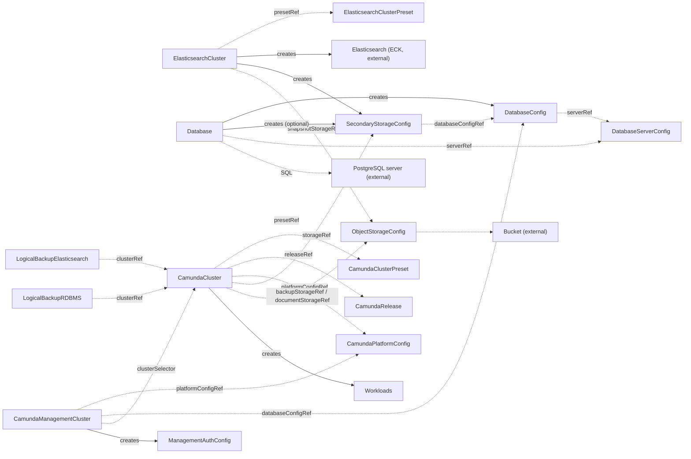

# Architecture

This page explains how the resources of the operator relate, and the rules that shape its API.
Read it when you want to understand why a feature is its own resource, or how to extend the operator.

## One small core, many attachments

`CamundaCluster` describes the orchestration cluster and nothing else.
Every other capability is its own kind. A backup, for example, is a `LogicalBackupElasticsearch` that names the cluster in `clusterRef`. The cluster does not know that the backup exists.

This is the core rule of the operator: **features attach to workloads. Workloads do not know about features.**

The rule has three consequences that you can rely on:

- A feature attaches to a cluster that you never edit for it. There is no plugin to enable and no field to set.
- A failure in an attached feature never stops the cluster.
- You can create, change, or delete an attached feature without a change to the cluster.

This is how the Kubernetes ecosystem itself works. cert-manager writes Secrets. The HorizontalPodAutoscaler patches replicas on a Deployment. Neither goes through a central coordinator.

## How a feature finds its workloads

The operator labels every resource that it creates:

| Label | Value |
| --- | --- |
| `camunda.io/cluster` | the name of the owning `CamundaCluster` |
| `camunda.io/elasticsearch-cluster` | the name of the owning `ElasticsearchCluster` |
| `camunda.io/database-server` | the name of the owning `DatabaseServer` |
| `camunda.io/database` | the name of the owning `Database` |
| `camunda.io/component` | the role of the resource, for example `zeebe`, `gateway`, `elasticsearch` |
| `app.kubernetes.io/managed-by` | `camunda-operator` |

One label key per owning kind keeps two owners of different kinds with the same name apart. Pods and volumes that another operator runs from a template of this operator, for example the Elasticsearch pods that ECK runs and the PostgreSQL pods that CloudNativePG runs, carry the owner and component labels but not the `managed-by` label.
A feature finds the workloads of a cluster through these labels, or reads the cluster directly through `clusterRef`.

When a feature needs to call the cluster, it reads `status.management` of the `CamundaCluster`. That field publishes the address of the management API, so the feature does not rebuild Service names and ports.

## Contracts carry connection details

The kinds pass connection details to each other through contract kinds, never through direct references to each other:

| Contract | Carries |
| --- | --- |
| `SecondaryStorageConfig` | where the secondary storage of a cluster is and how to authenticate |
| `DatabaseServerConfig` | a database server, its admin credentials, and its point-in-time-recovery capability |
| `DatabaseConfig` | one logical database and its credentials |
| `ObjectStorageConfig` | one bucket and how to authenticate to it |
| `ManagementAuthConfig` | the OIDC configuration of Management Identity |

The resource that provides a backend writes the contract. The resource that uses the backend reads it by name.
An `ElasticsearchCluster` writes a `SecondaryStorageConfig`. A `Database` writes a `DatabaseConfig`. A `CamundaManagementCluster` writes a `ManagementAuthConfig`. A `CamundaCluster` reads the `SecondaryStorageConfig` in `storageRef` and does not know who wrote it.

Because the consumer reads only the contract, you can also write a contract by hand, or let another tool write it. An Elasticsearch cluster that the operator does not manage, or a bucket that Crossplane provisions, looks the same to the consumer.

The operator validates every contract. It checks that the referenced Secrets and resources exist, and for a database server that the server answers. It reports the result on `Ready`. It never provisions anything.

## Some inputs must be known before creation

A few settings cannot change after a resource exists, because Kubernetes does not allow the change. The storage class of the broker volumes is one: a StatefulSet cannot change the storage class of its volume claim template.

These settings are plain fields on the resource, set before creation. `spec.zeebe.storageClassName` takes a StorageClass name. The operator does not care where the StorageClass came from.

## The resource map

Solid arrows mean "creates". Dotted arrows mean "references".
`CamundaOptimize` consumes `ManagementAuthConfig`. The [CRD reference](crds/index.md) lists every kind.

A reference by name points into the namespace of the resource that holds it. A `CamundaCluster` in `my-cluster-ns` reads the `SecondaryStorageConfig` of `storageRef` and the `ObjectStorageConfig` of `backupStorageRef` in `my-cluster-ns`. A cluster-scoped kind has no namespace of its own, so a reference to one carries a plain name. `CamundaPlatformConfig`, `ManagementAuthConfig`, `CamundaRelease`, and the three preset kinds are cluster-scoped.

The same rule holds for Secrets. A namespaced kind reads its Secrets from its own namespace only, so its `secretRef` blocks name a Secret and its keys, and never a namespace. A cluster-scoped kind names the namespace, because it has none of its own. Only `CamundaPlatformConfig` and `ManagementAuthConfig` do that, and the operator copies the Secrets they name into each namespace that reads them. A preset is cluster-scoped too, and it names no namespace. A `secretRef` on a preset resolves in the namespace of each cluster that inherits it.

The management plane is the one place where a resource reaches across namespaces. A `CamundaManagementCluster` selects `CamundaClusters` across namespaces, bounded by its `namespaceSelector`, and annotates the ones it serves. The rule still holds in the direction that matters: a `CamundaCluster` never references a management plane, and it behaves the same whether one serves it or not.

## Status conventions

Every kind that the operator acts on reports conditions, and every one has an aggregate `Ready` condition. `status.observedGeneration` records the last generation the operator reconciled.

A kind that runs workloads also reports one condition per component, named `<Component>Ready`, for example `ZeebeReady`. `Ready` takes its reason and message from the component that needs attention. When every component is healthy, the reason is `Healthy`.

The reasons you will see most:

| Reason | Meaning |
| --- | --- |
| `Healthy` | Everything the resource needs is in place. |
| `Creating`, `Updating`, `Scaling` | The workloads roll out. |
| `Failing` | A workload does not reach the desired state. |
| `Degraded`, `Down` | Some or no replicas are ready past a grace period. For Elasticsearch: yellow or red health. |
| `Suspended` | `spec.suspend` is true. `Ready` is `True`, because the resource is in its desired state. |
| `Disabled` | The component is not part of the current topology. This is not an error. |
| `InvalidReference` | A referenced resource does not exist, or the merged configuration is invalid. The message names it. |
| `MissingSecret` | A referenced Secret or key does not exist. The message names it. |
| `ConnectionFailed` | An external system did not answer. |
| `Error` | The operator hit an error. The message carries it. |

The API server accepts a resource that names something you did not create yet, so you can create resources in any order. A resource waits with `InvalidReference` or `MissingSecret` until its references exist.

## How the operator writes

The operator applies every resource that it manages with Server-Side Apply. It owns only the fields that it sets. A field that you set by hand on a managed resource stays until the operator needs that field.

## The api module

The CRD types under `api/` are the Go module `github.com/konsole-is/camunda-operator/api`. Import it to create and read the custom resources from Go. It depends on `k8s.io/api`, `k8s.io/apimachinery`, and the standard library only, so it never pulls the operator itself into your build. See [Use the API types from Go](go-api.md) for the version scheme.

## Support policy

- **Camunda 8.9 and later.** The operator targets the unified orchestration cluster that Camunda 8.9 introduced. It does not render earlier topologies.
- **Minor releases are the test matrix.** The operator is tested against Camunda minor releases. A feature that lands in a patch release is treated as part of the next minor.
- **Elasticsearch through ECK, PostgreSQL through CloudNativePG.** `ElasticsearchCluster` requires the ECK operator. `DatabaseServer` requires the CloudNativePG operator, and its archive also requires the Barman Cloud plugin and cert-manager. `Database` bootstraps a logical database on any PostgreSQL server, whether a `DatabaseServer` runs it or you do.
