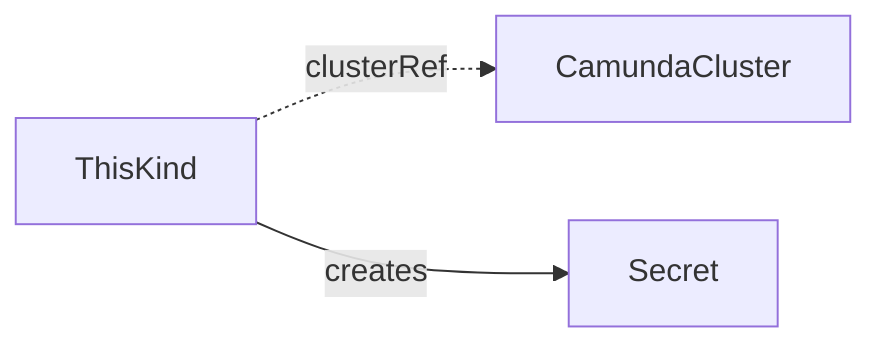

<!--
Authoring template for a CRD reference page. Copy it to docs/crds/<kind>.md.
It is not part of the published site.

Rules:
- Open with the intro, the minimal manifest, and the diagram. No "Purpose" heading.
- Then one H2 per topic a reader searches for: Endpoints, Authentication, Storage, Deletion, Suspend, and so on. Headings, never bold lead-ins.
- Then "## Status", "## Spec reference" (full YAML, then "### Validation rules", then one or more example H3s), and "## Related".
- Write for a person who uses the operator. Describe outcomes and the names a user types or waits on, not reconcile steps or internal mechanics.
- Simplified Technical English: short sentences, active voice, can/will/must, no semicolons, no em-dashes, no contractions.
- The API group is core.camunda.io/v1. Names in examples: cluster `my-cluster` in namespace `my-cluster-ns`, derived names `my-cluster-es`, `my-cluster-backup`, config kinds `my-storage-config`, `my-db-server`, `my-platform-config`, `my-backup-bucket`. In this template the placeholder resource is `my-cluster-example`. Replace it with the derived name of your kind.
- Verify every field, default, and condition against api/v1 and internal/controller before you write it.
-->

# Kind

One or two paragraphs: what this kind is, who creates it, what the operator creates from it.

The smallest manifest:

```yaml
apiVersion: core.camunda.io/v1
kind: Kind
metadata:
  name: my-cluster-example
  namespace: my-cluster-ns
spec:
  clusterRef:
    name: my-cluster
```



## Topic

One section per behavior a user relies on. Name the names a user types or waits on. At most six sentences per paragraph.

## Deletion

What is removed. What is kept.

## Status

| Type | Reason | Meaning | What to do |
| --- | --- | --- | --- |
| `Ready` | `Healthy` | The resource is fully reconciled. | Nothing. |
| `Ready` | `InvalidReference` | A referenced resource does not exist. The message names it. | Create it, or fix the reference. |

`status.observedGeneration` is the last generation the operator reconciled.

## Spec reference

Every field, with its type, whether it is required, and its default:

```yaml
apiVersion: core.camunda.io/v1
kind: Kind
metadata:
  name: my-cluster-example
  namespace: my-cluster-ns
spec:
  # object. Required. The CamundaCluster this resource attaches to.
  clusterRef:
    # string. Required. Name of the CamundaCluster, in this namespace.
    name: my-cluster
```

Each field has one comment line above it: `# <type>. <Required|Optional>[, default: <value>]. <meaning>`.

### Validation rules

- Rules the API server enforces at admission, and the immutable fields.
- If there are none beyond the schema, say so in one line.

### A production-shaped example

```yaml
apiVersion: core.camunda.io/v1
kind: Kind
metadata:
  name: my-cluster-example
  namespace: my-cluster-ns
spec:
  clusterRef:
    name: my-cluster
```

## Related

- [CamundaCluster](camundacluster.md): referenced through `clusterRef`.
- [A guide](../guides/operations.md): when a guide uses this kind.
