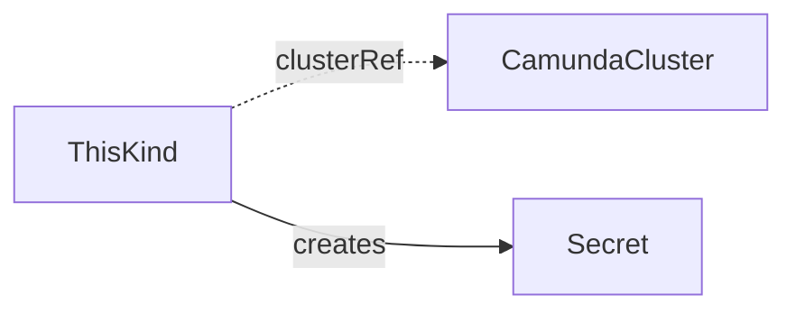

<!--
Authoring template for a CRD reference page. Copy it to docs/crds/<kind>.md.
It is not part of the published site.

Rules for every reference page:
- Exactly these H2 sections, in this order: Purpose, What it does, Spec, Status, Validation, Related, Examples.
- Write for a person who uses the operator, not for a person who builds it. No reconcile steps, no field managers, no internal mechanics. Describe outcomes: what is created, what the names are, what the user can rely on.
- Simplified Technical English: short sentences, active voice, can/will/must, no semicolons, no em-dashes, no contractions.
- The API group is core.camunda.io/v1.
- Names in examples: cluster `my-cluster` in namespace `my-cluster-ns`, `my-cluster-es`, `my-storage-config`, `my-db-server`, `my-platform-config`, `my-backup-bucket`.
- Verify every field, default, and condition against api/v1 and internal/controller before you write it.
-->

# Kind

One sentence: what this kind is, and who creates it.

## Purpose

One or two short paragraphs. What problem it solves. When you use it.
A contract kind adds a two-row table: Producers and Consumers.

## What it does

The resources the operator creates from this kind, with their exact names and labels:

- A Secret `<name>-...` with the keys `...`.
- A Service `<name>-...` on port `...`.



Then short bold-led paragraphs for the behaviors a user relies on, only where they apply.
Each one is at most four sentences.

**Deletion.** What is removed. What is kept.

**Suspend.** What happens, and what `Ready` reports.

**Password rotation.** Which Secret to delete, and what happens next.

**Missing references.** What `Ready` reports while a reference does not exist.

**Changes.** What happens when you edit this resource or a resource it references.

## Spec

```yaml
apiVersion: core.camunda.io/v1
kind: Kind
metadata:
  name: my-cluster-example
  namespace: my-cluster-ns
spec:
  # object. Required. The CamundaCluster this resource attaches to.
  clusterRef:
    # string. Required. Name of the CamundaCluster, in this namespace.
    name: my-cluster
```

Each field has one comment line above it: `# <type>. <Required|Optional>[, default: <value>]. <meaning>`.

## Status

| Type | Reason | Meaning | What to do |
| --- | --- | --- | --- |
| `Ready` | `Healthy` | The resource is fully reconciled. | Nothing. |
| `Ready` | `InvalidReference` | A referenced resource does not exist. The message names it. | Create it, or fix the reference. |

`status.observedGeneration` is the last generation the operator reconciled.

## Validation

- Rules the API server enforces at admission, and the immutable fields.
- If there are none beyond the schema, say so in one line.

## Related

- [CamundaCluster](camundacluster.md): referenced through `clusterRef`.
- [A guide](../guides/operations.md): when a guide uses this kind.

## Examples

A minimal manifest:

```yaml
apiVersion: core.camunda.io/v1
kind: Kind
metadata:
  name: my-cluster-example
  namespace: my-cluster-ns
spec:
  clusterRef:
    name: my-cluster
```

A realistic manifest:

```yaml
apiVersion: core.camunda.io/v1
kind: Kind
metadata:
  name: my-cluster-example
  namespace: my-cluster-ns
spec:
  clusterRef:
    name: my-cluster
```
