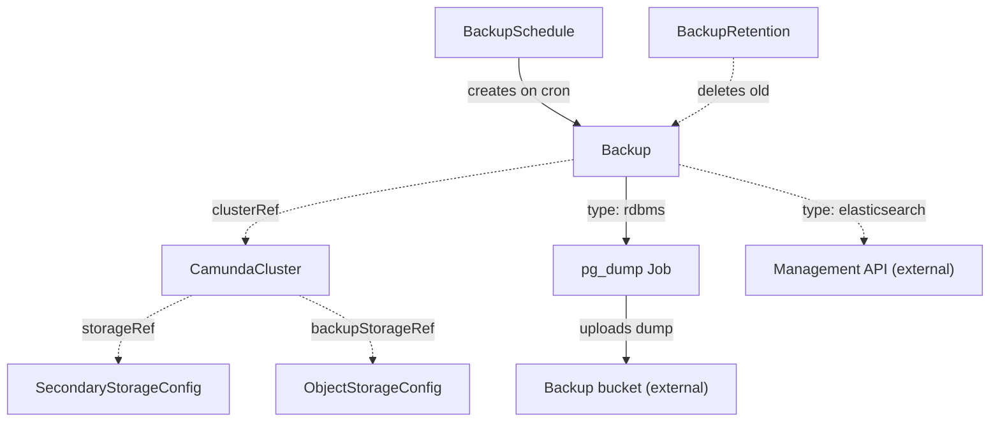

# Backup

A Backup represents one backup operation of an orchestration cluster and tracks it to completion.

## Purpose

A Backup captures a consistent, restorable copy of a `CamundaCluster`'s data: its secondary storage contents and, on the Elasticsearch path, a snapshot of every Zeebe partition.
You create Backup CRs by hand for one-off backups, a [BackupSchedule](backupschedule.md) creates them on a cron schedule, and a composition layer above may create them programmatically.
Completed Backups are consumed by [LogicalRestore](logicalrestore.md) and garbage-collected by [BackupRetention](backupretention.md).

## How it works

The operator reconciles a Backup as a one-shot, phase-driven operation:

1. Resolve `clusterRef` and read the referenced `CamundaCluster`'s Camunda version, component topology, `storageRef`, and `backupStorageRef`.
2. Fail with `Ready: InvalidReference` if the cluster does not exist or has no `backupStorageRef`, and with `Ready: ClusterSuspended` if the cluster is suspended — the management API is unreachable while workloads are scaled down.
3. Resolve `storageRef` to the cluster's `SecondaryStorageConfig` and branch on `spec.type`.
4. Allocate a backup ID — a monotonically increasing integer, the Unix timestamp at which the backup started — and record it in `status.backupId`. On the RDBMS path Zeebe generates primary-storage backup IDs itself, so `status.backupId` identifies the logical dump instead.
5. Run the storage-type-specific procedure below, moving `status.phase` from `Pending` to `Running`.
6. On success set `status.phase: Completed` and `Ready: Completed`; on any failure set `status.phase: Failed` with the failing step recorded in the `Ready` condition message.

**Elasticsearch path.** All management calls go to the orchestration cluster's management port (9600), served by the unified Camunda application. The operator selects endpoint paths version-aware: Camunda 8.8+ serves `/actuator/backupHistory` and `/actuator/backupRuntime`; the legacy `/actuator/backups` endpoint only exists on standalone component deployments, which this operator never creates.

1. Soft-pause exporting: `POST /actuator/exporting/pause?soft=true`. Records keep exporting but log compaction stops, making this a hot backup.
2. Back up the web-application indices: `POST /actuator/backupHistory` with the backup ID, then poll `GET /actuator/backupHistory/{backupId}` until every scheduled snapshot completes.
3. Snapshot the exported Zeebe record indices (`camunda_zeebe_records_backup_<backupId>`) directly through the Elasticsearch snapshot API, authenticated with the credentials from the `SecondaryStorageConfig` — Camunda exposes no management endpoint for these indices.
4. Back up the Zeebe partitions: `POST /actuator/backupRuntime` with the same backup ID, then poll `GET /actuator/backupRuntime/{backupId}` until the partition backup completes in the configured backup store.
5. When a `CamundaOptimize` references the cluster (found via the field index on its `clusterRef`), drive Optimize's backup actuator with the same backup ID and poll it to completion, adding Optimize's analytics indices to the set; when no Optimize is attached, the optimize indices are not part of the set.
6. Resume exporting: `POST /actuator/exporting/resume`. This step always runs, including after a failure in steps 2–5, because a cluster left soft-paused cannot compact its log and will eventually fill its disks.

The Elasticsearch path always uses the single allocated backup ID across all parts — web-application indices, Zeebe record indices, Zeebe partitions, and Optimize when attached — so a backup is one coordinated set that [LogicalRestore](logicalrestore.md) locates by one identifier.

The Elasticsearch path requires a snapshot repository registered in Elasticsearch and the same repository name configured on the Camunda components, plus a Zeebe backup store (S3, GCS, Azure, or filesystem); the `CamundaCluster` controller derives both from the cluster's `backupStorageRef`.

**RDBMS path.**

1. Resolve the logical database via `storageRef` → `SecondaryStorageConfig` → `DatabaseConfig`.
2. Fail with `Ready: MissingSecret` if the `SecondaryStorageConfig`'s referenced `DatabaseConfig` has no `backupCredentialsSecretRef`.
3. Create a Job that runs `pg_dump` over the entire logical Camunda database — all component tables, including the `EXPORTER_POSITION` table that later drives restore alignment — and uploads the dump to the bucket described by the cluster's `backupStorageRef` (`ObjectStorageConfig`), keyed by the Backup's namespace, name, and backup ID. The operator applies the Job with Server-Side Apply (SSA) under the field manager `camunda-operator/backup`.
4. Track the Job to completion; the Job's outcome drives `status.phase`.

On the RDBMS path the Backup CR captures the logical database dump only. Zeebe's primary storage is covered separately by continuous, scheduled primary-storage backups that Zeebe's internal backup scheduler writes to the same backup store with auto-generated IDs; the `CamundaCluster` controller enables that scheduler whenever an RDBMS-backed cluster has a `backupStorageRef`. The two are aligned at restore time through the exporter position stored in the dump, so no shared backup ID is needed.



**What a backup contains.**

- Elasticsearch: the web-application snapshots (`camunda_webapps_<backupId>_<version>_part_N_of_M`) and the Zeebe record snapshot (`camunda_zeebe_records_backup_<backupId>`) in the Elasticsearch snapshot repository, plus the Zeebe partition backup under the same backup ID in the backup store bucket; when a `CamundaOptimize` is attached to the cluster, also the Optimize snapshots (`camunda_optimize_<backupId>_*`) under the same backup ID.
- RDBMS: a `pg_dump` archive of the entire logical Camunda database in the backup bucket, restorable together with the cluster's continuous primary-storage backups.

When a Backup CR is deleted, a finalizer removes the stored artifacts: the Elasticsearch snapshots and the Zeebe partition backup via their delete APIs on the Elasticsearch path, or the dump object on the RDBMS path. Cleanup is best-effort when the source cluster no longer exists.

!!! note "Deviation from the original proposal"
    The proposal described the Elasticsearch path as "version-aware backup APIs on zeebe and gateway". Verified against Camunda 8.9 (documentation and source): there is a single management API on the orchestration cluster's management port with two backup endpoints (`backupHistory` for web-application indices, `backupRuntime` for Zeebe partitions), and a complete backup additionally requires soft-pausing exporting and snapshotting the exported Zeebe record indices directly in Elasticsearch — both absent from the proposal.
    On the RDBMS path, Camunda 8.9 introduces *continuous* backup and restore — but continuous mode covers Zeebe's primary storage only (log checkpoints written to the backup store on Zeebe's own schedule, with auto-generated backup IDs). The RDBMS itself has no Camunda backup tooling at all: Camunda's documentation assigns database dumps to the database administrator, and the 8.9 source contains no backup code in the RDBMS modules. The proposal's `pg_dump` Job therefore stands as this operator's RDBMS procedure, while continuous primary-storage backup is a `CamundaCluster`-side concern that a Backup CR never triggers. A `/v2/backups` REST API exists only from Camunda 8.10 on and is deliberately not used here.

## API reference

```yaml
apiVersion: core.camunda.io/v1
kind: Backup
metadata:
  name: my-cluster-backup-001
  namespace: my-cluster-ns
spec:
  # object. Required. Reference to the CamundaCluster to back up.
  clusterRef:
    # string. Required. Name of the CamundaCluster.
    name: my-cluster
    # string. Optional, default: this CR's namespace. Namespace of the CamundaCluster.
    namespace: my-cluster-ns
```

## Status

| Type | Reason | Meaning |
| --- | --- | --- |
| `Ready` | `Completed` | The backup finished and is restorable. |
| `Ready` | `Progressing` | The backup is running. |
| `Ready` | `Failed` | The backup failed; the message names the failing step. |
| `Ready` | `InvalidReference` | The cluster does not exist or has no `backupStorageRef`. |
| `Ready` | `MissingSecret` | RDBMS path: the resolved `DatabaseConfig` has no backup credentials. |
| `Ready` | `ClusterSuspended` | The cluster is suspended, so its management API is unreachable. |

`status.phase` tracks the long-running operation: `Pending | Running | Completed | Failed`.

`status.backupId` records the allocated backup ID; [LogicalRestore](logicalrestore.md) reads it to locate the artifacts.

The operator records the last reconciled generation in `status.observedGeneration`.

## Validation

- `spec` is immutable after creation: a Backup is a one-shot operation, retried by creating a new CR.
- Existence of the cluster, its `backupStorageRef`, and RDBMS backup credentials are validated at reconcile time and surface as `Ready` condition reasons, not admission failures, because the referenced resources can change after creation.

## Relationships

- [CamundaCluster](camundacluster.md) — referenced via `clusterRef`; the operator reads its version, topology, `storageRef`, and `backupStorageRef`.
- [SecondaryStorageConfig](secondarystorageconfig.md) — resolved via the cluster's `storageRef` to determine the storage type and credentials.
- [DatabaseConfig](databaseconfig.md) — resolved on the RDBMS path for the logical database and backup credentials.
- [ObjectStorageConfig](objectstorageconfig.md) — resolved via the cluster's `backupStorageRef`; the bucket that receives dumps and partition backups.
- [BackupSchedule](backupschedule.md) — creates Backups on a cron schedule.
- [BackupRetention](backupretention.md) — deletes the oldest completed Backups beyond a retained count.
- [LogicalRestore](logicalrestore.md) — restores a completed Backup into a target cluster via `backupRef`.
- [CamundaOptimize](camundaoptimize.md) — when one references the backed-up cluster, its analytics indices join the Elasticsearch-path backup set under the same backup ID.

## Examples

A minimal manifest:

```yaml
apiVersion: core.camunda.io/v1
kind: Backup
metadata:
  name: my-cluster-backup-001
  namespace: my-cluster-ns
spec:
  clusterRef:
    name: my-cluster
```

A realistic manifest:

```yaml
apiVersion: core.camunda.io/v1
kind: Backup
metadata:
  name: my-cluster-backup-pre-upgrade
  namespace: my-cluster-ns
  labels:
    camunda.io/cluster: my-cluster
spec:
  clusterRef:
    name: my-cluster
    namespace: my-cluster-ns
```
