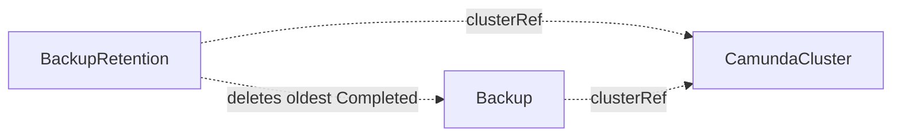

# BackupRetention

A BackupRetention deletes the oldest completed [Backup](backup.md) CRs of one orchestration cluster beyond a retained count.

## Purpose

A BackupRetention keeps the number of stored backups for a `CamundaCluster` bounded so backup storage does not grow forever.
You create it, or a composition layer above creates it as part of a managed backup policy.
It pairs with a [BackupSchedule](backupschedule.md): the schedule produces backups, the retention prunes them.

## How it works

1. The operator watches [Backup](backup.md) CRs and reconciles the BackupRetention whenever a Backup for the referenced cluster changes, using a field index on the Backups' `clusterRef`.
2. It lists all Backups in the cluster's namespace whose `clusterRef` resolves to the referenced `CamundaCluster`.
3. It filters the list to Backups with `status.phase: Completed` and sorts them by completion time.
4. If more than `spec.retainedCount` completed Backups exist, it deletes the oldest ones until exactly `retainedCount` remain. Deleting a Backup CR triggers the Backup finalizer, which removes the stored snapshots or dump.
5. Backups in `Pending` or `Running` are never touched, and never counted against `retainedCount`.
6. `Failed` Backups are also never deleted: they are kept for diagnosis and cleaned up manually. Only completed backups are subject to retention.



## API reference

```yaml
apiVersion: core.camunda.io/v1
kind: BackupRetention
metadata:
  name: my-cluster-retention
  namespace: my-cluster-ns
spec:
  # object. Required. Reference to the CamundaCluster whose Backups are pruned.
  clusterRef:
    # string. Required. Name of the CamundaCluster.
    name: my-cluster
    # string. Optional, default: this CR's namespace. Namespace of the CamundaCluster.
    namespace: my-cluster-ns
  # integer. Required, minimum: 1. Number of completed Backups to keep.
  retainedCount: 3
```

## Status

| Type | Reason | Meaning |
| --- | --- | --- |
| `Ready` | `Healthy` | Retention is active and the completed-backup count is within bounds. |
| `Ready` | `InvalidReference` | The referenced CamundaCluster does not exist. |

The operator records the last reconciled generation in `status.observedGeneration`.

## Validation

- `spec.retainedCount` must be at least 1.
- Creating a second BackupRetention that references the same `CamundaCluster` is rejected at admission: two retention policies with different counts would fight over the same Backups.

## Relationships

- [Backup](backup.md) — the CRs this controller deletes once they exceed the retained count.
- [BackupSchedule](backupschedule.md) — produces the recurring Backups this CR prunes.
- [CamundaCluster](camundacluster.md) — referenced via `clusterRef`; scopes which Backups are considered.

## Examples

A minimal manifest:

```yaml
apiVersion: core.camunda.io/v1
kind: BackupRetention
metadata:
  name: my-cluster-retention
  namespace: my-cluster-ns
spec:
  clusterRef:
    name: my-cluster
  retainedCount: 3
```

A realistic manifest:

```yaml
apiVersion: core.camunda.io/v1
kind: BackupRetention
metadata:
  name: my-cluster-retention
  namespace: my-cluster-ns
  labels:
    camunda.io/cluster: my-cluster
spec:
  clusterRef:
    name: my-cluster
    namespace: my-cluster-ns
  # Keep a week of nightly backups.
  retainedCount: 7
```
