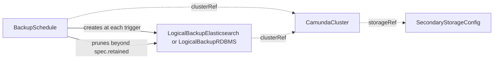

# BackupSchedule

`BackupSchedule` takes logical backups of one `CamundaCluster` on a cron schedule. You create it, or another tool creates it for you.

At each trigger the operator creates one backup of the kind that matches the secondary storage of the cluster: `LogicalBackupElasticsearch` for an Elasticsearch cluster, `LogicalBackupRDBMS` for a relational one. The controller of that kind runs the backup. The schedule also owns retention: it deletes its own terminal backups beyond `spec.retained`, and the deletion removes the stored artifacts too.

`kubectl get backupschedules` lists the schedules with the cluster, the cron expression, the last trigger, the last backup, and the age.

Before you create a schedule, make sure that:

- The `CamundaCluster` has `spec.storageRef` and `spec.backupStorageRef`.
- The `SecondaryStorageConfig` that the cluster names exists.
- The schedule lives in the namespace of the cluster.

The smallest schedule names the cluster and the cron expression:

```yaml
apiVersion: core.camunda.io/v1
kind: BackupSchedule
metadata:
  name: my-cluster-schedule
  namespace: my-cluster-ns
spec:
  clusterRef:
    name: my-cluster
  schedule: "0 2 * * *"
```



## The cron expression

`spec.schedule` is a five-field cron expression: minute, hour, day of month, month, and day of week. The operator evaluates it in UTC. The time zone of the cluster, of the node, and of your workstation does not change the trigger time.

```yaml
spec:
  # 02:00 UTC every day.
  schedule: "0 2 * * *"
  # ... the rest of your schedule
```

The first trigger comes after the creation of the schedule. Every later trigger follows `status.lastScheduleTime`.

One trigger creates at most one backup. If the operator is down for a longer time, the triggers of that time do not queue up. Only the latest one fires, and the schedule continues from there.

You can change `spec.schedule` and `spec.retained` at any time. The new values apply at once.

## The backups that a schedule creates

The `SecondaryStorageConfig` of the cluster selects the kind. An Elasticsearch cluster gets a `LogicalBackupElasticsearch`. A relational cluster gets a `LogicalBackupRDBMS`.

The name of a created backup is `<schedule>-<unix-timestamp>` of the trigger. The labels name the cluster and the schedule:

```yaml
apiVersion: core.camunda.io/v1
kind: LogicalBackupRDBMS
metadata:
  name: my-cluster-schedule-1787104800
  namespace: my-cluster-ns
  labels:
    camunda.io/cluster: my-cluster
    camunda.io/backup-schedule: my-cluster-schedule
spec:
  clusterRef:
    name: my-cluster
```

To list the backups of one schedule, select on the label:

```bash
kubectl get lbrdbms -n my-cluster-ns -l camunda.io/backup-schedule=my-cluster-schedule
```

A backup name stops at 253 characters and a label value at 63. A schedule name that is too long for one of the two is cut there, and a hash of the full name is added. Two such schedules stay apart. The selector above matches while the schedule name is 63 characters or less. For a longer name the label carries the cut form. `kubectl get lbrdbms --show-labels` shows the value to select on.

Each creation records the Normal event `BackupCreated` on the schedule. The event names the kind and the backup.

## Skipped triggers

The operator skips a trigger and creates no backup when:

- The cluster is suspended. A suspended cluster answers no call, so a backup can only fail. Both causes of a suspension skip the trigger: `spec.suspend` on the cluster, and a `SecondaryStorageConfig` that another `CamundaCluster` holds. The second one shows on the cluster as `Ready` reason `StorageAlreadyAttached`.
- A backup of this schedule has not reached a terminal phase. Two backups of one schedule never overlap.
- A reference of the schedule does not resolve. The `Ready` condition already says which one.

The first two cases record the Normal event `TriggerSkipped`. The third one records no event, because the condition carries the cause.

A skipped trigger is consumed. The operator does not retry it and does not create the backup later. The next backup runs at the next trigger of the cron expression.

`kubectl describe backupschedule my-cluster-schedule -n my-cluster-ns` shows the events:

```text
Type    Reason          Message
Normal  BackupCreated   Created LogicalBackupRDBMS "my-cluster-schedule-1787104800"
Normal  TriggerSkipped  Skipped the trigger at 2026-08-20T02:00:00Z: CamundaCluster "my-cluster" is suspended
Normal  TriggerSkipped  Skipped the trigger at 2026-08-21T02:00:00Z: backup "my-cluster-schedule-1787104800" has not finished
```

## Retention

`spec.retained` bounds how many backups of this schedule are kept, per terminal phase:

```yaml
spec:
  retained:
    # Two weeks of nightly backups.
    completed: 14
    failed: 1
  # ... the rest of your schedule
```

The operator deletes the oldest completed backups beyond `retained.completed`, by completion time. It deletes the oldest failed backups beyond `retained.failed` the same way. A backup that is still `Pending` or `Running` is never deleted.

Retention is schedule-owned. The operator prunes only the backups that carry the label `camunda.io/backup-schedule` of this schedule. A backup that you create by hand carries no such label, so no schedule ever prunes it.

A pruned backup is deleted through its own finalizer, so the stored artifacts go with it. For an Elasticsearch backup these are the snapshots and the partition backup. For a relational backup this is the database dump. Each deletion records the Normal event `BackupPruned`.

The operator prunes at each trigger, after a change to the schedule, and when one of its backups reaches a terminal phase. If you lower a bound, the overflow is deleted at once.

`spec.retained` is always in effect. A schedule that sets no bounds keeps 7 completed and 3 failed backups.

## Backups that outlive the primary storage

A `LogicalBackupRDBMS` is one database dump plus the Zeebe backup of its time. The two together are one restore point. Zeebe deletes the primary-storage backups that fall outside `spec.backup.primaryStorage.retention.window` of the cluster, `P7D` by default. A dump that is older than that window can no longer be restored.

For a relational cluster the operator compares the age of the oldest retained dump with that window. The age is `retained.completed` times the interval between two triggers. If the dumps live longer than the window, the operator records the Warning event `RetentionWindowExceeded` at the trigger:

```text
Type     Reason                   Message
Warning  RetentionWindowExceeded  the schedule keeps 14 completed backups at one every 24h0m0s, so the oldest
                                  dump lives about 336h0m0s, longer than the primary-storage retention window
                                  P7D of the cluster; dumps older than the window can no longer be restored
```

To clear the warning, lower `retained.completed`, take the backups less often, or raise the retention window of the cluster.

The operator records no such warning when `spec.backup.primaryStorage.retention.cleanupSchedule` of the cluster is `none`, because Zeebe then deletes no primary-storage backup. The check does not run for an Elasticsearch cluster.

## Deletion

When you delete a `BackupSchedule`, its backups stay. They carry no owner reference to the schedule, on purpose. No trigger fires again, and nothing prunes those backups again. Delete the backups you no longer want, or create a schedule of the same name again to take the pruning back.

A schedule has no suspend field. To stop the backups for a time, delete the schedule. While the cluster itself is suspended, every trigger is skipped.

## Status

| Type | Reason | Meaning | What to do |
| --- | --- | --- | --- |
| `Ready` | `Healthy` | The references resolve and the schedule can run its backups. | Nothing. |
| `Ready` | `InvalidReference` | The `CamundaCluster` does not exist, it has no `spec.storageRef` or `spec.backupStorageRef`, its `SecondaryStorageConfig` does not exist, or `spec.schedule` is not a valid cron expression. The message names the cause. | Create the resource, set the missing field, or correct `spec.schedule`. |

`Ready` reports the references only. A skipped trigger is an event, not a condition, because a suspended cluster and a running backup are expected states.

A healthy schedule that took a backup reads:

```yaml
status:
  # The most recent trigger that the schedule consumed. A skipped trigger is consumed too.
  lastScheduleTime: "2026-08-19T02:00:00Z"
  # The backup that the schedule created most recently.
  lastBackupName: my-cluster-schedule-1787104800
  # The last generation that the operator reconciled.
  observedGeneration: 2
  conditions:
    - type: Ready
      status: "True"
      reason: Healthy
      message: the schedule can run its backups
      observedGeneration: 2
      lastTransitionTime: "2026-08-19T02:00:00Z"
```

A schedule whose cluster is gone reads:

```yaml
status:
  lastScheduleTime: "2026-08-19T02:00:00Z"
  lastBackupName: my-cluster-schedule-1787104800
  observedGeneration: 2
  conditions:
    - type: Ready
      status: "False"
      reason: InvalidReference
      message: CamundaCluster my-cluster-ns/my-cluster does not exist
      observedGeneration: 2
      lastTransitionTime: "2026-08-20T02:00:00Z"
```

## Spec reference

Every field, with its type, whether it is required, and its default:

```yaml
apiVersion: core.camunda.io/v1
kind: BackupSchedule
metadata:
  name: my-cluster-schedule
  namespace: my-cluster-ns
spec:
  # object. Required. The CamundaCluster to back up, in the namespace of this resource. It needs a storageRef and a backupStorageRef.
  clusterRef:
    # string. Required. Name of the CamundaCluster.
    name: my-cluster
  # string. Required. Five-field cron expression (minute, hour, day of month, month, day of week), evaluated in UTC.
  schedule: "0 2 * * *"
  # object. Optional. How many backups of this schedule are kept. The defaults below apply when you set nothing.
  retained:
    # integer. Optional, default: 7. How many completed backups the schedule keeps. Minimum 1.
    completed: 7
    # integer. Optional, default: 3. How many failed backups the schedule keeps. Minimum 0. Zero deletes a failed backup at the first look after it fails.
    failed: 3
```

### Validation rules

- `spec.clusterRef.name` is required and must not be empty. The cluster must live in the namespace of the schedule.
- `spec.schedule` is required. The API server checks the shape only: five fields, separated by whitespace, of the cron characters. A value out of range, for example the minute `99`, passes admission. The operator then reports `InvalidReference` on `Ready`. Seconds fields and `@daily` style descriptors are rejected at admission.
- `spec.retained.completed` must be 1 or more. `spec.retained.failed` must be 0 or more.
- The spec is mutable. Every field can be changed on a live schedule.

### A production-shaped example

A nightly schedule that keeps two weeks of backups and only the last failure:

```yaml
apiVersion: core.camunda.io/v1
kind: BackupSchedule
metadata:
  name: my-cluster-schedule
  namespace: my-cluster-ns
  labels:
    camunda.io/cluster: my-cluster
spec:
  clusterRef:
    name: my-cluster
  # 02:00 UTC every day, outside business hours.
  schedule: "0 2 * * *"
  retained:
    completed: 14
    failed: 1
```

`kubectl get backupschedules -n my-cluster-ns` then shows the cluster, the cron expression, the last trigger, and the last backup that the schedule created.

## Related

- [CamundaCluster](camundacluster.md): the cluster that the schedule backs up. Its suspension gates the triggers, and its `spec.backup.primaryStorage.retention.window` bounds how long a dump stays restorable.
- [SecondaryStorageConfig](secondarystorageconfig.md): its `spec.type` selects the backup kind that each trigger creates.
- [LogicalBackupElasticsearch](logicalbackupelasticsearch.md): the backup kind for an Elasticsearch cluster.
- [LogicalBackupRDBMS](logicalbackuprdbms.md): the backup kind for a relational cluster.
- [Backup guide](../guides/backup.md): how to set up backup storage and take a backup.
