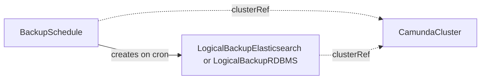

# BackupSchedule

A BackupSchedule creates logical backups of one orchestration cluster on a cron schedule.

## Purpose

A BackupSchedule creates the recurring backups of a `CamundaCluster` for you.
You then create no backup by hand.
You create the schedule, or a composition layer above creates it as part of a managed backup policy.
The schedule only creates the backup CRs.
The controller of the backup kind runs the procedure.
The schedule also owns retention: it prunes its own completed backups to `retained`.

## How it works

1. The operator parses `spec.schedule` and computes the next trigger time from `status.lastScheduleTime`, or from the CR's creation time on first reconcile.
2. At each trigger it resolves `clusterRef`; if the cluster does not exist, it records `Ready: InvalidReference` and skips the trigger.
3. If the referenced cluster is suspended, the operator skips the trigger and creates no backup. The management API of a suspended cluster is unreachable, so a backup can only fail. The operator records the skip as an event and does not retry the trigger. The next trigger fires normally once the cluster is unsuspended.
4. If a backup that this schedule created earlier is still `Pending` or `Running`, the operator skips the trigger the same way. Overlapping backups are never created.
5. Otherwise the operator creates the logical backup that matches the secondary storage of the cluster. The name is `<schedule-name>-<unix-timestamp>`, for example `my-cluster-schedule-1748937221`. The labels are `camunda.io/cluster: <cluster-name>` and `camunda.io/backup-schedule: <schedule-name>`.
6. A created backup carries no owner reference to the schedule. When you delete a BackupSchedule, its backups stay. The schedule prunes its own completed backups to `retained` instead.
7. The operator records the trigger in `status.lastScheduleTime` and the created CR in `status.lastBackupName`.



## API reference

```yaml
apiVersion: core.camunda.io/v1
kind: BackupSchedule
metadata:
  name: my-cluster-schedule
  namespace: my-cluster-ns
spec:
  # object. Required. Reference to the CamundaCluster to back up on schedule,
  # in the namespace of this CR.
  clusterRef:
    # string. Required. Name of the CamundaCluster.
    name: my-cluster
  # string. Required. Standard five-field cron expression evaluated in UTC.
  schedule: "0 2 * * *"
```

## Status

| Type | Reason | Meaning |
| --- | --- | --- |
| `Ready` | `Healthy` | The schedule is active and triggers are being evaluated. |
| `Ready` | `InvalidReference` | The referenced CamundaCluster does not exist. |

`status.lastScheduleTime` records the most recent trigger that the operator evaluated. `status.lastBackupName` records the name of the most recent backup that it created.

The operator records a skipped trigger as an event on the BackupSchedule, not as a condition. A suspended cluster and a previous backup that still runs are both expected transient states.

The operator records the last reconciled generation in `status.observedGeneration`.

## Validation

- `spec.schedule` must be a valid five-field cron expression; invalid expressions are rejected at admission.

## Relationships

- [LogicalBackupElasticsearch](logicalbackupelasticsearch.md), [LogicalBackupRDBMS](logicalbackuprdbms.md) — created by this CR on each trigger, and pruned by it to `retained`.
- [CamundaCluster](camundacluster.md) — referenced via `clusterRef`, in the namespace of this CR. Its suspend state gates trigger execution.

## Examples

A minimal manifest:

```yaml
apiVersion: core.camunda.io/v1
kind: BackupSchedule
metadata:
  name: my-cluster-schedule
  namespace: my-cluster-ns
spec:
  clusterRef:
    name: my-cluster
  schedule: "0 2 * * *"
```

A realistic manifest:

```yaml
apiVersion: core.camunda.io/v1
kind: BackupSchedule
metadata:
  name: my-cluster-schedule
  namespace: my-cluster-ns
  labels:
    camunda.io/cluster: my-cluster
spec:
  clusterRef:
    name: my-cluster
  # Nightly at 02:00 UTC, outside business hours.
  schedule: "0 2 * * *"
```
