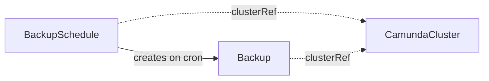

# BackupSchedule

A BackupSchedule creates [Backup](backup.md) CRs for one orchestration cluster on a cron schedule.

## Purpose

A BackupSchedule automates recurring backups of a `CamundaCluster` so you do not have to create [Backup](backup.md) CRs by hand.
You create it, or a composition layer above creates it as part of a managed backup policy.
It only creates Backup CRs — the backup procedure itself is owned by the Backup controller, and old backups are cleaned up by [BackupRetention](backupretention.md), not by the schedule.

## How it works

1. The operator parses `spec.schedule` and computes the next trigger time from `status.lastScheduleTime`, or from the CR's creation time on first reconcile.
2. At each trigger it resolves `clusterRef`; if the cluster does not exist, it records `Ready: InvalidReference` and skips the trigger.
3. If the referenced cluster is suspended, the operator skips the trigger without creating a Backup — a suspended cluster's management API is unreachable, so the Backup would only fail. The skip is recorded as an event and the trigger is not retried; the next trigger fires normally once the cluster is unsuspended.
4. If a Backup previously created by this schedule is still `Pending` or `Running`, the trigger is skipped the same way — overlapping backups are never created.
5. Otherwise the operator creates a Backup named `<schedule-name>-<unix-timestamp>`, for example `my-cluster-schedule-1748937221`, labeled with `camunda.io/cluster: <cluster-name>` and `camunda.io/backup-schedule: <schedule-name>`.
6. Created Backups carry no owner reference to the schedule: deleting a BackupSchedule must never delete the backups it produced. Retention is [BackupRetention](backupretention.md)'s job.
7. The operator records the trigger in `status.lastScheduleTime` and the created CR in `status.lastBackupName`.



## API reference

```yaml
apiVersion: core.camunda.io/v1
kind: BackupSchedule
metadata:
  name: my-cluster-schedule
  namespace: my-cluster-ns
spec:
  # object. Required. Reference to the CamundaCluster to back up on schedule.
  clusterRef:
    # string. Required. Name of the CamundaCluster.
    name: my-cluster
    # string. Optional, default: this CR's namespace. Namespace of the CamundaCluster.
    namespace: my-cluster-ns
  # string. Required. Standard five-field cron expression evaluated in UTC.
  schedule: "0 2 * * *"
```

## Status

| Type | Reason | Meaning |
| --- | --- | --- |
| `Ready` | `Healthy` | The schedule is active and triggers are being evaluated. |
| `Ready` | `InvalidReference` | The referenced CamundaCluster does not exist. |

`status.lastScheduleTime` records the most recent trigger that was evaluated, and `status.lastBackupName` the most recent Backup created.

Skipped triggers — suspended cluster or a still-running previous Backup — are surfaced as events on the BackupSchedule, not as conditions, because they are expected transient states.

The operator records the last reconciled generation in `status.observedGeneration`.

## Validation

- `spec.schedule` must be a valid five-field cron expression; invalid expressions are rejected at admission.

## Relationships

- [Backup](backup.md) — created by this CR on each trigger.
- [BackupRetention](backupretention.md) — complements this CR by deleting the oldest completed Backups.
- `CamundaCluster` — referenced via `clusterRef`; its suspend state gates trigger execution.

## Examples

A minimal manifest:

```yaml
apiVersion: core.camunda.io/v1
kind: BackupSchedule
metadata:
  name: my-cluster-schedule
  namespace: my-cluster-ns
spec:
  clusterRef:
    name: my-cluster
  schedule: "0 2 * * *"
```

A realistic manifest:

```yaml
apiVersion: core.camunda.io/v1
kind: BackupSchedule
metadata:
  name: my-cluster-schedule
  namespace: my-cluster-ns
  labels:
    camunda.io/cluster: my-cluster
spec:
  clusterRef:
    name: my-cluster
    namespace: my-cluster-ns
  # Nightly at 02:00 UTC, outside business hours.
  schedule: "0 2 * * *"
```
