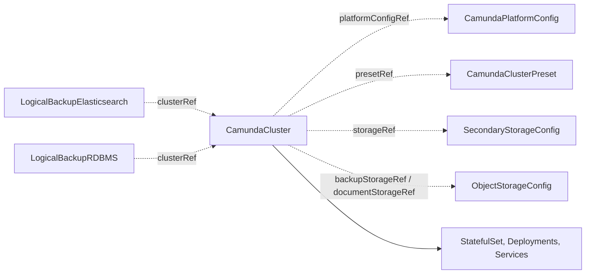

# CamundaCluster

A `CamundaCluster` is one Camunda orchestration cluster: the Zeebe brokers, the gateway, the web applications Operate, Tasklist, and Admin, and optionally the connectors runtime. The operator turns it into StatefulSets, Deployments, and Services for Camunda 8.9 or later, and keeps them healthy.

The cluster owns only its workloads. Secondary storage comes from a [SecondaryStorageConfig](secondarystorageconfig.md), bucket storage from an [ObjectStorageConfig](objectstorageconfig.md), shared settings from a [CamundaPlatformConfig](camundaplatformconfig.md), and sizing defaults from a [CamundaClusterPreset](camundaclusterpreset.md). Backups attach from the outside through [LogicalBackupElasticsearch](logicalbackupelasticsearch.md) and [LogicalBackupRDBMS](logicalbackuprdbms.md).

The smallest cluster names a platform configuration, a version, and a storage contract:

```yaml
apiVersion: core.camunda.io/v1
kind: CamundaCluster
metadata:
  name: my-cluster
  namespace: my-cluster-ns
spec:
  platformConfigRef: "my-platform-config"
  version: "8.9.0"
  storageRef: "my-storage-config"
```



## Topology

Camunda 8.9 ships the orchestration cluster as one binary. Zeebe, the gateway, and the web applications are one image, and configuration selects which parts run in a process. The topology is a choice on this resource:

- `zeebe` is always a StatefulSet of brokers with persistent volumes.
- `gateway` runs `Standalone` (its own Deployment) or `Embedded` (inside the brokers). The default is `Standalone`.
- `operate`, `tasklist`, and `admin` each run `Standalone` (their own Deployment) or `Embedded`. The default is `Embedded`. An embedded web application runs inside the gateway when the gateway is standalone, otherwise inside the brokers.
- `connectors` is a separate runtime. When enabled, it is always its own Deployment.

## Endpoints

Each enabled process gets a workload and a Service named `<name>-<component>`. The gateway Service (`<name>-zeebe` when the gateway is `Embedded`) serves gRPC on port `26500` and HTTP on port `8080`. HTTP serves the REST API under `/v2/` and the embedded web applications under `/operate/`, `/tasklist/`, and `/admin/`. A standalone web application serves on its own Service on port `8080`. A Service name stops at 63 characters, which is the tightest bound of the derived names. A cluster name that is too long to carry the suffix is cut, and a hash of the full name is added. Two such clusters stay apart. The operator applies the same bound to the Secrets that it derives from the cluster name, and to the value of the `camunda.io/cluster` label.

Read the names back with `kubectl get deploy,sts,svc -l camunda.io/cluster=<name>`. The selector matches while the cluster name is 63 characters or less. For a longer name the label carries the cut form. `kubectl get deploy --show-labels` shows the value to select on.

Every resource carries the labels `camunda.io/cluster` and `camunda.io/component`. The cluster label carries the cluster name under the same bound. The component is one of `zeebe`, `gateway`, `operate`, `tasklist`, `admin`, and `connectors`.

The operator creates no Ingress. You route traffic to the cluster, and `spec.externalUrl` tells the cluster its public base URL for OIDC redirects and links.

## Authentication

Under basic authentication the operator creates the admin user `admin` and stores the password in the Secret `<name>-camunda-admin` (keys `username` and `password`). Under OIDC the identity provider authenticates every caller, and `spec.auth.admin` names the identities that get the `admin` role. An OIDC cluster without `spec.auth.admin` has no administrator. A cluster whose only administrator is a client still shows the setup page in the browser, so list a user too. The [authentication guide](../guides/authentication.md) explains both methods.

The operator generates the admin password once and keeps it stable. To rotate it, set `spec.auth.basic.passwordRotation` to a new value. The operator generates a new password, sets it on the `admin` user through the user API of the running cluster, publishes it in the Secret, and restarts the connectors Deployment. `status.adminPassword.rotation` records the applied value. The [authentication guide](../guides/authentication.md#rotate-the-password) has the details and the failure modes.

## Storage

The brokers keep their data on one PersistentVolumeClaim per pod. `spec.zeebe.storageClassName` is fixed at creation. When `spec.zeebe.storageSize` grows, the operator expands every bound broker volume in place, without a restart. The storage class must allow volume expansion. The operator never shrinks a volume: a smaller size from a preset is ignored with the Warning event `StorageShrinkIgnored`.

`spec.zeebe.persistentVolumeClaimRetentionPolicy.whenDeleted` decides what happens to the volumes when you delete the cluster: `Delete` (the default) removes them, `Retain` keeps them for a later cluster with the same name. A scale-down and a suspension always keep them.

## Secondary storage

`spec.storageRef` names the `SecondaryStorageConfig` in the namespace of the cluster. The contract tells the cluster where its secondary storage is.

One `CamundaCluster` uses one contract. Camunda fixes the index names and the tables. Two clusters on one backend write each other's data, and a restore of one deletes the data of the other. The first cluster to use a contract claims it: the operator writes `camunda.io/claim-holder` and `camunda.io/claim-holder-uid` on the contract. The API server accepts a second cluster that names a held contract. That cluster is suspended: every workload at zero and the volumes kept. Its `Ready` is `False` with reason `StorageAlreadyAttached`, and the message names the holder and the contract.

The suspended cluster looks again every 30 seconds. When the holder is deleted or names another contract, the suspended cluster takes the claim and resumes on its own. To release a claim by hand, delete the two annotations from the contract.

A recreated contract is a new claim. If the producer deletes the contract and creates it again, the holder and a suspended cluster race for the new claim. The holder can lose that race. Do not recreate a contract while two clusters name it.

```yaml
status:
  conditions:
    - type: Ready
      status: "False"
      reason: StorageAlreadyAttached
      message: >-
        CamundaCluster "my-other-ns/my-other-cluster" already holds
        SecondaryStorageConfig "my-cluster-ns/my-storage-config". One
        CamundaCluster uses one secondary storage contract, so this cluster
        stays suspended until that one releases it
```

The operator compares contracts, not endpoints. Give one contract to one backend. Two hand-written contracts that name one Elasticsearch are not caught.

## Secondary storage over TLS

When the [SecondaryStorageConfig](secondarystorageconfig.md) names a certificate authority under `elasticsearch.caSecretRef`, the brokers, the gateway, and the web applications trust that authority. A cluster on an [ElasticsearchCluster](elasticsearchcluster.md) gets this without a step from you, because that kind fills `caSecretRef` itself. For an Elasticsearch of your own behind a private authority, set `caSecretRef` on the contract.

The Zeebe Elasticsearch exporter needs this trust. It has no TLS setting of its own ([camunda/camunda#9839](https://github.com/camunda/camunda/issues/9839)), so without `caSecretRef` it writes no records and [CamundaOptimize](camundaoptimize.md) stays empty. Every TLS client in those processes then trusts the authority, not only the exporter.

The trust arrives through `JAVA_TOOL_OPTIONS`. If you set that variable yourself, read [Environment and JVM](#environment-and-jvm).

## Backups

Without `spec.backupStorageRef` the cluster takes no backups. With it, the brokers write primary-storage backups to the referenced bucket, under the prefix `<basePath>/<namespace>/<name>` on S3 and GCS, so two clusters never share a prefix. Azure Blob has no prefix: every cluster needs an `ObjectStorageConfig` with its own container, and a second cluster on the same Azure contract reports `InvalidReference`.

On the Elasticsearch path the storage contract must carry `elasticsearch.snapshotRepository`, or the cluster reports `InvalidReference`. On the RDBMS path `spec.backup.primaryStorage` configures the backup scheduler of Zeebe with the defaults `schedule: PT1H`, `checkpointInterval: PT15M`, `retention.window: P7D`, and `retention.cleanupSchedule: PT1H`. `continuous` defaults to true unless the schedule is `none`. The [backup guide](../guides/backup.md) covers the backup kinds.

## Workload identity

The pods run under the ServiceAccount `<name>-camunda`, or `spec.serviceAccount.name`. When a referenced bucket carries a workload identity, the operator puts the matching annotation on that ServiceAccount ([ObjectStorageConfig](objectstorageconfig.md#authentication) lists them). An annotation in `spec.serviceAccount.annotations` wins over the derived one. A bucket without an identity block adds no annotation, and the cloud side binds the principal `system:serviceaccount:<namespace>:<name>-camunda` itself. Two buckets that name different identities of one cloud report `InvalidReference`. With `serviceAccount.create: false` the operator does not create the ServiceAccount and reports `InvalidReference` while it is absent.

## Environment and JVM

The operator renders its own configuration first, then the user entries in this order: the top-level `extraEnv`, the `extraEnv` of the embedded gateway (on the brokers), the `extraEnv` of every embedded web application that the process hosts, and the `extraEnv` of the process itself. A later entry with the same name wins, and an entry replaces an operator entry with the same name. `extraEnvFrom` sources are concatenated in the same order. Connectors get the top-level entries and their own block only.

The per-process `extraEnv` blocks and the top-level `spec.extraEnv` merge by name under server-side apply. A field manager owns only the entries that it applies. An extension controller can therefore add an entry next to yours, and neither side removes the other. One applied manifest cannot hold two entries with the same name, and the API server rejects one that does. `spec.backup.dump.extraEnv` stays an atomic list, because the backup kinds share that block. Every `extraEnvFrom` stays atomic too, because a source carries no name to merge on.

Two field managers that apply the same name do not collide. The merge is per field inside the entry, so one manager can own `value` while the other owns `valueFrom`. The result would be one entry that carries both, which a container rejects. The API server refuses to store that combination, so the second apply fails with a clear message instead of stalling a rollout. Give your entry a name that no operator writes, or let the operator own the name.

Every unified process gets `JAVA_TOOL_OPTIONS=-XX:+ExitOnOutOfMemoryError`, so the kubelet restarts a pod after an OutOfMemoryError. Heap size comes from the container-aware defaults of the JVM. To change the JVM options, set `JAVA_TOOL_OPTIONS` in `extraEnv` of the process. When the storage contract names a certificate authority, the trust store options go on the same variable after your value. Heap tuning and the trust store work together.

To use a trust store of your own, name it with `-Djavax.net.ssl.trustStore` in your value. The JVM then reads your store and no other. That store must hold the certificate authority of the Elasticsearch endpoint, or the exporter fails and Optimize reads no records. This is also the way to trust a second private authority, for example an OIDC provider or a backup store. Put every authority in one store and name it. The spec has no volume field, so the store must already be in the process image. Build the Camunda image with the file in it and set `imageRegistry` on the [CamundaPlatformConfig](camundaplatformconfig.md).

A `JAVA_TOOL_OPTIONS` entry that reads its value from a Secret or a ConfigMap cannot take the trust store options. The cluster records the Warning event `TrustStoreOptionsNotApplied` and names the processes. The store still exists at `/etc/camunda/es-truststore/cacerts` with the password `changeit`. Name it in the referenced value, or name a store of your own that holds the authority.

## Monitoring

When `spec.monitoring.serviceMonitor.enabled` is true, the operator creates one ServiceMonitor per process. On a Kubernetes cluster without the `ServiceMonitor` kind it creates none and reports no error.

## Changes and referenced Secrets

A change to the cluster, to a referenced resource, or to a referenced Secret rolls out to the pods on its own. A referenced Secret in another namespace is copied into the namespace of the cluster, and the copy follows the source.

The operator checks every reference at reconcile time, not at admission, so you can create the resources in any order. A missing `CamundaPlatformConfig`, `CamundaClusterPreset`, `SecondaryStorageConfig`, `DatabaseConfig`, `DatabaseServerConfig`, or `ObjectStorageConfig` sets `Ready` to `False` with reason `InvalidReference`. A missing Secret or key sets reason `MissingSecret`.

## Suspend and pause

`spec.suspend: true` scales every workload to zero and keeps the broker volumes. `Ready` is `True` with reason `Suspended`, and `status.management` is empty. When you set `suspend` back to false, `Ready` reads `Updating` until the workloads are healthy again. A backup of a suspended cluster waits with reason `ClusterSuspended`.

The operator also suspends a cluster whose storage contract another cluster holds, see [Secondary storage](#secondary-storage). `spec.suspend` stays yours. That suspension shows in the `Ready` reason `StorageAlreadyAttached` and ends when the holder releases the contract.

`suspend` reaches the extensions attached to this cluster, not only its own workloads. A [CamundaOptimize](camundaoptimize.md) whose `clusterRef` names this cluster scales its webapp and its importer to zero with it, and starts them again when you clear the field. The Optimize importer reads Elasticsearch directly, so without this it would keep importing while the cluster is down.

`spec.pause: true` stops all reconciliation of this resource. The operator records one `Paused` event and writes nothing, not even status, until `pause` is false again.

## Deletion

Deleting the cluster removes every resource that the operator created for it. The broker volumes follow `spec.zeebe.persistentVolumeClaimRetentionPolicy.whenDeleted` (see [Storage](#storage)). The `ElasticsearchCluster`, the `Database`, and the contracts are separate resources and stay.

## Status

`Ready` is `True` only when every component that the cluster needs is `True`. Its reason and message come from the component that governs: the first component that is not `True`, or the healthiest one when all are. A component that the cluster does not need (an embedded gateway or web application, disabled connectors) reads `True` with reason `Disabled` and stays out of `Ready`.

| Type | Reason | Meaning | What to do |
| --- | --- | --- | --- |
| `ZeebeReady` | `Healthy` | Every broker replica is ready. | Nothing. |
| `GatewayReady` | `Healthy` / `Disabled` | Every gateway replica is ready, or the gateway is embedded. | Nothing. |
| `OperateReady` / `TasklistReady` / `AdminReady` | `Healthy` / `Disabled` | The standalone web application is ready, or it is embedded. | Nothing. |
| `ConnectorsReady` | `Healthy` / `Disabled` | Every connectors replica is ready, or connectors are not enabled. | Nothing. |
| `AdminSecretReady` | `Healthy` / `Disabled` | The Secret `<name>-camunda-admin` is applied, or the cluster uses OIDC. | Nothing. |
| `AdminSecretReady` | `ConnectionFailed` | An update of the `admin` user, of its password or of its email, is not applied yet: the cluster did not answer. The Secret keeps the active password, and `email-applied` the address the cluster holds; `email` already shows the address you asked for. | The operator retries. It clears when the user API of the gateway answers again. |
| `AdminSecretReady` | `InvalidCredentials` | An update of the `admin` user is not applied yet: the cluster refused the password that the Secret publishes. The Secret keeps the active password, and `email-applied` the address the cluster holds. | The operator retries. Set the password from the Secret on the `admin` user in the Admin web application. |
| `AdminSecretReady` | `Rejected` | An update of the `admin` user is not applied yet: the cluster accepted the password and refused the call itself. The Secret keeps the active password, and `email-applied` the address the cluster holds. | The operator retries. Read the condition message, which names the reason. |
| `MirroredSecretsReady` | `Healthy` / `Disabled` | Every copy of a referenced Secret from another namespace is applied, or no such Secret exists. | Nothing. |
| `Ready` | `Healthy` | Every component that the cluster needs is healthy. | Nothing. |
| `Ready` | `Creating` / `Updating` / `Scaling` | A component rolls out or scales. | Wait. The message names the component. |
| `Ready` | `Failing` | A component has replicas that do not become ready. | Read the pods of the named component. |
| `Ready` | `Degraded` / `Down` | Some or no replicas of a component are ready after the grace period. | Read the pods and events of the named component. |
| `Ready` | `Suspended` | `spec.suspend` is true and every workload is at zero. `Ready` is `True`. | Nothing. Set `suspend: false` to resume. |
| `Ready` | `StorageAlreadyAttached` | Another `CamundaCluster` holds the `SecondaryStorageConfig` that `storageRef` names. This cluster is suspended. | Give this cluster a contract of its own, or delete the holder. The message names both. |
| `Ready` | `InvalidReference` | A referenced resource does not exist, a ServiceAccount with `create: false` is absent, two buckets conflict, an Azure container is shared, a snapshot repository is missing, or the merged spec is invalid. | Read the message. Create the missing resource or correct the field it names. |
| `Ready` | `MissingSecret` | A referenced Secret or one of its keys is missing. | Create the Secret with the named key. |

`status.management` publishes the address of the management API, so a backup kind calls it without knowing which process hosts it. It is empty while the cluster is suspended.

```yaml
status:
  management:
    # The Service of the process that serves the management API, on port 9600.
    endpoint: http://my-cluster-zeebe.my-cluster-ns.svc:9600
    auth:
      # none | basic. Camunda 8.9 serves the management port without authentication, so the operator reports none.
      method: none
    version: 8.9.9
    partitions: 3
    # Elasticsearch path with a backupStorageRef only: the snapshot repository of the storage contract.
    backupRepository: my-cluster
```

`status.adminPassword.rotation` is the last admin password rotation that the operator applied: the effective `spec.auth.basic.passwordRotation` value, after the preset merge, that produced the password in the admin Secret. It follows the Secret: the operator publishes the applied value there together with the password it answers, and the status projects it. A rotation is in progress while the effective value is not empty and differs from it. Clearing the field does not stop a rotation that the operator already staged. That rotation completes, and the status then records the value that staged it. A cluster that inherits the value from its preset carries none of its own in the spec, so compare the preset value with the status of each cluster.

`status.serviceAccountName` is the ServiceAccount that the pods run under. It is empty when they run under the default account of the namespace. A backup Job runs under the same account.

`status.volumes` lists every bound broker volume, sorted by name, with its `name` and the `capacity` that it reports. `status.observedGeneration` is the last generation the operator reconciled.

## Spec reference

Every field, with its type, whether it is required, and its default:

```yaml
apiVersion: core.camunda.io/v1
kind: CamundaCluster
metadata:
  name: my-cluster
  namespace: my-cluster-ns
spec:
  # string. Required. Name of the cluster-scoped CamundaPlatformConfig that provides auth, license, and image registry.
  platformConfigRef: "my-platform-config"
  # string. Optional. Name of a cluster-scoped CamundaClusterPreset that provides the baseline.
  presetRef: "medium"
  # string. Required unless the preset provides it. Camunda version as x.y.z, 8.9.0 or later.
  version: "8.9.0"
  # string. Optional. External base URL of the cluster, used for OIDC redirect URLs and web application links. The operator creates no Ingress.
  externalUrl: "https://my-cluster.camunda.example.com"
  # object. Optional. ServiceAccount of every workload pod.
  serviceAccount:
    # string. Optional, default: <name>-camunda. Name of the ServiceAccount.
    name: "camunda-prod"
    # boolean. Optional, default: true. When false, the ServiceAccount must already exist. The operator does not create, annotate, or own it.
    create: true
    # map[string]string. Optional. Annotations on the ServiceAccount, for example workload identity. A value here wins over a derived one. Ignored when create is false.
    annotations:
      eks.amazonaws.com/role-arn: "arn:aws:iam::123456789012:role/my-cluster-role"
  # object. Optional. OIDC client credentials of this cluster and the identities that get its admin role. The credentials override the platform config and the preset.
  auth:
    # string. Optional. OIDC client ID of this cluster.
    clientId: "my-cluster-client"
    # string. Optional, default: the clientId. Audience that access tokens must carry.
    audience: "my-cluster-client"
    # object. Optional. Secret key that holds the OIDC client secret of this cluster.
    clientSecretRef:
      # string. Required. Name of the Secret.
      name: "my-cluster-oidc-secret"
      # string. Required. Namespace of the Secret. It never defaults.
      namespace: "my-cluster-ns"
      # string. Required. Key in the Secret.
      key: "client-secret"
    # object. Optional. Identities that get the admin role. Applies under OIDC only. Basic authentication ignores it.
    admin:
      # []string. Optional. Values of the username claim of the platform config that get the admin role.
      users:
        - "ada@example.com"
      # []string. Optional. Values of the client id claim that get the admin role. Matches only when the platform config sets clientIdClaim.
      clients:
        - "my-cluster-client"
      # []object. Optional. Rules that give the admin role to every token whose claim holds a value. All three fields are required.
      mappingRules:
        # string. Name of the rule, as the Admin web application lists it. 1 to 256 characters.
        - id: "platform-admins"
          # string. Name of a claim, or a JSONPath expression that points at one.
          claimName: "groups"
          # string. Value that the claim must hold.
          claimValue: "camunda-admins"
    # object. Optional. The admin credential that the operator owns. Applies under basic authentication only. OIDC ignores it.
    basic:
      # string. Optional, max 253 characters. The email address of the admin user. Defaults to admin@example.com. A changed value is applied to the running cluster.
      adminEmail: "platform-team@example.com"
      # string. Optional, max 253 characters. A changed value requests one rotation of the admin password. status.adminPassword.rotation records the applied value.
      passwordRotation: "2026-08"
  # object. Optional. The brokers. Always a StatefulSet.
  zeebe:
    # integer. Optional, default: 1. Number of brokers.
    replicas: 3
    # integer. Optional, default: 1. Number of partitions. Cannot be decreased or removed once set.
    partitions: 3
    # integer. Optional, default: 1. Number of brokers that hold a copy of each partition. Must not exceed replicas.
    replicationFactor: 3
    # object. Optional. CPU and memory of the broker container.
    resources:
      requests: { cpu: "1", memory: "2Gi" }
    # string. Optional, default: the default StorageClass. StorageClass of the broker volumes. Immutable.
    storageClassName: "ssd"
    # quantity. Optional, default: 10Gi. Size of the data volume of each broker. Can only grow.
    storageSize: "32Gi"
    # object. Optional. What happens to the broker volumes when the cluster is deleted. A scale-down and a suspension always keep them.
    persistentVolumeClaimRetentionPolicy:
      # string (Retain | Delete). Optional, default: Delete. Retain keeps the volumes, and a later cluster with the same name reattaches them.
      whenDeleted: Delete
    # []EnvVar. Optional. Extra environment variables of the broker container. An entry replaces an operator entry with the same name.
    extraEnv:
      - name: JAVA_TOOL_OPTIONS
        value: "-XX:+ExitOnOutOfMemoryError -Xmx4g"
    # []EnvFromSource. Optional. Extra environment sources (ConfigMaps, Secrets) of the broker container.
    extraEnvFrom:
      - configMapRef:
          name: "zeebe-overrides"
    # map[string]string. Optional. Extra labels of the broker pods.
    podLabels: {}
    # map[string]string. Optional. Extra annotations of the broker pods.
    podAnnotations: {}
    # object. Optional. Scheduling constraints of the broker pods. Replaces the top-level block and the preset block entirely.
    scheduling:
      # object. Optional. Standard Kubernetes node affinity.
      nodeAffinity: {}
      # object. Optional. Standard Kubernetes pod affinity.
      podAffinity: {}
      # []Toleration. Optional. Standard Kubernetes tolerations.
      tolerations: []
  # object. Optional. The gateway.
  gateway:
    # string (Standalone | Embedded). Optional, default: Standalone. Standalone is its own Deployment. Embedded runs inside the brokers.
    mode: Standalone
    # integer. Optional, default: 1. Replicas. Standalone only.
    replicas: 2
    # object. Optional. CPU and memory. Standalone only.
    resources: {}
    # []EnvVar. Optional. Extra environment variables. Applied to the brokers when Embedded.
    extraEnv: []
    # []EnvFromSource. Optional. Extra environment sources. Applied to the brokers when Embedded.
    extraEnvFrom: []
    # map[string]string. Optional. Extra pod labels. Standalone only.
    podLabels: {}
    # map[string]string. Optional. Extra pod annotations. Standalone only.
    podAnnotations: {}
    # object. Optional. Scheduling constraints, same shape as zeebe.scheduling. Standalone only.
    scheduling: {}
  # object. Optional. The Operate web application.
  operate:
    # string (Standalone | Embedded). Optional, default: Embedded. Embedded runs inside the gateway, or inside the brokers when the gateway is Embedded.
    mode: Embedded
    # integer. Optional, default: 1. Replicas. Standalone only.
    replicas: 1
    # object. Optional. CPU and memory. Standalone only.
    resources: {}
    # []EnvVar. Optional. Extra environment variables. Applied to the host process when Embedded.
    extraEnv: []
    # []EnvFromSource. Optional. Extra environment sources. Applied to the host process when Embedded.
    extraEnvFrom: []
    # map[string]string. Optional. Extra pod labels. Standalone only.
    podLabels: {}
    # map[string]string. Optional. Extra pod annotations. Standalone only.
    podAnnotations: {}
    # object. Optional. Scheduling constraints. Standalone only.
    scheduling: {}
  # object. Optional. The Tasklist web application. Same fields as operate.
  tasklist:
    # string (Standalone | Embedded). Optional, default: Embedded.
    mode: Embedded
  # object. Optional. The Admin web application (Identity before Camunda 8.9). Same fields as operate.
  admin:
    # string (Standalone | Embedded). Optional, default: Embedded.
    mode: Embedded
  # object. Optional. The connectors runtime. Always its own Deployment.
  connectors:
    # boolean. Optional, default: false. Runs the connectors runtime when true.
    enabled: true
    # string. Required when enabled, unless the preset provides it. Version of the connectors bundle image as x.y.z. It does not follow spec.version.
    version: "8.9.7"
    # integer. Optional, default: 1. Replicas.
    replicas: 2
    # object. Optional. CPU and memory.
    resources: {}
    # []EnvVar. Optional. Extra environment variables.
    extraEnv: []
    # []EnvFromSource. Optional. Extra environment sources.
    extraEnvFrom: []
    # map[string]string. Optional. Extra pod labels.
    podLabels: {}
    # map[string]string. Optional. Extra pod annotations.
    podAnnotations: {}
    # object. Optional. Scheduling constraints.
    scheduling: {}
  # []EnvVar. Optional. Extra environment variables of every workload. A per-component entry with the same name wins.
  extraEnv: []
  # []EnvFromSource. Optional. Extra environment sources of every workload.
  extraEnvFrom: []
  # map[string]string. Optional. Extra labels of every workload pod.
  podLabels: {}
  # map[string]string. Optional. Extra annotations of every workload pod.
  podAnnotations: {}
  # object. Optional. Scheduling constraints of every workload, unless a component sets its own. Replaces the preset block entirely.
  scheduling: {}
  # string. Required. Name of the SecondaryStorageConfig in the namespace of this cluster.
  storageRef: "my-storage-config"
  # string. Optional. Name of a cluster-scoped ObjectStorageConfig for backups.
  backupStorageRef: "my-backup-bucket"
  # string. Optional. Name of a cluster-scoped ObjectStorageConfig for document storage. Only its workload identity is wired.
  documentStorageRef: "my-document-bucket"
  # object. Optional. How backups of this cluster behave. Allowed in a preset. Applies to an RDBMS cluster with a backupStorageRef.
  backup:
    # object. Optional. The backups that Zeebe takes of its own primary storage.
    primaryStorage:
      # boolean. Optional, default: true unless schedule is "none". Keeps every log segment until it is backed up. Must not be true with a schedule of "none".
      continuous: true
      # string. Optional, default: PT1H. How often Zeebe takes a backup: an ISO 8601 duration, a CRON expression, or "none".
      schedule: "PT1H"
      # string. Optional, default: PT15M. How often Zeebe writes a checkpoint, as an ISO 8601 duration of days and time. It is the granularity of a point-in-time restore.
      checkpointInterval: "PT15M"
      # object. Optional. How long Zeebe keeps its primary-storage backups.
      retention:
        # string. Optional, default: P7D. The restore window, as an ISO 8601 duration of days and time.
        window: "P7D"
        # string. Optional, default: PT1H. How often Zeebe removes backups outside the window: a duration, a CRON expression, or "none".
        cleanupSchedule: "PT1H"
    # object. Optional. The Job that dumps the database. A LogicalBackupRDBMS can replace the pod settings as a whole, but never the image.
    dump:
      # object. Optional. CPU and memory of the dump pod.
      resources: {}
      # integer. Optional, default: 86400 when unset in the cluster and the preset. Seconds the dump Job can run before it fails.
      activeDeadlineSeconds: 7200
      # string. Optional, default: postgres:<major version of the database server>. Image that runs pg_dump. Set it for a mirror or an exact tag.
      postgresImage: ""
      # []EnvVar. Optional. Extra environment variables of every container of the dump pod.
      extraEnv: []
      # []EnvFromSource. Optional. Extra environment sources of every container of the dump pod. At most 8.
      extraEnvFrom: []
      # map[string]string. Optional. Extra labels of the dump pod.
      podLabels: {}
      # map[string]string. Optional. Extra annotations of the dump pod. Turn a service-mesh sidecar off here, or the Job never completes.
      podAnnotations:
        sidecar.istio.io/inject: "false"
      # object. Optional. Scheduling constraints of the dump pod. Replaces the preset block entirely.
      scheduling: {}
      # object. Optional. Where the dump is written before the upload. Replaces the preset block entirely. Unset means an emptyDir bounded by the node.
      scratchVolume:
        # quantity. Optional. Size of the scratch volume.
        sizeLimit: 50Gi
        # string. Optional. When set, the scratch volume is a PersistentVolumeClaim of this class. Requires sizeLimit.
        storageClassName: "fast"
  # object. Optional. Monitoring integrations.
  monitoring:
    # object. Optional. Prometheus ServiceMonitors.
    serviceMonitor:
      # boolean. Optional, default: false. Creates one ServiceMonitor per process when true.
      enabled: true
      # map[string]string. Optional. Extra labels of every ServiceMonitor.
      labels: {}
      # map[string]string. Optional. Extra annotations of every ServiceMonitor.
      annotations: {}
  # boolean. Optional, default: false. Scales every workload to zero and keeps the data.
  suspend: false
  # boolean. Optional, default: false. Stops all reconciliation of this resource.
  pause: false
```

### Validation rules

The API server enforces these rules at admission:

- `spec.storageRef` and `spec.platformConfigRef` are required.
- `spec.version` and `spec.connectors.version` must be of the form `x.y.z`.
- `spec.zeebe.partitions` cannot be decreased, and once set it cannot be removed.
- `spec.zeebe.storageClassName` is immutable.
- `spec.zeebe.storageSize` cannot be decreased.
- `spec.zeebe.replicationFactor` must not exceed `spec.zeebe.replicas`.
- `spec.zeebe.persistentVolumeClaimRetentionPolicy.whenDeleted` is `Delete` or `Retain`.
- `spec.backup.dump.extraEnvFrom` holds at most 8 sources. `spec.backup.dump.scratchVolume.storageClassName` requires `sizeLimit`.
- `spec.backup.primaryStorage.checkpointInterval` and `retention.window` are ISO 8601 durations of days and time. Weeks, months, and years are rejected.

The operator checks these rules on the merged spec after the preset is applied, and reports `Ready: InvalidReference` when one fails:

- The effective version is present and 8.9.0 or later.
- The effective `replicationFactor` does not exceed the effective `replicas`, and the effective `partitions` is at least 1.
- `connectors.version` is present when connectors are enabled.
- `backup.primaryStorage.continuous` is not true with a `schedule` of `none`.

### A production-shaped example

```yaml
apiVersion: core.camunda.io/v1
kind: CamundaCluster
metadata:
  name: my-cluster
  namespace: my-cluster-ns
spec:
  platformConfigRef: "my-platform-config"
  presetRef: "medium"
  version: "8.9.1"
  externalUrl: "https://my-cluster.camunda.example.com"
  serviceAccount:
    annotations:
      eks.amazonaws.com/role-arn: "arn:aws:iam::123456789012:role/my-cluster-role"
  zeebe:
    replicas: 5
    resources:
      requests:
        memory: "8Gi"
    extraEnv:
      - name: JAVA_TOOL_OPTIONS
        value: "-XX:+ExitOnOutOfMemoryError -Xmx6g"
  storageRef: "my-storage-config"
  backupStorageRef: "my-backup-bucket"
  monitoring:
    serviceMonitor:
      enabled: true
      labels:
        prometheus: "platform"
```

## Related

- [CamundaPlatformConfig](camundaplatformconfig.md): `platformConfigRef` provides authentication, the license, and the image registry.
- [CamundaClusterPreset](camundaclusterpreset.md): `presetRef` provides the baseline that this spec merges over.
- [SecondaryStorageConfig](secondarystorageconfig.md): `storageRef` names the secondary storage, Elasticsearch or RDBMS, in the namespace of the cluster.
- [ObjectStorageConfig](objectstorageconfig.md): `backupStorageRef` and `documentStorageRef` name the buckets.
- [LogicalBackupElasticsearch](logicalbackupelasticsearch.md) and [LogicalBackupRDBMS](logicalbackuprdbms.md): they reference this cluster through `clusterRef` and back it up.
- [Getting started](../getting-started.md): the order in which you create the resources.
- [Secondary storage guide](../guides/secondary-storage.md): how to set up Elasticsearch or a database.
- [Authentication guide](../guides/authentication.md): basic and OIDC authentication, and the admin role.
- [Backup guide](../guides/backup.md): backups of a cluster.
- [Operations guide](../guides/operations.md): status, suspend, resize, and rotate passwords.
