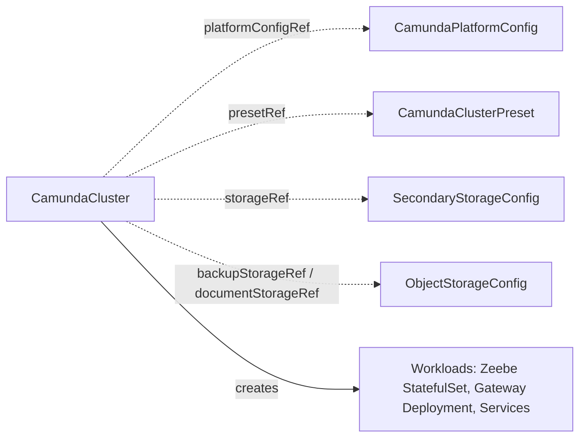

# CamundaCluster

The core CR: a self-contained description of one Camunda orchestration cluster, from which the operator creates and manages all workloads.

## Purpose

`CamundaCluster` describes a complete orchestration cluster — Zeebe brokers, gateway, web applications, and optionally connectors — for Camunda 8.9 or later.
You create it directly, or a composition layer above creates it on your behalf; either way the operator turns it into StatefulSets, Deployments, and Services and keeps them converged.
It deliberately owns only the workloads: secondary storage arrives through a required `storageRef` contract CRD, bucket storage through optional `ObjectStorageConfig` references, shared settings through [CamundaPlatformConfig](camundaplatformconfig.md), and standardized sizing through [CamundaClusterPreset](camundaclusterpreset.md).
Features such as backups, Optimize, and PVC auto-resizing attach to the cluster from the outside via `clusterRef` and labels; the cluster never knows about them.

## How it works

### Component topology

Camunda 8.9 ships the orchestration cluster as a single unified binary: Zeebe, the gateway, and the Operate, Tasklist, and Identity web applications are one Spring Boot artifact, and which parts run in a given process is activated by configuration, not by different images.
The topology is therefore a configuration choice on this CR:

- `zeebe` is always required and always standalone: a StatefulSet of brokers with `replicas`, `partitions`, `replicationFactor`, and persistent volumes.
- `gateway` runs `Standalone` (its own Deployment of the unified binary) or `Embedded` (the brokers enable their embedded gateway).
- `operate`, `tasklist`, and `identity` each run `Standalone` or `Embedded`. Embedded applications run inside the nearest standalone application up the chain: inside the gateway if it is standalone, otherwise inside zeebe.
- `connectors` is a separate runtime application, never part of the unified binary; when enabled it is always its own standalone Deployment that connects to the cluster's REST and gRPC APIs.

!!! note "Profiles select the role of a process"
    The operator selects the role of each process with Spring profiles (`SPRING_PROFILES_ACTIVE`) and the embedded gateway with `ZEEBE_BROKER_GATEWAY_ENABLE`, never with `camunda.mode`.
    In Camunda 8.9, `camunda.mode=gateway` adds the `consolidated-auth` profile only when `camunda.security.authentication.method` is unset. The operator always sets that property, so a gateway under `camunda.mode` starts without a security filter chain.
    Every unified process therefore carries `consolidated-auth` next to its role profiles. The role profiles are `broker` for the brokers, `gateway` for the gateway, and `operate`, `tasklist`, and `admin` for the web applications that the process serves (`identity` is the legacy name of `admin`).
    The host process serves an `Embedded` web application. A `Standalone` web application gets its own Deployment of the unified binary with the `gateway` profile and only that application's profile. The binary supports this shape, but Camunda's own charts do not use it.

This supports every deployment model from all-in-one (everything embedded in zeebe, simplest for development) through the 8.9 default (standalone gateway hosting the embedded web applications) to fully separated Deployments per application.

### Reconciliation

1. The operator resolves `presetRef` (if set) and computes the effective spec under the merge rules documented in [CamundaClusterPreset](camundaclusterpreset.md).
2. The operator resolves `platformConfigRef`, the required `storageRef`, and the optional `backupStorageRef` / `documentStorageRef`; a missing target sets `Ready` to `False` with reason `InvalidReference`.
3. The operator renders the workloads for the effective topology: the zeebe StatefulSet, a Deployment per standalone component, Services, and the configuration wiring — all expressed as unified-configuration environment variables on the single Camunda image (Spring Boot relaxed binding, for example `SPRING_PROFILES_ACTIVE`, `ZEEBE_BROKER_GATEWAY_ENABLE`, `CAMUNDA_SECURITY_AUTHENTICATION_METHOD`, `CAMUNDA_DATA_SECONDARYSTORAGE_*`) — with auth from the platform config, secondary storage from the resolved `SecondaryStorageConfig`, and `externalUrl` as the base URL for OIDC redirects and web application links. The operator creates no Ingress resources; you (or a composition layer above) route traffic to `externalUrl`.
4. Every workload carries the labels `camunda.io/cluster: <name>` and `camunda.io/component: <component>`, which is how extension controllers discover the cluster's resources. The operator uses the component values `zeebe`, `gateway`, `operate`, `tasklist`, `identity`, and `connectors`.
5. The operator applies all rendered objects with Server-Side Apply (SSA) under the field manager `camunda-operator/camundacluster`, leaving fields patched by other field managers (for example the `CamundaOptimize` controller's env injection under `camunda-operator/camundaoptimize`) untouched.
6. The operator watches workload health into per-component conditions and the aggregate `Ready` condition.
7. The operator watches the referenced [CamundaPlatformConfig](camundaplatformconfig.md) and contract CRDs, so changes to them roll out to the cluster without touching this CR.
8. When `backupStorageRef` is set, the operator derives the cluster's backup wiring from the referenced `ObjectStorageConfig`: for Elasticsearch-backed clusters, the CamundaCluster controller itself registers the snapshot repository (derived from `backupStorageRef`) in the cluster's Elasticsearch via the Elasticsearch API and configures the same repository name on the Camunda components; in all cases it configures the Zeebe primary-storage backup store. The Elasticsearch nodes' access to the snapshot bucket comes from the [ElasticsearchCluster](elasticsearchcluster.md)'s own workload identity (`serviceAccount.annotations` on that CR), not from this cluster's. `Backup` CRs only trigger backup operations against this wiring; the cluster carries the configuration.
9. For RDBMS-backed clusters (`storageRef` resolves to `type: rdbms`), the operator additionally auto-enables continuous and scheduled backup of zeebe's primary storage (`camunda.data.primary-storage.backup`: continuous operation, schedule, and checkpoint interval), so database and primary storage stay restorable to matching positions — required both for `PointInTimeRestore` and for restoring RDBMS `Backup`s.
10. `suspend: true` scales all workloads to zero and sets the `Suspended` condition; `pause: true` halts reconciliation of this CR entirely, leaving workloads as they are.

!!! note "Deviation from the original proposal"
    The proposal enabled continuous primary-storage backup only when the storage chain had point-in-time recovery enabled (`pitr.enabled: true` on the `DatabaseServerConfig`).
    Verified against Camunda 8.9 (`camunda.data.primary-storage.backup` supports continuous and scheduled operation), the operator enables it for every RDBMS-backed cluster with a `backupStorageRef`, because restorable RDBMS backups need primary-storage checkpoints regardless of PITR.



### Basic authentication

Camunda 8.9 seeds no user on its own. When the platform config selects basic authentication, the operator creates the initial admin user of the cluster.
The credentials live in the Secret `<name>-camunda-admin` in the namespace of the CamundaCluster, under the keys `username` (`admin`) and `password`.
The operator generates the password once and keeps it stable across reconciles. The password reaches the containers as a `secretKeyRef`, and the user is a member of the `admin` role.
The connectors runtime authenticates against the cluster with the same user. The Secret reports the condition `AdminSecretReady`, and it takes part in `Ready`.

### JVM options

Every unified process gets `JAVA_TOOL_OPTIONS=-XX:+ExitOnOutOfMemoryError`, so the JVM exits on an OutOfMemoryError and the kubelet restarts the pod.
Heap sizing is left to the container-aware defaults of the JVM. To change the JVM options of a process, set `JAVA_TOOL_OPTIONS` in its `extraEnv`; the entry replaces the value of the operator.

## API reference

```yaml
apiVersion: core.camunda.io/v1
kind: CamundaCluster
metadata:
  name: my-cluster
  namespace: my-cluster-ns
spec:
  # string. Required. Name of the cluster-scoped CamundaPlatformConfig providing auth, license, and image registry.
  platformConfigRef: "my-platform-config"
  # string. Optional. Name of a cluster-scoped CamundaClusterPreset to inherit as a baseline.
  presetRef: "medium"
  # string. Required unless the resolved preset provides it. Camunda version, 8.9 or later (e.g. "8.9.0").
  version: "8.9.0"
  # string. Optional. Deterministic external base URL, set before creation; used for OIDC redirect URLs and web application links. The operator creates no Ingress.
  externalUrl: "https://my-cluster.camunda.example.com"
  # object. Optional. ServiceAccount settings for the cluster's workloads.
  serviceAccount:
    # map[string]string. Optional. Annotations for workload identity (IRSA, GCP Workload Identity, ...); bucket access for backupStorageRef/documentStorageRef flows from this identity.
    annotations:
      eks.amazonaws.com/role-arn: "arn:aws:iam::123456789012:role/my-cluster-role"
  # object. Optional. Per-cluster OIDC client credentials, overriding the platform config (and preset) defaults.
  auth:
    # string. Required. OIDC client ID for this cluster.
    clientId: "my-cluster-client"
    # string. Optional, default: the clientId. Audience validated in access tokens.
    audience: "my-cluster-client"
    # object. Required. Secret holding this cluster's OIDC client secret.
    clientSecretRef:
      # string. Required. Name of the Secret.
      name: "my-cluster-oidc-secret"
      # string. Required. Namespace of the Secret (always explicit; it never defaults to this CR's namespace).
      namespace: "my-cluster-ns"
      # string. Required. Key inside the Secret.
      key: "client-secret"
  # object. Optional. Zeebe brokers; always rendered as a standalone StatefulSet.
  zeebe:
    # integer. Optional, default: 1. Number of brokers.
    replicas: 3
    # integer. Optional, default: 1. Number of partitions; cannot be decreased, and once set it cannot be removed.
    partitions: 3
    # integer. Optional, default: 1. Replication factor; must not exceed replicas.
    replicationFactor: 3
    # object. Optional. Compute resources (requests/limits).
    resources:
      requests: { cpu: "1", memory: "2Gi" }
    # string. Optional, default: the cluster default StorageClass. StorageClass for broker volumes.
    storageClassName: "ssd"
    # quantity. Optional, default: 10Gi. Persistent volume size per broker; can only grow.
    storageSize: "32Gi"
    # object. Optional. What happens to the broker volumes when the CamundaCluster is deleted. A scale-down and a suspension always keep them.
    persistentVolumeClaimRetentionPolicy:
      # string (Retain | Delete). Optional, default: Delete. Delete removes the broker volumes with the cluster. Retain keeps them, and a later cluster with the same name reattaches them.
      whenDeleted: Delete
    # list. Optional. Individual env vars appended to the component's containers.
    extraEnv:
      - name: JAVA_OPTS
        value: "-Xmx4g"
    # list. Optional. Bulk env from ConfigMaps/Secrets.
    extraEnvFrom:
      - configMapRef:
          name: "zeebe-overrides"
    # map[string]string. Optional. Extra labels on this component's pods.
    podLabels: {}
    # map[string]string. Optional. Extra annotations on this component's pods.
    podAnnotations: {}
    # object. Optional. Scheduling constraints; replaces (never merges with) a preset's scheduling.
    scheduling:
      # object. Optional. Standard Kubernetes node affinity.
      nodeAffinity: {}
      # list. Optional. Standard Kubernetes tolerations.
      tolerations: []
      # object. Optional. Standard Kubernetes pod affinity.
      podAffinity: {}
  # object. Optional. Gateway; Deployment when Standalone, broker-embedded when Embedded.
  gateway:
    # string. Optional, default: Standalone. One of: Standalone | Embedded.
    mode: Standalone
    # integer. Optional, default: 1. Replicas; only meaningful when Standalone.
    replicas: 2
    # object. Optional. Compute resources.
    resources: {}
    # list. Optional. Individual env vars.
    extraEnv: []
    # list. Optional. Bulk env from ConfigMaps/Secrets.
    extraEnvFrom: []
    # map[string]string. Optional. Extra pod labels.
    podLabels: {}
    # map[string]string. Optional. Extra pod annotations.
    podAnnotations: {}
    # object. Optional. Scheduling constraints; same shape as zeebe.scheduling.
    scheduling: {}
  # object. Optional. Operate web application.
  operate:
    # string. Optional, default: Embedded. One of: Standalone | Embedded. Embedded runs in the nearest standalone host up the chain (gateway, else zeebe).
    mode: Embedded
    # integer. Optional, default: 1. Replicas; only meaningful when Standalone.
    replicas: 1
    # object. Optional. Compute resources; only meaningful when Standalone.
    resources: {}
    # list. Optional. Individual env vars; applied to the host process when Embedded.
    extraEnv: []
    # list. Optional. Bulk env from ConfigMaps/Secrets.
    extraEnvFrom: []
    # map[string]string. Optional. Extra pod labels; only meaningful when Standalone.
    podLabels: {}
    # map[string]string. Optional. Extra pod annotations; only meaningful when Standalone.
    podAnnotations: {}
    # object. Optional. Scheduling constraints; only meaningful when Standalone.
    scheduling: {}
  # object. Optional. Tasklist web application; same fields and semantics as operate.
  tasklist:
    # string. Optional, default: Embedded. One of: Standalone | Embedded.
    mode: Embedded
  # object. Optional. Identity (Orchestration Cluster Admin) web application; same fields and semantics as operate.
  identity:
    # string. Optional, default: Embedded. One of: Standalone | Embedded.
    mode: Embedded
  # object. Optional. Connectors runtime; a separate application, standalone-only.
  connectors:
    # boolean. Optional, default: false. Whether to run the connectors runtime.
    enabled: true
    # string. Required when enabled, unless the resolved preset provides it. Version of the connectors bundle image (e.g. "8.9.7"); the bundle has its own patch line and does not follow spec.version.
    version: "8.9.7"
    # integer. Optional, default: 1. Connectors replicas.
    replicas: 2
    # object. Optional. Compute resources.
    resources: {}
    # list. Optional. Individual env vars.
    extraEnv: []
    # list. Optional. Bulk env from ConfigMaps/Secrets.
    extraEnvFrom: []
    # map[string]string. Optional. Extra pod labels.
    podLabels: {}
    # map[string]string. Optional. Extra pod annotations.
    podAnnotations: {}
    # object. Optional. Scheduling constraints.
    scheduling: {}
  # list. Optional. Env vars applied to ALL workloads; per-component entries win on name conflicts.
  extraEnv: []
  # list. Optional. Bulk env from ConfigMaps/Secrets applied to ALL workloads.
  extraEnvFrom: []
  # map[string]string. Optional. Labels applied to all workload pods.
  podLabels: {}
  # map[string]string. Optional. Annotations applied to all workload pods.
  podAnnotations: {}
  # object. Optional. Scheduling constraints applied to all workloads unless a component sets its own.
  scheduling: {}
  # string. Required. Name of the SecondaryStorageConfig, in this cluster's own namespace, providing the secondary storage backend.
  storageRef: "my-storage-config"
  # string. Optional. Name of a cluster-scoped ObjectStorageConfig for backups.
  backupStorageRef: "my-backup-config"
  # string. Optional. Name of a cluster-scoped ObjectStorageConfig for document storage.
  documentStorageRef: "my-document-config"
  # object. Optional. Monitoring integrations.
  monitoring:
    # object. Optional. Prometheus ServiceMonitor creation.
    serviceMonitor:
      # boolean. Optional, default: false. When true, the operator creates a ServiceMonitor per standalone component, scraping the management port (9600).
      enabled: true
      # map[string]string. Optional. Extra labels applied to all created ServiceMonitors.
      labels: {}
      # map[string]string. Optional. Extra annotations applied to all created ServiceMonitors.
      annotations: {}
  # boolean. Optional, default: false. Scale all workloads to zero while keeping data.
  suspend: false
  # boolean. Optional, default: false. Halt reconciliation of this CR entirely.
  pause: false
```

## Status

Status uses conditions exclusively: one condition per standalone component plus the aggregate `Ready` — no health enums, no URL fields.
Embedded applications do not get their own condition; they are covered by their host's condition (for example `GatewayReady` covers embedded operate/tasklist/identity).

| Type | Reason | Meaning |
| --- | --- | --- |
| `ZeebeReady` | `Healthy` | All broker replicas are ready. |
| `GatewayReady` | `Healthy` | All gateway replicas are ready (only present when the gateway is standalone). |
| `OperateReady` / `TasklistReady` / `IdentityReady` | `Healthy` | The standalone web application's replicas are ready (only present for standalone modes). |
| `ConnectorsReady` | `Healthy` | All connectors replicas are ready (only present when connectors are enabled). |
| `Ready` | `Healthy` | Aggregate: every component condition is `True`. |
| `Ready` | `Progressing` | Workloads are still rolling toward the desired state. |
| `Ready` | `InvalidReference` | A referenced CR (`platformConfigRef`, `presetRef`, `storageRef`, `backupStorageRef`, `documentStorageRef`) does not exist. |
| `Ready` | `MissingSecret` | A Secret referenced by the effective auth configuration is missing. |
| `Ready` | `Suspended` | The cluster is suspended and intentionally not serving. |
| `Suspended` | `Suspended` | `spec.suspend` is true and workloads are scaled to zero. |

The operator records the last reconciled generation in `status.observedGeneration`.
`status.storageSize` reports the data volume size that the brokers have: the smallest capacity that the bound broker PersistentVolumeClaims report, so a resize outside the spec (for example by [PVCAutoResize](pvcautoresize.md)) shows here.

## Validation

- `spec.storageRef` is required: a CamundaCluster without secondary storage is not a functional Camunda cluster.
- `spec.platformConfigRef` is required.
- The effective version (inline or inherited from the preset) must be present and 8.9 or later.
- `spec.zeebe.partitions` cannot be decreased, and once set inline it cannot be removed (removal would fall back to the preset or the default, an effective decrease).
- `spec.zeebe.storageClassName` is immutable after creation: StatefulSet PVC templates cannot change their storage class.
- `spec.zeebe.storageSize` may only grow; updates that shrink it are rejected, like [ElasticsearchCluster](elasticsearchcluster.md)'s `storageSize`. On growth the operator expands the existing PVCs in place — the storage class must support volume expansion — and applies the new size for future replicas.
- `spec.zeebe.replicationFactor` must not exceed `spec.zeebe.replicas`.
- `spec.zeebe.persistentVolumeClaimRetentionPolicy.whenDeleted` is `Delete` or `Retain`.
- `spec.connectors.version` must be a full three-segment version (`8.9.7`, not `8.9`). The effective value (inline or inherited from the preset) must be present when `spec.connectors.enabled` is true.
- `spec.connectors.replicas` and connectors sizing fields are only meaningful when `spec.connectors.enabled` is true.
- Existence of referenced CRs and Secrets is checked at reconcile time and surfaced as `InvalidReference` / `MissingSecret` conditions, not at admission, because references may be created in any order.

## Relationships

- [CamundaPlatformConfig](camundaplatformconfig.md) — referenced via `platformConfigRef` for auth, license, and image registry defaults.
- [CamundaClusterPreset](camundaclusterpreset.md) — referenced via `presetRef` for a standardized baseline spec.
- [SecondaryStorageConfig](secondarystorageconfig.md) — referenced via `storageRef` (required), resolved in this cluster's own namespace; the contract CRD describing the secondary storage backend: Elasticsearch (8.19 or later for Camunda 8.9) or RDBMS (GA in Camunda 8.9).
- [ObjectStorageConfig](objectstorageconfig.md) — referenced via `backupStorageRef` and `documentStorageRef` for bucket storage; it carries no credentials, and bucket access flows from the workload identity configured via `spec.serviceAccount.annotations`.
- [Backup](backup.md), [BackupSchedule](backupschedule.md), [BackupRetention](backupretention.md) — reference this CR via `clusterRef` to back it up.
- [LogicalRestore](logicalrestore.md) — references this CR via `targetClusterRef`; requires the cluster to be suspended.
- [PointInTimeRestore](pointintimerestore.md) — references this CR via `clusterRef`; relies on the continuous primary-storage backup this controller enables for RDBMS-backed clusters.
- [CamundaOptimize](camundaoptimize.md) — references this CR via `clusterRef` and patches `spec.zeebe.extraEnv` via SSA under its own field manager; only supported for clusters whose secondary storage is Elasticsearch or OpenSearch.
- [PVCAutoResize](pvcautoresize.md) — references this CR via `clusterRef` and discovers its PVCs through the `camunda.io/cluster` label.

A composition layer above may create this CR; external ingress management routes traffic to `externalUrl`.

## Examples

A minimal manifest:

```yaml
apiVersion: core.camunda.io/v1
kind: CamundaCluster
metadata:
  name: my-cluster
  namespace: my-cluster-ns
spec:
  platformConfigRef: "my-platform-config"
  version: "8.9.0"
  storageRef: "my-storage-config"
```

A realistic manifest:

```yaml
apiVersion: core.camunda.io/v1
kind: CamundaCluster
metadata:
  name: my-cluster
  namespace: my-cluster-ns
spec:
  platformConfigRef: "my-platform-config"
  presetRef: "medium"
  version: "8.9.1"
  externalUrl: "https://my-cluster.camunda.example.com"
  serviceAccount:
    annotations:
      eks.amazonaws.com/role-arn: "arn:aws:iam::123456789012:role/my-cluster-role"
  zeebe:
    replicas: 5
    resources:
      requests:
        memory: "8Gi"
    extraEnv:
      - name: JAVA_OPTS
        value: "-Xmx6g"
  storageRef: "my-storage-config"
  backupStorageRef: "my-backup-config"
  monitoring:
    serviceMonitor:
      enabled: true
      labels:
        prometheus: "platform"
  suspend: false
```
