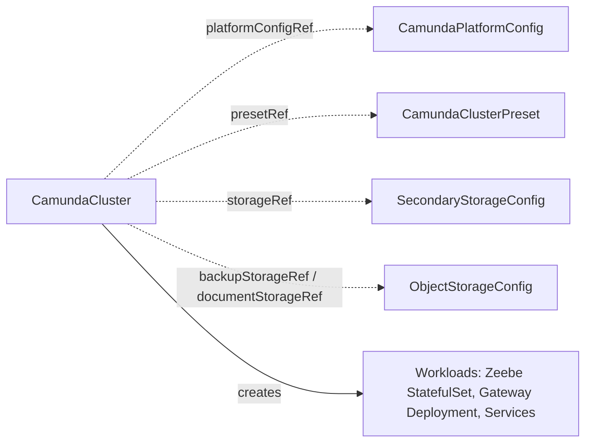

# CamundaCluster

The core CR: a self-contained description of one Camunda orchestration cluster, from which the operator creates and manages all workloads.

## Purpose

`CamundaCluster` describes a complete orchestration cluster — Zeebe brokers, gateway, web applications, and optionally connectors — for Camunda 8.9 or later.
You create it directly, or a composition layer above creates it on your behalf; either way the operator turns it into StatefulSets, Deployments, and Services and keeps them converged.
It deliberately owns only the workloads: secondary storage arrives through a required `storageRef` contract CRD, bucket storage through optional `ObjectStorageConfig` references, shared settings through [CamundaPlatformConfig](camundaplatformconfig.md), and standardized sizing through [CamundaClusterPreset](camundaclusterpreset.md).
Features such as backups, Optimize, and PVC auto-resizing attach to the cluster from the outside via `clusterRef` and labels; the cluster never knows about them.

## How it works

### Component topology

Camunda 8.9 ships the orchestration cluster as a single unified binary: Zeebe, the gateway, and the Operate, Tasklist, and Admin web applications are one Spring Boot artifact, and which parts run in a given process is activated by configuration, not by different images.
The topology is therefore a configuration choice on this CR:

- `zeebe` is always required and always standalone: a StatefulSet of brokers with `replicas`, `partitions`, `replicationFactor`, and persistent volumes.
- `gateway` runs `Standalone` (its own Deployment of the unified binary) or `Embedded` (the brokers enable their embedded gateway).
- `operate`, `tasklist`, and `admin` each run `Standalone` or `Embedded`. Embedded applications run inside the nearest standalone application up the chain: inside the gateway if it is standalone, otherwise inside zeebe. Identity was renamed to Admin in Camunda 8.9; the profile is `admin`.
- `connectors` is a separate runtime application, never part of the unified binary; when enabled it is always its own standalone Deployment that connects to the cluster's REST and gRPC APIs.

!!! note "Profiles select the role of a process"
    The operator selects the role of each process with Spring profiles (`SPRING_PROFILES_ACTIVE`) and the embedded gateway with `ZEEBE_BROKER_GATEWAY_ENABLE`, never with `camunda.mode`.
    In Camunda 8.9, `camunda.mode=gateway` adds the `consolidated-auth` profile only when `camunda.security.authentication.method` is unset. The operator always sets that property, so a gateway under `camunda.mode` starts without a security filter chain.
    Every unified process therefore carries `consolidated-auth` next to its role profiles. The role profiles are `broker` for the brokers, `gateway` for the gateway, and `operate`, `tasklist`, and `admin` for the web applications that the process serves (`identity` is the legacy name of `admin`).
    The host process serves an `Embedded` web application. A `Standalone` web application gets its own Deployment of the unified binary with the `gateway` profile and only that application's profile. The binary supports this shape, but Camunda's own charts do not use it.

This supports every deployment model from all-in-one (everything embedded in zeebe, simplest for development) through the 8.9 default (standalone gateway hosting the embedded web applications) to fully separated Deployments per application.

### Reconciliation

1. The operator resolves `presetRef` (if set) and computes the effective spec under the merge rules documented in [CamundaClusterPreset](camundaclusterpreset.md).
2. The operator resolves `platformConfigRef`, the required `storageRef`, and the optional `backupStorageRef` / `documentStorageRef`; a missing target sets `Ready` to `False` with reason `InvalidReference`.
3. The operator renders the workloads for the effective topology: the zeebe StatefulSet, a Deployment per standalone component, Services, and the configuration wiring — all expressed as unified-configuration environment variables on the single Camunda image (Spring Boot relaxed binding, for example `SPRING_PROFILES_ACTIVE`, `ZEEBE_BROKER_GATEWAY_ENABLE`, `CAMUNDA_SECURITY_AUTHENTICATION_METHOD`, `CAMUNDA_DATA_SECONDARYSTORAGE_*`) — with auth from the platform config, secondary storage from the resolved `SecondaryStorageConfig`, and `externalUrl` as the base URL for OIDC redirects and web application links. The operator creates no Ingress resources; you (or a composition layer above) route traffic to `externalUrl`.
4. Every workload carries the labels `camunda.io/cluster: <name>` and `camunda.io/component: <component>`, which is how extension controllers discover the cluster's resources. The operator uses the component values `zeebe`, `gateway`, `operate`, `tasklist`, `admin`, and `connectors`.
5. The operator applies all rendered objects with Server-Side Apply (SSA) under the field manager `CamundaCluster/<process>` (for example `CamundaCluster/zeebe`), leaving fields patched by other field managers (for example the `CamundaOptimize` controller's env injection under `camunda-operator/camundaoptimize`) untouched.
6. The operator watches workload health into per-component conditions and the aggregate `Ready` condition.
7. The operator watches the referenced [CamundaPlatformConfig](camundaplatformconfig.md), the preset, the storage binding and its `DatabaseConfig` / `DatabaseServerConfig` chain, and every referenced Secret. A change to any of them changes the configuration hash on the pod templates (`camunda.io/config-hash`). The change rolls out to the cluster without a change to this CR.
8. When `backupStorageRef` is set, the operator derives the backup wiring from the referenced `ObjectStorageConfig`. It configures the Zeebe primary-storage backup store (`camunda.data.primary-storage.backup`) on both storage paths, under a prefix of `<basePath>/<namespace>/<cluster>` so that two clusters never share one. On the Elasticsearch path it also sets the snapshot repository name (`camunda.data.backup.repository-name`) from `elasticsearch.snapshotRepository` of the storage contract. The operator registers no repository itself: the [ElasticsearchCluster](elasticsearchcluster.md) owns the Elasticsearch side of the bucket and publishes the name. A cluster with a `backupStorageRef` whose contract carries no repository name reports `Ready: InvalidReference`.
9. For RDBMS-backed clusters the operator also configures the backup scheduler of Zeebe from `spec.backup.primaryStorage`: continuous mode, the schedule, the checkpoint interval, and the retention window. The defaults are `PT1H`, `PT15M`, and `P7D`. These backups of primary storage pair with the database dump that a `LogicalBackupRDBMS` writes, and a restore aligns the two through the exported position.
10. The operator derives the workload identity of every referenced bucket onto the ServiceAccount that it renders: `eks.amazonaws.com/role-arn` for S3, `iam.gke.io/gcp-service-account` for GCS, and `azure.workload.identity/client-id` for Azure Blob, which also adds the pod label `azure.workload.identity/use: "true"`. The ServiceAccount is rendered whenever an identity needs it, even without `spec.serviceAccount`. An annotation that you set in `spec.serviceAccount.annotations` wins over the derived one. A bucket with an empty `workloadIdentity` block adds no annotation: the binding then lives on the cloud side and names the ServiceAccount `system:serviceaccount:<namespace>:<name>-camunda` itself, as EKS Pod Identity does. Two referenced buckets that name different identities of one cloud report `Ready: InvalidReference`, because a pod has one ServiceAccount.
11. The operator publishes the address of the management API in `status.management`. Extensions such as the backup kinds read it instead of rebuilding the Service name, the port, and the authentication. The binding is empty while the cluster is suspended.
12. `suspend: true` scales every workload to zero replicas and keeps the broker volumes; `Ready` is then `True` with reason `Suspended`. When `suspend` returns to false, `Ready` stays `True` with reason `Updating` while the workloads scale up, then `Healthy`. `pause: true` stops the reconciliation of this CR: the operator records one `Paused` event and writes nothing, not even status, until `pause` is false again.

!!! note "Deviation from the original proposal"
    The proposal enabled continuous primary-storage backup only when the storage chain had point-in-time recovery enabled (`pitr.enabled: true` on the `DatabaseServerConfig`).
    Verified against Camunda 8.9 (`camunda.data.primary-storage.backup` supports continuous and scheduled operation), the operator enables it for every RDBMS-backed cluster with a `backupStorageRef`, because restorable RDBMS backups need primary-storage checkpoints regardless of PITR.
    The proposal also had this controller register the Elasticsearch snapshot repository. That work moved to the [ElasticsearchCluster](elasticsearchcluster.md), which owns the Elasticsearch object and its keystore: a controller administers only what it renders. This cluster reads the repository name from the storage contract.



### Services and endpoints

Every process gets a Service with the name of its workload: `<name>-zeebe` (headless), `<name>-gateway`, `<name>-operate`, `<name>-tasklist`, `<name>-admin`, and `<name>-connectors`.
The gateway Service (the zeebe Service, when the gateway is `Embedded`) exposes the gRPC API on port `26500` and the HTTP API on port `8080`.
The HTTP port serves the Orchestration Cluster REST API under `/v2/` and the embedded web applications under `/operate/`, `/tasklist/`, and `/admin/`.
A standalone web application gets a Service of its own that exposes port `8080`. Every unified process exposes the health and metrics endpoints on the management port `9600`. Connectors expose them on their HTTP port `8080`.

### Basic authentication

Camunda 8.9 seeds no user on its own. When the platform config selects basic authentication, the operator creates the initial admin user of the cluster.
The credentials live in the Secret `<name>-camunda-admin` in the namespace of the CamundaCluster, under the keys `username` (`admin`) and `password`.
The operator generates the password once and keeps it stable across reconciles. The password reaches the containers as a `secretKeyRef`, and the user is a member of the `admin` role.
The connectors runtime authenticates against the cluster with the same user. The Secret reports the condition `AdminSecretReady`, and it takes part in `Ready`.

### Referenced Secrets in other namespaces

A pod can only read a Secret in its own namespace. When a referenced Secret (the license, the OIDC client secret, the storage credentials, the CA, or the DatabaseConfig credentials) lives in another namespace, the operator copies the referenced keys into the namespace of the CamundaCluster.
The copy is the owned Secret `<name>-camunda-<purpose>`, where `purpose` is one of `license`, `oidc-client`, `auth-client`, `es-credentials`, `es-ca`, and `db-credentials`. The containers reference the copy. A change to the source Secret updates the copy and rolls the pods. The copies report the condition `MirroredSecretsReady`, and it takes part in `Ready`.

### Zeebe storage

The brokers keep their data on one PersistentVolumeClaim per pod, from the `data` volume claim template of the StatefulSet.
When the effective `spec.zeebe.storageSize` grows, the operator patches every bound broker claim up to the new size, in place and without a restart. A claim of a new replica is patched after it binds. The storage class must allow volume expansion; the API server rejects the patch otherwise, and the reconcile stops with that error and is retried with backoff.
The volume claim template of a StatefulSet is immutable, so the operator never changes it and never recreates the StatefulSet: the template keeps the size it was created with, and the StatefulSet carries the effective size in the annotation `camunda.io/requested-storage-size`.
The operator never reduces a claim. When the effective size is below the largest bound broker claim (only possible through the preset, since admission rejects an inline decrease), the operator records the Warning event `StorageShrinkIgnored` once per requested size and continues; the claims and the template keep their size.
The retention policy of the StatefulSet maps `spec.zeebe.persistentVolumeClaimRetentionPolicy.whenDeleted` (`Delete` by default); a scale-down always retains the claims. `status.volumes` lists every bound broker claim with its capacity.

### JVM options

Every unified process gets `JAVA_TOOL_OPTIONS=-XX:+ExitOnOutOfMemoryError`, so the JVM exits on an OutOfMemoryError and the kubelet restarts the pod.
Heap sizing is left to the container-aware defaults of the JVM. To change the JVM options of a process, set `JAVA_TOOL_OPTIONS` in its `extraEnv`; the entry replaces the value of the operator.

### Extra environment variables

The operator renders the configuration of a process first, then the user entries in layers. A later entry with the same name wins:

1. the top-level `extraEnv`,
2. the `extraEnv` of the embedded gateway (on the brokers, when the gateway is `Embedded`),
3. the `extraEnv` of every embedded web application that the process hosts,
4. the `extraEnv` of the process's own component block.

An embedded component has no process of its own, so its `extraEnv` and `extraEnvFrom` apply to its host process: the gateway when it is standalone, otherwise zeebe. `extraEnvFrom` sources are concatenated in the same order. Connectors get only the top-level entries and their own block.

### ServiceMonitors

When `spec.monitoring.serviceMonitor.enabled` is true, the operator creates one ServiceMonitor per process, named like the workload.
It scrapes `/actuator/prometheus` on the management port `9600` of a unified process, and on the HTTP port `8080` of connectors.
On a Kubernetes cluster that does not serve the `ServiceMonitor` kind, the operator creates none and reports no error.

## API reference

```yaml
apiVersion: core.camunda.io/v1
kind: CamundaCluster
metadata:
  name: my-cluster
  namespace: my-cluster-ns
spec:
  # string. Required. Name of the cluster-scoped CamundaPlatformConfig providing auth, license, and image registry.
  platformConfigRef: "my-platform-config"
  # string. Optional. Name of a cluster-scoped CamundaClusterPreset to inherit as a baseline.
  presetRef: "medium"
  # string. Required unless the resolved preset provides it. Camunda version, 8.9 or later (e.g. "8.9.0").
  version: "8.9.0"
  # string. Optional. Deterministic external base URL, set before creation; used for OIDC redirect URLs and web application links. The operator creates no Ingress.
  externalUrl: "https://my-cluster.camunda.example.com"
  # object. Optional. ServiceAccount settings for the cluster's workloads.
  serviceAccount:
    # map[string]string. Optional. Annotations for workload identity (IRSA, GCP Workload Identity, ...). The operator derives these from the referenced buckets; a value you set here wins over the derived one.
    annotations:
      eks.amazonaws.com/role-arn: "arn:aws:iam::123456789012:role/my-cluster-role"
  # object. Optional. Per-cluster OIDC client credentials, overriding the platform config (and preset) defaults.
  auth:
    # string. Required. OIDC client ID for this cluster.
    clientId: "my-cluster-client"
    # string. Optional, default: the clientId. Audience validated in access tokens.
    audience: "my-cluster-client"
    # object. Required. Secret holding this cluster's OIDC client secret.
    clientSecretRef:
      # string. Required. Name of the Secret.
      name: "my-cluster-oidc-secret"
      # string. Required. Namespace of the Secret (always explicit; it never defaults to this CR's namespace).
      namespace: "my-cluster-ns"
      # string. Required. Key inside the Secret.
      key: "client-secret"
  # object. Optional. Zeebe brokers; always rendered as a standalone StatefulSet.
  zeebe:
    # integer. Optional, default: 1. Number of brokers.
    replicas: 3
    # integer. Optional, default: 1. Number of partitions; cannot be decreased, and once set it cannot be removed.
    partitions: 3
    # integer. Optional, default: 1. Replication factor; must not exceed replicas.
    replicationFactor: 3
    # object. Optional. Compute resources (requests/limits).
    resources:
      requests: { cpu: "1", memory: "2Gi" }
    # string. Optional, default: the cluster default StorageClass. StorageClass for broker volumes.
    storageClassName: "ssd"
    # quantity. Optional, default: 10Gi. Persistent volume size per broker; can only grow.
    storageSize: "32Gi"
    # object. Optional. What happens to the broker volumes when the CamundaCluster is deleted. A scale-down and a suspension always keep them.
    persistentVolumeClaimRetentionPolicy:
      # string (Retain | Delete). Optional, default: Delete. Delete removes the broker volumes with the cluster. Retain keeps them, and a later cluster with the same name reattaches them.
      whenDeleted: Delete
    # list. Optional. Individual env vars appended to the component's containers; an entry replaces an operator entry with the same name.
    extraEnv:
      - name: JAVA_TOOL_OPTIONS
        value: "-XX:+ExitOnOutOfMemoryError -Xmx4g"
    # list. Optional. Bulk env from ConfigMaps/Secrets.
    extraEnvFrom:
      - configMapRef:
          name: "zeebe-overrides"
    # map[string]string. Optional. Extra labels on this component's pods.
    podLabels: {}
    # map[string]string. Optional. Extra annotations on this component's pods.
    podAnnotations: {}
    # object. Optional. Scheduling constraints; replaces (never merges with) a preset's scheduling.
    scheduling:
      # object. Optional. Standard Kubernetes node affinity.
      nodeAffinity: {}
      # list. Optional. Standard Kubernetes tolerations.
      tolerations: []
      # object. Optional. Standard Kubernetes pod affinity.
      podAffinity: {}
  # object. Optional. Gateway; Deployment when Standalone, broker-embedded when Embedded.
  gateway:
    # string. Optional, default: Standalone. One of: Standalone | Embedded.
    mode: Standalone
    # integer. Optional, default: 1. Replicas; only meaningful when Standalone.
    replicas: 2
    # object. Optional. Compute resources; only meaningful when Standalone.
    resources: {}
    # list. Optional. Individual env vars; applied to the brokers when Embedded.
    extraEnv: []
    # list. Optional. Bulk env from ConfigMaps/Secrets; applied to the brokers when Embedded.
    extraEnvFrom: []
    # map[string]string. Optional. Extra pod labels; only meaningful when Standalone.
    podLabels: {}
    # map[string]string. Optional. Extra pod annotations; only meaningful when Standalone.
    podAnnotations: {}
    # object. Optional. Scheduling constraints; same shape as zeebe.scheduling, only meaningful when Standalone.
    scheduling: {}
  # object. Optional. Operate web application.
  operate:
    # string. Optional, default: Embedded. One of: Standalone | Embedded. Embedded runs in the nearest standalone host up the chain (gateway, else zeebe).
    mode: Embedded
    # integer. Optional, default: 1. Replicas; only meaningful when Standalone.
    replicas: 1
    # object. Optional. Compute resources; only meaningful when Standalone.
    resources: {}
    # list. Optional. Individual env vars; applied to the host process when Embedded.
    extraEnv: []
    # list. Optional. Bulk env from ConfigMaps/Secrets; applied to the host process when Embedded.
    extraEnvFrom: []
    # map[string]string. Optional. Extra pod labels; only meaningful when Standalone.
    podLabels: {}
    # map[string]string. Optional. Extra pod annotations; only meaningful when Standalone.
    podAnnotations: {}
    # object. Optional. Scheduling constraints; only meaningful when Standalone.
    scheduling: {}
  # object. Optional. Tasklist web application; same fields and semantics as operate.
  tasklist:
    # string. Optional, default: Embedded. One of: Standalone | Embedded.
    mode: Embedded
  # object. Optional. Admin web application (Identity before Camunda 8.9); same fields and semantics as operate.
  admin:
    # string. Optional, default: Embedded. One of: Standalone | Embedded.
    mode: Embedded
  # object. Optional. Connectors runtime; a separate application, standalone-only.
  connectors:
    # boolean. Optional, default: false. Whether to run the connectors runtime.
    enabled: true
    # string. Required when enabled, unless the resolved preset provides it. Version of the connectors bundle image (e.g. "8.9.7"); the bundle has its own patch line and does not follow spec.version.
    version: "8.9.7"
    # integer. Optional, default: 1. Connectors replicas.
    replicas: 2
    # object. Optional. Compute resources.
    resources: {}
    # list. Optional. Individual env vars.
    extraEnv: []
    # list. Optional. Bulk env from ConfigMaps/Secrets.
    extraEnvFrom: []
    # map[string]string. Optional. Extra pod labels.
    podLabels: {}
    # map[string]string. Optional. Extra pod annotations.
    podAnnotations: {}
    # object. Optional. Scheduling constraints.
    scheduling: {}
  # list. Optional. Env vars applied to ALL workloads; per-component entries win on name conflicts.
  extraEnv: []
  # list. Optional. Bulk env from ConfigMaps/Secrets applied to ALL workloads.
  extraEnvFrom: []
  # map[string]string. Optional. Labels applied to all workload pods.
  podLabels: {}
  # map[string]string. Optional. Annotations applied to all workload pods.
  podAnnotations: {}
  # object. Optional. Scheduling constraints applied to all workloads unless a component sets its own.
  scheduling: {}
  # string. Required. Name of the SecondaryStorageConfig, in this cluster's own namespace, providing the secondary storage backend.
  storageRef: "my-storage-config"
  # string. Optional. Name of a cluster-scoped ObjectStorageConfig for backups.
  backupStorageRef: "my-backup-config"
  # string. Optional. Name of a cluster-scoped ObjectStorageConfig for document storage.
  documentStorageRef: "my-document-config"
  # object. Optional. How backups of this cluster behave. Allowed in a preset, unlike backupStorageRef.
  # The block applies to a relational cluster: continuous and scheduled primary-storage backups and the dump Job exist only there.
  backup:
    # object. Optional. The backups that Zeebe takes of its own primary storage. They feed a point-in-time restore.
    primaryStorage:
      # boolean. Optional, default: true. Hold every log segment until it is backed up, so a restore finds an unbroken range.
      # It is a pointer, so a preset can turn it on for a fleet and one cluster can still turn it off.
      continuous: true
      # string. Optional, default: PT1H. How often Zeebe takes a backup: an ISO 8601 duration, a CRON expression, or "none".
      schedule: "PT1H"
      # string. Optional, default: PT15M. How often Zeebe writes a marker checkpoint, as an ISO 8601 duration.
      # It is the granularity of a point-in-time restore.
      checkpointInterval: "PT15M"
      # object. Optional. How long Zeebe keeps its primary-storage backups.
      retention:
        # string. Optional, default: P7D. The restore window, as an ISO 8601 duration.
        window: "P7D"
        # string. Optional, default: PT1H. How often Zeebe looks for backups outside the window.
        cleanupSchedule: "PT1H"
    # object. Optional. The pod of the Job that dumps the logical database. A LogicalBackupRDBMS can replace this block as a whole.
    dump:
      # object. Optional. CPU and memory of the dump pod.
      resources: {}
      # []EnvVar. Optional. Extra environment variables of the dump pod.
      extraEnv: []
      # []EnvFromSource. Optional. Extra environment sources of the dump pod.
      extraEnvFrom: []
      # map[string]string. Optional. Extra labels of the dump pod.
      podLabels: {}
      # map[string]string. Optional. Extra annotations of the dump pod.
      # Turn a service-mesh sidecar off here: a sidecar that keeps running stops the Job from completing.
      podAnnotations:
        sidecar.istio.io/inject: "false"
      # object. Optional. Scheduling constraints of the dump pod. Replaces the block of a preset entirely.
      scheduling: {}
      # object. Optional. Where the dump is written before it is uploaded. Replaces the block of a preset entirely.
      scratchVolume:
        # Quantity. Optional. Size of the emptyDir that holds the dump.
        sizeLimit: 50Gi
        # string. Optional. When set, the scratch volume is a PersistentVolumeClaim of this class instead of an emptyDir.
        storageClassName: "fast"
  # object. Optional. Monitoring integrations.
  monitoring:
    # object. Optional. Prometheus ServiceMonitor creation.
    serviceMonitor:
      # boolean. Optional, default: false. When true, the operator creates a ServiceMonitor per process that scrapes /actuator/prometheus on the management port 9600 (connectors: on the HTTP port 8080).
      enabled: true
      # map[string]string. Optional. Extra labels applied to all created ServiceMonitors.
      labels: {}
      # map[string]string. Optional. Extra annotations applied to all created ServiceMonitors.
      annotations: {}
  # boolean. Optional, default: false. Scale all workloads to zero while keeping data.
  suspend: false
  # boolean. Optional, default: false. Halt reconciliation of this CR entirely.
  pause: false
```

## Status

Status uses conditions exclusively: one condition per process, the internal Secret conditions, and the aggregate `Ready` — no health enums, no URL fields.
Every process reports a condition. The condition of an embedded gateway, an embedded web application, or disabled connectors reads `True` with reason `Disabled`: the operator keeps a component for it and deletes what an earlier topology created. An embedded application is covered by the condition of its host (for example `GatewayReady` covers embedded operate/tasklist/admin).
`Ready` is derived from the conditions of the components that the cluster needs. A component that the cluster does not need stays out of that set, so a `Disabled` condition never takes part. `Ready` is `True` only when every condition in the set is `True`.
Its reason and message come from the governing component. That is the component with the highest component framework priority among the components that are not `True`. When every one of them is `True`, it is the one with the highest priority of all. The message names that component. The reasons of the component conditions come from the component framework (`Healthy`, `Creating`, `Updating`, `Degraded`, `Down`, `Suspended`, `Disabled`, and more).

| Type | Reason | Meaning |
| --- | --- | --- |
| `ZeebeReady` | `Healthy` | All broker replicas are ready. |
| `GatewayReady` | `Healthy` | All gateway replicas are ready. `Disabled` when the gateway is embedded. |
| `OperateReady` / `TasklistReady` / `AdminReady` | `Healthy` | The standalone web application's replicas are ready. `Disabled` when the application is embedded. |
| `ConnectorsReady` | `Healthy` | All connectors replicas are ready. `Disabled` when connectors are not enabled. |
| `AdminSecretReady` | `Healthy` | The admin Secret `<name>-camunda-admin` is applied. `Disabled` under OIDC: a switch from basic to OIDC deletes the Secret. |
| `MirroredSecretsReady` | `Healthy` | Every copy of a referenced Secret from another namespace is applied; a copy whose reference went away or moved into the cluster namespace is deleted. `Disabled` when no referenced Secret lives outside the cluster namespace; takes part in `Ready` only when one does. |
| `Ready` | `Healthy` | Every component the cluster needs is `Healthy`. |
| `Ready` | `InvalidReference` | A referenced CR (`platformConfigRef`, `presetRef`, `storageRef` and its `DatabaseConfig` / `DatabaseServerConfig` chain, `backupStorageRef`, `documentStorageRef`) does not exist, or the merged spec is invalid (the message starts with `invalid effective spec:` and names the fields). |
| `Ready` | `MissingSecret` | A referenced Secret (auth client secret, license, storage credentials, CA, DatabaseConfig credentials) or one of its keys is missing. |
| `Ready` | `Suspended` | `spec.suspend` is true and every workload is scaled to zero. `Ready` is `True`: the cluster is in its desired state. |

`status.management` publishes the address of the management API, so an extension calls it without knowing which process hosts it:

```yaml
status:
  management:
    # The Service of the process that serves the API, on the management port.
    endpoint: http://my-cluster-zeebe.my-cluster-ns.svc:9600
    auth:
      # none | basic. Camunda 8.9 serves the actuator endpoints without authentication, so the operator reports none.
      # Protecting the port is a network policy, not a credential.
      method: none
    version: 8.9.9
    partitions: 3
    # Elasticsearch path only: the snapshot repository of the storage contract.
    backupRepository: my-cluster
```

The binding is absent while the cluster is suspended. Every workload is then scaled to zero, so a consumer sees an unreachable cluster instead of a stale endpoint.

The operator records the last reconciled generation in `status.observedGeneration`.
`status.volumes` lists the bound broker PersistentVolumeClaims, sorted by name, each with the capacity that it reports (`name`, `capacity`). The claims can differ in size, so a resize of one claim outside the spec (for example by [PVCAutoResize](pvcautoresize.md)) shows here.

## Validation

- `spec.storageRef` is required: a CamundaCluster without secondary storage is not a functional Camunda cluster.
- `spec.platformConfigRef` is required.
- The effective version (inline or inherited from the preset) must be present and 8.9 or later.
- `spec.zeebe.partitions` cannot be decreased, and once set inline it cannot be removed (removal would fall back to the preset or the default, an effective decrease).
- `spec.zeebe.storageClassName` is immutable after creation: StatefulSet PVC templates cannot change their storage class.
- `spec.zeebe.storageSize` may only grow; updates that shrink it are rejected, like [ElasticsearchCluster](elasticsearchcluster.md)'s `storageSize`. On growth the operator expands the existing PVCs in place — the storage class must support volume expansion — and expands the PVC of a new replica after it binds. A decrease through the preset is ignored with the event `StorageShrinkIgnored`.
- `spec.zeebe.replicationFactor` must not exceed `spec.zeebe.replicas`.
- `spec.zeebe.persistentVolumeClaimRetentionPolicy.whenDeleted` is `Delete` or `Retain`.
- `spec.connectors.version` must be a full three-segment version (`8.9.7`, not `8.9`). The effective value (inline or inherited from the preset) must be present when `spec.connectors.enabled` is true.
- `spec.connectors.replicas` and connectors sizing fields are only meaningful when `spec.connectors.enabled` is true.
- Existence of referenced CRs and Secrets is checked at reconcile time and surfaced as `InvalidReference` / `MissingSecret` conditions, not at admission, because references may be created in any order.

## Relationships

- [CamundaPlatformConfig](camundaplatformconfig.md) — referenced via `platformConfigRef` for auth, license, and image registry defaults.
- [CamundaClusterPreset](camundaclusterpreset.md) — referenced via `presetRef` for a standardized baseline spec.
- [SecondaryStorageConfig](secondarystorageconfig.md) — referenced via `storageRef` (required), resolved in this cluster's own namespace; the contract CRD describing the secondary storage backend: Elasticsearch (8.19 or later for Camunda 8.9) or RDBMS (GA in Camunda 8.9).
- [ObjectStorageConfig](objectstorageconfig.md) — referenced via `backupStorageRef` and `documentStorageRef` for bucket storage. Bucket access comes from the workload identity that the operator derives onto the ServiceAccount, or from the static credentials of the contract, which the operator copies into the cluster namespace.
- Backup, [BackupSchedule](backupschedule.md), BackupRetention — reference this CR via `clusterRef` to back it up.
- [LogicalRestore](logicalrestore.md) — references this CR via `targetClusterRef`; requires the cluster to be suspended.
- [PointInTimeRestore](pointintimerestore.md) — references this CR via `clusterRef`; relies on the continuous primary-storage backup this controller enables for RDBMS-backed clusters.
- [CamundaOptimize](camundaoptimize.md) — references this CR via `clusterRef` and patches `spec.zeebe.extraEnv` via SSA under its own field manager; only supported for clusters whose secondary storage is Elasticsearch or OpenSearch.
- [PVCAutoResize](pvcautoresize.md) — references this CR via `clusterRef` and discovers its PVCs through the `camunda.io/cluster` label.

A composition layer above may create this CR; external ingress management routes traffic to `externalUrl`.

## Examples

A minimal manifest:

```yaml
apiVersion: core.camunda.io/v1
kind: CamundaCluster
metadata:
  name: my-cluster
  namespace: my-cluster-ns
spec:
  platformConfigRef: "my-platform-config"
  version: "8.9.0"
  storageRef: "my-storage-config"
```

A realistic manifest:

```yaml
apiVersion: core.camunda.io/v1
kind: CamundaCluster
metadata:
  name: my-cluster
  namespace: my-cluster-ns
spec:
  platformConfigRef: "my-platform-config"
  presetRef: "medium"
  version: "8.9.1"
  externalUrl: "https://my-cluster.camunda.example.com"
  serviceAccount:
    annotations:
      eks.amazonaws.com/role-arn: "arn:aws:iam::123456789012:role/my-cluster-role"
  zeebe:
    replicas: 5
    resources:
      requests:
        memory: "8Gi"
    extraEnv:
      - name: JAVA_TOOL_OPTIONS
        value: "-XX:+ExitOnOutOfMemoryError -Xmx6g"
  storageRef: "my-storage-config"
  backupStorageRef: "my-backup-config"
  monitoring:
    serviceMonitor:
      enabled: true
      labels:
        prometheus: "platform"
  suspend: false
```
