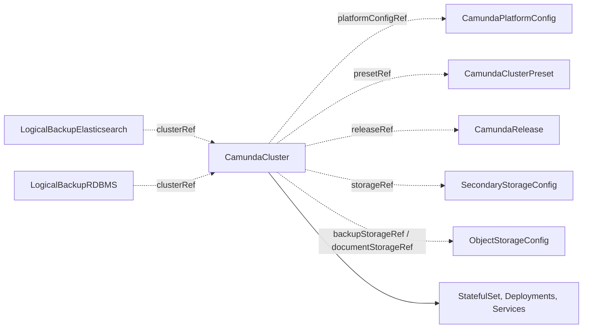

# CamundaCluster

A `CamundaCluster` is one Camunda orchestration cluster: the Zeebe brokers, the gateway, the web applications Operate, Tasklist, and Admin, and optionally the connectors runtime. The operator turns it into StatefulSets, Deployments, and Services for Camunda 8.9 or later, and keeps them healthy.

The cluster owns only its workloads. Secondary storage comes from a [SecondaryStorageConfig](secondarystorageconfig.md), and bucket storage from an [ObjectStorageConfig](objectstorageconfig.md). Both are [contracts](index.md#contracts): resources that publish the address and the credentials of a storage for other resources to reference. Shared settings come from a [CamundaPlatformConfig](camundaplatformconfig.md), sizing defaults from a [CamundaClusterPreset](camundaclusterpreset.md), and the versions from a [CamundaRelease](camundarelease.md). Backups attach from the outside through [LogicalBackupElasticsearch](logicalbackupelasticsearch.md) and [LogicalBackupRDBMS](logicalbackuprdbms.md).

The smallest cluster names a platform configuration, a version, and a storage contract:

```yaml
apiVersion: core.camunda.io/v1
kind: CamundaCluster
metadata:
  name: my-cluster
  namespace: my-cluster-ns
spec:
  platformConfigRef: "my-platform-config"
  version: "8.9.0"
  storageRef: "my-storage-config"
```


```mermaid
graph LR
    CC[CamundaCluster] -.->|platformConfigRef| PFC[CamundaPlatformConfig]
    CC -.->|presetRef| CCP[CamundaClusterPreset]
    CC -.->|releaseRef| CR[CamundaRelease]
    CC -.->|storageRef| SSC[SecondaryStorageConfig]
    CC -.->|backupStorageRef / documentStorageRef| OSC[ObjectStorageConfig]
    CC --> WL["StatefulSet, Deployments, Services"]
    LBE[LogicalBackupElasticsearch] -.->|clusterRef| CC
    LBR[LogicalBackupRDBMS] -.->|clusterRef| CC
```

## Topology

Zeebe, the gateway, and the web applications run from one Camunda image. Each block of the spec says where its process runs:

- `zeebe` is always a StatefulSet of brokers with persistent volumes.
- `gateway` runs `Standalone` (its own Deployment) or `Embedded` (inside the brokers). The default is `Standalone`.
- `operate`, `tasklist`, and `admin` each run `Standalone` (their own Deployment) or `Embedded`. The default is `Embedded`. An embedded web application runs inside the gateway when the gateway is standalone, otherwise inside the brokers.
- `connectors` is a separate runtime. When enabled, it is always its own Deployment.

A cluster that gives Operate its own pods and runs connectors:

```yaml
apiVersion: core.camunda.io/v1
kind: CamundaCluster
metadata:
  name: my-cluster
  namespace: my-cluster-ns
spec:
  operate:
    mode: Standalone
    replicas: 2
  connectors:
    enabled: true
    version: "8.9.7"
  # ... the rest of your cluster
```

## Endpoints

Each enabled process gets a workload and a Service named `<name>-<component>`. A standalone gateway serves on the Service `<name>-gateway`, with gRPC on port `26500` and HTTP on port `8080`. An embedded gateway serves the same ports on `<name>-zeebe`. HTTP serves the REST API under `/v2/` and the embedded web applications under `/operate/`, `/tasklist/`, and `/admin/`. A standalone web application serves on its own Service on port `8080`.

`status.gateway` publishes the two client addresses, so you do not have to work out which Service runs the gateway. See [Status](#status).

Every resource carries the labels `camunda.io/cluster` and `camunda.io/component`. The component is one of `zeebe`, `gateway`, `operate`, `tasklist`, `admin`, and `connectors`. List the workloads of a cluster:

```bash
kubectl get deploy,sts,svc -n my-cluster-ns -l camunda.io/cluster=my-cluster
```

A Service name has at most 63 characters. When the cluster name is too long for its suffix, the operator cuts the name and adds a hash of the full name. The `camunda.io/cluster` label and the derived Secret names carry the same cut form. For such a cluster, read the label value with `kubectl get deploy --show-labels` and select on that value.

The operator creates no Ingress. You route traffic to the cluster. `spec.externalUrl` tells the cluster its public base URL for OIDC redirects and links.

## Authentication

The authentication method, basic or OIDC, comes from the [CamundaPlatformConfig](camundaplatformconfig.md) that `platformConfigRef` names. A cluster cannot choose its own method.

Under basic authentication the operator creates the admin user `admin`. It stores the credentials in the Secret `<name>-camunda-admin`, under the keys `username`, `password`, and `email`. To rotate the password, set `spec.auth.basic.passwordRotation` to a new value. `status.adminPassword.rotation` records the value that the operator applied.

Under OIDC the identity provider authenticates every caller, and `spec.auth.admin` names the identities that get the `admin` role. An OIDC cluster without `spec.auth.admin` has no administrator.

The [authentication guide](../guides/authentication.md) explains both methods, the admin role, and the rotation with its failure modes.

## Version

The effective version is `spec.version`, or the version of the [CamundaRelease](camundarelease.md) of `releaseRef` when the field is absent. A release can also pin the image to pull, but the rules below read the version, not the image. `spec.connectors.version` does not follow the Camunda version. Set it on its own.

### Upgrade

To upgrade, raise `spec.version`, or raise the version of the release that `releaseRef` names. The operator rolls every workload to the new version. `kubectl get camundacluster` shows the new version at once, and `Ready` reads `Updating` until every process is healthy again.

Move one minor at a time, and move to the latest patch of your minor first. Camunda blocks the start after a skipped minor, see [Version compatibility checks](https://docs.camunda.io/docs/self-managed/components/orchestration-cluster/core-settings/concepts/version-compatibility/#required-upgrade-procedure). [Prepare for upgrade](https://docs.camunda.io/docs/self-managed/upgrade/prepare-for-upgrade/) lists what changes in each minor. An attached [CamundaOptimize](camundaoptimize.md#versions) reports `VersionMismatch` until you raise its version to the same minor.

### A lower version is refused

The operator refuses a version below the one that the brokers run. Camunda does not support a downgrade of a running cluster, see [Version compatibility checks](https://docs.camunda.io/docs/self-managed/components/orchestration-cluster/core-settings/concepts/version-compatibility/). The cluster reports `Ready: False` with reason `VersionDowngradeRefused` and records a Warning event with the same name. It applies no change of the spec, and the brokers keep the version they have.

```yaml
status:
  observedGeneration: 4
  conditions:
    - type: Ready
      status: "False"
      reason: VersionDowngradeRefused
      message: 'the effective version 8.9.0 is below the running version 8.9.5. Camunda
        does not support a downgrade of a running cluster: a broker that starts on
        data that a newer version wrote marks itself unhealthy. Set the version to
        8.9.5 or later. To run 8.9.0 on the data of a backup taken with it, restore
        that backup after that: the restore sets the version itself, and it cannot
        start while this refusal stands. To downgrade on purpose over the data the
        brokers have, set the annotation camunda.io/allow-version-downgrade="8.9.0"
        on the cluster'
      observedGeneration: 4
      lastTransitionTime: "2026-08-20T09:14:00Z"
```

The rule reads the effective version. A lower `spec.version`, a removed `spec.version` over a lower release, and a lowered release all meet it.

The running version is the version that the operator last applied to the brokers, even before the pods have rolled. The operator also writes it on each broker volume, as the annotation `camunda.io/broker-version`. So a cluster that you create again on retained volumes ([Storage](#storage)) obeys the rule too. A new cluster with new volumes has no running version.

A suspended cluster reports the refusal when it resumes. It then stays at zero until you set the version forward again or sanction the downgrade.

### Downgrade on purpose

CAUTION: Do not downgrade a cluster over data that a newer version wrote. To recover, set the version back to the one that wrote the data. To run the lower version on the data of a backup taken with it, restore that backup. Do not lower `spec.version` for it. The restore sets the version itself, see [LogicalRestoreElasticsearch](logicalrestoreelasticsearch.md#why-the-downgrade-is-safe-here) and [LogicalRestoreRDBMS](logicalrestorerdbms.md#why-the-downgrade-is-safe-here). A restore cannot start while the refusal stands.

To downgrade on purpose, set the annotation `camunda.io/allow-version-downgrade` to the target version. Set `spec.version` to the same value in the same edit.

```yaml
apiVersion: core.camunda.io/v1
kind: CamundaCluster
metadata:
  name: my-cluster
  namespace: my-cluster-ns
  annotations:
    camunda.io/allow-version-downgrade: "8.9.0"
spec:
  version: "8.9.0"
  # ... the rest of your cluster
```

The annotation sanctions a move to that version and to no other. The operator removes the annotation when the brokers carry the version. It also removes an annotation that does not name the effective version. You can also set the annotation after the refusal, because the refusal keeps the lower version pending.

After a restore, you can give the release control of the version again. Set the annotation to the version of the release, and remove `spec.version` in the same edit.

## Storage

The brokers keep their data on one PersistentVolumeClaim per pod. `spec.zeebe.storageClassName` is fixed at creation. When `spec.zeebe.storageSize` grows, the operator expands every bound broker volume in place, without a restart. The storage class must allow volume expansion. The operator never shrinks a volume. A smaller size from a preset is ignored, and the cluster records the Warning event `StorageShrinkIgnored`.

`spec.zeebe.persistentVolumeClaimRetentionPolicy.whenDeleted` decides what happens to the volumes when you delete the cluster. `Delete` (the default) removes them. `Retain` keeps them for a later cluster with the same name. A scale-down and a suspension always keep them.

## Secondary storage

`spec.storageRef` names the `SecondaryStorageConfig` in the namespace of the cluster. This contract tells the cluster where its backend is: the Elasticsearch or the database that holds its secondary storage. The [secondary storage guide](../guides/secondary-storage.md) shows how to set up Elasticsearch or PostgreSQL.

One `CamundaCluster` writes one backend. Camunda fixes the index names and the tables, so two clusters on one backend write each other's data. A restore of one of them deletes the data of the other.

The operator knows a backend by the address that the contract resolves to, not by the contract:

- For Elasticsearch, the address is the scheme, the host, and the port of the endpoint. A path prefix does not make a second backend.
- For an RDBMS, the address is the host, the port, and the database name.
- Two contracts that resolve to one address are one backend, in any namespace.
- A bare Service name, such as `es`, resolves in the namespace of the contract. So `es` in two namespaces is two backends, and `es` beside `es.<namespace>.svc` is one.

The operator compares addresses, not servers. Two contracts that reach one Elasticsearch through two host names are not caught. Give one backend one address.

The first cluster on a backend holds it until the cluster moves to another backend or you delete the cluster. A cluster whose contract you delete keeps its backend and keeps running.

### A second cluster on a held backend

The API server accepts a second cluster on a held backend. The operator suspends that cluster: every workload at zero, and the volumes kept. Its `Ready` is `False` with reason `StorageAlreadyAttached`, and the message names the holder and the backend.

```yaml
status:
  conditions:
    - type: Ready
      status: "False"
      reason: StorageAlreadyAttached
      message: >-
        CamundaCluster "my-cluster-ns/my-other-cluster" already holds the
        backend "elasticsearch|https://es-http.my-cluster-ns.svc:9200". One
        CamundaCluster holds one backend, so this cluster stays suspended
        until that cluster moves to another backend or is deleted
```

When you delete the holder, or move it to another backend, the waiting cluster takes the backend and starts on its own. A paused holder keeps the backend until you unpause it. Two clusters that swap backends in one edit both start. A holder that you point away and back again can find the backend taken, and then reports `StorageAlreadyAttached` itself.

### Waiting for a handover

A cluster does not start while something else still writes its backend. It reports `Ready: False` with reason `WaitingForHandover`, keeps every workload at zero, and keeps the volumes. The state clears on its own. The cluster waits for these writers:

- Pods of another cluster, or of its [CamundaOptimize](camundaoptimize.md), on the backend, in any namespace. When you delete that cluster, its pods stop after the cluster is gone. When you move that cluster to another backend, its old pods stop as its rollout replaces them.
- Workloads of another cluster that can still start such a pod: a StatefulSet, a Deployment, a ReplicaSet that asks for replicas, or a Job.
- A restore into another cluster, see [Restores hold the backend](#restores-hold-the-backend).

A running cluster that you move to such a backend stops the same way. The message names the backend and what still writes it:

```yaml
status:
  conditions:
    - type: Ready
      status: "False"
      reason: WaitingForHandover
      message: >-
        Pods of another cluster, or of its Optimize instance, or workloads
        that start one, still write the backend
        "elasticsearch|https://es-http.my-cluster-ns.svc:9200":
        my-cluster-ns/my-other-cluster-zeebe-0. This cluster starts when they
        are gone
```

If the named pods never go, delete them. If a named workload keeps them coming back, scale it to zero or delete it.

The pods that the operator runs on a backend carry the label `camunda.io/storage-claim`, whose value names the backend. Find every pod on one backend by that value:

```bash
kubectl get pods -n my-cluster-ns -L camunda.io/storage-claim
kubectl get pods -A -l camunda.io/storage-claim=camunda-storage-8bd62d6c1f48cf988b142a51c9e7010d105e168c
```

### Restores hold the backend

A restore into another cluster holds the backend while it runs. The next cluster on the backend waits with `WaitingForHandover`, and the message names the restore, for example `LogicalRestoreElasticsearch my-cluster-ns/my-other-cluster-restore`.

The hold lasts until the restore reaches `Completed` or `Failed`, even when the restore stops making progress. It also lasts when you delete the target of the restore, or point it at another backend. A restore into this cluster itself is no reason to wait. To free the backend from a restore that does not move, delete the restore. A deleted restore keeps the backend until its work stops. Each restore page says when its work stops:

- [LogicalRestoreElasticsearch](logicalrestoreelasticsearch.md#the-backend), and [After a failure or a delete](logicalrestoreelasticsearch.md#after-a-failure-or-a-delete).
- [LogicalRestoreRDBMS](logicalrestorerdbms.md#the-backend).
- [PointInTimeRestore](pointintimerestore.md#who-rolls-the-database-back).

### A restore that is gone still holds the backend

This happens only when somebody removed the finalizers of a restore by hand. The restore is gone, but its hold stays, and nothing removes the hold for you. The hold is a Lease in the namespace of the operator, `camunda-operator-system` in the commands below.

Before you remove it, make sure that the work of the restore has stopped. For a `LogicalRestoreRDBMS`, no pod with its storage claim label runs. For a `LogicalRestoreElasticsearch`, no index recovery is active. For a `PointInTimeRestore`, `spec.pitr.lastRecovery` on the `DatabaseServerConfig` answers its request.

1. List the Leases. The `WRITER` column shows the restore that the `WaitingForHandover` message names:

    ```bash
    kubectl get leases -n camunda-operator-system \
      -l app.kubernetes.io/managed-by=camunda-operator,camunda.io/component=storage-writer \
      -o custom-columns='WRITER:.metadata.annotations.camunda\.io/storage-writer,UID:.metadata.labels.camunda\.io/writer-uid'
    ```

2. Delete every Lease of that restore, by the value of its `UID` column:

    ```bash
    kubectl delete leases -n camunda-operator-system \
      -l app.kubernetes.io/managed-by=camunda-operator,camunda.io/component=storage-writer,camunda.io/writer-uid=0d9c2a41-5e0b-4c7f-9a53-2f1e8b6c7d10
    ```

The waiting cluster starts a short time after the last Lease is gone.

## Secondary storage over TLS

When the [SecondaryStorageConfig](secondarystorageconfig.md) names a certificate authority under `elasticsearch.caSecretRef`, the brokers, the gateway, and the web applications trust that authority. A cluster on an [ElasticsearchCluster](elasticsearchcluster.md) gets this without a step from you, because that kind fills `caSecretRef` itself. For an Elasticsearch of your own behind a private authority, set `caSecretRef` on the contract.

The Zeebe Elasticsearch exporter needs this trust. It has no TLS setting of its own ([camunda/camunda#9839](https://github.com/camunda/camunda/issues/9839)). Without `caSecretRef` it writes no records, and [CamundaOptimize](camundaoptimize.md) stays empty. Every TLS client in those processes then trusts the authority, not only the exporter.

The trust arrives through `JAVA_TOOL_OPTIONS`. If you set that variable yourself, read [Environment and JVM](#environment-and-jvm).

## Index replicas

`spec.indexReplicas` sets the number of replicas of each index that the cluster creates in an Elasticsearch secondary storage.

```yaml
apiVersion: core.camunda.io/v1
kind: CamundaCluster
metadata:
  name: my-cluster
  namespace: my-cluster-ns
spec:
  indexReplicas: 1
  # ... the rest of your cluster
```

When you do not set it, the node count of the [SecondaryStorageConfig](secondarystorageconfig.md#node-count) gives the count. One node gives 0 replicas. Two or more nodes give 1 replica. The contract of an [ElasticsearchCluster](elasticsearchcluster.md) always carries the node count. A contract without a node count leaves the count to Camunda.

Elasticsearch never puts a replica on the node that holds its primary. An index with more replicas than the other nodes can hold stays at yellow health, and the `ElasticsearchCluster` is then not `Ready`. If you set a count that the nodes cannot place, the cluster runs with it and records the Warning event `IndexReplicasExceedNodes`.

The cluster applies the count to its existing indices each time it starts. A change of `indexReplicas` restarts the cluster, and so does a change of the storage contract. A relational secondary storage ignores the field.

If your `extraEnv` or `extraEnvFrom` sets `CAMUNDA_DATABASE_INDEX_NUMBEROFREPLICAS` or `ZEEBE_BROKER_EXPORTERS_CAMUNDAEXPORTER_ARGS_INDEX_NUMBEROFREPLICAS`, give `indexReplicas` the same value. Camunda does not start when they differ.

## Backups

Without `spec.backupStorageRef` the cluster takes no backups. With it, the brokers write primary-storage backups to the referenced bucket. On S3 and GCS, each cluster writes under its own prefix, so clusters can share a bucket. On Azure Blob, give each cluster its own container. A second cluster on the same Azure contract reports `InvalidReference`.

On the Elasticsearch path the storage contract must carry `elasticsearch.snapshotRepository`, or the cluster reports `InvalidReference`. On the RDBMS path `spec.backup.primaryStorage` configures the backup scheduler of Zeebe. The [spec reference](#spec-reference) lists its defaults.

On the RDBMS path, the backup credentials of the `DatabaseConfig` feed the dump Job. When they do not resolve, the cluster keeps running and records the Warning event `DumpCredentialsUnresolved`. The backups of the cluster then wait. The [backup guide](../guides/backup.md) covers the backup kinds.

## Workload identity

The pods run under the default ServiceAccount of the namespace, unless the cluster needs an account of its own. The cluster gets one when `spec.serviceAccount` is set, or when a referenced bucket has no credentials Secret and authenticates through workload identity. That account is `<name>-camunda`, or `spec.serviceAccount.name`. `status.serviceAccountName` shows the account that the pods use.

When a referenced bucket names a workload identity, the operator puts the matching annotation on the ServiceAccount. [ObjectStorageConfig](objectstorageconfig.md#authentication) lists the annotations. An annotation in `spec.serviceAccount.annotations` wins over the derived one. A bucket without an identity block adds no annotation, and you bind the principal `system:serviceaccount:<namespace>:<name>-camunda` on the cloud side. Two buckets that name different identities of one cloud report `InvalidReference`.

With `serviceAccount.create: false`, the operator does not create the ServiceAccount. It reports `InvalidReference` while the ServiceAccount does not exist.

## Environment and JVM

The operator renders its own environment first. Then it adds your entries in this order:

1. The top-level `extraEnv`.
2. The `extraEnv` of the embedded gateway (on the brokers).
3. The `extraEnv` of every embedded web application that the process hosts.
4. The `extraEnv` of the process itself.

A later entry with the same name wins, and your entry replaces an operator entry with the same name. `extraEnvFrom` sources are added in the same order. Connectors get the top-level entries and their own block only.

When two tools apply the cluster, for example your GitOps tool and the operator, each `extraEnv` list merges by name. Each tool owns the entries that it applies, and another tool can add entries next to them. An entry sets `value` or `valueFrom`, never both. A [CamundaManagementCluster](camundamanagementcluster.md) that serves the cluster owns four names, see [Management plane](#management-plane). `extraEnvFrom` and `spec.backup.dump.extraEnv` do not merge. A tool that applies one of these lists replaces the whole list.

Every Camunda process gets `JAVA_TOOL_OPTIONS=-XX:+ExitOnOutOfMemoryError`, so the kubelet restarts a pod after an OutOfMemoryError. The heap size comes from the container-aware defaults of the JVM. To change the JVM options, set `JAVA_TOOL_OPTIONS` in the `extraEnv` of the process. Keep `-XX:+ExitOnOutOfMemoryError` in your value. When the storage contract names a certificate authority, the operator adds the trust store options after your value.

To use a trust store of your own, name it with `-Djavax.net.ssl.trustStore` in your value. The operator then adds no trust store options, and the JVM reads your store only. That store must hold the certificate authority of the Elasticsearch endpoint, or the exporter fails and Optimize reads no records. This is also how you trust a second private authority, for example an OIDC provider or a backup store. Put every authority in one store. The spec has no volume field, so build the Camunda image with the store in it. Then name the image under `images.camunda` on the [CamundaPlatformConfig](camundaplatformconfig.md), or pin it on a [CamundaRelease](camundarelease.md).

A `JAVA_TOOL_OPTIONS` entry that reads its value from a Secret or a ConfigMap cannot take the trust store options. The cluster records the Warning event `TrustStoreOptionsNotApplied`, which names the processes. The operator still builds the store at `/etc/camunda/es-truststore/cacerts` with the password `changeit`. Name that store in the referenced value, or name a store of your own that holds the authority.

## Management plane

A [CamundaManagementCluster](camundamanagementcluster.md) can serve this cluster. It selects clusters in every namespace through a label selector, so nothing on this resource points at it. A cluster that it serves carries the annotation `camunda.io/management-cluster`:

```yaml
apiVersion: core.camunda.io/v1
kind: CamundaCluster
metadata:
  name: my-cluster
  namespace: my-cluster-ns
  annotations:
    camunda.io/management-cluster: my-management-ns/my-management
```

While the management plane sets `spec.console`, it also adds four entries to `spec.extraEnv`, which make the cluster report to Console: `CAMUNDA_CONSOLE_PING_ENABLED`, `CAMUNDA_CONSOLE_PING_ENDPOINT`, `CAMUNDA_CONSOLE_PING_CLUSTERNAME`, and `CAMUNDA_CONSOLE_PING_PINGPERIOD`. On Camunda 8.10 and later the four names are `CAMUNDA_HUB_PING_*`. The management plane owns these names and replaces what you set under one of them. To keep an entry of your own, give it another name. The entries change `spec`, so the pods roll once when they arrive and once when they go.

To remove the annotation and the entries, take the cluster out of `spec.clusterSelector` of the `CamundaManagementCluster`. Change the selector, or remove the label that it matches on. Removing `spec.console` from the management plane removes the four entries only. If you delete the annotation or the entries by hand, the management plane writes them again.

`kubectl get camundamanagementcluster -A` shows the management planes. `status.clusters` of each one lists the clusters that it serves.

## Monitoring

When `spec.monitoring.serviceMonitor.enabled` is true, the operator creates one ServiceMonitor per process, named like its workload. It scrapes `/actuator/prometheus` on port `9600` of a Camunda process and on port `8080` of connectors. On a Kubernetes cluster without the `ServiceMonitor` kind, the operator creates none and reports no error.

```yaml
apiVersion: core.camunda.io/v1
kind: CamundaCluster
metadata:
  name: my-cluster
  namespace: my-cluster-ns
spec:
  monitoring:
    serviceMonitor:
      enabled: true
      labels:
        prometheus: "platform"
  # ... the rest of your cluster
```

## Changes and referenced Secrets

A change to the cluster, to a referenced resource, or to a referenced Secret rolls out to the pods on its own. The [CamundaPlatformConfig](camundaplatformconfig.md) is cluster-scoped, so the operator copies the Secrets it names into the namespace of the cluster. Each copy follows its source.

The API server accepts a cluster that names something you did not create yet, so you can create the resources in any order. A missing `CamundaPlatformConfig`, `CamundaClusterPreset`, `CamundaRelease`, `SecondaryStorageConfig`, `DatabaseConfig`, `DatabaseServerConfig`, or `ObjectStorageConfig` sets `Ready` to `False` with reason `InvalidReference`. A missing Secret or key sets reason `MissingSecret`.

When one of these checks fails for a running cluster, the workloads stay up on the configuration that the operator applied last. `Ready` carries the failure, and the cluster keeps its backend. When the check passes again, the cluster takes the change. A suspension still stops the workloads while a check fails, see [Suspend and pause](#suspend-and-pause).

```yaml
status:
  conditions:
    - type: Ready
      status: "False"
      reason: MissingSecret
      message: Secret my-cluster-ns/my-storage-credentials not found
    - type: ZeebeReady
      status: "True"
      reason: Healthy
```

## Suspend and pause

`spec.suspend: true` scales every workload to zero and keeps the broker volumes. `Ready` is `True` with reason `Suspended`, and `status.management` and `status.gateway` are empty. When you set `suspend` back to false, `Ready` reads `Updating` until the workloads are healthy again. A backup of a suspended cluster waits with reason `ClusterSuspended`.

`suspend` also stops the workloads while a reference check fails. You do not have to correct the reference first. `Ready` then reports the failure, and the message says why the workloads are at zero:

```yaml
status:
  conditions:
    - type: Ready
      status: "False"
      reason: MissingSecret
      message: >-
        Secret my-cluster-ns/my-storage-credentials not found. The workloads
        are scaled to zero because the cluster is suspended
```

When the suspension ends while the check still fails, the stopped workloads stay at zero until the check passes. The message of `Ready` then ends with `The workloads that stopped stay at zero until the reference check passes`.

If the API server refuses to stop a workload, that workload keeps running and its endpoints stay published. The cluster records the Warning event `WorkloadStopRefused`, which names the workload and carries the refusal.

Every suspension reaches the [CamundaOptimize](camundaoptimize.md) attached to this cluster. Its webapp and its importer scale to zero with the cluster, and they start again when the cluster resumes.

`spec.pause: true` freezes the cluster. The operator changes nothing that it manages for this cluster, and it writes no status. It records a `Paused` event each time it looks at the resource. Set `pause` back to `false`, and the operator continues.

### Why the cluster is at zero replicas

The operator also holds a cluster at zero on its own. `spec.suspend` stays yours. The reason on `Ready` tells you who holds it. `Ready: True` means that you asked for zero. `Ready: False` means that a step of yours is needed, or that something else must finish first.

| Ready | Reason | Cause | What to do |
| --- | --- | --- | --- |
| `True` | `Suspended` | You set `spec.suspend: true`. | Set `suspend: false` to resume. |
| `False` | `SuspensionHeld` | A restore writes the storage of this cluster. | Wait for the restore. For a failed restore, see [Suspension holds](#suspension-holds). |
| `False` | `StorageAlreadyAttached` | Another cluster holds the backend. | Give this cluster a backend of its own, or delete the holder. See [A second cluster on a held backend](#a-second-cluster-on-a-held-backend). |
| `False` | `WaitingForHandover` | Something else still writes the backend. | Wait, or remove what the message names. See [Waiting for a handover](#waiting-for-a-handover). |
| `False` | `InvalidReference` / `MissingSecret` | The suspension ended while a reference check fails. The message ends with `stay at zero until the reference check passes`. | Correct the reference that the message names. |
| `False` | `VersionDowngradeRefused` | The cluster resumed on a version below the one that its brokers run. | Set the version forward, or [downgrade on purpose](#downgrade-on-purpose). |

### Suspension holds

A suspension hold is an annotation whose key starts with `suspension-hold.camunda.io/`. A cluster that carries at least one hold stays suspended, whatever `spec.suspend` says. The value of the annotation says who holds the cluster, and why.

A restore puts a hold on its target, so that the target cannot start while the restore writes its storage. The restore removes the hold when it completes, or when you delete it and its work has stopped. A failed restore keeps its hold. The restore pages say when each restore lets go.

```yaml
apiVersion: core.camunda.io/v1
kind: CamundaCluster
metadata:
  name: my-cluster
  namespace: my-cluster-ns
  annotations:
    suspension-hold.camunda.io/0d9c2a41-5e0b-4c7f-9a53-2f1e8b6c7d10: LogicalRestoreRDBMS my-cluster-ns/my-restore restores into this cluster
# ... the rest of your cluster
```

A held cluster reports `SuspensionHeld`, and the message names each hold. If a reference check fails, `Ready` reports that failure instead.

```yaml
status:
  conditions:
    - type: Ready
      status: "False"
      reason: SuspensionHeld
      message: >-
        The cluster stays suspended while it carries a suspension hold,
        whatever spec.suspend says. Holds:
        suspension-hold.camunda.io/0d9c2a41-5e0b-4c7f-9a53-2f1e8b6c7d10
        (LogicalRestoreRDBMS my-cluster-ns/my-restore restores into this cluster)
```

A change to `spec.suspend` does not remove a hold. To end the hold of a failed restore, delete the restore, or remove the annotation by hand. If the restore also set `spec.suspend`, the cluster stays suspended until you clear it.

CAUTION: Do not remove the hold of a restore that still runs. If `spec.suspend` is also false, the brokers can start over storage that the restore writes. The restore then reports `ClusterNotSuspended` and fails ten minutes later. Suspend the cluster again before then.

## Deletion

Deleting the cluster removes every resource that the operator created for it, and it releases the backend that the cluster held. Another cluster on that backend starts when the pods of the deleted one are gone. The broker volumes follow `spec.zeebe.persistentVolumeClaimRetentionPolicy.whenDeleted` (see [Storage](#storage)). The `ElasticsearchCluster`, the `Database`, and the contracts are separate resources and stay.

## Status

`kubectl get camundacluster` shows `Ready`, its reason, the Camunda version, and the age. A suspended cluster shows no version.

`Ready` is `True` only when every process that the cluster needs is `True`. Its reason and message come from the first process that is not `True`. An embedded gateway or web application, and disabled connectors, read `True` with reason `Disabled` and stay out of `Ready`.

| Type | Reason | Meaning | What to do |
| --- | --- | --- | --- |
| `ZeebeReady` | `Healthy` | Every broker replica is ready. | Nothing. |
| `GatewayReady` | `Healthy` / `Disabled` | Every gateway replica is ready, or the gateway is embedded. | Nothing. |
| `OperateReady` / `TasklistReady` / `AdminReady` | `Healthy` / `Disabled` | The standalone web application is ready, or it is embedded. | Nothing. |
| `ConnectorsReady` | `Healthy` / `Disabled` | Every connectors replica is ready, or connectors are not enabled. | Nothing. |
| `AdminSecretReady` | `Healthy` / `Disabled` | The Secret `<name>-camunda-admin` is applied, or the cluster uses OIDC. | Nothing. |
| `AdminSecretReady` | `ConnectionFailed` | A change of the password or the email of the `admin` user is not applied yet, because the cluster did not answer. The Secret keeps the active password. | The operator tries again. It clears when the gateway answers. |
| `AdminSecretReady` | `InvalidCredentials` | A change of the `admin` user is not applied yet, because the cluster refused the password that the Secret publishes. | The operator tries again. Set the password from the Secret on the `admin` user in the Admin web application. |
| `AdminSecretReady` | `Rejected` | A change of the `admin` user is not applied yet, because the cluster refused the call itself. | Read the message, which names the reason. |
| `MirroredSecretsReady` | `Healthy` / `Disabled` | Every copy of a Secret that the [CamundaPlatformConfig](camundaplatformconfig.md) names is applied, or no such Secret exists. | Nothing. |
| `Ready` | `Healthy` | Every process that the cluster needs is healthy. | Nothing. |
| `Ready` | `Creating` / `Updating` / `Scaling` | A process rolls out or scales. The reason stays while a replica does not become ready. | Wait. If the reason stays, read the pods and events of the process that the message names. |
| `Ready` | `Failing` | A process has replicas that do not become ready. | Read the pods of the named process. |
| `Ready` | `Suspended` / `SuspensionHeld` / `StorageAlreadyAttached` / `WaitingForHandover` | Every workload is at zero. Only `Suspended` has `Ready: True`. | See [Why the cluster is at zero replicas](#why-the-cluster-is-at-zero-replicas). |
| `Ready` | `InvalidReference` | A referenced resource does not exist, or the merged spec is invalid. Other causes are an absent ServiceAccount with `create: false`, two conflicting buckets, a shared Azure container, or a missing snapshot repository. A running cluster keeps its workloads. | Read the message. Create the missing resource or correct the named field. |
| `Ready` | `MissingSecret` | A referenced Secret or one of its keys is missing. A running cluster keeps its workloads. | Create the Secret with the named key. |
| `Ready` | `VersionDowngradeRefused` | The effective version is below the version that the brokers run, and no annotation sanctions the move. The operator applies nothing. | Set the version forward again, or [downgrade on purpose](#downgrade-on-purpose). |

When the operator cannot apply a workload of a cluster in `StorageAlreadyAttached` or `WaitingForHandover`, the message also carries the last apply error.

`status.gateway` publishes the address of the client APIs. It is empty while the cluster is suspended.

```yaml
status:
  gateway:
    # The Service of the process that runs the gateway, on port 26500. No scheme: a Zeebe client takes the address in this form.
    grpcEndpoint: my-cluster-gateway.my-cluster-ns.svc:26500
    # The same Service, on port 8080. The base URL of the /v2 REST API.
    restEndpoint: http://my-cluster-gateway.my-cluster-ns.svc:8080
```

`status.management` publishes the address of the management API, which the backup kinds call. It is empty while the cluster is suspended.

```yaml
status:
  management:
    # The Service of the process that serves the management API, on port 9600.
    endpoint: http://my-cluster-zeebe.my-cluster-ns.svc:9600
    auth:
      # none | basic. Camunda 8.9 serves the management port without authentication, so the operator reports none.
      method: none
    version: 8.9.9
    partitions: 3
    # Elasticsearch path with a backupStorageRef only: the snapshot repository of the storage contract.
    backupRepository: my-cluster-ns.my-cluster-es
```

`status.adminPassword.rotation` is the last `passwordRotation` value that the operator applied, after the preset merge. A rotation is in progress while the effective value is not empty and differs from it. A cluster that inherits the value from its preset has none in its own spec, so compare the preset value with the status.

`status.serviceAccountName` is the ServiceAccount that the pods run under, or empty for the default account of the namespace. A backup Job runs under the same account.

`status.volumes` lists every bound broker volume, sorted by name, with its `name` and its `capacity`. `status.observedGeneration` is the last generation the operator reconciled.

## Spec reference

Every field, with its type, whether it is required, and its default:

```yaml
apiVersion: core.camunda.io/v1
kind: CamundaCluster
metadata:
  name: my-cluster
  namespace: my-cluster-ns
spec:
  # string. Required. Name of the cluster-scoped CamundaPlatformConfig.
  platformConfigRef: "my-platform-config"
  # string. Optional. Name of a cluster-scoped CamundaClusterPreset.
  presetRef: "medium"
  # string. Optional. Name of a cluster-scoped CamundaRelease.
  releaseRef: "camunda-8-9-4"
  # string. Required unless the release provides it. Camunda version as x.y.z, 8.9.0 or later. It wins over the release.
  version: "8.9.0"
  # string. Optional. External base URL of the cluster, for OIDC redirect URLs and web application links.
  externalUrl: "https://my-cluster.camunda.example.com"
  # object. Optional. ServiceAccount of every workload pod. See Workload identity.
  serviceAccount:
    # string. Optional, default: <name>-camunda. Name of the ServiceAccount.
    name: "camunda-prod"
    # boolean. Optional, default: true. When false, the ServiceAccount must already exist, and the operator does not change it.
    create: true
    # map[string]string. Optional. Annotations on the ServiceAccount. Ignored when create is false.
    annotations:
      eks.amazonaws.com/role-arn: "arn:aws:iam::123456789012:role/my-cluster-role"
  # object. Optional. OIDC client of this cluster and its administrators. Overrides the platform config and the preset.
  auth:
    # string. Optional. OIDC client ID of this cluster.
    clientId: "my-cluster-client"
    # string. Optional, default: the clientId. Audience that access tokens must carry.
    audience: "my-cluster-client"
    # object. Optional. Secret key that holds the OIDC client secret of this cluster.
    clientSecretRef:
      # string. Required. Name of the Secret.
      name: "my-cluster-oidc-secret"
      # string. Required. Key in the Secret.
      key: "client-secret"
    # object. Optional. Identities that get the admin role. OIDC only.
    admin:
      # []string. Optional. Values of the username claim.
      users:
        - "ada@example.com"
      # []string. Optional. Values of the client id claim. Needs clientIdClaim on the platform config.
      clients:
        - "my-cluster-client"
      # []object. Optional. Each rule matches a claim value. All three fields are required.
      mappingRules:
        # string. Name of the rule in the Admin web application. 1 to 256 characters.
        - id: "platform-admins"
          # string. Name of a claim, or a JSONPath expression that points at one.
          claimName: "groups"
          # string. Value that the claim must hold.
          claimValue: "camunda-admins"
    # object. Optional. The admin user. Basic authentication only.
    basic:
      # string. Optional, default: admin@example.com, max 253 characters. Email of the admin user.
      adminEmail: "platform-team@example.com"
      # string. Optional, max 253 characters. A changed value rotates the admin password once.
      passwordRotation: "2026-08"
  # object. Optional. The brokers. Always a StatefulSet.
  zeebe:
    # integer. Optional, default: 1, minimum 0. Number of brokers.
    replicas: 3
    # integer. Optional, default: 1, minimum 1. Number of partitions. Cannot be decreased or removed once set.
    partitions: 3
    # integer. Optional, default: 1, minimum 1. Copies of each partition. Must not exceed replicas.
    replicationFactor: 3
    # object. Optional. CPU and memory of the broker container.
    resources:
      requests: { cpu: "1", memory: "2Gi" }
    # string. Optional, default: the default StorageClass. StorageClass of the broker volumes. Immutable.
    storageClassName: "ssd"
    # quantity. Optional, default: 10Gi. Size of the data volume of each broker. Can only grow.
    storageSize: "32Gi"
    # object. Optional. What happens to the broker volumes when the cluster is deleted.
    persistentVolumeClaimRetentionPolicy:
      # string (Retain | Delete). Optional, default: Delete.
      whenDeleted: Delete
    # []EnvVar. Optional. Extra environment variables of the broker container.
    extraEnv:
      - name: JAVA_TOOL_OPTIONS
        value: "-XX:+ExitOnOutOfMemoryError -Xmx4g"
    # []EnvFromSource. Optional. Extra environment sources (ConfigMaps, Secrets) of the broker container.
    extraEnvFrom:
      - configMapRef:
          name: "zeebe-overrides"
    # map[string]string. Optional. Extra labels of the broker pods.
    podLabels: {}
    # map[string]string. Optional. Extra annotations of the broker pods.
    podAnnotations: {}
    # object. Optional. Scheduling constraints of the broker pods. Replaces the top-level block and the preset block entirely.
    scheduling:
      # object. Optional. Standard Kubernetes node affinity.
      nodeAffinity: {}
      # object. Optional. Standard Kubernetes pod affinity.
      podAffinity: {}
      # []Toleration. Optional. Standard Kubernetes tolerations.
      tolerations: []
  # object. Optional. The gateway.
  gateway:
    # string (Standalone | Embedded). Optional, default: Standalone.
    mode: Standalone
    # integer. Optional, default: 1. Replicas. Standalone only.
    replicas: 2
    # object. Optional. CPU and memory. Standalone only.
    resources: {}
    # []EnvVar. Optional. Extra environment variables. Applied to the brokers when Embedded.
    extraEnv: []
    # []EnvFromSource. Optional. Extra environment sources. Applied to the brokers when Embedded.
    extraEnvFrom: []
    # map[string]string. Optional. Extra pod labels. Standalone only.
    podLabels: {}
    # map[string]string. Optional. Extra pod annotations. Standalone only.
    podAnnotations: {}
    # object. Optional. Scheduling constraints, same shape as zeebe.scheduling. Standalone only.
    scheduling: {}
  # object. Optional. The Operate web application. The other fields are those of gateway. An embedded Operate applies its extraEnv and extraEnvFrom to the host process.
  operate:
    # string (Standalone | Embedded). Optional, default: Embedded.
    mode: Embedded
  # object. Optional. The Tasklist web application. Same fields as operate.
  tasklist:
    # string (Standalone | Embedded). Optional, default: Embedded.
    mode: Embedded
  # object. Optional. The Admin web application (Orchestration Cluster Identity before Camunda 8.9). Same fields as operate.
  admin:
    # string (Standalone | Embedded). Optional, default: Embedded.
    mode: Embedded
  # object. Optional. The connectors runtime, always its own Deployment. It has no mode. The other fields are those of gateway.
  connectors:
    # boolean. Optional, default: false. Runs the connectors runtime when true.
    enabled: true
    # string. Required when enabled, unless the release provides it. Version of the connectors bundle image as x.y.z.
    version: "8.9.7"
  # []EnvVar. Optional. Extra environment variables of every workload. A per-component entry with the same name wins.
  extraEnv: []
  # []EnvFromSource. Optional. Extra environment sources of every workload.
  extraEnvFrom: []
  # map[string]string. Optional. Extra labels of every workload pod.
  podLabels: {}
  # map[string]string. Optional. Extra annotations of every workload pod.
  podAnnotations: {}
  # object. Optional. Scheduling constraints of every workload, unless a component sets its own. Replaces the preset block entirely.
  scheduling: {}
  # string. Required. Name of the SecondaryStorageConfig in the namespace of this cluster.
  storageRef: "my-storage-config"
  # integer. Optional, minimum 0. Replicas of each index in an Elasticsearch secondary storage. Default: from the node count, see Index replicas.
  indexReplicas: 1
  # string. Optional. Name of an ObjectStorageConfig in this namespace, for backups.
  backupStorageRef: "my-backup-bucket"
  # string. Optional. Name of an ObjectStorageConfig in this namespace, for document storage. Only its workload identity is wired.
  documentStorageRef: "my-document-bucket"
  # object. Optional. How backups of an RDBMS cluster with a backupStorageRef behave. Allowed in a preset.
  backup:
    # object. Optional. The backups that Zeebe takes of its own primary storage.
    primaryStorage:
      # boolean. Optional, default: true unless schedule is "none". Keeps every log segment until it is backed up.
      continuous: true
      # string. Optional, default: PT1H. How often Zeebe takes a backup: an ISO 8601 duration, a CRON expression, or "none".
      schedule: "PT1H"
      # string. Optional, default: PT15M. How often Zeebe writes a checkpoint, the granularity of a point-in-time restore.
      checkpointInterval: "PT15M"
      # object. Optional. How long Zeebe keeps its primary-storage backups.
      retention:
        # string. Optional, default: P7D. The restore window.
        window: "P7D"
        # string. Optional, default: PT1H. How often Zeebe removes backups outside the window: a duration, a CRON expression, or "none".
        cleanupSchedule: "PT1H"
    # object. Optional. The Job that dumps the database. A LogicalBackupRDBMS can replace the pod settings as a whole, but never the image.
    dump:
      # object. Optional. CPU and memory of the dump pod.
      resources: {}
      # integer. Optional, default: 86400. Seconds the dump Job can run before it fails.
      activeDeadlineSeconds: 7200
      # string. Optional, default: postgres:<major version of the database server>. Image that runs pg_dump.
      postgresImage: ""
      # []EnvVar. Optional. Extra environment variables of every container of the dump pod.
      extraEnv: []
      # []EnvFromSource. Optional. Extra environment sources of every container of the dump pod. At most 8.
      extraEnvFrom: []
      # map[string]string. Optional. Extra labels of the dump pod.
      podLabels: {}
      # map[string]string. Optional. Extra annotations of the dump pod. Turn a service-mesh sidecar off here, or the Job never completes.
      podAnnotations:
        sidecar.istio.io/inject: "false"
      # object. Optional. Scheduling constraints of the dump pod. Replaces the preset block entirely.
      scheduling: {}
      # object. Optional. Where the dump is written before the upload. Replaces the preset block entirely. Unset means node-local storage.
      scratchVolume:
        # quantity. Optional. Size of the scratch volume.
        sizeLimit: 50Gi
        # string. Optional. When set, the scratch volume is a PersistentVolumeClaim of this class. Requires sizeLimit.
        storageClassName: "fast"
  # object. Optional. Monitoring integrations.
  monitoring:
    # object. Optional. Prometheus ServiceMonitors.
    serviceMonitor:
      # boolean. Optional, default: false. Creates one ServiceMonitor per process when true.
      enabled: true
      # map[string]string. Optional. Extra labels of every ServiceMonitor.
      labels: {}
      # map[string]string. Optional. Extra annotations of every ServiceMonitor.
      annotations: {}
  # boolean. Optional, default: false. Scales every workload to zero and keeps the data.
  suspend: false
  # boolean. Optional, default: false. The operator changes nothing for this cluster and writes no status.
  pause: false
```

### Validation rules

The API server enforces these rules at admission:

- `spec.storageRef` and `spec.platformConfigRef` are required.
- `spec.version` and `spec.connectors.version` must be of the form `x.y.z`.
- `spec.zeebe.partitions` cannot be decreased, and once set it cannot be removed.
- `spec.zeebe.storageClassName` is immutable.
- `spec.zeebe.storageSize` cannot be decreased.
- `spec.zeebe.replicationFactor` must not exceed `spec.zeebe.replicas`.
- `spec.zeebe.persistentVolumeClaimRetentionPolicy.whenDeleted` is `Delete` or `Retain`.
- An `extraEnv` entry sets `value` or `valueFrom`, never both.
- `spec.auth.basic.adminEmail` is empty or an address with a dot in its domain.
- `spec.backup.dump.extraEnvFrom` holds at most 8 sources. `spec.backup.dump.scratchVolume.storageClassName` requires `sizeLimit`.
- `spec.backup.primaryStorage.checkpointInterval` and `retention.window` are ISO 8601 durations of days and time. Weeks, months, and years are rejected.

The operator checks these rules on the merged spec after the preset and the release are applied. When one fails, it reports `Ready: InvalidReference` with a message that starts with `invalid effective spec:`.

- The effective version is present and 8.9.0 or later.
- The effective `replicationFactor` does not exceed the effective `replicas`, and the effective `partitions` is at least 1.
- `connectors.version` is present when connectors are enabled.
- `backup.primaryStorage.continuous` is not true with a `schedule` of `none`.

A separate rule refuses an effective version below the one that the brokers run, with reason `VersionDowngradeRefused`. [A lower version is refused](#a-lower-version-is-refused) states it.

### A production-shaped example

```yaml
apiVersion: core.camunda.io/v1
kind: CamundaCluster
metadata:
  name: my-cluster
  namespace: my-cluster-ns
spec:
  platformConfigRef: "my-platform-config"
  presetRef: "medium"
  releaseRef: "camunda-8-9-4"
  externalUrl: "https://my-cluster.camunda.example.com"
  serviceAccount:
    annotations:
      eks.amazonaws.com/role-arn: "arn:aws:iam::123456789012:role/my-cluster-role"
  zeebe:
    replicas: 5
    resources:
      requests:
        memory: "8Gi"
    extraEnv:
      - name: JAVA_TOOL_OPTIONS
        value: "-XX:+ExitOnOutOfMemoryError -Xmx6g"
  storageRef: "my-storage-config"
  backupStorageRef: "my-backup-bucket"
  monitoring:
    serviceMonitor:
      enabled: true
      labels:
        prometheus: "platform"
```

## Related

- [CamundaPlatformConfig](camundaplatformconfig.md): `platformConfigRef` provides authentication, the license, and the image repositories.
- [CamundaClusterPreset](camundaclusterpreset.md): `presetRef` provides the baseline that this spec merges over.
- [CamundaRelease](camundarelease.md): `releaseRef` provides the versions, the pinned images, and the environment of a version.
- [SecondaryStorageConfig](secondarystorageconfig.md): `storageRef` names the secondary storage, Elasticsearch or RDBMS, in the namespace of the cluster.
- [ObjectStorageConfig](objectstorageconfig.md): `backupStorageRef` and `documentStorageRef` name the buckets.
- [LogicalBackupElasticsearch](logicalbackupelasticsearch.md) and [LogicalBackupRDBMS](logicalbackuprdbms.md): they reference this cluster through `clusterRef` and back it up.
- [CamundaManagementCluster](camundamanagementcluster.md): selects this cluster through `clusterSelector`, so that Console lists it and Web Modeler deploys to it.
- [Getting started](../getting-started.md): the order in which you create the resources.
- [Secondary storage guide](../guides/secondary-storage.md): how to set up Elasticsearch or a database.
- [Authentication guide](../guides/authentication.md): basic and OIDC authentication, and the admin role.
- [Backup guide](../guides/backup.md): backups of a cluster.
- [Operations guide](../guides/operations.md): status, suspend, resize, and rotate passwords.
