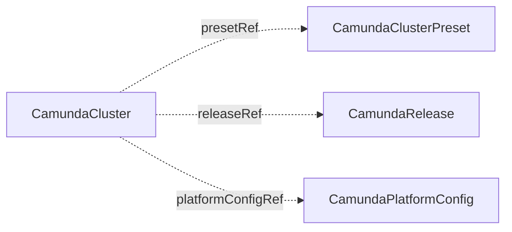

# CamundaClusterPreset

`CamundaClusterPreset` is a cluster-scoped baseline configuration that [CamundaCluster](camundacluster.md) resources inherit. You create it, or another tool creates it for you.

A preset lets a platform team define a standard cluster shape once: sizing, topology, environment variables, and backup policy. Each `CamundaCluster` opts in by name through `presetRef`, so individual clusters stay small and consistent. Typical presets are named for their size, for example `small`, `medium`, and `large`. What runs on that shape, the versions and the pinned images, lives in a [CamundaRelease](camundarelease.md), so a version roll never edits a preset.

A preset is passive data. No controller reconciles it, it creates nothing, and it reports no status. A cluster that fits no preset leaves `presetRef` unset and configures everything inline.

The operator creates no resources from this kind. A `CamundaCluster` that references it reads the preset on every reconcile and merges its own spec over `spec.cluster`. When you edit a preset, every referencing cluster picks up the change on its next reconcile.

The smallest preset sets a broker baseline:

```yaml
apiVersion: core.camunda.io/v1
kind: CamundaClusterPreset
metadata:
  name: small
spec:
  cluster:
    zeebe:
      replicas: 1
      partitions: 1
      replicationFactor: 1
      storageSize: "10Gi"
```



## Merge rules

The cluster starts from `spec.cluster` of the preset. The [CamundaRelease](camundarelease.md) of `releaseRef` merges over it, and the cluster spec merges over both. Each field merges as the table says. The instance-bound fields always come from the cluster.

| Field | Merge behavior |
| --- | --- |
| `auth.clientId`, `auth.audience`, `auth.clientSecretRef`, per-component `mode`, `replicas`, `zeebe.partitions`, `zeebe.replicationFactor`, `zeebe.storageClassName`, `zeebe.storageSize`, `zeebe.persistentVolumeClaimRetentionPolicy`, `connectors.enabled` | The cluster value replaces the preset value. An unset cluster field inherits the preset value. |
| `resources` | Merged per request and limit entry. A cluster entry replaces the matching preset entry. Unset entries inherit. |
| `extraEnv` | Merged by variable name. Preset entries come first, then release entries, then cluster entries. A later layer replaces an entry with the same name. The list carries the same server-side apply semantics as the cluster field, see [CamundaCluster](camundacluster.md#environment-and-jvm). |
| `extraEnvFrom` | Concatenated: preset entries first, then release entries, then cluster entries. |
| `podLabels`, `podAnnotations` | Merged by key. The cluster wins on a conflict. |
| `scheduling` (top-level, per component, and `backup.dump.scheduling`) | Never merged. A block set on the cluster replaces the preset block at that level entirely. |
| `auth.admin` | Never merged. A block set on the cluster replaces the whole preset block, so one manifest names every administrator. |
| `auth.basic` | Never merged. A block set on the cluster replaces the whole preset block. A `passwordRotation` on the preset rotates the admin password of every cluster that inherits it, and each cluster reports its own `status.adminPassword.rotation`. |
| `backup.primaryStorage` | Merged per field. A cluster can change the schedule and keep the retention of the preset. `continuous` is a pointer, so a cluster can set it to `false` while the preset sets it to `true`. |
| `backup.dump` | Follows the component rules above. `scratchVolume` replaces as a whole block. `postgresImage` and `activeDeadlineSeconds` are replaced when the cluster sets them. |
| `platformConfigRef`, `presetRef`, `releaseRef`, `externalUrl`, `serviceAccount`, `storageRef`, `backupStorageRef`, `documentStorageRef`, `monitoring`, `suspend`, `pause` | Instance-bound. They always come from the cluster and are rejected in a preset. |
| `version`, `connectors.version` | Not part of a preset. They belong to a [CamundaRelease](camundarelease.md) or to the cluster, and a preset that sets one is rejected. |

A `CamundaCluster` that names a preset that does not exist reports `Ready: False` with reason `InvalidReference`.

## Storage size

A preset can lower `zeebe.storageSize` freely. A cluster that already applied a larger size keeps its volumes and records the Warning event `StorageShrinkIgnored`.

## Status

A preset reports no status. Reference errors appear on the referencing `CamundaCluster`: a missing preset gives `Ready: False` with reason `InvalidReference`, and an invalid merged spec gives `InvalidReference` with a message that starts with `invalid effective spec:`.

## Spec reference

Every field, with its type, whether it is required, and its default:

```yaml
apiVersion: core.camunda.io/v1
kind: CamundaClusterPreset
metadata:
  # Cluster-scoped: no namespace.
  name: medium
spec:
  # object. Required. The baseline. It has the shape of the CamundaCluster spec without the instance-bound fields. See the CamundaCluster page for every field.
  cluster:
    # object. Optional. OIDC client credential defaults and administrators of referencing clusters. Sits between the platform config and the cluster.
    auth:
      # string. Optional. Default OIDC client ID.
      clientId: "medium-clusters"
      # string. Optional, default: the clientId. Audience that access tokens must carry.
      audience: "medium-clusters"
      # object. Optional. Secret key that holds the default client secret. Each cluster reads the Secret in its own namespace.
      clientSecretRef:
        name: "medium-clusters-oidc-secret"
        key: "client-secret"
      # object. Optional. Default administrators. A cluster that sets its own admin block replaces this block entirely.
      admin:
        clients:
          - "platform-ops"
    # []EnvVar. Optional. Environment variables of every workload. Merged by name, cluster entries win.
    extraEnv:
      - name: TZ
        value: "UTC"
    # []EnvFromSource. Optional. Environment sources of every workload. Preset entries first, then cluster entries.
    extraEnvFrom: []
    # map[string]string. Optional. Labels merged into every workload pod.
    podLabels:
      company.com/team: "automation-ops"
    # map[string]string. Optional. Annotations merged into every workload pod.
    podAnnotations:
      company.com/cluster-preset: "medium"
    # object. Optional. Scheduling constraints of every workload. A cluster that sets its own replaces this block entirely.
    scheduling: {}
    # object. Optional. Backup policy of referencing clusters. Same shape as on the CamundaCluster. backupStorageRef stays on the cluster.
    backup:
      primaryStorage:
        continuous: true
        schedule: "PT1H"
        checkpointInterval: "PT15M"
        retention:
          window: "P7D"
          cleanupSchedule: "PT1H"
    # object. Optional. Broker baseline.
    zeebe:
      # integer. Optional. Number of brokers.
      replicas: 3
      # integer. Optional. Number of partitions.
      partitions: 3
      # integer. Optional. Replication factor.
      replicationFactor: 3
      # object. Optional. CPU and memory.
      resources:
        requests: { cpu: "1", memory: "2Gi" }
      # string. Optional. StorageClass of the broker volumes.
      storageClassName: "ssd"
      # quantity. Optional. Size of the broker volumes. A cluster that applied a larger size keeps it.
      storageSize: "32Gi"
      # object. Optional. What happens to the broker volumes when a referencing cluster is deleted.
      persistentVolumeClaimRetentionPolicy:
        # string (Retain | Delete). Optional, default: Delete.
        whenDeleted: Delete
      # []EnvVar. Optional. Environment variables of the brokers. Merged by name with cluster entries.
      extraEnv:
        - name: JAVA_TOOL_OPTIONS
          value: "-XX:+ExitOnOutOfMemoryError -Xmx4g"
    # object. Optional. Gateway baseline.
    gateway:
      # string (Standalone | Embedded). Optional.
      mode: Standalone
      # integer. Optional. Replicas.
      replicas: 2
      # object. Optional. CPU and memory.
      resources:
        requests: { cpu: "500m", memory: "1Gi" }
    # object. Optional. Operate baseline.
    operate:
      # string (Standalone | Embedded). Optional.
      mode: Embedded
    # object. Optional. Tasklist baseline.
    tasklist:
      # string (Standalone | Embedded). Optional.
      mode: Embedded
    # object. Optional. Admin baseline.
    admin:
      # string (Standalone | Embedded). Optional.
      mode: Embedded
    # object. Optional. Connectors baseline.
    connectors:
      # boolean. Optional. Runs the connectors runtime when true.
      enabled: true
      # integer. Optional. Replicas.
      replicas: 1
      # object. Optional. CPU and memory.
      resources:
        requests: { cpu: "250m", memory: "512Mi" }
```

### Validation rules

- `spec.cluster` is required.
- The instance-bound fields are rejected in `spec.cluster`: `platformConfigRef`, `presetRef`, `releaseRef`, `externalUrl`, `serviceAccount`, `storageRef`, `backupStorageRef`, `documentStorageRef`, `monitoring`, `suspend`, and `pause`. An explicit zero value, for example `suspend: false` or an empty `presetRef`, counts as unset.
- `version` and `connectors.version` are rejected in `spec.cluster`. They belong to a [CamundaRelease](camundarelease.md) or to the cluster.
- The fields of `spec.cluster` obey the same schema rules as on a `CamundaCluster`: `whenDeleted` is `Delete` or `Retain`, and the backup durations are ISO 8601 days and time.
- The transition rules of a `CamundaCluster` do not bind a preset: a preset can lower `zeebe.storageSize`. A referencing cluster keeps its applied volumes.
- There is no cross-resource validation. The referencing cluster reports a problem with the merged spec.

### A production-shaped example

```yaml
apiVersion: core.camunda.io/v1
kind: CamundaClusterPreset
metadata:
  name: medium
spec:
  cluster:
    podLabels:
      company.com/team: "automation-ops"
    podAnnotations:
      company.com/cluster-preset: "medium"
    zeebe:
      replicas: 3
      partitions: 3
      replicationFactor: 3
      resources:
        requests: { cpu: "1", memory: "2Gi" }
        limits: { cpu: "2", memory: "4Gi" }
      storageClassName: "ssd"
      storageSize: "32Gi"
      extraEnv:
        - name: JAVA_TOOL_OPTIONS
          value: "-XX:+ExitOnOutOfMemoryError -Xmx4g"
    gateway:
      mode: Standalone
      replicas: 2
      resources:
        requests: { cpu: "500m", memory: "1Gi" }
    connectors:
      enabled: true
      replicas: 1
      resources:
        requests: { cpu: "250m", memory: "512Mi" }
```

## Related

- [CamundaCluster](camundacluster.md): references this resource through `presetRef` and merges its own spec over the baseline.
- [CamundaRelease](camundarelease.md): the versions and the pinned images that run on this shape. It merges between the preset and the cluster.
- [CamundaPlatformConfig](camundaplatformconfig.md): the `auth` baseline of a preset sits between the defaults of the platform config and the `auth` block of a cluster.
- [Getting started](../getting-started.md): a preset is optional in the first setup.
- [Operations guide](../guides/operations.md): how to resize a fleet of clusters through a preset.
