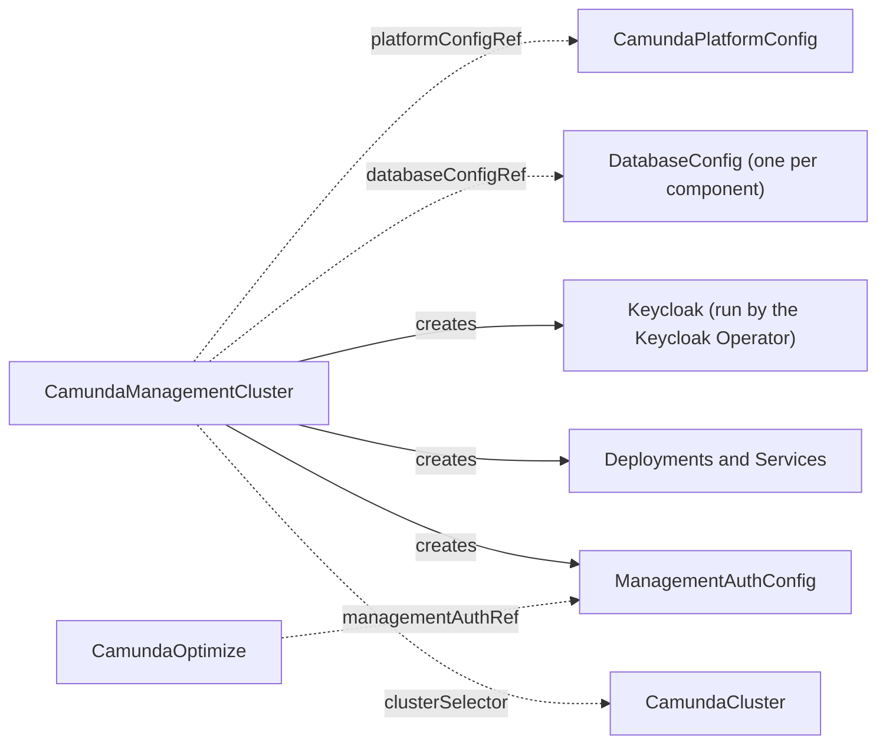

# CamundaManagementCluster

A `CamundaManagementCluster` is one Camunda management plane: Management Identity, the identity provider behind it, and optionally Console and Web Modeler. Management Identity controls who signs in to Console, Web Modeler, and Optimize. It is a separate identity system from the one inside an orchestration cluster, which Camunda describes in [Management Identity](https://docs.camunda.io/docs/self-managed/components/management-identity/overview/).

You create one management plane per platform. It serves the orchestration clusters that `spec.clusterSelector` matches, in every namespace that `spec.namespaceSelector` admits (every namespace, unless you set one). Creating this resource is a platform-administrator action, because the selector reaches [CamundaClusters](camundacluster.md) outside its own namespace and the operator annotates the ones it matches.

The smallest management plane names a platform configuration, an identity provider, and Management Identity:

```yaml
apiVersion: core.camunda.io/v1
kind: CamundaManagementCluster
metadata:
  name: my-management
  namespace: my-management-ns
spec:
  platformConfigRef: "my-platform-config"
  identityProvider:
    keycloak:
      version: "26.6.4"
      externalUrl: "https://camunda.example.com/auth"
      databaseConfigRef: "my-keycloak-db"
  identity:
    version: "8.9.0"
    externalUrl: "https://identity.camunda.example.com"
    databaseConfigRef: "my-identity-db"
    admin:
      username: "admin"
      email: "admin@example.com"
```



## What you get

The operator creates these Deployments in the namespace of the resource, and one Service of the same name in front of each:

| Deployment and Service | What it does | Deployed when |
| --- | --- | --- |
| `my-management-identity` | Management Identity. Console, Web Modeler, and Optimize authenticate through it. | Always. |
| `my-management-console` | Console. | `spec.console` is set. |
| `my-management-web-modeler-restapi` | The Web Modeler application and its API. | `spec.webModeler` is set. |
| `my-management-web-modeler-websockets` | The Web Modeler process that pushes live updates to a browser. | `spec.webModeler` is set. |

In the `keycloak` mode the operator also creates a `Keycloak` resource named `my-management-keycloak`. The Keycloak Operator turns it into pods and into the Service `my-management-keycloak-service`.

There is no block that turns a component on. Console runs while `spec.console` is set. Web Modeler runs while `spec.webModeler` is set. Remove the block to remove the workloads.

A long resource name is shortened in the derived names and in the owner label, so read both back instead of assuming them.

The operator creates no Ingress. You route traffic to each Service yourself, and the `externalUrl` fields tell each component the address a browser reaches it at.

Read the names back with `kubectl get deploy,svc -n my-management-ns -l camunda.io/management-cluster=my-management`.

## Identity provider

`spec.identityProvider` selects where people authenticate. Set exactly one of the three blocks. The choice decides who creates the clients of the management plane, and where the first administrator comes from.

### The operator runs Keycloak

`identityProvider.keycloak` runs Keycloak through the [Keycloak Operator](https://www.keycloak.org/operator/installation), which you install first (see [Installation](../installation.md#requirements)). Management Identity then creates the realm `camunda-platform`, the client of every component, and the first user in it.

```yaml
apiVersion: core.camunda.io/v1
kind: CamundaManagementCluster
metadata:
  name: my-management
  namespace: my-management-ns
spec:
  identityProvider:
    keycloak:
      version: "26.6.4"
      externalUrl: "https://camunda.example.com/auth"
      databaseConfigRef: "my-keycloak-db"
      replicas: 2
  # ... the rest of your management cluster
```

`externalUrl` is the address a browser reaches Keycloak at, and it must carry the `/auth` path. Camunda publishes its Keycloak build under that path, and every token that the realm issues names this URL as its issuer. The Identity pods must reach it too. The operator appends `/realms/<realm>` to this URL, so it must carry no query and no fragment.

`version` is the Keycloak version. The operator supports `26.0.0` and later, and below `27.0.0`. Camunda 8.9 supports Keycloak 26 only, as its [supported environments](https://docs.camunda.io/docs/reference/supported-environments/) page states.

Stay below `26.7.0` with Management Identity 8.9. From 26.7.0, Keycloak refuses every change to its `realm-management` client (the fix of [CVE-2026-9796](https://github.com/keycloak/keycloak/pull/49624)). Management Identity 8.9 changes that client when it creates the realm, so it stops with `HTTP 403 Forbidden` and `IdentityReady` never leaves `Creating`. Install the Keycloak Operator of the same release as `version`. The [Keycloak Operator](https://www.keycloak.org/operator/customizing-keycloak) supports the Keycloak it was released with.

Keycloak needs a PostgreSQL database of its own. `databaseConfigRef` names a [DatabaseConfig](databaseconfig.md) in the namespace of this resource.

`scheduling` places the Keycloak pods: `nodeAffinity`, `podAffinity`, and `tolerations`, the same block every other workload of this resource takes.

The Keycloak Operator writes the first Keycloak administrator into the Secret `my-management-keycloak-initial-admin`. Management Identity signs in with it to create the realm.

### You run Keycloak

`identityProvider.externalKeycloak` connects Management Identity to a Keycloak that you run. Management Identity still creates the realm, the clients, and the first user in it. Run Keycloak 26, below 26.7.0, for the reason the [section above](#the-operator-runs-keycloak) gives.

```yaml
apiVersion: core.camunda.io/v1
kind: CamundaManagementCluster
metadata:
  name: my-management
  namespace: my-management-ns
spec:
  identityProvider:
    externalKeycloak:
      url: "https://keycloak.example.com/auth"
      realm: "camunda-platform"
      adminCredentialsSecretRef:
        name: "my-keycloak-admin"
        usernameKey: "username"
        passwordKey: "password"
  # ... the rest of your management cluster
```

`url` serves browsers and containers alike, so it must resolve from inside the Kubernetes cluster. If your Keycloak serves under the `/auth` path, include that path. The operator appends `/realms/<realm>` to this URL, so it must carry no query and no fragment.

`realm` defaults to `camunda-platform`. The realm lands in the issuer, the token, and the JWKS path that Management Identity builds. It holds letters, digits, dots, hyphens, and underscores only, and it starts and ends with a letter or a digit.

`adminCredentialsSecretRef` names the Keycloak administrator that Management Identity bootstraps the realm with. The Secret lives in the namespace of this resource.

#### One realm answers to one management plane

The first `CamundaManagementCluster` that names a realm holds it. Management Identity administers the clients of that realm, and the plane owns the login callbacks of its `optimize` client, so a second plane on the same realm would undo both.

A second plane that names the same `url` and `realm` waits, from any namespace. It starts nothing new, touches nothing in that realm, and `Ready` names the holder:

```yaml
status:
  conditions:
    - type: Ready
      status: "False"
      reason: RealmClaimedElsewhere
      message: 'CamundaManagementCluster my-management-ns/my-management holds realm "camunda-platform" of Keycloak "https://keycloak.example.com/auth". One realm answers to one management plane, so this one waits and starts nothing new until that claim is released. Give it a realm of its own, or delete the holder'
```

Give the waiting plane a realm of its own, or delete the holder. The waiting plane then proceeds on its own. A holder releases a realm when it is deleted, and when its spec moves to another realm or another mode, once the login callbacks have left it. Two planes on one Keycloak with two realms work today.

A plane that you retarget into the wait keeps the workloads it already ran, and they keep pointing at the realm they were rendered for. The plane also keeps its claim on that realm while its Management Identity points at it, so no other plane takes a realm that this one starts against again. The claim goes when nothing of the plane points there any more: correct the spec of the waiting plane and its Management Identity moves to the new realm, or delete the plane and it gives back every realm it holds.

#### Trust of an https Keycloak

The operator signs in to Keycloak itself, to register the login callback of every Optimize this management plane serves. It trusts the certificate authorities of its own image, which are the public ones. A Keycloak whose certificate comes from an authority of your own therefore fails the handshake, and `OptimizeCallbacksReady` reads `ConnectionFailed`.

`caBundleSecretRef` names the key of a Secret that holds that authority, in PEM form. The operator then trusts it in addition to the authorities of its image:

```yaml
apiVersion: core.camunda.io/v1
kind: CamundaManagementCluster
metadata:
  name: my-management
  namespace: my-management-ns
spec:
  identityProvider:
    externalKeycloak:
      url: "https://keycloak.example.com/auth"
      adminCredentialsSecretRef:
        name: "my-keycloak-admin"
      caBundleSecretRef:
        name: "my-keycloak-ca"
        key: "ca.crt"
  # ... the rest of your management cluster
```

The Secret lives in the namespace of this resource. A key that holds no certificate in PEM form reports `InvalidCABundle`. A Secret that does not exist reports `MissingSecret`. The operator reads the Secret again when it changes, so a rotated authority needs no restart.

The field is only valid with an `https` url, because the operator makes no handshake with an `http` one. In the `keycloak` mode the operator reaches the Keycloak it runs through the in-cluster Service, over `http`, so that mode carries no such field.

The field changes what the operator trusts. It does not reach the pods of Management Identity, Console, or Web Modeler.

### Your own OIDC provider

`identityProvider.oidc` connects Management Identity to the identity provider of the referenced [CamundaPlatformConfig](camundaplatformconfig.md). Nothing is created for you here. You register one application per component at your provider, and the platform config names them.

```yaml
apiVersion: core.camunda.io/v1
kind: CamundaManagementCluster
metadata:
  name: my-management
  namespace: my-management-ns
spec:
  platformConfigRef: "my-platform-config"
  identityProvider:
    oidc: {}
  identity:
    version: "8.9.0"
    externalUrl: "https://identity.camunda.example.com"
    databaseConfigRef: "my-identity-db"
    admin:
      claimName: "oid"
      claimValue: "8f1c...e2"
  # ... the rest of your management cluster
```

The platform config must set `spec.auth.method: oidc`, and it must carry `authUrl`, `tokenUrl`, and `jwksUrl` under `spec.auth.oidc`. Those three are optional for an orchestration cluster, which reads them from the discovery document of your provider. The [ManagementAuthConfig](managementauthconfig.md) carries all three, and the operator asks your provider for nothing. Read them from the discovery document and set them on the platform config.

`spec.externalUrl` on a [CamundaOptimize](camundaoptimize.md) has no effect in this mode. The platform config declares the Optimize client, and your provider holds its callback URLs.

The redirect URI of each component is the one Camunda documents in [component-specific configuration](https://docs.camunda.io/docs/self-managed/components/management-identity/configuration/connect-to-an-oidc-provider/#component-specific-configuration). Register it at your provider before the component starts.

### The generated Secrets

In the two Keycloak modes the operator generates the credentials that Management Identity gives to the Optimize client and to the first user:

| Secret | Key | What it holds |
| --- | --- | --- |
| `my-management-optimize-client` | `client-secret` | The client secret of Optimize. The `ManagementAuthConfig` points at this Secret. |
| `my-management-identity-admin` | `password` | The password of the first Keycloak user. Absent while `spec.identity.admin.passwordSecretRef` names a Secret of your own. |

Delete `my-management-optimize-client` to rotate that client secret. The operator generates a new value, writes it back, and rolls the pods that read it. There is no Secret for the client of Management Identity itself. Management Identity creates its `camunda-identity` client in the realm and gives it a new secret on every start, and nothing outside Management Identity needs that secret.

> **Caution:** Do not delete `my-management-identity-admin`. Management Identity sets that password on the Keycloak user once, on its first start, and never reads it again. A deleted Secret comes back with a new password that the Keycloak user does not hold. Only a password reset in Keycloak recovers the account. To rotate the password, change it in Keycloak.

The `oidc` mode generates none of these. Your provider issues every client secret, and the platform config names it.

## Management Identity

Management Identity is always deployed. `spec.identity` sets its version, the address a browser reaches it at, its database, and its first administrator.

```yaml
apiVersion: core.camunda.io/v1
kind: CamundaManagementCluster
metadata:
  name: my-management
  namespace: my-management-ns
spec:
  identity:
    version: "8.9.0"
    externalUrl: "https://identity.camunda.example.com"
    databaseConfigRef: "my-identity-db"
    admin:
      username: "admin"
      email: "admin@example.com"
    replicas: 2
    resources:
      requests:
        cpu: "250m"
        memory: 512Mi
  # ... the rest of your management cluster
```

`spec.identity.version` is the Management Identity version. The operator supports `8.9.0` and later.

Management Identity needs a PostgreSQL database of its own. Each component that opens a database owns every table in it, so Management Identity, Keycloak, and Web Modeler must each name a different [DatabaseConfig](databaseconfig.md).

### The first administrator

`spec.identity.admin` names the person who signs in first and grants the rest. Management Identity reads it on its first start only and stores the result in its database.

In the two Keycloak modes, set `username`. Management Identity creates that Keycloak user. If you also set `spec.webModeler`, `email` is required. Web Modeler needs an address for every person who signs in, and the API server refuses the resource without one. `passwordSecretRef` names a password of your own. Without it the operator generates one into `my-management-identity-admin`.

A later change to `username` does not rename the first user. Management Identity creates a second one, and the first one keeps its access.

In the `oidc` mode, set `claimName` and `claimValue` instead. They name the token claim that identifies the administrator, for example `oid` or `sub`. The operator records the pair as `<claimName>=<claimValue>`, so `claimName` holds no equals sign. This pair is fixed once Management Identity has started. A later change reports `IdentityReady` and `Ready` with reason `ImmutableAfterStart`, and the message names the recorded value and the value you asked for:

```yaml
status:
  conditions:
    - type: IdentityReady
      status: "False"
      reason: ImmutableAfterStart
      message: 'Management Identity started with the administrator claim "oid=8f1c...e2" and stores it in its database; spec.identity.admin now asks for "oid=41ab...77", which only a change in the database can do'
    - type: Ready
      status: "False"
      reason: ImmutableAfterStart
      message: 'management-identity: Management Identity started with the administrator claim "oid=8f1c...e2" and stores it in its database; spec.identity.admin now asks for "oid=41ab...77", which only a change in the database can do'
```

There are two ways out, and the operator cannot do either for you.

The recorded administrator is a real person. Put the recorded value back on `spec.identity.admin`. Sign in as that person, and grant the rest in the Management Identity user interface.

Nobody holds the recorded claim, so nobody can sign in. The operator records the claim that Management Identity started with in the annotation `camunda.io/identity-initial-claim` on this resource, and renders that recorded value from then on. Put the claim you want on the annotation:

```bash
kubectl annotate --overwrite camundamanagementcluster my-management -n my-management-ns \
  camunda.io/identity-initial-claim=oid=41ab...77
```

The operator renders what the annotation records, so that claim reaches Management Identity on its next start. Set the annotation to the pair that `spec.identity.admin` names, and both conditions clear. Management Identity itself reads the claim on its first start only, so the administrator in its own database has to change as well. Camunda names the values in [OIDC configuration](https://docs.camunda.io/docs/self-managed/components/management-identity/miscellaneous/configuration-variables/#oidc-configuration).

An empty database does the same. Point `spec.identity.databaseConfigRef` at one, and Management Identity starts over. It then loses the roles and the tenants it held. Your identity provider keeps every user and client, because they never lived in that database.

Get the pair right before the first start, and the question does not arise.

## Console

Console shows every orchestration cluster of the platform in one place, as Camunda describes in [Console on Self-Managed](https://docs.camunda.io/docs/self-managed/components/console/overview/). Set `spec.console` to deploy it.

```yaml
apiVersion: core.camunda.io/v1
kind: CamundaManagementCluster
metadata:
  name: my-management
  namespace: my-management-ns
spec:
  console:
    version: "8.9.0"
    externalUrl: "https://console.camunda.example.com"
  # ... the rest of your management cluster
```

A cluster appears in Console once it reports to Console. The operator adds four entries to `spec.extraEnv` of every attached cluster, so you add nothing to a cluster yourself:

```yaml
apiVersion: core.camunda.io/v1
kind: CamundaCluster
metadata:
  name: my-cluster
  namespace: my-cluster-ns
spec:
  extraEnv:
    - name: CAMUNDA_CONSOLE_PING_ENABLED
      value: "true"
    - name: CAMUNDA_CONSOLE_PING_ENDPOINT
      value: http://my-management-console.my-management-ns.svc:80
    - name: CAMUNDA_CONSOLE_PING_CLUSTERNAME
      value: my-cluster
    - name: CAMUNDA_CONSOLE_PING_PINGPERIOD
      value: 1h
  # ... the rest of your cluster
```

The endpoint is the Console Service, reached from inside the Kubernetes cluster. Console therefore needs no Ingress for a cluster to report to it. Camunda documents what the entries mean in [Console ping configuration](https://docs.camunda.io/docs/self-managed/components/orchestration-cluster/zeebe/configuration/broker-config/#console-ping-configuration).

The operator owns these four names and replaces what you set under them. An entry that sets `valueFrom` under one of them cannot hold the operator's `value` too. The operator removes that entry and records the Warning event `ConsolePingEntryRemoved`. The event names every field manager that owns the `valueFrom` of the entry, when `metadata.managedFields` holds one. It removes the four entries again when the cluster leaves `spec.clusterSelector`, when you remove `spec.console`, or when you delete this resource. See [Management plane](camundacluster.md#management-plane) on the cluster page.

Camunda 8.10 renamed Console to Hub and the ping settings with it, and it expects machine-to-machine credentials under the ping. The [8.10 chart README](https://github.com/camunda/camunda-platform-helm/blob/main/charts/camunda-platform-8.10/README.md) lists those settings. A cluster of version 8.10 or later gets the four `CAMUNDA_HUB_PING_*` names instead. The management plane issues no credentials yet, so such a cluster logs a validation error and reports to nobody.

Camunda marks cluster discovery in Console experimental in 8.9. It is documented under [experimental features](https://docs.camunda.io/docs/self-managed/components/console/configuration/#experimental-features).

## Web Modeler

Web Modeler runs as two processes: the application and its API, and a second process that pushes live updates to a browser. Set `spec.webModeler` to deploy both.

```yaml
apiVersion: core.camunda.io/v1
kind: CamundaManagementCluster
metadata:
  name: my-management
  namespace: my-management-ns
spec:
  webModeler:
    version: "8.9.0"
    externalUrl: "https://modeler.camunda.example.com"
    websocketsExternalUrl: "https://modeler.camunda.example.com/ws"
    databaseConfigRef: "my-web-modeler-db"
    mail:
      smtpHost: "smtp.example.com"
      smtpPort: 587
      fromAddress: "noreply@example.com"
      fromName: "Camunda"
      credentialsSecretRef:
        name: "my-smtp-credentials"
        usernameKey: "username"
        passwordKey: "password"
  # ... the rest of your management cluster
```

Route `externalUrl` to `my-management-web-modeler-restapi` and `websocketsExternalUrl` to `my-management-web-modeler-websockets`. A browser opens both, so both must be reachable from outside the Kubernetes cluster.

Web Modeler needs an SMTP server and does not start without one. Camunda states this in [Web Modeler configuration](https://docs.camunda.io/docs/self-managed/components/modeler/web-modeler/configuration/). Leave `credentialsSecretRef` unset for a server that needs no credentials.

Web Modeler needs a PostgreSQL database of its own, named by `databaseConfigRef`.

The two processes authenticate to each other with credentials that the operator generates into the Secret `my-management-web-modeler-pusher`. Delete that Secret to rotate them. Both processes then roll together.

### Deploying to a cluster

Web Modeler lists every attached orchestration cluster in its deploy dialog. The operator fills the list, so you name no cluster here.

How Web Modeler authenticates against a cluster follows the authentication method of that cluster:

- An OIDC cluster takes the token of the person who is signed in. Nothing else is needed.
- A basic-auth cluster asks the person for a user name and a password in the deploy dialog. No setting of Web Modeler carries them.

For every attached basic-auth cluster, the operator creates the user `web-modeler` on that cluster. That user name is reserved on every attached basic-auth cluster: a user of that name that already exists there gets the password of the operator, and the operator removes it when the cluster leaves the management plane. Do not create a `web-modeler` user of your own on those clusters. It publishes the password of that user in a Secret of the management namespace, named `my-management-web-modeler-cluster-<uid>`. The `<uid>` is the first eight characters of the UID of the `CamundaCluster`. The user holds only the permissions that deploying and starting a process needs.

Read the password and give it to the people who deploy from Web Modeler. Each Secret carries the name and the namespace of its cluster as labels, so select the one cluster you are after:

```bash
kubectl get secret -n my-management-ns \
  -l camunda.io/component=web-modeler-cluster-user,camunda.io/cluster=my-cluster,camunda.io/cluster-namespace=my-cluster-ns \
  -o custom-columns='SECRET:.metadata.name,PASSWORD:.data.password'
```

Drop the two cluster labels from the selector to list every cluster's Secret.

Every value is base64 encoded. The key `applied` next to the password means that the cluster took the user under that password. A Secret without it is a password that never reached the cluster.

A cluster that refuses the call keeps its row in `status.clusters` with the reason `BasicAuthUserFailed`. The management plane still serves the cluster, and Web Modeler still lists it. Only the user is missing.

### Repair of the cluster user

The operator reads every attached basic-auth cluster again and repairs the user there. It repairs two things:

- A user that somebody removed on the cluster. It comes back with the password that the Secret publishes.
- A permission that somebody revoked. The operator grants only the permissions that are missing, so it does not add a second row of a permission the user already holds.

The operator does not repair these:

- A password that somebody changed on the cluster. No API gives a password back, so the operator cannot see the change. Delete the Secret to publish a new password and set it on the cluster.
- The name and the email address of the user. They are yours to change.
- A `web-modeler` user on a cluster that this management plane does not serve.

One cluster is read at most once every 10 minutes, so a repair takes up to that long. The row of a cluster that refused the repair reports the reason `BasicAuthUserFailed`.

### Withdrawal of the cluster user

A cluster that leaves the management plane loses the user, and the Secret that published its password goes with it. The cluster leaves when it leaves `spec.clusterSelector` or the namespace bound, when you remove `spec.webModeler`, or when you delete the cluster.

A cluster that stopped accepting basic credentials keeps the user. Nothing signs in with it there, and the cluster no longer publishes the administrator credential that a removal needs. A cluster whose `spec.platformConfigRef` names no `CamundaPlatformConfig` counts the same: the operator cannot read how it authenticates, and a removal that fails there would hold the cluster forever. In both cases the operator deletes the Secret, records the event `WebModelerUserLeftBehind` on the `CamundaManagementCluster` with the reason, and lets the cluster go. Remove that user yourself if you do not want it there.

## Clusters

`spec.clusterSelector` selects the orchestration clusters that Console lists and Web Modeler deploys to. It follows the Kubernetes label selector convention:

- Unset selects no cluster.
- `{}` selects every `CamundaCluster` of the Kubernetes cluster, in every namespace.
- A selector with terms selects the clusters whose labels match.

`spec.namespaceSelector` narrows the search to the namespaces whose labels match, the way the `namespaceSelector` of an admission webhook does. Unset or `{}` puts no bound on the namespace. It selects on the labels of the `Namespace` objects, so label the namespaces, not the clusters:

```yaml
apiVersion: core.camunda.io/v1
kind: CamundaManagementCluster
metadata:
  name: my-management
  namespace: my-management-ns
spec:
  clusterSelector:
    matchLabels:
      environment: production
  namespaceSelector:
    matchLabels:
      team: payments
  # ... the rest of your management cluster
```

A cluster whose namespace leaves the bound is deselected like one that leaves `clusterSelector`: the claim, the Console settings, and the Web Modeler user go by themselves.

### An OIDC cluster must name the same issuer

Console and Web Modeler call an OIDC cluster with the token of the person who is signed in. The identity provider of the management plane issues that token. A cluster that validates the tokens of another issuer refuses every such call.

A selected OIDC cluster is therefore attached only while it names the issuer of this management plane. The cluster names it in `spec.auth.oidc.issuerUrl`, on the [CamundaPlatformConfig](camundaplatformconfig.md) that the `spec.platformConfigRef` of that cluster points at.

The issuer of the management plane follows from the `spec.identityProvider` block of this resource:

| `spec.identityProvider` | The issuer of the management plane |
| --- | --- |
| `keycloak` | `<keycloak.externalUrl>/realms/camunda-platform`. The in-cluster address `http://my-management-keycloak-service.my-management-ns.svc:8080/auth/realms/camunda-platform` names the same Keycloak realm, and it is accepted too. |
| `externalKeycloak` | `<externalKeycloak.url>/realms/<externalKeycloak.realm>` |
| `oidc` | `spec.auth.oidc.issuerUrl` of the platform config that the `spec.platformConfigRef` of **this** resource names |

Two issuer URLs name the same issuer when they differ only in one of these:

- the case of the scheme, such as `HTTPS://` against `https://`
- the case of the host, such as `LOGIN.Example.com` against `login.example.com`
- a trailing slash

A different port names a different issuer, and so does a different path.

A cluster on another issuer gets `attached: false` with the reason `InvalidReference`. The message names both issuers. Console does not list that cluster, and Web Modeler does not deploy to it. The cluster itself keeps running. It keeps the `camunda.io/management-cluster` annotation while the selector matches it, and the operator removes its `CAMUNDA_CONSOLE_PING_*` entries.

A basic-auth cluster has no such rule. Web Modeler signs in to it with the `web-modeler` user that the operator creates there.

`status.clusters` lists one row per selected cluster and says whether the management plane serves it:

```yaml
status:
  clusters:
    - name: my-cluster
      namespace: my-cluster-ns
      attached: true
    - name: my-other-cluster
      namespace: my-other-ns
      attached: false
      reason: NotReady
      message: The cluster publishes no gateway endpoints yet
```

| Reason | Meaning | What to do |
| --- | --- | --- |
| (empty, `attached: true`) | Console lists the cluster and Web Modeler deploys to it. | Nothing. |
| `NotReady` | The cluster publishes no `status.gateway` yet, or it changed while the operator claimed it. | Wait. The row clears when the cluster settles. |
| `ClaimedElsewhere` | Another management plane already serves this cluster. The message names it. | One cluster answers to one management plane. Remove the cluster from one of the two selectors. |
| `InvalidReference` | The `platformConfigRef` of the cluster does not resolve, or the cluster authenticates with `oidc` on another issuer than the management plane. The message says which. | Create the named `CamundaPlatformConfig`, correct the reference on the cluster, or point the cluster at the issuer of the management plane. |
| `WriteFailed` | The Console settings could not be written on the cluster. | Read the message. The operator tries again. |
| `BasicAuthUserFailed` | The Web Modeler user could not be created on this basic-auth cluster. `attached` stays true. | Read the message. It usually names a missing administrator Secret or a cluster that does not answer. |

An attached cluster carries the annotation `camunda.io/management-cluster`, whose value is `my-management-ns/my-management`. It is how one management plane tells its clusters from the clusters of another. The operator removes the annotation when the cluster leaves the selector, and when you delete this resource.

## Optimize

This resource deploys no Optimize. [CamundaOptimize](camundaoptimize.md) is its own resource, and one management plane serves as many of them as you run.

In the two Keycloak modes, give each `CamundaOptimize` the address a browser reaches it at. The management plane registers the login callback under that address on the `optimize` client of the realm, so a person who signs in there comes back there:

```yaml
apiVersion: core.camunda.io/v1
kind: CamundaOptimize
metadata:
  name: my-cluster-optimize
  namespace: my-cluster-ns
spec:
  managementAuthRef: "my-management"
  externalUrl: "https://optimize.camunda.example.com"
  # ... the rest of your Optimize
```

An Optimize that names no address gets no callback from this management plane. Keycloak then refuses the return of a sign-in, unless somebody put that callback in the realm by hand.

`status.optimize` lists what this management plane found, ordered by namespace and name. It is what the plane will register, not what the realm carries; the condition below reports that:

```yaml
status:
  optimize:
    - namespace: my-cluster-ns
      name: my-cluster-optimize
      externalUrl: "https://optimize.camunda.example.com"
```

The `OptimizeCallbacksReady` condition reports the realm. It reads `Healthy` while the `optimize` client carries the callback of every row above and the first administrator holds the `Optimize` role. See [Status](#status).

The operator owns the login callbacks of the addresses above and nothing else on that client. It adds the ones that are missing and removes the ones of an Optimize that went away. A redirect URI of another shape stays where it is. A login callback you register by hand does not: it has the shape the operator owns, so the next reconcile that converges the realm removes it. Give the Optimize a `spec.externalUrl` instead.

Management Identity restarts when the first Optimize of a management plane arrives and when the last one goes. Adding or removing an Optimize while another one stays leaves it running. The addresses live in the ConfigMap `my-management-identity-optimize-urls`, which the Identity pods read the list from, so a change to the list does not restart them. Those two moments are where Management Identity starts and stops creating the Optimize client at all, so a plane that empties and fills again restarts at each one.

The operator waits for Management Identity to finish rolling out before it writes to the realm, because Management Identity writes the whole client while it starts.

The first Optimize of a management plane brings the `Optimize` role into the realm with it. Management Identity gives the roles of the realm to the first administrator on its very first start and never again, so an administrator who was there before that first Optimize does not hold the role. The management plane gives it to them: every time it converges the realm, it reads the user that `spec.identity.admin.username` names and adds the `Optimize` role when that user does not hold it. A role you take away in Keycloak comes back on the next converge.

A role that the administrator holds through a group of the realm counts as held, so a group that carries the `Optimize` role keeps carrying it and the management plane writes nothing.

This is the only role and the only user the management plane touches. Every other role of that administrator, and every other user of the realm, stays yours to manage in Management Identity. `OptimizeCallbacksReady` reads `AdminRoleGrantFailed` when the realm holds no user of that name, when it holds no `Optimize` role, or when Keycloak refused the grant. See [Status](#status).

Deleting this resource removes those callbacks from the realm that `status.callbackRealm` names. While that field is absent, the realm of the spec loses them. The removal happens only when this management plane holds the `ManagementAuthConfig` it names. A Keycloak that does not answer at that moment keeps them, and the deletion goes through anyway, so the orchestration clusters this plane holds are always freed.

This resource carries no Optimize address of its own. Every address comes from a `CamundaOptimize`, and the management plane owns the whole login callback list of the `optimize` client.

An Optimize that this operator does not run therefore cannot sign in through this management plane in a Keycloak mode. Registering its callback by hand does not last: the next reconcile that converges the realm removes it. Give that Optimize a realm of its own, or run it as a `CamundaOptimize`.

One realm answers to one management plane. A second plane that names the same `url` and `realm` waits with the `Ready` reason `RealmClaimedElsewhere` and touches nothing in the realm. See [One realm answers to one management plane](#one-realm-answers-to-one-management-plane).

There is one window where a callback added by hand survives. While `OptimizeCallbacksReady` reads `NoCallbacks`, no Optimize behind this management plane names an address, and the plane stops reading the realm. A callback added in that state stays and works until the first `CamundaOptimize` with a `spec.externalUrl` appears, and the reconcile that finds it removes the callback again. Do not build on that window.

The `oidc` mode registers nothing. Your provider holds the callback URLs, so `spec.externalUrl` is out of use there and `OptimizeCallbacksReady` reads `Disabled`. One application at your provider serves every Optimize of the management plane, so add the callback of each one to that application yourself.

### Moving the callbacks to another realm

When `spec.identityProvider` starts naming another Keycloak, another `realm`, or the `oidc` mode, the login callbacks leave the realm they were in. On a move from one Keycloak to another, a plane that serves an Optimize empties the old realm before it registers them in the new one. A move to the `oidc` mode and a plane that serves no Optimize register nothing in a realm, so neither waits. `status.callbackRealm` names the realm the plane last pointed Management Identity at. Identity registers the callbacks there while it starts, so the field appears with the realm and not with the first registration. During a move it keeps naming the old realm until the callbacks have left it, and after that until nothing is left that could write them back:

```yaml
status:
  callbackRealm:
    url: "https://keycloak.example.com/auth"
    realm: "camunda-platform"
    adminCredentialsSecretRef:
      name: "my-keycloak-admin"
      usernameKey: "username"
      passwordKey: "password"
```

`status.callbackRealm` also keeps naming the old realm until every Management Identity pod of the old configuration is gone. A move restarts Management Identity once, and nobody signs in between the stop and the start.

Keep the Secret that `adminCredentialsSecretRef` names there, and the Secret of `caBundleSecretRef` when the old Keycloak needed one, until `status.callbackRealm` stops naming the old realm. The operator signs in to the old Keycloak with them one last time. The record is the completion signal of a move, because the condition ends at `Healthy`, `Disabled`, or `NoCallbacks`, whichever the new mode reaches.

A move to the `oidc` mode empties the old realm the same way. `status.callbackRealm` then goes, and `OptimizeCallbacksReady` reads `Disabled`.

The old realm never waits for the new one. The callbacks leave it even while the new identity provider cannot be used yet, for example while its administrator Secret is missing or its Keycloak does not answer Management Identity.

The field is absent once a move into the `keycloak` mode is over. The operator runs that Keycloak, so its realm is never recorded. A move into it from a Keycloak that you ran keeps naming the old realm until that realm is empty and nothing of it can write again. A move away from the `keycloak` mode deletes the Keycloak that the operator runs, and the database of that Keycloak keeps the realm as it was.

On a move from one Keycloak to another, an old Keycloak that does not let go keeps the whole plane: the workloads stay on the old Keycloak, the new realm gets nothing, and everybody keeps signing in through the old one. `OptimizeCallbacksReady` reads `ConnectionFailed`, `WriteFailed`, `MissingSecret`, or `InvalidCABundle`, the message names the old realm, and `Ready` reads the same reason. On a move to the `oidc` mode the plane moves at once and only `OptimizeCallbacksReady` reports the failure, because Management Identity registers nothing in a realm there. The operator keeps trying to empty the old realm:

```yaml
status:
  conditions:
    - type: OptimizeCallbacksReady
      status: "False"
      reason: ConnectionFailed
      message: 'Realm "camunda-platform" of Keycloak "https://old-keycloak.example.com/auth" still carries the login callbacks of this management plane, and this operator could not remove them: signing in at Keycloak: Post "https://old-keycloak.example.com/auth/realms/master/protocol/openid-connect/token": dial tcp: connection refused. If that Keycloak is gone for good, set the annotation camunda.io/forget-callback-realm="https://old-keycloak.example.com/auth/realms/camunda-platform" on this resource to leave them there'
```

A plane that serves no Optimize is not held. It fills no realm, so the workloads move at once, `Ready` stays with them, and only `OptimizeCallbacksReady` keeps naming the realm still to be emptied.

If the old Keycloak is gone for good, set the annotation that the message names, with the exact value it prints. A Keycloak that never answered takes the same route. `status.callbackRealm` names the realm from the moment the plane points Management Identity at it, so a `url` with a typo in it is a realm to let go of, and the corrected `url` is a move away from it. The value is the old realm, as `<url>/realms/<realm>`, and a spelling that differs only in the case of the host, a default port, or a trailing slash matches too:

```bash
kubectl annotate camundamanagementcluster my-management -n my-management-ns \
  camunda.io/forget-callback-realm="https://old-keycloak.example.com/auth/realms/camunda-platform"
```

The management plane then lets go of the old realm, records the Warning event `OptimizeCallbacksLeftBehind`, and removes the annotation. The move goes on from there. The plane registers the callbacks in the new realm when the new mode holds one and the plane serves an Optimize. A move to the `oidc` mode registers none, and `OptimizeCallbacksReady` reads `Disabled`. The callbacks stay in the old realm. This plane holds the old realm until the withdrawal removes the callbacks, or until this annotation tells the operator to leave them there. Only then can another management plane claim it. If that Keycloak comes back, remove them from its `optimize` client yourself. The annotation lets go of the realm it names and of no other. One that names another realm than `status.callbackRealm` is removed unused, and the Warning event `ForgetCallbackRealmIgnored` names both realms.

A suspended management plane leaves every realm as it is. An annotation that names the realm of `status.callbackRealm` waits until the plane resumes, and the callbacks move then. An annotation that names another realm is removed while the plane sleeps, the same as when it runs. Deleting a suspended plane removes the callbacks from the realm that `status.callbackRealm` names.

## The contract that Optimize reads

The operator writes one cluster-scoped [ManagementAuthConfig](managementauthconfig.md) with the endpoints of the identity provider, the base URL of Management Identity, and the Optimize client. A `CamundaOptimize` reads it through `managementAuthRef`.

The contract is named after this resource unless `spec.managementAuthConfigName` names another. `status.managementAuthConfig` reports the name in use:

```yaml
status:
  managementAuthConfig: my-management
```

The contract is cluster-scoped, so two management planes in two namespaces can ask for the same name. The first one there keeps it, and the second reports `Ready=False` with reason `Conflict`.

If you change `spec.managementAuthConfigName` later, the operator writes the contract under the new name and removes the old one. A `CamundaOptimize` that names the old one in its `managementAuthRef` loses its contract, so change that reference at the same time.

## Images

Every image of the management plane has three sources on the referenced [CamundaPlatformConfig](camundaplatformconfig.md), in this order:

1. A rename under `spec.images`.
2. The `spec.imageRegistry` prefix in front of the default repository.
3. The default repository of Camunda.

The tag comes from the `version` field of the component that runs the image. Keycloak is the exception: its tag is `quay-optimized-<version>`, which is what Camunda publishes its Keycloak build under. See [Images](camundaplatformconfig.md#images).

## Suspension

`spec.suspend: true` scales every workload of the management plane to zero, Keycloak included. The databases keep everything, so a resume brings the same realm, the same users, and the same projects back.

The `ManagementAuthConfig`, the claims on the orchestration clusters, the claim on the Keycloak realm, and the Console settings stay while the suspension holds. Nothing else has to change while the management plane is down. A realm that the spec started naming during the suspension is claimed on resume.

`Ready` reads `True` with reason `Suspended`. Zero replicas is the state you asked for, so this is not an error.

Nobody can sign in to Console, Web Modeler, or Optimize while the management plane is down. All three authenticate through Management Identity, and in the `keycloak` mode the provider behind it is down as well. A `CamundaOptimize` keeps its own `Ready` condition, because the contract it reads is still there. The orchestration clusters run on, and they keep exporting, executing, and serving their own web applications.

## Deletion

Deleting the `CamundaManagementCluster` removes:

- Every Deployment, Service, and generated Secret.
- The `Keycloak` resource in the `keycloak` mode, and with it the Keycloak pods.
- The `ManagementAuthConfig`. A `CamundaOptimize` that reads it then reports `InvalidReference`.
- The Console settings and the `camunda.io/management-cluster` annotation on every orchestration cluster it served.
- The `web-modeler` user on every basic-auth cluster it created one on. This is best effort. A cluster that is gone or unreachable records the Warning event `WebModelerUserRemovalFailed`, and the deletion goes on. Remove that user yourself.
- The claim on the Keycloak realm of the `externalKeycloak` mode. A management plane waiting for that realm then proceeds.

Deletion keeps:

- The PostgreSQL databases of Management Identity, Keycloak, and Web Modeler, and everything in them. They belong to the [DatabaseConfig](databaseconfig.md) resources, not to this one.
- Every user, group, and client in Keycloak, including the first administrator. Deleting the `Keycloak` resource removes the pods, not the database behind them.
- The Secrets that you referenced. Only the copies of the Secrets that the [CamundaPlatformConfig](camundaplatformconfig.md) names go.
- The orchestration clusters themselves. They keep running, and nothing else about them changes. They roll their pods once, when the Console settings go.

## Status

`kubectl get camundamanagementcluster` shows `Ready`, its reason, and the age.

A condition reads `True` under the reasons `Healthy`, `Disabled`, `Suspended`, and `NoCallbacks`, and `False` under every other reason in the table.

`OptimizeCallbacksReady` holds `Ready` back only while this management plane serves an Optimize. A plane that serves none reports what it found in the realm and stays ready, because nobody can sign in to an Optimize that does not exist.

A failed pre-check reports on `Ready` and stops, so every other condition keeps the value it last had. Read `Ready` first, and take the rest as of the last reconcile that got past the pre-checks.

The management plane also does work that no workload condition reports. Each one of these is a step:

- It finds the orchestration clusters and the Optimize instances behind the contract.
- It claims the clusters that the selectors match, and releases the ones that left.
- It gives Web Modeler a user on every basic-auth cluster.
- It points the attached clusters at Console.
- It writes the `ManagementAuthConfig`.
- It registers the login callbacks of Optimize in the realm.

A step fails when the Kubernetes API refuses the operator. What one orchestration cluster answers is not a step: a refused user or a refused ping is a row of that cluster in `status.clusters` and never holds `Ready` back. See [Clusters](#clusters). What Keycloak answers about the `optimize` client is not a step either. It reports on `OptimizeCallbacksReady`, and `Ready` takes the reason of that row.

When a step fails, `Ready` reads `StepFailed`. The message names what the operator could not do:

```yaml
status:
  conditions:
    - type: Ready
      status: "False"
      reason: StepFailed
      message: 'Could not find the orchestration clusters: listing the CamundaClusters: etcdserver: request timed out'
```

`Ready` is never `True` in that pass, whatever the workloads report, because the operator did not get to the end of its work. Every other condition keeps the value it last had. The operator tries the step again on its own. `Ready` goes back to the state of the workloads once a pass runs to the end.

The `ManagementAuthConfig` is the one step that reads `WriteFailed` on `Ready` instead of `StepFailed`. `ManagementAuthReady` carries the answer of the API server beside it.

| Type | Reason | Meaning | What to do |
| --- | --- | --- | --- |
| `MirroredSecretsReady` | `Healthy` / `Disabled` | Every copy of a Secret that the [CamundaPlatformConfig](camundaplatformconfig.md) names is applied, or no such Secret exists. | Nothing. |
| `SecretsReady` | `Healthy` / `Disabled` | The generated Secrets are applied, or the mode generates none (`oidc`). | Nothing. |
| `KeycloakReady` | `Healthy` | The Keycloak Operator reports the Keycloak ready. | Nothing. |
| `KeycloakReady` | absent | The Kubernetes cluster does not serve the `Keycloak` kind, in any mode. | Install the Keycloak Operator if you use the `keycloak` mode; nothing otherwise. |
| `KeycloakReady` | `Creating` / `Updating` | The Keycloak Operator rolls the Keycloak pods. | Wait. |
| `KeycloakReady` | `Failing` | Keycloak reports errors, or it does not become ready. The message carries what Keycloak said. | Read the pods and events of `my-management-keycloak`. |
| `KeycloakReady` | `Disabled` | The mode is `externalKeycloak` or `oidc`, so the operator runs no Keycloak. | Nothing. |
| `IdentityReady` | `Healthy` | Every Management Identity replica is ready. | Nothing. |
| `IdentityReady` | `PrerequisiteNotMet` | The mode is `keycloak` and `KeycloakReady` is not `True` yet. Management Identity waits for Keycloak, so this is normal while Keycloak starts. | Read the `KeycloakReady` row. It clears when Keycloak is ready. |
| `IdentityReady` | `ImmutableAfterStart` | `spec.identity.admin` asks for an administrator claim that Management Identity did not start with. | Put the recorded value back, or remove the recorded claim and change the administrator in the database. See [The first administrator](#the-first-administrator). |
| `ConsoleReady`, `WebModelerReady` | `Healthy` / `Disabled` | Every replica is ready, or the block is unset. | Nothing. |
| `IdentityReady`, `ConsoleReady`, `WebModelerReady` | `Creating` / `Updating` / `Scaling` | The workload rolls out or scales. | Wait. If the reason does not change, read the pods of the named Deployment. |
| `KeycloakReady`, `IdentityReady`, `ConsoleReady`, `WebModelerReady` | `Suspended` | `spec.suspend` is `true`, so the workload is at zero. | Nothing. |
| `KeycloakReady`, `IdentityReady`, `ConsoleReady`, `WebModelerReady` | `Suspending` | `spec.suspend` is `true` and the workload still runs pods. | Wait. |
| `KeycloakReady` | `PendingSuspension` | `spec.suspend` is `true` and the `Keycloak` resource does not ask for zero instances yet. | Wait. |
| `ManagementAuthReady` | `Healthy` | The `ManagementAuthConfig` is up to date. | Nothing. |
| `ManagementAuthReady` | `WriteFailed` | The operator could not write the `ManagementAuthConfig`. The message carries the answer of the API server. | Read the message. The operator tries again. |
| `OptimizeCallbacksReady` | `Healthy` | The `optimize` client of the realm carries the login callback of every row of `status.optimize`, and the first administrator holds the `Optimize` role. | Nothing. |
| `OptimizeCallbacksReady` | `NoCallbacks` | No Optimize behind this management plane names an address, so there is no login callback to register. The management plane stops reading the realm while this holds. | Nothing, until you run an Optimize. Then set `spec.externalUrl` on it. See [Optimize](#optimize). |
| `OptimizeCallbacksReady` | `OptimizeClientMissing` | The realm holds no `optimize` client and Management Identity has finished starting. Management Identity creates that client while it starts and never after. While it is still starting, this condition reads `PrerequisiteNotMet` instead. | Restart Management Identity. A client that was removed from the realm comes back on the next start. |
| `OptimizeCallbacksReady` | `ConnectionFailed` | Keycloak did not answer the operator, or it refused the administrator. The message carries what Keycloak said. When the message names a realm that the spec no longer names, it is the old Keycloak that did not answer. | Read the message. Make sure that Keycloak answers and that the administrator Secret holds valid credentials. If the message names a certificate, set `caBundleSecretRef`. See [Trust of an https Keycloak](#trust-of-an-https-keycloak). For an old Keycloak that is gone for good, see [Moving the callbacks to another realm](#moving-the-callbacks-to-another-realm). |
| `OptimizeCallbacksReady` | `InvalidCABundle` | The key that `caBundleSecretRef` names holds no certificate in PEM form. | Put the certificate authority of Keycloak in that key, in PEM form. See [Trust of an https Keycloak](#trust-of-an-https-keycloak). |
| `OptimizeCallbacksReady` | `InvalidReference` | The identity provider names no Keycloak administrator, so the operator cannot sign in to the realm. | Read the identity provider block. Both Keycloak modes name an administrator, so this is a report worth an issue. |
| `OptimizeCallbacksReady` | `MissingSecret` | The Secret that the Keycloak Operator writes with the first Keycloak administrator does not exist or lacks a key, or the Secret of `caBundleSecretRef` does not. The message names the Secret and the key. When the message names a realm that the spec no longer names, the Secret is the one of the old Keycloak, in `status.callbackRealm`. | Wait for the Keycloak Operator to write it, or create the Secret the message names. In the `externalKeycloak` mode a missing `adminCredentialsSecretRef` Secret reports on `Ready` instead, and this condition keeps what it last read. For the Secret of an old Keycloak, see [Moving the callbacks to another realm](#moving-the-callbacks-to-another-realm). |
| `OptimizeCallbacksReady` | `WriteFailed` | Keycloak refused the change to the `optimize` client. The message carries what Keycloak said. When the message names a realm that the spec no longer names, the old Keycloak refused the removal of the callbacks. | Read the message. Make sure that the administrator can change clients of the realm. |
| `OptimizeCallbacksReady` | `AdminRoleGrantFailed` | The first administrator did not get the `Optimize` role of the realm. The realm holds no user of that name, or it holds no `Optimize` role, or Keycloak refused the grant. The message names which. | Read the message. A missing user or a missing role is one somebody removed from the realm, so put it back, or correct `spec.identity.admin.username`. |
| `OptimizeCallbacksReady` | `Disabled` | The mode is `oidc`, so your provider holds the callback URLs. | Nothing. |
| `OptimizeCallbacksReady` | `Suspended` | `spec.suspend` is `true`, so every realm is left as it is, the one in `status.callbackRealm` included. | Nothing. |
| `OptimizeCallbacksReady` | `PrerequisiteNotMet` | The operator is waiting for something before it touches a realm: Management Identity, which owns the Optimize client while it starts; the `ManagementAuthConfig`, which decides who this plane serves; or, on a move to another identity provider, the stop of the Management Identity pods of the realm the plane is leaving. The message names which one. | Read the row the message names, or wait: on a move, the operator stops the old Management Identity itself and moves on when its pods are gone. |
| `Ready` | `Healthy` | Every condition that takes part is healthy and the contract is written. The callbacks are registered too while `status.optimize` holds a row; a plane that serves no Optimize reads `Healthy` whatever the realm says. | Nothing. |
| `Ready` | `Creating` / `Updating` / `Scaling` / `Failing` / `Suspending` / `PendingSuspension` / `PrerequisiteNotMet` | The reason of the governing condition. The message names it. | Read the row of that condition. |
| `Ready` | `ImmutableAfterStart` | `spec.identity.admin` asks for an administrator claim that Management Identity did not start with. | Read the `IdentityReady` row. |
| `Ready` | `Suspended` | `spec.suspend` is `true` and every workload is at zero. `Ready` is `True`. | Nothing is wrong. Set `suspend` back to `false` to bring the management plane up. |
| `Ready` | `KeycloakOperatorNotInstalled` | `spec.identityProvider.keycloak` is set and the Kubernetes cluster does not serve the `Keycloak` kind. | Install the Keycloak Operator and restart the operator, or select the `externalKeycloak` or the `oidc` mode. See [Installation](../installation.md#requirements). |
| `Ready` | `UnsupportedVersion` | A version field is outside the range the operator supports. The message names the field and the bound. | Set a supported version. |
| `Ready` | `InvalidReference` | A referenced resource does not exist, two components name one `DatabaseConfig`, or the platform config cannot serve the `oidc` mode. | Read the message. Create the missing resource, or correct the field it names. |
| `Ready` | `MissingSecret` | A referenced Secret does not exist or lacks a key. The message names both. | Create the Secret with the named key. |
| `Ready` | `Conflict` | A `ManagementAuthConfig` of that name exists and belongs to another owner. The message names the holder. | Set `spec.managementAuthConfigName` to a free name, or remove the object. |
| `Ready` | `RealmClaimedElsewhere` | Another management plane holds the Keycloak realm that `externalKeycloak` names, or a Lease that this operator did not write blocks it. This plane starts nothing new and touches nothing in that realm. The message names the holder, or the Lease to remove. | Give this plane a realm of its own, or delete the holder or the named Lease. See [One realm answers to one management plane](#one-realm-answers-to-one-management-plane). |
| `Ready` | `WriteFailed` | The `ManagementAuthConfig` could not be written, or Keycloak refused the change to the `optimize` client. | Read the `ManagementAuthReady` and `OptimizeCallbacksReady` rows. |
| `Ready` | `StepFailed` | A step did not finish, usually because the Kubernetes API refused a call. The message names what the operator could not do. | Read the message. The operator tries again. If the reason stays, correct what the message names. |
| `Ready` | `OptimizeClientMissing` / `ConnectionFailed` / `AdminRoleGrantFailed` | The realm is not in the state the management plane wants: the login callbacks are missing, or the first administrator holds no `Optimize` role. | Read the `OptimizeCallbacksReady` row. |

`Ready` is `True` only when every condition that takes part in it is `True`, the `ManagementAuthConfig` is written, and every step of the pass went through. The login callbacks hold it back only while this management plane serves an Optimize, as the paragraph above says.

A condition that reads `Disabled` stays out of `Ready`. This is not an error.

The rows of `status.clusters` are their own report and never hold `Ready` back. One broken cluster does not stop the management plane. Those rows use some of the same reason names, and each one means something different there, about that one cluster. See [Clusters](#clusters).

`status.observedGeneration` is the generation of the spec that the status describes.

Some messages of the identity provider name the field to correct:

```yaml
status:
  conditions:
    - type: Ready
      status: "False"
      reason: InvalidReference
      message: CamundaPlatformConfig "my-platform-config" declares no spec.auth.oidc.management.clients.console; register an application for that component at your identity provider and name it there
```

## Spec reference

Every field, with its type, whether it is required, and its default:

```yaml
apiVersion: core.camunda.io/v1
kind: CamundaManagementCluster
metadata:
  name: my-management
  namespace: my-management-ns
spec:
  # string. Required. Name of the cluster-scoped CamundaPlatformConfig.
  # It carries the license and the image settings. In the oidc mode it also
  # carries the identity provider and every client of the management plane.
  platformConfigRef: "my-platform-config"
  # boolean. Optional, default: false. Scale every workload of this management plane to zero.
  suspend: false
  # object. Optional, default: no cluster. Label selector for the CamundaClusters that Console and Web Modeler serve. {} selects every cluster.
  clusterSelector:
    matchLabels:
      environment: "production"
  # object. Optional, default: every namespace. Label selector over the Namespace objects that
  # clusterSelector searches. {} puts no bound on the namespace.
  namespaceSelector:
    matchLabels:
      team: "payments"
  # string. Optional, default: the name of this resource. Name of the cluster-scoped ManagementAuthConfig that this management plane writes.
  managementAuthConfigName: "my-management"
  # object. Required. Where people authenticate. Set exactly one of keycloak, externalKeycloak, or oidc.
  identityProvider:
    # object. Optional. Run Keycloak through the Keycloak Operator.
    keycloak:
      # string. Required. Keycloak version, as major.minor.patch. Supported: 26.0.0 and later, below 27.0.0.
      # With Management Identity 8.9, stay below 26.7.0. See "The operator runs Keycloak".
      version: "26.6.4"
      # string. Required. The URL a browser reaches Keycloak at, including the /auth path. It is the issuer of every token.
      # It carries no query and no fragment.
      externalUrl: "https://camunda.example.com/auth"
      # string. Required. Name of the DatabaseConfig of the Keycloak database, in this namespace.
      databaseConfigRef: "my-keycloak-db"
      # integer. Optional, default: 1. Number of Keycloak instances.
      replicas: 1
      # object. Optional. CPU and memory of the Keycloak container.
      resources: {}
      # object. Optional. Scheduling constraints of the Keycloak pods:
      # nodeAffinity, podAffinity, tolerations.
      scheduling: {}
    # object. Optional. Connect to a Keycloak that you run.
    externalKeycloak:
      # string. Required. URL of Keycloak, including the /auth path when it has one. It must resolve from inside the Kubernetes cluster.
      # It carries no query and no fragment.
      url: "https://keycloak.example.com/auth"
      # string. Optional, default: camunda-platform. The realm that Management Identity uses and creates.
      # Letters, digits, dots, hyphens, and underscores only. It starts and ends with a letter or a digit.
      realm: "camunda-platform"
      # object. Required. Secret with the Keycloak administrator credentials.
      adminCredentialsSecretRef:
        # string. Required. Name of the Secret.
        name: "my-keycloak-admin"
        # string. Optional, default: username. Key that holds the user name.
        usernameKey: "username"
        # string. Optional, default: password. Key that holds the password.
        passwordKey: "password"
      # object. Optional. Secret key with the certificate authority of Keycloak, in PEM form. The operator trusts it
      # in addition to the authorities of its own image. Only valid with an https url.
      caBundleSecretRef:
        # string. Required. Name of the Secret.
        name: "my-keycloak-ca"
        # string. Required. Key that holds the PEM bundle.
        key: "ca.crt"
    # object. Optional. Connect to the identity provider of the referenced CamundaPlatformConfig. It carries no fields.
    oidc: {}
  # object. Required. Management Identity. It is always deployed.
  identity:
    # string. Required. Management Identity version, as major.minor.patch. Supported: 8.9.0 and later.
    version: "8.9.0"
    # string. Required. The URL a browser reaches Management Identity at. Must be an http or https URL.
    externalUrl: "https://identity.camunda.example.com"
    # string. Required. Name of the DatabaseConfig of the Management Identity database, in this namespace.
    databaseConfigRef: "my-identity-db"
    # object. Required. The first administrator of the management plane. Read on the first start only.
    admin:
      # string. Required in the oidc mode, forbidden in the keycloak modes. Token claim that identifies the administrator.
      # It holds no equals sign.
      claimName: "oid"
      # string. Required with claimName. The value the claim carries for the administrator.
      claimValue: "8f1c...e2"
      # string. Required in the keycloak modes, forbidden in the oidc mode. Name of the first Keycloak user.
      username: "admin"
      # object. Optional, forbidden in the oidc mode. Secret key with the password of the first Keycloak user. Unset means a generated password.
      passwordSecretRef:
        name: "my-identity-admin"
        key: "password"
      # string. Optional, required with spec.webModeler in the keycloak modes. Email address of the first Keycloak user.
      # Web Modeler needs one for every person who signs in.
      email: "admin@example.com"
    # integer. Optional, default: 1. Number of Management Identity replicas.
    replicas: 1
    # object. Optional. CPU and memory of the container.
    resources: {}
    # list. Optional. Extra environment variables of the container.
    extraEnv: []
    # list. Optional. Extra environment sources (ConfigMaps, Secrets) of the container.
    extraEnvFrom: []
    # object. Optional. Extra labels of the pods.
    podLabels: {}
    # object. Optional. Extra annotations of the pods.
    podAnnotations: {}
    # object. Optional. Scheduling constraints of the pods.
    scheduling: {}
  # object. Optional. Console. Console is not deployed while this is unset.
  console:
    # string. Required. Console version, as major.minor.patch. Supported: 8.9.0 and later.
    version: "8.9.0"
    # string. Required. The URL a browser reaches Console at. Console serves under the path of this URL.
    externalUrl: "https://console.camunda.example.com"
    # integer. Optional, default: 1. Number of Console replicas.
    replicas: 1
    # object. Optional. CPU and memory of the container.
    resources: {}
    # The other workload fields of spec.identity apply here too: extraEnv,
    # extraEnvFrom, podLabels, podAnnotations, scheduling.
  # object. Optional. Web Modeler. Web Modeler is not deployed while this is unset.
  webModeler:
    # string. Required. Web Modeler version, as major.minor.patch. Supported: 8.9.0 and later.
    version: "8.9.0"
    # string. Required. The URL a browser reaches Web Modeler at.
    externalUrl: "https://modeler.camunda.example.com"
    # string. Required. The URL a browser reaches the live-update process at.
    websocketsExternalUrl: "https://modeler.camunda.example.com/ws"
    # string. Required. Name of the DatabaseConfig of the Web Modeler database, in this namespace.
    databaseConfigRef: "my-web-modeler-db"
    # object. Required. The SMTP server that Web Modeler sends notifications through.
    mail:
      # string. Required. Host name of the SMTP server.
      smtpHost: "smtp.example.com"
      # integer. Optional, default: 587. Port of the SMTP server.
      smtpPort: 587
      # string. Required. Address that Web Modeler sends from.
      fromAddress: "noreply@example.com"
      # string. Optional. Display name that Web Modeler sends under.
      fromName: "Camunda"
      # boolean. Optional, default: true. Turn STARTTLS on.
      tls: true
      # object. Optional. Secret with the user and the password of the SMTP server. Unset means a server that needs no credentials.
      credentialsSecretRef:
        name: "my-smtp-credentials"
        usernameKey: "username"
        passwordKey: "password"
    # object. Optional. Workload fields of the application process. It takes
    # the same fields as spec.identity: replicas, resources, extraEnv,
    # extraEnvFrom, podLabels, podAnnotations, scheduling.
    restapi:
      # integer. Optional, default: 1. Number of replicas.
      replicas: 1
    # object. Optional. Workload fields of the live-update process. Same shape
    # as restapi.
    websockets:
      # integer. Optional, default: 1. Number of replicas.
      replicas: 1
```

### Validation rules

The API server refuses an apply that breaks one of these:

- `spec.identityProvider` sets exactly one of `keycloak`, `externalKeycloak`, and `oidc`.
- `spec.identity.admin` sets `claimName` and `claimValue` together, or `username`, never both pairs.
- `spec.identity.admin.claimName` is required in the `oidc` mode. `spec.identity.admin.username` is required in the two Keycloak modes.
- `spec.identity.admin.passwordSecretRef` is forbidden in the `oidc` mode.
- `spec.identity.admin.email` is required when `spec.webModeler` is set in one of the two Keycloak modes.
- `spec.identity.admin.claimName` holds no equals sign.
- Every `externalUrl`, `websocketsExternalUrl`, and `url` is an `http` or `https` URL. `spec.identityProvider.keycloak.externalUrl` must carry the `/auth` path.
- `spec.identityProvider.keycloak.externalUrl` and `spec.identityProvider.externalKeycloak.url` carry no query and no fragment.
- `spec.identityProvider.externalKeycloak.realm` holds letters, digits, dots, hyphens, and underscores. It starts and ends with a letter or a digit.
- Every `version` is three numbers separated by dots, for example `8.9.0`.
- An `extraEnv` entry sets `value` or `valueFrom`, never both. The rule binds `spec.identity`, `spec.console`, `spec.webModeler.restapi`, and `spec.webModeler.websockets`.
- `spec.identity.extraEnv` sets no `KEYCLOAK_URL` and no `KEYCLOAK_REALM`. The operator renders both from `spec.identityProvider` and administers that realm alone.

The operator checks these after you apply the resource and reports them on `Ready`:

- `spec.identity.version`, `spec.console.version`, and `spec.webModeler.version` are `8.9.0` or later. `spec.identityProvider.keycloak.version` is `26.0.0` or later and below `27.0.0`. A version outside a range reports `UnsupportedVersion`. The operator accepts `26.7.0` and later, and Management Identity 8.9 does not start against them. See [The operator runs Keycloak](#the-operator-runs-keycloak).
- Management Identity, Keycloak, and Web Modeler name three different `DatabaseConfig` resources. Two that name one report `InvalidReference`.
- Every referenced resource and Secret exists. A missing one reports `InvalidReference` or `MissingSecret`.

The API server refuses no change to a field that already has a value. `spec.identity.admin` is the one setting where a change has no effect anyway: Management Identity read it on its first start and stored the result in its own database. In the `oidc` mode the operator reports that as `ImmutableAfterStart`. See [The first administrator](#the-first-administrator).

### A production-shaped example

A management plane on a Keycloak that the operator runs, serving every cluster labeled `environment: production`:

```yaml
apiVersion: core.camunda.io/v1
kind: CamundaManagementCluster
metadata:
  name: my-management
  namespace: my-management-ns
spec:
  platformConfigRef: "my-platform-config"
  managementAuthConfigName: "my-management"
  clusterSelector:
    matchLabels:
      environment: "production"
  identityProvider:
    keycloak:
      version: "26.6.4"
      externalUrl: "https://camunda.example.com/auth"
      databaseConfigRef: "my-keycloak-db"
      replicas: 2
      resources:
        requests:
          cpu: "500m"
          memory: 1Gi
  identity:
    version: "8.9.0"
    externalUrl: "https://identity.camunda.example.com"
    databaseConfigRef: "my-identity-db"
    admin:
      username: "admin"
      email: "admin@example.com"
    replicas: 2
    resources:
      requests:
        cpu: "250m"
        memory: 512Mi
  console:
    version: "8.9.0"
    externalUrl: "https://console.camunda.example.com"
  webModeler:
    version: "8.9.0"
    externalUrl: "https://modeler.camunda.example.com"
    websocketsExternalUrl: "https://modeler.camunda.example.com/ws"
    databaseConfigRef: "my-web-modeler-db"
    mail:
      smtpHost: "smtp.example.com"
      fromAddress: "noreply@example.com"
      fromName: "Camunda"
      credentialsSecretRef:
        name: "my-smtp-credentials"
        usernameKey: "username"
        passwordKey: "password"
```

## Related

- [Management plane guide](../guides/management-plane.md): the order to create things in, one section per identity provider mode.
- [CamundaPlatformConfig](camundaplatformconfig.md): referenced through `platformConfigRef`. In the `oidc` mode it declares every client of the management plane.
- [DatabaseConfig](databaseconfig.md): referenced once per component that needs a PostgreSQL database.
- [ManagementAuthConfig](managementauthconfig.md): written by this resource, read by `CamundaOptimize`.
- [CamundaCluster](camundacluster.md): selected through `clusterSelector`. It never references this resource.
- [CamundaOptimize](camundaoptimize.md): reads the `ManagementAuthConfig` through `managementAuthRef`.
- [Installation](../installation.md#requirements): the Keycloak Operator as a prerequisite of the `keycloak` mode.
