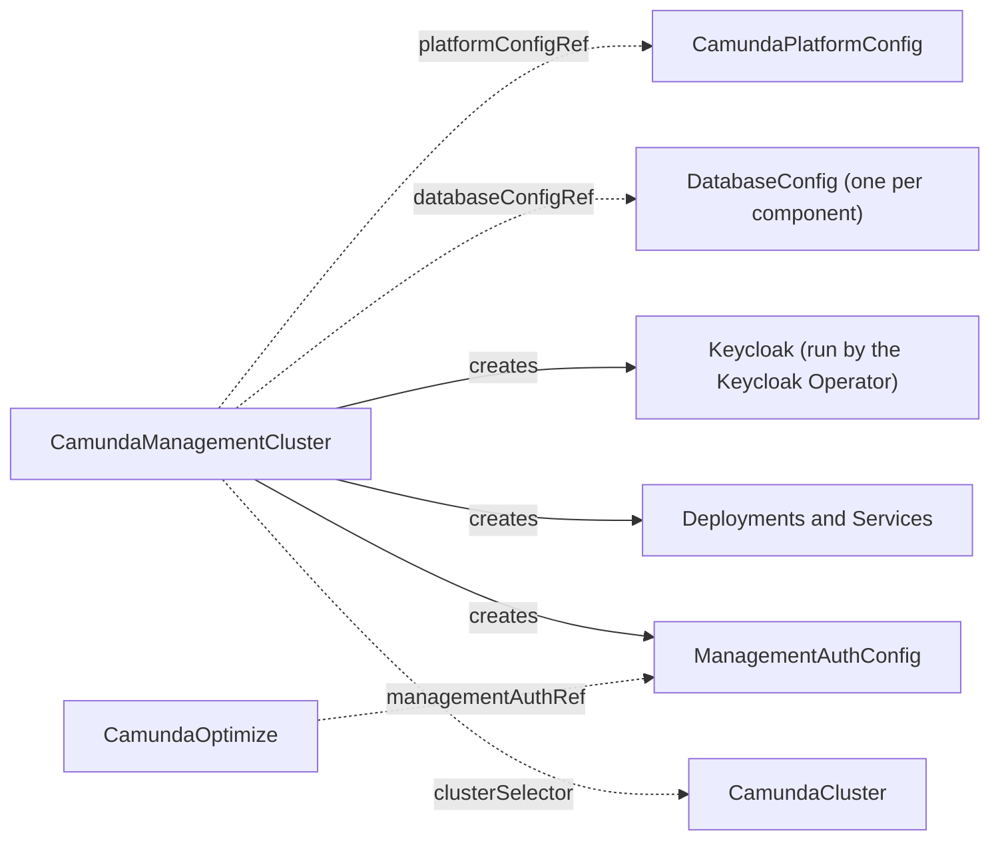

# CamundaManagementCluster

A `CamundaManagementCluster` is one Camunda management plane: Management Identity, the identity provider behind it, and optionally Console and Web Modeler. Management Identity controls who signs in to Console, Web Modeler, and Optimize. It is a separate identity system from the one inside an orchestration cluster, which Camunda describes in [Management Identity](https://docs.camunda.io/docs/self-managed/components/management-identity/overview/).

You create one management plane per platform. It serves the orchestration clusters that `spec.clusterSelector` matches, in every namespace that `spec.namespaceSelector` admits (every namespace, unless you set one). Creating this resource is a platform-administrator action, because the selector reaches [CamundaClusters](camundacluster.md) outside its own namespace and the operator annotates the ones it matches.

The smallest management plane names a platform configuration, an identity provider, and Management Identity:

```yaml
apiVersion: core.camunda.io/v1
kind: CamundaManagementCluster
metadata:
  name: my-management
  namespace: my-management-ns
spec:
  platformConfigRef: "my-platform-config"
  identityProvider:
    keycloak:
      version: "26.6.4"
      externalUrl: "https://camunda.example.com/auth"
      databaseConfigRef: "my-keycloak-db"
  identity:
    version: "8.9.0"
    externalUrl: "https://identity.camunda.example.com"
    databaseConfigRef: "my-identity-db"
    admin:
      username: "admin"
      email: "admin@example.com"
  optimize:
    externalUrl: "https://optimize.camunda.example.com"
```



## What you get

The operator creates these Deployments in the namespace of the resource, and one Service of the same name in front of each:

| Deployment and Service | What it does | Deployed when |
| --- | --- | --- |
| `my-management-identity` | Management Identity. Console, Web Modeler, and Optimize authenticate through it. | Always. |
| `my-management-console` | Console. | `spec.console` is set. |
| `my-management-web-modeler-restapi` | The Web Modeler application and its API. | `spec.webModeler` is set. |
| `my-management-web-modeler-websockets` | The Web Modeler process that pushes live updates to a browser. | `spec.webModeler` is set. |

In the `keycloak` mode the operator also creates a `Keycloak` resource named `my-management-keycloak`. The Keycloak Operator turns it into pods and into the Service `my-management-keycloak-service`.

There is no block that turns a component on. Console runs while `spec.console` is set. Web Modeler runs while `spec.webModeler` is set. Remove the block to remove the workloads.

A long resource name is shortened in the derived names and in the owner label, so read both back instead of assuming them.

The operator creates no Ingress. You route traffic to each Service yourself, and the `externalUrl` fields tell each component the address a browser reaches it at.

Read the names back with `kubectl get deploy,svc -n my-management-ns -l camunda.io/management-cluster=my-management`.

## Identity provider

`spec.identityProvider` selects where people authenticate. Set exactly one of the three blocks. The choice decides who creates the clients of the management plane, and where the first administrator comes from.

### The operator runs Keycloak

`identityProvider.keycloak` runs Keycloak through the [Keycloak Operator](https://www.keycloak.org/operator/installation), which you install first (see [Installation](../installation.md#requirements)). Management Identity then creates the realm `camunda-platform`, the client of every component, and the first user in it.

```yaml
apiVersion: core.camunda.io/v1
kind: CamundaManagementCluster
metadata:
  name: my-management
  namespace: my-management-ns
spec:
  identityProvider:
    keycloak:
      version: "26.6.4"
      externalUrl: "https://camunda.example.com/auth"
      databaseConfigRef: "my-keycloak-db"
      replicas: 2
  optimize:
    externalUrl: "https://optimize.camunda.example.com"
  # ... the rest of your management cluster
```

`externalUrl` is the address a browser reaches Keycloak at, and it must carry the `/auth` path. Camunda publishes its Keycloak build under that path, and every token that the realm issues names this URL as its issuer. The Identity pods must reach it too.

`version` is the Keycloak version. The operator supports `26.0.0` and later, and below `27.0.0`. Camunda 8.9 supports Keycloak 26 only, as its [supported environments](https://docs.camunda.io/docs/reference/supported-environments/) page states.

Stay below `26.7.0` with Management Identity 8.9. From 26.7.0, Keycloak refuses every change to its `realm-management` client (the fix of [CVE-2026-9796](https://github.com/keycloak/keycloak/pull/49624)). Management Identity 8.9 changes that client when it creates the realm, so it stops with `HTTP 403 Forbidden` and `IdentityReady` never leaves `Creating`. Install the Keycloak Operator of the same release as `version`. The [Keycloak Operator](https://www.keycloak.org/operator/customizing-keycloak) supports the Keycloak it was released with.

Keycloak needs a PostgreSQL database of its own. `databaseConfigRef` names a [DatabaseConfig](databaseconfig.md) in the namespace of this resource.

The Keycloak Operator writes the first Keycloak administrator into the Secret `my-management-keycloak-initial-admin`. Management Identity signs in with it to create the realm.

### You run Keycloak

`identityProvider.externalKeycloak` connects Management Identity to a Keycloak that you run. Management Identity still creates the realm, the clients, and the first user in it. Run Keycloak 26, below 26.7.0, for the reason the [section above](#the-operator-runs-keycloak) gives.

```yaml
apiVersion: core.camunda.io/v1
kind: CamundaManagementCluster
metadata:
  name: my-management
  namespace: my-management-ns
spec:
  identityProvider:
    externalKeycloak:
      url: "https://keycloak.example.com/auth"
      realm: "camunda-platform"
      adminCredentialsSecretRef:
        name: "my-keycloak-admin"
        namespace: "my-management-ns"
        usernameKey: "username"
        passwordKey: "password"
  optimize:
    externalUrl: "https://optimize.camunda.example.com"
  # ... the rest of your management cluster
```

`url` serves browsers and containers alike, so it must resolve from inside the Kubernetes cluster. If your Keycloak serves under the `/auth` path, include that path. `realm` defaults to `camunda-platform`.

`adminCredentialsSecretRef` names the Keycloak administrator that Management Identity bootstraps the realm with. The Secret can live in any namespace. A pod reads a Secret of its own namespace only, so the operator copies it into the namespace of this resource.

### Your own OIDC provider

`identityProvider.oidc` connects Management Identity to the identity provider of the referenced [CamundaPlatformConfig](camundaplatformconfig.md). Nothing is created for you here. You register one application per component at your provider, and the platform config names them.

```yaml
apiVersion: core.camunda.io/v1
kind: CamundaManagementCluster
metadata:
  name: my-management
  namespace: my-management-ns
spec:
  platformConfigRef: "my-platform-config"
  identityProvider:
    oidc: {}
  identity:
    version: "8.9.0"
    externalUrl: "https://identity.camunda.example.com"
    databaseConfigRef: "my-identity-db"
    admin:
      claimName: "oid"
      claimValue: "8f1c...e2"
  # ... the rest of your management cluster
```

The platform config must set `spec.auth.method: oidc`, and it must carry `authUrl`, `tokenUrl`, and `jwksUrl` under `spec.auth.oidc`. Those three are optional for an orchestration cluster, which reads them from the discovery document of your provider. The [ManagementAuthConfig](managementauthconfig.md) carries all three, and the operator asks your provider for nothing. Read them from the discovery document and set them on the platform config.

`spec.optimize` is forbidden in this mode. The platform config declares the Optimize client, so there is no redirect URI for the operator to register.

The redirect URI of each component is the one Camunda documents in [component-specific configuration](https://docs.camunda.io/docs/self-managed/components/management-identity/configuration/connect-to-an-oidc-provider/#component-specific-configuration). Register it at your provider before the component starts.

### The generated Secrets

In the two Keycloak modes the operator generates the credentials that Management Identity gives to the Optimize client and to the first user:

| Secret | Key | What it holds |
| --- | --- | --- |
| `my-management-optimize-client` | `client-secret` | The client secret of Optimize. The `ManagementAuthConfig` points at this Secret. |
| `my-management-identity-admin` | `password` | The password of the first Keycloak user. Absent while `spec.identity.admin.passwordSecretRef` names a Secret of your own. |

Delete `my-management-optimize-client` to rotate that client secret. The operator generates a new value, writes it back, and rolls the pods that read it. There is no Secret for the client of Management Identity itself. Management Identity creates its `camunda-identity` client in the realm and gives it a new secret on every start, and nothing outside Management Identity needs that secret.

> **Caution:** Do not delete `my-management-identity-admin`. Management Identity sets that password on the Keycloak user once, on its first start, and never reads it again. A deleted Secret comes back with a new password that the Keycloak user does not hold. Only a password reset in Keycloak recovers the account. To rotate the password, change it in Keycloak.

The `oidc` mode generates none of these. Your provider issues every client secret, and the platform config names it.

## Management Identity

Management Identity is always deployed. `spec.identity` sets its version, the address a browser reaches it at, its database, and its first administrator.

```yaml
apiVersion: core.camunda.io/v1
kind: CamundaManagementCluster
metadata:
  name: my-management
  namespace: my-management-ns
spec:
  identity:
    version: "8.9.0"
    externalUrl: "https://identity.camunda.example.com"
    databaseConfigRef: "my-identity-db"
    admin:
      username: "admin"
      email: "admin@example.com"
    replicas: 2
    resources:
      requests:
        cpu: "250m"
        memory: 512Mi
  # ... the rest of your management cluster
```

`spec.identity.version` is the Management Identity version. The operator supports `8.9.0` and later.

Management Identity needs a PostgreSQL database of its own. Each component that opens a database owns every table in it, so Management Identity, Keycloak, and Web Modeler must each name a different [DatabaseConfig](databaseconfig.md).

### The first administrator

`spec.identity.admin` names the person who signs in first and grants the rest. Management Identity reads it on its first start only and stores the result in its database.

In the two Keycloak modes, set `username`. Management Identity creates that Keycloak user. If you deploy Web Modeler, set `email` too, because Web Modeler needs an address for every person who signs in. `passwordSecretRef` names a password of your own. Without it the operator generates one into `my-management-identity-admin`.

A later change to `username` does not rename the first user. Management Identity creates a second one, and the first one keeps its access.

In the `oidc` mode, set `claimName` and `claimValue` instead. They name the token claim that identifies the administrator, for example `oid` or `sub`. This pair is fixed once Management Identity has started. A later change reports `IdentityReady` and `Ready` with reason `ImmutableAfterStart`, and the message names the recorded value and the value you asked for:

```yaml
status:
  conditions:
    - type: IdentityReady
      status: "False"
      reason: ImmutableAfterStart
      message: 'Management Identity started with the administrator claim "oid=8f1c...e2" and stores it in its database; spec.identity.admin now asks for "oid=41ab...77", which only a change in the database can do'
    - type: Ready
      status: "False"
      reason: ImmutableAfterStart
      message: 'management-identity: Management Identity started with the administrator claim "oid=8f1c...e2" and stores it in its database; spec.identity.admin now asks for "oid=41ab...77", which only a change in the database can do'
```

There are two ways out, and the operator cannot do either for you.

The recorded administrator is a real person. Put the recorded value back on `spec.identity.admin`. Sign in as that person, and grant the rest in the Management Identity user interface.

Nobody holds the recorded claim, so nobody can sign in. The operator records the claim that Management Identity started with in the annotation `camunda.io/identity-initial-claim` on this resource, and renders that recorded value from then on. Remove the annotation:

```bash
kubectl annotate camundamanagementcluster my-management -n my-management-ns \
  camunda.io/identity-initial-claim-
```

The claim of the spec then reaches Management Identity again. Management Identity itself reads that claim on its first start only, so the administrator in its own database has to change as well. Camunda names the values in [OIDC configuration](https://docs.camunda.io/docs/self-managed/components/management-identity/miscellaneous/configuration-variables/#oidc-configuration).

An empty database does the same. Point `spec.identity.databaseConfigRef` at one, and Management Identity starts over. It then loses the roles and the tenants it held. Your identity provider keeps every user and client, because they never lived in that database.

Get the pair right before the first start, and the question does not arise.

## Console

Console shows every orchestration cluster of the platform in one place, as Camunda describes in [Console on Self-Managed](https://docs.camunda.io/docs/self-managed/components/console/overview/). Set `spec.console` to deploy it.

```yaml
apiVersion: core.camunda.io/v1
kind: CamundaManagementCluster
metadata:
  name: my-management
  namespace: my-management-ns
spec:
  console:
    version: "8.9.0"
    externalUrl: "https://console.camunda.example.com"
  # ... the rest of your management cluster
```

A cluster appears in Console once it reports to Console. The operator adds four entries to `spec.extraEnv` of every attached cluster, so you add nothing to a cluster yourself:

```yaml
apiVersion: core.camunda.io/v1
kind: CamundaCluster
metadata:
  name: my-cluster
  namespace: my-cluster-ns
spec:
  extraEnv:
    - name: CAMUNDA_CONSOLE_PING_ENABLED
      value: "true"
    - name: CAMUNDA_CONSOLE_PING_ENDPOINT
      value: http://my-management-console.my-management-ns.svc:80
    - name: CAMUNDA_CONSOLE_PING_CLUSTERNAME
      value: my-cluster
    - name: CAMUNDA_CONSOLE_PING_PINGPERIOD
      value: 1h
  # ... the rest of your cluster
```

The endpoint is the Console Service, reached from inside the Kubernetes cluster. Console therefore needs no Ingress for a cluster to report to it. Camunda documents what the entries mean in [Console ping configuration](https://docs.camunda.io/docs/self-managed/components/orchestration-cluster/zeebe/configuration/broker-config/#console-ping-configuration).

The operator owns these four names and replaces a value you set under them. It removes them again when the cluster leaves `spec.clusterSelector`, when you remove `spec.console`, or when you delete this resource. See [Management plane](camundacluster.md#management-plane) on the cluster page.

Camunda 8.10 renamed Console to Hub and the ping settings with it, and it expects machine-to-machine credentials under the ping. The [8.10 chart README](https://github.com/camunda/camunda-platform-helm/blob/main/charts/camunda-platform-8.10/README.md) lists those settings. A cluster of version 8.10 or later gets the four `CAMUNDA_HUB_PING_*` names instead. The management plane issues no credentials yet, so such a cluster logs a validation error and reports to nobody.

Camunda marks cluster discovery in Console experimental in 8.9. It is documented under [experimental features](https://docs.camunda.io/docs/self-managed/components/console/configuration/#experimental-features).

## Web Modeler

Web Modeler runs as two processes: the application and its API, and a second process that pushes live updates to a browser. Set `spec.webModeler` to deploy both.

```yaml
apiVersion: core.camunda.io/v1
kind: CamundaManagementCluster
metadata:
  name: my-management
  namespace: my-management-ns
spec:
  webModeler:
    version: "8.9.0"
    externalUrl: "https://modeler.camunda.example.com"
    websocketsExternalUrl: "https://modeler.camunda.example.com/ws"
    databaseConfigRef: "my-web-modeler-db"
    mail:
      smtpHost: "smtp.example.com"
      smtpPort: 587
      fromAddress: "noreply@example.com"
      fromName: "Camunda"
      credentialsSecretRef:
        name: "my-smtp-credentials"
        namespace: "my-management-ns"
        usernameKey: "username"
        passwordKey: "password"
  # ... the rest of your management cluster
```

Route `externalUrl` to `my-management-web-modeler-restapi` and `websocketsExternalUrl` to `my-management-web-modeler-websockets`. A browser opens both, so both must be reachable from outside the Kubernetes cluster.

Web Modeler needs an SMTP server and does not start without one. Camunda states this in [Web Modeler configuration](https://docs.camunda.io/docs/self-managed/components/modeler/web-modeler/configuration/). Leave `credentialsSecretRef` unset for a server that needs no credentials.

Web Modeler needs a PostgreSQL database of its own, named by `databaseConfigRef`.

The two processes authenticate to each other with credentials that the operator generates into the Secret `my-management-web-modeler-pusher`. Delete that Secret to rotate them. Both processes then roll together.

### Deploying to a cluster

Web Modeler lists every attached orchestration cluster in its deploy dialog. The operator fills the list, so you name no cluster here.

How Web Modeler authenticates against a cluster follows the authentication method of that cluster:

- An OIDC cluster takes the token of the person who is signed in. Nothing else is needed.
- A basic-auth cluster asks the person for a user name and a password in the deploy dialog. No setting of Web Modeler carries them.

For every attached basic-auth cluster, the operator creates the user `web-modeler` on that cluster. That user name is reserved on every attached basic-auth cluster: a user of that name that already exists there gets the password of the operator, and the operator removes it when the cluster leaves the management plane. Do not create a `web-modeler` user of your own on those clusters. It publishes the password of that user in a Secret of the management namespace, named `my-management-web-modeler-cluster-<uid>`. The `<uid>` is the first eight characters of the UID of the `CamundaCluster`. The user holds only the permissions that deploying and starting a process needs.

Read the password and give it to the people who deploy from Web Modeler:

```bash
kubectl get secret -n my-management-ns \
  -l camunda.io/component=web-modeler-cluster-user \
  -o custom-columns='SECRET:.metadata.name,PASSWORD:.data.password'
```

Every value is base64 encoded. The key `applied` next to the password means that the cluster holds the user under that password. A Secret without it is a password that never reached the cluster.

A cluster that refuses the call keeps its row in `status.clusters` with the reason `BasicAuthUserFailed`. The management plane still serves the cluster, and Web Modeler still lists it. Only the user is missing.

## Clusters

`spec.clusterSelector` selects the orchestration clusters that Console lists and Web Modeler deploys to. It follows the Kubernetes label selector convention:

- Unset selects no cluster.
- `{}` selects every `CamundaCluster` of the Kubernetes cluster, in every namespace.
- A selector with terms selects the clusters whose labels match.

`spec.namespaceSelector` narrows the search to the namespaces whose labels match, the way the `namespaceSelector` of an admission webhook does. Unset or `{}` puts no bound on the namespace. It selects on the labels of the `Namespace` objects, so label the namespaces, not the clusters:

```yaml
apiVersion: core.camunda.io/v1
kind: CamundaManagementCluster
metadata:
  name: my-management
  namespace: my-management-ns
spec:
  clusterSelector:
    matchLabels:
      environment: production
  namespaceSelector:
    matchLabels:
      team: payments
  # ... the rest of your management cluster
```

A cluster whose namespace leaves the bound is deselected like one that leaves `clusterSelector`: the claim, the Console settings, and the Web Modeler user go by themselves.

`status.clusters` lists one row per selected cluster and says whether the management plane serves it:

```yaml
status:
  clusters:
    - name: my-cluster
      namespace: my-cluster-ns
      attached: true
    - name: my-other-cluster
      namespace: my-other-ns
      attached: false
      reason: NotReady
      message: The cluster publishes no gateway endpoints yet
```

| Reason | Meaning | What to do |
| --- | --- | --- |
| (empty, `attached: true`) | Console lists the cluster and Web Modeler deploys to it. | Nothing. |
| `NotReady` | The cluster publishes no `status.gateway` yet, or it changed while the operator claimed it. | Wait. The row clears when the cluster settles. |
| `ClaimedElsewhere` | Another management plane already serves this cluster. The message names it. | One cluster answers to one management plane. Remove the cluster from one of the two selectors. |
| `InvalidReference` | The `platformConfigRef` of the cluster does not resolve, so the operator cannot read how the cluster authenticates. | Create the named `CamundaPlatformConfig`, or correct the reference on the cluster. |
| `WriteFailed` | The Console settings could not be written on the cluster. | Read the message. The operator tries again. |
| `BasicAuthUserFailed` | The Web Modeler user could not be created on this basic-auth cluster. `attached` stays true. | Read the message. It usually names a missing administrator Secret or a cluster that does not answer. |

An attached cluster carries the annotation `camunda.io/management-cluster`, whose value is `my-management-ns/my-management`. It is how one management plane tells its clusters from the clusters of another. The operator removes the annotation when the cluster leaves the selector, and when you delete this resource.

## Optimize

`spec.optimize.externalUrl` is the address a browser reaches Optimize at. Set it in the two Keycloak modes and leave it unset in the `oidc` mode.

The operator deploys no Optimize from this block. [CamundaOptimize](camundaoptimize.md) is its own resource. The field exists because Management Identity creates the Optimize client in Keycloak and registers the login callback under this URL as its redirect URI.

One management plane bootstraps one Optimize client with one URL. To run a second Optimize against this management plane, add its callback URL to the `optimize` client in Keycloak yourself.

## The contract that Optimize reads

The operator writes one cluster-scoped [ManagementAuthConfig](managementauthconfig.md) with the endpoints of the identity provider, the base URL of Management Identity, and the Optimize client. A `CamundaOptimize` reads it through `managementAuthRef`.

The contract is named after this resource unless `spec.managementAuthConfigName` names another. `status.managementAuthConfig` reports the name in use:

```yaml
status:
  managementAuthConfig: my-management
```

The contract is cluster-scoped, so two management planes in two namespaces can ask for the same name. The first one there keeps it, and the second reports `Ready=False` with reason `Conflict`.

If you change `spec.managementAuthConfigName` later, the operator writes the contract under the new name and removes the old one. A `CamundaOptimize` that names the old one in its `managementAuthRef` loses its contract, so change that reference at the same time.

## Images

Every image of the management plane has three sources on the referenced [CamundaPlatformConfig](camundaplatformconfig.md), in this order:

1. A rename under `spec.images`.
2. The `spec.imageRegistry` prefix in front of the default repository.
3. The default repository of Camunda.

The tag comes from the `version` field of the component that runs the image. Keycloak is the exception: its tag is `quay-optimized-<version>`, which is what Camunda publishes its Keycloak build under. See [Images](camundaplatformconfig.md#images).

## Suspension

`spec.suspend: true` scales every workload of the management plane to zero, Keycloak included. The databases keep everything, so a resume brings the same realm, the same users, and the same projects back.

The `ManagementAuthConfig`, the claims on the orchestration clusters, and the Console settings stay while the suspension holds. Nothing else has to change while the management plane is down.

`Ready` reads `True` with reason `Suspended`. Zero replicas is the state you asked for, so this is not an error.

Nobody can sign in to Console, Web Modeler, or Optimize while the management plane is down. All three authenticate through Management Identity, and in the `keycloak` mode the provider behind it is down as well. A `CamundaOptimize` keeps its own `Ready` condition, because the contract it reads is still there. The orchestration clusters run on, and they keep exporting, executing, and serving their own web applications.

## Deletion

Deleting the `CamundaManagementCluster` removes:

- Every Deployment, Service, and generated Secret.
- The `Keycloak` resource in the `keycloak` mode, and with it the Keycloak pods.
- The `ManagementAuthConfig`. A `CamundaOptimize` that reads it then reports `InvalidReference`.
- The Console settings and the `camunda.io/management-cluster` annotation on every orchestration cluster it served.
- The `web-modeler` user on every basic-auth cluster it created one on. This is best effort. A cluster that is gone or unreachable records the Warning event `WebModelerUserRemovalFailed`, and the deletion goes on. Remove that user yourself.

Deletion keeps:

- The PostgreSQL databases of Management Identity, Keycloak, and Web Modeler, and everything in them. They belong to the [DatabaseConfig](databaseconfig.md) resources, not to this one.
- Every user, group, and client in Keycloak, including the first administrator. Deleting the `Keycloak` resource removes the pods, not the database behind them.
- The Secrets that you referenced. Only the copies in the management namespace go.
- The orchestration clusters themselves. They keep running, and nothing else about them changes. They roll their pods once, when the Console settings go.

## Status

`kubectl get camundamanagementcluster` shows `Ready`, its reason, and the age.

A condition reads `True` under the reasons `Healthy`, `Disabled`, and `Suspended`, and `False` under every other reason in the table.

| Type | Reason | Meaning | What to do |
| --- | --- | --- | --- |
| `MirroredSecretsReady` | `Healthy` / `Disabled` | Every copy of a referenced Secret from another namespace is applied, or no such Secret exists. | Nothing. |
| `SecretsReady` | `Healthy` / `Disabled` | The generated Secrets are applied, or the mode generates none (`oidc`). | Nothing. |
| `KeycloakReady` | `Healthy` | The Keycloak Operator reports the Keycloak ready. | Nothing. |
| `KeycloakReady` | `Creating` / `Updating` | The Keycloak Operator rolls the Keycloak pods. | Wait. |
| `KeycloakReady` | `Failing` | Keycloak reports errors, or it does not become ready. The message carries what Keycloak said. | Read the pods and events of `my-management-keycloak`. |
| `KeycloakReady` | `Disabled` | The mode is `externalKeycloak` or `oidc`, so the operator runs no Keycloak. | Nothing. |
| `IdentityReady` | `Healthy` | Every Management Identity replica is ready. | Nothing. |
| `IdentityReady` | `PrerequisiteNotMet` | The mode is `keycloak` and `KeycloakReady` is not `True` yet. Management Identity waits for Keycloak, so this is normal while Keycloak starts. | Read the `KeycloakReady` row. It clears when Keycloak is ready. |
| `IdentityReady` | `ImmutableAfterStart` | `spec.identity.admin` asks for an administrator claim that Management Identity did not start with. | Put the recorded value back, or remove the recorded claim and change the administrator in the database. See [The first administrator](#the-first-administrator). |
| `ConsoleReady`, `WebModelerReady` | `Healthy` / `Disabled` | Every replica is ready, or the block is unset. | Nothing. |
| `IdentityReady`, `ConsoleReady`, `WebModelerReady` | `Creating` / `Updating` / `Scaling` | The workload rolls out or scales. | Wait. If the reason does not change, read the pods of the named Deployment. |
| `KeycloakReady`, `IdentityReady`, `ConsoleReady`, `WebModelerReady` | `Suspended` | `spec.suspend` is `true`, so the workload is at zero. | Nothing. |
| `KeycloakReady`, `IdentityReady`, `ConsoleReady`, `WebModelerReady` | `Suspending` | `spec.suspend` is `true` and the workload still runs pods. | Wait. |
| `KeycloakReady` | `PendingSuspension` | `spec.suspend` is `true` and the `Keycloak` resource does not ask for zero instances yet. | Wait. |
| `ManagementAuthReady` | `Healthy` | The `ManagementAuthConfig` is up to date. | Nothing. |
| `ManagementAuthReady` | `WriteFailed` | The operator could not write the `ManagementAuthConfig`. The message carries the answer of the API server. | Read the message. The operator tries again. |
| `Ready` | `Healthy` | Every condition that takes part is healthy and the contract is written. | Nothing. |
| `Ready` | `Creating` / `Updating` / `Scaling` / `Failing` / `Suspending` / `PendingSuspension` / `PrerequisiteNotMet` | The reason of the governing condition. The message names it. | Read the row of that condition. |
| `Ready` | `ImmutableAfterStart` | `spec.identity.admin` asks for an administrator claim that Management Identity did not start with. | Read the `IdentityReady` row. |
| `Ready` | `Suspended` | `spec.suspend` is `true` and every workload is at zero. `Ready` is `True`. | Nothing is wrong. Set `suspend` back to `false` to bring the management plane up. |
| `Ready` | `KeycloakOperatorNotInstalled` | `spec.identityProvider.keycloak` is set and the Kubernetes cluster does not serve the `Keycloak` kind. | Install the Keycloak Operator and restart the operator, or select the `externalKeycloak` or the `oidc` mode. See [Installation](../installation.md#requirements). |
| `Ready` | `UnsupportedVersion` | A version field is outside the range the operator supports. The message names the field and the bound. | Set a supported version. |
| `Ready` | `InvalidReference` | A referenced resource does not exist, two components name one `DatabaseConfig`, or the platform config cannot serve the `oidc` mode. | Read the message. Create the missing resource, or correct the field it names. |
| `Ready` | `MissingSecret` | A referenced Secret does not exist or lacks a key. The message names both. | Create the Secret with the named key. |
| `Ready` | `Conflict` | A `ManagementAuthConfig` of that name exists and belongs to another owner. The message names the holder. | Set `spec.managementAuthConfigName` to a free name, or remove the object. |
| `Ready` | `WriteFailed` | The `ManagementAuthConfig` could not be written. | Read the `ManagementAuthReady` row. |

`Ready` is `True` only when every condition that takes part in it is `True` and the `ManagementAuthConfig` is written.

A condition that reads `Disabled` stays out of `Ready`. This is not an error.

The rows of `status.clusters` are their own report and never hold `Ready` back. One broken cluster does not stop the management plane. Those rows use some of the same reason names, and each one means something different there, about that one cluster. See [Clusters](#clusters).

`status.observedGeneration` is the generation of the spec that the status describes.

Some messages of the identity provider name the field to correct:

```yaml
status:
  conditions:
    - type: Ready
      status: "False"
      reason: InvalidReference
      message: CamundaPlatformConfig "my-platform-config" declares no spec.auth.oidc.management.clients.console; register an application for that component at your identity provider and name it there
```

## Spec reference

Every field, with its type, whether it is required, and its default:

```yaml
apiVersion: core.camunda.io/v1
kind: CamundaManagementCluster
metadata:
  name: my-management
  namespace: my-management-ns
spec:
  # string. Required. Name of the cluster-scoped CamundaPlatformConfig.
  # It carries the license and the image settings. In the oidc mode it also
  # carries the identity provider and every client of the management plane.
  platformConfigRef: "my-platform-config"
  # boolean. Optional, default: false. Scale every workload of this management plane to zero.
  suspend: false
  # object. Optional, default: no cluster. Label selector for the CamundaClusters that Console and Web Modeler serve. {} selects every cluster.
  clusterSelector:
    matchLabels:
      environment: "production"
  # object. Optional, default: every namespace. Label selector over the Namespace objects that
  # clusterSelector searches. {} puts no bound on the namespace.
  namespaceSelector:
    matchLabels:
      team: "payments"
  # string. Optional, default: the name of this resource. Name of the cluster-scoped ManagementAuthConfig that this management plane writes.
  managementAuthConfigName: "my-management"
  # object. Required. Where people authenticate. Set exactly one of keycloak, externalKeycloak, or oidc.
  identityProvider:
    # object. Optional. Run Keycloak through the Keycloak Operator.
    keycloak:
      # string. Required. Keycloak version, as major.minor.patch. Supported: 26.0.0 and later, below 27.0.0.
      # With Management Identity 8.9, stay below 26.7.0. See "The operator runs Keycloak".
      version: "26.6.4"
      # string. Required. The URL a browser reaches Keycloak at, including the /auth path. It is the issuer of every token.
      externalUrl: "https://camunda.example.com/auth"
      # string. Required. Name of the DatabaseConfig of the Keycloak database, in this namespace.
      databaseConfigRef: "my-keycloak-db"
      # integer. Optional, default: 1. Number of Keycloak instances.
      replicas: 1
      # object. Optional. CPU and memory of the Keycloak container.
      resources: {}
    # object. Optional. Connect to a Keycloak that you run.
    externalKeycloak:
      # string. Required. URL of Keycloak, including the /auth path when it has one. It must resolve from inside the Kubernetes cluster.
      url: "https://keycloak.example.com/auth"
      # string. Optional, default: camunda-platform. The realm that Management Identity uses and creates.
      realm: "camunda-platform"
      # object. Required. Secret with the Keycloak administrator credentials.
      adminCredentialsSecretRef:
        # string. Required. Name of the Secret.
        name: "my-keycloak-admin"
        # string. Required. Namespace of the Secret. Any namespace is allowed.
        namespace: "my-management-ns"
        # string. Required. Key that holds the user name.
        usernameKey: "username"
        # string. Required. Key that holds the password.
        passwordKey: "password"
    # object. Optional. Connect to the identity provider of the referenced CamundaPlatformConfig. It carries no fields.
    oidc: {}
  # object. Required. Management Identity. It is always deployed.
  identity:
    # string. Required. Management Identity version, as major.minor.patch. Supported: 8.9.0 and later.
    version: "8.9.0"
    # string. Required. The URL a browser reaches Management Identity at. Must be an http or https URL.
    externalUrl: "https://identity.camunda.example.com"
    # string. Required. Name of the DatabaseConfig of the Management Identity database, in this namespace.
    databaseConfigRef: "my-identity-db"
    # object. Required. The first administrator of the management plane. Read on the first start only.
    admin:
      # string. Required in the oidc mode, forbidden in the keycloak modes. Token claim that identifies the administrator.
      claimName: "oid"
      # string. Required with claimName. The value the claim carries for the administrator.
      claimValue: "8f1c...e2"
      # string. Required in the keycloak modes, forbidden in the oidc mode. Name of the first Keycloak user.
      username: "admin"
      # object. Optional, forbidden in the oidc mode. Secret key with the password of the first Keycloak user. Unset means a generated password.
      passwordSecretRef:
        name: "my-identity-admin"
        namespace: "my-management-ns"
        key: "password"
      # string. Optional. Email address of the first Keycloak user. Web Modeler needs one for every person who signs in.
      email: "admin@example.com"
    # integer. Optional, default: 1. Number of Management Identity replicas.
    replicas: 1
    # object. Optional. CPU and memory of the container.
    resources: {}
    # list. Optional. Extra environment variables of the container.
    extraEnv: []
    # list. Optional. Extra environment sources (ConfigMaps, Secrets) of the container.
    extraEnvFrom: []
    # object. Optional. Extra labels of the pods.
    podLabels: {}
    # object. Optional. Extra annotations of the pods.
    podAnnotations: {}
    # object. Optional. Scheduling constraints of the pods.
    scheduling: {}
  # object. Optional. Console. Console is not deployed while this is unset.
  console:
    # string. Required. Console version, as major.minor.patch. Supported: 8.9.0 and later.
    version: "8.9.0"
    # string. Required. The URL a browser reaches Console at. Console serves under the path of this URL.
    externalUrl: "https://console.camunda.example.com"
    # integer. Optional, default: 1. Number of Console replicas.
    replicas: 1
    # object. Optional. CPU and memory of the container.
    resources: {}
    # The other workload fields of spec.identity apply here too: extraEnv,
    # extraEnvFrom, podLabels, podAnnotations, scheduling.
  # object. Optional. Web Modeler. Web Modeler is not deployed while this is unset.
  webModeler:
    # string. Required. Web Modeler version, as major.minor.patch. Supported: 8.9.0 and later.
    version: "8.9.0"
    # string. Required. The URL a browser reaches Web Modeler at.
    externalUrl: "https://modeler.camunda.example.com"
    # string. Required. The URL a browser reaches the live-update process at.
    websocketsExternalUrl: "https://modeler.camunda.example.com/ws"
    # string. Required. Name of the DatabaseConfig of the Web Modeler database, in this namespace.
    databaseConfigRef: "my-web-modeler-db"
    # object. Required. The SMTP server that Web Modeler sends notifications through.
    mail:
      # string. Required. Host name of the SMTP server.
      smtpHost: "smtp.example.com"
      # integer. Optional, default: 587. Port of the SMTP server.
      smtpPort: 587
      # string. Required. Address that Web Modeler sends from.
      fromAddress: "noreply@example.com"
      # string. Optional. Display name that Web Modeler sends under.
      fromName: "Camunda"
      # boolean. Optional, default: true. Turn STARTTLS on.
      tls: true
      # object. Optional. Secret with the user and the password of the SMTP server. Unset means a server that needs no credentials.
      credentialsSecretRef:
        name: "my-smtp-credentials"
        namespace: "my-management-ns"
        usernameKey: "username"
        passwordKey: "password"
    # object. Optional. Workload fields of the application process. It takes
    # the same fields as spec.identity: replicas, resources, extraEnv,
    # extraEnvFrom, podLabels, podAnnotations, scheduling.
    restapi:
      # integer. Optional, default: 1. Number of replicas.
      replicas: 1
    # object. Optional. Workload fields of the live-update process. Same shape
    # as restapi.
    websockets:
      # integer. Optional, default: 1. Number of replicas.
      replicas: 1
  # object. Optional, required in the keycloak modes, forbidden in the oidc mode. The Optimize that this management plane serves. The operator deploys no Optimize from it.
  optimize:
    # string. Required. The URL a browser reaches Optimize at. Management Identity registers the login callback under it.
    externalUrl: "https://optimize.camunda.example.com"
```

### Validation rules

The API server refuses an apply that breaks one of these:

- `spec.identityProvider` sets exactly one of `keycloak`, `externalKeycloak`, and `oidc`.
- `spec.identity.admin` sets `claimName` and `claimValue` together, or `username`, never both pairs.
- `spec.identity.admin.claimName` is required in the `oidc` mode. `spec.identity.admin.username` is required in the two Keycloak modes.
- `spec.identity.admin.passwordSecretRef` is forbidden in the `oidc` mode.
- `spec.optimize` is required in the two Keycloak modes and forbidden in the `oidc` mode.
- Every `externalUrl`, `websocketsExternalUrl`, and `url` is an `http` or `https` URL. `spec.identityProvider.keycloak.externalUrl` must carry the `/auth` path.
- Every `version` is three numbers separated by dots, for example `8.9.0`.
- An `extraEnv` entry sets `value` or `valueFrom`, never both. The rule binds `spec.identity`, `spec.console`, `spec.webModeler.restapi`, and `spec.webModeler.websockets`.

The operator checks these after you apply the resource and reports them on `Ready`:

- `spec.identity.version`, `spec.console.version`, and `spec.webModeler.version` are `8.9.0` or later. `spec.identityProvider.keycloak.version` is `26.0.0` or later and below `27.0.0`. A version outside a range reports `UnsupportedVersion`. The operator accepts `26.7.0` and later, and Management Identity 8.9 does not start against them. See [The operator runs Keycloak](#the-operator-runs-keycloak).
- Management Identity, Keycloak, and Web Modeler name three different `DatabaseConfig` resources. Two that name one report `InvalidReference`.
- Every referenced resource and Secret exists. A missing one reports `InvalidReference` or `MissingSecret`.

The API server refuses no change to a field that already has a value. `spec.identity.admin` is the one setting where a change has no effect anyway: Management Identity read it on its first start and stored the result in its own database. In the `oidc` mode the operator reports that as `ImmutableAfterStart`. See [The first administrator](#the-first-administrator).

### A production-shaped example

A management plane on a Keycloak that the operator runs, serving every cluster labeled `environment: production`:

```yaml
apiVersion: core.camunda.io/v1
kind: CamundaManagementCluster
metadata:
  name: my-management
  namespace: my-management-ns
spec:
  platformConfigRef: "my-platform-config"
  managementAuthConfigName: "my-management"
  clusterSelector:
    matchLabels:
      environment: "production"
  identityProvider:
    keycloak:
      version: "26.6.4"
      externalUrl: "https://camunda.example.com/auth"
      databaseConfigRef: "my-keycloak-db"
      replicas: 2
      resources:
        requests:
          cpu: "500m"
          memory: 1Gi
  identity:
    version: "8.9.0"
    externalUrl: "https://identity.camunda.example.com"
    databaseConfigRef: "my-identity-db"
    admin:
      username: "admin"
      email: "admin@example.com"
    replicas: 2
    resources:
      requests:
        cpu: "250m"
        memory: 512Mi
  console:
    version: "8.9.0"
    externalUrl: "https://console.camunda.example.com"
  webModeler:
    version: "8.9.0"
    externalUrl: "https://modeler.camunda.example.com"
    websocketsExternalUrl: "https://modeler.camunda.example.com/ws"
    databaseConfigRef: "my-web-modeler-db"
    mail:
      smtpHost: "smtp.example.com"
      fromAddress: "noreply@example.com"
      fromName: "Camunda"
      credentialsSecretRef:
        name: "my-smtp-credentials"
        namespace: "my-management-ns"
        usernameKey: "username"
        passwordKey: "password"
  optimize:
    externalUrl: "https://optimize.camunda.example.com"
```

## Related

- [Management plane guide](../guides/management-plane.md): the order to create things in, one section per identity provider mode.
- [CamundaPlatformConfig](camundaplatformconfig.md): referenced through `platformConfigRef`. In the `oidc` mode it declares every client of the management plane.
- [DatabaseConfig](databaseconfig.md): referenced once per component that needs a PostgreSQL database.
- [ManagementAuthConfig](managementauthconfig.md): written by this resource, read by `CamundaOptimize`.
- [CamundaCluster](camundacluster.md): selected through `clusterSelector`. It never references this resource.
- [CamundaOptimize](camundaoptimize.md): reads the `ManagementAuthConfig` through `managementAuthRef`.
- [Installation](../installation.md#requirements): the Keycloak Operator as a prerequisite of the `keycloak` mode.
