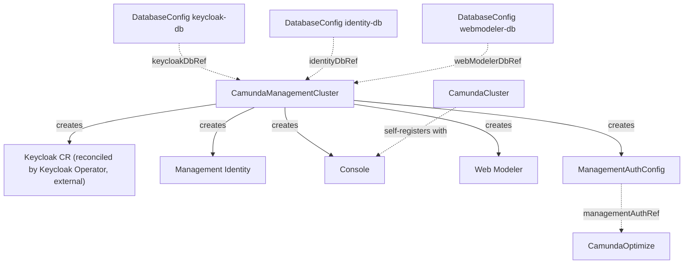

# CamundaManagementCluster

Deploys the Camunda management plane — Keycloak, Management Identity, Console, and Web Modeler — once per platform.

## Purpose

`CamundaManagementCluster` is a cluster-scoped CR that deploys the shared management plane: Management Identity (backed by Keycloak), Console, and Web Modeler.
Unlike orchestration clusters, the management plane exists once per platform and is shared across all clusters; management components authenticate users and machines through Management Identity, which is separate from and incompatible with each cluster's built-in admin identity.
You create this CR yourself, or a composition layer above may create it; in SaaS-style setups a control plane may instead ship a `ManagementAuthConfig` directly and skip the management cluster entirely.

The management plane follows the same infrastructure pattern as the orchestration side: external infrastructure (the PostgreSQL server, the Keycloak operator) is provisioned separately and referenced through contract CRDs.

## How it works

The operator reconciles a `CamundaManagementCluster` in the following steps:

1. Resolve the three `DatabaseConfig` references (`keycloakDbRef`, `identityDbRef`, `webModelerDbRef`) and verify their credential secrets exist; each names one logical PostgreSQL database.
2. Ensure the target namespace exists (default `<name>-camunda`).
3. Create a `Keycloak` CR in the target namespace, wired to the Keycloak database; the external Keycloak Operator reconciles it — this operator never deploys Keycloak itself, mirroring how `ElasticsearchCluster` delegates to ECK.
4. Deploy Management Identity into the target namespace, connected to Keycloak and the Identity database.
5. Deploy Console when `console.enabled` is set; Console needs no cluster references — orchestration clusters self-register with Console via the cluster-side ping mechanism, so adding a cluster never requires touching this CR.
6. Deploy Web Modeler when `webModeler.enabled` is set, connected to the Web Modeler database and the configured mail settings.
7. Create or refresh the cluster-scoped `ManagementAuthConfig` output CR, publishing the Management Identity base URL, OIDC endpoints, and default M2M client credentials for consumers such as [CamundaOptimize](camundaoptimize.md).
8. Update per-component conditions, the aggregate `Ready` condition, and `status.observedGeneration`.

All workloads are labeled with `camunda.io/cluster` (this CR's name) and `camunda.io/component` (`keycloak`, `identity`, `console`, `web-modeler`).



!!! note "Verified against Camunda 8.9"
    The 8.9 management plane consists of exactly these components: Management Identity 8.9.x, Console 8.9.x, and Web Modeler 8.9.x, with Keycloak 26.x as the supported OIDC provider for Management Identity.
    Three PostgreSQL databases are required — one each for Keycloak, Management Identity, and Web Modeler — matching the three `DatabaseConfig` references on this CR.
    Deploying Keycloak through the official Keycloak Operator is Camunda's documented operator-based approach; the Keycloak Operator is an external prerequisite this operator does not install.
    Console's cluster self-registration is an experimental feature in Camunda 8.9 (`CAMUNDA_CONSOLE_EXPERIMENTAL_DISCOVERY_MODE` on Console plus the `camunda.console.ping` settings on the orchestration cluster); since this operator configures both sides, it enables the mechanism itself, but the upstream feature's experimental status is worth knowing.

## API reference

```yaml
apiVersion: core.camunda.io/v1
kind: CamundaManagementCluster
metadata:
  # Cluster-scoped: no namespace.
  name: management
spec:
  # string. Optional, default: "<name>-camunda". Namespace where management plane workloads are created.
  targetNamespace: "camunda-management"
  # string. Optional. Name of the cluster-scoped CamundaPlatformConfig providing auth and license defaults.
  platformConfigRef: "my-platform-config"
  # string. Required. Name of the cluster-scoped DatabaseConfig for the Keycloak database.
  keycloakDbRef: "keycloak-db"
  # string. Required. Name of the cluster-scoped DatabaseConfig for the Management Identity database.
  identityDbRef: "identity-db"
  # string. Required. Name of the cluster-scoped DatabaseConfig for the Web Modeler database.
  webModelerDbRef: "webmodeler-db"
  # string. Optional, default: this CR's name. Name of the cluster-scoped ManagementAuthConfig this controller creates.
  managementAuthConfig: "management-auth"
  # object. Optional. The Keycloak instance, created as a Keycloak CR for the external Keycloak Operator.
  keycloak:
    # integer. Optional, default: 1. Number of Keycloak replicas.
    replicas: 1
    # object. Optional. Kubernetes resource requests and limits for the Keycloak pods.
    resources: {}
  # object. Optional. The Management Identity deployment.
  identity:
    # integer. Optional, default: 1. Number of Management Identity replicas.
    replicas: 1
    # object. Optional. Kubernetes resource requests and limits for the Management Identity pods.
    resources: {}
  # object. Optional. The Console deployment.
  console:
    # boolean. Optional, default: false. Deploy Console.
    enabled: true
    # integer. Optional, default: 1. Number of Console replicas.
    replicas: 1
    # object. Optional. Kubernetes resource requests and limits for the Console pods.
    resources: {}
  # object. Optional. The Web Modeler deployment.
  webModeler:
    # boolean. Optional, default: false. Deploy Web Modeler.
    enabled: true
    # integer. Optional, default: 1. Number of Web Modeler replicas.
    replicas: 1
    # object. Optional. Kubernetes resource requests and limits for the Web Modeler pods.
    resources: {}
    # object. Required when webModeler is enabled. Outbound mail settings for Web Modeler notifications.
    mail:
      # string. Required. Sender address for Web Modeler notification mails.
      fromAddress: "noreply@example.com"
      # string. Required. SMTP host Web Modeler sends mail through.
      smtpHost: "smtp.example.com"
  # object. Optional. Overrides the auth defaults inherited from the referenced CamundaPlatformConfig; same shape as its spec.auth.
  auth: {}
```

## Status

| Type | Reason | Meaning |
| --- | --- | --- |
| `Ready` | `Healthy` | All enabled components are available and the `ManagementAuthConfig` output exists. |
| `Ready` | `Progressing` | One or more components are still rolling out. |
| `Ready` | `InvalidReference` | A `DatabaseConfig` reference or the `platformConfigRef` could not be resolved. |
| `Ready` | `MissingSecret` | A referenced database credentials secret does not exist or lacks the required keys. |
| `KeycloakReady` | `Healthy` / `Progressing` | State of the Keycloak CR as reported by the Keycloak Operator. |
| `IdentityReady` | `Healthy` / `Progressing` | State of the Management Identity Deployment. |
| `ConsoleReady` | `Healthy` / `Progressing` | State of the Console Deployment; absent when Console is disabled. |
| `WebModelerReady` | `Healthy` / `Progressing` | State of the Web Modeler Deployment; absent when Web Modeler is disabled. |

The operator records the last reconciled generation in `status.observedGeneration`.

## Validation

- At most one `CamundaManagementCluster` may exist per Kubernetes cluster; creating a second is rejected, because the management plane is deployed once per platform.
- `keycloakDbRef`, `identityDbRef`, and `webModelerDbRef` must be non-empty and name three distinct `DatabaseConfig` CRs — the components require separate logical databases.
- `webModeler.mail.fromAddress` and `webModeler.mail.smtpHost` are required when `webModeler.enabled` is `true`.

## Relationships

- `DatabaseConfig` — referenced three times via `keycloakDbRef`, `identityDbRef`, and `webModelerDbRef`; each provides connection details and credentials for one logical PostgreSQL database.
- `ManagementAuthConfig` — created by this controller as its output contract, named by `spec.managementAuthConfig`.
- `CamundaPlatformConfig` — referenced via `platformConfigRef` for platform-wide auth and license defaults, overridable through `spec.auth`.
- [CamundaOptimize](camundaoptimize.md) — consumes the `ManagementAuthConfig` this controller produces via its `managementAuthRef`.
- `CamundaCluster` — never referenced here; clusters discover Console themselves through self-registration.
- The Keycloak Operator is an external prerequisite that reconciles the `Keycloak` CR this controller creates; a composition layer above may create this CR together with `Database` CRs that bootstrap the three databases.

## Examples

A minimal manifest:

```yaml
apiVersion: core.camunda.io/v1
kind: CamundaManagementCluster
metadata:
  name: management
spec:
  keycloakDbRef: "keycloak-db"
  identityDbRef: "identity-db"
  webModelerDbRef: "webmodeler-db"
```

A realistic manifest:

```yaml
apiVersion: core.camunda.io/v1
kind: CamundaManagementCluster
metadata:
  name: management
spec:
  targetNamespace: "camunda-management"
  platformConfigRef: "my-platform-config"
  keycloakDbRef: "keycloak-db"
  identityDbRef: "identity-db"
  webModelerDbRef: "webmodeler-db"
  managementAuthConfig: "management-auth"
  keycloak:
    replicas: 2
    resources:
      requests:
        cpu: "500m"
        memory: 1Gi
  identity:
    replicas: 2
    resources:
      requests:
        cpu: "250m"
        memory: 512Mi
  console:
    enabled: true
    replicas: 1
  webModeler:
    enabled: true
    replicas: 1
    mail:
      fromAddress: "noreply@example.com"
      smtpHost: "smtp.example.com"
```
