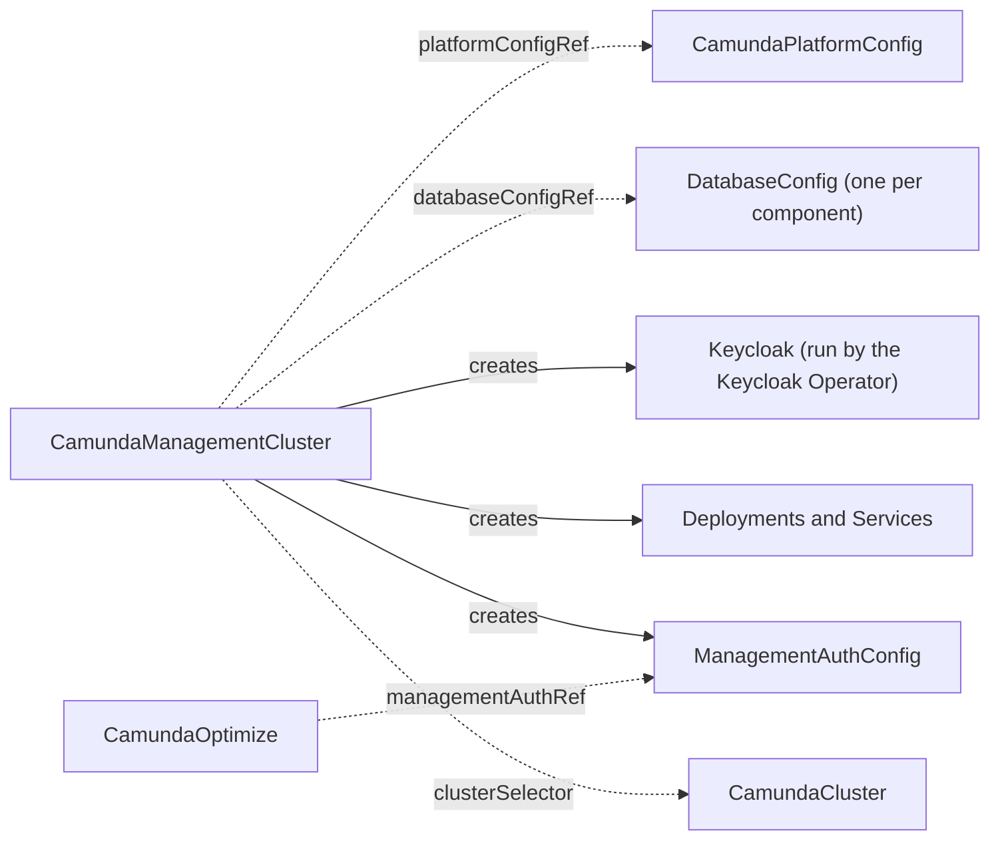

# CamundaManagementCluster

A `CamundaManagementCluster` is one Camunda management plane: Management Identity, the identity provider behind it, and optionally Console and Web Modeler. Management Identity controls who signs in to Console, Web Modeler, and Optimize. It is a separate identity system from the one inside an orchestration cluster, which Camunda describes in [Management Identity](https://docs.camunda.io/docs/self-managed/components/management-identity/overview/).

You create one management plane per platform. It serves the orchestration clusters that `spec.clusterSelector` matches, in every namespace that `spec.namespaceSelector` admits. Creating this resource is a platform-administrator action, because the selector reaches [CamundaClusters](camundacluster.md) in other namespaces and the operator annotates the ones it matches.

The smallest management plane names a platform configuration, an identity provider, and Management Identity:

```yaml
apiVersion: core.camunda.io/v1
kind: CamundaManagementCluster
metadata:
  name: my-management
  namespace: my-management-ns
spec:
  platformConfigRef: "my-platform-config"
  identityProvider:
    keycloak:
      version: "26.6.4"
      externalUrl: "https://camunda.example.com/auth"
      databaseConfigRef: "my-keycloak-db"
  identity:
    version: "8.9.0"
    externalUrl: "https://identity.camunda.example.com"
    databaseConfigRef: "my-identity-db"
    admin:
      username: "admin"
      email: "admin@example.com"
```


```mermaid
graph LR
    MC[CamundaManagementCluster] -.->|platformConfigRef| PFC[CamundaPlatformConfig]
    MC -.->|databaseConfigRef| DBC["DatabaseConfig (one per component)"]
    MC -->|creates| KC["Keycloak (run by the Keycloak Operator)"]
    MC -->|creates| WL["Deployments and Services"]
    MC -->|creates| MAC[ManagementAuthConfig]
    MC -.->|clusterSelector| CC[CamundaCluster]
    OPT[CamundaOptimize] -.->|managementAuthRef| MAC
```

## What you get

The operator creates these Deployments in the namespace of the resource, and one Service of the same name in front of each:

| Deployment and Service | Service port | What it does | Deployed when |
| --- | --- | --- | --- |
| `my-management-identity` | 80 | Management Identity. Console, Web Modeler, and Optimize authenticate through it. | Always. |
| `my-management-console` | 80 | Console. | `spec.console` is set. |
| `my-management-web-modeler-restapi` | 80 | The Web Modeler application and its API. | `spec.webModeler` is set. |
| `my-management-web-modeler-websockets` | 80 | The Web Modeler process that pushes live updates to a browser. | `spec.webModeler` is set. |

In the `keycloak` mode the operator also creates a `Keycloak` resource named `my-management-keycloak`. The Keycloak Operator runs it behind the Service `my-management-keycloak-service`, on port 8080.

A component runs while its block is set. Remove `spec.console` or `spec.webModeler` to remove its workloads.

The operator creates no Ingress. Route traffic to each Service yourself. The `externalUrl` fields tell each component the address that a browser uses.

A long resource name is shortened in the derived names. Read the names back:

```bash
kubectl get deploy,svc -n my-management-ns -l camunda.io/management-cluster=my-management
```

## Identity provider

`spec.identityProvider` selects where people authenticate. Set exactly one of the three blocks. The choice decides who creates the clients of the management plane, and where the first administrator comes from.

### The operator runs Keycloak

`identityProvider.keycloak` runs Keycloak through the [Keycloak Operator](https://www.keycloak.org/operator/installation). Install the Keycloak Operator first (see [Installation](../installation.md#requirements)). Management Identity creates the realm `camunda-platform`, the client of every component, and the first user in it.

```yaml
apiVersion: core.camunda.io/v1
kind: CamundaManagementCluster
metadata:
  name: my-management
  namespace: my-management-ns
spec:
  identityProvider:
    keycloak:
      version: "26.6.4"
      externalUrl: "https://camunda.example.com/auth"
      databaseConfigRef: "my-keycloak-db"
      replicas: 2
  # ... the rest of your management cluster
```

`externalUrl` is the address that a browser reaches Keycloak at. Its path must be exactly `/auth`, because the Camunda build of Keycloak serves under that path. Every token of the realm names this URL as its issuer, so the Identity pods must reach it too.

`version` is the Keycloak version. The operator accepts `26.0.0` and later, below `27.0.0`. Camunda 8.9 supports Keycloak 26 only, as its [supported environments](https://docs.camunda.io/docs/reference/supported-environments/) page states.

> **Caution:** With Management Identity 8.9, use a Keycloak version below `26.7.0`. From 26.7.0, Keycloak refuses every change to its `realm-management` client (the fix of [CVE-2026-9796](https://github.com/keycloak/keycloak/pull/49624)). Management Identity 8.9 changes that client when it creates the realm. It then stops with `HTTP 403 Forbidden`, and `IdentityReady` stays at `Creating`.

Install the Keycloak Operator of the same release as `version`. The [Keycloak Operator](https://www.keycloak.org/operator/customizing-keycloak) supports the Keycloak that it was released with.

Keycloak needs a PostgreSQL database of its own. `databaseConfigRef` names a [DatabaseConfig](databaseconfig.md) in the namespace of this resource.

The Keycloak Operator writes the first Keycloak administrator into the Secret `my-management-keycloak-initial-admin`.

### You run Keycloak

`identityProvider.externalKeycloak` connects Management Identity to a Keycloak that you run. Management Identity still creates the realm, the clients, and the first user in it. Run Keycloak 26, below 26.7.0, for the reason in [The operator runs Keycloak](#the-operator-runs-keycloak).

```yaml
apiVersion: core.camunda.io/v1
kind: CamundaManagementCluster
metadata:
  name: my-management
  namespace: my-management-ns
spec:
  identityProvider:
    externalKeycloak:
      url: "https://keycloak.example.com/auth"
      realm: "camunda-platform"
      adminCredentialsSecretRef:
        name: "my-keycloak-admin"
        usernameKey: "username"
        passwordKey: "password"
  # ... the rest of your management cluster
```

`url` serves browsers and containers alike, so it must also resolve from inside the Kubernetes cluster. If your Keycloak serves under the `/auth` path, include that path. The URL carries no query, no fragment, no user, and no password. The operator does not support a Keycloak behind a proxy that needs basic authentication.

`realm` defaults to `camunda-platform`. `adminCredentialsSecretRef` names a Secret in the namespace of this resource, with a Keycloak administrator. Management Identity uses it to create the realm.

#### One realm answers to one management plane

The first `CamundaManagementCluster` that claims a realm holds it. The realm of a Keycloak that the operator runs is held the same way. Give every management plane a realm of its own.

A second plane that names the same `url` and `realm`, from any namespace, waits. The operator starts nothing new for it and writes nothing in that realm. Workloads that it already ran keep running. `Ready` names the holder:

```yaml
status:
  conditions:
    - type: Ready
      status: "False"
      reason: RealmClaimedElsewhere
      message: 'CamundaManagementCluster my-management-ns/my-management holds realm "camunda-platform" of Keycloak "https://keycloak.example.com/auth". One realm answers to one management plane, so this one waits and starts nothing new until that claim is released. Give it a realm of its own, or delete the holder'
```

Give the waiting plane a realm of its own, or delete the holder. The waiting plane then continues without a further step. A holder also releases a realm that its spec no longer names, after the login callbacks of Optimize left that realm. See [Change the identity provider](#change-the-identity-provider).

If the message names a Lease instead of a `CamundaManagementCluster`, delete that Lease when nothing else uses it.

#### Trust of an https Keycloak

The operator signs in to Keycloak itself, to register the login callback of every Optimize of this management plane. It trusts the public certificate authorities. A Keycloak with a certificate from your own authority fails the handshake, and `OptimizeCallbacksReady` reads `ConnectionFailed`.

`caBundleSecretRef` names the key of a Secret that holds your authority, in PEM form:

```yaml
apiVersion: core.camunda.io/v1
kind: CamundaManagementCluster
metadata:
  name: my-management
  namespace: my-management-ns
spec:
  identityProvider:
    externalKeycloak:
      url: "https://keycloak.example.com/auth"
      adminCredentialsSecretRef:
        name: "my-keycloak-admin"
      caBundleSecretRef:
        name: "my-keycloak-ca"
        key: "ca.crt"
  # ... the rest of your management cluster
```

The Secret is in the namespace of this resource. A key with no PEM certificate reports `InvalidCABundle`. A Secret that does not exist reports `MissingSecret`. A rotated authority needs no restart.

The field requires an `https` url. It changes what the operator trusts. It does not change what Management Identity, Console, or Web Modeler trust. The `keycloak` mode has no such field, because the operator reaches that Keycloak over `http` inside the Kubernetes cluster.

### Your own OIDC provider

`identityProvider.oidc` connects Management Identity to the identity provider of the referenced [CamundaPlatformConfig](camundaplatformconfig.md). The operator creates no client and no user. You register one application per component at your provider, and the platform config names them.

```yaml
apiVersion: core.camunda.io/v1
kind: CamundaManagementCluster
metadata:
  name: my-management
  namespace: my-management-ns
spec:
  platformConfigRef: "my-platform-config"
  identityProvider:
    oidc: {}
  identity:
    version: "8.9.0"
    externalUrl: "https://identity.camunda.example.com"
    databaseConfigRef: "my-identity-db"
    admin:
      claimName: "oid"
      claimValue: "8f1c...e2"
  # ... the rest of your management cluster
```

The platform config must set `spec.auth.method: oidc`. It must also set `authUrl`, `tokenUrl`, and `jwksUrl` under `spec.auth.oidc`. An orchestration cluster reads these three from the discovery document of your provider, but the management plane does not. Copy them from the discovery document. [The clients of the management plane](camundaplatformconfig.md#the-clients-of-the-management-plane) lists the clients to declare.

Register the redirect URI of each component at your provider before the component starts. Camunda lists them in [component-specific configuration](https://docs.camunda.io/docs/self-managed/components/management-identity/configuration/connect-to-an-oidc-provider/#component-specific-configuration).

### The generated Secrets

In the two Keycloak modes the operator generates two Secrets in the namespace of this resource:

| Secret | Key | What it holds |
| --- | --- | --- |
| `my-management-optimize-client` | `client-secret` | The client secret of Optimize. The `ManagementAuthConfig` points at this Secret. |
| `my-management-identity-admin` | `password` | The password of the first Keycloak user. Absent while `spec.identity.admin.passwordSecretRef` names a Secret of your own. |

To rotate the Optimize client secret, delete `my-management-optimize-client`. The operator generates a new value and rolls the pods that read it.

> **Caution:** Do not delete `my-management-identity-admin`. Management Identity sets that password on the Keycloak user once, on its first start. A deleted Secret comes back with a new password that the Keycloak user does not hold. Only a password reset in Keycloak recovers the account. To rotate the password, change it in Keycloak.

The `oidc` mode generates no Secret. Your provider issues every client secret, and the platform config names it.

## Management Identity

Management Identity is always deployed. `spec.identity` sets its version, the address a browser reaches it at, its database, and its first administrator.

```yaml
apiVersion: core.camunda.io/v1
kind: CamundaManagementCluster
metadata:
  name: my-management
  namespace: my-management-ns
spec:
  identity:
    version: "8.9.0"
    externalUrl: "https://identity.camunda.example.com"
    databaseConfigRef: "my-identity-db"
    admin:
      username: "admin"
      email: "admin@example.com"
    replicas: 2
    resources:
      requests:
        cpu: "250m"
        memory: 512Mi
  # ... the rest of your management cluster
```

The operator supports `version` `8.9.0` and later.

Management Identity needs a PostgreSQL database of its own. Management Identity, Keycloak, and Web Modeler must each name a different [DatabaseConfig](databaseconfig.md). Two components that name one report `InvalidReference`.

### The first administrator

`spec.identity.admin` names the person who signs in first and grants access to the rest. Management Identity reads it on its first start only and stores the result in its database.

In the two Keycloak modes, set `username`. Management Identity creates that Keycloak user. If you also set `spec.webModeler`, `email` is required, because Web Modeler needs an address for every person who signs in. `passwordSecretRef` names a password of your own. Without it, the operator generates one into `my-management-identity-admin`. A later change to `username` does not rename the first user. Management Identity creates a second user, and the first one keeps its access.

In the `oidc` mode, set `claimName` and `claimValue` instead. They name the token claim that identifies the administrator, for example `oid` or `sub`. `claimName` holds no equals sign. After Management Identity started, a change to this pair has no effect. The operator reports it on `IdentityReady` and `Ready`, and the message names the recorded value and the value you asked for:

```yaml
status:
  conditions:
    - type: IdentityReady
      status: "False"
      reason: ImmutableAfterStart
      message: 'Management Identity started with the administrator claim "oid=8f1c...e2" and stores it in its database; spec.identity.admin now asks for "oid=41ab...77", which only a change in the database can do'
```

The operator cannot correct this for you. You have three ways out:

- If the recorded claim belongs to a real person, put the recorded value back on `spec.identity.admin`. Sign in as that person, and grant access to the rest in Management Identity.
- If nobody holds the recorded claim, change the administrator in the database of Management Identity. Camunda names the values in [OIDC configuration](https://docs.camunda.io/docs/self-managed/components/management-identity/miscellaneous/configuration-variables/#oidc-configuration). Then set the annotation `camunda.io/identity-initial-claim` to the pair that `spec.identity.admin` names, and both conditions clear:

    ```bash
    kubectl annotate --overwrite camundamanagementcluster my-management -n my-management-ns \
      camunda.io/identity-initial-claim=oid=41ab...77
    ```

- Point `spec.identity.databaseConfigRef` at an empty database. Management Identity starts again from nothing and loses the roles and the tenants it held. Your identity provider keeps every user and client.

## Console

Console shows every orchestration cluster of the platform in one place, as Camunda describes in [Console on Self-Managed](https://docs.camunda.io/docs/self-managed/components/console/overview/). Set `spec.console` to deploy it.

```yaml
apiVersion: core.camunda.io/v1
kind: CamundaManagementCluster
metadata:
  name: my-management
  namespace: my-management-ns
spec:
  console:
    version: "8.9.0"
    externalUrl: "https://console.camunda.example.com"
  # ... the rest of your management cluster
```

A cluster appears in Console after it reports to Console. The operator adds four entries to `spec.extraEnv` of every attached cluster, so you add nothing to a cluster yourself:

```yaml
apiVersion: core.camunda.io/v1
kind: CamundaCluster
metadata:
  name: my-cluster
  namespace: my-cluster-ns
spec:
  extraEnv:
    - name: CAMUNDA_CONSOLE_PING_ENABLED
      value: "true"
    - name: CAMUNDA_CONSOLE_PING_ENDPOINT
      value: http://my-management-console.my-management-ns.svc:80
    - name: CAMUNDA_CONSOLE_PING_CLUSTERNAME
      value: my-cluster
    - name: CAMUNDA_CONSOLE_PING_PINGPERIOD
      value: 1h
  # ... the rest of your cluster
```

The endpoint is the Console Service inside the Kubernetes cluster, so a cluster reports to Console without an Ingress. Camunda documents the entries in [Console ping configuration](https://docs.camunda.io/docs/self-managed/components/orchestration-cluster/zeebe/configuration/broker-config/#console-ping-configuration).

The operator owns these four names and replaces what you set under them. If an entry sets `valueFrom` under one of the names, the operator removes it and records the Warning event `ConsolePingEntryRemoved`. The event names the field manager that set the entry. The operator removes the four entries when the cluster leaves the selectors, when you remove `spec.console`, and when you delete this resource. The cluster then rolls its pods once. See [Management plane](camundacluster.md#management-plane) on the cluster page.

A cluster of version 8.10 or later gets the four `CAMUNDA_HUB_PING_*` names instead, because Camunda 8.10 renamed Console to Hub. Camunda 8.10 also expects machine-to-machine credentials for the ping, which the management plane does not issue. Such a cluster logs a validation error and reports to no Console.

Camunda marks cluster discovery in Console as experimental in 8.9, under [experimental features](https://docs.camunda.io/docs/self-managed/components/console/configuration/#experimental-features).

## Web Modeler

Web Modeler runs as two processes: the application with its API, and a process that pushes live updates to a browser. Set `spec.webModeler` to deploy both.

```yaml
apiVersion: core.camunda.io/v1
kind: CamundaManagementCluster
metadata:
  name: my-management
  namespace: my-management-ns
spec:
  webModeler:
    version: "8.9.0"
    externalUrl: "https://modeler.camunda.example.com"
    websocketsExternalUrl: "https://modeler.camunda.example.com/ws"
    databaseConfigRef: "my-web-modeler-db"
    mail:
      smtpHost: "smtp.example.com"
      smtpPort: 587
      fromAddress: "noreply@example.com"
      fromName: "Camunda"
      credentialsSecretRef:
        name: "my-smtp-credentials"
        usernameKey: "username"
        passwordKey: "password"
  # ... the rest of your management cluster
```

Route `externalUrl` to `my-management-web-modeler-restapi` and `websocketsExternalUrl` to `my-management-web-modeler-websockets`. A browser opens both.

Web Modeler needs an SMTP server, as Camunda states in [Web Modeler configuration](https://docs.camunda.io/docs/self-managed/components/modeler/web-modeler/configuration/). Leave `credentialsSecretRef` unset for a server that needs no credentials. Web Modeler also needs a PostgreSQL database of its own, named by `databaseConfigRef`.

The two processes authenticate to each other with credentials in the generated Secret `my-management-web-modeler-pusher`. Delete that Secret to rotate them. Both processes then roll together.

### Deploy to a cluster

The deploy dialog of Web Modeler lists every attached orchestration cluster. You name no cluster on this resource. Web Modeler authenticates against a cluster by the method of that cluster:

- An OIDC cluster takes the token of the person who is signed in.
- A basic-auth cluster asks the person for a user name and a password in the deploy dialog.

For every attached basic-auth cluster, the operator creates the user `web-modeler` on that cluster. The user can deploy a process, start an instance, and read both. If a `web-modeler` user already exists there, it gets the password of the operator. Do not create a `web-modeler` user of your own on those clusters.

The operator publishes the password in the Secret `my-management-web-modeler-cluster-<uid>` of the management namespace. `<uid>` is the first eight characters of the UID of the `CamundaCluster`. Select the Secret of one cluster by its labels:

```bash
kubectl get secret -n my-management-ns \
  -l camunda.io/component=web-modeler-cluster-user,camunda.io/cluster=my-cluster,camunda.io/cluster-namespace=my-cluster-ns \
  -o custom-columns='SECRET:.metadata.name,PASSWORD:.data.password'
```

Remove the two cluster labels from the selector to list the Secrets of all clusters. The values are base64 encoded. The key `applied` means that the cluster holds the user under that password. A Secret without `applied` holds a password that never reached the cluster.

If the cluster refuses the user, its row in `status.clusters` reads `BasicAuthUserFailed`. The management plane still serves the cluster, and Web Modeler still lists it.

The operator reads every cluster again at most every 10 minutes. It creates the user again if somebody removed it, and it grants a permission again if somebody revoked it. It does not repair these:

- A password that somebody changed on the cluster. Delete the Secret to publish a new password and set it on the cluster.
- The name and the email address of the user.

A cluster that leaves the management plane loses the user, and the Secret goes too. The cluster leaves when it leaves the selectors, when you remove `spec.webModeler`, or when you delete the cluster. Some clusters keep the user: a cluster that stopped using basic authentication, and a cluster whose `spec.platformConfigRef` names no `CamundaPlatformConfig`. The operator then deletes the Secret and records the event `WebModelerUserLeftBehind` on this resource. Remove that user yourself if you do not want it.

A cluster that refuses the removal keeps the user, and the Secret keeps its password. This management plane keeps its claim on that cluster until the removal succeeds, and tries again. The operator records the Warning event `WebModelerUserRemovalFailed` on this resource, with the answer of the cluster. Correct what the event names, for example a missing administrator Secret or a cluster that does not answer.

## Clusters

`spec.clusterSelector` selects the orchestration clusters that Console lists and Web Modeler deploys to. It follows the Kubernetes label selector convention:

- Unset selects no cluster.
- `{}` selects every `CamundaCluster` of the Kubernetes cluster, in every namespace.
- A selector with terms selects the clusters whose labels match.

`spec.namespaceSelector` selects on the labels of the `Namespace` objects, so label the namespaces, not the clusters. Unset or `{}` puts no limit on the namespace.

```yaml
apiVersion: core.camunda.io/v1
kind: CamundaManagementCluster
metadata:
  name: my-management
  namespace: my-management-ns
spec:
  clusterSelector:
    matchLabels:
      environment: production
  namespaceSelector:
    matchLabels:
      team: payments
  # ... the rest of your management cluster
```

`status.clusters` lists one row per selected cluster and says whether the management plane serves it:

```yaml
status:
  clusters:
    - name: my-cluster
      namespace: my-cluster-ns
      attached: true
    - name: my-other-cluster
      namespace: my-other-ns
      attached: false
      reason: NotReady
      message: The cluster publishes no gateway endpoints yet
```

| Reason | Meaning | What to do |
| --- | --- | --- |
| (empty, `attached: true`) | Console lists the cluster and Web Modeler deploys to it. | Nothing. |
| `NotReady` | The cluster publishes no `status.gateway` yet, for example because it is suspended. Or the cluster changed while the operator claimed it. | Wait. The row clears when the cluster runs. |
| `ClaimedElsewhere` | Another management plane already serves this cluster. The message names it. | One cluster answers to one management plane. Remove the cluster from one of the two selectors. |
| `InvalidReference` | The `platformConfigRef` of the cluster does not resolve, or the cluster uses OIDC with another issuer than the management plane. The message says which. | Correct the reference on the cluster, or point the cluster at the issuer of the management plane. See [An OIDC cluster must name the same issuer](#an-oidc-cluster-must-name-the-same-issuer). |
| `WriteFailed` | The operator failed to write the Console settings on the cluster. | Read the message. The operator tries again. |
| `BasicAuthUserFailed` | The operator failed to create the Web Modeler user on this basic-auth cluster. `attached` stays true. | Read the message. It usually names a missing administrator Secret or a cluster that does not answer. |

A problem of one cluster shows only in its row. It never holds `Ready` back.

A selected cluster carries the annotation `camunda.io/management-cluster: my-management-ns/my-management`. The operator removes it when the cluster leaves the selectors, and when you delete this resource.

### An OIDC cluster must name the same issuer

Console and Web Modeler call an OIDC cluster with the token of the person who is signed in. The identity provider of the management plane issues that token. So a selected OIDC cluster is attached only while its platform config names the issuer of this management plane in `spec.auth.oidc.issuerUrl`:

| `spec.identityProvider` | The issuer of the management plane |
| --- | --- |
| `keycloak` | `<keycloak.externalUrl>/realms/camunda-platform`. The in-cluster address `http://my-management-keycloak-service.my-management-ns.svc:8080/auth/realms/camunda-platform` is accepted too. |
| `externalKeycloak` | `<externalKeycloak.url>/realms/<externalKeycloak.realm>` |
| `oidc` | `spec.auth.oidc.issuerUrl` of the platform config that **this** resource names |

The comparison ignores the case of the scheme and the host, and a trailing slash. A different port or path is a different issuer.

A cluster on another issuer gets `attached: false` with the reason `InvalidReference`, and the message names both issuers. The cluster keeps running, but Console does not list it and Web Modeler does not deploy to it. A basic-auth cluster has no such rule.

## Optimize

This resource deploys no Optimize. [CamundaOptimize](camundaoptimize.md) is a separate resource, and one management plane serves as many of them as you run.

In the two Keycloak modes, give each `CamundaOptimize` the address that a browser reaches it at. The management plane registers `<externalUrl>/api/authentication/callback` on the `optimize` client of the realm, so a person who signs in there comes back there:

```yaml
apiVersion: core.camunda.io/v1
kind: CamundaOptimize
metadata:
  name: my-cluster-optimize
  namespace: my-cluster-ns
spec:
  managementAuthRef: "my-management"
  externalUrl: "https://optimize.camunda.example.com"
  # ... the rest of your Optimize
```

An Optimize without `spec.externalUrl` gets no callback, and Keycloak refuses the return of a sign-in.

`status.optimize` lists the Optimize instances that the management plane found and will register. `OptimizeCallbacksReady` reports whether the realm carries them:

```yaml
status:
  optimize:
    - namespace: my-cluster-ns
      name: my-cluster-optimize
      externalUrl: "https://optimize.camunda.example.com"
  conditions:
    - type: OptimizeCallbacksReady
      status: "True"
      reason: Healthy
      message: Client "optimize" of realm "camunda-platform" carries every login callback of this management plane (1)
```

The management plane owns every redirect URI of the `optimize` client that ends in `/api/authentication/callback`. It removes such a URI when no Optimize names it, also one that you add by hand. Other redirect URIs stay. So an Optimize that this operator does not run cannot sign in through this management plane. Give that Optimize a realm of its own, or run it as a `CamundaOptimize`.

Management Identity restarts when the first Optimize with an address arrives and when the last one goes. Other additions and removals do not restart it.

The first Optimize also brings the `Optimize` role into the realm. The management plane gives that role to the user that `spec.identity.admin.username` names, and gives it back if somebody takes it away. A role held through a group counts as held. The management plane touches no other role and no other user. Camunda documents the roles in [Manage roles](https://docs.camunda.io/docs/self-managed/components/management-identity/application-user-group-role-management/manage-roles/).

In the `oidc` mode the management plane registers nothing, and `OptimizeCallbacksReady` reads `Disabled`. One application at your provider serves every Optimize of the management plane. Add the callback of each Optimize to that application yourself.

## Change the identity provider

You can change `spec.identityProvider` on a running management plane. The first administrator does not move: Management Identity keeps the one in its database. The login callbacks of Optimize move from the old realm to the new one. This section applies when the old mode is `externalKeycloak`.

`status.callbackRealm` names the realm of a Keycloak that you run, where the callbacks are registered:

```yaml
status:
  callbackRealm:
    url: "https://keycloak.example.com/auth"
    realm: "camunda-platform"
    adminCredentialsSecretRef:
      name: "my-keycloak-admin"
      usernameKey: "username"
      passwordKey: "password"
```

After a change, the field keeps naming the old realm until the operator removed the callbacks from it and no Management Identity points at it. The move is complete when the field names the new realm or disappears. Keep the old administrator Secret, and the old `caBundleSecretRef` Secret if there is one, until then.

A move to another Keycloak waits while the plane serves an Optimize. The workloads stay on the old Keycloak until the old realm is empty, and everybody keeps signing in there. A move to the `oidc` mode, and a plane that serves no Optimize, move at once.

A move away from the `keycloak` mode deletes the Keycloak that the operator runs. Its database keeps the realm.

If the old Keycloak does not answer, `OptimizeCallbacksReady` names the old realm and the reason (`ConnectionFailed`, `WriteFailed`, `MissingSecret`, or `InvalidCABundle`). On a move to another Keycloak, `Ready` reads the same reason. The operator keeps trying:

```yaml
status:
  conditions:
    - type: OptimizeCallbacksReady
      status: "False"
      reason: ConnectionFailed
      message: 'Realm "camunda-platform" of Keycloak "https://old-keycloak.example.com/auth" still carries the login callbacks of this management plane, and this operator could not remove them: signing in at Keycloak: Post "https://old-keycloak.example.com/auth/realms/master/protocol/openid-connect/token": dial tcp: connection refused. If that Keycloak is gone for good, set the annotation camunda.io/forget-callback-realm="https://old-keycloak.example.com/auth/realms/camunda-platform" on this resource to leave them there'
```

If the old Keycloak is gone for good, set the annotation that the message names. Use the exact value that the message prints. This also applies to a `url` with a typo that never answered.

```bash
kubectl annotate camundamanagementcluster my-management -n my-management-ns \
  camunda.io/forget-callback-realm="https://old-keycloak.example.com/auth/realms/camunda-platform"
```

The management plane then lets go of the old realm, records the Warning event `OptimizeCallbacksLeftBehind`, and removes the annotation. The move continues. The callbacks stay in the old realm, so remove them from its `optimize` client yourself if that Keycloak comes back. An annotation that names another realm than `status.callbackRealm` has no effect. The operator removes it and records the Warning event `ForgetCallbackRealmIgnored`.

A suspended management plane leaves every realm as it is. The move continues when the plane resumes.

## The contract that Optimize reads

The operator writes one cluster-scoped [ManagementAuthConfig](managementauthconfig.md) with the endpoints of the identity provider, the address of Management Identity, and the Optimize client. A `CamundaOptimize` reads it through `managementAuthRef`.

The contract has the name of this resource, unless `spec.managementAuthConfigName` names another. `status.managementAuthConfig` reports the name in use:

```yaml
status:
  managementAuthConfig: my-management
```

The contract is cluster-scoped, so two management planes in two namespaces can ask for the same name. The first one keeps it, and the second reports `Ready=False` with reason `Conflict`.

If you change `spec.managementAuthConfigName`, the operator writes the contract under the new name and removes the old one. Change the `managementAuthRef` of every `CamundaOptimize` at the same time.

## Images

Every image of the management plane comes from the default Camunda repository, unless `spec.images` of the referenced [CamundaPlatformConfig](camundaplatformconfig.md#images) renames it. The tag is the `version` of the component. The Keycloak tag is `quay-optimized-<version>`, which is the tag of the Camunda build of Keycloak.

## Suspension

`spec.suspend: true` scales every workload of the management plane to zero, Keycloak included. The databases keep everything, so a resume brings back the same realm, users, and projects.

The `ManagementAuthConfig`, the annotations on the orchestration clusters, the claim on the Keycloak realm, and the Console settings stay. `Ready` reads `True` with reason `Suspended`.

Nobody can sign in to Console, Web Modeler, or Optimize while the management plane is suspended, because all three authenticate through Management Identity. The orchestration clusters continue to run.

## Deletion

Deleting the `CamundaManagementCluster` removes:

- Every Deployment, Service, and generated Secret.
- The `Keycloak` resource in the `keycloak` mode, and its pods.
- The `ManagementAuthConfig`. A `CamundaOptimize` that reads it then reports `InvalidReference`.
- The Console settings and the `camunda.io/management-cluster` annotation on every orchestration cluster it served. Those clusters roll their pods once.
- The `web-modeler` user on every basic-auth cluster. If a cluster is gone or does not answer, the operator records the Warning event `WebModelerUserRemovalFailed` and continues. Remove that user yourself.
- The login callbacks in the realm of a Keycloak that you run. If that Keycloak does not answer, the callbacks stay and the deletion continues. Remove them from the `optimize` client yourself.
- The claim on the Keycloak realm. A management plane that waits for that realm then continues.

Deletion keeps:

- The PostgreSQL databases of Management Identity, Keycloak, and Web Modeler, and all their data. They belong to the [DatabaseConfig](databaseconfig.md) resources.
- Every user, group, and client in Keycloak.
- The Secrets that you referenced.
- The orchestration clusters.

The resource stays in `Terminating` while the Kubernetes API refuses a call, or while a Deployment named `my-management-identity` of another owner exists in this namespace. The operator log names the cause. Delete or rename that Deployment.

## Status

`kubectl get camundamanagementcluster` shows `Ready`, its reason, and the age.

A condition reads `True` under the reasons `Healthy`, `Disabled`, `Suspended`, and `NoCallbacks`, and `False` under every other reason in the table. A condition that reads `Disabled` does not hold `Ready` back.

A failed check of the spec reports on `Ready`, and the other conditions keep the value they last had. Read `Ready` first.

`Ready` reads `StepFailed` when the operator failed to do work outside the workloads, almost always because the Kubernetes API refused a call. The message names the action:

```yaml
status:
  conditions:
    - type: Ready
      status: "False"
      reason: StepFailed
      message: 'Could not find the orchestration clusters: listing the CamundaClusters: etcdserver: request timed out'
```

`OptimizeCallbacksReady` holds `Ready` back only while `status.optimize` has a row.

| Type | Reason | Meaning | What to do |
| --- | --- | --- | --- |
| `MirroredSecretsReady` | `Healthy` / `Disabled` | The copies of the Secrets that the [CamundaPlatformConfig](camundaplatformconfig.md) names are in place, or there is no such Secret. | Nothing. |
| `SecretsReady` | `Healthy` / `Disabled` | The generated Secrets are in place, or the mode generates none (`oidc`). | Nothing. |
| `KeycloakReady` | `Healthy` | The Keycloak Operator reports the Keycloak ready. | Nothing. |
| `KeycloakReady` | absent | The Kubernetes cluster does not serve the `Keycloak` kind. | In the `keycloak` mode, install the Keycloak Operator. Otherwise, nothing. |
| `KeycloakReady` | `Creating` / `Updating` | The Keycloak Operator rolls the Keycloak pods. | Wait. |
| `KeycloakReady` | `Failing` | Keycloak reports errors, or it does not become ready. The message carries what Keycloak said. | Read the pods and events of `my-management-keycloak`. |
| `KeycloakReady` | `Disabled` | The mode is `externalKeycloak` or `oidc`. | Nothing. |
| `KeycloakReady` | `PendingSuspension` | `spec.suspend` is `true` and the `Keycloak` resource does not ask for zero instances yet. | Wait. |
| `IdentityReady` | `Healthy` | Every Management Identity replica is ready. | Nothing. |
| `IdentityReady` | `PrerequisiteNotMet` | In the `keycloak` mode, Management Identity waits for Keycloak. | Read the `KeycloakReady` row. |
| `IdentityReady` | `ImmutableAfterStart` | `spec.identity.admin` asks for an administrator claim that Management Identity did not start with. | See [The first administrator](#the-first-administrator). |
| `ConsoleReady`, `WebModelerReady` | `Healthy` / `Disabled` | Every replica is ready, or the block is unset. | Nothing. |
| `IdentityReady`, `ConsoleReady`, `WebModelerReady` | `Creating` / `Updating` / `Scaling` | The workload rolls out or scales. | Wait. If the reason does not change, read the pods of the Deployment. |
| `KeycloakReady`, `IdentityReady`, `ConsoleReady`, `WebModelerReady` | `Suspending` / `Suspended` | `spec.suspend` is `true`. The workload goes to zero, or is at zero. | Nothing. |
| `ManagementAuthReady` | `Healthy` | The `ManagementAuthConfig` is up to date. | Nothing. |
| `ManagementAuthReady` | `WriteFailed` | The operator failed to write the `ManagementAuthConfig`. The message carries the answer of the API server. | Read the message. The operator tries again. |
| `OptimizeCallbacksReady` | `Healthy` | The `optimize` client carries the callback of every row of `status.optimize`, and the first administrator holds the `Optimize` role. | Nothing. |
| `OptimizeCallbacksReady` | `NoCallbacks` | No Optimize of this management plane names an address. | Nothing. If you run an Optimize, set its `spec.externalUrl`. |
| `OptimizeCallbacksReady` | `Disabled` | The mode is `oidc`. Your provider holds the callback URLs. | Nothing. |
| `OptimizeCallbacksReady` | `Suspended` | `spec.suspend` is `true`. The realm is left as it is. | Nothing. |
| `OptimizeCallbacksReady` | `PrerequisiteNotMet` | The operator waits before it changes a realm. It waits for Management Identity to start, for the `ManagementAuthConfig`, or, on a move, for the old Management Identity to stop. The message says which. | Wait, or read the row that the message names. On a move to a Keycloak that is gone for good, see [Change the identity provider](#change-the-identity-provider). |
| `OptimizeCallbacksReady` | `OptimizeClientMissing` | The realm holds no `optimize` client, and Management Identity finished starting. | Restart Management Identity. It creates the client when it starts. |
| `OptimizeCallbacksReady` | `ConnectionFailed` | Keycloak did not answer, or it refused the administrator. The message carries what Keycloak said. | Make sure that Keycloak answers and that the administrator Secret is correct. If the message names a certificate, set `caBundleSecretRef`. If the message names an old realm, see [Change the identity provider](#change-the-identity-provider). |
| `OptimizeCallbacksReady` | `InvalidCABundle` | The key of `caBundleSecretRef` holds no PEM certificate. | Put the certificate authority of Keycloak in that key, in PEM form. |
| `OptimizeCallbacksReady` | `MissingSecret` | A Keycloak administrator Secret or the `caBundleSecretRef` Secret does not exist, or lacks a key. The message names both. | Create the Secret, or wait for the Keycloak Operator to write `my-management-keycloak-initial-admin`. |
| `OptimizeCallbacksReady` | `WriteFailed` | Keycloak refused the change to the `optimize` client. | Make sure that the administrator can change the clients of the realm. |
| `OptimizeCallbacksReady` | `AdminRoleGrantFailed` | The first administrator did not get the `Optimize` role. The realm holds no such user or no such role, or Keycloak refused the grant. The message says which. | Put back the user or the role that somebody removed, or correct `spec.identity.admin.username`. |
| `OptimizeCallbacksReady` | `InvalidReference` | The operator has no Keycloak administrator to sign in with. | Report an issue. |
| `OptimizeCallbacksReady` | `RealmClaimedElsewhere` | Another management plane holds the realm. | Read the `Ready` row. |
| `Ready` | `Healthy` | Every workload is ready, the contract is written, and the callbacks are registered. | Nothing. |
| `Ready` | `Suspended` | `spec.suspend` is `true` and every workload is at zero. `Ready` is `True`. | Nothing. Set `suspend: false` to bring the management plane back. |
| `Ready` | `Creating` / `Updating` / `Scaling` / `Failing` / `Suspending` / `PendingSuspension` / `PrerequisiteNotMet` / `ImmutableAfterStart` | The reason of the condition that holds `Ready` back. The message names it. | Read the row of that condition. |
| `Ready` | `OptimizeClientMissing` / `ConnectionFailed` / `AdminRoleGrantFailed` / `InvalidCABundle` | The realm is not in the state the management plane needs. | Read the `OptimizeCallbacksReady` row. |
| `Ready` | `KeycloakOperatorNotInstalled` | `spec.identityProvider.keycloak` is set and the Kubernetes cluster does not serve the `Keycloak` kind. | Install the Keycloak Operator and restart the operator, or select another mode. See [Installation](../installation.md#requirements). |
| `Ready` | `UnsupportedVersion` | A version field is outside the supported range. The message names the field and the limit. | Set a supported version. |
| `Ready` | `InvalidReference` | A referenced resource does not exist, two components name one `DatabaseConfig`, or the platform config cannot serve the `oidc` mode. The message names the field. | Create the missing resource, or correct the field. |
| `Ready` | `MissingSecret` | A referenced Secret does not exist or lacks a key. The message names both. | Create the Secret with the named key. |
| `Ready` | `Conflict` | A `ManagementAuthConfig` of that name belongs to another owner. The message names it. | Set `spec.managementAuthConfigName` to a free name, or remove the object. |
| `Ready` | `RealmClaimedElsewhere` | Another management plane, or a Lease that the operator did not write, holds the Keycloak realm. The message names it. | Give this plane a realm of its own, or delete the holder. See [One realm answers to one management plane](#one-realm-answers-to-one-management-plane). |
| `Ready` | `WriteFailed` | The operator failed to write the `ManagementAuthConfig`, or Keycloak refused the change to the `optimize` client. | Read the `ManagementAuthReady` and `OptimizeCallbacksReady` rows. |
| `Ready` | `StepFailed` | The operator failed to complete an action, usually because the Kubernetes API refused a call. The message names the action. | Read the message. The operator tries again. |

`status.observedGeneration` is the generation of the spec that the status describes.

A message of the `oidc` mode names the field to correct:

```yaml
status:
  conditions:
    - type: Ready
      status: "False"
      reason: InvalidReference
      message: CamundaPlatformConfig "my-platform-config" declares no spec.auth.oidc.management.clients.console; register an application for that component at your identity provider and name it there
```

## Spec reference

Every field, with its type, whether it is required, and its default:

```yaml
apiVersion: core.camunda.io/v1
kind: CamundaManagementCluster
metadata:
  name: my-management
  namespace: my-management-ns
spec:
  # string. Required. Name of the cluster-scoped CamundaPlatformConfig.
  # It carries the license and the image settings. In the oidc mode it also
  # carries the identity provider and every client of the management plane.
  platformConfigRef: "my-platform-config"
  # boolean. Optional, default: false. Scale every workload of this management plane to zero.
  suspend: false
  # object. Optional, default: no cluster. Label selector for the CamundaClusters that Console and Web Modeler serve. {} selects every cluster.
  clusterSelector:
    matchLabels:
      environment: "production"
  # object. Optional, default: every namespace. Label selector over the Namespace objects that
  # clusterSelector searches. {} puts no limit on the namespace.
  namespaceSelector:
    matchLabels:
      team: "payments"
  # string. Optional, default: the name of this resource. Name of the cluster-scoped ManagementAuthConfig that this management plane writes.
  managementAuthConfigName: "my-management"
  # object. Required. Where people authenticate. Set exactly one of keycloak, externalKeycloak, or oidc.
  identityProvider:
    # object. Optional. Run Keycloak through the Keycloak Operator.
    keycloak:
      # string. Required. Keycloak version, as major.minor.patch. Supported: 26.0.0 and later, below 27.0.0.
      # With Management Identity 8.9, stay below 26.7.0. See "The operator runs Keycloak".
      version: "26.6.4"
      # string. Required. The URL a browser reaches Keycloak at. Its path is exactly /auth. It is the issuer of every token.
      # It carries no query and no fragment.
      externalUrl: "https://camunda.example.com/auth"
      # string. Required. Name of the DatabaseConfig of the Keycloak database, in this namespace.
      databaseConfigRef: "my-keycloak-db"
      # integer. Optional, default: 1. Number of Keycloak instances.
      replicas: 1
      # object. Optional. CPU and memory of the Keycloak container.
      resources: {}
      # object. Optional. Scheduling constraints of the Keycloak pods:
      # nodeAffinity, podAffinity, tolerations.
      scheduling: {}
    # object. Optional. Connect to a Keycloak that you run.
    externalKeycloak:
      # string. Required. URL of Keycloak, including the /auth path when it has one. It must resolve from inside the Kubernetes cluster.
      # It carries no query, no fragment, no user, and no password. The operator does not support a Keycloak
      # behind a proxy that needs basic authentication.
      url: "https://keycloak.example.com/auth"
      # string. Optional, default: camunda-platform. The realm that Management Identity uses and creates.
      # Letters, digits, dots, hyphens, and underscores only. It starts and ends with a letter or a digit.
      realm: "camunda-platform"
      # object. Required. Secret with the Keycloak administrator credentials.
      adminCredentialsSecretRef:
        # string. Required. Name of the Secret.
        name: "my-keycloak-admin"
        # string. Optional, default: username. Key that holds the user name.
        usernameKey: "username"
        # string. Optional, default: password. Key that holds the password.
        passwordKey: "password"
      # object. Optional. Secret key with the certificate authority of Keycloak, in PEM form. The operator trusts it
      # in addition to the public authorities. Only valid with an https url.
      caBundleSecretRef:
        # string. Required. Name of the Secret.
        name: "my-keycloak-ca"
        # string. Required. Key that holds the PEM bundle.
        key: "ca.crt"
    # object. Optional. Connect to the identity provider of the referenced CamundaPlatformConfig. It carries no fields.
    oidc: {}
  # object. Required. Management Identity. It is always deployed.
  identity:
    # string. Required. Management Identity version, as major.minor.patch. Supported: 8.9.0 and later.
    version: "8.9.0"
    # string. Required. The URL a browser reaches Management Identity at. Must be an http or https URL.
    externalUrl: "https://identity.camunda.example.com"
    # string. Required. Name of the DatabaseConfig of the Management Identity database, in this namespace.
    databaseConfigRef: "my-identity-db"
    # object. Required. The first administrator of the management plane. Read on the first start only.
    admin:
      # string. Required in the oidc mode, forbidden in the keycloak modes. Token claim that identifies the administrator.
      # It holds no equals sign.
      claimName: "oid"
      # string. Required with claimName. The value the claim carries for the administrator.
      claimValue: "8f1c...e2"
      # string. Required in the keycloak modes, forbidden in the oidc mode. Name of the first Keycloak user.
      username: "admin"
      # object. Optional, forbidden in the oidc mode. Secret key with the password of the first Keycloak user. Unset means a generated password.
      passwordSecretRef:
        name: "my-identity-admin"
        key: "password"
      # string. Optional, required with spec.webModeler in the keycloak modes. Email address of the first Keycloak user.
      email: "admin@example.com"
    # integer. Optional, default: 1. Number of Management Identity replicas.
    replicas: 1
    # object. Optional. CPU and memory of the container.
    resources: {}
    # list. Optional. Extra environment variables of the container. KEYCLOAK_URL and KEYCLOAK_REALM are refused.
    extraEnv: []
    # list. Optional. Extra environment sources (ConfigMaps, Secrets) of the container.
    extraEnvFrom: []
    # object. Optional. Extra labels of the pods.
    podLabels: {}
    # object. Optional. Extra annotations of the pods.
    podAnnotations: {}
    # object. Optional. Scheduling constraints of the pods.
    scheduling: {}
  # object. Optional. Console. Console is not deployed while this is unset.
  console:
    # string. Required. Console version, as major.minor.patch. Supported: 8.9.0 and later.
    version: "8.9.0"
    # string. Required. The URL a browser reaches Console at. Console serves under the path of this URL.
    externalUrl: "https://console.camunda.example.com"
    # integer. Optional, default: 1. Number of Console replicas.
    replicas: 1
    # object. Optional. CPU and memory of the container.
    resources: {}
    # The other workload fields of spec.identity apply here too: extraEnv,
    # extraEnvFrom, podLabels, podAnnotations, scheduling.
  # object. Optional. Web Modeler. Web Modeler is not deployed while this is unset.
  webModeler:
    # string. Required. Web Modeler version, as major.minor.patch. Supported: 8.9.0 and later.
    version: "8.9.0"
    # string. Required. The URL a browser reaches Web Modeler at.
    externalUrl: "https://modeler.camunda.example.com"
    # string. Required. The URL a browser reaches the live-update process at.
    websocketsExternalUrl: "https://modeler.camunda.example.com/ws"
    # string. Required. Name of the DatabaseConfig of the Web Modeler database, in this namespace.
    databaseConfigRef: "my-web-modeler-db"
    # object. Required. The SMTP server that Web Modeler sends notifications through.
    mail:
      # string. Required. Host name of the SMTP server.
      smtpHost: "smtp.example.com"
      # integer. Optional, default: 587. Port of the SMTP server.
      smtpPort: 587
      # string. Required. Address that Web Modeler sends from.
      fromAddress: "noreply@example.com"
      # string. Optional. Display name that Web Modeler sends under.
      fromName: "Camunda"
      # boolean. Optional, default: true. Turn STARTTLS on.
      tls: true
      # object. Optional. Secret with the user and the password of the SMTP server. Unset means a server that needs no credentials.
      credentialsSecretRef:
        name: "my-smtp-credentials"
        usernameKey: "username"
        passwordKey: "password"
    # object. Optional. Workload fields of the application process. It takes
    # the same fields as spec.identity: replicas, resources, extraEnv,
    # extraEnvFrom, podLabels, podAnnotations, scheduling.
    restapi:
      # integer. Optional, default: 1. Number of replicas.
      replicas: 1
    # object. Optional. Workload fields of the live-update process. Same shape
    # as restapi.
    websockets:
      # integer. Optional, default: 1. Number of replicas.
      replicas: 1
```

### Validation rules

The API server refuses an apply that breaks one of these:

- `spec.identityProvider` sets exactly one of `keycloak`, `externalKeycloak`, and `oidc`.
- `spec.identity.admin` sets `claimName` and `claimValue` together, or `username`, never both.
- `spec.identity.admin.claimName` is required in the `oidc` mode. `spec.identity.admin.username` is required in the two Keycloak modes.
- `spec.identity.admin.passwordSecretRef` is forbidden in the `oidc` mode.
- `spec.identity.admin.email` is required when `spec.webModeler` is set in one of the two Keycloak modes.
- `spec.identity.admin.claimName` holds no equals sign.
- Every `externalUrl`, `websocketsExternalUrl`, and `url` is an `http` or `https` URL with a host.
- The path of `spec.identityProvider.keycloak.externalUrl` is exactly `/auth`.
- `spec.identityProvider.keycloak.externalUrl` and `spec.identityProvider.externalKeycloak.url` carry no query and no fragment.
- `spec.identityProvider.externalKeycloak.url` carries no user and no password.
- `spec.identityProvider.externalKeycloak.caBundleSecretRef` requires an `https` url.
- `spec.identityProvider.externalKeycloak.realm` holds letters, digits, dots, hyphens, and underscores. It starts and ends with a letter or a digit.
- Every `version` is three numbers separated by dots, for example `8.9.0`.
- An `extraEnv` entry sets `value` or `valueFrom`, never both.
- `spec.identity.extraEnv` sets no `KEYCLOAK_URL` and no `KEYCLOAK_REALM`. Both follow from `spec.identityProvider`.

The operator checks these after you apply the resource and reports them on `Ready`:

- `spec.identity.version`, `spec.console.version`, and `spec.webModeler.version` are `8.9.0` or later. `spec.identityProvider.keycloak.version` is `26.0.0` or later and below `27.0.0`. A version outside its range reports `UnsupportedVersion`.
- Management Identity, Keycloak, and Web Modeler name three different `DatabaseConfig` resources. Otherwise the resource reports `InvalidReference`.
- Every referenced resource and Secret exists. A missing one reports `InvalidReference` or `MissingSecret`.

No field is immutable. A change to `spec.identity.admin` has no effect after the first start of Management Identity. See [The first administrator](#the-first-administrator).

### A production-shaped example

A management plane on a Keycloak that the operator runs, which serves every cluster labeled `environment: production`:

```yaml
apiVersion: core.camunda.io/v1
kind: CamundaManagementCluster
metadata:
  name: my-management
  namespace: my-management-ns
spec:
  platformConfigRef: "my-platform-config"
  managementAuthConfigName: "my-management"
  clusterSelector:
    matchLabels:
      environment: "production"
  identityProvider:
    keycloak:
      version: "26.6.4"
      externalUrl: "https://camunda.example.com/auth"
      databaseConfigRef: "my-keycloak-db"
      replicas: 2
      resources:
        requests:
          cpu: "500m"
          memory: 1Gi
  identity:
    version: "8.9.0"
    externalUrl: "https://identity.camunda.example.com"
    databaseConfigRef: "my-identity-db"
    admin:
      username: "admin"
      email: "admin@example.com"
    replicas: 2
    resources:
      requests:
        cpu: "250m"
        memory: 512Mi
  console:
    version: "8.9.0"
    externalUrl: "https://console.camunda.example.com"
  webModeler:
    version: "8.9.0"
    externalUrl: "https://modeler.camunda.example.com"
    websocketsExternalUrl: "https://modeler.camunda.example.com/ws"
    databaseConfigRef: "my-web-modeler-db"
    mail:
      smtpHost: "smtp.example.com"
      fromAddress: "noreply@example.com"
      fromName: "Camunda"
      credentialsSecretRef:
        name: "my-smtp-credentials"
        usernameKey: "username"
        passwordKey: "password"
```

## Related

- [Management plane guide](../guides/management-plane.md): the order to create things in, one section per identity provider mode.
- [CamundaPlatformConfig](camundaplatformconfig.md): referenced through `platformConfigRef`. In the `oidc` mode it declares every client of the management plane.
- [DatabaseConfig](databaseconfig.md): referenced once per component that needs a PostgreSQL database.
- [ManagementAuthConfig](managementauthconfig.md): written by this resource, read by `CamundaOptimize`.
- [CamundaCluster](camundacluster.md): selected through `clusterSelector`. It never references this resource.
- [CamundaOptimize](camundaoptimize.md): reads the `ManagementAuthConfig` through `managementAuthRef`.
- [Installation](../installation.md#requirements): the Keycloak Operator as a prerequisite of the `keycloak` mode.
