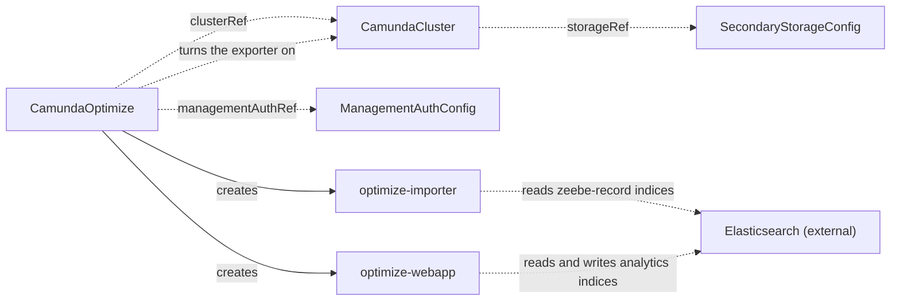

# CamundaOptimize

`CamundaOptimize` runs Camunda Optimize for one orchestration cluster. You create it, or another tool creates it for you.

Optimize reads the Zeebe records that the cluster exports to Elasticsearch, and it writes its own analytics indices to the same Elasticsearch. It is not part of the orchestration cluster. It has its own version, its own deployment lifecycle, and it signs in against Management Identity instead of the built-in authentication of the cluster.

The operator creates two Deployments and their Services: the webapp, which serves the user interface, and the importer, which reads the exported records. It also turns the Elasticsearch exporter of the cluster on. That exporter is off by default from Camunda 8.8, and without it the source indices that Optimize reads are never written.

The cluster must store its data in Elasticsearch. Optimize does not read an RDBMS secondary storage.

!!! note "A private certificate authority is a setting of the cluster"
    Optimize reads the `zeebe-record` indices that the Zeebe Elasticsearch exporter writes. The exporter reaches an HTTPS endpoint only when the broker trusts its certificate. A cluster on an [ElasticsearchCluster](elasticsearchcluster.md) trusts it without a step from you. For an Elasticsearch of your own behind a private authority, name the CA Secret under `elasticsearch.caSecretRef` of the `SecondaryStorageConfig`, see [Secondary storage over TLS](camundacluster.md#secondary-storage-over-tls). Without it, Optimize reads no records.

The smallest manifest names the cluster, the authentication contract, and the version:

```yaml
apiVersion: core.camunda.io/v1
kind: CamundaOptimize
metadata:
  name: my-cluster-optimize
  namespace: my-cluster-ns
spec:
  version: "8.9.0"
  managementAuthRef: management-auth
  clusterRef:
    name: my-cluster
```



## What you get

The operator creates two Deployments in the namespace of the resource, and one Service of the same name in front of each:

| Deployment and Service | What it does | Service ports |
| --- | --- | --- |
| `<name>-webapp` | Serves the Optimize user interface. | `http` 8090, `management` 8092 |
| `<name>-importer` | Reads the exported records and writes the analytics indices. | `http` 8090, `management` 8092 |

A Service name stops at 63 characters, which is the tightest bound of the derived names. A `CamundaOptimize` name that is too long to carry the suffix is cut, and a hash of the full name is added. Two such resources stay apart. The operator applies the same bound to the Secrets that it mirrors into the namespace, and to the value of the `camunda.io/cluster` label.

Read the names back with `kubectl get deploy,svc -l camunda.io/cluster=<cluster>`. The selector matches while the cluster name is 63 characters or less. For a longer name the label carries the cut form. `kubectl get deploy --show-labels` shows the value to select on.

`kubectl describe camundaoptimize <name>` shows the condition messages that the table under [Status](#status) tells you to read. The kind carries no printer columns yet, so `kubectl get camundaoptimize` shows the name and the age alone. To see the state of every one at once, ask for the condition:

```bash
kubectl get camundaoptimize -o custom-columns='NAME:.metadata.name,READY:.status.conditions[?(@.type=="Ready")].status,REASON:.status.conditions[?(@.type=="Ready")].reason'
```

The operator creates no Ingress and no route from outside the Kubernetes cluster. To open the user interface, publish `<name>-webapp` yourself, or reach it for a moment with `kubectl port-forward svc/<name>-webapp 8090:8090`.

## The exporter settings on the cluster

The operator adds five entries to `spec.zeebe.extraEnv` of the referenced cluster. Three carry a value. The two credentials carry a reference to the Secret that `credentialsSecretRef` of the storage contract names:

| Entry | What it carries |
| --- | --- |
| `CAMUNDA_DATA_EXPORTERS_ELASTICSEARCH_CLASSNAME` | The exporter class, as a value. |
| `CAMUNDA_DATA_EXPORTERS_ELASTICSEARCH_ARGS_URL` | The Elasticsearch endpoint of the contract, as a value. |
| `CAMUNDA_DATA_EXPORTERS_ELASTICSEARCH_ARGS_INDEX_PREFIX` | `zeebe-record`, as a value. |
| `CAMUNDA_DATA_EXPORTERS_ELASTICSEARCH_ARGS_AUTHENTICATION_USERNAME` | A `secretKeyRef` to the username key. |
| `CAMUNDA_DATA_EXPORTERS_ELASTICSEARCH_ARGS_AUTHENTICATION_PASSWORD` | A `secretKeyRef` to the password key. |

No credential is written to the `CamundaCluster`. The kubelet reads the Secret and gives the value to the broker container, so the password never appears in the spec of the cluster, and rotating the Secret does not change these entries.

It owns those five entries, under its own field manager. Every other entry on the list stays as it is, whether you or a GitOps tool put it there. The operator changes nothing else on the cluster.

These entries are part of the Zeebe pod template. Attaching Optimize therefore rolls the Zeebe pods of the cluster, and so does deleting it. Plan the first attach like any other cluster change.

The index prefix is `zeebe-record` and there is no field for it. The operator sets both sides, the exporter on the cluster and the importer of Optimize, so the two always agree.

One case needs your attention. The cluster can already carry an entry under one of the five names above. Two outcomes are possible.

Your entry can supply a literal value where the operator supplies a Secret reference, or the reverse. `Ready` then reports `ExporterConflict`, and the message names the entry. The operator reads the Elasticsearch password from a Secret, so a literal password under that name collides with it. Delete your entry from the cluster. The operator then applies its own.

If your entry supplies its value the same way as the operator, it is not a conflict. The operator takes the entry over and its value wins. A GitOps tool that also manages that entry fights the operator for it, so remove those five names from what your tool manages.

The entries change only when the storage contract of the cluster changes, such as a new Elasticsearch endpoint. Rotating the password behind the Secret does not change them, so it does not roll the Zeebe pods.

## One Optimize for one cluster

One cluster carries one Optimize instance. The Optimize index prefix is fixed, so two instances write the same analytics indices in the same Elasticsearch. There is no second instance for high availability. Scale `spec.webapp.replicas` to serve the user interface from more than one pod.

The API server accepts a second `CamundaOptimize` that names a cluster that is already attached. The operator picks one holder, the oldest, with the name breaking a tie. Every other one reports `ClusterAlreadyAttached`, names the holder in the message, creates no workloads, and changes nothing on the cluster. If you delete the holder, the next one takes the cluster.

`spec.clusterRef` is immutable. To attach Optimize to another cluster, delete this resource and create a new one.

## Handover

The attachment moves in two cases. You delete the holder, and a waiting resource takes the cluster. Or a new resource turns out to be the older one and takes the cluster from a holder that already runs.

The second case is narrow. A creation timestamp records whole seconds, so two resources created in the same second are equally old, and then the name decides. A resource created a moment after the holder, with a name that sorts earlier, therefore wins.

On both paths the resource that had the attachment deletes its own workloads first. The new one reports `WaitingForHandover` and creates nothing until the importer Deployment of the previous one is gone.

Pods that are already ordered to stop can run for their termination grace period after that Deployment goes. A short overlap of two importers is therefore still possible.

## Authentication

`spec.managementAuthRef` names a [ManagementAuthConfig](managementauthconfig.md), which is cluster-scoped. Its `clientSecretRef` names one Secret in one namespace, for every consumer.

A pod reads a Secret of its own namespace only. When a referenced Secret lives in another namespace, the operator copies it into the namespace of the `CamundaOptimize` and points the pods at the copy. `MirroredSecretsReady` reports on those copies.

Optimize connects its Identity SDK to `spec.baseUrl` of the contract. The SDK reads tenants and users from the API of Management Identity, so `baseUrl` is the root of that service. It is not the Identity URL of the orchestration cluster.

See the [ManagementAuthConfig](managementauthconfig.md) page for the fields of the contract and the keys its Secret must carry.

### The login callback

A person who opens the Optimize user interface is sent to the identity provider and then back. The identity provider accepts only the callback URLs that its Optimize client lists, so that URL has to be registered before anybody signs in.

Where you register it depends on who runs the identity provider:

- A [CamundaManagementCluster](camundamanagementcluster.md) in one of the two Keycloak modes registers it for you. Set `spec.optimize.externalUrl` on that resource to the URL a browser reaches Optimize at. Management Identity then creates the `optimize` Keycloak client with the callback under it.
- A `CamundaManagementCluster` in the `oidc` mode registers nothing. You created the Optimize application at your provider yourself, so add the callback there. Camunda names the exact path in [component-specific configuration](https://docs.camunda.io/docs/self-managed/components/management-identity/configuration/connect-to-an-oidc-provider/#component-specific-configuration).

One management plane bootstraps one Optimize client with one URL. To run a second `CamundaOptimize` against the same management plane, add its callback URL to that client yourself.

A callback URL that does not match is a failed sign-in. It does not change the status of this resource. `Ready` stays `Healthy`, and the identity provider shows the error in the browser.

## Versions

`spec.version` is the Optimize version, as a full semantic version such as `8.9.0`. Optimize has its own patch line, so this is not inherited from the cluster.

The major and the minor must match the effective version of the cluster. Camunda supports Optimize only on a matching minor. A difference reports `VersionMismatch`, and the message names both versions, so it tells you which minor to use.

The effective version of the cluster is `spec.version` of the `CamundaCluster`, or the value its `presetRef` supplies when the cluster sets none. An upgrade of the cluster to a new minor therefore puts Optimize into `VersionMismatch` until you raise `spec.version` here as well. The workloads that already run stay as they are while the versions disagree. The operator applies nothing new until they match again.

## Suspension

The importer reads Elasticsearch directly. It does not go through the orchestration cluster, so it keeps reading whether or not that cluster runs.

`spec.suspend` on the referenced `CamundaCluster` therefore reaches the Optimize workloads too. The operator scales the webapp and the importer to zero with the workloads of the cluster, and starts them again when you clear the field. `suspend` means "stop everything attached to this cluster", not "stop the workloads of this cluster".

`Ready` reads `True` with reason `Suspended` while the suspension holds, the same as the cluster itself reports. Zero replicas is the state you asked for, so this is not an error. The condition does not name the cluster, but the events do: `kubectl describe camundaoptimize <name>` shows `ClusterSuspended` when the workloads go to zero and `ClusterResumed` when they start again.

The operator keeps the exporter settings on the cluster while the suspension holds. A suspension is not a detachment, and the brokers are at zero, so nothing exports. Only deletion withdraws the settings.

## Stopping the import

Set `spec.importer.replicas` to `0` to stop the import while the cluster keeps running. Use it for an index rewrite. The webapp keeps serving what is already imported. Set it back to `1` to start the import again.

Zero replicas is the state you asked for, so `ImporterReady` stays healthy and `Ready` stays `True` while the import is off. Do not use `Ready` alone to tell you that data still arrives. Watch the ready replicas of the `<name>-importer` Deployment, or the age of the newest document in the Optimize indices.

!!! warning "Do not set the importer variables through `extraEnv`"
    An entry of `extraEnv` replaces the entry of the same name that the operator renders. Two of those names decide what a pod does.

    `CAMUNDA_OPTIMIZE_ZEEBE_ENABLED` is the switch that makes a pod an importer. A webapp that carries it becomes a second importer on the same indices, which is the state that one Optimize per cluster exists to prevent. `CAMUNDA_OPTIMIZE_ZEEBE_NAME` is the index prefix the importer reads. A changed prefix makes Optimize read indices that no exporter writes.

    The operator does not refuse those entries. `extraEnv` is the same escape hatch on every kind of this operator, and it overrides a rendered setting by design.

## Rollouts

The importer is replaced, not rolled: the old pod stops before the new one starts. A rolling update does the reverse. Two importers that write the same indices at the same time make the analytics data inconsistent. A new version or a changed setting therefore stops the import for the length of one restart.

The webapp rolls in the usual way and keeps serving during the change.

The pod templates carry a hash of the settings the operator resolves. When a referenced Secret changes, such as a rotated Elasticsearch password, the pods roll and pick the new value up. You restart nothing by hand. The importer is replaced during that roll, so a credential rotation stops the import for the length of one restart.

A Secret that you attach yourself through `extraEnv` or `extraEnvFrom` is not part of the hash. Roll the workload yourself after you change one.

## Monitoring

Set `spec.monitoring.serviceMonitor.enabled` to `true` to get one ServiceMonitor per Deployment. They scrape `/actuator/prometheus` on the `management` port, 8092. Use `spec.monitoring.serviceMonitor.labels` to add the label that your Prometheus instance selects on.

The operator creates them only when the Kubernetes cluster serves the `ServiceMonitor` kind. It reads that on each reconcile, so you can install the Prometheus operator after the fact.

## Deletion

When you delete the `CamundaOptimize`, the operator removes the exporter settings it added to the cluster. Entries that you own stay. The Deployments, the Services, the ServiceMonitors, and the copies of referenced Secrets carry an owner reference, so Kubernetes removes them.

The analytics indices in Elasticsearch are not removed. Delete them yourself if you want the storage back. A new `CamundaOptimize` on the same cluster reads the indices that are already there.

The `zeebe-record` indices belong to the cluster and stay. The cluster stops writing new records to them, because the exporter settings are gone.

A `CamundaOptimize` that never held the attachment removes nothing from the cluster.

## Status

| Type | Reason | Meaning | What to do |
| --- | --- | --- | --- |
| `MirroredSecretsReady` | `Healthy` / `Disabled` | Every copy of a referenced Secret from another namespace is applied, or no such Secret exists. | Nothing. |
| `WebappReady` | `Healthy` | Every webapp replica is ready. | Nothing. |
| `ImporterReady` | `Healthy` | The importer replica is ready, or `spec.importer.replicas` is `0`. | Nothing. |
| `WebappReady` / `ImporterReady` | `Creating` / `Updating` / `Scaling` | The Deployment rolls out or scales. | Wait. |
| `WebappReady` / `ImporterReady` | `Suspended` | The referenced cluster is suspended, so the Deployment is at zero. | Nothing. See [Suspension](#suspension). |
| `WebappReady` / `ImporterReady` | `Failing` | The Deployment has replicas that do not become ready. | Read the pods of the named Deployment. |
| `WebappReady` / `ImporterReady` | `Degraded` / `Down` | Some or no replicas are ready after the grace period. | Read the pods and events of the named Deployment. |
| `Ready` | `Healthy` | Every condition that takes part is healthy. | Nothing. |
| `Ready` | `Creating` / `Updating` / `Scaling` / `Failing` / `Degraded` / `Down` | The reason of the governing condition. The message names it. | Read the row of that condition. |
| `Ready` | `Suspended` | `spec.suspend` of the referenced cluster is `true`, and both workloads are at zero. `Ready` is `True`. | Nothing. Set `suspend` back to `false` on the cluster to start Optimize again. |
| `Ready` | `ClusterAlreadyAttached` | Another `CamundaOptimize` is already attached to the referenced cluster. | Delete one of the two. The message names the one that holds the cluster. |
| `Ready` | `WaitingForHandover` | This resource now holds the cluster, and the importer Deployment of the previous one still exists. | Wait. The message names the Deployment. The state clears on its own. |
| `Ready` | `InvalidReference` | The `clusterRef`, the `managementAuthRef`, or the `storageRef` chain of the cluster does not resolve. It also reports a referenced cluster whose effective spec is invalid, such as a version below `8.9.0`. | Read the message. Create the missing resource, or correct the field it names. |
| `Ready` | `StorageTypeMismatch` | The `storageRef` of the cluster resolves to a `SecondaryStorageConfig` of type `rdbms`. Optimize reads Elasticsearch only. | Attach Optimize to a cluster on Elasticsearch secondary storage. |
| `Ready` | `VersionMismatch` | The major and the minor of `spec.version` differ from those of the effective version of the cluster. | Set `spec.version` to a release on the minor of the cluster. |
| `Ready` | `MissingSecret` | A referenced Secret does not exist or lacks a key. | Create the Secret with the named key. |
| `Ready` | `ExporterConflict` | `spec.zeebe.extraEnv` of the cluster already carries an exporter name, and that entry supplies its value the other way. | Remove the named entries from the cluster. |

`Ready` is `True` only when every condition that takes part in it is `True`. When one of them is not `True`, `Ready` repeats its reason and its message, and the message names the condition it came from. Read the row of that condition to know what to do.

`WebappReady` and `ImporterReady` always take part. `MirroredSecretsReady` takes part when a referenced Secret lives in another namespace, and reports `Disabled` when none does.

`status.observedGeneration` is the last generation the operator reconciled.

## Spec reference

`webapp` and `importer` are the same workload block as the per-process sections of [CamundaCluster](camundacluster.md). There is no `platformConfigRef`. The image registry and the license come from the platform config of the referenced cluster.

```yaml
apiVersion: core.camunda.io/v1
kind: CamundaOptimize
metadata:
  name: my-cluster-optimize
  namespace: my-cluster-ns
spec:
  # string. Required. Optimize version, as a full semantic version. Its minor must match the minor of the cluster.
  version: "8.9.0"
  # string. Required. Name of the cluster-scoped ManagementAuthConfig that Optimize signs in against.
  managementAuthRef: management-auth
  # object. Required. The CamundaCluster this Optimize instance attaches to. Immutable.
  clusterRef:
    # string. Required. Name of the CamundaCluster, in this namespace.
    name: my-cluster
  # object. Optional. The Optimize webapp Deployment, which serves the user interface.
  webapp:
    # integer. Optional, default: 1. Number of webapp replicas.
    replicas: 1
    # object. Optional. Resource requests and limits for the webapp pods.
    resources:
      requests:
        cpu: "500m"
        memory: 1Gi
      limits:
        cpu: "1"
        memory: 2Gi
    # list. Optional. Extra environment variables for the webapp pods.
    extraEnv: []
    # list. Optional. Extra envFrom sources (ConfigMap or Secret) for the webapp pods.
    extraEnvFrom: []
    # map. Optional. Extra labels on the webapp pods.
    podLabels: {}
    # map. Optional. Extra annotations on the webapp pods.
    podAnnotations: {}
    # object. Optional. Scheduling constraints (nodeAffinity, tolerations, podAffinity) for the webapp pods.
    scheduling: {}
  # object. Optional. The Optimize importer Deployment, which reads the zeebe-record indices.
  importer:
    # integer. Optional, default: 1. Number of importer replicas. Must be 0 or 1. Set 0 to stop the import.
    replicas: 1
    # object. Optional. Resource requests and limits for the importer pod.
    resources:
      requests:
        cpu: "500m"
        memory: 1Gi
      limits:
        cpu: "1"
        memory: 2Gi
    # list. Optional. Extra environment variables for the importer pod.
    extraEnv: []
    # list. Optional. Extra envFrom sources (ConfigMap or Secret) for the importer pod.
    extraEnvFrom: []
    # map. Optional. Extra labels on the importer pod.
    podLabels: {}
    # map. Optional. Extra annotations on the importer pod.
    podAnnotations: {}
    # object. Optional. Scheduling constraints (nodeAffinity, tolerations, podAffinity) for the importer pod.
    scheduling: {}
  # object. Optional. Prometheus integration.
  monitoring:
    # object. Optional. ServiceMonitor creation for both Deployments.
    serviceMonitor:
      # boolean. Optional, default: false. Create one ServiceMonitor per Deployment.
      enabled: true
      # map. Optional. Extra labels on the ServiceMonitors.
      labels: {}
      # map. Optional. Extra annotations on the ServiceMonitors.
      annotations: {}
```

### Validation rules

The API server enforces these at admission:

- `spec.version` must be a full semantic version such as `8.9.0`. A two-segment version is rejected.
- `spec.managementAuthRef` and `spec.clusterRef.name` must not be empty.
- `spec.importer.replicas` must be `0` or `1`. Optimize supports one active importer, and more than one makes the analytics data inconsistent.
- `spec.clusterRef` is immutable.

The operator checks more at reconcile time and reports the result on `Ready`:

- The references resolve.
- The secondary storage of the cluster is Elasticsearch.
- The minor of `spec.version` matches the minor of the cluster.
- No other `CamundaOptimize` holds the cluster.
- No exporter name collides with an entry on the cluster.

### A production-shaped example

```yaml
apiVersion: core.camunda.io/v1
kind: CamundaOptimize
metadata:
  name: my-cluster-optimize
  namespace: my-cluster-ns
spec:
  version: "8.9.0"
  managementAuthRef: management-auth
  clusterRef:
    name: my-cluster
  webapp:
    replicas: 2
    resources:
      requests:
        cpu: "500m"
        memory: 1Gi
      limits:
        cpu: "1"
        memory: 2Gi
  importer:
    replicas: 1
    resources:
      requests:
        cpu: "1"
        memory: 2Gi
      limits:
        cpu: "2"
        memory: 4Gi
  monitoring:
    serviceMonitor:
      enabled: true
```

### The import during a restore

A [LogicalRestoreElasticsearch](logicalrestoreelasticsearch.md) needs a suspended target cluster, and it replaces the Elasticsearch indices under it. An importer that keeps running through that restore reads indices that are half restored, writes analytics from them, and keeps an import position that disagrees with the restored data. The analytics are then wrong, and nothing reports it, because zero replicas was never asked for.

The operator closes that for you. A restore suspends the cluster, and the Optimize workloads follow it to zero, as [Suspension](#suspension) describes. You do not have to stop the import by hand.

Set `spec.importer.replicas` to `0` yourself only when you rewrite the indices without suspending the cluster:

```yaml
apiVersion: core.camunda.io/v1
kind: CamundaOptimize
metadata:
  name: my-cluster-optimize
  namespace: my-cluster-ns
spec:
  version: "8.9.0"
  managementAuthRef: management-auth
  clusterRef:
    name: my-cluster
  importer:
    replicas: 0
```

## Related

- [CamundaCluster](camundacluster.md): referenced through `clusterRef`. The operator adds the exporter settings to `spec.zeebe.extraEnv` of that cluster.
- [ManagementAuthConfig](managementauthconfig.md): referenced through `managementAuthRef`.
- [SecondaryStorageConfig](secondarystorageconfig.md): resolved through the `storageRef` of the cluster. It carries the Elasticsearch endpoint and credentials.
- [CamundaManagementCluster](camundamanagementcluster.md): produces the `ManagementAuthConfig` in a self-managed installation.
- [LogicalBackupElasticsearch](logicalbackupelasticsearch.md): backs up the cluster, which includes the `zeebe-record` indices that Optimize reads. It does not back up the Optimize analytics indices. Optimize keeps those behind a backup API of its own, which no controller calls yet.
- [ElasticsearchCluster](elasticsearchcluster.md): the ECK-managed Elasticsearch behind the contract.
