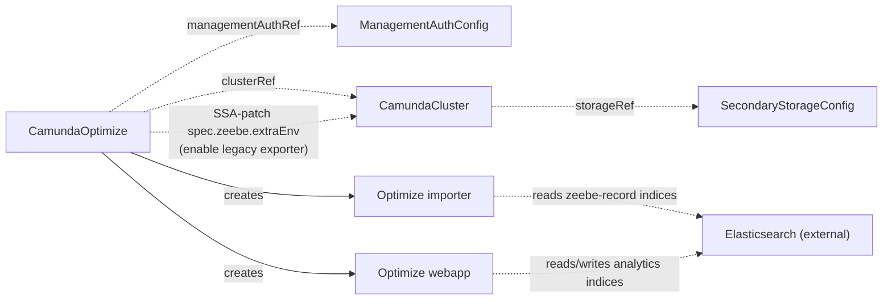

# CamundaOptimize

Deploys an Optimize instance for one orchestration cluster and wires up the export pipeline it reads from.

!!! warning "Not implemented yet"
    The operator does not implement this kind yet. This page describes the planned design.

## Purpose

`CamundaOptimize` runs Camunda Optimize as an extension attached to a `CamundaCluster`.
Optimize is not part of the orchestration cluster: it authenticates against Management Identity (via a `ManagementAuthConfig` contract CRD) instead of the cluster's built-in auth, and it has its own deployment lifecycle.
It is however always per-cluster — each Optimize instance reads data from exactly one cluster's secondary storage — so you create one `CamundaOptimize` per `CamundaCluster` that needs analytics.
You create this CR yourself, or a composition layer above may create it alongside the cluster.

This page is one of the extension-pattern exemplars described in the [architecture overview](../architecture.md): the controller attaches to a cluster it does not own, and the only change it makes to the cluster is a narrowly scoped Server-Side Apply (SSA) patch.

## How it works

The operator reconciles a `CamundaOptimize` in the following steps:

1. Resolve `clusterRef` to the target `CamundaCluster` and read its `storageRef` to find the cluster's `SecondaryStorageConfig`; the referenced storage must be of type `elasticsearch` — a cluster on RDBMS secondary storage is reported as `Ready=False` with reason `StorageTypeMismatch`, because Optimize does not support RDBMS backends.
2. Resolve `managementAuthRef` to a `ManagementAuthConfig` and verify its `clientSecretRef` secret exists.
3. SSA-patch `spec.zeebe.extraEnv` on the referenced `CamundaCluster` to enable the legacy Zeebe Elasticsearch exporter with the fixed index prefix `zeebe-record`, using the field manager `camunda-operator/camundaoptimize`; the patch owns only the exporter-related environment variables, and nothing else on the cluster — this controller never reconciles the cluster itself.
4. Deploy the Optimize webapp Deployment and the Optimize importer Deployment into the CR's namespace, labeled with `camunda.io/cluster` (the referenced cluster's name) and `camunda.io/component` (`optimize-webapp` / `optimize-importer`).
5. Configure the importer with Zeebe data import enabled (`CAMUNDA_OPTIMIZE_ZEEBE_ENABLED=true`), the matching index prefix (`CAMUNDA_OPTIMIZE_ZEEBE_NAME=zeebe-record`), and `CAMUNDA_OPTIMIZE_ZEEBE_PARTITION_COUNT` set to the referenced cluster's `zeebe.partitions`, so the importer reads all partitions; webapp replicas run with import disabled, because Optimize supports at most one active importer per instance.
6. Point both deployments at the Elasticsearch endpoint and credentials from the resolved `SecondaryStorageConfig`; Optimize reads the `zeebe-record` indices and writes its own analytics indices to the same Elasticsearch.
7. When `monitoring.serviceMonitor.enabled` is set, create a ServiceMonitor per deployment.
8. Update status conditions and `status.observedGeneration`.

No index prefix fields exist on the CRD: the operator controls both the exporter side (on the cluster) and the importer side (on Optimize), so the `zeebe-record` prefix is fixed by design.

Optimize connects directly to Elasticsearch and never talks to the orchestration cluster's API.



!!! note "Verified against Camunda 8.9"
    The legacy Zeebe exporter is disabled by default since Camunda 8.8 (`orchestration.exporters.zeebe.enabled: false` in the reference Helm chart), so enabling it is genuinely this controller's job — without the SSA patch, the `zeebe-record` source indices are never created.
    The exporter's default index prefix is `zeebe-record`, and Optimize's importer default (`zeebe.name`) is also `zeebe-record`, so both sides agree with the fixed prefix used here.
    Since 8.8 the exporter emits only the record types Optimize needs by default, and 8.9 adds optional Optimize-focused export filters (such as `optimize-mode-enabled` and variable filters) for further tuning.

## API reference

`clusterRef` is the same type as on the backup kinds: a name in the namespace of this CR. `webapp` and `importer` are the same workload block as the per-process sections of [CamundaCluster](camundacluster.md), and `monitoring.serviceMonitor` is the same block as on the other kinds that run workloads. There is no `platformConfigRef`: the image registry and the license come from the platform config of the referenced cluster.

```yaml
apiVersion: core.camunda.io/v1
kind: CamundaOptimize
metadata:
  name: my-cluster-optimize
  namespace: my-cluster-ns
spec:
  # string. Required. Optimize version to deploy, as a full semantic version. Its minor must match the cluster's.
  version: "8.9.0"
  # string. Required. Name of the cluster-scoped ManagementAuthConfig providing Management Identity OIDC settings.
  managementAuthRef: "management-auth"
  # object. Required. Reference to the CamundaCluster this Optimize instance attaches to, in this CR's namespace.
  clusterRef:
    # string. Required. Name of the CamundaCluster.
    name: my-cluster
  # object. Optional. The Optimize webapp deployment.
  webapp:
    # integer. Optional, default: 1. Number of webapp replicas; webapp replicas run with data import disabled.
    replicas: 1
    # object. Optional. Kubernetes resource requests and limits for the webapp pods.
    resources:
      requests:
        cpu: "500m"
        memory: 1Gi
      limits:
        cpu: "1"
        memory: 2Gi
    # list. Optional. Additional environment variables for the webapp pods.
    extraEnv: []
    # list. Optional. Additional envFrom sources (ConfigMap/Secret) for the webapp pods.
    extraEnvFrom: []
    # map. Optional. Extra labels applied to the webapp pods.
    podLabels: {}
    # map. Optional. Extra annotations applied to the webapp pods.
    podAnnotations: {}
    # object. Optional. Scheduling constraints (nodeAffinity, tolerations, podAffinity) for the webapp pods.
    scheduling: {}
  # object. Optional. The Optimize importer deployment; reads zeebe-record indices from Elasticsearch.
  importer:
    # integer. Optional, default: 1. Number of importer replicas; must be 1 — Optimize supports only one active importer.
    replicas: 1
    # object. Optional. Kubernetes resource requests and limits for the importer pod.
    resources:
      requests:
        cpu: "500m"
        memory: 1Gi
      limits:
        cpu: "1"
        memory: 2Gi
    # list. Optional. Additional environment variables for the importer pod.
    extraEnv: []
    # list. Optional. Additional envFrom sources (ConfigMap/Secret) for the importer pod.
    extraEnvFrom: []
    # map. Optional. Extra labels applied to the importer pod.
    podLabels: {}
    # map. Optional. Extra annotations applied to the importer pod.
    podAnnotations: {}
    # object. Optional. Scheduling constraints (nodeAffinity, tolerations, podAffinity) for the importer pod.
    scheduling: {}
  # object. Optional. Prometheus scraping integration.
  monitoring:
    # object. Optional. ServiceMonitor creation for the webapp and importer deployments.
    serviceMonitor:
      # boolean. Optional, default: false. Create a ServiceMonitor per deployment.
      enabled: true
      # map. Optional. Extra labels applied to all created ServiceMonitors.
      labels: {}
      # map. Optional. Extra annotations applied to all created ServiceMonitors.
      annotations: {}
```

## Status

`Ready` is `True` only when both Deployments are `True`. Its reason and message come from the Deployment that governs: the one whose status has the highest priority among those that are not `True`, or the highest of both when both are `True`.

| Type | Reason | Meaning |
| --- | --- | --- |
| `WebappReady` | `Healthy` | Every webapp replica is ready. |
| `ImporterReady` | `Healthy` | The importer replica is ready. |
| `WebappReady` / `ImporterReady` | `Creating` / `Updating` / `Scaling` | The Deployment rolls out or scales. |
| `WebappReady` / `ImporterReady` | `Failing` | The Deployment has replicas that do not become ready. |
| `WebappReady` / `ImporterReady` | `Degraded` / `Down` | Some or no replicas are ready after the grace period. |
| `Ready` | `Healthy` | Both Deployments are healthy. |
| `Ready` | `Creating` / `Updating` / `Scaling` / `Failing` / `Degraded` / `Down` | The reason of the governing Deployment. The message names it. |
| `Ready` | `InvalidReference` | The `clusterRef`, `managementAuthRef`, or the cluster's `storageRef` chain could not be resolved. |
| `Ready` | `StorageTypeMismatch` | The cluster's `storageRef` resolves to a `SecondaryStorageConfig` of type `rdbms`. Optimize reads Elasticsearch only. |
| `Ready` | `MissingSecret` | A referenced secret (Management Identity client secret or Elasticsearch credentials) does not exist or lacks the required key. |
| `Ready` | `VersionMismatch` | The major and minor of `spec.version` differ from those of the referenced cluster's effective version; Camunda supports Optimize only on a matching minor. |

The operator records the last reconciled generation in `status.observedGeneration`.

## Validation

- `spec.importer.replicas` must be `1`: Optimize supports at most one active importer per instance, and running more causes data inconsistencies.
- `spec.version` must be a full semantic version such as `8.9.0`. Optimize has its own patch line, so a two-segment version or an inherited cluster version is rejected.
- `spec.managementAuthRef` and `spec.clusterRef.name` must be non-empty.
- Cross-resource: the referenced cluster's `storageRef` must resolve to a `SecondaryStorageConfig` of type `elasticsearch`; a cluster on RDBMS secondary storage is rejected at reconcile time and surfaced as `Ready=False` with reason `StorageTypeMismatch`, because Optimize does not support RDBMS backends.
- Cross-resource: the major and minor of `spec.version` must equal those of the referenced cluster's effective version; a difference is surfaced as `Ready=False` with reason `VersionMismatch`.

## Relationships

- [CamundaCluster](camundacluster.md) — referenced via `clusterRef`; the operator SSA-patches `spec.zeebe.extraEnv` on it to enable the legacy Zeebe exporter, and never touches anything else on the cluster.
- [ManagementAuthConfig](managementauthconfig.md) — referenced via `managementAuthRef`; provides the Management Identity OIDC configuration Optimize authenticates with.
- [SecondaryStorageConfig](secondarystorageconfig.md) — resolved indirectly through the referenced cluster's `storageRef`; provides the Elasticsearch endpoint and credentials Optimize reads from and writes to.
- [CamundaManagementCluster](camundamanagementcluster.md) — produces the [ManagementAuthConfig](managementauthconfig.md) this CR consumes in self-managed installations.
- [LogicalBackupElasticsearch](logicalbackupelasticsearch.md) — while this CR is attached to a cluster, the backup drives Optimize's backup actuator with the same backup ID, so Optimize's analytics data (`camunda_optimize_<backupId>_*` snapshots) is included in the backup set.
- [LogicalRestore](logicalrestore.md) — restores the Optimize snapshots along with the rest of the set when the backup contains them.
- Elasticsearch itself is an external system reached through the contract; the ECK-managed cluster behind it is documented on the [ElasticsearchCluster](elasticsearchcluster.md) page.

## Examples

A minimal manifest:

```yaml
apiVersion: core.camunda.io/v1
kind: CamundaOptimize
metadata:
  name: my-cluster-optimize
  namespace: my-cluster-ns
spec:
  version: "8.9.0"
  managementAuthRef: "management-auth"
  clusterRef:
    name: my-cluster
```

A realistic manifest:

```yaml
apiVersion: core.camunda.io/v1
kind: CamundaOptimize
metadata:
  name: my-cluster-optimize
  namespace: my-cluster-ns
spec:
  version: "8.9.0"
  managementAuthRef: "management-auth"
  clusterRef:
    name: my-cluster
  webapp:
    replicas: 2
    resources:
      requests:
        cpu: "500m"
        memory: 1Gi
      limits:
        cpu: "1"
        memory: 2Gi
  importer:
    replicas: 1
    resources:
      requests:
        cpu: "1"
        memory: 2Gi
      limits:
        cpu: "2"
        memory: 4Gi
  monitoring:
    serviceMonitor:
      enabled: true
      labels:
        release: prometheus
```
