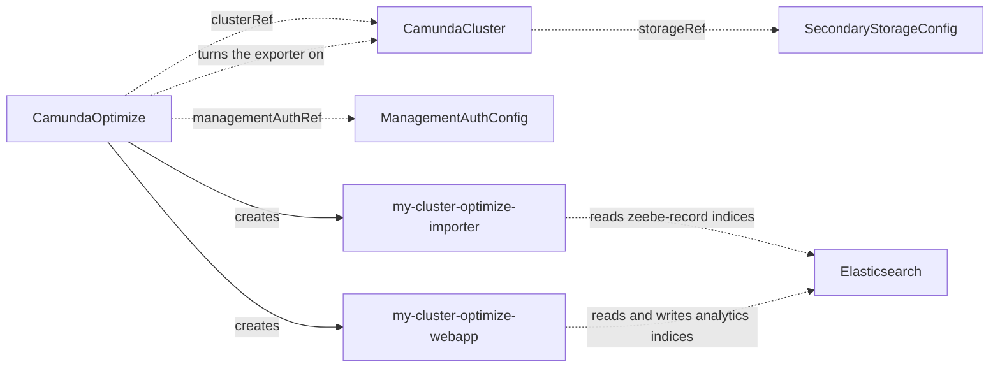

# CamundaOptimize

`CamundaOptimize` runs Camunda Optimize for one orchestration cluster. You create it, or another tool creates it for you.

Optimize reads the Zeebe records that the cluster exports to Elasticsearch, and it writes its own analytics indices to the same Elasticsearch. It is not part of the orchestration cluster. It has its own version, and it signs in against Management Identity instead of the built-in authentication of the cluster.

Before you create one, make sure that these exist:

- A [CamundaCluster](camundacluster.md) in the same namespace, on a [SecondaryStorageConfig](secondarystorageconfig.md) of type `elasticsearch`. Optimize does not read an RDBMS secondary storage.
- A [ManagementAuthConfig](managementauthconfig.md). A [CamundaManagementCluster](camundamanagementcluster.md) writes one for you.
- An Optimize version on the same minor as the cluster.
- If your own Elasticsearch uses a certificate from a private authority, the CA Secret on the storage contract. A [contract](index.md#contracts) is a resource that publishes the address and the credentials of a service for other resources to reference. See [Secondary storage over TLS](camundacluster.md#secondary-storage-over-tls). Without it, the exporter writes no records for Optimize.

The smallest manifest names the cluster, the authentication contract, and the version:

```yaml
apiVersion: core.camunda.io/v1
kind: CamundaOptimize
metadata:
  name: my-cluster-optimize
  namespace: my-cluster-ns
spec:
  version: "8.9.0"
  managementAuthRef: management-auth
  clusterRef:
    name: my-cluster
```


```mermaid
graph LR
    OPT[CamundaOptimize] -.->|clusterRef| CC[CamundaCluster]
    OPT -.->|managementAuthRef| MAC[ManagementAuthConfig]
    OPT -.->|"turns the exporter on"| CC
    CC -.->|storageRef| SSC[SecondaryStorageConfig]
    OPT -->|creates| WA["my-cluster-optimize-webapp"]
    OPT -->|creates| IMP["my-cluster-optimize-importer"]
    IMP -.->|"reads zeebe-record indices"| ES["Elasticsearch"]
    WA -.->|"reads and writes analytics indices"| ES
```

## What you get

The operator creates two Deployments in the namespace of the resource, and one Service of the same name in front of each:

| Deployment and Service | What it does | Service ports |
| --- | --- | --- |
| `<name>-webapp` | Serves the Optimize user interface. | `http` 8090, `management` 8092 |
| `<name>-importer` | Reads the exported records and writes the analytics indices. | `http` 8090, `management` 8092 |

A name that is too long for the suffix is cut, and a hash of the full name is added. Both Deployments carry the label `camunda.io/cluster` with the name of the cluster, so `kubectl get deploy,svc -l camunda.io/cluster=my-cluster` lists them next to the workloads of the cluster.

The operator creates no Ingress. To open the user interface, publish `<name>-webapp` yourself, or reach it for a moment with a port forward:

```bash
kubectl port-forward -n my-cluster-ns svc/my-cluster-optimize-webapp 8090:8090
```

`kubectl get camundaoptimize` shows whether each instance is ready, why, and the cluster it reads:

```
NAME                  READY   REASON    CLUSTER      AGE
my-cluster-optimize   True    Healthy   my-cluster   6m
```

## The exporter settings on the cluster

Optimize reads the `zeebe-record` indices that the Zeebe Elasticsearch exporter writes. From Camunda 8.8, that exporter is off by default. The operator turns it on: it adds these entries to `spec.zeebe.extraEnv` of the referenced cluster.

| Entry | Value |
| --- | --- |
| `CAMUNDA_DATA_EXPORTERS_ELASTICSEARCH_CLASSNAME` | The exporter class. |
| `CAMUNDA_DATA_EXPORTERS_ELASTICSEARCH_ARGS_URL` | The Elasticsearch endpoint of the storage contract. |
| `CAMUNDA_DATA_EXPORTERS_ELASTICSEARCH_ARGS_INDEX_PREFIX` | `zeebe-record`. |
| `CAMUNDA_DATA_EXPORTERS_ELASTICSEARCH_ARGS_AUTHENTICATION_USERNAME` | A `secretKeyRef` to the credentials Secret of the storage contract. |
| `CAMUNDA_DATA_EXPORTERS_ELASTICSEARCH_ARGS_AUTHENTICATION_PASSWORD` | A `secretKeyRef` to the credentials Secret of the storage contract. |
| `CAMUNDA_DATA_EXPORTERS_ELASTICSEARCH_ARGS_INDEX_NUMBEROFREPLICAS` | The [index replica count](#index-replicas). Only when a count applies. |

No password is written to the `CamundaCluster`. A rotated Elasticsearch password does not change these entries. The index prefix has no field: the operator sets the same prefix on the exporter and on the importer.

The operator owns only these entries, under the field manager `camunda-operator/camundaoptimize`. Every other entry of the list, and every other field of the cluster, stays as you or your GitOps tool wrote it. If your GitOps tool manages one of these names too, remove the name from what the tool manages. Otherwise the two keep changing the entry back.

The entries are part of the Zeebe pod template. So the first attachment of Optimize restarts the Zeebe pods of the cluster, and so does the deletion. Plan both like any other change of the cluster.

The cluster can already carry one of these names with the other kind of value. That is a literal where the operator needs a `secretKeyRef`, or the reverse. Then `Ready` reports `ExporterConflict`:

```yaml
status:
  conditions:
    - type: Ready
      status: "False"
      reason: ExporterConflict
      message: 'spec.zeebe.extraEnv of CamundaCluster "my-cluster" carries CAMUNDA_DATA_EXPORTERS_ELASTICSEARCH_ARGS_AUTHENTICATION_PASSWORD with the other kind of value; remove the entries or let the operator own them'
```

Remove the named entries from the cluster. The operator then applies its own. An entry that supplies its value the same way as the operator is no conflict: the operator takes it over, and its value wins.

## Index replicas

`spec.indexReplicas` sets the number of replicas of each Optimize index. It also sets the replicas of the `zeebe-record` indices that the exporter writes.

```yaml
apiVersion: core.camunda.io/v1
kind: CamundaOptimize
metadata:
  name: my-cluster-optimize
  namespace: my-cluster-ns
spec:
  indexReplicas: 0
  # ... the rest of your Optimize
```

When you do not set it, the [node count](secondarystorageconfig.md#node-count) of the storage contract gives the count. One node gives 0 replicas, and two or more nodes give 1 replica. Without a node count, Optimize and the exporter keep their own defaults. This count is separate from [`indexReplicas`](camundacluster.md#index-replicas) of the cluster.

A count that the nodes cannot place is kept. The indices then stay at yellow health, and the `CamundaOptimize` records a Warning event `IndexReplicasExceedNodes`:

```
indexReplicas 2 needs 3 Elasticsearch nodes, but the storage contract names 1. The indices stay yellow
```

Optimize applies the count to its existing indices each time it starts. The exporter applies it only to the `zeebe-record` indices that it creates after the change. A change of the count restarts the Optimize pods and the Zeebe pods of the cluster.

## One Optimize for one cluster

One cluster carries one Optimize instance, because two instances write the same analytics indices. To serve the user interface from more than one pod, scale `spec.webapp.replicas`. The importer runs one pod at most.

The API server accepts a second `CamundaOptimize` for a cluster that already has one. The oldest one holds the cluster. When two were created in the same second, the name that sorts first holds it. Every other one reports `ClusterAlreadyAttached`, names the holder in the message, and creates nothing.

If you delete the holder, the next one takes the cluster. It reports `WaitingForHandover` until the importer Deployment of the previous one is gone. While the pods of that importer still stop, the workloads stay at zero with reason `Suspended`, see [Suspension](#suspension). So two importers never write the indices at the same time.

`spec.clusterRef` is immutable. To attach Optimize to another cluster, delete this resource and create a new one.

## Authentication

`spec.managementAuthRef` names a cluster-scoped [ManagementAuthConfig](managementauthconfig.md). That page lists the fields of the contract and the keys its Secret must carry.

The client Secret of the contract, and the license Secret of the [CamundaPlatformConfig](camundaplatformconfig.md) of the cluster, can live in another namespace. When one does, the operator copies it into the namespace of the `CamundaOptimize`, as `<name>-optimize-auth-client` and `<name>-optimize-license`. `MirroredSecretsReady` reports on the copies.

Optimize reads tenants and users from `spec.baseUrl` of the contract. That URL is the root of Management Identity, not the Identity URL of the orchestration cluster.

### The login callback

After a person signs in, the identity provider sends the browser back to Optimize. The provider accepts only the callback URLs that its Optimize client lists.

- In the two Keycloak modes of a [CamundaManagementCluster](camundamanagementcluster.md), set `spec.externalUrl` to the URL of this Optimize in a browser. The management plane registers the callback for you. See [Optimize](camundamanagementcluster.md#optimize) on that page.
- In the `oidc` mode, the operator registers nothing, and `spec.externalUrl` has no effect. Add the callback of each Optimize to the Optimize application at your provider. Camunda names the path in [component-specific configuration](https://docs.camunda.io/docs/self-managed/components/management-identity/configuration/connect-to-an-oidc-provider/#component-specific-configuration).

```yaml
apiVersion: core.camunda.io/v1
kind: CamundaOptimize
metadata:
  name: my-cluster-optimize
  namespace: my-cluster-ns
spec:
  managementAuthRef: management-auth
  externalUrl: "https://optimize.camunda.example.com"
  # ... the rest of your Optimize
```

A missing callback does not change the status of this resource. The sign-in fails, and the identity provider shows the error in the browser.

## Versions

`spec.version` is the Optimize version, as a full semantic version such as `8.9.0`. Optimize has its own patch line, so it does not follow the version of the cluster.

The major and the minor must match the effective version of the cluster. That is `spec.version` of the `CamundaCluster`, or the version of its release. Camunda supports Optimize only on a matching minor. A difference reports `VersionMismatch`:

```
spec.version "8.9.0" is on minor 8.9; CamundaCluster "my-cluster" runs 8.10.0, on minor 8.10
```

To upgrade Optimize, raise `spec.version` to a release on the minor of the cluster. The importer stops for one restart, and the webapp rolls, see [Rollouts](#rollouts). When you upgrade the cluster to a new minor, Optimize reports `VersionMismatch` until you raise `spec.version` too. Both workloads keep running on the previous version in that time.

## Suspension

The Optimize workloads stop with the cluster. The importer reads Elasticsearch directly, so the operator scales the webapp and the importer to zero in these cases:

- The cluster is suspended: by `spec.suspend`, by a suspension hold, or by the operator. See [Suspend and pause](camundacluster.md#suspend-and-pause).
- The cluster does not hold its backend yet: the Elasticsearch that its storage contract points at. See [Secondary storage](camundacluster.md#secondary-storage).
- Another writer still writes that backend: pods of another cluster, the importer pods of a previous `CamundaOptimize`, or a restore into another cluster.

A [LogicalRestoreElasticsearch](logicalrestoreelasticsearch.md) suspends the cluster, so the import stops for the restore without a step from you.

While the workloads are at zero, `Ready` reads `True` with reason `Suspended`. `status.suspendedBy` says which case holds them:

```yaml
status:
  suspendedBy: Cluster
  conditions:
    - type: Ready
      status: "True"
      reason: Suspended
```

`suspendedBy` is `Cluster` for the first case, and `StorageClaim` for the other two. It is empty while the workloads follow their spec. The events of the `CamundaOptimize` name the cluster: `ClusterSuspended` or `StorageClaimAwaited` when the workloads go to zero, and `ClusterResumed` when they start again.

The exporter settings stay on the cluster while it is suspended. Only deletion removes them.

### A failed check

When a check of a reference fails, `Ready` carries the failure reason. The workloads then do this:

| State of the cluster | Workloads |
| --- | --- |
| Running | They keep the configuration that the operator applied last. A new instance creates none until the check passes. |
| Suspended | They go to zero. The message of `Ready` adds the suspension. |
| Resumed, while the check still fails | Those that stopped stay at zero until the check passes. The message of `Ready` ends with `The Optimize workloads that stopped stay at zero until the reference check passes`. |
| Deleted, or held by another `CamundaOptimize` | The operator removes them, and builds them again when the cluster returns or this instance holds it again. |

If the API server refuses to scale a workload to zero, that workload keeps running. The `CamundaOptimize` then records a Warning event `WorkloadStopRefused` with the refusal.

```yaml
status:
  conditions:
    - type: Ready
      status: "False"
      reason: InvalidReference
      message: SecondaryStorageConfig "my-cluster-ns/my-storage-config" not found
    - type: ImporterReady
      status: "True"
      reason: Healthy
```

## Stopping the import

To stop the import while the cluster keeps running, for example for an index rewrite, set `spec.importer.replicas` to `0`:

```yaml
apiVersion: core.camunda.io/v1
kind: CamundaOptimize
metadata:
  name: my-cluster-optimize
  namespace: my-cluster-ns
spec:
  importer:
    replicas: 0
  # ... the rest of your Optimize
```

The webapp keeps serving what is already imported. Set the field back to `1` to start the import again.

Zero replicas is the state you asked for, so `ImporterReady` and `Ready` stay `True`. `Ready` alone does not tell you that data still arrives. To know that, read the ready replicas of the `<name>-importer` Deployment.

!!! warning "Do not set the importer variables through `extraEnv`"
    An entry of `extraEnv` replaces the entry of the same name that the operator renders. The operator does not refuse one. Two names decide what a pod does. `CAMUNDA_OPTIMIZE_ZEEBE_ENABLED` makes a pod an importer, so a webapp that carries it becomes a second importer on the same indices. `CAMUNDA_OPTIMIZE_ZEEBE_NAME` is the index prefix that the importer reads, and no exporter writes a changed prefix.

## Rollouts

The importer is replaced, not rolled: the old pod stops before the new one starts. Two importers that write the same indices at the same time make the analytics data inconsistent. So a new version or a changed setting stops the import for the time of one restart. The webapp rolls and keeps serving.

When a resource that this `CamundaOptimize` references changes, the pods restart with the new value. So does a change to a key that Optimize reads from a referenced Secret, such as a rotated Elasticsearch password. A change to the labels or annotations of the Secret restarts nothing. A Secret that you attach yourself through `extraEnv` or `extraEnvFrom` does not restart the pods. Restart the workload yourself after you change one.

## Monitoring

Set `spec.monitoring.serviceMonitor.enabled` to `true` to get one ServiceMonitor per Deployment, with the name of the Deployment. It scrapes `/actuator/prometheus` on the `management` port, 8092. Add the label that your Prometheus selects on with `spec.monitoring.serviceMonitor.labels`.

The operator creates them only when the Kubernetes cluster serves the `ServiceMonitor` kind. If you install the Prometheus operator later, the operator creates them then.

## Deletion

When you delete the `CamundaOptimize`, the operator removes its exporter entries from the cluster and records the event `ExporterRemoved`. Entries that you own stay. Kubernetes removes the Deployments, the Services, the ServiceMonitors, and the copies of Secrets.

The analytics indices in Elasticsearch stay. Delete them yourself if you want the storage back. A new `CamundaOptimize` on the same cluster reads the indices that are already there.

The `zeebe-record` indices also stay. The cluster stops writing new records to them.

A `CamundaOptimize` that never held the cluster removes nothing from it.

## Status

| Type | Reason | Meaning | What to do |
| --- | --- | --- | --- |
| `MirroredSecretsReady` | `Healthy` / `Disabled` | Every copy of a Secret from another namespace is applied, or there is no such Secret. | Nothing. |
| `WebappReady` / `ImporterReady` | `Healthy` | Every replica is ready, or the replica count is `0`. | Nothing. |
| `WebappReady` / `ImporterReady` | `Creating` / `Updating` / `Scaling` | The Deployment rolls out or scales. The reason stays while a replica does not become ready, until the grace period ends. | Wait. If the reason stays, read the pods and events of the Deployment. |
| `WebappReady` / `ImporterReady` | `Suspending` / `Suspended` | The Deployment stops, or is at zero, with the cluster. | Nothing. See [Suspension](#suspension). |
| `WebappReady` / `ImporterReady` | `Failing` | The Deployment has replicas that do not become ready. | Read the pods of the Deployment. |
| `WebappReady` / `ImporterReady` | `Degraded` / `Down` | The Deployment is still not ready at the end of the [grace period](../architecture.md#status-conventions), 15 minutes by default. `Degraded` means that some replicas are ready. `Down` means that none is ready. | Read the pods and events of the Deployment. |
| `Ready` | `Healthy` | Every condition that takes part is healthy. | Nothing. |
| `Ready` | `Creating` / `Updating` / `Scaling` / `Failing` / `Degraded` / `Down` | The reason of the condition that governs `Ready`. The message names it. | Read the row of that condition. |
| `Ready` | `Suspended` | Both workloads are at zero with the cluster. `Ready` is `True`. | Nothing. Optimize starts again with the cluster. |
| `Ready` | `ClusterAlreadyAttached` | Another `CamundaOptimize` holds the cluster. The message names it. | Delete one of the two. |
| `Ready` | `WaitingForHandover` | This resource now holds the cluster, and the importer Deployment of the previous one still exists. The message names it. The pods of that importer are a separate wait, under `Suspended`. | Wait. It clears on its own. |
| `Ready` | `InvalidReference` | A referenced resource does not exist: the cluster, the `ManagementAuthConfig`, or a resource that the cluster references. It also reports a cluster whose effective spec is invalid, such as a version below `8.9.0`. | Read the message. Create the missing resource, or correct the field it names. |
| `Ready` | `StorageTypeMismatch` | The secondary storage of the cluster is of type `rdbms`. | Attach Optimize to a cluster on Elasticsearch. |
| `Ready` | `VersionMismatch` | The minor of `spec.version` differs from the minor of the cluster. | Set `spec.version` to a release on the minor of the cluster. |
| `Ready` | `MissingSecret` | A referenced Secret does not exist or lacks a key. | Create the Secret with the named key. |
| `Ready` | `ExporterConflict` | The cluster already carries an exporter entry with the other kind of value. | Remove the named entries from the cluster. |

`Ready` is `True` only when every condition that takes part in it is `True`. `WebappReady` and `ImporterReady` always take part. `MirroredSecretsReady` takes part only when a copy exists.

`status.suspendedBy` is described under [Suspension](#suspension).

`status.observedGeneration` is the last generation the operator reconciled.

## Spec reference

`webapp` and `importer` are the same workload block as the per-process sections of [CamundaCluster](camundacluster.md). There is no `platformConfigRef`: the image registry and the license come from the platform config of the referenced cluster.

```yaml
apiVersion: core.camunda.io/v1
kind: CamundaOptimize
metadata:
  name: my-cluster-optimize
  namespace: my-cluster-ns
spec:
  # string. Required. Optimize version, as a full semantic version. Its minor must match the minor of the cluster.
  version: "8.9.0"
  # string. Required. Name of the cluster-scoped ManagementAuthConfig that Optimize signs in against.
  managementAuthRef: management-auth
  # string. Optional. The URL a browser reaches this Optimize at. In the two Keycloak modes the management plane registers the login callback under it. Unused in the oidc mode.
  externalUrl: "https://optimize.camunda.example.com"
  # object. Required. The CamundaCluster this Optimize instance attaches to. Immutable.
  clusterRef:
    # string. Required. Name of the CamundaCluster, in this namespace.
    name: my-cluster
  # object. Optional. The Optimize webapp Deployment, which serves the user interface.
  webapp:
    # integer. Optional, default: 1. Number of webapp replicas.
    replicas: 1
    # object. Optional. Resource requests and limits for the webapp pods.
    resources:
      requests:
        cpu: "500m"
        memory: 1Gi
      limits:
        cpu: "1"
        memory: 2Gi
    # list. Optional. Extra environment variables for the webapp pods.
    extraEnv: []
    # list. Optional. Extra envFrom sources (ConfigMap or Secret) for the webapp pods.
    extraEnvFrom: []
    # map. Optional. Extra labels on the webapp pods.
    podLabels: {}
    # map. Optional. Extra annotations on the webapp pods.
    podAnnotations: {}
    # object. Optional. Scheduling constraints (nodeAffinity, tolerations, podAffinity) for the webapp pods.
    scheduling: {}
  # object. Optional. The Optimize importer Deployment, which reads the zeebe-record indices.
  importer:
    # integer. Optional, default: 1. Number of importer replicas. Must be 0 or 1. Set 0 to stop the import.
    replicas: 1
    # object. Optional. Resource requests and limits for the importer pod.
    resources:
      requests:
        cpu: "500m"
        memory: 1Gi
      limits:
        cpu: "1"
        memory: 2Gi
    # list. Optional. Extra environment variables for the importer pod.
    extraEnv: []
    # list. Optional. Extra envFrom sources (ConfigMap or Secret) for the importer pod.
    extraEnvFrom: []
    # map. Optional. Extra labels on the importer pod.
    podLabels: {}
    # map. Optional. Extra annotations on the importer pod.
    podAnnotations: {}
    # object. Optional. Scheduling constraints (nodeAffinity, tolerations, podAffinity) for the importer pod.
    scheduling: {}
  # integer. Optional, minimum 0. Replicas of each Optimize index and of each zeebe-record index. Default: 0 when the storage contract names one node, 1 when it names more, the Optimize default when it names no node count.
  indexReplicas: 0
  # object. Optional. Prometheus integration.
  monitoring:
    # object. Optional. ServiceMonitor creation for both Deployments.
    serviceMonitor:
      # boolean. Optional, default: false. Create one ServiceMonitor per Deployment.
      enabled: true
      # map. Optional. Extra labels on the ServiceMonitors.
      labels: {}
      # map. Optional. Extra annotations on the ServiceMonitors.
      annotations: {}
```

### Validation rules

The API server enforces these at admission:

- `spec.version` must be a full semantic version such as `8.9.0`. A two-segment version is rejected.
- `spec.managementAuthRef` must not be empty.
- `spec.externalUrl` must be an `http` or `https` URL with a host. It carries no comma, no whitespace, no query, and no fragment, and it does not end with a slash.
- `spec.importer.replicas` must be `0` or `1`.
- `spec.clusterRef` is immutable.

The rules below depend on live state, so the API server accepts a resource that breaks them. `Ready` reports the result:

- The references resolve.
- The secondary storage of the cluster is Elasticsearch.
- The minor of `spec.version` matches the minor of the cluster.
- No other `CamundaOptimize` holds the cluster.
- No exporter entry on the cluster has the other kind of value.

### A production-shaped example

```yaml
apiVersion: core.camunda.io/v1
kind: CamundaOptimize
metadata:
  name: my-cluster-optimize
  namespace: my-cluster-ns
spec:
  version: "8.9.0"
  managementAuthRef: management-auth
  externalUrl: "https://optimize.camunda.example.com"
  clusterRef:
    name: my-cluster
  webapp:
    replicas: 2
    resources:
      requests:
        cpu: "500m"
        memory: 1Gi
      limits:
        cpu: "1"
        memory: 2Gi
  importer:
    replicas: 1
    resources:
      requests:
        cpu: "1"
        memory: 2Gi
      limits:
        cpu: "2"
        memory: 4Gi
  monitoring:
    serviceMonitor:
      enabled: true
```

## Related

- [CamundaCluster](camundacluster.md): referenced through `clusterRef`. The operator adds the exporter entries to `spec.zeebe.extraEnv` of that cluster.
- [ManagementAuthConfig](managementauthconfig.md): referenced through `managementAuthRef`.
- [SecondaryStorageConfig](secondarystorageconfig.md): the storage contract of the cluster. It carries the Elasticsearch endpoint and credentials.
- [CamundaManagementCluster](camundamanagementcluster.md): writes the `ManagementAuthConfig` and registers the login callbacks in the Keycloak modes.
- [LogicalBackupElasticsearch](logicalbackupelasticsearch.md): backs up the cluster, with the `zeebe-record` indices. It does not back up the Optimize analytics indices.
- [ElasticsearchCluster](elasticsearchcluster.md): an Elasticsearch that the operator runs for the storage contract.
