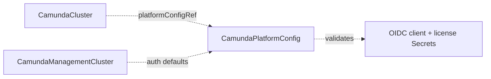

# CamundaPlatformConfig

Cluster-scoped, environment-wide platform settings — identity provider, license, and image registry — shared by every orchestration cluster that references it.

## Purpose

`CamundaPlatformConfig` holds the settings that are identical across all orchestration clusters in an environment: how users and clients authenticate (basic or OIDC), the Camunda license, and the container registry images are pulled from.
You create one per environment (or a composition layer above creates it), and each [CamundaCluster](camundacluster.md) references it by name via `platformConfigRef`, so the configuration is defined once instead of being repeated on every cluster.
The auth block is provider-agnostic: the OIDC fields follow the standard OIDC discovery vocabulary and work with Keycloak, Auth0, Entra ID, Okta, or any OIDC-compliant identity provider.

## How it works

The `CamundaPlatformConfig` controller only validates; it never provisions anything.
Consumption happens in the consuming controllers: the CamundaCluster controller resolves this CR by name and renders its values into workload configuration.

1. The operator validates that `auth.oidc.clientSecretRef` and `licenseSecretRef` (when set) point to existing Secrets containing the named keys.
2. If a referenced Secret or key is missing, the operator sets `Ready` to `False` with reason `MissingSecret` and names the offending reference in the condition message.
3. Otherwise the operator sets `Ready` to `True` and records `status.observedGeneration`.

Consuming controllers watch this CR: when you change it, the change propagates at runtime to every referencing CamundaCluster without an operator restart.
The CamundaCluster controller renders the auth fields into the orchestration cluster's `camunda.security.authentication.*` configuration (`method: basic | oidc` and the `camunda.security.authentication.oidc.*` properties in Camunda 8.9), so an endpoint or registry change rolls out as an ordinary workload update.
The OIDC client credentials defined here are environment-wide defaults; a [CamundaClusterPreset](camundaclusterpreset.md) baseline or a per-cluster `auth` block on the [CamundaCluster](camundacluster.md) overrides them for individual clusters.



## API reference

```yaml
apiVersion: core.camunda.io/v1
kind: CamundaPlatformConfig
metadata:
  # Cluster-scoped: no namespace.
  name: my-platform-config
spec:
  # object. Optional, default: basic authentication. Authentication settings for orchestration clusters.
  auth:
    # string. Optional, default: basic. Authentication method, one of: basic | oidc.
    method: oidc
    # object. Required when method is oidc. External identity provider connection.
    oidc:
      # string. Required. Issuer URL of the identity provider; endpoints are resolved from its OIDC discovery document unless overridden below.
      issuerUrl: "https://login.example.com/realms/camunda"
      # string. Optional, default: the issuerUrl. Issuer URL as reachable from inside the Kubernetes cluster, for split-horizon DNS setups.
      issuerBackendUrl: "https://login.internal.svc.cluster.local/realms/camunda"
      # string. Optional. Explicit JWKS endpoint; overrides the value from OIDC discovery.
      jwksUrl: "https://login.example.com/realms/camunda/protocol/openid-connect/certs"
      # string. Optional. Explicit token endpoint; overrides the value from OIDC discovery.
      tokenUrl: "https://login.example.com/realms/camunda/protocol/openid-connect/token"
      # string. Optional. Explicit authorization endpoint; overrides the value from OIDC discovery.
      authUrl: "https://login.example.com/realms/camunda/protocol/openid-connect/auth"
      # string. Required. Default OIDC client ID shared by all clusters unless overridden per preset or per cluster.
      clientId: "camunda-orchestration"
      # string. Optional, default: the clientId. Audience validated in access tokens.
      audience: "camunda-orchestration"
      # object. Required. Secret holding the default OIDC client secret.
      clientSecretRef:
        # string. Required. Name of the Secret.
        name: "oidc-credentials"
        # string. Required. Namespace of the Secret (this CR is cluster-scoped, so there is no namespace to default to).
        namespace: "camunda-system"
        # string. Required. Key inside the Secret.
        key: "client-secret"
  # object. Optional. Secret holding the Camunda license key; without it, clusters run in unlicensed non-production mode.
  licenseSecretRef:
    # string. Required. Name of the Secret.
    name: "camunda-license"
    # string. Required. Namespace of the Secret.
    namespace: "camunda-system"
    # string. Required. Key inside the Secret.
    key: "license-key"
  # string. Optional, default: the upstream Camunda registry. Registry prefix for all Camunda component images.
  imageRegistry: "registry.example.com/camunda"
```

## Status

| Type | Reason | Meaning |
| --- | --- | --- |
| `Ready` | `Healthy` | All referenced Secrets exist and contain the required keys. |
| `Ready` | `MissingSecret` | A Secret named by `clientSecretRef` or `licenseSecretRef` is missing, or lacks the named key. |

The operator records the last reconciled generation in `status.observedGeneration`.

## Validation

- `spec.auth.oidc` is required when `spec.auth.method` is `oidc` and rejected when the method is `basic`.
- Within `spec.auth.oidc`, `issuerUrl`, `clientId`, and `clientSecretRef` are required.
- Secret existence is a controller-time check surfaced through conditions, not an admission rule, because Secrets may be created or rotated after this CR.

## Relationships

- [CamundaCluster](camundacluster.md) — references this CR via `platformConfigRef` and re-renders workloads when it changes.
- [CamundaClusterPreset](camundaclusterpreset.md) — a preset baseline may override the default OIDC client credentials for clusters using that preset.
- [CamundaManagementCluster](camundamanagementcluster.md) — the management plane resolves its auth defaults from this CR and may override them in its own spec.

A composition layer above may create this CR instead of a human platform operator; consumers resolve it by name either way.

## Examples

A minimal manifest:

```yaml
apiVersion: core.camunda.io/v1
kind: CamundaPlatformConfig
metadata:
  name: my-platform-config
spec:
  auth:
    method: basic
```

A realistic manifest:

```yaml
apiVersion: core.camunda.io/v1
kind: CamundaPlatformConfig
metadata:
  name: my-platform-config
spec:
  auth:
    method: oidc
    oidc:
      issuerUrl: "https://login.example.com/realms/camunda"
      issuerBackendUrl: "https://login.internal.svc.cluster.local/realms/camunda"
      clientId: "camunda-orchestration"
      audience: "camunda-orchestration"
      clientSecretRef:
        name: "oidc-credentials"
        namespace: "camunda-system"
        key: "client-secret"
  licenseSecretRef:
    name: "camunda-license"
    namespace: "camunda-system"
    key: "license-key"
  imageRegistry: "registry.example.com/camunda"
```
