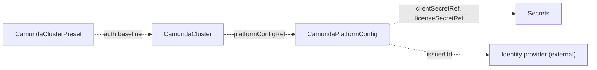

# CamundaPlatformConfig

`CamundaPlatformConfig` is a cluster-scoped resource that holds the settings every orchestration cluster of an environment shares. You create it, or another tool creates it for you.

The settings that are the same for every orchestration cluster live here: how users and clients authenticate (basic or OIDC), the Camunda license, and the registry that images are pulled from. You create one per environment. Each [CamundaCluster](camundacluster.md) references it by name through `platformConfigRef`, so you define the settings once.

The OIDC fields follow the OIDC discovery vocabulary. They work with Keycloak, Auth0, Entra ID, Okta, or any other OIDC-compliant identity provider.

The operator creates no resources from this kind. It makes sure that the referenced Secrets exist and carry the named keys, and reports the result in `Ready`. Every `CamundaCluster` that references this resource reads its values and renders them into the workloads.

The smallest platform config names the authentication method:

```yaml
apiVersion: core.camunda.io/v1
kind: CamundaPlatformConfig
metadata:
  name: my-platform-config
spec:
  auth:
    method: basic
```



## Override order

The OIDC client credentials here are the defaults of the environment. A [CamundaClusterPreset](camundaclusterpreset.md) `auth` block overrides them for its clusters, and the `auth` block of a `CamundaCluster` overrides both. The authentication method and the identity provider connection always come from this resource.

## Claims

`usernameClaim` and `clientIdClaim` name the claims that identify a caller. A token that holds the client id claim is a machine client. A token without it is a person, identified by the username claim. The claim identifies a caller and grants nothing: the `spec.auth.admin` block of a `CamundaCluster` makes a caller an administrator.

> **Caution:** The claim that you name in `clientIdClaim` must be present in the tokens of machine clients only. If the tokens of persons also carry that claim, every person becomes a machine client, even after a browser login. Some providers put a client identifier in every token, for example `azp` in Keycloak. Pick a claim that the provider adds to machine tokens only.

## Split horizon

When the identity provider is reachable at a different URL from inside the Kubernetes cluster, keep `issuerUrl` equal to the issuer claim of the tokens. Set `jwksUrl` and `tokenUrl` to the in-cluster endpoints.

The [authentication guide](../guides/authentication.md) explains the setup of both methods.

## Changes and referenced Secrets

When you change this resource or one of its Secrets, every referencing cluster rolls its pods with the new values. No operator restart is needed.

When a referenced Secret or key is missing, `Ready` is `False` with reason `MissingSecret`, and the message names the reference.

## Status

| Type | Reason | Meaning | What to do |
| --- | --- | --- | --- |
| `Ready` | `Healthy` | Every referenced Secret exists and carries the named key. | Nothing. |
| `Ready` | `MissingSecret` | The Secret named by `clientSecretRef` or `licenseSecretRef` is missing, or lacks the named key. | Create the Secret with the named key. The message names the reference. |

`status.observedGeneration` is the last generation the operator reconciled.

## Spec reference

Every field, with its type, whether it is required, and its default:

```yaml
apiVersion: core.camunda.io/v1
kind: CamundaPlatformConfig
metadata:
  # Cluster-scoped: no namespace.
  name: my-platform-config
spec:
  # object. Optional, default: basic authentication. Authentication settings of every orchestration cluster.
  auth:
    # string (basic | oidc). Optional, default: basic. The authentication method.
    method: oidc
    # object. Required when method is oidc, forbidden when method is basic. The identity provider connection.
    oidc:
      # string. Required. Issuer URL of the identity provider. The endpoints come from its discovery document unless the fields below override them. Must be an http or https URL.
      issuerUrl: "https://login.example.com/realms/camunda"
      # string. Optional. Explicit JWKS endpoint. Overrides the value from discovery.
      jwksUrl: "https://login.example.com/realms/camunda/protocol/openid-connect/certs"
      # string. Optional. Explicit token endpoint. Overrides the value from discovery.
      tokenUrl: "https://login.example.com/realms/camunda/protocol/openid-connect/token"
      # string. Optional. Explicit authorization endpoint. Overrides the value from discovery.
      authUrl: "https://login.example.com/realms/camunda/protocol/openid-connect/auth"
      # string. Required. Default OIDC client ID of every cluster, unless a preset or a cluster overrides it.
      clientId: "camunda-orchestration"
      # string. Optional, default: the clientId. Audience that access tokens must carry.
      audience: "camunda-orchestration"
      # string. Optional, default: sub. Token claim that holds the username of a person.
      usernameClaim: "preferred_username"
      # string. Optional, default: unset. Token claim that holds the id of a machine client. Unset means every token is a person.
      clientIdClaim: "client_id"
      # object. Required. Secret key that holds the default OIDC client secret.
      clientSecretRef:
        # string. Required. Name of the Secret.
        name: "oidc-credentials"
        # string. Required. Namespace of the Secret. This resource has no namespace to default to.
        namespace: "camunda-system"
        # string. Required. Key in the Secret.
        key: "client-secret"
  # object. Optional. Secret key that holds the Camunda license key. Without it, clusters run in unlicensed non-production mode.
  licenseSecretRef:
    # string. Required. Name of the Secret.
    name: "camunda-license"
    # string. Required. Namespace of the Secret.
    namespace: "camunda-system"
    # string. Required. Key in the Secret.
    key: "license-key"
  # string. Optional, default: the upstream Camunda registry. Registry prefix of the images camunda/camunda and camunda/connectors-bundle, for example registry.example.com/camunda/camunda:8.9.9.
  imageRegistry: "registry.example.com"
```

### Validation rules

- `spec.auth.oidc` is required when `spec.auth.method` is `oidc`, and forbidden when the method is `basic`.
- In `spec.auth.oidc`, `issuerUrl`, `clientId`, and `clientSecretRef` are required.
- `issuerUrl` must be an http or https URL. `jwksUrl`, `tokenUrl`, and `authUrl` must be empty or an http or https URL.
- Secret existence is checked at reconcile time, not at admission, so you can create or rotate Secrets after this resource.

### A production-shaped example

```yaml
apiVersion: core.camunda.io/v1
kind: CamundaPlatformConfig
metadata:
  name: my-platform-config
spec:
  auth:
    method: oidc
    oidc:
      issuerUrl: "https://login.example.com/realms/camunda"
      clientId: "camunda-orchestration"
      audience: "camunda-orchestration"
      usernameClaim: "preferred_username"
      clientIdClaim: "client_id"
      clientSecretRef:
        name: "oidc-credentials"
        namespace: "camunda-system"
        key: "client-secret"
  licenseSecretRef:
    name: "camunda-license"
    namespace: "camunda-system"
    key: "license-key"
  imageRegistry: "registry.example.com"
```

## Related

- [CamundaCluster](camundacluster.md): references this resource through `platformConfigRef` and rolls its pods when it changes.
- [CamundaClusterPreset](camundaclusterpreset.md): its `auth` block overrides the default OIDC client credentials for the clusters that use the preset.
- [Getting started](../getting-started.md): where this resource fits in the order of creation.
- [Authentication guide](../guides/authentication.md): how to set up basic and OIDC authentication.
