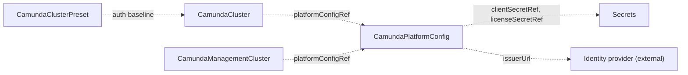

# CamundaPlatformConfig

`CamundaPlatformConfig` is a cluster-scoped resource that holds the settings every orchestration cluster of an environment shares. You create it, or another tool creates it for you.

The settings that are the same for every orchestration cluster live here: how users and clients authenticate (basic or OIDC), the Camunda license, and the registry that images are pulled from. You create one per environment. Each [CamundaCluster](camundacluster.md) references it by name through `platformConfigRef`, so you define the settings once. A [CamundaManagementCluster](camundamanagementcluster.md) references it the same way.

The OIDC fields follow the OIDC discovery vocabulary. They work with Keycloak, Auth0, Entra ID, Okta, or any other OIDC-compliant identity provider.

The operator creates no resources from this kind. It makes sure that the referenced Secrets exist and carry the named keys, and reports the result in `Ready`. Every `CamundaCluster` that references this resource reads its values and renders them into the workloads.

The smallest platform config names the authentication method:

```yaml
apiVersion: core.camunda.io/v1
kind: CamundaPlatformConfig
metadata:
  name: my-platform-config
spec:
  auth:
    method: basic
```



## Override order

The OIDC client credentials here are the defaults of the environment. A [CamundaClusterPreset](camundaclusterpreset.md) `auth` block overrides them for its clusters, and the `auth` block of a `CamundaCluster` overrides both. The authentication method and the identity provider connection always come from this resource.

## Claims

`usernameClaim` and `clientIdClaim` name the claims that identify a caller. A token that holds the client id claim is a machine client. A token without it is a person, identified by the username claim. The claim identifies a caller and grants nothing: the `spec.auth.admin` block of a `CamundaCluster` makes a caller an administrator.

> **Caution:** The claim that you name in `clientIdClaim` must be present in the tokens of machine clients only. If the tokens of persons also carry that claim, every person becomes a machine client, even after a browser login. Some providers put a client identifier in every token, for example `azp` in Keycloak. Pick a claim that the provider adds to machine tokens only.

## Split horizon

When the identity provider is reachable at a different URL from inside the Kubernetes cluster, keep `issuerUrl` equal to the issuer claim of the tokens. Set `jwksUrl` and `tokenUrl` to the in-cluster endpoints.

The [authentication guide](../guides/authentication.md) explains the setup of both methods.

## The clients of the management plane

`spec.auth.oidc.management.clients` names the identity provider application of each component of the management plane. A [CamundaManagementCluster](camundamanagementcluster.md) in the `oidc` mode reads them. It is the one mode where you register the applications yourself. In the two Keycloak modes, Management Identity creates every client, and this block stays empty.

Declare the client of each component you deploy:

| Client | Type | Needed when |
| --- | --- | --- |
| `identity` | confidential | Always. Management Identity is always deployed. |
| `optimize` | confidential | Always. The `ManagementAuthConfig` always carries it, and [CamundaOptimize](camundaoptimize.md) reads it from there. |
| `console` | public | `spec.console` is set on the `CamundaManagementCluster`. |
| `webModeler` | public | `spec.webModeler` is set. It is the client of the user interface. |
| `webModelerApi` | confidential | `spec.webModeler` is set. It is the client of the API behind that interface. |

A confidential client names a `clientSecretRef`. A public client runs in a browser and holds no secret. Camunda lists the same split in [Connect Management Identity to an identity provider](https://docs.camunda.io/docs/self-managed/components/management-identity/configuration/connect-to-an-oidc-provider/).

```yaml
apiVersion: core.camunda.io/v1
kind: CamundaPlatformConfig
metadata:
  name: my-platform-config
spec:
  auth:
    method: oidc
    oidc:
      issuerUrl: "https://login.example.com/realms/camunda"
      authUrl: "https://login.example.com/realms/camunda/protocol/openid-connect/auth"
      tokenUrl: "https://login.example.com/realms/camunda/protocol/openid-connect/token"
      jwksUrl: "https://login.example.com/realms/camunda/protocol/openid-connect/certs"
      clientId: "camunda-orchestration"
      clientSecretRef:
        name: "my-oidc-credentials"
        namespace: "camunda-system"
        key: "client-secret"
      management:
        clients:
          identity:
            clientId: "camunda-identity"
            clientSecretRef:
              name: "my-management-identity-credentials"
              namespace: "camunda-system"
              key: "client-secret"
          optimize:
            clientId: "camunda-optimize"
            clientSecretRef:
              name: "my-optimize-credentials"
              namespace: "camunda-system"
              key: "client-secret"
  # ... the rest of your platform config
```

`authUrl`, `tokenUrl`, and `jwksUrl` are optional for an orchestration cluster, which reads them from the discovery document of your provider. A `CamundaManagementCluster` in the `oidc` mode needs all three, because the `ManagementAuthConfig` carries them. Read them from the discovery document of your provider and set them here.

A `CamundaManagementCluster` that finds no client for a component it deploys reports `Ready=False` with reason `InvalidReference`, and the message names the missing field.

`providerType` tells Management Identity what kind of provider is behind the issuer. Leave it `generic` for any OIDC-compliant provider. Set it to `microsoft` for Microsoft Entra ID.

## Images

`spec.imageRegistry` puts a prefix in front of every Camunda repository, for a mirror that keeps the upstream paths:

```yaml
apiVersion: core.camunda.io/v1
kind: CamundaPlatformConfig
metadata:
  name: my-platform-config
spec:
  imageRegistry: "registry.example.com"
  # ... the rest of your platform config
```

An orchestration cluster of version `8.9.9` then pulls `registry.example.com/camunda/camunda:8.9.9`.

`spec.images` renames one image, for a mirror that keeps a path of its own:

```yaml
apiVersion: core.camunda.io/v1
kind: CamundaPlatformConfig
metadata:
  name: my-platform-config
spec:
  images:
    optimize: "mirror.example.com/team/optimize"
  # ... the rest of your platform config
```

Three rules govern both fields:

- A value is a repository only. It carries no tag and no digest. The tag always comes from the `version` field of the resource that runs the image.
- A rename replaces both the default repository and the `imageRegistry` prefix for that image. The two never stack.
- An image that `spec.images` does not name keeps its default repository, with the `imageRegistry` prefix in front of it.

The tag of the Keycloak image is `quay-optimized-<version>`, not the bare version. Camunda publishes its Keycloak build under that tag, as [Keycloak deployment](https://docs.camunda.io/docs/self-managed/deployment/helm/configure/operator-based-infrastructure/#keycloak-deployment) states.

The default repository of an image can change with the version. From Camunda 8.10 the two Web Modeler images become `camunda/hub` and `camunda/hub-websockets`, which the [8.10 chart README](https://github.com/camunda/camunda-platform-helm/blob/main/charts/camunda-platform-8.10/README.md) names. A rename of your own always wins, so a mirror stays a mirror across that change.

## Changes and referenced Secrets

When you change this resource or one of its Secrets, every referencing cluster rolls its pods with the new values. No operator restart is needed.

When a referenced Secret or key is missing, `Ready` is `False` with reason `MissingSecret`. The message starts with the spec path of the reference, for example `spec.auth.oidc.management.clients.identity.clientSecretRef`.

## Status

| Type | Reason | Meaning | What to do |
| --- | --- | --- | --- |
| `Ready` | `Healthy` | Every referenced Secret exists and carries the named key. | Nothing. |
| `Ready` | `MissingSecret` | A Secret named by `clientSecretRef`, a management client, or `licenseSecretRef` is missing, or lacks the named key. | Create the Secret with the named key. The message starts with the spec path of the reference. |

`status.observedGeneration` is the last generation the operator reconciled.

## Spec reference

Every field, with its type, whether it is required, and its default:

```yaml
apiVersion: core.camunda.io/v1
kind: CamundaPlatformConfig
metadata:
  # Cluster-scoped: no namespace.
  name: my-platform-config
spec:
  # object. Optional, default: basic authentication. Authentication settings of every orchestration cluster.
  auth:
    # string (basic | oidc). Optional, default: basic. The authentication method.
    method: oidc
    # object. Required when method is oidc, forbidden when method is basic. The identity provider connection.
    oidc:
      # string. Required. Issuer URL of the identity provider. The endpoints come from its discovery document unless the fields below override them. Must be an http or https URL.
      issuerUrl: "https://login.example.com/realms/camunda"
      # string (generic | microsoft). Optional, default: generic. The kind of identity provider. Management Identity reads it.
      providerType: "generic"
      # string. Optional. Explicit JWKS endpoint. Overrides the value from discovery.
      jwksUrl: "https://login.example.com/realms/camunda/protocol/openid-connect/certs"
      # string. Optional. Explicit token endpoint. Overrides the value from discovery.
      tokenUrl: "https://login.example.com/realms/camunda/protocol/openid-connect/token"
      # string. Optional. Explicit authorization endpoint. Overrides the value from discovery.
      authUrl: "https://login.example.com/realms/camunda/protocol/openid-connect/auth"
      # string. Required. Default OIDC client ID of every cluster, unless a preset or a cluster overrides it.
      clientId: "camunda-orchestration"
      # string. Optional, default: the clientId. Audience that access tokens must carry.
      audience: "camunda-orchestration"
      # string. Optional, default: sub. Token claim that holds the username of a person.
      usernameClaim: "preferred_username"
      # string. Optional, default: unset. Token claim that holds the id of a machine client. Unset means every token is a person.
      clientIdClaim: "client_id"
      # object. Required. Secret key that holds the default OIDC client secret.
      clientSecretRef:
        # string. Required. Name of the Secret.
        name: "oidc-credentials"
        # string. Required. Namespace of the Secret. This resource has no namespace to default to.
        namespace: "camunda-system"
        # string. Required. Key in the Secret.
        key: "client-secret"
      # object. Optional. The identity provider clients of the management plane. A CamundaManagementCluster in oidc mode reads them.
      management:
        # object. Required. One entry per component of the management plane.
        clients:
          # object. Optional. The client of Management Identity.
          identity:
            # string. Required. Client id at the identity provider.
            clientId: "camunda-identity"
            # string. Optional, default: the clientId. Audience that access tokens must carry.
            audience: "camunda-identity"
            # object. Required. Secret key that holds the client secret. Same shape as clientSecretRef above.
            clientSecretRef:
              name: "management-identity-credentials"
              namespace: "camunda-system"
              key: "client-secret"
          # object. Optional. The client of Optimize. The ManagementAuthConfig carries it.
          optimize:
            clientId: "camunda-optimize"
            clientSecretRef:
              name: "optimize-credentials"
              namespace: "camunda-system"
              key: "client-secret"
          # object. Optional. The public client of the Web Modeler user interface. No secret.
          webModeler:
            clientId: "camunda-web-modeler"
          # object. Optional. The client of the Web Modeler API.
          webModelerApi:
            clientId: "camunda-web-modeler-api"
            clientSecretRef:
              name: "web-modeler-api-credentials"
              namespace: "camunda-system"
              key: "client-secret"
            # string. Optional, default: web-modeler-public-api. Audience of the Web Modeler public API.
            publicApiAudience: "web-modeler-public-api"
          # object. Optional. The public client of Console. No secret.
          console:
            clientId: "camunda-console"
  # object. Optional. Secret key that holds the Camunda license key. Without it, clusters run in unlicensed non-production mode.
  licenseSecretRef:
    # string. Required. Name of the Secret.
    name: "camunda-license"
    # string. Required. Namespace of the Secret.
    namespace: "camunda-system"
    # string. Required. Key in the Secret.
    key: "license-key"
  # string. Optional, default: the upstream Camunda registry. Registry prefix of every Camunda image, for example registry.example.com/camunda/camunda:8.9.9.
  imageRegistry: "registry.example.com"
  # object. Optional. Renames one image. The value is a repository without a tag or a digest, and it replaces both the default repository and the imageRegistry prefix for that image. The tag always comes from the version field of the resource that runs the image.
  images:
    # string. Optional, default: camunda/camunda. The orchestration cluster processes.
    camunda: "mirror.example.com/camunda/camunda"
    # string. Optional, default: camunda/connectors-bundle. The connectors runtime.
    connectors: "mirror.example.com/camunda/connectors-bundle"
    # string. Optional, default: camunda/optimize. Optimize.
    optimize: "mirror.example.com/camunda/optimize"
    # string. Optional, default: camunda/identity. Management Identity.
    identity: "mirror.example.com/camunda/identity"
    # string. Optional, default: camunda/console. Console.
    console: "mirror.example.com/camunda/console"
    # string. Optional, default: camunda/web-modeler-restapi below 8.10, camunda/hub from 8.10. The Web Modeler restapi process.
    webModelerRestapi: "mirror.example.com/camunda/web-modeler-restapi"
    # string. Optional, default: camunda/web-modeler-websockets below 8.10, camunda/hub-websockets from 8.10. The Web Modeler websockets process.
    webModelerWebsockets: "mirror.example.com/camunda/web-modeler-websockets"
    # string. Optional, default: camunda/keycloak. The Keycloak that the operator runs.
    keycloak: "mirror.example.com/camunda/keycloak"
```

### Validation rules

- `spec.auth.oidc` is required when `spec.auth.method` is `oidc`, and forbidden when the method is `basic`.
- In `spec.auth.oidc`, `issuerUrl`, `clientId`, and `clientSecretRef` are required.
- `issuerUrl` must be an http or https URL. `jwksUrl`, `tokenUrl`, and `authUrl` must be empty or an http or https URL.
- Each `spec.images` value is a lowercase repository name, with no tag and no digest. A registry host can carry a port, as in `registry:5000/camunda/optimize`.
- The operator checks the Secrets after you apply this resource, not when you apply it. `Ready` reads `False` with reason `MissingSecret` until a Secret exists, so you can create or rotate one afterwards.

### A production-shaped example

```yaml
apiVersion: core.camunda.io/v1
kind: CamundaPlatformConfig
metadata:
  name: my-platform-config
spec:
  auth:
    method: oidc
    oidc:
      issuerUrl: "https://login.example.com/realms/camunda"
      clientId: "camunda-orchestration"
      audience: "camunda-orchestration"
      usernameClaim: "preferred_username"
      clientIdClaim: "client_id"
      clientSecretRef:
        name: "oidc-credentials"
        namespace: "camunda-system"
        key: "client-secret"
  licenseSecretRef:
    name: "camunda-license"
    namespace: "camunda-system"
    key: "license-key"
  imageRegistry: "registry.example.com"
```

## Related

- [CamundaCluster](camundacluster.md): references this resource through `platformConfigRef` and rolls its pods when it changes.
- [CamundaManagementCluster](camundamanagementcluster.md): references it the same way, and reads `management.clients` in the `oidc` mode.
- [CamundaClusterPreset](camundaclusterpreset.md): its `auth` block overrides the default OIDC client credentials for the clusters that use the preset.
- [Getting started](../getting-started.md): where this resource fits in the order of creation.
- [Authentication guide](../guides/authentication.md): how to set up basic and OIDC authentication.
