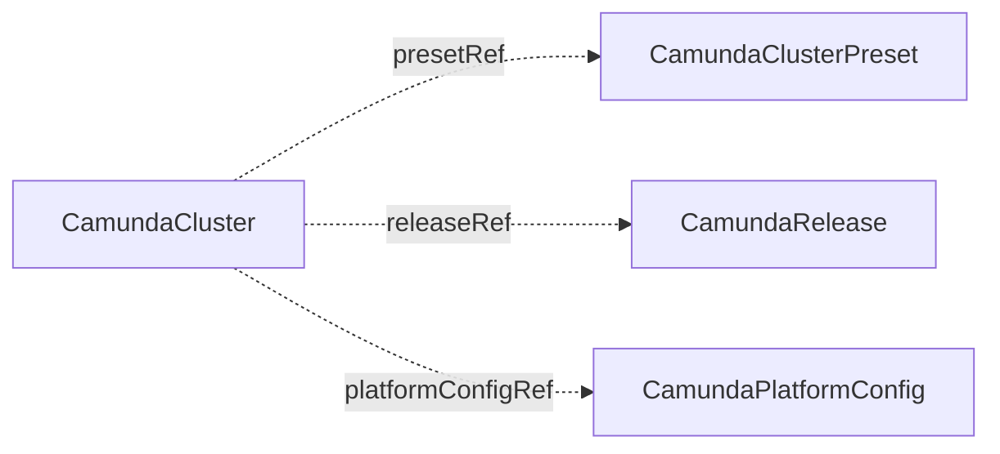

# CamundaRelease

`CamundaRelease` is a cluster-scoped description of what runs on a [CamundaCluster](camundacluster.md). It holds the Camunda version, the connectors version, an optional pinned image per process, and the environment that a version needs. You create it, or another tool creates it for you.

A release separates what runs from the shape of a cluster. The shape lives in a [CamundaClusterPreset](camundaclusterpreset.md). A platform team keeps a handful of presets, such as `small` and `medium`, and one release per rollout, such as `camunda-8-9-4`. To move a fleet to a new patch, the team edits one release. To move one cluster, the owner changes one `releaseRef`.

A release is passive data. No controller reconciles it, it creates nothing, and it reports no status. A cluster that fits no release leaves `releaseRef` unset and sets `version` inline, as before.

The smallest release names one version:

```yaml
apiVersion: core.camunda.io/v1
kind: CamundaRelease
metadata:
  name: camunda-8-9-4
spec:
  version: "8.9.4"
```



## Merge position

A `CamundaCluster` merges its configuration in this order: the preset, then the release, then its own spec. A later layer wins. A release `extraEnv` entry replaces a preset entry with the same name, and a cluster entry replaces both. `extraEnvFrom` concatenates in the same order. The [merge rules](camundaclusterpreset.md#merge-rules) of the preset apply unchanged.

A cluster that sets `spec.version` next to a `releaseRef` runs its own version. Leave `spec.version` unset to follow the release.

## Versions

`spec.version` is the Camunda version of the orchestration cluster processes. `spec.connectors.version` is the version of the connectors bundle image, the image that the connectors runtime runs, and it has its own patch line. A cluster that runs connectors needs the bundle version from the release or from its own spec.

When you edit a release, every cluster that references it rolls to the new version. A cluster whose brokers run a higher version refuses the move and reports `Ready: False` with reason `VersionDowngradeRefused`. The [CamundaCluster page](camundacluster.md#version) states the rule and the annotation that sanctions a downgrade.

## Pinned images

`spec.images` has two entries. `camunda` is the image of every orchestration cluster process, because they all run one image. `connectors` is the image of the connectors runtime. Each value is a complete reference, tag or digest included, and the operator pulls it as it is:

```yaml
apiVersion: core.camunda.io/v1
kind: CamundaRelease
metadata:
  name: camunda-8-9-4-cve-2026-0001
spec:
  version: "8.9.4"
  images:
    camunda: "mirror.example.com/camunda/camunda@sha256:7d865e959b2466918c9863afca942d0fb89d7c9ac0c99bafc3749504ded97730"
```

A pinned image changes only what is pulled. The version gates, the downgrade rule, and the computed environment still read `spec.version`, not the image. Pin an image of the same version that you name, for example a digest of it or a patched build of it.

To pin an image for a few clusters only, create a second release with the pin and point the `releaseRef` of those clusters at it.

To rename every image of an environment to a mirror, use `spec.images` on the [CamundaPlatformConfig](camundaplatformconfig.md#images) instead. A release pins one exact reference for the clusters that use this release. A platform config renames the repository for every cluster and lets the version supply the tag.

## Environment

A version bump often needs a configuration change with it. A release carries `extraEnv` and `extraEnvFrom` at the top level, per component (`zeebe`, `gateway`, `operate`, `tasklist`, `admin`), and under `connectors`, so the two ship together:

```yaml
apiVersion: core.camunda.io/v1
kind: CamundaRelease
metadata:
  name: camunda-8-9-4
spec:
  version: "8.9.4"
  extraEnv:
    - name: CAMUNDA_SOME_NEW_FLAG
      value: "true"
  zeebe:
    extraEnv:
      - name: JAVA_OPTS
        value: "-Xmx8g"
```

## Status

A release reports no status. Reference errors appear on the referencing `CamundaCluster`: a missing release gives `Ready: False` with reason `InvalidReference`.

## Spec reference

Every field, with its type, whether it is required, and its default:

```yaml
apiVersion: core.camunda.io/v1
kind: CamundaRelease
metadata:
  # Cluster-scoped: no namespace.
  name: camunda-8-9-4
spec:
  # string. Required. Camunda version as x.y.z. The referencing cluster checks the floor of 8.9.0.
  version: "8.9.4"
  # object. Optional. The connectors runtime of this release.
  connectors:
    # string. Optional. Version of the connectors bundle as x.y.z. Required for clusters that enable connectors, unless each cluster sets its own.
    version: "8.9.7"
    # []EnvVar. Optional. Environment variables of the connectors runtime.
    extraEnv: []
    # []EnvFromSource. Optional. Environment sources of the connectors runtime.
    extraEnvFrom: []
  # object. Optional. Complete image references, pulled as they are. The version above stays the version the operator believes the process runs.
  images:
    # string. Optional. Image of every orchestration cluster process.
    camunda: "mirror.example.com/camunda/camunda@sha256:7d865e959b2466918c9863afca942d0fb89d7c9ac0c99bafc3749504ded97730"
    # string. Optional. Image of the connectors runtime.
    connectors: "mirror.example.com/camunda/connectors-bundle:8.9.7"
  # []EnvVar. Optional. Environment variables of every workload. They merge by name over the preset entries and under the cluster entries.
  extraEnv:
    - name: CAMUNDA_SOME_NEW_FLAG
      value: "true"
  # []EnvFromSource. Optional. Environment sources of every workload. They follow the preset sources and precede the cluster sources.
  extraEnvFrom: []
  # object. Optional. Environment of the brokers. The same shape as zeebe applies to gateway, operate, tasklist, and admin.
  zeebe:
    # []EnvVar. Optional. Environment variables of this process. An entry here wins over a top-level entry with the same name.
    extraEnv: []
    # []EnvFromSource. Optional. Environment sources of this process.
    extraEnvFrom: []
```

### Validation rules

- `spec.version` is required and must be of the form `x.y.z`. The floor of 8.9.0 is checked by the referencing cluster on the merged spec.
- `spec.connectors.version` must be of the form `x.y.z`.
- An `extraEnv` entry sets `value` or `valueFrom`, never both.

### A production-shaped example

```yaml
apiVersion: core.camunda.io/v1
kind: CamundaRelease
metadata:
  name: camunda-8-9-4
spec:
  version: "8.9.4"
  connectors:
    version: "8.9.7"
  extraEnv:
    - name: CAMUNDA_SOME_NEW_FLAG
      value: "true"
  zeebe:
    extraEnv:
      - name: JAVA_OPTS
        value: "-Xmx8g"
```

## Related

- [CamundaCluster](camundacluster.md): references this resource through `releaseRef` and runs what it names.
- [CamundaClusterPreset](camundaclusterpreset.md): the shape of a cluster. The release sits between the preset and the cluster in the merge.
- [CamundaPlatformConfig](camundaplatformconfig.md): renames image repositories for every cluster of an environment.
- [Presets guide](../guides/presets.md): how presets and releases split the configuration of a fleet.
