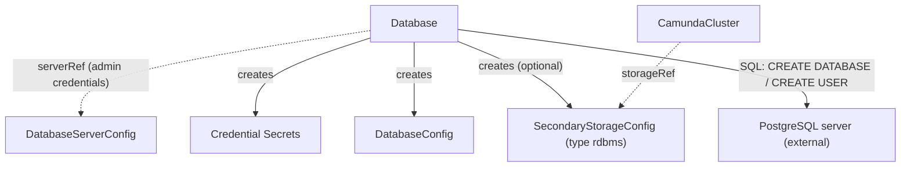

# Database

Bootstraps a logical database and its users on an existing PostgreSQL server using plain SQL.

## Purpose

`Database` is a cluster-scoped CRD that creates a logical database and application users inside an existing PostgreSQL server — cloud-managed (RDS, Cloud SQL, Aurora PostgreSQL) or self-hosted — and publishes the result as a `DatabaseConfig` contract CRD.
The controller only issues standard SQL (`CREATE DATABASE`, `CREATE USER`) through the admin credentials of the referenced `DatabaseServerConfig`; it needs network access to the server and nothing else — no cloud APIs, no provisioning tools.
Splitting the server (`DatabaseServerConfig`) from the logical database (`Database`) lets many logical databases share one server instance: the orchestration cluster's secondary storage and the management plane's Keycloak, Identity, and Web Modeler databases can all live on a single server.
You create this CR directly, or a composition layer above may create it after provisioning the server.

!!! note "Scope: PostgreSQL only (recorded deviation)"
    Camunda 8.9 itself supports PostgreSQL, Amazon Aurora PostgreSQL, MariaDB, MySQL, Microsoft SQL Server, and Oracle as RDBMS secondary storage (verified against the 8.9 RDBMS support policy and the camunda/camunda `db/` schema tree, which ships vendor schemas for all six plus dev-only H2).
    This operator's `Database` controller deliberately bootstraps PostgreSQL-compatible servers only in its initial scope, matching the `DatabaseServerConfig` `engine: postgres` enum; the enum may widen in later versions.
    Note also that Optimize requires Elasticsearch or OpenSearch — an orchestration cluster running on RDBMS secondary storage cannot attach a `CamundaOptimize`.

## How it works

1. The operator resolves `spec.serverRef` to a `DatabaseServerConfig` and reads the server's connection details and admin credentials Secret.
2. It connects to the server and creates the logical database named `spec.databaseName` if it does not exist; all SQL is idempotent, so re-runs are safe.
3. It creates the application user with a generated password, grants it full privileges on the logical database, and writes the credentials to the Secret named by `spec.applicationCredentials` (keys `username` and `password`).
4. Unless `spec.backupCredentials.disabled` is `true`, it creates a separate backup user — granted read access on all tables in the database for dumps, plus the DDL and write rights restore needs: in effect a role like the application role plus SELECT on all tables — and writes its credentials to the Secret named by `spec.backupCredentials.secretName`.
5. It creates and keeps current a `DatabaseConfig` named `spec.databaseConfig` in `spec.targetNamespace`, wiring in the `serverRef`, the `databaseName`, the application credentials Secret, and the backup credentials Secret when one exists.
6. If `spec.secondaryStorageConfig` is set, it creates a `SecondaryStorageConfig` with `type: rdbms` in `spec.targetNamespace`, referencing that `DatabaseConfig`, making the database consumable as an orchestration cluster's secondary storage; omit the field for databases that are not secondary storage (Keycloak, Identity, Web Modeler). The bindings land in `targetNamespace` because consumers resolve them by name in their own namespace — set it to the consuming cluster's namespace.
7. It reports status conditions and `status.observedGeneration`.

All created objects are applied with Server-Side Apply (SSA) under the per-component field manager `Database/bindings`.
Deleting a `Database` removes the `DatabaseConfig`, the optional `SecondaryStorageConfig`, and the credential Secrets it created, but it never drops the logical database or the SQL users — data removal stays a deliberate, manual act.



## API reference

```yaml
apiVersion: core.camunda.io/v1
kind: Database
metadata:
  name: my-camunda-db
spec:
  # string. Required. Name of the cluster-scoped DatabaseServerConfig describing the server to create the database in.
  serverRef: "my-db-server"
  # string. Required. Name of the logical database to create; must be unique per server (see Validation).
  databaseName: "camunda"
  # string. Required. Namespace where the created DatabaseConfig, SecondaryStorageConfig, and credential Secrets are placed (each Secret's namespace can be overridden per Secret); set it to the consuming cluster's namespace, since consumers resolve the bindings by name in their own namespace.
  targetNamespace: "my-cluster-ns"
  # object. Optional. The application credentials Secret, always created (keys: username, password).
  applicationCredentials:
    # string. Optional, default: <CR name>-credentials. Name of the application credentials Secret.
    secretName: "my-camunda-db-app"
    # string. Optional, default: spec.targetNamespace. Namespace for the application credentials Secret.
    secretNamespace: "my-cluster-ns"
  # object. Optional. The backup credentials Secret, created unless disabled (keys: username, password).
  backupCredentials:
    # boolean. Optional, default: false. Skip creating the backup user and Secret.
    disabled: false
    # string. Optional, default: <CR name>-backup-credentials. Name of the backup credentials Secret.
    secretName: "my-camunda-db-backup"
    # string. Optional, default: spec.targetNamespace. Namespace for the backup credentials Secret.
    secretNamespace: "my-cluster-ns"
  # string. Optional, default: the CR name. Name of the DatabaseConfig the operator creates in spec.targetNamespace.
  databaseConfig: "my-camunda-db"
  # string. Optional. If set, the operator also creates a SecondaryStorageConfig of type rdbms with this name in spec.targetNamespace, wired to the DatabaseConfig and backup credentials; omit for databases not used as Camunda secondary storage.
  secondaryStorageConfig: "my-storage-config"
```

!!! note "Deviation from the original proposal"
    The proposal made `targetNamespace` optional, defaulting to the operator namespace.
    Since the binding contracts became namespaced, consumers resolve them by name in their own namespace, so an operator-namespace default would place the bindings where no consumer can ever find them; the field is therefore required with no default.

## Status

| Type | Reason | Meaning |
| --- | --- | --- |
| `Ready` | `Healthy` | Database, users, Secrets, and contract CRs are all in place. |
| `Ready` | `Progressing` | Bootstrap SQL or contract creation is still in progress. |
| `Ready` | `InvalidReference` | `spec.serverRef` does not resolve to an existing `DatabaseServerConfig`. |
| `Ready` | `MissingSecret` | The server's admin credentials Secret is missing or lacks the expected keys. |
| `Ready` | `ConnectionFailed` | The server is unreachable or the admin credentials are rejected. |

The operator records the last reconciled generation in `status.observedGeneration`.

## Validation

- A `Database` is rejected when another `Database` referencing the same `serverRef` already uses the same `databaseName`; this prevents accidental collisions on shared servers.
- `spec.databaseName` must be a valid PostgreSQL identifier.
- `spec.targetNamespace` must be a valid namespace name (an RFC 1123 label, at most 63 characters).
- `spec.databaseConfig` and `spec.secondaryStorageConfig` must be valid resource names.

## Relationships

- [ElasticsearchCluster](elasticsearchcluster.md) — the peer storage backend controller for Elasticsearch secondary storage; an orchestration cluster uses one or the other.
- [DatabaseServerConfig](databaseserverconfig.md) — referenced via `serverRef` for connection details and admin credentials.
- [DatabaseConfig](databaseconfig.md) — created and kept current by this controller under the name in `spec.databaseConfig`, in `spec.targetNamespace`.
- [SecondaryStorageConfig](secondarystorageconfig.md) — optionally created with `type: rdbms` under the name in `spec.secondaryStorageConfig`, in `spec.targetNamespace`; a [CamundaCluster](camundacluster.md) in that namespace consumes it via its `storageRef`.
- [CamundaManagementCluster](camundamanagementcluster.md) — its `keycloakDbRef`, `identityDbRef`, and `webModelerDbRef` consume [DatabaseConfig](databaseconfig.md) CRs typically produced by `Database` resources.
- [PointInTimeRestore](pointintimerestore.md) — its dedicated-server validation counts the `Database` CRs sharing a `serverRef`; point-in-time restore requires the server to host exactly one.

The PostgreSQL server itself is external: cloud-managed or self-hosted, it is provisioned outside this operator and described by the [DatabaseServerConfig](databaseserverconfig.md).

## Examples

A minimal manifest:

```yaml
apiVersion: core.camunda.io/v1
kind: Database
metadata:
  name: my-camunda-db
spec:
  serverRef: "my-db-server"
  databaseName: "camunda"
  targetNamespace: "my-cluster-ns"
```

A realistic manifest:

```yaml
apiVersion: core.camunda.io/v1
kind: Database
metadata:
  name: my-camunda-db
spec:
  serverRef: "my-db-server"
  databaseName: "camunda"
  targetNamespace: "my-cluster-ns"
  applicationCredentials:
    secretName: "my-camunda-db-app"
  backupCredentials:
    disabled: false
    secretName: "my-camunda-db-backup"
  databaseConfig: "my-camunda-db"
  secondaryStorageConfig: "my-storage-config"
```
