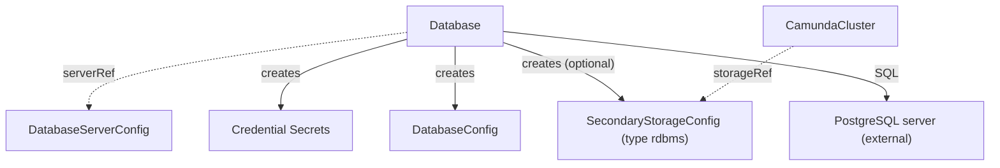

# Database

`Database` creates a logical database and its users on an existing PostgreSQL server, and publishes the connection details. You create it, or another tool creates it for you.

An orchestration cluster can use an RDBMS as secondary storage. `Database` bootstraps a logical database on a PostgreSQL server that you already run, cloud-managed or self-hosted. It uses plain SQL with the admin credentials of a `DatabaseServerConfig`. It needs network access to the server and nothing else. It calls no cloud API and creates no server.

A `Database` is namespaced. It resolves `spec.serverRef` in its own namespace, and everything it publishes lands there too. The server and the logical database are separate kinds, so many logical databases can share one server. A `Database` can bootstrap any logical database, not only secondary storage. This kind serves PostgreSQL-compatible servers only. If you want Elasticsearch as secondary storage, use [ElasticsearchCluster](elasticsearchcluster.md) instead.

On the server, the operator creates the logical database `spec.databaseName` and two SQL roles with generated passwords. The application role, named like the database, owns it. The backup role, named `<databaseName>_backup`, can read every table, including tables created later, and has the rights that a restore needs. It is never the owner. Set `spec.backupCredentials.disabled: true` to skip the backup role. Only these roles can connect to the database.

In Kubernetes, in the namespace of the `Database`, the operator writes one credential Secret per role (keys `username` and `password`) and a `DatabaseConfig` that names the server, the database, and both Secrets. When `spec.secondaryStorageConfig` is set, it also writes a `SecondaryStorageConfig` of `type: rdbms` that references the `DatabaseConfig`, so an orchestration cluster in that namespace can use the database as secondary storage. Create the `Database` in the namespace of the cluster that uses it. The Spec reference below gives the default names.

Every resource carries the label `camunda.io/database: <name>`.

The smallest database names the server and the logical database:

```yaml
apiVersion: core.camunda.io/v1
kind: Database
metadata:
  name: my-camunda-db
  namespace: my-cluster-ns
spec:
  serverRef: "my-db-server"
  databaseName: "camunda"
```



## Credentials

The operator generates each password once and keeps it. To rotate one, delete its credential Secret. The operator generates a new password, sets it on the server, and publishes a new Secret.

## Missing references

If `spec.serverRef` names no `DatabaseServerConfig` in this namespace, `Ready` is `False` with reason `InvalidReference`. If that contract has not published `status.systemIdentifier` yet, the reason is `ServerIdentityUnknown`, and the `Database` claims nothing and runs no SQL until it does. A contract whose `status.probedEndpoint` names an endpoint that its spec no longer names reads the same way, because that identity belongs to the server before the change. If the admin credentials Secret of the server is missing or lacks a key, the reason is `MissingSecret`. If the server does not answer or rejects the admin credentials, the reason is `ConnectionFailed` and the operator retries every 30 seconds.

## Uniqueness

One `Database` owns one logical database name on one PostgreSQL server. The server is the instance that the contract reaches, not the contract itself: two `DatabaseServerConfig` objects that describe one instance under different hosts are one server here. The operator reads the identity of the instance from `status.systemIdentifier` of the contract.

The claim therefore crosses namespaces. The first `Database` to claim a logical database name on an instance owns it. A `Database` of any namespace that claims the same name after that reports `InvalidReference`, names the holder, and runs no SQL.

While no `Database` holds the name, the operator prefers the older `Database`. On an equal creation timestamp it prefers the first `<namespace>/<name>` in alphabetical order. This is a preference, not a guarantee. Two `Database` resources that reach a free name at the same moment can take it in either order. Give each `Database` its own `databaseName` when you need a known owner.

A claim stays with its holder. An older `Database` whose contract reaches the same server later does not take the logical database from the `Database` that runs on it. The holder owns the SQL roles, and the passwords in its Secrets are the ones the server accepts.

A `Database` gives its claim back when you delete it. It also gives it back when you point it at another logical database or at another server, once it reaches the new one. Until then it keeps the name it had. A `Database` that waits for a missing server, or for one that does not answer, therefore keeps its old name. Another `Database` can take that name once it is given back.

A `Database` can lose a claim after it published under it. That happens when you point `spec.databaseName` at a logical database that another `Database` holds. The holder owns that database and resets the role passwords, so the credentials of the loser open nothing. The loser therefore withdraws what it published: the `DatabaseConfig`, the `SecondaryStorageConfig`, and both credential Secrets are deleted, and `BindingsReady` reads `Disabled`.

It withdraws only what it owns. Two `Database` resources can name one `databaseConfig` or one credential Secret, and the loser leaves an object that belongs to the winner in place. The `Ready` message then names what stayed.

`status.collisionKey` shows the logical database that a `Database` names, as the system identifier and the database name:

```yaml
status:
  collisionKey: 7412345678901234567/camunda
```

Every claimant records this field, the one that loses included, so it shows the logical database a `Database` asks for and not one it owns. A `Database` that reports `InvalidReference` and names another `Database` does not own the name it shows. The operator never clears the field. An owner whose server or contract is gone keeps the logical database. Delete that `Database` to release the name.

## Changes

All SQL is idempotent, so every reconcile can run it again. If you clear `spec.secondaryStorageConfig`, the existing `SecondaryStorageConfig` stays until you delete the `Database`.

## Deletion

Deletion removes the `DatabaseConfig`, the `SecondaryStorageConfig`, and the credential Secrets. It also releases the claim, so another `Database` can take the logical database name. The operator never drops the logical database or the SQL users. Data removal is a manual act on the server.

## Status

| Type | Reason | Meaning | What to do |
| --- | --- | --- | --- |
| `Ready` | `InvalidReference` | `spec.serverRef` names no `DatabaseServerConfig` in this namespace. Or another `Database`, named in the message as `<namespace>/<name>`, holds the same logical database name on the same server. | Create the `DatabaseServerConfig`, or change `databaseName`, or delete the `Database` that holds the name. |
| `Ready` | `ServerIdentityUnknown` | The `DatabaseServerConfig` has not published `status.systemIdentifier` yet, or it published one for an endpoint that its spec no longer names. The operator cannot tell which server the contract reaches, so it claims nothing and runs no SQL. | Wait until the `DatabaseServerConfig` is probed again for the endpoint and the credentials its spec names now. It publishes the identity as soon as it reaches the server. |
| `Ready` | `MissingSecret` | The admin credentials Secret of the server is missing or lacks a key. | Create the Secret with the keys that the `DatabaseServerConfig` names. |
| `Ready` | `ConnectionFailed` | The server does not answer, or it rejects the admin credentials. The operator retries every 30 seconds. | Make sure that the operator can reach the server and that the admin credentials are correct. |
| `Ready` | component status | The pre-checks passed. `Ready` takes the status and reason of `BindingsReady`, for example `Healthy`, `Creating`, `Updating`, `Failing`, or `Error`. | Wait while the reason is `Creating` or `Updating`. For other reasons, read the message of `BindingsReady`. |
| `BindingsReady` | component status | The detail of the published Secrets, `DatabaseConfig`, and `SecondaryStorageConfig`. `Disabled` means this `Database` lost its claim and withdrew them. | Read the message when it is not `True`. |

| Field | Meaning |
| --- | --- |
| `status.collisionKey` | The claim of this `Database`: the system identifier of the server and the logical database name. The operator never clears it. |
| `status.observedGeneration` | The last generation that the operator reconciled. |

## Spec reference

Every field, with its type, whether it is required, and its default:

```yaml
apiVersion: core.camunda.io/v1
kind: Database
metadata:
  name: my-camunda-db
  namespace: my-cluster-ns
spec:
  # string. Required. Name of the DatabaseServerConfig of this namespace that describes the server.
  serverRef: "my-db-server"
  # string. Required. Name of the logical database to create. It must be unique per server, across all namespaces.
  databaseName: "camunda"
  # object. Optional. The application credentials Secret (keys: username, password). It is always created.
  applicationCredentials:
    # string. Optional, default: <name>-credentials. Name of the Secret, in the namespace of this resource.
    secretName: "my-camunda-db-app"
  # object. Optional. The backup credentials Secret (keys: username, password). It is created unless disabled.
  backupCredentials:
    # boolean. Optional, default: false. With true, the operator creates no backup user and no backup Secret.
    disabled: false
    # string. Optional, default: <name>-backup-credentials. Name of the Secret, in the namespace of this resource.
    secretName: "my-camunda-db-backup"
  # string. Optional, default: the name of this resource. Name of the DatabaseConfig that the operator creates in the namespace of this resource.
  databaseConfig: "my-camunda-db"
  # string. Optional. When set, the operator creates a SecondaryStorageConfig of type rdbms with this name in the namespace of this resource. Omit it for a database that is not secondary storage.
  secondaryStorageConfig: "my-storage-config"
```

### Validation rules

- `spec.databaseName` must match `^[a-z_][a-z0-9_]{0,62}$`: a lowercase PostgreSQL identifier of at most 63 characters.
- `spec.databaseConfig` and `spec.secondaryStorageConfig` must be valid resource names.
- The uniqueness of the logical database name per server is enforced by the operator, not by admission. See `InvalidReference` above.

### A production-shaped example

```yaml
apiVersion: core.camunda.io/v1
kind: Database
metadata:
  name: my-camunda-db
  namespace: my-cluster-ns
spec:
  serverRef: "my-db-server"
  databaseName: "camunda"
  applicationCredentials:
    secretName: "my-camunda-db-app"
  backupCredentials:
    disabled: false
    secretName: "my-camunda-db-backup"
  databaseConfig: "my-camunda-db"
  secondaryStorageConfig: "my-storage-config"
```

## Related

- [DatabaseServerConfig](databaseserverconfig.md): the server that `spec.serverRef` names, with its admin credentials.
- [DatabaseConfig](databaseconfig.md): the contract that this kind creates under `spec.databaseConfig`.
- [SecondaryStorageConfig](secondarystorageconfig.md): the contract that this kind creates under `spec.secondaryStorageConfig`.
- [CamundaCluster](camundacluster.md): references the `SecondaryStorageConfig` through `storageRef`.
- [ElasticsearchCluster](elasticsearchcluster.md): the other secondary storage kind. An orchestration cluster uses one or the other.
- [Secondary storage guide](../guides/secondary-storage.md): how to choose and connect secondary storage.
- [Backup guide](../guides/backup.md): how the backup role takes part in database dumps.
- [Operations guide](../guides/operations.md): rotate credentials and other day-two tasks.
- [Getting started](../getting-started.md): the first cluster, end to end.
