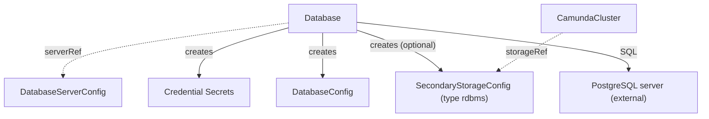

# Database

`Database` creates a logical database and its users on an existing PostgreSQL server, and publishes the connection details. You create it, or another tool creates it for you.

## Purpose

An orchestration cluster can use an RDBMS as secondary storage. `Database` bootstraps a logical database on a PostgreSQL server that you already run, cloud-managed or self-hosted. It uses plain SQL with the admin credentials of a `DatabaseServerConfig`. It needs network access to the server and nothing else. It calls no cloud API and creates no server.

A `Database` is cluster-scoped. The server and the logical database are separate kinds, so many logical databases can share one server. A `Database` can bootstrap any logical database, not only secondary storage. This kind serves PostgreSQL-compatible servers only. If you want Elasticsearch as secondary storage, use [ElasticsearchCluster](elasticsearchcluster.md) instead.

## What it does

On the server, the operator creates these objects from a `Database` with `spec.databaseName: <databaseName>`:

- The logical database `<databaseName>`, without the default `CONNECT` privilege of `PUBLIC`. Only granted roles can connect.
- The application role `<databaseName>` with a generated password. It owns the database and has all privileges on it, so schema migrations work.
- The backup role `<databaseName>_backup` with a generated password, unless `spec.backupCredentials.disabled` is `true`. If that name is longer than 63 characters, the role is `<first 47 characters of databaseName>_<first 8 hex characters of the SHA-256 of databaseName>_backup`. The role can connect and create objects in schema `public`. It can read and write the existing tables and sequences there, and read the tables that the application role creates later. It is never the owner.

In Kubernetes, the operator creates these resources in `spec.targetNamespace`:

- The Secret `<name>-credentials`, or the name in `spec.applicationCredentials.secretName`, with the keys `username` and `password` of the application role.
- The Secret `<name>-backup-credentials`, or the name in `spec.backupCredentials.secretName`, with the keys `username` and `password` of the backup role. It exists unless `spec.backupCredentials.disabled` is `true`.
- The `DatabaseConfig` `<name>`, or the name in `spec.databaseConfig`. It carries `serverRef`, `databaseName`, the application credentials Secret, and the backup credentials Secret when one exists.
- The `SecondaryStorageConfig` `<spec.secondaryStorageConfig>` with `type: rdbms`, only when that field is set. It references the `DatabaseConfig`. An orchestration cluster in that namespace can reference it through `storageRef`.

Every resource carries the labels `camunda.io/database: <name>`, `camunda.io/component: database`, and `app.kubernetes.io/managed-by: camunda-operator`.



**Deletion.** Deletion removes the `DatabaseConfig`, the `SecondaryStorageConfig`, and the credential Secrets. The operator never drops the logical database or the SQL users. Data removal is a manual act on the server.

**Password rotation.** The operator generates each password once and keeps it. To rotate one, delete its credential Secret. The operator generates a new password, sets it on the server, and publishes a new Secret.

**Missing references.** If `spec.serverRef` names no `DatabaseServerConfig`, `Ready` is `False` with reason `InvalidReference`. If the admin credentials Secret of the server is missing or lacks a key, the reason is `MissingSecret`. If the server does not answer or rejects the admin credentials, the reason is `ConnectionFailed` and the operator retries every 30 seconds.

**Uniqueness.** One `Database` owns one pair of `serverRef` and `databaseName`. If a second `Database` claims the same pair, the oldest one wins. On an equal creation timestamp, the smaller name wins. The loser reports `InvalidReference`, runs no SQL, and publishes nothing.

**Changes.** All SQL is idempotent, so every reconcile can run it again. If you clear `spec.secondaryStorageConfig`, the existing `SecondaryStorageConfig` stays until you delete the `Database`.

## Spec

```yaml
apiVersion: core.camunda.io/v1
kind: Database
metadata:
  name: my-camunda-db
spec:
  # string. Required. Name of the cluster-scoped DatabaseServerConfig that describes the server.
  serverRef: "my-db-server"
  # string. Required. Name of the logical database to create. It must be unique per server.
  databaseName: "camunda"
  # string. Required. Namespace of the DatabaseConfig, the SecondaryStorageConfig, and the credential Secrets. Set it to the namespace of the CamundaCluster that uses them.
  targetNamespace: "my-cluster-ns"
  # object. Optional. The application credentials Secret (keys: username, password). It is always created.
  applicationCredentials:
    # string. Optional, default: <name>-credentials. Name of the Secret.
    secretName: "my-camunda-db-app"
    # string. Optional, default: spec.targetNamespace. Namespace of the Secret.
    secretNamespace: "my-cluster-ns"
  # object. Optional. The backup credentials Secret (keys: username, password). It is created unless disabled.
  backupCredentials:
    # boolean. Optional, default: false. With true, the operator creates no backup user and no backup Secret.
    disabled: false
    # string. Optional, default: <name>-backup-credentials. Name of the Secret.
    secretName: "my-camunda-db-backup"
    # string. Optional, default: spec.targetNamespace. Namespace of the Secret.
    secretNamespace: "my-cluster-ns"
  # string. Optional, default: the name of this resource. Name of the DatabaseConfig that the operator creates in spec.targetNamespace.
  databaseConfig: "my-camunda-db"
  # string. Optional. When set, the operator creates a SecondaryStorageConfig of type rdbms with this name in spec.targetNamespace. Omit it for a database that is not secondary storage.
  secondaryStorageConfig: "my-storage-config"
```

## Status

| Type | Reason | Meaning | What to do |
| --- | --- | --- | --- |
| `Ready` | `InvalidReference` | `spec.serverRef` names no `DatabaseServerConfig`. Or another `Database`, named in the message, owns the same `serverRef` and `databaseName`. | Create the `DatabaseServerConfig`, or change `databaseName`, or delete the duplicate. |
| `Ready` | `MissingSecret` | The admin credentials Secret of the server is missing or lacks a key. | Create the Secret with the keys that the `DatabaseServerConfig` names. |
| `Ready` | `ConnectionFailed` | The server does not answer, or it rejects the admin credentials. The operator retries every 30 seconds. | Make sure that the operator can reach the server and that the admin credentials are correct. |
| `Ready` | component status | The pre-checks passed. `Ready` takes the status and reason of `BindingsReady`, for example `Healthy`, `Creating`, `Updating`, `Failing`, or `Error`. | Wait while the reason is `Creating` or `Updating`. For other reasons, read the message of `BindingsReady`. |
| `BindingsReady` | component status | The detail of the published Secrets, `DatabaseConfig`, and `SecondaryStorageConfig`. | Read the message when it is not `True`. |

`status.observedGeneration` is the last generation that the operator reconciled.

## Validation

- `spec.databaseName` must match `^[a-z_][a-z0-9_]{0,62}$`: a lowercase PostgreSQL identifier of at most 63 characters.
- `spec.targetNamespace` must be a valid namespace name of at most 63 characters.
- `spec.databaseConfig` and `spec.secondaryStorageConfig` must be valid resource names.
- The uniqueness of `serverRef` plus `databaseName` is enforced by the operator, not by admission. See `InvalidReference` above.

## Related

- [DatabaseServerConfig](databaseserverconfig.md): the server that `spec.serverRef` names, with its admin credentials.
- [DatabaseConfig](databaseconfig.md): the contract that this kind creates under `spec.databaseConfig`.
- [SecondaryStorageConfig](secondarystorageconfig.md): the contract that this kind creates under `spec.secondaryStorageConfig`.
- [CamundaCluster](camundacluster.md): references the `SecondaryStorageConfig` through `storageRef`.
- [ElasticsearchCluster](elasticsearchcluster.md): the other secondary storage kind. An orchestration cluster uses one or the other.
- [Secondary storage guide](../guides/secondary-storage.md): how to choose and connect secondary storage.
- [Backup guide](../guides/backup.md): how the backup role takes part in database dumps.
- [Operations guide](../guides/operations.md): rotate credentials and other day-two tasks.
- [Getting started](../getting-started.md): the first cluster, end to end.

## Examples

A minimal manifest:

```yaml
apiVersion: core.camunda.io/v1
kind: Database
metadata:
  name: my-camunda-db
spec:
  serverRef: "my-db-server"
  databaseName: "camunda"
  targetNamespace: "my-cluster-ns"
```

A realistic manifest:

```yaml
apiVersion: core.camunda.io/v1
kind: Database
metadata:
  name: my-camunda-db
spec:
  serverRef: "my-db-server"
  databaseName: "camunda"
  targetNamespace: "my-cluster-ns"
  applicationCredentials:
    secretName: "my-camunda-db-app"
  backupCredentials:
    disabled: false
    secretName: "my-camunda-db-backup"
  databaseConfig: "my-camunda-db"
  secondaryStorageConfig: "my-storage-config"
```
