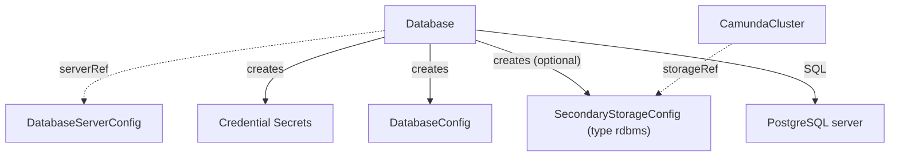

# Database

`Database` creates a logical database and its users on an existing PostgreSQL server, and publishes the connection details. You create it, or another tool creates it for you.

An orchestration cluster can use an RDBMS as secondary storage. A `Database` creates the logical database on a PostgreSQL server that you already run, cloud-managed, self-hosted, or run by a [DatabaseServer](databaseserver.md). It connects with the admin credentials of a `DatabaseServerConfig` and runs plain SQL. It needs network access to the server and calls no cloud API. A `Database` can create any logical database, not only secondary storage. For Elasticsearch as secondary storage, use [ElasticsearchCluster](elasticsearchcluster.md) instead.

A `Database` resolves `spec.serverRef` in its own namespace, and everything it publishes lands in that namespace too. Create it in the namespace of the cluster that uses it.

The smallest database names the server and the logical database:

```yaml
apiVersion: core.camunda.io/v1
kind: Database
metadata:
  name: my-camunda-db
  namespace: my-cluster-ns
spec:
  serverRef: "my-db-server"
  databaseName: "camunda"
```


```mermaid
graph TD
    DB[Database] -.->|serverRef| DBSC[DatabaseServerConfig]
    DB -->|creates| SEC["Credential Secrets"]
    DB -->|creates| DBC[DatabaseConfig]
    DB -->|"creates (optional)"| SSC["SecondaryStorageConfig (type rdbms)"]
    DB -->|SQL| PG["PostgreSQL server"]
    CC[CamundaCluster] -.->|storageRef| SSC
```

## What it creates

On the server, the operator creates the logical database `spec.databaseName` and two SQL roles with generated passwords:

- The application role has the name of the database and owns it.
- The backup role is named `<databaseName>_backup`. It can read every table, including tables created later, and has the rights that a restore needs. It does not own the database. For a database name of more than 56 characters, the operator shortens the role name and adds a hash. The backup credentials Secret holds the exact name. Set `spec.backupCredentials.disabled: true` to skip this role.

Only these roles can connect to the database.

In the namespace of the `Database`, the operator publishes these objects:

| Object | Default name | Content |
| --- | --- | --- |
| Secret | `my-camunda-db-credentials` | `username` and `password` of the application role |
| Secret | `my-camunda-db-backup-credentials` | `username` and `password` of the backup role, unless disabled |
| [DatabaseConfig](databaseconfig.md) | `my-camunda-db` | The server, the database name, and both Secrets |
| [SecondaryStorageConfig](secondarystorageconfig.md) | none | Only when `spec.secondaryStorageConfig` is set. Its `type` is `rdbms`, and it references the `DatabaseConfig`. |

Every object carries the label `camunda.io/database: my-camunda-db`. An orchestration cluster in that namespace uses the database as secondary storage through the `SecondaryStorageConfig`.

## Credentials

The operator generates each password once and keeps it. To rotate one, delete its credential Secret. The operator generates a new password, sets it on the server, and publishes a new Secret.

## Uniqueness

Give each `Database` its own `databaseName` on a PostgreSQL server. A name belongs to one `Database` per server, across all namespaces. Two `DatabaseServerConfig` objects that reach one server under different hosts count as one server.

The first `Database` to claim a name keeps it. Another `Database` with the same name on the same server runs no SQL. It reports `Ready` `False` with reason `InvalidReference`, and the message names the holder:

```yaml
status:
  conditions:
    - type: Ready
      status: "False"
      reason: InvalidReference
      message: Database other-ns/other-db already claims database "camunda" on the same server
```

To fix it, change `databaseName` on one of them, or delete the holder. A `Database` frees its name when you delete it, or after it reaches a new name or a new server.

If you change `databaseName` to a name that another `Database` holds, this `Database` removes the `DatabaseConfig`, the `SecondaryStorageConfig`, and the credential Secrets that it published. Its `BindingsReady` then reads `Disabled`.

## Changes

If you rename a binding, the operator publishes the object under the new name and leaves the object under the old name in place. If you clear `spec.secondaryStorageConfig`, the existing `SecondaryStorageConfig` also stays. Both objects stay until you delete the `Database`, or until it loses its claim. See [Uniqueness](#uniqueness).

## Deletion

Deletion removes the `DatabaseConfig`, the `SecondaryStorageConfig`, and the credential Secrets. It also releases the claim, so another `Database` can take the name. The operator never drops the logical database or the SQL roles. To remove the data, drop them on the server yourself.

## Status

`kubectl get database` shows `Ready`, its reason, the name of the logical database, and the age.

| Type | Reason | Meaning | What to do |
| --- | --- | --- | --- |
| `Ready` | `InvalidReference` | `spec.serverRef` names no `DatabaseServerConfig` in this namespace. Or another `Database`, named in the message as `<namespace>/<name>`, holds the same logical database name on the same server. | Create the `DatabaseServerConfig`, or change `databaseName`, or delete the `Database` that the message names. |
| `Ready` | `InvalidReference` | The message says that another `Database` goes first. Nothing holds the name yet. | Wait for that `Database` to take the name, or read its `Ready` condition. Or change `databaseName` here. |
| `Ready` | `InvalidReference` | The message names a Lease in the namespace of the operator. The Lease holds the name, and no `Database` owns it. | If nothing else uses that Lease, delete it. The `Database` then takes the name. |
| `Ready` | `ServerIdentityUnknown` | The `DatabaseServerConfig` has not published `status.systemIdentifier` for the endpoint and the credentials that its spec names now. The `Database` claims nothing and runs no SQL. | Wait until the `DatabaseServerConfig` reports `Ready`. |
| `Ready` | `MissingSecret` | The admin credentials Secret of the server is missing or lacks a key. | Create the Secret with the keys that the `DatabaseServerConfig` names. |
| `Ready` | `ConnectionFailed` | The server does not answer, or it rejects the admin credentials. The operator tries again every 30 seconds. | Make sure that the operator can reach the server and that the admin credentials are correct. |
| `Ready` | the reason of `BindingsReady` | The checks passed. `Ready` takes the status and reason of `BindingsReady`, for example `Healthy`, `Creating`, `Updating`, or `Failing`. | Wait while the reason is `Creating` or `Updating`. For other reasons, read the message of `BindingsReady`. |
| `BindingsReady` | `Healthy`, `Creating`, `Updating`, `Failing`, `Disabled` | The state of the published Secrets, `DatabaseConfig`, and `SecondaryStorageConfig`. `Disabled` means that this `Database` lost its claim and removed them. | If the status is not `True`, read the message. |

| Field | Meaning |
| --- | --- |
| `status.collisionKey` | The logical database that this `Database` last resolved, as `<system identifier>/<database name>`. While the server of the spec is missing or not probed, it keeps the value from before. It does not show who holds the name. |
| `status.observedGeneration` | The last generation that the operator reconciled. |

## Spec reference

Every field, with its type, whether it is required, and its default:

```yaml
apiVersion: core.camunda.io/v1
kind: Database
metadata:
  name: my-camunda-db
  namespace: my-cluster-ns
spec:
  # string. Required. Name of the DatabaseServerConfig of this namespace that describes the server.
  serverRef: "my-db-server"
  # string. Required. Name of the logical database to create. It must be unique per server, across all namespaces.
  databaseName: "camunda"
  # object. Optional. The application credentials Secret (keys: username, password). It is always created.
  applicationCredentials:
    # string. Optional, default: <name>-credentials. Name of the Secret, in the namespace of this resource.
    secretName: "my-camunda-db-app"
  # object. Optional. The backup credentials Secret (keys: username, password). It is created unless disabled.
  backupCredentials:
    # boolean. Optional, default: false. With true, the operator creates no backup user and no backup Secret.
    disabled: false
    # string. Optional, default: <name>-backup-credentials. Name of the Secret, in the namespace of this resource.
    secretName: "my-camunda-db-backup"
  # string. Optional, default: the name of this resource. Name of the DatabaseConfig that the operator creates in the namespace of this resource.
  databaseConfig: "my-camunda-db"
  # string. Optional. When set, the operator creates a SecondaryStorageConfig of type rdbms with this name in the namespace of this resource. Omit it for a database that is not secondary storage.
  secondaryStorageConfig: "my-storage-config"
```

### Validation rules

- `spec.databaseName` must match `^[a-z_][a-z0-9_]{0,62}$`: a lowercase PostgreSQL identifier of at most 63 characters.
- `spec.databaseConfig` and `spec.secondaryStorageConfig` must be valid resource names.
- The API server does not check that the logical database name is unique per server. The operator does. See [Uniqueness](#uniqueness).

### A production-shaped example

```yaml
apiVersion: core.camunda.io/v1
kind: Database
metadata:
  name: my-camunda-db
  namespace: my-cluster-ns
spec:
  serverRef: "my-db-server"
  databaseName: "camunda"
  applicationCredentials:
    secretName: "my-camunda-db-app"
  backupCredentials:
    disabled: false
    secretName: "my-camunda-db-backup"
  databaseConfig: "my-camunda-db"
  secondaryStorageConfig: "my-storage-config"
```

## Related

- [DatabaseServerConfig](databaseserverconfig.md): the server that `spec.serverRef` names, with its admin credentials.
- [DatabaseConfig](databaseconfig.md): the [contract](index.md#contracts) that this kind creates under `spec.databaseConfig`.
- [SecondaryStorageConfig](secondarystorageconfig.md): the contract that this kind creates under `spec.secondaryStorageConfig`.
- [CamundaCluster](camundacluster.md): references the `SecondaryStorageConfig` through `storageRef`.
- [ElasticsearchCluster](elasticsearchcluster.md): the other secondary storage kind. An orchestration cluster uses one or the other.
- [Secondary storage guide](../guides/secondary-storage.md): how to choose and connect secondary storage.
- [Backup guide](../guides/backup.md): how the backup role takes part in database dumps.
- [Operations guide](../guides/operations.md): rotate credentials and other day-two tasks.
- [Getting started](../getting-started.md): the first cluster, end to end.
