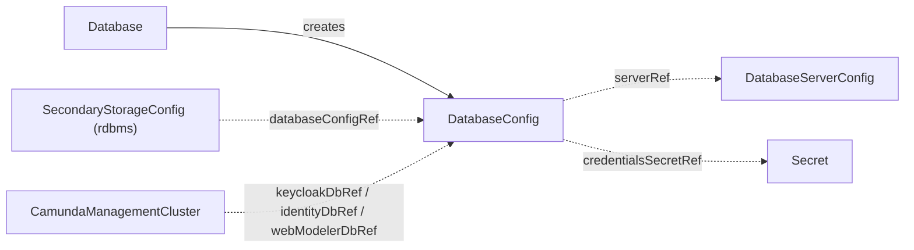

# DatabaseConfig

`DatabaseConfig` is the contract CRD that describes one logical database — its server, name, and application credentials — for the controllers and components that connect to it.

## Purpose

Several consumers need to connect to a specific logical database: an orchestration cluster using RDBMS secondary storage, the management plane's Keycloak, Identity, and Web Modeler databases, and the backup and restore controllers.
This cluster-scoped contract CRD carries the logical database's coordinates and credentials, decoupling whoever created the database from whoever connects to it, as described in the [architecture](../architecture.md).

| Role | Who |
| --- | --- |
| Producers | [Database](database.md) (as output of bootstrapping a logical database, named by its `databaseConfig` output field), or you, by hand, for databases created outside the operator |
| Consumers | [SecondaryStorageConfig](secondarystorageconfig.md) (via `rdbms.databaseConfigRef`), [CamundaManagementCluster](camundamanagementcluster.md) (via `keycloakDbRef`, `identityDbRef`, and `webModelerDbRef`), and the backup and restore controllers, which resolve it through the consuming cluster's storage chain |

## How it works

The contract has a lightweight validation-only controller: it never provisions anything.

1. The operator watches every `DatabaseConfig`, the [DatabaseServerConfig](databaseserverconfig.md) it references, and the Secrets it references, and re-runs validation whenever any of them change.
2. It checks that the [DatabaseServerConfig](databaseserverconfig.md) named by `serverRef` exists.
3. It checks that the Secret named by `credentialsSecretRef` — and by `backupCredentialsSecretRef`, when set — exists and contains the configured `usernameKey` and `passwordKey`.
4. It sets the `Ready` condition: `Healthy` when all checks pass, `InvalidReference` or `MissingSecret` otherwise.

Consumers read the contract by name and never care who produced it.
Connection endpoints are deliberately not duplicated here: consumers resolve `serverRef` to the [DatabaseServerConfig](databaseserverconfig.md) for the engine, host, and port, then combine them with this contract's `databaseName` and credentials.



## API reference

```yaml
apiVersion: core.camunda.io/v1
kind: DatabaseConfig
# Cluster-scoped: metadata has no namespace.
metadata:
  name: my-camunda-db
spec:
  # string. Required. Name of the DatabaseServerConfig describing the server hosting this database.
  serverRef: my-db-server
  # string. Required. Name of the logical database on the server.
  databaseName: camunda
  # object. Required. Application user with read/write access to the database.
  credentialsSecretRef:
    # string. Required. Name of the Secret holding the application credentials.
    name: my-camunda-db-credentials
    # string. Required. Namespace of the Secret (this CR is cluster-scoped, so there is no default).
    namespace: my-cluster-ns
    # string. Required. Key in the Secret holding the plaintext username.
    usernameKey: username
    # string. Required. Key in the Secret holding the plaintext password.
    passwordKey: password
  # object. Optional. Separate user with dump/restore privileges, used by the backup and restore controllers.
  backupCredentialsSecretRef:
    # string. Required. Name of the Secret holding the backup credentials.
    name: my-camunda-db-backup-credentials
    # string. Required. Namespace of the Secret (this CR is cluster-scoped, so there is no default).
    namespace: my-cluster-ns
    # string. Required. Key in the Secret holding the plaintext username.
    usernameKey: username
    # string. Required. Key in the Secret holding the plaintext password.
    passwordKey: password
```

## Status

| Type | Reason | Meaning |
| --- | --- | --- |
| `Ready` | `Healthy` | The referenced `DatabaseServerConfig` and all referenced Secrets exist with the required keys. |
| `Ready` | `InvalidReference` | The `DatabaseServerConfig` named by `serverRef` does not exist. |
| `Ready` | `MissingSecret` | A Secret named by `credentialsSecretRef` or `backupCredentialsSecretRef` is missing or lacks the configured keys. |

The operator records the last reconciled generation in `status.observedGeneration`.

## Validation

There are no admission rules beyond schema validation; reference and Secret existence are checked continuously by the validation controller and surfaced as conditions.

## Relationships

- [DatabaseServerConfig](databaseserverconfig.md) — referenced via `serverRef` for the server's engine, host, port, and admin credentials.
- [SecondaryStorageConfig](secondarystorageconfig.md) — references this contract via `rdbms.databaseConfigRef` when the secondary storage type is `rdbms`.
- [Database](database.md) — creates this contract as output of bootstrapping the logical database and its users.
- [CamundaManagementCluster](camundamanagementcluster.md) — consumes this contract via `keycloakDbRef`, `identityDbRef`, and `webModelerDbRef` for its component databases.
- [Backup](backup.md), [LogicalRestore](logicalrestore.md), [PointInTimeRestore](pointintimerestore.md) — resolve this contract through the target cluster's storage chain and use `backupCredentialsSecretRef` for dump and restore operations.

See the [CRD overview](index.md) for where this contract sits in the reconciler dependency graph.

## Examples

A minimal manifest:

```yaml
apiVersion: core.camunda.io/v1
kind: DatabaseConfig
metadata:
  name: my-camunda-db
spec:
  serverRef: my-db-server
  databaseName: camunda
  credentialsSecretRef:
    name: my-camunda-db-credentials
    namespace: my-cluster-ns
    usernameKey: username
    passwordKey: password
```

A realistic manifest with a dedicated backup user for dump and restore operations:

```yaml
apiVersion: core.camunda.io/v1
kind: DatabaseConfig
metadata:
  name: my-camunda-db
spec:
  serverRef: my-db-server
  databaseName: camunda
  credentialsSecretRef:
    name: my-camunda-db-credentials
    namespace: my-cluster-ns
    usernameKey: username
    passwordKey: password
  backupCredentialsSecretRef:
    name: my-camunda-db-backup-credentials
    namespace: my-cluster-ns
    usernameKey: username
    passwordKey: password
```
