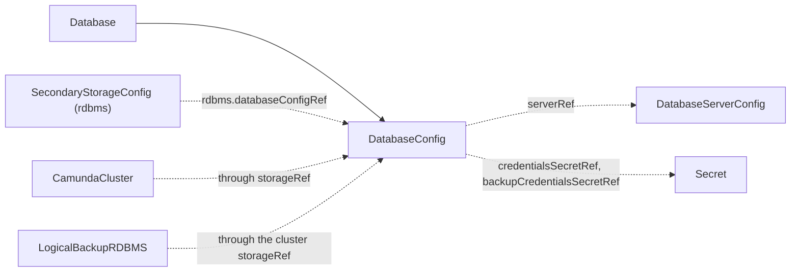

# DatabaseConfig

`DatabaseConfig` is a namespaced contract kind that describes one logical database: its server, its name, and the application credentials. A `Database` creates it, or you create it by hand.

An orchestration cluster with a relational database as secondary storage needs to connect to one logical database. This kind carries the coordinates and the credentials of that database. The thing that created the database and the thing that connects to it do not need to know each other. The operator only validates the contract and reports the result on `Ready`. It never provisions anything from it.

The contract lives in the namespace of the consumer. A `SecondaryStorageConfig` finds it by name in its own namespace. The contract does not repeat the host and the port. Consumers read them from the `DatabaseServerConfig` that `serverRef` names in this namespace, and combine them with `databaseName` and the credentials.

| Role | Who |
| --- | --- |
| Producers | [Database](database.md) (after it creates the logical database, named by its `databaseConfig` field), or you, by hand, for a database created outside the operator |
| Consumers | [SecondaryStorageConfig](secondarystorageconfig.md) (through `rdbms.databaseConfigRef`), [CamundaCluster](camundacluster.md) (through its `storageRef` and that contract), [LogicalBackupRDBMS](logicalbackuprdbms.md) (through the same chain, with `backupCredentialsSecretRef`) |

The smallest contract names the server, the database, and the application credentials:

```yaml
apiVersion: core.camunda.io/v1
kind: DatabaseConfig
metadata:
  name: my-camunda-db
  namespace: my-cluster-ns
spec:
  serverRef: my-db-server
  databaseName: camunda
  credentialsSecretRef:
    name: my-camunda-db-credentials
    namespace: my-cluster-ns
    usernameKey: username
    passwordKey: password
```



## Validation checks

The operator creates no resources from this kind. It validates the contract and writes the result to `status`.

- The operator makes sure that the [DatabaseServerConfig](databaseserverconfig.md) named in `serverRef` exists in the namespace of this contract.
- The operator makes sure that the Secret in `credentialsSecretRef` exists and holds `usernameKey` and `passwordKey`. If `backupCredentialsSecretRef` is set, it makes sure that this Secret exists and holds the same keys.

If the `DatabaseServerConfig` is missing, `Ready` is `False` with reason `InvalidReference`. If a Secret or a key is missing, `Ready` is `False` with reason `MissingSecret`. The message names the missing object.

When you edit the contract, a referenced Secret, or the referenced `DatabaseServerConfig`, the operator validates the contract again. Consumers read the contract by name and do not care who produced it.

> **Note:** A Secret reference can name any namespace, and the status message says whether it exists. Grant write access to this kind with care.

## Backups

A `LogicalBackupRDBMS` dumps the database with the user in `backupCredentialsSecretRef`. If the field is not set, the backup fails its pre-check with reason `MissingSecret`. Set it on every database you want to back up.

## Status

| Type | Reason | Meaning | What to do |
| --- | --- | --- | --- |
| `Ready` | `Healthy` | The `DatabaseServerConfig` and all referenced Secrets exist and hold the required keys. | Nothing. |
| `Ready` | `InvalidReference` | The `DatabaseServerConfig` named by `serverRef` does not exist in the namespace of this contract. | Create the `DatabaseServerConfig` in this namespace, or fix the name. |
| `Ready` | `MissingSecret` | A Secret named by `credentialsSecretRef` or `backupCredentialsSecretRef` is missing, or it lacks a configured key. | Create the Secret, or add the key. The message names the Secret and the key. |

`status.observedGeneration` is the last generation of the contract that the operator validated.

## Spec reference

Every field, with its type, whether it is required, and its default:

```yaml
apiVersion: core.camunda.io/v1
kind: DatabaseConfig
metadata:
  name: my-camunda-db
  namespace: my-cluster-ns
spec:
  # string. Required. Name of the DatabaseServerConfig of this namespace that describes the server of this database.
  serverRef: my-db-server
  # string. Required. Name of the logical database on the server.
  databaseName: camunda
  # object. Required. Application user with read and write access to the database.
  credentialsSecretRef:
    # string. Required. Name of the Secret that holds the application credentials.
    name: my-camunda-db-credentials
    # string. Required. Namespace of the Secret. It never defaults to the namespace of this contract.
    namespace: my-cluster-ns
    # string. Required. Key in the Secret that holds the username.
    usernameKey: username
    # string. Required. Key in the Secret that holds the password.
    passwordKey: password
  # object. Optional. Separate user with dump and restore privileges. A LogicalBackupRDBMS needs it.
  backupCredentialsSecretRef:
    # string. Required. Name of the Secret that holds the backup credentials.
    name: my-camunda-db-backup-credentials
    # string. Required. Namespace of the Secret. It never defaults to the namespace of this contract.
    namespace: my-cluster-ns
    # string. Required. Key in the Secret that holds the username.
    usernameKey: username
    # string. Required. Key in the Secret that holds the password.
    passwordKey: password
```

### Validation rules

- `spec.serverRef` and `spec.databaseName` must not be empty.
- Every field of a Secret reference must not be empty.
- No field is immutable.

### A production-shaped example

A contract with a separate backup user for database dumps:

```yaml
apiVersion: core.camunda.io/v1
kind: DatabaseConfig
metadata:
  name: my-camunda-db
  namespace: my-cluster-ns
spec:
  serverRef: my-db-server
  databaseName: camunda
  credentialsSecretRef:
    name: my-camunda-db-credentials
    namespace: my-cluster-ns
    usernameKey: username
    passwordKey: password
  backupCredentialsSecretRef:
    name: my-camunda-db-backup-credentials
    namespace: my-cluster-ns
    usernameKey: username
    passwordKey: password
```

## Related

- [DatabaseServerConfig](databaseserverconfig.md): the server of this database, named by `serverRef`. It carries the engine, the host, and the port.
- [Database](database.md): creates the logical database and its users, then creates this contract.
- [SecondaryStorageConfig](secondarystorageconfig.md): a `rdbms` contract names this kind through `rdbms.databaseConfigRef`.
- [CamundaCluster](camundacluster.md): connects to this database when its `storageRef` names a `rdbms` contract.
- [LogicalBackupRDBMS](logicalbackuprdbms.md): dumps this database with `backupCredentialsSecretRef`.
- [Secondary storage guide](../guides/secondary-storage.md): how to set up a relational database for a cluster.
- [Backup guide](../guides/backup.md): how to back up a relational cluster.
- [Getting started](../getting-started.md): the order in which you create the resources.
