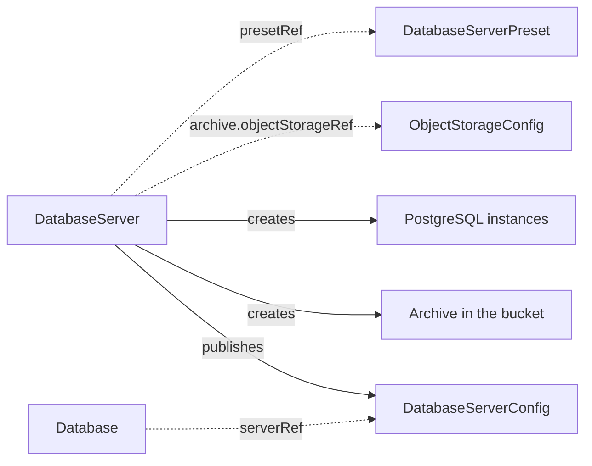

# DatabaseServer

`DatabaseServer` is a namespaced kind that runs one PostgreSQL server for one orchestration cluster. You create it. The operator runs the server through a CloudNativePG cluster and publishes its connection details as a [DatabaseServerConfig](databaseserverconfig.md). With `spec.archive` it also keeps a continuous archive of the server in an object storage bucket.

The server is the relational secondary storage of a cluster. A [Database](database.md) creates the logical database and its users on the published contract, and a `CamundaCluster` reaches it from there. With an archive, the contract declares `pitr.enabled: true`, which a [PointInTimeRestore](pointintimerestore.md) requires.

The operator needs the [CloudNativePG](https://cloudnative-pg.io/) operator on the Kubernetes cluster. An archive also needs the [Barman Cloud plugin](https://cloudnative-pg.io/plugin-barman-cloud/) and cert-manager. See [Installation](../installation.md).

The smallest server names a PostgreSQL major, a volume size, and the contract to publish:

```yaml
apiVersion: core.camunda.io/v1
kind: DatabaseServer
metadata:
  name: my-db
  namespace: my-cluster-ns
spec:
  version: "17"
  storageSize: "64Gi"
  databaseServerConfig: my-db-server
```



## Endpoints and credentials

The published contract carries everything a consumer needs. Its `host` is the read-write address of the server, `my-db-rw.my-cluster-ns.svc`, and its port is 5432. Its `adminCredentialsSecretRef` names the Secret `my-db-superuser`, which CloudNativePG writes with the keys `username` and `password`. No password passes through the operator.

The contract appears only after that Secret exists. Until then `ContractReady` is `False` and the message names the Secret. This keeps a consumer from reading credentials that are not there yet.

Give the contract to a `Database` in the same namespace:

```yaml
apiVersion: core.camunda.io/v1
kind: Database
metadata:
  name: my-db-camunda
  namespace: my-cluster-ns
spec:
  serverRef: my-db-server
  databaseName: camunda
  # ... the rest of your database
```

## Sizing and storage

`spec.instances` is how many PostgreSQL instances run. One instance has no failover: the server is down until its volume is reattached. Two or more give CloudNativePG a standby to promote. `spec.resources` sets the CPU and memory of each instance.

`spec.storageSize` is the size of the data volume of each instance. `spec.walStorageSize` puts the write-ahead log on a volume of its own, which keeps a burst of log writes off the data volume.

```yaml
apiVersion: core.camunda.io/v1
kind: DatabaseServer
metadata:
  name: my-db
  namespace: my-cluster-ns
spec:
  instances: 3
  storageSize: "256Gi"
  walStorageSize: "32Gi"
  storageClassName: "ssd"
  # ... the rest of your server
```

Neither volume size can shrink. The API server rejects a lower value. Raise a size and CloudNativePG grows the volumes in place, if the StorageClass allows it.

`status.volumes` lists the data volumes of the server and the capacity each one reports.

## The archive

Without `spec.archive` the server keeps no archive. Its contract publishes `pitr.enabled: false`, and no point-in-time restore can reach it. Removing the block from a server that had one stops the archive at once and returns the contract to `pitr.enabled: false`. What the server already wrote stays, in the bucket and in [the archive history](#the-archive-history).

With `spec.archive` the operator writes the write-ahead log of the server to the bucket that an [ObjectStorageConfig](objectstorageconfig.md) names, and takes base backups on a schedule. Both together are what a restore replays.

```yaml
apiVersion: core.camunda.io/v1
kind: DatabaseServer
metadata:
  name: my-db
  namespace: my-cluster-ns
spec:
  archive:
    objectStorageRef: my-backup-bucket
    retentionPeriodDays: 30
    baseBackupSchedule: "0 0 2 * * *"
  # ... the rest of your server
```

`retentionPeriodDays` is how far into the past a restore can reach. The operator enforces it on the bucket and publishes the same number as `pitr.retentionPeriodDays` on the contract, so the declared window and the enforced window are one.

`baseBackupSchedule` is a six-field cron in UTC, seconds first. It defaults to `0 0 2 * * *`, which is daily at 02:00. The first base backup runs as soon as the server is up, whatever the schedule says. `ArchiveReady` is `False` until that first base backup completes: an archive that holds write-ahead log and no base backup cannot be recovered to any point.

The archive lives under a prefix of the bucket that holds this server alone: `<basePath>/databaseserver/<namespace>/<name>`. One bucket can serve a whole fleet.

### The archive history

`status.archive.history` records each archive the server has written. `serverName` is the directory in the bucket that holds it, `from` is the earliest point a restore can reach in it, and `to` is the latest. An open record, one without `to`, is the archive the server writes now.

Remove `spec.archive` and the open record closes at that moment. The list itself stays, and no new record is written. The bucket still holds those objects, so a restore can still reach a point inside a closed interval.

Ask for an archive again and the server opens a record of its own, starting at the first base backup of the new archive. `ArchiveReady` stays `False` until that backup completes, because the backups of the archive the server wrote before reach no point in the new one. The window between the two records lies inside no interval, so no restore can reach a point in it.

A [PointInTimeRestore](pointintimerestore.md) needs the database at the requested point before it runs. Recover the server from this archive with the CloudNativePG recovery procedure, then create the `PointInTimeRestore`.

### Base backups are not the backup model

The base backups belong to the archive. They are physical copies of the whole server. [BackupSchedule](backupschedule.md) and [LogicalBackupRDBMS](logicalbackuprdbms.md) take logical dumps instead, coordinated with the Camunda backup API, and they never see these base backups. A base backup produces no `LogicalBackupRDBMS` and shows in no backup list. Only a point-in-time recovery of the server reads one.

Run both on one cluster. The logical backups give you a restore of the Camunda data. The archive gives you a restore of the server to a timestamp.

## Authentication to the bucket

An `ObjectStorageConfig` that holds static credentials names a Secret, and that Secret can live in another namespace. The Barman Cloud plugin reads a Secret in the namespace of the server only, so the operator copies the keys into the Secret `my-db-archive` next to the server. Anyone who can read Secrets in that namespace can then read the bucket credentials. Use workload identity where you want to keep them out.

An `ObjectStorageConfig` that uses workload identity binds the ServiceAccount that CloudNativePG creates for the instance pods. The operator puts the annotation of the bucket on that ServiceAccount. Add your own annotations with `spec.serviceAccount.annotations`. A value you set wins over the derived one on the same key.

## Monitoring

CloudNativePG serves Prometheus metrics on every instance pod. Set `spec.monitoring.podMonitor.enabled` to create a `PodMonitor` over them.

```yaml
apiVersion: core.camunda.io/v1
kind: DatabaseServer
metadata:
  name: my-db
  namespace: my-cluster-ns
spec:
  monitoring:
    podMonitor:
      enabled: true
      interval: "30s"
      labels:
        release: prometheus
  # ... the rest of your server
```

The `PodMonitor` is named `my-db-metrics`. On a Kubernetes cluster that does not serve the `PodMonitor` kind, the operator creates nothing and the server stays ready.

## Suspend

`spec.suspend: true` hibernates the server. CloudNativePG removes the instance pods and keeps the volumes. `ClusterReady` reports `Suspending` while the pods go away, then `Suspended`. `Ready` stays `True`, because the server is in the state you asked for.

The base backup schedule is suspended with the server. The instances are gone, so every slot the schedule reached would otherwise start a backup that cannot run. The archive itself stays configured, and the write-ahead log of the last moments before the instances go still reaches the bucket.

The published contract stays. A consumer that reads it reaches a server that does not answer, so suspend a server only when the cluster that uses it is suspended too.

Set the field back to `false` and the instances come back on the same volumes.

## Presets

`spec.presetRef` names a cluster-scoped [DatabaseServerPreset](databaseserverpreset.md). A field you set on the server replaces the value of the preset for that field. A field you leave unset comes from the preset.

```yaml
apiVersion: core.camunda.io/v1
kind: DatabaseServer
metadata:
  name: my-db
  namespace: my-cluster-ns
spec:
  presetRef: standard
  databaseServerConfig: my-db-server
```

## Images

The PostgreSQL image is `ghcr.io/cloudnative-pg/postgresql:<version>` by default. `spec.platformConfigRef` names a [CamundaPlatformConfig](camundaplatformconfig.md), and the image then comes from that config. An air-gapped cluster needs this.

```yaml
apiVersion: core.camunda.io/v1
kind: CamundaPlatformConfig
metadata:
  name: my-platform-config
spec:
  # Put every default repository behind your mirror.
  imageRegistry: "mirror.example.com"
  images:
    # Or name one repository for PostgreSQL alone. This wins over imageRegistry.
    postgres: "mirror.example.com/postgresql"
  # ... the rest of your platform config
```

The version of the server is the tag, so the repository you name must publish the same major version tags.

## Deletion

Deleting a `DatabaseServer` removes the CloudNativePG cluster, the published contract, and the archive settings. CloudNativePG removes the data volumes with its cluster.

The objects already in the bucket stay. Remove them yourself when you no longer need them.

## Status

```yaml
status:
  observedGeneration: 3
  cluster: my-db
  systemIdentifier: "7370000000000000001"
  archive:
    history:
      - serverName: my-db
        from: "2026-08-01T10:00:00Z"
  volumes:
    - name: my-db-1
      capacity: 256Gi
  conditions:
    - type: Ready
      status: "True"
      reason: Healthy
    - type: ClusterReady
      status: "True"
      reason: Healthy
      message: 3 of 3 instances are ready
    - type: ArchiveReady
      status: "True"
      reason: Healthy
    - type: ContractReady
      status: "True"
      reason: Healthy
    - type: MonitoringReady
      status: "True"
      reason: Disabled
```

| Type | Reason | Meaning | What to do |
| --- | --- | --- | --- |
| `Ready` | `Healthy` | Every part of the server is in its desired state. | Nothing. |
| `Ready` | `Suspended` | `spec.suspend` is true and the instances are gone. | Nothing. |
| `Ready` | `CNPGNotInstalled` | The Kubernetes cluster did not serve the CloudNativePG kinds when the operator started. | Install CloudNativePG, then restart the operator. |
| `Ready` | `BarmanPluginNotInstalled` | The server asks for an archive, and the Kubernetes cluster did not serve the Barman Cloud plugin when the operator started. | Install the plugin, then restart the operator. |
| `Ready` | `InvalidReference` | A referenced resource does not exist, or the merged spec lacks a field. The message names it. | Create the resource, or fix the spec. |
| `Ready` | `MissingSecret` | The credentials Secret of the bucket is missing or lacks a key. The message names it. | Create the Secret, or fix its keys. |
| `ClusterReady` | `Creating`, `Updating` | CloudNativePG is converging the instances. | Wait. |
| `ClusterReady` | `Healthy` | Every instance the spec asks for is ready. | Nothing. |
| `ClusterReady` | `AliveFailing` | CloudNativePG reports a phase it cannot leave on its own. The message names the phase. | Read the CloudNativePG cluster for the reason. |
| `ArchiveReady` | `Disabled` | The server has no `archive` block. | Nothing. |
| `ArchiveReady` | `Blocked` | The archive the server writes now holds no base backup yet. A new server and a server that asked for an archive again both start here. | Wait. If it never completes, read the CloudNativePG backup for the reason. |
| `ArchiveReady` | `Healthy` | The archive holds a base backup and takes the write-ahead log. | Nothing. |
| `ContractReady` | `Blocked` | The superuser Secret does not exist yet. | Wait for the instances to start. |
| `ContractReady` | `Healthy` | The contract is published. | Nothing. |
| `MonitoringReady` | `Disabled` | Scraping is off. | Nothing. |
| `MonitoringReady` | `Healthy` | The `PodMonitor` is applied. | Nothing. |

`status.cluster` is the CloudNativePG cluster that the contract points at. `status.systemIdentifier` is the identity of the PostgreSQL instance behind it, which a [Database](database.md) uses to tell two servers apart. `status.observedGeneration` is the last generation the operator reconciled.

## Spec reference

Every field, with its type, whether it is required, and its default:

```yaml
apiVersion: core.camunda.io/v1
kind: DatabaseServer
metadata:
  name: my-db
  namespace: my-cluster-ns
spec:
  # string. Optional. Name of a cluster-scoped DatabaseServerPreset used as the baseline.
  presetRef: "standard"
  # string. Optional. Name of a cluster-scoped CamundaPlatformConfig. Only its image settings are read.
  platformConfigRef: "my-platform-config"
  # string. Required, unless the preset provides it. PostgreSQL major version, 14 or later.
  version: "17"
  # integer. Optional, default: 1. Number of PostgreSQL instances, at least 1.
  instances: 3
  # object (corev1.ResourceRequirements). Optional. CPU and memory of each instance.
  resources:
    requests: { cpu: "2", memory: "4Gi" }
    limits: { memory: "4Gi" }
  # string (resource quantity). Required, unless the preset provides it. Size of the data volume of each instance.
  storageSize: "256Gi"
  # string. Optional, default: the default StorageClass of the Kubernetes cluster. StorageClass of the volumes.
  storageClassName: "ssd"
  # string (resource quantity). Optional. Size of a separate volume for the write-ahead log.
  walStorageSize: "32Gi"
  # object. Optional. The ServiceAccount that CloudNativePG creates for the instance pods.
  serviceAccount:
    # map[string]string. Optional. Annotations for workload identity. A value here wins over the one derived from the bucket.
    annotations: {}
  # object. Optional. Scheduling constraints of the instance pods. A server that sets it replaces the block of the preset as a whole.
  scheduling:
    # object (corev1.NodeAffinity). Optional. Node affinity rules.
    nodeAffinity: {}
    # object (corev1.PodAffinity). Optional. Pod affinity rules.
    podAffinity: {}
    # list (corev1.Toleration). Optional. Tolerations of the pods.
    tolerations: []
  # map[string]string. Optional. Extra labels on the instance pods.
  podLabels: {}
  # map[string]string. Optional. Extra annotations on the instance pods.
  podAnnotations: {}
  # object. Optional. Prometheus scraping. A server that sets it replaces the block of the preset as a whole.
  monitoring:
    podMonitor:
      # boolean. Optional, default: false. Creates a PodMonitor over the instance pods.
      enabled: true
      # map[string]string. Optional. Extra labels on the PodMonitor.
      labels: {}
      # map[string]string. Optional. Extra annotations on the PodMonitor.
      annotations: {}
      # string. Optional, default: the Prometheus setting. Scrape interval, as a Prometheus duration.
      interval: "30s"
  # string. Required. Name of the DatabaseServerConfig the operator publishes in this namespace.
  databaseServerConfig: my-db-server
  # object. Optional. The continuous archive of the server. Without it no point-in-time restore can reach the server.
  archive:
    # string. Required in this block. Name of a cluster-scoped ObjectStorageConfig.
    objectStorageRef: my-backup-bucket
    # integer. Required in this block. How many days into the past a restore can reach, at least 1.
    retentionPeriodDays: 30
    # string. Optional, default: "0 0 2 * * *". Six-field cron in UTC, seconds first, for the base backups.
    baseBackupSchedule: "0 0 2 * * *"
  # boolean. Optional, default: false. Hibernates the server and keeps its volumes.
  suspend: false
```

### Validation rules

- `databaseServerConfig` is required on a `DatabaseServer` and must not be set in a preset.
- `storageSize` and `walStorageSize` cannot shrink. The API server rejects a lower value on an update.
- `version` is a bare major, such as `17`. Anything below 14 is rejected on the `Ready` condition with reason `InvalidReference`, because Camunda 8.9 supports PostgreSQL 14 and later. See the [RDBMS version support policy](https://docs.camunda.io/docs/self-managed/concepts/databases/relational-db/rdbms-support-policy/).
- `archive.retentionPeriodDays` must be at least 1.
- `version` and `storageSize` must be present after the preset merge. A missing field is reported on `Ready` with reason `InvalidReference`.

### A production-shaped example

```yaml
apiVersion: core.camunda.io/v1
kind: DatabaseServer
metadata:
  name: my-db
  namespace: my-cluster-ns
spec:
  presetRef: standard
  platformConfigRef: my-platform-config
  databaseServerConfig: my-db-server
  archive:
    objectStorageRef: my-backup-bucket
    retentionPeriodDays: 30
```

## Related

- [DatabaseServerPreset](databaseserverpreset.md): the cluster-scoped baseline that `spec.presetRef` names.
- [DatabaseServerConfig](databaseserverconfig.md): the contract this kind publishes.
- [Database](database.md): creates the logical database and its users on the published contract.
- [ObjectStorageConfig](objectstorageconfig.md): the bucket that `spec.archive.objectStorageRef` names.
- [PointInTimeRestore](pointintimerestore.md): reads `pitr.enabled` and the retention period from the published contract.
- [Secondary storage guide](../guides/secondary-storage.md): how to choose and connect secondary storage.
- [Installation](../installation.md): CloudNativePG, cert-manager, and the Barman Cloud plugin.
