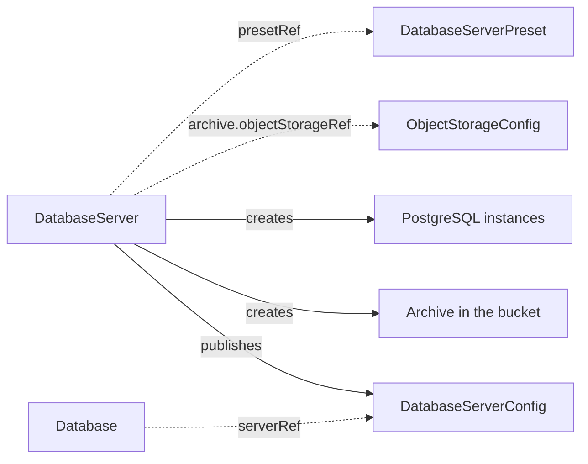

# DatabaseServer

`DatabaseServer` is a namespaced kind that runs one PostgreSQL instance, which one or more orchestration clusters use through `Database` resources. You create it. The operator runs the server through a CloudNativePG cluster and publishes its connection details as a [DatabaseServerConfig](databaseserverconfig.md). With `spec.archive` it also keeps a continuous archive of the server in an object storage bucket.

The server is the relational secondary storage of the clusters that use it. A [Database](database.md) creates the logical database and its users on the published contract, and a `CamundaCluster` reaches it from there. With an archive, the contract declares `pitr.enabled: true`, which a [PointInTimeRestore](pointintimerestore.md) requires.

The operator needs the [CloudNativePG](https://cloudnative-pg.io/) operator on the Kubernetes cluster. An archive also needs the [Barman Cloud plugin](https://cloudnative-pg.io/plugin-barman-cloud/) and cert-manager. See [Installation](../installation.md).

The smallest server names a PostgreSQL major, a volume size, and the contract to publish:

```yaml
apiVersion: core.camunda.io/v1
kind: DatabaseServer
metadata:
  name: my-db
  namespace: my-cluster-ns
spec:
  version: "17"
  storageSize: "64Gi"
  databaseServerConfig: my-db-server
```

The name of the server names the CloudNativePG cluster and every address that comes off it. It must start with a lowercase letter, hold only lowercase letters, digits, and `-`, and be 46 characters or shorter. CloudNativePG takes 50, and a rollback adds a suffix of up to four characters, `-r99`.

The name must also be free. If a CloudNativePG cluster of that name is already there, and this server does not own it, the server runs nothing. `ClusterReady` reports `ClusterTaken`. The message names the owner, or says that no owner controls it. The server also withdraws the contract, the base backup schedule, and the `PodMonitor`, because all three name the cluster of that name. See [Status](#status).

Every other object the server derives a name for is left alone the same way. If another owner controls the `ObjectStore`, the archive Secret, the base backup schedule, or the `PodMonitor` under one of those names, the server neither writes on it nor removes it. While the server manages that object, `ArchiveReady` or `MonitoringReady` reads `False` with a message that names the owner. A server that manages no archive reports nothing about a foreign schedule under its name.

The `ObjectStore` of that name is also the object the cluster archives through. If another owner controls it, this server archives nothing. Its cluster writes no write-ahead log, it takes no base backup, and its contract publishes `pitr.enabled: false`. `ArchiveReady` reports `ArchiveTaken`, and the message names the owner. The archive the server wrote before, and `status.archive.history`, stay as they are. Remove that `ObjectStore`, or give this server a name of its own, and the server archives again under the record it already had. The bucket holds no write-ahead log of the time the name was held, so no rollback reaches a point inside that window.

A rollback builds its cluster under the name of the server plus that suffix. The number in the suffix counts the archive records in `status.archive.history`. A rollback, an archive you re-enable, and a change of bucket each add one. A name inside the bound reaches the new cluster whole while that number stays below 100. Above it, the operator shortens the name to a head and a hash.



## Endpoints and credentials

The published contract carries everything a consumer needs. Its `host` is the read-write address of the server, `my-db-rw.my-cluster-ns.svc`, and its port is 5432. Its `adminCredentialsSecretRef` names the Secret `my-db-superuser`, which CloudNativePG writes with the keys `username` and `password`. No password passes through the operator.

The contract appears only after that Secret exists. Until then `ContractReady` is `False` and the message names the Secret. This keeps a consumer from reading credentials that are not there yet.

Change `spec.databaseServerConfig` and the server publishes the new name and removes the contract of the name before it. A `Database` that still names the old one reports `Ready` `False` with reason `InvalidReference`. Point it at the new name, or rename the contract back. Two contracts of the server outlive a rename: one that carries the answer of the last rollback, and one that a rollback still runs on. See [Recovery](#recovery).

The name must also be free. A `DatabaseServerConfig` that already exists under it, with or without an owner, is not taken over. The server publishes nothing on it and reports `ContractReady` `False` with reason `ContractTaken`. The message names the owner, or says that no owner controls it. A contract that a person wrote for an external server keeps its endpoint and its credentials. A contract of another `DatabaseServer` keeps the endpoint of that server. Give this server a name of its own, or remove that contract. The waiting server then publishes the name.

Give the contract to a `Database` in the same namespace:

```yaml
apiVersion: core.camunda.io/v1
kind: Database
metadata:
  name: my-db-camunda
  namespace: my-cluster-ns
spec:
  serverRef: my-db-server
  databaseName: camunda
  # ... the rest of your database
```

## Sizing and storage

`spec.instances` is how many PostgreSQL instances run. One instance has no failover: the server is down until its volume is reattached. Two or more give CloudNativePG a standby to promote. `spec.resources` sets the CPU and memory of each instance.

`spec.storageSize` is the size of the data volume of each instance. `spec.walStorageSize` puts the write-ahead log on a volume of its own, which keeps a burst of log writes off the data volume.

```yaml
apiVersion: core.camunda.io/v1
kind: DatabaseServer
metadata:
  name: my-db
  namespace: my-cluster-ns
spec:
  instances: 3
  storageSize: "256Gi"
  walStorageSize: "32Gi"
  storageClassName: "ssd"
  # ... the rest of your server
```

Neither volume size can shrink. Admission rejects a lower inline value. If a preset lowers a size under a running server, the operator keeps the current size and records a Warning event with reason `StorageShrinkIgnored`. Raise a size and CloudNativePG grows the volumes in place, if the StorageClass allows it. To get a smaller volume, delete and recreate the server.

The write-ahead log volume cannot be removed either. You can add `walStorageSize` to a server that runs without one. If you clear it, or a preset clears it, the operator keeps the volume at the size it has and records a Warning event with reason `WALStorageKept`. To run the log on the data volume again, delete and recreate the server.

`status.volumes` lists every bound volume of the cluster the contract points at, and the capacity each one reports. A server with a write-ahead log volume reports that one here too, under the name of its data volume with the suffix `-wal`. A server that reports `ClusterReady` `ClusterTaken` lists none of them, and no size of that cluster reaches its own spec. The volumes under a held name belong to the cluster that holds it.

## The archive

Without `spec.archive` the server keeps no archive. Its contract publishes `pitr.enabled: false`, and no point-in-time restore can reach it. Removing the block from a server that had one stops the archive at once and returns the contract to `pitr.enabled: false`. What the server already wrote stays, in the bucket and in [the archive history](#the-archive-history).

With `spec.archive` the operator writes the write-ahead log of the server to the bucket that an [ObjectStorageConfig](objectstorageconfig.md) names, and takes base backups on a schedule. Both together are what a restore replays.

```yaml
apiVersion: core.camunda.io/v1
kind: DatabaseServer
metadata:
  name: my-db
  namespace: my-cluster-ns
spec:
  archive:
    objectStorageRef: my-backup-bucket
    retentionPeriodDays: 30
    baseBackupSchedule: "0 0 2 * * *"
  # ... the rest of your server
```

`retentionPeriodDays` is how far into the past a restore can reach. The operator enforces it on the bucket and publishes the same number as `pitr.retentionPeriodDays` on the contract, so the declared window and the enforced window are one. It covers the archive the server writes now, and no other. An archive that the server left behind, after a rollback or a change of bucket, stays in the bucket until you remove it. A [PointInTimeRestore](pointintimerestore.md) still reaches no point older than `retentionPeriodDays` of now, whichever archive holds it.

Raise `retentionPeriodDays` and the window widens only as the archive writes past what the shorter period pruned. The bucket dropped the older points while the shorter period was in force, and nothing brings them back. `status.archive.reachableFrom` is the oldest point the bucket still goes back to, and a rollback to a point before it is refused with `result: Unavailable`.

`baseBackupSchedule` is a six-field cron in UTC, seconds first: seconds, minutes, hours, day of month, month, day of week. It defaults to `0 0 2 * * *`, which is daily at 02:00. Each field takes `*`, `?`, a number, a range, a list, or a step such as `*/15`. The month and the day of week also take their names, such as `JAN` and `SUN`. The descriptors `@yearly`, `@annually`, `@monthly`, `@weekly`, `@daily`, `@midnight`, `@hourly`, and `@every 6h` are accepted too.

Admission checks each field against the values CloudNativePG takes there: 0-59 for seconds and minutes, 0-23 for hours, 1-31 for the day of the month, 1-12 or `JAN`-`DEC` for the month, and 0-6 or `SUN`-`SAT` for the day of the week. It rejects the five-field cron of a Kubernetes CronJob, because CloudNativePG reads the first field as seconds: `0 2 * * *` runs every hour at two minutes past, not daily at 02:00. A step takes at most three digits, and the number in `@every` takes at most six digits on each side of the point. A longer number is refused, because CloudNativePG cannot read it and the base backups stop. Admission cannot compare the two ends of a range. The operator refuses a range that reads downward, such as `FRI-MON`. `Ready` reports `InvalidReference` with the schedule in the message, and no base backup schedule reaches the cluster.

The first base backup runs as soon as the server is up, whatever the schedule says. `ArchiveReady` is `False` until that first base backup completes: an archive that holds write-ahead log and no base backup cannot be recovered to any point.

The archive lives under a prefix of the bucket that holds this server alone: `<basePath>/databaseserver/<namespace>/<name>-<id>`. The `<id>` is the first eight hex characters of the SHA-256 of the UID that Kubernetes gave the server. A server that you delete and create again under the same name gets a prefix of its own. The Barman Cloud plugin refuses a new cluster whose prefix already holds an archive. One bucket can serve a whole fleet.

### The archive history

`status.archive.history` records each archive the server has written. `serverName` is the directory in the bucket that holds it, `objectStorageRef` is the `ObjectStorageConfig` of that bucket, `location` is where in object storage it was written, which is the bucket, the path, and the endpoint or region that selects the service, `from` is the earliest point a restore can reach in it, and `to` is the latest. An open record, one without `to`, is the archive the server writes now.

`status.archive.reachableFrom` is the oldest point the objects in the bucket still go back to. An interval says which archive wrote a point, and this says what the bucket kept. It moves forward with the retention period, and it stands still while a raised period widens the window.

A rollback closes the record of the archive it read. That record ends at whichever comes first: the contract moves to the recovered server, or that server takes its first base backup. The recovered server opens a record of its own at that first base backup. The window between the two lies in no interval either way, so no restore can reach a point in it.

Remove `spec.archive` and the open record closes at that moment. The list itself stays, and no new record is written. The bucket still holds those objects, so a restore can still reach a point inside a closed interval.

Ask for an archive again and the server opens a record of its own, starting at the first base backup of the new archive. `ArchiveReady` stays `False` until that backup completes, because the backups of the archive the server wrote before reach no point in the new one. The window between the two records lies inside no interval, so no restore can reach a point in it.

If you ask for it again on another location, no record is open to close. The server records the move as `status.archive.boundary` and clears it when the new record opens. A base backup that was still running to the location the server left ends after the move, and the boundary keeps it from opening the new record.

Change `spec.archive.objectStorageRef` and the same happens, as long as the new reference resolves to another location. Two references to one bucket and one prefix are one archive, and a change between them closes no record. The open record closes at the moment the location changes, and a record of the new location opens at its first base backup. A rollback reads the location the server archives to now, so a point inside a record of an earlier location is refused with `result: Unavailable`. The message names both the bucket contract and the location of each. Point `spec.archive.objectStorageRef` back at the earlier bucket only if you accept that the current interval closes as well.

Edit the [ObjectStorageConfig](objectstorageconfig.md) in place, or remove it and create it again on another bucket, and the same happens, unless a rollback is reading that archive. A rollback holds the archive where it recorded it: `Ready` goes `False` with reason `InvalidReference`, the message names both locations, and the operator leaves the archive settings as they are until you put the bucket back or the rollback ends. The operator holds the workload identity of the bucket together with those archive settings, so the pods keep the identity that reads the archive the rollback asked for. An identity or a credential that you change alone, without moving the bucket, reaches the server at once. The name of the contract stays, the location behind it changes, and the location is what the operator compares. A new endpoint or region counts as a new location, because the objects are then on another service. A rollback to a point in the interval before the move is refused the same way.

A [PointInTimeRestore](pointintimerestore.md) reaches any point inside a recorded interval. See [Recovery](#recovery).

### Base backups are not the backup model

The base backups belong to the archive. They are physical copies of the whole server. [BackupSchedule](backupschedule.md) and [LogicalBackupRDBMS](logicalbackuprdbms.md) take logical dumps instead, coordinated with the Camunda backup API, and they never see these base backups. A base backup produces no `LogicalBackupRDBMS` and shows in no backup list. Only a point-in-time recovery of the server reads one.

Run both on one cluster. The logical backups give you a restore of the Camunda data. The archive gives you a restore of the server to a timestamp.

## Recovery

The server rolls itself back to any point that one of its archives holds. Its contract declares this with `pitr.recovery: operator`, so a [PointInTimeRestore](pointintimerestore.md) asks for the rollback itself and you prepare nothing.

For a Camunda cluster, the safe action is a [PointInTimeRestore](pointintimerestore.md). It suspends the cluster, asks for the rollback, and restores the primary storage in order. A request that you write by hand rolls the database back alone. It is for a consumer outside the operator. That consumer stops every writer first, then brings its own state back in line.

Ask for it by hand by writing `spec.recovery` on the published contract:

```yaml
apiVersion: core.camunda.io/v1
kind: DatabaseServerConfig
metadata:
  name: my-db-server
  namespace: my-cluster-ns
spec:
  recovery:
    requestID: 3f2b1c4d-5e6a-4b7c-8d9e-0f1a2b3c4d5e
    requestedBy: my-cluster-ns/my-restore
    targetTime: "2026-08-20T14:30:00Z"
  # ... the rest of your contract
```

The answer arrives in `spec.pitr.lastRecovery` on the same contract. [DatabaseServerConfig](databaseserverconfig.md) documents the request and the three results.

A rollback replaces the server. The operator builds a second CloudNativePG cluster from the archive that holds `targetTime`. Its name is the name of the server, `-r`, and the number of archives the server has written, so the first rollback of a server that only ever wrote one archive builds `my-db-r1`. A server that stopped and started its archive counts those too and recovers into a higher number. `status.recovery.cluster` names the cluster the rollback builds, and `status.cluster` names the one the contract points at.

The operator never writes to a cluster of that name that the server does not own. It refuses the rollback with `result: Failed`, and the message names the cluster. A cluster that somebody replaces under that name after the contract has moved to it is refused the same way. The server then runs from the cluster it came from again, and the replacement is left alone.

The operator points the contract at the new cluster once CloudNativePG reports it healthy, and it then removes the old cluster and its data volumes. Every consumer of the contract reads the new `host` and the superuser Secret of the new cluster. A `CamundaCluster` rolls its pods to pick them up.

The recovered cluster writes an archive of its own, under its own name in the same bucket. The archive it recovered from stays, so a later restore can reach back across the rollback. That archive ends at whichever comes first: the contract moves to the recovered cluster, or that cluster takes its first base backup. The new archive starts at that first base backup. The gap between the two lies in no interval either way, so no restore can reach a point in it.

The server names one contract while a rollback runs. Change `spec.databaseServerConfig` in the middle and `Ready` reports `InvalidReference` until the rollback ends. The server keeps publishing the contract that asked. Once the answer is out, it publishes the new name as well.

The server keeps its whole archive while a rollback runs, because the rollback recovers out of it. Edit any of `objectStorageRef`, `retentionPeriodDays`, and `baseBackupSchedule`, move the bucket under the name `objectStorageRef` holds, remove `spec.archive`, or change one of those fields in the preset the server reads, and `Ready` reports `InvalidReference` until the rollback ends. The message names what to put back. The archive keeps every setting it had when the rollback started, and the edit applies once the answer is out. A shorter `retentionPeriodDays` is the one that matters most: it becomes the retention policy of the bucket, and it would prune the base backup the rollback starts from.

Everything outside `spec.archive` still applies while a rollback runs. Only the contract name and the archive are held.

The contract that asked stays. It is the only place the answer is published, so whoever asked can still read `spec.pitr.lastRecovery` on it. It goes when the next rollback answers on another contract.

**CAUTION: A rollback erases everything the server wrote after `targetTime`.** It rolls back every logical database on the server, not one of them. A [PointInTimeRestore](pointintimerestore.md) therefore needs the server to itself, and it holds while more than one `Database` uses the server.

A suspended server refuses the request with `result: Failed`. Unsuspend it, then ask again. A server whose `ObjectStore` another owner controls refuses the request with `result: Unavailable`, because it reads no archive of its own. `ArchiveReady` names the owner. A point that no archive of the server holds is refused with `result: Unavailable`, and the message names the windows the server does hold. A point that an archive of an earlier bucket holds is refused the same way, and the message names both buckets. A point in the future, and a point older than `spec.archive.retentionPeriodDays`, are refused the same way, because the bucket holds no copy of either. A point that a shorter `retentionPeriodDays` pruned before you raised it is refused the same way, and the message names the oldest point the bucket still goes back to.

## Authentication to the bucket

An `ObjectStorageConfig` that holds static credentials names a Secret, and that Secret can live in another namespace. The Barman Cloud plugin reads a Secret in the namespace of the server only, so the operator copies the keys into the Secret `my-db-archive` next to the server. Anyone who can read Secrets in that namespace can then read the bucket credentials. Use workload identity where you want to keep them out.

An `ObjectStorageConfig` that uses workload identity binds the ServiceAccount that CloudNativePG creates for the instance pods. The operator puts the annotation of the bucket on that ServiceAccount. Add your own annotations with `spec.serviceAccount.annotations`. A value you set wins over the derived one on the same key.

## Monitoring

CloudNativePG serves Prometheus metrics on every instance pod. Set `spec.monitoring.podMonitor.enabled` to create a `PodMonitor` over them.

```yaml
apiVersion: core.camunda.io/v1
kind: DatabaseServer
metadata:
  name: my-db
  namespace: my-cluster-ns
spec:
  monitoring:
    podMonitor:
      enabled: true
      interval: "30s"
      labels:
        release: prometheus
  # ... the rest of your server
```

The `PodMonitor` is named `my-db-metrics`. On a Kubernetes cluster that does not serve the `PodMonitor` kind, the operator creates nothing and the server stays ready.

## Suspend

`spec.suspend: true` hibernates the server. CloudNativePG removes the instance pods and keeps the volumes. `ClusterReady` reports `Suspending` while the pods go away, then `Suspended`. `Ready` stays `True`, because the server is in the state you asked for.

The base backup schedule is suspended with the server. The instances are gone, so every slot the schedule reached would otherwise start a backup that cannot run. The archive itself stays configured, and the write-ahead log of the last moments before the instances go still reaches the bucket.

`ArchiveReady` stays `True` for as long as the suspension lasts, even on a server suspended before its first base backup completed. There is nothing left to wait for while the schedule is suspended. The condition takes the first base backup into account again when you unsuspend the server.

The published contract stays. A consumer that reads it reaches a server that does not answer, so suspend a server only when the cluster that uses it is suspended too.

Set the field back to `false` and the instances come back on the same volumes.

## Presets

`spec.presetRef` names a cluster-scoped [DatabaseServerPreset](databaseserverpreset.md). A field you set on the server replaces the value of the preset for that field. A field you leave unset comes from the preset.

```yaml
apiVersion: core.camunda.io/v1
kind: DatabaseServer
metadata:
  name: my-db
  namespace: my-cluster-ns
spec:
  presetRef: standard
  databaseServerConfig: my-db-server
```

## The PostgreSQL version

`spec.version` is a bare PostgreSQL major, such as `17`. It selects the image tag. Camunda 8.9 supports PostgreSQL 14 and later.

The major of a running server cannot change. A `spec.version` that names another major, higher or lower, is refused. `Ready` goes `False` with reason `VersionChangeRefused`, and the server records a Warning event of the same name. The server keeps running the major it has. Everything else about it stays maintained, so a rollback in flight finishes and the contract and the archive keep working.

```yaml
apiVersion: core.camunda.io/v1
kind: DatabaseServer
metadata:
  name: my-db
  namespace: my-cluster-ns
spec:
  # A bare major. It cannot change once the server runs.
  version: "17"
  # ... the rest of your server
```

A preset carries the version too, so a new `spec.server.version` on a [DatabaseServerPreset](databaseserverpreset.md) reaches every server that reads it. Set the version back, on the server or on the preset, and the refusal clears. No annotation lets the change through.

To run a later major, create a `DatabaseServer` on that version and move the data to it. A point-in-time restore is no help here: only the major that wrote an archive can read it back.

## Images

The PostgreSQL image is `ghcr.io/cloudnative-pg/postgresql:<version>` by default. `spec.platformConfigRef` names a [CamundaPlatformConfig](camundaplatformconfig.md), and the image then comes from that config. An air-gapped cluster needs this.

```yaml
apiVersion: core.camunda.io/v1
kind: CamundaPlatformConfig
metadata:
  name: my-platform-config
spec:
  # Put every default repository behind your mirror.
  imageRegistry: "mirror.example.com"
  images:
    # Or name one repository for PostgreSQL alone. This wins over imageRegistry.
    postgres: "mirror.example.com/postgresql"
  # ... the rest of your platform config
```

The version of the server is the tag, so the repository you name must publish the same major version tags.

## Deletion

Deleting a `DatabaseServer` removes the CloudNativePG cluster, the published contract, and the archive settings. CloudNativePG removes the data volumes with its cluster.

The objects already in the bucket stay. Remove them yourself when you no longer need them. A server that you create again under the same name writes to a prefix of its own, and reads nothing that the first one left.

## Status

```yaml
status:
  observedGeneration: 3
  cluster: my-db
  systemIdentifier: "7370000000000000001"
  archive:
    history:
      - serverName: my-db
        objectStorageRef: my-backup-bucket
        location: s3://my-backup-bucket/clusters/databaseserver/my-cluster-ns/my-db-4c2a9f1e (region eu-west-1)
        from: "2026-08-01T10:00:00Z"
    reachableFrom: "2026-07-25T09:58:04Z"
  recovery:
    requestID: 3f2b1c4d-5e6a-4b7c-8d9e-0f1a2b3c4d5e
    contract: my-database-server
    requestedBy: my-cluster-ns/my-restore
    targetTime: "2026-08-20T14:30:00Z"
    cluster: my-db-r1
    result: Completed
    completedAt: "2026-08-20T15:02:11Z"
  volumes:
    - name: my-db-1
      capacity: 256Gi
    - name: my-db-1-wal
      capacity: 32Gi
  conditions:
    - type: Ready
      status: "True"
      reason: Healthy
    - type: ClusterReady
      status: "True"
      reason: Healthy
      message: 3 of 3 instances are ready
    - type: ArchiveReady
      status: "True"
      reason: Healthy
    - type: ContractReady
      status: "True"
      reason: Healthy
    - type: MonitoringReady
      status: "True"
      reason: Disabled
```

| Type | Reason | Meaning | What to do |
| --- | --- | --- | --- |
| `Ready` | `Healthy` | Every part of the server is in its desired state. | Nothing. |
| `Ready` | `Blocked` | The archive that the server asks for holds no base backup yet, so no restore can reach the server. | Wait. |
| `Ready` | `Suspended` | `spec.suspend` is true and the instances are gone. | Nothing. |
| `Ready` | `CNPGNotInstalled` | The Kubernetes cluster did not serve the CloudNativePG kinds when the operator started. | Install CloudNativePG, then restart the operator. |
| `Ready` | `BarmanPluginNotInstalled` | The server asks for an archive, and the Kubernetes cluster did not serve the Barman Cloud plugin when the operator started. | Install the plugin, then restart the operator. |
| `Ready` | `InvalidReference` | A referenced resource does not exist, or the merged spec lacks a field. The message names it. | Create the resource, or fix the spec. |
| `Ready` | `MissingSecret` | The credentials Secret of the bucket is missing or lacks a key. The message names it. | Create the Secret, or fix its keys. |
| `Ready` | `VersionChangeRefused` | `version` names a PostgreSQL major other than the one the server runs. The message names both. | Set the version back to the major the server runs. See [The PostgreSQL version](#the-postgresql-version). |
| `ClusterReady` | `Creating`, `Updating` | CloudNativePG is converging the instances. | Wait. |
| `ClusterReady` | `Healthy` | Every instance the spec asks for is ready. | Nothing. |
| `ClusterReady` | `AliveFailing` | CloudNativePG reports a phase it cannot leave on its own. The message names the phase. | Read the CloudNativePG cluster for the reason. |
| `ClusterReady` | `ClusterTaken` | A CloudNativePG cluster of the name this server derives already exists, and this server does not own it. The message names the owner, or says that no owner controls it. The server writes nothing on that cluster. It also removes the contract, the base backup schedule, and the `PodMonitor`, because all three name the cluster of that name. The bucket settings and `status.archive.history` stay, so the server comes back when the name is free. | Remove that cluster, or give this server a name of its own. |
| `ArchiveReady` | `Disabled` | The server has no `archive` block. | Nothing. |
| `ArchiveReady` | `Blocked` | The archive the server writes now holds no base backup yet. A new server and a server that asked for an archive again both start here. A suspended server never does. | Wait. If it never completes, read the CloudNativePG backup for the reason. |
| `ArchiveReady` | `ArchiveTaken` | A Barman Cloud `ObjectStore` of the name this server derives already exists, and another owner controls it. The message names the owner. The cluster of this server carries no archive plugin, so it writes no write-ahead log and takes no base backup. Its contract publishes `pitr.enabled: false`, and a rollback request is refused with `result: Unavailable`. The archive the server wrote before and `status.archive.history` stay, so the server archives again when the name is free. No rollback reaches a point inside the window the name was held, because the bucket holds no write-ahead log of it. | Remove that `ObjectStore`, or give this server a name of its own. |
| `ArchiveReady` | `Healthy` | The archive holds a base backup and takes the write-ahead log. | Nothing. |
| `ContractReady` | `Blocked` | The superuser Secret does not exist yet. | Wait for the instances to start. |
| `ContractReady` | `ContractTaken` | A `DatabaseServerConfig` of the name `spec.databaseServerConfig` asks for already exists, and this server did not publish it. The message names the owner, or says that no owner controls it. The server writes nothing on that contract, so the endpoint and the credentials its consumers read stay what they are. | Give this server a contract name of its own, or remove that contract. |
| `ContractReady` | `Disabled` | The name of the cluster is taken, so the server withdrew the contract. `ClusterReady` says who holds the name. | Read `ClusterReady`. |
| `ContractReady` | `Healthy` | The contract is published. | Nothing. |
| `MonitoringReady` | `Disabled` | Scraping is off. | Nothing. |
| `MonitoringReady` | `Healthy` | The `PodMonitor` is applied. | Nothing. |

A part that the spec switches off is reported on its own condition and never on `Ready`. `MonitoringReady` stays out of `Ready` always, and `ArchiveReady` stays out of it on a server with no `archive` block. A server that runs therefore reads `Ready: Healthy` whether or not it scrapes, and so does a server with no `archive` block. A server that asks for an archive reads `Ready: Blocked` until its first base backup completes.

`status.cluster` is the CloudNativePG cluster that the contract points at. `status.systemIdentifier` is the identity of the PostgreSQL instance behind it, which a [Database](database.md) uses to tell two servers apart. `status.observedGeneration` is the last generation the operator reconciled.

`status.recovery` is the rollback request the server works on now, or the last one it answered. `contract` is the `DatabaseServerConfig` that asked. `cluster` is the CloudNativePG cluster it builds, and it is empty for a request the server refused before it built one. `archive` is the archive it recovers out of: `serverName` and `location` say where it is, and `objectStorageRef`, `retentionPeriodDays`, and `baseBackupSchedule` are the settings the server had when the rollback started. Those three are what an edit of `spec.archive` is held against, and what the server keeps rendering until the rollback is answered. `identity` is the workload identity of that bucket at the same moment. The server holds it together with those three settings, and it is unset for a bucket that holds static credentials. `completedAt` and `result` are unset while the rollback runs. The same answer is published on the contract, in `spec.pitr.lastRecovery`, and the server writes it there again if the contract loses it.

## Spec reference

Every field, with its type, whether it is required, and its default:

```yaml
apiVersion: core.camunda.io/v1
kind: DatabaseServer
metadata:
  name: my-db
  namespace: my-cluster-ns
spec:
  # string. Optional. Name of a cluster-scoped DatabaseServerPreset used as the baseline.
  presetRef: "standard"
  # string. Optional. Name of a cluster-scoped CamundaPlatformConfig. Only its image settings are read.
  platformConfigRef: "my-platform-config"
  # string. Required, unless the preset provides it. PostgreSQL major version, 14 or later.
  # It cannot move to another major once the server runs.
  version: "17"
  # integer. Optional, default: 1. Number of PostgreSQL instances, at least 1.
  instances: 3
  # object (corev1.ResourceRequirements). Optional. CPU and memory of each instance.
  resources:
    requests: { cpu: "2", memory: "4Gi" }
    limits: { memory: "4Gi" }
  # string (resource quantity). Required, unless the preset provides it. Size of the data volume of each instance.
  storageSize: "256Gi"
  # string. Optional, default: the default StorageClass of the Kubernetes cluster. StorageClass of the volumes.
  storageClassName: "ssd"
  # string (resource quantity). Optional. Size of a separate volume for the write-ahead log.
  # It cannot be cleared once the server has the volume.
  walStorageSize: "32Gi"
  # object. Optional. The ServiceAccount that CloudNativePG creates for the instance pods.
  serviceAccount:
    # map[string]string. Optional. Annotations for workload identity. A value here wins over the one derived from the bucket.
    annotations: {}
  # object. Optional. Scheduling constraints of the instance pods. A server that sets it replaces the block of the preset as a whole.
  scheduling:
    # object (corev1.NodeAffinity). Optional. Node affinity rules.
    nodeAffinity: {}
    # object (corev1.PodAffinity). Optional. Pod affinity rules.
    podAffinity: {}
    # list (corev1.Toleration). Optional. Tolerations of the pods.
    tolerations: []
  # map[string]string. Optional. Extra labels on the instance pods.
  podLabels: {}
  # map[string]string. Optional. Extra annotations on the instance pods.
  podAnnotations: {}
  # object. Optional. Prometheus scraping. A server that sets it replaces the block of the preset as a whole.
  monitoring:
    podMonitor:
      # boolean. Optional, default: false. Creates a PodMonitor over the instance pods.
      enabled: true
      # map[string]string. Optional. Extra labels on the PodMonitor.
      labels: {}
      # map[string]string. Optional. Extra annotations on the PodMonitor.
      annotations: {}
      # string. Optional, default: the Prometheus setting. Scrape interval, as a Prometheus duration.
      interval: "30s"
  # string. Required. Name of the DatabaseServerConfig the operator publishes in this namespace.
  databaseServerConfig: my-db-server
  # object. Optional. The continuous archive of the server. Without it no point-in-time restore can reach the server.
  archive:
    # string. Required in this block. Name of a cluster-scoped ObjectStorageConfig.
    objectStorageRef: my-backup-bucket
    # integer. Required in this block. How many days into the past a restore can reach, at least 1.
    retentionPeriodDays: 30
    # string. Optional, default: "0 0 2 * * *". Six-field cron in UTC, seconds first, for the base backups.
    baseBackupSchedule: "0 0 2 * * *"
  # boolean. Optional, default: false. Hibernates the server and keeps its volumes.
  suspend: false
```

### Validation rules

- `metadata.name` must be a DNS-1035 label of 46 characters or fewer: lowercase letters, digits, and `-`, starting with a letter.
- `databaseServerConfig` is required on a `DatabaseServer` and must not be set in a preset.
- `storageSize` and `walStorageSize` cannot shrink. Admission rejects a lower inline value, and a lower preset value is ignored with the Warning event `StorageShrinkIgnored`.
- `walStorageSize` cannot be cleared once the server has a write-ahead log volume. The operator keeps the volume and records the Warning event `WALStorageKept`.
- `version` is a bare major, such as `17`. Anything below 14 is rejected on the `Ready` condition with reason `InvalidReference`, because Camunda 8.9 supports PostgreSQL 14 and later. See the [RDBMS version support policy](https://docs.camunda.io/docs/self-managed/concepts/databases/relational-db/rdbms-support-policy/).
- `version` cannot move to another major once the server runs. See [The PostgreSQL version](#the-postgresql-version).
- `archive.retentionPeriodDays` must be from 1 to 36500. The upper bound is a hundred years. It keeps the reachable window that the operator computes from the retention inside the range its clock arithmetic can hold.
- `archive.baseBackupSchedule` must be a six-field cron or a descriptor, and every range in it must read upward. See [The archive](#the-archive).
- `version` and `storageSize` must be present after the preset merge. A missing field is reported on `Ready` with reason `InvalidReference`.

### A production-shaped example

```yaml
apiVersion: core.camunda.io/v1
kind: DatabaseServer
metadata:
  name: my-db
  namespace: my-cluster-ns
spec:
  presetRef: standard
  platformConfigRef: my-platform-config
  databaseServerConfig: my-db-server
  archive:
    objectStorageRef: my-backup-bucket
    retentionPeriodDays: 30
```

## Related

- [DatabaseServerPreset](databaseserverpreset.md): the cluster-scoped baseline that `spec.presetRef` names.
- [DatabaseServerConfig](databaseserverconfig.md): the contract this kind publishes.
- [Database](database.md): creates the logical database and its users on the published contract.
- [ObjectStorageConfig](objectstorageconfig.md): the bucket that `spec.archive.objectStorageRef` names.
- [PointInTimeRestore](pointintimerestore.md): reads `pitr.enabled` and the retention period from the published contract.
- [Secondary storage guide](../guides/secondary-storage.md): how to choose and connect secondary storage.
- [Installation](../installation.md): CloudNativePG, cert-manager, and the Barman Cloud plugin.
