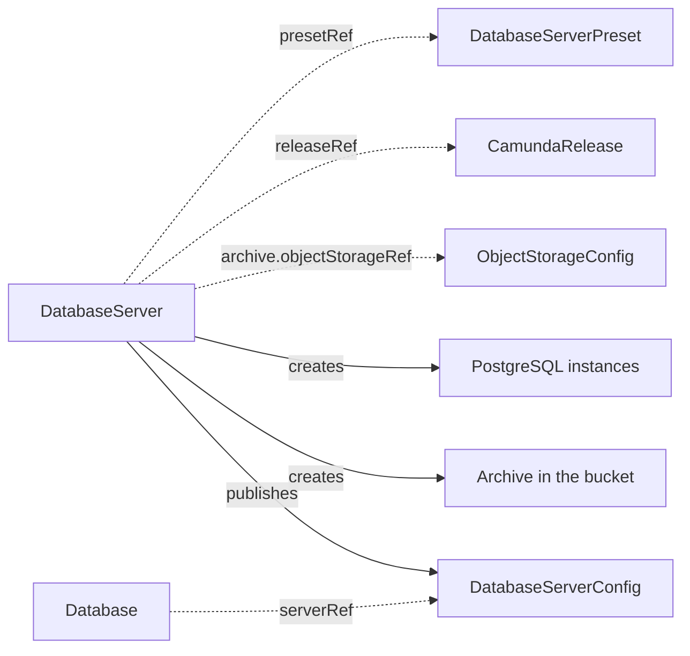

# DatabaseServer

`DatabaseServer` is a namespaced kind that runs one PostgreSQL server. You create it. The operator runs the server as a CloudNativePG cluster and publishes its connection details as a [DatabaseServerConfig](databaseserverconfig.md). That is a [contract](index.md#contracts): a resource that carries the address and credentials of the server for other resources to reference. With `spec.archive`, it also keeps a continuous archive of the server in an object storage bucket.

The server is the relational secondary storage of the clusters that use it. A [Database](database.md) creates a logical database and its users on the published contract, and a `CamundaCluster` connects through that `Database`. An archive lets a [PointInTimeRestore](pointintimerestore.md) roll the server back to a point in time.

The operator needs the [CloudNativePG](https://cloudnative-pg.io/) operator on the Kubernetes cluster. An archive also needs the [Barman Cloud plugin](https://cloudnative-pg.io/plugin-barman-cloud/) and cert-manager. See [Installation](../installation.md).

The smallest server names a PostgreSQL major, a volume size, and the contract to publish:

```yaml
apiVersion: core.camunda.io/v1
kind: DatabaseServer
metadata:
  name: my-db
  namespace: my-cluster-ns
spec:
  version: "17"
  storageSize: "64Gi"
  databaseServerConfig: my-db-server
```

The name of the server is also the name of its CloudNativePG cluster. It must start with a lowercase letter, hold only lowercase letters, digits, and `-`, and be 46 characters or shorter.


```mermaid
graph LR
    DBS[DatabaseServer] -.->|presetRef| DBSP[DatabaseServerPreset]
    DBS -.->|releaseRef| CR[CamundaRelease]
    DBS -.->|archive.objectStorageRef| OSC[ObjectStorageConfig]
    DBS -->|creates| PG["PostgreSQL instances"]
    DBS -->|creates| ARC["Archive in the bucket"]
    DBS -->|publishes| DBSC[DatabaseServerConfig]
    DB[Database] -.->|serverRef| DBSC
```

## Endpoints and credentials

The published contract carries the connection details. Its `host` is the read-write Service of the server, `my-db-rw.my-cluster-ns.svc`, on port 5432. Its `adminCredentialsSecretRef` names the Secret `my-db-superuser`, which CloudNativePG writes with the keys `username` and `password`.

The contract appears only after that Secret exists. Until then, `ContractReady` is `False` with reason `Blocked`.

Give the contract to a `Database` in the same namespace:

```yaml
apiVersion: core.camunda.io/v1
kind: Database
metadata:
  name: my-db-camunda
  namespace: my-cluster-ns
spec:
  serverRef: my-db-server
  databaseName: camunda
  # ... the rest of your database
```

If you change `spec.databaseServerConfig`, the server publishes the contract under the new name and removes the old one. A `Database` that still names the old contract reports `Ready` `False` with reason `InvalidReference`. Point it at the new name. The contract that asked for the last rollback stays, because it holds the answer. See [Recovery](#recovery).

## Sizing and storage

`spec.instances` is the number of PostgreSQL instances. One instance has no failover. Two or more give CloudNativePG a standby to promote. `spec.resources` sets the CPU and memory of each instance.

`spec.storageSize` is the size of the data volume of each instance. `spec.walStorageSize` puts the write-ahead log on a separate volume of that size.

```yaml
apiVersion: core.camunda.io/v1
kind: DatabaseServer
metadata:
  name: my-db
  namespace: my-cluster-ns
spec:
  instances: 3
  storageSize: "256Gi"
  walStorageSize: "32Gi"
  storageClassName: "ssd"
  # ... the rest of your server
```

A volume cannot shrink. The API server rejects a lower value on the server. If a preset lowers a size under a running server, the server keeps its current size and records a Warning event with reason `StorageShrinkIgnored`. If you raise a size, CloudNativePG grows the volumes in place when the StorageClass allows volume expansion.

You can add `walStorageSize` to a running server, but you cannot remove the volume again. If you or a preset clear the field, the server keeps the volume and records a Warning event with reason `WALStorageKept`. To get a smaller volume or no write-ahead log volume, create a new server.

`status.volumes` lists the volumes of the server and the capacity of each. A write-ahead log volume has the name of its data volume with the suffix `-wal`.

## The archive

Without `spec.archive`, the server keeps no archive, and no point-in-time restore can reach it. With `spec.archive`, the server writes its write-ahead log to the bucket that an [ObjectStorageConfig](objectstorageconfig.md) names, and takes base backups on a schedule. A restore starts from a base backup and replays the log up to the requested point.

```yaml
apiVersion: core.camunda.io/v1
kind: DatabaseServer
metadata:
  name: my-db
  namespace: my-cluster-ns
spec:
  archive:
    objectStorageRef: my-backup-bucket
    retentionPeriodDays: 30
    baseBackupSchedule: "0 0 2 * * *"
  # ... the rest of your server
```

The contract of a server with an archive declares `pitr.enabled: true`, `pitr.recovery: operator`, and `pitr.retentionPeriodDays`. A [PointInTimeRestore](pointintimerestore.md) reads these values.

### Retention

`retentionPeriodDays` is how far into the past a restore can reach. The bucket keeps the archive for that number of days, and the contract publishes the same number.

A raised retention period does not bring back what the shorter one already removed. The window grows only as the archive writes new data. `status.archive.reachableFrom` is the oldest point that the bucket still holds.

### Schedule

`baseBackupSchedule` is a six-field cron in UTC, with seconds first: seconds, minutes, hours, day of month, month, day of week. The default `0 0 2 * * *` runs daily at 02:00. The descriptors `@yearly`, `@annually`, `@monthly`, `@weekly`, `@daily`, `@midnight`, `@hourly`, and `@every <duration>` are also accepted. CloudNativePG reads the schedule in the [robfig/cron format](https://pkg.go.dev/github.com/robfig/cron#hdr-CRON_Expression_Format).

The API server rejects these values:

- A five-field cron. CloudNativePG reads its first field as seconds, so `0 2 * * *` runs every hour, not daily.
- A value outside the range of its field, for example hour `24`.
- A step of more than three digits, or an `@every` number of more than six digits on each side of the point.

A range that reads downward, such as `FRI-MON`, passes the API server. The server then reports `Ready` `False` with reason `InvalidReference`, and the message names the schedule.

### Readiness of the archive

The first base backup runs as soon as the server is up, whatever the schedule says. `ArchiveReady` is `False` with reason `Blocked` until that backup completes, because no restore can start without a base backup.

If uploads of the write-ahead log fail for more than five minutes, `ArchiveReady` and `Ready` turn `False` with reason `ArchiveFailing`. The message says what CloudNativePG reports. The archive holds every point up to the last segment that arrived. Repair the bucket or its credentials. The plugin then uploads the held-back segments, and both conditions return to `True`.

### The archive history

`status.archive.history` records each archive that the server has written. A restore can reach a point only inside one of these intervals.

```yaml
status:
  archive:
    history:
      - serverName: my-db
        objectStorageRef: my-backup-bucket
        location: s3://my-backup-bucket/clusters/databaseserver/my-cluster-ns/my-db-4c2a9f1e (region eu-west-1)
        from: "2026-08-01T10:00:00Z"
        to: "2026-08-20T15:02:11Z"
      - serverName: my-db-r1
        objectStorageRef: my-backup-bucket
        location: s3://my-backup-bucket/clusters/databaseserver/my-cluster-ns/my-db-4c2a9f1e (region eu-west-1)
        from: "2026-08-20T15:20:40Z"
    reachableFrom: "2026-07-25T09:58:04Z"
```

- `serverName` is the directory in the bucket that holds the archive.
- `objectStorageRef` and `location` name the bucket and the path. Each server writes under a path of its own, so one bucket can hold the archives of many servers.
- `from` is the earliest point a restore can reach in the archive, and `to` is the latest. The record without `to` is the archive that the server writes now.
- `unverifiedFrom` is set on the open record while uploads fail. A restore to a point after it can find no data.

The server closes the open record and opens a new one in these cases:

- A rollback replaces the cluster.
- You remove `spec.archive`, then add it again.
- The archive moves to another location. A change of `spec.archive.objectStorageRef` to another bucket does this. So does an edit of the `ObjectStorageConfig` to another bucket, path, endpoint, or region.

A new record starts at the first base backup of the new archive. No restore can reach a point between two records. A rollback reads only the location that the server archives to now. A point in a record of an earlier location is refused, and the message names both locations.

### Base backups are not the backup model

The base backups belong to the archive. [BackupSchedule](backupschedule.md) and [LogicalBackupRDBMS](logicalbackuprdbms.md) take logical dumps instead, and they never use these base backups. Run both on one cluster. The logical backups restore the Camunda data. The archive restores the server to a point in time.

## Recovery

A server with an archive rolls itself back to any point in its archive history. For a Camunda cluster, use a [PointInTimeRestore](pointintimerestore.md). It suspends the cluster, asks the server for the rollback, and restores the primary storage in step with it.

You can also ask for a rollback by hand, for a consumer outside the operator. Stop every writer first. Then write `spec.recovery` on the published contract:

```yaml
apiVersion: core.camunda.io/v1
kind: DatabaseServerConfig
metadata:
  name: my-db-server
  namespace: my-cluster-ns
spec:
  recovery:
    requestID: 3f2b1c4d-5e6a-4b7c-8d9e-0f1a2b3c4d5e
    requestedBy: my-cluster-ns/my-restore
    targetTime: "2026-08-20T14:30:00Z"
  # ... the rest of your contract
```

The answer arrives in `spec.pitr.lastRecovery` on the same contract. [DatabaseServerConfig](databaseserverconfig.md#recovery-request) documents the request and the results.

**CAUTION: A rollback erases everything that the server wrote after `targetTime`.** It rolls back every logical database on the server. For this reason, a [PointInTimeRestore](pointintimerestore.md) refuses a server that more than one `Database` uses, with reason `SharedServer`.

### What a rollback does

The operator builds a new CloudNativePG cluster from the archive. Its name is the server name, `-r`, and the number of records in the archive history. For example, the first rollback of `my-db` builds `my-db-r1`. `status.recovery.cluster` names the cluster that the rollback builds.

When the new cluster is healthy, the contract points at it, and the operator removes the old cluster and its volumes. The contract then carries a new `host` and a new superuser Secret. A `CamundaCluster` restarts its pods to use them. `status.cluster` names the cluster that the contract points at.

The new cluster writes an archive of its own in the same bucket. The old archive stays, so a later restore can reach a point before the rollback.

If another owner already has a CloudNativePG cluster of that name, the rollback ends with `result: Failed`. The message names the cluster.

While a rollback runs, an edit of `spec.databaseServerConfig`, of `spec.archive`, or of the bucket waits until the rollback is answered. Until then, `Ready` reports `InvalidReference`, and the message says what to put back.

### Refused requests

| `result` | Cause |
| --- | --- |
| `Failed` | The server is suspended. Unsuspend it, then ask again. |
| `Unavailable` | The server has no archive, or another owner controls its `ObjectStore`. |
| `Unavailable` | `targetTime` is in the future, or older than `retentionPeriodDays`. |
| `Unavailable` | `targetTime` is older than `status.archive.reachableFrom`. |
| `Unavailable` | No record of the archive history holds `targetTime`, or the record is in an earlier location. The message names the windows that the server holds. |

## Authentication to the bucket

If the `ObjectStorageConfig` holds static credentials, the operator copies them into the Secret `my-db-archive` next to the server. Anyone who can read Secrets in that namespace can then read the bucket credentials. Use workload identity to keep them out of the namespace.

If the `ObjectStorageConfig` uses workload identity, the operator puts its annotation on the ServiceAccount of the instance pods. Add your own annotations with `spec.serviceAccount.annotations`. A value that you set wins over the derived value of the same key.

## Monitoring

CloudNativePG serves Prometheus metrics on every instance pod. Set `spec.monitoring.podMonitor.enabled` to create a `PodMonitor` named `my-db-metrics` over them.

```yaml
apiVersion: core.camunda.io/v1
kind: DatabaseServer
metadata:
  name: my-db
  namespace: my-cluster-ns
spec:
  monitoring:
    podMonitor:
      enabled: true
      interval: "30s"
      labels:
        release: prometheus
  # ... the rest of your server
```

If the Kubernetes cluster does not serve the `PodMonitor` kind, the operator creates nothing and the server stays ready.

## Suspend

`spec.suspend: true` stops the instances and keeps their volumes. `ClusterReady` reports `Suspending`, then `Suspended`. `Ready` stays `True` with reason `Suspended`.

The base backup schedule stops with the server. The write-ahead log of the last moments before the stop still reaches the bucket.

The published contract stays, but the server does not answer. Suspend a server only after every cluster that uses it is suspended.

Set the field back to `false`, and the instances start again on the same volumes.

## Presets and releases

Three layers make the configuration of a server. Each layer wins over the one before it:

1. The [DatabaseServerPreset](databaseserverpreset.md) that `spec.presetRef` names holds the shape: the instance count, the volume sizes, the resources.
2. The [CamundaRelease](camundarelease.md) that `spec.releaseRef` names holds the version, in `spec.databaseServer.version`.
3. The `DatabaseServer` itself.

A field that you set on the server replaces the value of the layer below. A field that you leave unset comes from the layer below.

```yaml
apiVersion: core.camunda.io/v1
kind: DatabaseServer
metadata:
  name: my-db
  namespace: my-cluster-ns
spec:
  presetRef: standard
  releaseRef: camunda-8-9-4
  databaseServerConfig: my-db-server
```

## The PostgreSQL version

`spec.version` is a bare PostgreSQL major, such as `17`. It selects the image tag. Camunda 8.9 supports PostgreSQL 14 and later. See the [RDBMS version support policy](https://docs.camunda.io/docs/self-managed/concepts/databases/relational-db/rdbms-support-policy/).

The major of a running server cannot change, up or down. A change on the server or on its release is refused with `Ready` `False`, reason `VersionChangeRefused`, and a Warning event of the same name. The server keeps running its major. Set the version back to clear the refusal.

To run a later major, create a new `DatabaseServer` on that major and move the data to it. A point-in-time restore cannot do this, because only the major that wrote an archive can read it.

## Images

The PostgreSQL image is `ghcr.io/cloudnative-pg/postgresql:<version>` by default. For an air-gapped cluster, name a [CamundaPlatformConfig](camundaplatformconfig.md) in `spec.platformConfigRef`, and set the repository there:

```yaml
apiVersion: core.camunda.io/v1
kind: CamundaPlatformConfig
metadata:
  name: my-platform-config
spec:
  images:
    postgres: "mirror.example.com/postgresql"
  # ... the rest of your platform config
```

The tag is the major version, so the repository must publish the same tags.

## Name collisions

The server never writes on an object that another owner holds under a name that the server derives. Each case shows on a condition, and the message names the owner:

- A CloudNativePG cluster of the server name that this server does not own: `ClusterReady` reports `ClusterTaken`. The server runs nothing, and it removes its contract, its base backup schedule, and its `PodMonitor`.
- A `DatabaseServerConfig` of the name in `spec.databaseServerConfig` that this server did not publish: `ContractReady` reports `ContractTaken`. The server publishes nothing, and the contract keeps its endpoint and credentials.
- A Barman Cloud `ObjectStore` of the server name that another owner controls: `ArchiveReady` reports `ArchiveTaken`. The server writes no archive, its contract declares `pitr.enabled: false`, and it refuses rollbacks.
- The archive Secret, the base backup schedule, or the `PodMonitor` under another owner: `ArchiveReady` or `MonitoringReady` reports `False`.

Remove the other object, or give this server a name of its own. The server then continues with the archive history that it had. While the `ObjectStore` name was held, the server wrote no archive, so no restore can reach a point in that time.

## Deletion

Deleting a `DatabaseServer` removes the CloudNativePG cluster, its data volumes, and the published contract. The objects in the bucket stay. If you no longer need them, remove them yourself.

## Status

`kubectl get databaseserver` shows `Ready`, its reason, the PostgreSQL version, and the age.

```yaml
status:
  observedGeneration: 3
  version: "17"
  cluster: my-db-r1
  systemIdentifier: "7370000000000000001"
  archive:
    # ... see The archive history
  recovery:
    requestID: 3f2b1c4d-5e6a-4b7c-8d9e-0f1a2b3c4d5e
    contract: my-db-server
    requestedBy: my-cluster-ns/my-restore
    targetTime: "2026-08-20T14:30:00Z"
    cluster: my-db-r1
    result: Completed
    completedAt: "2026-08-20T15:02:11Z"
  volumes:
    - name: my-db-r1-1
      capacity: 256Gi
    - name: my-db-r1-1-wal
      capacity: 32Gi
  conditions:
    - type: Ready
      status: "True"
      reason: Healthy
    - type: ClusterReady
      status: "True"
      reason: Healthy
      message: 3 of 3 instances are ready
    - type: ArchiveReady
      status: "True"
      reason: Healthy
    - type: ContractReady
      status: "True"
      reason: Healthy
    - type: MonitoringReady
      status: "True"
      reason: Disabled
```

| Type | Reason | Meaning | What to do |
| --- | --- | --- | --- |
| `Ready` | `Healthy` | Every part of the server is in its desired state. | Nothing. |
| `Ready` | `Blocked` | The archive holds no base backup yet. | Wait. |
| `Ready` | `Creating`, `Updating`, `Failing`, `Degraded`, `Down` | `ClusterReady` holds `Ready` back. | Read the row of `ClusterReady` with the same reason. |
| `Ready` | `ArchiveFailing` | The write-ahead log does not reach the bucket. | Read `ArchiveReady`. |
| `Ready` | `Suspended` | `spec.suspend` is true and the instances are stopped. | Nothing. |
| `Ready` | `ClusterTaken`, `ContractTaken`, `ArchiveTaken` | Another owner holds a name that the server derives. | See [Name collisions](#name-collisions). |
| `Ready` | `CNPGNotInstalled` | The Kubernetes cluster did not serve the CloudNativePG kinds when the operator started. | Install CloudNativePG, then restart the operator. |
| `Ready` | `BarmanPluginNotInstalled` | The server asks for an archive, and the Kubernetes cluster did not serve the Barman Cloud plugin when the operator started. | Install the plugin, then restart the operator. |
| `Ready` | `InvalidReference` | A referenced resource does not exist, the merged spec lacks a field or breaks a rule, or an edit waits for a rollback. The message names it. | Create the resource, or fix the spec. |
| `Ready` | `MissingSecret` | The credentials Secret of the bucket is missing or lacks a key. The message names it. | Create the Secret, or fix its keys. |
| `Ready` | `VersionChangeRefused` | `version` names a major other than the one the server runs. The message names both. | Set the version back. See [The PostgreSQL version](#the-postgresql-version). |
| `ClusterReady` | `Creating`, `Updating` | CloudNativePG is starting or changing the instances. | Wait. |
| `ClusterReady` | `Healthy` | Every instance is ready. | Nothing. |
| `ClusterReady` | `Failing` | CloudNativePG reports a phase that it does not leave on its own. The message names the phase. | Read the CloudNativePG cluster for the cause. |
| `ClusterReady` | `Degraded` | The instances are still not all ready at the end of the [grace period](../architecture.md#status-conventions), 30 minutes by default, but at least one instance is ready. The primary serves. | Read the CloudNativePG cluster and the pods of the instances that are not ready. |
| `ClusterReady` | `Down` | No instance is ready at the end of the grace period. | Read the CloudNativePG cluster and the pods of its instances for the cause. |
| `ClusterReady` | `Suspending`, `Suspended` | `spec.suspend` is true. | Nothing. |
| `ClusterReady` | `ClusterTaken` | A CloudNativePG cluster of the server name belongs to another owner. | See [Name collisions](#name-collisions). |
| `ArchiveReady` | `Disabled` | The server has no `archive` block. | Nothing. |
| `ArchiveReady` | `Blocked` | The archive holds no base backup yet. | Wait. If it never completes, read the CloudNativePG `Backup` for the cause. |
| `ArchiveReady` | `ArchiveFailing` | Uploads of the write-ahead log have failed for more than five minutes. | Repair the bucket or its credentials. |
| `ArchiveReady` | `ArchiveTaken` | A Barman Cloud `ObjectStore` of the server name belongs to another owner. | See [Name collisions](#name-collisions). |
| `ArchiveReady` | `Healthy` | The archive holds a base backup and receives the write-ahead log. | Nothing. |
| `ContractReady` | `Blocked` | The superuser Secret does not exist yet. | Wait for the instances to start. |
| `ContractReady` | `ContractTaken` | The contract name belongs to another owner. | See [Name collisions](#name-collisions). |
| `ContractReady` | `Disabled` | The cluster name is taken, so the server removed the contract. | Read `ClusterReady`. |
| `ContractReady` | `Healthy` | The contract is published. | Nothing. |
| `MonitoringReady` | `Disabled` | Scraping is off. | Nothing. |
| `MonitoringReady` | `Healthy` | The `PodMonitor` exists. | Nothing. |

`MonitoringReady` never affects `Ready`. `ArchiveReady` affects `Ready` only on a server with an `archive` block.

`status.version` is the PostgreSQL major that the server runs. `status.cluster` is the CloudNativePG cluster that the contract points at, and it changes after a rollback.

`status.recovery` is the rollback that the server works on now, or the last one it answered. `result` and `completedAt` are empty while the rollback runs.

`status.observedGeneration` is the last generation that the operator reconciled.

## Spec reference

Every field, with its type, whether it is required, and its default:

```yaml
apiVersion: core.camunda.io/v1
kind: DatabaseServer
metadata:
  name: my-db
  namespace: my-cluster-ns
spec:
  # string. Optional. Name of a cluster-scoped DatabaseServerPreset used as the baseline.
  presetRef: "standard"
  # string. Optional. Name of a cluster-scoped CamundaRelease that supplies the version. It wins over the preset and loses to this spec.
  releaseRef: "camunda-8-9-4"
  # string. Optional. Name of a cluster-scoped CamundaPlatformConfig. Only its image settings are read.
  platformConfigRef: "my-platform-config"
  # string. Required, unless the release provides it. PostgreSQL major, 14 or later, fixed once the server runs.
  version: "17"
  # integer. Optional, default: 1. Number of PostgreSQL instances, at least 1.
  instances: 3
  # object (corev1.ResourceRequirements). Optional. CPU and memory of each instance.
  resources:
    requests: { cpu: "2", memory: "4Gi" }
    limits: { memory: "4Gi" }
  # string (resource quantity). Required, unless the preset provides it. Size of the data volume of each instance.
  storageSize: "256Gi"
  # string. Optional, default: the default StorageClass of the Kubernetes cluster. StorageClass of the volumes.
  storageClassName: "ssd"
  # string (resource quantity). Optional. Size of a separate volume for the write-ahead log. It cannot be cleared.
  walStorageSize: "32Gi"
  # object. Optional. The ServiceAccount that CloudNativePG creates for the instance pods.
  serviceAccount:
    # map[string]string. Optional. Annotations for workload identity. A value here wins over the one derived from the bucket.
    annotations: {}
  # object. Optional. Scheduling constraints of the instance pods. A server that sets it replaces the block of the preset as a whole.
  scheduling:
    # object (corev1.NodeAffinity). Optional. Node affinity rules.
    nodeAffinity: {}
    # object (corev1.PodAffinity). Optional. Pod affinity rules.
    podAffinity: {}
    # list (corev1.Toleration). Optional. Tolerations of the pods.
    tolerations: []
  # map[string]string. Optional. Extra labels on the instance pods.
  podLabels: {}
  # map[string]string. Optional. Extra annotations on the instance pods.
  podAnnotations: {}
  # object. Optional. Prometheus scraping. A server that sets it replaces the block of the preset as a whole.
  monitoring:
    podMonitor:
      # boolean. Optional, default: false. Creates a PodMonitor over the instance pods.
      enabled: true
      # map[string]string. Optional. Extra labels on the PodMonitor.
      labels: {}
      # map[string]string. Optional. Extra annotations on the PodMonitor.
      annotations: {}
      # string. Optional, default: the Prometheus setting. Scrape interval, as a Prometheus duration.
      interval: "30s"
  # string. Required. Name of the DatabaseServerConfig the operator publishes in this namespace.
  databaseServerConfig: my-db-server
  # object. Optional. The continuous archive of the server. Without it no point-in-time restore can reach the server.
  archive:
    # string. Required in this block. Name of an ObjectStorageConfig in this namespace.
    objectStorageRef: my-backup-bucket
    # integer. Required in this block. How many days into the past a restore can reach, from 1 to 36500.
    retentionPeriodDays: 30
    # string. Optional, default: "0 0 2 * * *". Six-field cron in UTC, seconds first, for the base backups.
    baseBackupSchedule: "0 0 2 * * *"
  # boolean. Optional, default: false. Stops the instances and keeps their volumes.
  suspend: false
```

### Validation rules

- `metadata.name` must be a DNS-1035 label of 46 characters or fewer: lowercase letters, digits, and `-`, starting with a letter.
- `databaseServerConfig` is required on a `DatabaseServer` and must not be set in a preset.
- `storageSize` and `walStorageSize` cannot shrink. See [Sizing and storage](#sizing-and-storage).
- `version` is a bare major, such as `17`. A major below 14 is reported on `Ready` with reason `InvalidReference`.
- `version` cannot move to another major once the server runs. See [The PostgreSQL version](#the-postgresql-version).
- `archive.retentionPeriodDays` must be from 1 to 36500.
- `archive.baseBackupSchedule` must be a six-field cron or a descriptor. See [Schedule](#schedule).
- `version` and `storageSize` must be present after the merge. Set them inline, or take `storageSize` from a preset and `version` from a release. A missing field is reported on `Ready` with reason `InvalidReference`.

### A production-shaped example

```yaml
apiVersion: core.camunda.io/v1
kind: DatabaseServer
metadata:
  name: my-db
  namespace: my-cluster-ns
spec:
  presetRef: standard
  releaseRef: camunda-8-9-4
  platformConfigRef: my-platform-config
  databaseServerConfig: my-db-server
  archive:
    objectStorageRef: my-backup-bucket
    retentionPeriodDays: 30
```

## Related

- [DatabaseServerPreset](databaseserverpreset.md): the cluster-scoped baseline that `spec.presetRef` names.
- [CamundaRelease](camundarelease.md): the version that `spec.releaseRef` names.
- [DatabaseServerConfig](databaseserverconfig.md): the contract this kind publishes.
- [Database](database.md): creates the logical database and its users on the published contract.
- [ObjectStorageConfig](objectstorageconfig.md): the bucket that `spec.archive.objectStorageRef` names.
- [PointInTimeRestore](pointintimerestore.md): reads `pitr.enabled` and the retention period from the published contract.
- [Secondary storage guide](../guides/secondary-storage.md): how to choose and connect secondary storage.
- [Installation](../installation.md): CloudNativePG, cert-manager, and the Barman Cloud plugin.
