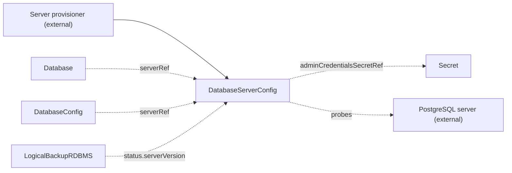

# DatabaseServerConfig

`DatabaseServerConfig` is a cluster-scoped contract kind that describes one database server: engine, host, port, and admin credentials. You create it, or another tool creates it for you.

## Purpose

The operator creates logical databases on a database server that already exists. It never provisions the server. This kind carries the connection details of the server and an admin user that can create databases and roles. The thing that runs the server and the thing that uses it do not need to know each other. The operator validates the contract, probes the server, and reports the result on `Ready`. It never provisions anything from it.

| Role | Who |
| --- | --- |
| Producers | You, by hand, or another tool that provisions the server and creates the contract for you |
| Consumers | [Database](database.md) (through `serverRef`, to create logical databases and users), [DatabaseConfig](databaseconfig.md) (through `serverRef`, to name the server of a logical database), [LogicalBackupRDBMS](logicalbackuprdbms.md) (reads `status.serverVersion` to pick the dump tools) |

## What it does

The operator creates no resources from this kind. It validates the contract, probes the server, and writes the result to `status`.

- The operator makes sure that the Secret in `adminCredentialsSecretRef` exists and holds `usernameKey` and `passwordKey`.
- The operator connects to the server with the admin credentials and reads the major version the server reports. It publishes it as `status.serverVersion` and records the time in `status.probedAt`.
- `Ready` is `True` only when the server answered the admin credentials. It means the server is usable as declared, not only that a Secret exists.



**Probe intervals.** A reachable server is probed again every 10 minutes. A major upgrade behind the same endpoint therefore reaches `status` without a change to the spec. An unreachable server is probed again every 30 seconds. Each probe times out after 30 seconds. A change to the spec or to the admin credentials Secret causes a new probe at once.

**Missing references.** If the Secret or a key is missing, `Ready` is `False` with reason `MissingSecret`. If the server does not answer, `Ready` is `False` with reason `ConnectionFailed`, and the message names the host, the port, and the error. `status.serverVersion` keeps the last known value while the server is unreachable.

**Password rotation.** When you change the admin credentials Secret, the operator probes the server again with the new credentials before the next interval. A backup that needs `status.serverVersion` waits until the operator publishes it.

**Point-in-time recovery.** The `pitr` block is a declaration. It states that the server archives WAL for the given number of days. No kind in the operator reads it yet.

> **Note:** A Secret reference can name any namespace, and the status message says whether it exists. Grant write access to this kind with care.

## Spec

```yaml
apiVersion: core.camunda.io/v1
kind: DatabaseServerConfig
# Cluster-scoped: metadata has no namespace.
metadata:
  name: my-db-server
spec:
  # string enum: postgres. Required. Database engine of the server. Only postgres is supported.
  engine: postgres
  # string. Required. Host name at which the server is reachable.
  host: "my-db-server.abc123.us-east-1.rds.amazonaws.com"
  # integer. Required. Port the server listens on, from 1 to 65535.
  port: 5432
  # object. Required. Admin user that can create databases and roles. A Database uses it to create logical databases.
  adminCredentialsSecretRef:
    # string. Required. Name of the Secret that holds the admin credentials.
    name: my-db-server-admin-credentials
    # string. Required. Namespace of the Secret. This kind is cluster-scoped, so there is no default.
    namespace: my-cluster-ns
    # string. Required. Key in the Secret that holds the username.
    usernameKey: username
    # string. Required. Key in the Secret that holds the password.
    passwordKey: password
  # object. Optional. Point-in-time-recovery capability of the server. No kind in the operator reads it yet.
  pitr:
    # boolean. Optional, default: false. Whether the server archives WAL for point-in-time recovery.
    enabled: true
    # integer. Required when enabled is true, at least 1. How many days into the past a point-in-time restore can target.
    retentionPeriodDays: 7
```

## Status

| Type | Reason | Meaning | What to do |
| --- | --- | --- | --- |
| `Ready` | `Healthy` | The server answered the admin credentials and reported its version. | Nothing. |
| `Ready` | `MissingSecret` | The Secret named by `adminCredentialsSecretRef` is missing, or it lacks a configured key. | Create the Secret, or add the key. The message names the Secret and the key. |
| `Ready` | `ConnectionFailed` | The server did not answer the admin credentials. The message names the host, the port, and the error. | Make sure that the host and port are correct, the server is up, the network allows the connection, and the credentials are valid. The operator tries again every 30 seconds. |

| Field | Meaning |
| --- | --- |
| `status.serverVersion` | The major version the server reported the last time the operator reached it, for example `"17"`. It keeps the last known value while the server is unreachable. |
| `status.probedAt` | When the operator last reached the server and read `serverVersion`. |
| `status.probedSecretVersion` | The `resourceVersion` of the admin credentials Secret that the last probe used. |
| `status.observedGeneration` | The last generation of the contract that the operator validated. |

## Validation

- `spec.engine` must be `postgres`.
- `spec.host` must not be empty.
- `spec.port` must be from 1 to 65535.
- If `spec.pitr.enabled` is `true`, `spec.pitr.retentionPeriodDays` must be set and at least 1.
- No field is immutable.

## Related

- [DatabaseConfig](databaseconfig.md): names this server through `serverRef` for one logical database.
- [Database](database.md): creates logical databases and users on this server with the admin credentials.
- [LogicalBackupRDBMS](logicalbackuprdbms.md): reads `status.serverVersion` to run dump tools of the same major version.
- [Secondary storage guide](../guides/secondary-storage.md): how to set up a relational database for a cluster.
- [Backup guide](../guides/backup.md): how a database dump uses the server version.
- [Getting started](../getting-started.md): the order in which you create the resources.

## Examples

A minimal manifest:

```yaml
apiVersion: core.camunda.io/v1
kind: DatabaseServerConfig
metadata:
  name: my-db-server
spec:
  engine: postgres
  host: "postgres.my-cluster-ns.svc.cluster.local"
  port: 5432
  adminCredentialsSecretRef:
    name: my-db-server-admin-credentials
    namespace: my-cluster-ns
    usernameKey: username
    passwordKey: password
```

A realistic manifest for a managed PostgreSQL server that archives WAL for 7 days:

```yaml
apiVersion: core.camunda.io/v1
kind: DatabaseServerConfig
metadata:
  name: my-db-server
spec:
  engine: postgres
  host: "my-db-server.abc123.us-east-1.rds.amazonaws.com"
  port: 5432
  adminCredentialsSecretRef:
    name: my-db-server-admin-credentials
    namespace: my-cluster-ns
    usernameKey: username
    passwordKey: password
  pitr:
    enabled: true
    retentionPeriodDays: 7
```
