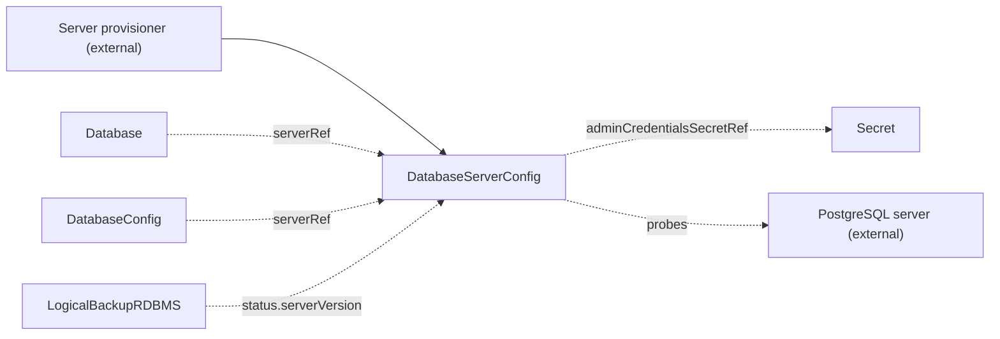

# DatabaseServerConfig

`DatabaseServerConfig` is a namespaced contract kind that describes one database server: engine, host, port, and admin credentials. You create it, or another tool creates it for you.

The operator creates logical databases on a database server that already exists. It never provisions the server. This kind carries the connection details of the server and an admin user that can create databases and roles. The thing that runs the server and the thing that uses it do not need to know each other. The operator validates the contract, probes the server, and reports the result on `Ready`. It never provisions anything from it.

A consumer resolves `serverRef` in its own namespace, so the whole relational chain of a cluster lives with that cluster. The admin credentials Secret lives in the namespace of this contract. Two namespaces can describe one shared server, each with a contract of its own.

| Role | Who |
| --- | --- |
| Producers | You, by hand, or another tool that provisions the server and creates the contract for you |
| Consumers | [Database](database.md) (through `serverRef`, to create logical databases and users), [DatabaseConfig](databaseconfig.md) (through `serverRef`, to name the server of a logical database), [LogicalBackupRDBMS](logicalbackuprdbms.md) (reads `status.serverVersion` to pick the dump tools) |

The smallest contract names the engine, the host, the port, and the admin credentials:

```yaml
apiVersion: core.camunda.io/v1
kind: DatabaseServerConfig
metadata:
  name: my-db-server
  namespace: my-cluster-ns
spec:
  engine: postgres
  host: "postgres.my-cluster-ns.svc.cluster.local"
  port: 5432
  adminCredentialsSecretRef:
    name: my-db-server-admin-credentials
```



## Validation checks

The operator creates no resources from this kind. It validates the contract, probes the server, and writes the result to `status`.

- The operator makes sure that the Secret in `adminCredentialsSecretRef` exists and holds `usernameKey` and `passwordKey`.
- The operator connects to the server with the admin credentials and reads the major version the server reports. It publishes it as `status.serverVersion` and records the time in `status.probedAt`.
- The operator reads the system identifier that the server reports and publishes it as `status.systemIdentifier`. This value names the PostgreSQL instance, not the endpoint. Two contracts that reach one instance under different hosts publish one value.
- `Ready` is `True` only when the server answered the admin credentials. It means the server is usable as declared, not only that a Secret exists.

If the Secret or a key is missing, `Ready` is `False` with reason `MissingSecret`. If the server does not answer, `Ready` is `False` with reason `ConnectionFailed`, and the message names the host, the port, and the error. `status.serverVersion` and `status.systemIdentifier` keep their last known values while the server is unreachable.

A change to the spec clears both, because they describe the endpoint the operator reached and the new spec can name another one. The contract publishes them again on the next successful probe, and a `Database` waits with `ServerIdentityUnknown` in between.

## Server probe

A reachable server is probed again every 10 minutes. A major upgrade behind the same endpoint therefore reaches `status` without a change to the spec. An unreachable server is probed again every 30 seconds. Each probe times out after 30 seconds. A change to the spec or to the admin credentials Secret causes a new probe at once.

When you change the admin credentials Secret, the operator probes the server again with the new credentials before the next interval. A backup that needs `status.serverVersion` waits until the operator publishes it.

## Server identity

`status.systemIdentifier` is the identity of the PostgreSQL instance behind `spec.host`. PostgreSQL generates it when the data directory is created, so it names the instance and not the address you reach it at.

```yaml
status:
  serverVersion: "17"
  systemIdentifier: "7412345678901234567"
```

Two rules of the operator key on this value.

- A [Database](database.md) claims a logical database name on the instance. Two `Database` objects of two namespaces that resolve to one instance contest one claim, even when each names a contract of its own.
- A [PointInTimeRestore](pointintimerestore.md) refuses a server that more than one `Database` uses, counted across all namespaces by this identity.

A `Database` whose contract has not published this value yet waits with `Ready=False` and reason `ServerIdentityUnknown`.

## Point-in-time recovery

The `pitr` block is a declaration. It states that the server archives WAL for the given number of days. [PointInTimeRestore](pointintimerestore.md) reads it to decide whether the server can serve a requested point.

## Status

| Type | Reason | Meaning | What to do |
| --- | --- | --- | --- |
| `Ready` | `Healthy` | The server answered the admin credentials and reported its version. | Nothing. |
| `Ready` | `MissingSecret` | The Secret named by `adminCredentialsSecretRef` is missing, or it lacks a configured key. | Create the Secret, or add the key. The message names the Secret and the key. |
| `Ready` | `ConnectionFailed` | The server did not answer the admin credentials. The message names the host, the port, and the error. | Make sure that the host and port are correct, the server is up, the network allows the connection, and the credentials are valid. The operator tries again every 30 seconds. |

| Field | Meaning |
| --- | --- |
| `status.serverVersion` | The major version the server reported the last time the operator reached it, for example `"17"`. It keeps the last known value while the server is unreachable. |
| `status.systemIdentifier` | The identity of the PostgreSQL instance behind `spec.host`, for example `"7412345678901234567"`. Two contracts that reach one instance publish one value. |
| `status.probedAt` | When the operator last reached the server and read `serverVersion`. |
| `status.probedSecretVersion` | The `resourceVersion` of the admin credentials Secret that the last probe used. |
| `status.observedGeneration` | The last generation of the contract that the operator validated. |

## Spec reference

Every field, with its type, whether it is required, and its default:

```yaml
apiVersion: core.camunda.io/v1
kind: DatabaseServerConfig
metadata:
  name: my-db-server
  namespace: my-cluster-ns
spec:
  # string enum: postgres. Required. Database engine of the server. Only postgres is supported.
  engine: postgres
  # string. Required. Host name at which the server is reachable.
  host: "my-db-server.abc123.us-east-1.rds.amazonaws.com"
  # integer. Required. Port the server listens on, from 1 to 65535.
  port: 5432
  # object. Required. Admin user that can create databases and roles. A Database uses it to create logical databases.
  adminCredentialsSecretRef:
    # string. Required. Name of the Secret that holds the admin credentials, in the namespace of this contract.
    name: my-db-server-admin-credentials
    # string. Optional, default: username. Key in the Secret that holds the username.
    usernameKey: username
    # string. Optional, default: password. Key in the Secret that holds the password.
    passwordKey: password
  # object. Optional. Point-in-time-recovery capability of the server, read by PointInTimeRestore.
  pitr:
    # boolean. Optional, default: false. Whether the server archives WAL for point-in-time recovery.
    enabled: true
    # integer. Required when enabled is true, at least 1. How many days into the past a point-in-time restore can target.
    retentionPeriodDays: 7
```

### Validation rules

- `spec.engine` must be `postgres`.
- `spec.host` must not be empty.
- `spec.adminCredentialsSecretRef.name` must not be empty.
- `spec.port` must be from 1 to 65535.
- If `spec.pitr.enabled` is `true`, `spec.pitr.retentionPeriodDays` must be set and at least 1.
- No field is immutable.

### A production-shaped example

A managed PostgreSQL server that archives WAL for 7 days:

```yaml
apiVersion: core.camunda.io/v1
kind: DatabaseServerConfig
metadata:
  name: my-db-server
  namespace: my-cluster-ns
spec:
  engine: postgres
  host: "my-db-server.abc123.us-east-1.rds.amazonaws.com"
  port: 5432
  adminCredentialsSecretRef:
    name: my-db-server-admin-credentials
  pitr:
    enabled: true
    retentionPeriodDays: 7
```

## Related

- [DatabaseConfig](databaseconfig.md): names this server through `serverRef` for one logical database.
- [Database](database.md): creates logical databases and users on this server with the admin credentials.
- [LogicalBackupRDBMS](logicalbackuprdbms.md): reads `status.serverVersion` to run dump tools of the same major version.
- [PointInTimeRestore](pointintimerestore.md): reads `spec.pitr` and `status.systemIdentifier` before it rolls a server back.
- [Secondary storage guide](../guides/secondary-storage.md): how to set up a relational database for a cluster.
- [Backup guide](../guides/backup.md): how a database dump uses the server version.
- [Getting started](../getting-started.md): the order in which you create the resources.
