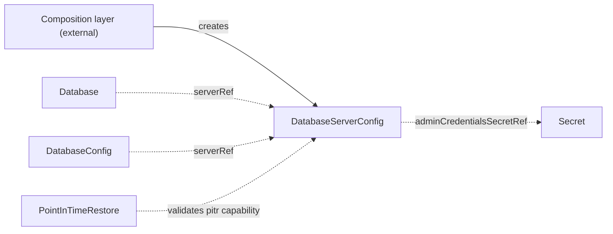

# DatabaseServerConfig

`DatabaseServerConfig` is the contract CRD that describes a database server — engine, endpoint, admin credentials, and point-in-time-recovery capability — for controllers that bootstrap databases on it or validate its declared capabilities.

## Purpose

The operator bootstraps logical databases on existing database servers but never provisions the servers themselves.
This cluster-scoped contract CRD carries the server's connection details and an admin user with permission to create databases and roles, decoupling whoever runs the server from the controllers that use it, as described in the [architecture](../architecture.md).

| Role | Who |
| --- | --- |
| Producers | A composition layer above (for example a cloud operator that provisions a managed database server), or you, by hand, for self-managed servers |
| Consumers | [Database](database.md) (via `serverRef`, to bootstrap logical databases and users), [DatabaseConfig](databaseconfig.md) (via `serverRef`, to anchor a logical database to its server), and [PointInTimeRestore](pointintimerestore.md) (validates the server's `pitr` capability) |

!!! note "Deviation from the original proposal"
    The proposal listed `engine: postgres | oracle | mariadb`; Camunda 8.9 supports PostgreSQL, Oracle, MariaDB, MySQL, and Microsoft SQL Server as production RDBMS secondary storage (H2 is development-only), but the `Database` controller's SQL bootstrap is postgres-scoped, so the enum is deliberately `postgres`-only for now and may widen as bootstrap support grows.

## How it works

The contract has a lightweight validation-only controller: it never provisions anything.

1. The operator watches every `DatabaseServerConfig` and the Secret it references, and re-runs validation whenever either changes.
2. It checks that the Secret named by `adminCredentialsSecretRef` exists and contains the configured `usernameKey` and `passwordKey`.
3. It sets the `Ready` condition: `Healthy` when the checks pass, `MissingSecret` otherwise.

Consumers read the contract by name and never care who produced it.
The `pitr` block is declarative capability information: it states that the server performs continuous WAL archiving with the given retention, so that `PointInTimeRestore` can validate a requested restore timestamp against it.



## API reference

```yaml
apiVersion: core.camunda.io/v1
kind: DatabaseServerConfig
# Cluster-scoped: metadata has no namespace.
metadata:
  name: my-db-server
spec:
  # string enum: postgres. Required. Database engine of the server; postgres-only for now, may widen later.
  engine: postgres
  # string. Required. Hostname the server is reachable at.
  host: "my-db-server.abc123.us-east-1.rds.amazonaws.com"
  # integer. Required. Port the server listens on (1-65535).
  port: 5432
  # string. Optional. Major version of the server engine, for example "17". A backup of a database on this server requires it: the dump runs client tools of at least the server's major version.
  version: "17"
  # object. Required. Admin user with permission to create databases and roles; used by the Database controller to bootstrap.
  adminCredentialsSecretRef:
    # string. Required. Name of the Secret holding the admin credentials.
    name: my-db-server-admin-credentials
    # string. Required. Namespace of the Secret (this CR is cluster-scoped, so there is no default).
    namespace: camunda-system
    # string. Required. Key in the Secret holding the plaintext username.
    usernameKey: username
    # string. Required. Key in the Secret holding the plaintext password.
    passwordKey: password
  # object. Optional. Point-in-time-recovery capability of the server.
  pitr:
    # boolean. Optional, default: false. Whether the server performs continuous WAL archiving for point-in-time recovery.
    enabled: true
    # integer. Required when enabled is true. How many days into the past a point-in-time restore can target.
    retentionPeriodDays: 7
```

## Status

| Type | Reason | Meaning |
| --- | --- | --- |
| `Ready` | `Healthy` | The admin credentials Secret exists and has the required keys. |
| `Ready` | `MissingSecret` | The Secret named by `adminCredentialsSecretRef` is missing or lacks the configured keys. |

The operator records the last reconciled generation in `status.observedGeneration`.

## Validation

- `spec.engine` must be `postgres` (the only supported engine for now).
- `spec.port` must be between 1 and 65535.
- `spec.pitr.enabled: true` requires `spec.pitr.retentionPeriodDays` of at least 1.

## Relationships

- [DatabaseConfig](databaseconfig.md) — references this contract via `serverRef` to anchor a logical database to its server.
- [Database](database.md) — references this contract via `serverRef` and uses the admin credentials to bootstrap logical databases and users.
- [PointInTimeRestore](pointintimerestore.md) — validates its requested timestamp against this contract's `pitr` capability, resolved through the target cluster's storage chain; it never uses the admin credentials.
- A composition layer above may create this CR alongside the server it provisions; external actors are not documented here.

See the [CRD overview](index.md) for where this contract sits in the reconciler dependency graph.

## Examples

A minimal manifest:

```yaml
apiVersion: core.camunda.io/v1
kind: DatabaseServerConfig
metadata:
  name: my-db-server
spec:
  engine: postgres
  host: "postgres.my-cluster-ns.svc.cluster.local"
  port: 5432
  adminCredentialsSecretRef:
    name: my-db-server-admin-credentials
    namespace: camunda-system
    usernameKey: username
    passwordKey: password
```

A realistic manifest for a managed PostgreSQL server with point-in-time recovery enabled:

```yaml
apiVersion: core.camunda.io/v1
kind: DatabaseServerConfig
metadata:
  name: my-db-server
spec:
  engine: postgres
  host: "my-db-server.abc123.us-east-1.rds.amazonaws.com"
  port: 5432
  adminCredentialsSecretRef:
    name: my-db-server-admin-credentials
    namespace: camunda-system
    usernameKey: username
    passwordKey: password
  pitr:
    enabled: true
    retentionPeriodDays: 7
```
