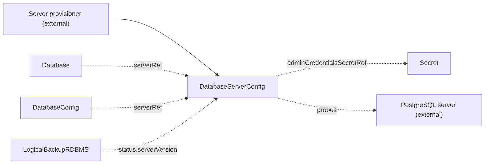

# DatabaseServerConfig

`DatabaseServerConfig` is a namespaced [contract](index.md#contracts) kind that describes one PostgreSQL server. It holds the engine, the host, the port, and an admin user that can create databases and roles. A [DatabaseServer](databaseserver.md) publishes it for the server it runs. For a server that the operator does not run, such as a managed cloud database, you create it, or another tool creates it for you.

The operator never provisions a server from this kind. It checks the admin credentials against the server and reports the result on `Ready`.

A consumer resolves `serverRef` in its own namespace. The admin credentials Secret is in the namespace of the contract. Two namespaces can describe one shared server, each with a contract of its own.

| Role | Who |
| --- | --- |
| Producers | [DatabaseServer](databaseserver.md), or you by hand, or another tool that provisions the server |
| Consumers | [Database](database.md) (through `serverRef`, to create logical databases and users), [DatabaseConfig](databaseconfig.md) (through `serverRef`, to name the server of a logical database), [LogicalBackupRDBMS](logicalbackuprdbms.md) (reads `status.serverVersion` to pick the dump tools), [PointInTimeRestore](pointintimerestore.md) (reads `spec.pitr`) |

The smallest contract names the engine, the host, the port, and the admin credentials:

```yaml
apiVersion: core.camunda.io/v1
kind: DatabaseServerConfig
metadata:
  name: my-db-server
  namespace: my-cluster-ns
spec:
  engine: postgres
  host: "postgres.my-cluster-ns.svc.cluster.local"
  port: 5432
  adminCredentialsSecretRef:
    name: my-db-server-admin-credentials
```


```mermaid
graph LR
    EXT["Server provisioner (external)"] --> DBSC[DatabaseServerConfig]
    DBSC -.->|adminCredentialsSecretRef| SEC[Secret]
    DBSC -.->|probes| PG["PostgreSQL server (external)"]
    DB[Database] -.->|serverRef| DBSC
    DBC[DatabaseConfig] -.->|serverRef| DBSC
    LBR[LogicalBackupRDBMS] -.->|status.serverVersion| DBSC
```

## Server probe

The operator connects to the server with the admin credentials. It reads the major version and the system identifier of the server, and publishes them in `status`:

```yaml
status:
  serverVersion: "17"
  systemIdentifier: "7412345678901234567"
  probedAt: "2026-08-20T14:30:00Z"
  probedEndpoint: "postgres.my-cluster-ns.svc.cluster.local:5432"
  probedSecretName: my-db-server-admin-credentials
  probedSecretKeys: username/password
  probedSecretVersion: "48213"
  conditions:
    - type: Ready
      status: "True"
      reason: Healthy
      message: "Reached the server; it runs major version 17"
```

`Ready` is `True` only when the server accepted the admin credentials. If the Secret or a key is missing, `Ready` is `False` with reason `MissingSecret`. If the server does not answer, `Ready` is `False` with reason `ConnectionFailed`, and the message names the host, the port, and the error.

The operator probes a reachable server again every 10 minutes, so a major upgrade behind the same endpoint shows in `status` without a spec change. It probes an unreachable server again every 30 seconds. Each probe times out after 30 seconds.

A new probe also starts at once when one of these changes:

- `spec.host` or `spec.port`.
- The name or the keys of `spec.adminCredentialsSecretRef`.
- The content of the admin credentials Secret.

A change to `spec.host`, `spec.port`, or the name or the keys of `spec.adminCredentialsSecretRef` names another server or another user. It therefore clears every `status` field of the last probe, until the next probe succeeds. Other spec changes, such as a `pitr` block or a recovery request, keep the record. While the server is unreachable, `status.serverVersion` and `status.systemIdentifier` keep their last values.

A backup that needs `status.serverVersion` waits until the operator publishes it.

## Server identity

`status.systemIdentifier` is the identity of the PostgreSQL instance behind `spec.host`. PostgreSQL generates it when it creates the data directory. It therefore names the instance, not the address. Two contracts that reach one instance under different hosts publish one value.

Two rules of the operator use this value:

- A [Database](database.md) claims a logical database name on the instance. Two `Database` objects that reach one instance contest one claim, even from different namespaces.
- A [PointInTimeRestore](pointintimerestore.md) refuses a server that more than one `Database` uses, counted across all namespaces.

A `Database` whose contract has not published this value yet waits with `Ready` `False` and reason `ServerIdentityUnknown`.

## Point-in-time recovery

The `pitr` block declares that the server archives its write-ahead log for the given number of days. [PointInTimeRestore](pointintimerestore.md) reads it to decide if the server can reach a requested point.

`pitr.recovery` says who rolls the server back. The default `external` means that nobody does it for you: roll the database back yourself before you create a `PointInTimeRestore`. `operator` means that the producer of the contract rolls the server back on request. It needs `pitr.enabled: true`. A [DatabaseServer](databaseserver.md) with an archive publishes `operator`.

```yaml
apiVersion: core.camunda.io/v1
kind: DatabaseServerConfig
metadata:
  name: my-db-server
  namespace: my-cluster-ns
spec:
  pitr:
    enabled: true
    retentionPeriodDays: 7
    recovery: operator
  # ... the rest of your contract
```

## Recovery request

`spec.recovery` asks for a rollback. A [PointInTimeRestore](pointintimerestore.md) writes it on a contract that declares `pitr.recovery: operator`. You can also write it by hand on a contract that a `DatabaseServer` publishes.

For a Camunda cluster, use a [PointInTimeRestore](pointintimerestore.md). It suspends the cluster, asks for the rollback, and restores the primary storage in step with it. A request that you write by hand rolls back the database only. It is for a consumer outside the operator, which must stop every writer first.

```yaml
apiVersion: core.camunda.io/v1
kind: DatabaseServerConfig
metadata:
  name: my-db-server
  namespace: my-cluster-ns
spec:
  recovery:
    requestID: 3f2b1c4d-5e6a-4b7c-8d9e-0f1a2b3c4d5e
    requestedBy: my-cluster-ns/my-restore
    targetTime: "2026-08-20T14:30:00Z"
  # ... the rest of your contract
```

- `targetTime` is RFC 3339 with a zone. It must be in the past and inside the retention period.
- `requestedBy` names the resource that asks, as `<namespace>/<name>`.
- `requestID` is a UUID for this request only. A `PointInTimeRestore` writes its own `metadata.uid`. For a request by hand, use any new UUID, for example from `uuidgen`.

The answer comes back in `spec.pitr.lastRecovery`, not in `status`. It repeats the request that it answers:

```yaml
apiVersion: core.camunda.io/v1
kind: DatabaseServerConfig
metadata:
  name: my-db-server
  namespace: my-cluster-ns
spec:
  # ... the rest of your contract
  pitr:
    lastRecovery:
      requestID: 3f2b1c4d-5e6a-4b7c-8d9e-0f1a2b3c4d5e
      requestedBy: my-cluster-ns/my-restore
      targetTime: "2026-08-20T14:30:00Z"
      completedAt: "2026-08-20T15:02:11Z"
      result: Completed
```

| `result` | Meaning | What to do |
| --- | --- | --- |
| `Completed` | The server holds the state of `targetTime`. `spec.host` names the recovered server. | Wait for `Ready` `True`. Then read `spec.host` for the new endpoint. |
| `Unavailable` | The server holds no copy of `targetTime`. `message` says why. | Ask for a point that the archive still holds. |
| `Failed` | The rollback did not finish. `message` says what stopped it. | Correct the cause, then ask again. |

The request and the answer stay on the contract after the answer. A request with a new `requestID` starts a new rollback, even for the same point. A `PointInTimeRestore` runs once, so to try again, create a new restore resource.

A completed rollback changes `spec.host`, so the record of the last probe clears. Wait for `Ready` before you read it again. `status.systemIdentifier` then has the same value as before, because the recovered instance keeps the identity of its base backup. A request that has no answer in `spec.pitr.lastRecovery` yet changes neither `Ready` nor the identity.

## Status

`kubectl get databaseserverconfig` shows `Ready`, its reason, the PostgreSQL version that the server reported, and the age.

| Type | Reason | Meaning | What to do |
| --- | --- | --- | --- |
| `Ready` | `Healthy` | The server accepted the admin credentials and reported its version. | Nothing. |
| `Ready` | `MissingSecret` | The Secret named by `adminCredentialsSecretRef` is missing, or it lacks a configured key. The message names the Secret and the key. | Create the Secret, or add the key. |
| `Ready` | `ConnectionFailed` | The server did not accept the admin credentials, or did not answer. The message names the host, the port, and the error. | Make sure that the host and the port are correct and that the server is up. Make sure that the network allows the connection and that the credentials are valid. |

| Field | Meaning |
| --- | --- |
| `status.serverVersion` | The major version that the server reported on the last successful probe, for example `"17"`. |
| `status.systemIdentifier` | The identity of the PostgreSQL instance behind `spec.host`. See [Server identity](#server-identity). |
| `status.probedAt` | When the last successful probe ran. |
| `status.probedEndpoint` | The `host:port` that the last probe reached. |
| `status.probedSecretName` | The admin credentials Secret that the last probe read. |
| `status.probedSecretKeys` | The keys of that Secret that the last probe read, as `<usernameKey>/<passwordKey>`. |
| `status.probedSecretVersion` | The `resourceVersion` of the admin credentials Secret that the last probe read. |
| `status.observedGeneration` | The last generation of the contract that the operator checked. |

## Spec reference

Every field, with its type, whether it is required, and its default:

```yaml
apiVersion: core.camunda.io/v1
kind: DatabaseServerConfig
metadata:
  name: my-db-server
  namespace: my-cluster-ns
spec:
  # string enum: postgres. Required. Database engine of the server. Only postgres is supported.
  engine: postgres
  # string. Required. Host name at which the server is reachable.
  host: "my-db-server.abc123.us-east-1.rds.amazonaws.com"
  # integer. Required. Port the server listens on, from 1 to 65535.
  port: 5432
  # object. Required. Admin user that can create databases and roles. A Database uses it to create logical databases.
  adminCredentialsSecretRef:
    # string. Required. Name of the Secret that holds the admin credentials, in the namespace of this contract.
    name: my-db-server-admin-credentials
    # string. Optional, default: username. Key in the Secret that holds the username.
    usernameKey: username
    # string. Optional, default: password. Key in the Secret that holds the password.
    passwordKey: password
  # object. Optional. Point-in-time-recovery capability of the server, read by PointInTimeRestore.
  pitr:
    # boolean. Optional, default: false. Whether the server archives its write-ahead log for point-in-time recovery.
    enabled: true
    # integer. Required when enabled is true, from 1 to 36500. How many days into the past a point-in-time restore can target.
    retentionPeriodDays: 7
    # string enum: operator, external. Optional, default: external. Who rolls the server back to a point in time.
    recovery: operator
    # object. Optional. How the last recovery request ended. The producer of the contract writes it.
    lastRecovery:
      # string. Required. The requestID of the request this outcome answers.
      requestID: 3f2b1c4d-5e6a-4b7c-8d9e-0f1a2b3c4d5e
      # string. Required. The requestedBy of the request this outcome answers.
      requestedBy: my-cluster-ns/my-restore
      # string. Required. The targetTime of the request this outcome answers, RFC 3339 with a zone.
      targetTime: "2026-08-20T14:30:00Z"
      # string. Required. When the request ended, as RFC 3339.
      completedAt: "2026-08-20T15:02:11Z"
      # string enum: Completed, Failed, Unavailable. Required. How the request ended.
      result: Completed
      # string. Optional. What happened. Empty for a result of Completed.
      message: ""
  # object. Optional. Asks for a rollback to a point in time. A consumer writes it.
  recovery:
    # string. Required. A UUID that belongs to this request alone, usually the uid of the resource that asks.
    requestID: 3f2b1c4d-5e6a-4b7c-8d9e-0f1a2b3c4d5e
    # string. Required. The resource that asks, as <namespace>/<name>.
    requestedBy: my-cluster-ns/my-restore
    # string. Required. The point to roll back to, as RFC 3339 with a zone.
    targetTime: "2026-08-20T14:30:00Z"
```

### Validation rules

- `spec.engine` must be `postgres`.
- `spec.host` and `spec.adminCredentialsSecretRef.name` must not be empty.
- `spec.port` must be from 1 to 65535.
- If `spec.pitr.enabled` is `true`, `spec.pitr.retentionPeriodDays` must be set and from 1 to 36500.
- If `spec.pitr.recovery` is `operator`, `spec.pitr.enabled` must be `true`.
- `spec.recovery.targetTime` and `spec.pitr.lastRecovery.targetTime` must be RFC 3339 with a zone, for example `2026-08-20T14:30:00Z`.
- `spec.recovery.requestedBy` must name a namespace and a name, separated by `/`.
- `spec.recovery.requestID` and `spec.pitr.lastRecovery.requestID` must be a UUID.
- No field is immutable.

### A production-shaped example

A managed PostgreSQL server that archives its write-ahead log for 7 days:

```yaml
apiVersion: core.camunda.io/v1
kind: DatabaseServerConfig
metadata:
  name: my-db-server
  namespace: my-cluster-ns
spec:
  engine: postgres
  host: "my-db-server.abc123.us-east-1.rds.amazonaws.com"
  port: 5432
  adminCredentialsSecretRef:
    name: my-db-server-admin-credentials
  pitr:
    enabled: true
    retentionPeriodDays: 7
```

## Related

- [DatabaseServer](databaseserver.md): runs a PostgreSQL server and publishes this contract.
- [DatabaseConfig](databaseconfig.md): names this server through `serverRef` for one logical database.
- [Database](database.md): creates logical databases and users on this server with the admin credentials.
- [LogicalBackupRDBMS](logicalbackuprdbms.md): reads `status.serverVersion` to run dump tools of the same major version.
- [PointInTimeRestore](pointintimerestore.md): reads `spec.pitr` and `status.systemIdentifier` before it rolls a server back.
- [Secondary storage guide](../guides/secondary-storage.md): how to set up a relational database for a cluster.
- [Backup guide](../guides/backup.md): how a database dump uses the server version.
- [Getting started](../getting-started.md): the order in which you create the resources.
