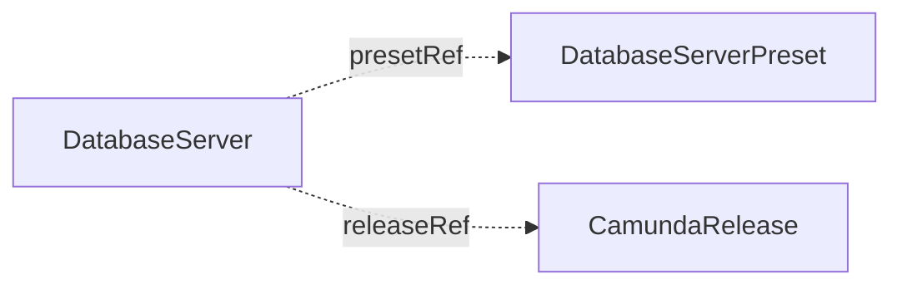

# DatabaseServerPreset

`DatabaseServerPreset` is a cluster-scoped baseline configuration for [DatabaseServer](databaseserver.md) resources. You create it, or another tool creates it for you.

A preset holds one PostgreSQL shape: instance count, resources, storage, scheduling, monitoring, and the archive bucket. A platform team can publish a set of presets, for example `small`, `standard`, and `large`, and each team picks one. The PostgreSQL major version is not part of the shape. It comes from a [CamundaRelease](camundarelease.md), so a version change never edits a preset.

A preset creates nothing and reports no status. A `DatabaseServer` uses it through `spec.presetRef`.

The smallest preset sets an instance count and a volume size:

```yaml
apiVersion: core.camunda.io/v1
kind: DatabaseServerPreset
metadata:
  name: standard
spec:
  server:
    instances: 2
    storageSize: "64Gi"
```


```mermaid
graph LR
    DBS[DatabaseServer] -.->|presetRef| DBSP[DatabaseServerPreset]
    DBS -.->|releaseRef| CR[CamundaRelease]
```

## Merge rules

`spec.server` of the preset is the baseline. The [CamundaRelease](camundarelease.md) of `releaseRef` merges over it, and the server spec merges over both. A field set on the `DatabaseServer` replaces the value of the layer below for that field. A field left unset on the server comes from the layer below.

Every object and every map is replaced as a whole, never merged field by field or key by key. This includes `resources`, `serviceAccount`, `scheduling`, `monitoring`, `archive`, `podLabels`, and `podAnnotations`. A server that sets its own `archive` block drops the bucket and the retention of the preset with it. A server that sets one pod label drops every pod label of the preset.

An empty map (`podLabels: {}`, `podAnnotations: {}`) counts as unset, so it does not remove the map of the preset. To remove it, set the map that you want on the server. Or reference a preset without that map.

## Fleet settings

A preset can set `archive` and `platformConfigRef`. One bucket then serves every server that references the preset, because each server writes its archive under a prefix of its own. One image repository serves them all as well.

## Changes

An edit of a preset reaches every `DatabaseServer` that references it, with these exceptions:

- A lower `storageSize` or `walStorageSize` does not shrink a running server. The server keeps its size and records a Warning event with reason `StorageShrinkIgnored`.
- A cleared `walStorageSize` does not remove the write-ahead log volume of a running server. The server keeps the volume and records a Warning event with reason `WALStorageKept`.
- An edit of `archive` waits while a server that uses the preset runs a rollback. That server reports `Ready` `False` with reason `InvalidReference` until the rollback is answered.

A new server uses the new baseline.

## Deletion

Deleting a preset removes no server. Each `DatabaseServer` that references it reports `Ready` `False` with reason `InvalidReference`.

## Status

A preset has no status. It reports no conditions and no `status.observedGeneration`. A problem with a preset shows on the `Ready` condition of the `DatabaseServer` that references it. Examples are a `presetRef` that names no preset, or a merge that lacks `version` or `storageSize`.

## Spec reference

`spec.server` has the same type as the spec of `DatabaseServer`. The fields `presetRef`, `releaseRef`, `databaseServerConfig`, and `suspend` belong to one server and must stay unset in a preset. [Validation rules](#validation-rules) has the rule for `version`. Every other field is inheritable.

Every field, with its type, whether it is required, and its default:

```yaml
apiVersion: core.camunda.io/v1
kind: DatabaseServerPreset
metadata:
  name: standard
spec:
  # object (DatabaseServer spec type). Required. The baseline that servers inherit.
  server:
    # string. Optional. Name of a cluster-scoped CamundaPlatformConfig. Only its image settings are read.
    platformConfigRef: "my-platform-config"
    # integer. Optional, default: 1. Number of PostgreSQL instances, at least 1.
    instances: 2
    # object (corev1.ResourceRequirements). Optional. CPU and memory of each instance.
    resources:
      requests: { cpu: "1", memory: "2Gi" }
      limits: { memory: "2Gi" }
    # string (resource quantity). Optional. Size of the data volume of each instance.
    storageSize: "64Gi"
    # string. Optional, default: the default StorageClass of the Kubernetes cluster. StorageClass of the volumes.
    storageClassName: "ssd"
    # string (resource quantity). Optional. Size of a separate volume for the write-ahead log.
    walStorageSize: "8Gi"
    # object. Optional. The ServiceAccount <name>-postgres of the instance pods, which the operator creates. See DatabaseServer.
    serviceAccount:
      # map[string]string. Optional. Annotations for workload identity.
      annotations: {}
    # object. Optional. Scheduling constraints. A server that sets its own scheduling block replaces this one as a whole.
    scheduling:
      # object (corev1.NodeAffinity). Optional. Node affinity rules.
      nodeAffinity: {}
      # object (corev1.PodAffinity). Optional. Pod affinity rules.
      podAffinity: {}
      # list (corev1.Toleration). Optional. Tolerations of the pods.
      tolerations: []
    # map[string]string. Optional. Extra labels on the instance pods.
    podLabels: {}
    # map[string]string. Optional. Extra annotations on the instance pods.
    podAnnotations: {}
    # object. Optional. Prometheus scraping. A server that sets its own monitoring block replaces this one as a whole.
    monitoring:
      podMonitor:
        # boolean. Optional, default: false. Creates a PodMonitor over the instance pods.
        enabled: false
        # map[string]string. Optional. Extra labels on the PodMonitor.
        labels: {}
        # map[string]string. Optional. Extra annotations on the PodMonitor.
        annotations: {}
        # string. Optional, default: the Prometheus setting. Scrape interval, as a Prometheus duration.
        interval: "30s"
    # object. Optional. The continuous archive. See DatabaseServer.
    archive:
      # string. Required in this block. Name of an ObjectStorageConfig in the namespace of each server.
      objectStorageRef: my-backup-bucket
      # integer. Required in this block. How many days into the past a restore can reach, from 1 to 36500.
      retentionPeriodDays: 30
      # string. Optional, default: "0 0 2 * * *". Six-field cron in UTC, seconds first, or a descriptor such as "@daily". A five-field cron is rejected.
      baseBackupSchedule: "0 0 2 * * *"
```

### Validation rules

- `spec.server` must not set `presetRef`, `releaseRef`, `databaseServerConfig`, or `suspend`. An empty `presetRef`, an empty `releaseRef`, and `suspend: false` count as unset, so templated YAML that renders zero values still applies. An empty `databaseServerConfig` is rejected by the name pattern. Omit the field instead.
- `version` is rejected in `spec.server` with `version belongs to a CamundaRelease and must not be set in a preset`. Move the version to a [CamundaRelease](camundarelease.md), and point every server at it with `releaseRef`. An empty `version` is rejected by the bare-major pattern. Omit the field instead.
- The no-shrink rule of `DatabaseServer` for `storageSize` and `walStorageSize` does not bind a preset. You can lower or clear them at any time. See [Changes](#changes) for the effect on a running server.
- The `DatabaseServer` checks that the merged configuration is complete, not the preset.
- Every other rule of the `DatabaseServer` schema applies to `spec.server`. `instances` must be at least 1, and `archive.retentionPeriodDays` must be from 1 to 36500. `archive.baseBackupSchedule` must be a six-field cron or a descriptor, as on the [DatabaseServer](databaseserver.md#schedule).

### A production-shaped example

```yaml
apiVersion: core.camunda.io/v1
kind: DatabaseServerPreset
metadata:
  name: large
spec:
  server:
    platformConfigRef: my-platform-config
    instances: 3
    resources:
      requests: { cpu: "4", memory: "8Gi" }
      limits: { memory: "8Gi" }
    storageSize: "512Gi"
    storageClassName: "ssd"
    walStorageSize: "64Gi"
    scheduling:
      tolerations:
        - key: dedicated
          operator: Equal
          value: postgres
          effect: NoSchedule
    monitoring:
      podMonitor:
        enabled: true
        labels:
          release: prometheus
    archive:
      objectStorageRef: my-backup-bucket
      retentionPeriodDays: 30
```

## Related

- [DatabaseServer](databaseserver.md): references a preset through `spec.presetRef` and inherits `spec.server`.
- [CamundaRelease](camundarelease.md): the PostgreSQL version that runs on this shape. It merges between the preset and the server.
- [ObjectStorageConfig](objectstorageconfig.md): the archive bucket that `spec.server.archive.objectStorageRef` names.
- [CamundaPlatformConfig](camundaplatformconfig.md): the image settings that `spec.server.platformConfigRef` names.
- [Secondary storage guide](../guides/secondary-storage.md): how to choose and connect secondary storage.
