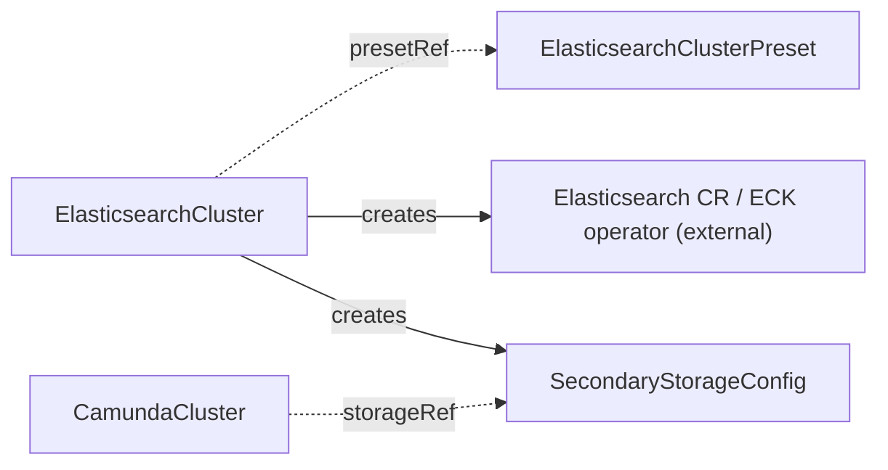

# ElasticsearchCluster

Manages the full lifecycle of an Elasticsearch cluster for use as secondary storage, deployed through the ECK operator.

## Purpose

`ElasticsearchCluster` provisions and operates an Elasticsearch cluster by creating an ECK `Elasticsearch` custom resource, monitoring its health, and publishing the connection details as a `SecondaryStorageConfig` contract CRD with auto-generated credentials.
The ECK (Elastic Cloud on Kubernetes) operator is an external prerequisite: this operator never deploys Elasticsearch workloads itself, it only manages the ECK CR that does.
You create this CR directly, or a composition layer above may create it on your behalf.
`ElasticsearchCluster` has an independent lifecycle: it never references a `CamundaCluster`, and no `CamundaCluster` references it directly — the two meet only through the `SecondaryStorageConfig` contract.
Camunda 8.9 also supports OpenSearch and RDBMS as secondary storage, but this CRD manages Elasticsearch only; for an RDBMS backend see [Database](database.md).

!!! note "Deviation from the original proposal"
    The proposal included an optional `eckResourceName` field to adopt a pre-existing ECK CR during migration.
    This operator is a clean slate with no migration path, so the field does not exist: the ECK CR name is always derived from the `ElasticsearchCluster` name.

## How it works

1. The operator resolves `spec.presetRef` to an `ElasticsearchClusterPreset` if set, then applies any pointer fields set inline on the spec as overrides; a field set on this CR replaces the preset's value for that field wholesale, and `scheduling` in particular replaces the preset's scheduling block entirely rather than merging.
2. It renders an ECK `Elasticsearch` CR (named after this CR) from the resolved configuration — version, node count, resources, storage — and applies it with Server-Side Apply (SSA) under the per-component field manager `ElasticsearchCluster/elasticsearch`.
3. It labels the Elasticsearch pods and data PVCs with `camunda.io/elasticsearch-cluster: <this CR's name>` and `camunda.io/component: elasticsearch` through the ECK pod and volume claim templates, so extensions such as `PVCAutoResize` can discover them. Every resource the operator applies itself (the ECK CR, Secrets, ServiceAccount, contracts, exporter) also carries `app.kubernetes.io/managed-by: camunda-operator`.
4. When `spec.serviceAccount` is set, it creates a dedicated ServiceAccount named `<name>-es` with `spec.serviceAccount.annotations`. It points the Elasticsearch pods at that ServiceAccount through the ECK podTemplate. The nodes then have the workload identity (IRSA, GCP Workload Identity, and more) that grants access to the snapshot bucket for backups. The `CamundaCluster` controller registers the snapshot repository itself inside Elasticsearch through the Elasticsearch API, authenticated with the `SecondaryStorageConfig` credentials. The bucket access of the Elasticsearch nodes comes from this workload identity.
5. It provisions a dedicated Camunda user through ECK's file realm, generates credentials for it, and stores them in the Secret `<name>-es-user` that it owns (keys `username`, `password`, and `roles`). The user carries the `superuser` role for now: snapshot-repository registration (done by the `CamundaCluster` controller with these credentials) needs cluster-manage rights, and narrowing to a dedicated role is deliberately deferred until that flow lands.
6. It creates and keeps current a `SecondaryStorageConfig` named `spec.secondaryStorageConfig` in this CR's own namespace, with `type: elasticsearch`, the in-cluster HTTPS endpoint of the ECK-managed service, a reference to the generated credentials Secret, and a `caSecretRef` pointing at the ECK-generated CA certificate Secret so consumers can verify the cluster's self-signed HTTPS endpoint.
7. It watches the ECK CR's health and reflects it in this CR's conditions.
8. When `spec.monitoring.serviceMonitor.enabled: true`, it deploys the prometheus-community `elasticsearch_exporter` next to the cluster, because Elasticsearch serves no Prometheus endpoint itself. The exporter reads the cluster over the ECK HTTPS service with the Camunda user, checks TLS against the ECK CA, and serves metrics on port 9114 through the Service `<name>-es-metrics`. When the cluster serves the ServiceMonitor kind, a ServiceMonitor scrapes that Service. `spec.monitoring.exporter` overrides the exporter image and resources. The exporter reports its own `MetricsReady` condition and stays out of `Ready`.
9. When `spec.suspend: true`, it stops the cluster the way Elastic documents: it deletes the ECK `Elasticsearch` resource. The resource always carries `volumeClaimDeletePolicy: DeleteOnScaledownOnly`, so ECK retains the data volumes. Before the deletion the operator waits until ECK has observed that policy and no data migration is in progress. `Ready` reports `Suspended`. Suspension also stops the exporter: its Deployment scales to zero, the metrics Service and ServiceMonitor stay, and `MetricsReady` reports `Suspended`. Setting `spec.suspend` back to `false` recreates the resource, and ECK reattaches the volumes by name. The operator never scales node sets to zero: ECK removes the volume of every node that it scales away, under either policy. A composition layer above may suspend both a `CamundaCluster` and its `ElasticsearchCluster` through its own fields, but neither controls the other.
10. On deletion, the ECK CR, the credentials Secret, the `SecondaryStorageConfig`, and the optional ServiceAccount, exporter Deployment, metrics Service, and ServiceMonitor are all garbage-collected through their owner references. No finalizer is needed. The data volumes stay, because of `DeleteOnScaledownOnly`: data removal is a deliberate, manual act. Delete the PersistentVolumeClaims to remove the data.



## API reference

```yaml
apiVersion: core.camunda.io/v1
kind: ElasticsearchCluster
metadata:
  name: my-cluster-es
  namespace: my-cluster-ns
spec:
  # string. Optional. Name of a cluster-scoped ElasticsearchClusterPreset used as the configuration baseline; fields set below override it.
  presetRef: "standard"
  # string. Required unless the resolved preset provides it. Elasticsearch version to deploy as a full three-segment version; Camunda 8.9 supports 8.19+ and 9.2+.
  version: "9.2.4"
  # integer. Required unless the resolved preset provides it. Number of Elasticsearch nodes, at least 1.
  replicas: 3
  # object (corev1.ResourceRequirements). Optional. CPU and memory for each Elasticsearch node.
  resources:
    requests: { cpu: "1", memory: "2Gi" }
    limits: { memory: "2Gi" }
  # string (resource quantity). Required unless the resolved preset provides it. Size of each node's data volume.
  storageSize: "64Gi"
  # string. Optional, default: the cluster's default StorageClass. StorageClass for the data volumes.
  storageClassName: "ssd"
  # object. Optional. ServiceAccount settings for the Elasticsearch pods. When set, the operator creates a dedicated ServiceAccount named <name>-es and points the pods at it through the ECK podTemplate.
  serviceAccount:
    # map[string]string. Optional. Annotations for workload identity (IRSA, GCP Workload Identity, ...); required for Elasticsearch to access the snapshot bucket for backups.
    annotations:
      eks.amazonaws.com/role-arn: "arn:aws:iam::123456789012:role/my-es-snapshot-role"
  # list (corev1.EnvVar). Optional. Extra environment variables for every Elasticsearch node.
  extraEnv: []
  # list (corev1.EnvFromSource). Optional. Extra environment sources (ConfigMaps, Secrets) for every node.
  extraEnvFrom: []
  # map[string]string. Optional. Extra labels applied to the Elasticsearch pods.
  podLabels: {}
  # map[string]string. Optional. Extra annotations applied to the Elasticsearch pods.
  podAnnotations: {}
  # object. Optional. Scheduling constraints for the Elasticsearch pods; when set, replaces the preset's scheduling block entirely (no merge).
  scheduling:
    # object (corev1.NodeAffinity). Optional. Node affinity rules.
    nodeAffinity: {}
    # object (corev1.PodAffinity). Optional. Pod affinity rules.
    podAffinity: {}
    # list (corev1.Toleration). Optional. Tolerations for the pods.
    tolerations: []
  # string. Required. Name of the SecondaryStorageConfig the operator creates in this CR's own namespace with the connection details and generated credentials.
  secondaryStorageConfig: "my-storage-config"
  # object. Optional. Prometheus scraping integration. Inheritable from the preset; a block set here replaces the preset's wholesale.
  monitoring:
    serviceMonitor:
      # boolean. Optional, default: false. Deploy the elasticsearch_exporter and create a ServiceMonitor that scrapes it. The ServiceMonitor requires the prometheus-operator CRD; on a cluster without it the exporter still runs and the ServiceMonitor is omitted.
      enabled: true
      # map[string]string. Optional. Extra labels applied to the ServiceMonitor.
      labels: {}
      # map[string]string. Optional. Extra annotations applied to the ServiceMonitor.
      annotations: {}
    exporter:
      # string. Optional. Overrides the exporter image. Defaults to the pinned quay.io/prometheuscommunity/elasticsearch-exporter release of the operator.
      image: ""
      # object (ResourceRequirements). Optional. CPU and memory of the exporter container.
      resources: {}
  # boolean. Optional, default: false. Stop the cluster and keep its data volumes: the ECK resource is deleted with DeleteOnScaledownOnly and recreated on resume.
  suspend: false
```

## Status

| Type | Reason | Meaning |
| --- | --- | --- |
| `Ready` | `InvalidReference` | `spec.presetRef` does not resolve to an existing `ElasticsearchClusterPreset`, or the merged spec is incomplete or below the version floor. |
| `Ready` | any component status | The pre-checks passed. `Ready` mirrors the representative component condition, that is, the one with the highest component framework priority: same status, same reason, and the message names the component. Reasons are component framework statuses, for example `Healthy`, `Creating`, `Updating`, `Failing`, `Degraded` (yellow health past the grace period), `Down` (red health past the grace period), `Suspended`, or `Error`. |
| `Ready` | `Suspended` | `Ready` is `True` with this reason while the ECK resource is deleted for suspension and the data volumes are retained. The cluster is in its desired state and intentionally not serving. To gate on a serving cluster, require `Ready=True` and a reason other than `Suspended`. |
| `CredentialsReady`, `ElasticsearchReady`, `StorageContractReady` | component status | The operational detail of the component framework for each component that makes up `Ready`. |
| `MetricsReady` | component status | The exporter component. It is not part of `Ready`: a broken exporter never marks the cluster not ready. `Disabled` while monitoring is off. |

The operator records the last reconciled generation in `status.observedGeneration`.

`status.storageSize` is the data volume size that the cluster has: the smallest capacity that its data PersistentVolumeClaims report. A resize outside the spec, for example by an auto-resize controller, shows here. Until a claim reports a capacity it is the size that the applied Elasticsearch CR requests.

## Validation

- When `spec.presetRef` is unset, `version`, `replicas`, and `storageSize` must be set inline; with a preset, the merged result must contain them.
- `spec.version` must be a full three-segment version (`9.2.4`, not `9.2`) that Camunda 8.9 supports: Elasticsearch 8.19+ or 9.2+.
- `spec.replicas` must be at least 1.
- `spec.storageSize` cannot shrink. Elasticsearch data volumes cannot be reduced in place. Admission rejects an inline `storageSize` that is lower than its previous inline value. A shrink that admission cannot see is ignored: a preset baseline lowered under a cluster, or an inline value set below the size that a preset provided before. The controller compares against the largest data volume that exists (the applied ECK claim and the data PersistentVolumeClaims, which stay during suspension), keeps that size, records a Warning event with reason `StorageShrinkIgnored`, and continues to reconcile. To lower the size of a running cluster, delete and recreate it.
- `spec.secondaryStorageConfig` must be a valid resource name.

!!! note "Deviation from the original proposal"
    The proposal's examples used Elasticsearch 8.16/8.17, which are below Camunda 8.9's minimum of 8.19.
    Verified against the Camunda 8.9 supported-environments matrix: the Orchestration Cluster requires Elasticsearch 8.19+ or 9.2+, and 9.2+ is the recommended line for new deployments.

## Relationships

- [ElasticsearchClusterPreset](elasticsearchclusterpreset.md) — optional configuration baseline referenced via `presetRef`.
- [Database](database.md) — the peer storage backend controller for RDBMS secondary storage; an orchestration cluster uses one or the other.
- [SecondaryStorageConfig](secondarystorageconfig.md) — created and kept current by this controller under the name in `spec.secondaryStorageConfig`.
- [CamundaCluster](camundacluster.md) — consumes the created [SecondaryStorageConfig](secondarystorageconfig.md) via its `storageRef`; it never references this CR directly. Its controller registers the backup snapshot repository inside this Elasticsearch through the Elasticsearch API, while the nodes' access to the snapshot bucket flows from the workload identity configured via `spec.serviceAccount.annotations` here.
- [PVCAutoResize](pvcautoresize.md) — never references this CR directly; the operator locates this ElasticsearchCluster as the producer of the consuming cluster's [SecondaryStorageConfig](secondarystorageconfig.md) (following the [CamundaCluster](camundacluster.md)'s `storageRef`) and patches the auto-resize annotations on the Elasticsearch data PVCs.

The ECK operator is an external prerequisite that reconciles the `Elasticsearch` CR this controller creates.

## Examples

A minimal manifest:

```yaml
apiVersion: core.camunda.io/v1
kind: ElasticsearchCluster
metadata:
  name: my-cluster-es
  namespace: my-cluster-ns
spec:
  presetRef: "standard"
  secondaryStorageConfig: "my-storage-config"
```

A realistic manifest:

```yaml
apiVersion: core.camunda.io/v1
kind: ElasticsearchCluster
metadata:
  name: my-cluster-es
  namespace: my-cluster-ns
spec:
  version: "9.2.4"
  replicas: 3
  resources:
    requests: { cpu: "2", memory: "4Gi" }
    limits: { memory: "4Gi" }
  storageSize: "128Gi"
  storageClassName: "ssd"
  podLabels:
    team: platform
  scheduling:
    tolerations:
      - key: dedicated
        operator: Equal
        value: elasticsearch
        effect: NoSchedule
  secondaryStorageConfig: "my-storage-config"
  monitoring:
    serviceMonitor:
      enabled: true
      labels:
        release: prometheus
  suspend: false
```
