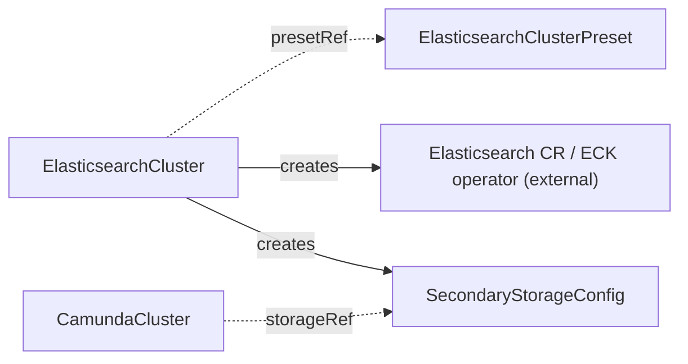

# ElasticsearchCluster

Manages the full lifecycle of an Elasticsearch cluster for use as secondary storage, deployed through the ECK operator.

## Purpose

`ElasticsearchCluster` provisions and operates an Elasticsearch cluster by creating an ECK `Elasticsearch` custom resource, monitoring its health, and publishing the connection details as a `SecondaryStorageConfig` contract CRD with auto-generated credentials.
The ECK (Elastic Cloud on Kubernetes) operator is an external prerequisite: this operator never deploys Elasticsearch workloads itself, it only manages the ECK CR that does.
You create this CR directly, or a composition layer above may create it on your behalf.
`ElasticsearchCluster` has an independent lifecycle: it never references a `CamundaCluster`, and no `CamundaCluster` references it directly — the two meet only through the `SecondaryStorageConfig` contract.
Camunda 8.9 also supports OpenSearch and RDBMS as secondary storage, but this CRD manages Elasticsearch only; for an RDBMS backend see [Database](database.md).

!!! note "Deviation from the original proposal"
    The proposal included an optional `eckResourceName` field to adopt a pre-existing ECK CR during migration.
    This operator is a clean slate with no migration path, so the field does not exist: the ECK CR name is always derived from the `ElasticsearchCluster` name.

## How it works

1. The operator resolves `spec.presetRef` to an `ElasticsearchClusterPreset` if set, then applies any pointer fields set inline on the spec as overrides; a field set on this CR replaces the preset's value for that field wholesale, and `scheduling` in particular replaces the preset's scheduling block entirely rather than merging.
2. It renders an ECK `Elasticsearch` CR (named after this CR) from the resolved configuration — version, node count, resources, storage — and applies it with Server-Side Apply (SSA) under the per-component field manager `ElasticsearchCluster/elasticsearch`.
3. It labels the Elasticsearch pods and data PVCs with `camunda.io/elasticsearch-cluster: <this CR's name>` and `camunda.io/component: elasticsearch` through the ECK pod and volume claim templates, so extensions such as `PVCAutoResize` can discover them. Every resource the operator applies itself (the ECK CR, Secrets, ServiceAccount, contracts, exporter) also carries `app.kubernetes.io/managed-by: camunda-operator`.
4. It renders a ServiceAccount for the Elasticsearch pods when `spec.serviceAccount` is set, or when `spec.snapshotStorageRef` names a bucket whose contract carries a workload identity. The ServiceAccount is named `spec.serviceAccount.name`, or `<name>-es` when that is unset, and it carries the identity annotation derived from the bucket contract with `spec.serviceAccount.annotations` layered over it, so a value you state wins over the derived one on the same key. With `spec.serviceAccount.create: false` the ServiceAccount is one you manage: the operator neither creates, annotates, nor owns it, and a missing one fails the pre-check with `InvalidReference` rather than leaving every pod unschedulable. The pods run under that ServiceAccount either way, through the ECK podTemplate.
5. It provisions a dedicated Camunda user through ECK's file realm, generates credentials for it, and stores them in the Secret `<name>-es-user` that it owns (keys `username`, `password`, and `roles`). The user holds the custom role `camunda`, which the operator defines in the Secret `<name>-es-roles` and passes to ECK through `spec.auth.roles`. The role grants only what Camunda documents as required: the cluster privileges `monitor`, `manage_index_templates`, `manage_ilm`, `manage_pipeline`, `create_snapshot`, and `monitor_snapshot`, and the index privileges `create_index`, `delete_index`, `read`, `write`, `manage`, and `manage_ilm`. It does not grant `cluster:admin/repository`, so the Camunda user cannot register a snapshot repository; the operator does that with the `elastic` user of ECK instead.
6. When `spec.snapshotStorageRef` is set, it owns the whole Elasticsearch side of that bucket. For a contract with `auth.type: credentials` it renders the Secret `<name>-es-snapshot-keystore` with the entries `s3.client.default.access_key` and `s3.client.default.secret_key`, and passes it to ECK ahead of `spec.secureSettings`; Elasticsearch reads the credentials of a repository from the node keystore alone, never from the settings of the repository. For a contract with `auth.type: workloadIdentity` the nodes authenticate as their ServiceAccount and no keystore Secret exists. It then registers the snapshot repository `<name>` in Elasticsearch with an idempotent PUT on every reconcile, authenticated as the `elastic` user of ECK, of type `s3` and with the base path `<basePath>/<namespace>/<name>` of the contract. `SnapshotRepositoryReady` reports the outcome, and a failed registration keeps `Ready` false. Only `type: S3` contracts are supported; a GCS or Azure bucket fails the pre-check with `InvalidReference`.
7. It creates and keeps current a `SecondaryStorageConfig` named `spec.secondaryStorageConfig` in this CR's own namespace, with `type: elasticsearch`, the in-cluster HTTPS endpoint of the ECK-managed service, a reference to the generated credentials Secret, a `caSecretRef` pointing at the ECK-generated CA certificate Secret so consumers can verify the cluster's self-signed HTTPS endpoint, and, when a bucket is referenced, `snapshotRepository` with the name of the repository it registered. The `CamundaCluster` reads that field and configures its components with it; it performs no Elasticsearch administration of its own.
8. It watches the ECK CR's health and reflects it in this CR's conditions.
9. When `spec.monitoring.serviceMonitor.enabled: true`, it deploys the prometheus-community `elasticsearch_exporter` next to the cluster, because Elasticsearch serves no Prometheus endpoint itself. The exporter reads the cluster over the ECK HTTPS service with the Camunda user, checks TLS against the ECK CA, and serves metrics on port 9114 through the Service `<name>-es-metrics`. When the cluster serves the ServiceMonitor kind, a ServiceMonitor scrapes that Service. `spec.monitoring.exporter` overrides the exporter image and resources. The exporter reports its own `MetricsReady` condition and stays out of `Ready`.
10. When `spec.suspend: true`, it stops the cluster the way Elastic documents: it deletes the ECK `Elasticsearch` resource. First it sets `volumeClaimDeletePolicy: DeleteOnScaledownOnly` on the resource, so ECK retains the data volumes, whatever `persistentVolumeClaimRetentionPolicy` says. Before the deletion the operator waits until ECK has observed that policy and no data migration is in progress. `Ready` reports `Suspended`. Suspension also stops the exporter: its Deployment scales to zero, the metrics Service and ServiceMonitor stay, and `MetricsReady` reports `Suspended`. Setting `spec.suspend` back to `false` recreates the resource, and ECK reattaches the volumes by name. The operator never scales node sets to zero: ECK removes the volume of every node that it scales away, under either policy. A composition layer above may suspend both a `CamundaCluster` and its `ElasticsearchCluster` through its own fields, but neither controls the other.
11. On deletion, the ECK CR, the credentials Secret, the `SecondaryStorageConfig`, and the optional ServiceAccount, exporter Deployment, metrics Service, and ServiceMonitor are all garbage-collected through their owner references. No finalizer is needed. The data volumes follow `spec.persistentVolumeClaimRetentionPolicy.whenDeleted`: with `Delete` (the default) the ECK resource carries `DeleteOnScaledownAndClusterDeletion` and ECK removes the volumes with the cluster; with `Retain` it carries `DeleteOnScaledownOnly`, the volumes stay, and data removal is a manual act.



## API reference

```yaml
apiVersion: core.camunda.io/v1
kind: ElasticsearchCluster
metadata:
  name: my-cluster-es
  namespace: my-cluster-ns
spec:
  # string. Optional. Name of a cluster-scoped ElasticsearchClusterPreset used as the configuration baseline; fields set below override it.
  presetRef: "standard"
  # string. Required unless the resolved preset provides it. Elasticsearch version to deploy as a full three-segment version; Camunda 8.9 supports 8.19+ and 9.2+.
  version: "9.2.4"
  # integer. Required unless the resolved preset provides it. Number of Elasticsearch nodes, at least 1.
  replicas: 3
  # object (corev1.ResourceRequirements). Optional. CPU and memory for each Elasticsearch node.
  resources:
    requests: { cpu: "1", memory: "2Gi" }
    limits: { memory: "2Gi" }
  # string (resource quantity). Required unless the resolved preset provides it. Size of each node's data volume.
  storageSize: "64Gi"
  # string. Optional, default: the cluster's default StorageClass. StorageClass for the data volumes.
  storageClassName: "ssd"
  # string. Optional. Name of a cluster-scoped ObjectStorageConfig holding the bucket of this cluster's snapshot repository. Set it to take part in backups; it must be the same bucket the CamundaCluster references.
  snapshotStorageRef: "my-backup-config"
  # object. Optional. ServiceAccount of the Elasticsearch pods. The operator renders one when this is set, or when snapshotStorageRef names a bucket whose contract carries a workload identity.
  serviceAccount:
    # string. Optional, default: <name>-es. Name of the ServiceAccount of the pods. It is the principal that a workload identity without an annotation (EKS Pod Identity, Workload Identity Federation) binds: system:serviceaccount:<namespace>:<name>.
    name: "my-cluster-es"
    # boolean. Optional, default: true. False names a ServiceAccount you manage: the operator neither creates, annotates, nor owns it, and a missing one fails the pre-check.
    create: true
    # map[string]string. Optional. Annotations for workload identity (IRSA, GCP Workload Identity, ...). The operator derives the annotation of snapshotStorageRef's identity on its own; a value set here wins over the derived one on the same key.
    annotations:
      eks.amazonaws.com/role-arn: "arn:aws:iam::123456789012:role/my-es-snapshot-role"
  # list of objects. Optional. Secrets that ECK loads into the keystore of every node. The credentials of snapshotStorageRef are added by the operator, so this is for everything else a keystore holds.
  secureSettings:
    - # string. Required. Name of the Secret, in this CR's namespace.
      secretName: extra-keystore-entries
      # list of objects. Optional. Projects single keys to keystore entries; an empty list loads every key under its own name.
      entries:
        - # string. Required. Key in the Secret.
          key: someKey
          # string. Required. Keystore entry that the key becomes.
          path: some.secure.setting
  # list (corev1.EnvVar). Optional. Extra environment variables for every Elasticsearch node.
  extraEnv: []
  # list (corev1.EnvFromSource). Optional. Extra environment sources (ConfigMaps, Secrets) for every node.
  extraEnvFrom: []
  # map[string]string. Optional. Extra labels applied to the Elasticsearch pods.
  podLabels: {}
  # map[string]string. Optional. Extra annotations applied to the Elasticsearch pods.
  podAnnotations: {}
  # object. Optional. Scheduling constraints for the Elasticsearch pods; when set, replaces the preset's scheduling block entirely (no merge).
  scheduling:
    # object (corev1.NodeAffinity). Optional. Node affinity rules.
    nodeAffinity: {}
    # object (corev1.PodAffinity). Optional. Pod affinity rules.
    podAffinity: {}
    # list (corev1.Toleration). Optional. Tolerations for the pods.
    tolerations: []
  # string. Required. Name of the SecondaryStorageConfig the operator creates in this CR's own namespace with the connection details and generated credentials.
  secondaryStorageConfig: "my-storage-config"
  # object. Optional. Prometheus scraping integration. Inheritable from the preset; a block set here replaces the preset's wholesale.
  monitoring:
    serviceMonitor:
      # boolean. Optional, default: false. Deploy the elasticsearch_exporter and create a ServiceMonitor that scrapes it. The ServiceMonitor requires the prometheus-operator CRD; on a cluster without it the exporter still runs and the ServiceMonitor is omitted.
      enabled: true
      # map[string]string. Optional. Extra labels applied to the ServiceMonitor.
      labels: {}
      # map[string]string. Optional. Extra annotations applied to the ServiceMonitor.
      annotations: {}
    exporter:
      # string. Optional. Overrides the exporter image. Defaults to the pinned quay.io/prometheuscommunity/elasticsearch-exporter release of the operator.
      image: ""
      # object (ResourceRequirements). Optional. CPU and memory of the exporter container.
      resources: {}
  # object. Optional. What happens to the data volumes when this resource is deleted. Inheritable from the preset. Mirrors the StatefulSet field; only whenDeleted exists, because ECK deletes the volume of every node that it scales away.
  persistentVolumeClaimRetentionPolicy:
    # string (Retain | Delete). Optional, default: Delete. Delete removes the data volumes with the cluster. Retain keeps them, and a later cluster with the same name reattaches them.
    whenDeleted: Delete
  # boolean. Optional, default: false. Stop the cluster and keep its data volumes: the ECK resource is switched to DeleteOnScaledownOnly, deleted, and recreated on resume.
  suspend: false
```

## Status

| Type | Reason | Meaning |
| --- | --- | --- |
| `Ready` | `InvalidReference` | `spec.presetRef` does not resolve to an existing `ElasticsearchClusterPreset`, or the merged spec is incomplete or below the version floor. |
| `Ready` | any component status | The pre-checks passed. `Ready` is `True` only when every component condition is `True`. Its reason and message come from the governing component. That is the component with the highest component framework priority among the components that are not `True`. When every one of them is `True`, it is the one with the highest priority of all. The message names that component. Reasons are component framework statuses, for example `Healthy`, `Creating`, `Updating`, `Failing`, `Degraded` (yellow health past the grace period), `Down` (red health past the grace period), `Suspended`, or `Error`. |
| `Ready` | `Suspended` | `Ready` is `True` with this reason while the ECK resource is deleted for suspension and the data volumes are retained. The cluster is in its desired state and intentionally not serving. To gate on a serving cluster, require `Ready=True` and a reason other than `Suspended`. |
| `Ready` | `MissingSecret` | The bucket contract of `spec.snapshotStorageRef` names a Secret, or a key in it, that does not exist. |
| `CredentialsReady`, `KeystoreReady`, `ElasticsearchReady`, `StorageContractReady` | component status | The operational detail of the component framework for each component that makes up `Ready`. `KeystoreReady` is `Disabled` unless a referenced bucket holds static credentials. |
| `SnapshotRepositoryReady` | `Healthy` | The snapshot repository is registered in Elasticsearch. The condition is absent when `spec.snapshotStorageRef` is unset. |
| `SnapshotRepositoryReady` | `ConnectionFailed` | Elasticsearch could not be reached, or it rejected the registration. `Ready` is false while this holds. |
| `SnapshotRepositoryReady` | `MissingSecret` | The `elastic` user Secret or the CA Secret of ECK is not available yet. It appears once ECK has created the cluster. |
| `MetricsReady` | component status | The exporter component. It is not part of `Ready`: a broken exporter never marks the cluster not ready. `Disabled` while monitoring is off. |

The operator records the last reconciled generation in `status.observedGeneration`.

`status.volumes` lists the bound data PersistentVolumeClaims of the cluster, sorted by name, each with the capacity that it reports (`name`, `capacity`). The claims can differ in size, so a resize of one claim outside the spec, for example by an auto-resize controller, shows here.

## Validation

- When `spec.presetRef` is unset, `version`, `replicas`, and `storageSize` must be set inline; with a preset, the merged result must contain them.
- `spec.version` must be a full three-segment version (`9.2.4`, not `9.2`) that Camunda 8.9 supports: Elasticsearch 8.19+ or 9.2+.
- `spec.replicas` must be at least 1.
- `spec.storageSize` cannot shrink. Elasticsearch data volumes cannot be reduced in place. Admission rejects an inline `storageSize` that is lower than its previous inline value. A shrink that admission cannot see is ignored: a preset baseline lowered under a cluster, or an inline value set below the size that a preset provided before. The controller compares against the largest data volume that exists (the applied ECK claim and the data PersistentVolumeClaims, which stay during suspension), keeps that size, records a Warning event with reason `StorageShrinkIgnored`, and continues to reconcile. To lower the size of a running cluster, delete and recreate it.
- `spec.secondaryStorageConfig` and `spec.snapshotStorageRef` must be valid resource names.
- `spec.serviceAccount.name` must be a valid resource name. It is part of the contract with your cloud provider: a workload identity that needs no annotation, such as EKS Pod Identity or Workload Identity Federation, binds the principal `system:serviceaccount:<namespace>:<name>`, which defaults to `<name>-es`.

!!! note "Deviation from the original proposal"
    The proposal's examples used Elasticsearch 8.16/8.17, which are below Camunda 8.9's minimum of 8.19.
    Verified against the Camunda 8.9 supported-environments matrix: the Orchestration Cluster requires Elasticsearch 8.19+ or 9.2+, and 9.2+ is the recommended line for new deployments.

## Relationships

- [ElasticsearchClusterPreset](elasticsearchclusterpreset.md) — optional configuration baseline referenced via `presetRef`.
- [Database](database.md) — the peer storage backend controller for RDBMS secondary storage; an orchestration cluster uses one or the other.
- [SecondaryStorageConfig](secondarystorageconfig.md) — created and kept current by this controller under the name in `spec.secondaryStorageConfig`.
- [CamundaCluster](camundacluster.md) — consumes the created [SecondaryStorageConfig](secondarystorageconfig.md) via its `storageRef`; it never references this CR directly. It reads `snapshotRepository` from that contract and does no Elasticsearch administration itself. Both CRs must reference the same [ObjectStorageConfig](objectstorageconfig.md): this one through `spec.snapshotStorageRef`, the cluster through its `backupStorageRef`. A mismatch shows up as a failing repository on the Elasticsearch side.
- [ObjectStorageConfig](objectstorageconfig.md) — referenced via `spec.snapshotStorageRef`; it supplies the bucket of the snapshot repository and the identity or credentials the nodes use to reach it.
- [PVCAutoResize](pvcautoresize.md) — never references this CR directly; the operator locates this ElasticsearchCluster as the producer of the consuming cluster's [SecondaryStorageConfig](secondarystorageconfig.md) (following the [CamundaCluster](camundacluster.md)'s `storageRef`) and patches the auto-resize annotations on the Elasticsearch data PVCs.

The ECK operator is an external prerequisite that reconciles the `Elasticsearch` CR this controller creates.

## Examples

A minimal manifest:

```yaml
apiVersion: core.camunda.io/v1
kind: ElasticsearchCluster
metadata:
  name: my-cluster-es
  namespace: my-cluster-ns
spec:
  presetRef: "standard"
  secondaryStorageConfig: "my-storage-config"
```

A realistic manifest:

```yaml
apiVersion: core.camunda.io/v1
kind: ElasticsearchCluster
metadata:
  name: my-cluster-es
  namespace: my-cluster-ns
spec:
  version: "9.2.4"
  replicas: 3
  resources:
    requests: { cpu: "2", memory: "4Gi" }
    limits: { memory: "4Gi" }
  storageSize: "128Gi"
  storageClassName: "ssd"
  podLabels:
    team: platform
  scheduling:
    tolerations:
      - key: dedicated
        operator: Equal
        value: elasticsearch
        effect: NoSchedule
  secondaryStorageConfig: "my-storage-config"
  monitoring:
    serviceMonitor:
      enabled: true
      labels:
        release: prometheus
  suspend: false
```
