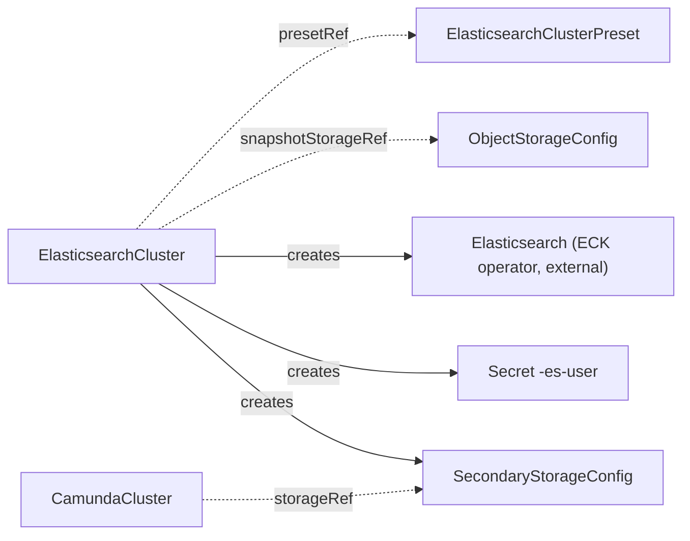

# ElasticsearchCluster

`ElasticsearchCluster` runs an Elasticsearch cluster for secondary storage through the ECK operator. You create it, or another tool creates it for you.

## Purpose

An orchestration cluster needs secondary storage. `ElasticsearchCluster` gives you one Elasticsearch cluster with generated credentials and a `SecondaryStorageConfig` that a `CamundaCluster` can reference. The operator does not run Elasticsearch itself. It creates an ECK `Elasticsearch` resource, and the ECK operator runs the nodes. ECK must be installed before you create this kind.

Use it when you want the operator to own the Elasticsearch cluster, its credentials, and its snapshot repository. If you want an RDBMS as secondary storage, use [Database](database.md) instead. An `ElasticsearchCluster` never references a `CamundaCluster`. The two meet only through the `SecondaryStorageConfig`.

## What it does

The operator creates these resources from an `ElasticsearchCluster` named `<name>`:

- The ECK `Elasticsearch` resource `<name>`. ECK creates the HTTPS Service `<name>-es-http` on port 9200 and the CA Secret `<name>-es-http-certs-public` from it.
- The Secret `<name>-es-user` with the keys `username`, `password`, and `roles`. The username is `camunda`. The password is generated once.
- The Secret `<name>-es-roles` with the role `camunda`. The role grants the cluster and index privileges that Camunda needs for indices, templates, lifecycle policies, pipelines, and snapshots, including snapshot deletion. It does not grant repository registration.
- The `SecondaryStorageConfig` `<spec.secondaryStorageConfig>` in the same namespace, with `type: elasticsearch`. It carries the endpoint `https://<name>-es-http.<namespace>.svc:9200`, a reference to `<name>-es-user`, a `caSecretRef` to `<name>-es-http-certs-public`, and `snapshotRepository` once the repository is registered.
- The ServiceAccount `<name>-es`, or the name in `spec.serviceAccount.name`. It exists when `spec.serviceAccount` is set, or when `spec.snapshotStorageRef` names a bucket that uses workload identity. The Elasticsearch pods run under it.
- The Secret `<name>-es-snapshot-keystore` when the snapshot bucket needs keystore entries. See **Snapshot repository**.
- When `spec.monitoring.serviceMonitor.enabled` is `true`: the `elasticsearch_exporter` Deployment `<name>-es-exporter`, the Service `<name>-es-metrics` on port `9114`, and a ServiceMonitor when the Kubernetes cluster serves that kind.

Every resource the operator applies carries the labels `camunda.io/elasticsearch-cluster: <name>`, `camunda.io/component: elasticsearch`, and `app.kubernetes.io/managed-by: camunda-operator`. The Elasticsearch pods and their data volumes carry the first two labels. The exporter resources carry `camunda.io/component: elasticsearch-exporter`.



**Preset.** If `spec.presetRef` names an `ElasticsearchClusterPreset`, the preset is the baseline. A field set on the `ElasticsearchCluster` replaces the value of the preset for that field. The `scheduling` and `monitoring` blocks are replaced as a whole, never merged field by field. An edit of the preset reaches every cluster that references it.

**Deletion.** Deletion removes the ECK resource, the Secrets, the `SecondaryStorageConfig`, the owned ServiceAccount, and the exporter resources. The data volumes obey `spec.persistentVolumeClaimRetentionPolicy.whenDeleted`. With `Delete`, ECK removes them with the cluster. With `Retain`, the volumes stay and a later cluster with the same name reattaches them.

**Suspend.** With `spec.suspend: true`, the operator deletes the ECK resource and keeps the data volumes. `Ready` is `True` with reason `Suspended`. The exporter stops as well, and `MetricsReady` reports `Suspended`. When you set `spec.suspend` back to `false`, the operator recreates the resource and ECK reattaches the volumes.

**Password rotation.** The operator generates the password once and keeps it. To rotate it, delete the Secret `<name>-es-user`. The operator generates a new password on the next reconcile and publishes it in a new Secret.

**Missing references.** If `spec.presetRef` or `spec.snapshotStorageRef` names a resource that does not exist, `Ready` is `False` with reason `InvalidReference`. If the bucket names a Secret or a key that does not exist, the reason is `MissingSecret`. If `spec.serviceAccount.create` is `false` and the ServiceAccount does not exist, the reason is `InvalidReference`.

**Storage growth.** You can increase `spec.storageSize` at any time. You cannot decrease it. Admission rejects a lower inline value. If a preset lowers the size under a running cluster, the operator keeps the current size and records a Warning event with reason `StorageShrinkIgnored`. To get a smaller volume, delete and recreate the cluster.

**Snapshot repository.** Set `spec.snapshotStorageRef` to an `ObjectStorageConfig` to take part in backups. The operator registers the snapshot repository `<name>` in Elasticsearch with the base path `<basePath>/<namespace>/<name>`, where `<basePath>` comes from the bucket. The bucket must be the same one that the `CamundaCluster` references in its `backupStorageRef`. The operator writes the bucket credentials to the node keystore for you, for `S3`, `GCS`, and `AzureBlob` buckets. For an `AzureBlob` bucket, the endpoint must reduce to an endpoint suffix (`https://<account>.blob.<suffix>`), or `Ready` reports `InvalidReference`. `SnapshotRepositoryReady` reports the registration, and the `SecondaryStorageConfig` carries `snapshotRepository` only after the registration succeeds.

## Spec

```yaml
apiVersion: core.camunda.io/v1
kind: ElasticsearchCluster
metadata:
  name: my-cluster-es
  namespace: my-cluster-ns
spec:
  # string. Optional. Name of a cluster-scoped ElasticsearchClusterPreset that is the baseline. A field set here replaces the value of the preset.
  presetRef: "standard"
  # string. Required unless the preset provides it. Elasticsearch version as three segments. Camunda 8.9 supports 8.19+ and 9.2+.
  version: "9.2.4"
  # integer. Required unless the preset provides it. Number of Elasticsearch nodes, at least 1.
  replicas: 3
  # object (corev1.ResourceRequirements). Optional. CPU and memory of each Elasticsearch node.
  resources:
    requests: { cpu: "1", memory: "2Gi" }
    limits: { memory: "2Gi" }
  # string (resource quantity). Required unless the preset provides it. Size of the data volume of each node. It can grow but not shrink.
  storageSize: "64Gi"
  # string. Optional, default: the default StorageClass of the Kubernetes cluster. StorageClass of the data volumes.
  storageClassName: "ssd"
  # string. Optional. Name of a cluster-scoped ObjectStorageConfig that holds the snapshot bucket. Set it to take part in backups. It must be the bucket that the CamundaCluster references.
  snapshotStorageRef: "my-backup-bucket"
  # object. Optional. ServiceAccount of the Elasticsearch pods. The operator creates one when this block is set, or when the snapshot bucket uses workload identity.
  serviceAccount:
    # string. Optional, default: <name>-es. Name of the ServiceAccount. A workload identity without an annotation binds the principal system:serviceaccount:<namespace>:<name>.
    name: "my-cluster-es"
    # boolean. Optional, default: true. With false, you manage the ServiceAccount. The operator does not create, annotate, or own it, and a missing one fails Ready.
    create: true
    # map[string]string. Optional. Annotations for workload identity (IRSA, GCP Workload Identity). A value set here wins over the one the operator derives from the bucket.
    annotations:
      eks.amazonaws.com/role-arn: "arn:aws:iam::123456789012:role/my-es-snapshot-role"
  # list of objects. Optional. Secrets that ECK loads into the keystore of every node. The bucket credentials are added by the operator, so this is for other keystore entries.
  secureSettings:
    - # string. Required. Name of the Secret, in the namespace of this resource.
      secretName: extra-keystore-entries
      # list of objects. Optional. Maps single keys to keystore entries. An empty list loads every key under its own name.
      entries:
        - # string. Required. Key in the Secret.
          key: someKey
          # string. Required. Keystore entry that the key becomes.
          path: some.secure.setting
  # list (corev1.EnvVar). Optional. Extra environment variables for every Elasticsearch node.
  extraEnv: []
  # list (corev1.EnvFromSource). Optional. Extra environment sources (ConfigMaps, Secrets) for every node.
  extraEnvFrom: []
  # map[string]string. Optional. Extra labels on the Elasticsearch pods.
  podLabels: {}
  # map[string]string. Optional. Extra annotations on the Elasticsearch pods.
  podAnnotations: {}
  # object. Optional. Scheduling constraints of the Elasticsearch pods. When set, it replaces the whole scheduling block of the preset.
  scheduling:
    # object (corev1.NodeAffinity). Optional. Node affinity rules.
    nodeAffinity: {}
    # object (corev1.PodAffinity). Optional. Pod affinity rules.
    podAffinity: {}
    # list (corev1.Toleration). Optional. Tolerations of the pods.
    tolerations: []
  # string. Required. Name of the SecondaryStorageConfig that the operator creates in this namespace.
  secondaryStorageConfig: "my-storage-config"
  # object. Optional. Prometheus scraping. A block set here replaces the whole monitoring block of the preset.
  monitoring:
    serviceMonitor:
      # boolean. Optional, default: false. Runs the elasticsearch_exporter and creates a ServiceMonitor. Without the prometheus-operator CRD the exporter still runs and the ServiceMonitor is omitted.
      enabled: true
      # map[string]string. Optional. Extra labels on the ServiceMonitor.
      labels: {}
      # map[string]string. Optional. Extra annotations on the ServiceMonitor.
      annotations: {}
    exporter:
      # string. Optional, default: the quay.io/prometheuscommunity/elasticsearch-exporter release that the operator pins. Exporter image.
      image: ""
      # object (corev1.ResourceRequirements). Optional. CPU and memory of the exporter container.
      resources: {}
  # object. Optional. What happens to the data volumes when this resource is deleted. Suspension always keeps them.
  persistentVolumeClaimRetentionPolicy:
    # string (Retain | Delete). Optional, default: Delete. Delete removes the data volumes with the cluster. Retain keeps them, and a later cluster with the same name reattaches them.
    whenDeleted: Delete
  # boolean. Optional, default: false. Stops the cluster and keeps its data volumes. Set it back to false to start the cluster again.
  suspend: false
```

## Status

| Type | Reason | Meaning | What to do |
| --- | --- | --- | --- |
| `Ready` | `InvalidReference` | `spec.presetRef` or `spec.snapshotStorageRef` names a resource that does not exist, the merged spec lacks `version`, `replicas`, or `storageSize`, the version is below the floor, the bucket has settings that Elasticsearch cannot use, or a ServiceAccount with `create: false` does not exist. | Read the message. Create the missing resource, or fix the field it names. |
| `Ready` | `MissingSecret` | The bucket of `spec.snapshotStorageRef` names a Secret or a key that does not exist. Or the components are healthy and the ECK Secrets that the repository registration needs do not exist yet. | Create the Secret with the keys that the `ObjectStorageConfig` names. If `SnapshotRepositoryReady` reports `MissingSecret`, wait for ECK. |
| `Ready` | `Suspended` | `Ready` is `True`. The cluster is suspended by `spec.suspend: true`. The data volumes stay. | Nothing. To serve again, set `spec.suspend: false`. To wait for a serving cluster, require `Ready=True` and a reason other than `Suspended`. |
| `Ready` | `ConnectionFailed` | The components are healthy, but the snapshot repository is not registered. See `SnapshotRepositoryReady`. | Read the message of `SnapshotRepositoryReady`. Make sure that the bucket and its credentials are correct. The operator retries every 30 seconds. |
| `Ready` | component status | `Ready` is `True` only when every component is `True`. The reason comes from the component that is not ready, for example `Creating`, `Updating`, `Failing`, `Degraded` (yellow health), `Down` (red health), or `Error`. The message names the component. | Wait while the reason is `Creating` or `Updating`. For other reasons, read the component condition and the ECK resource `<name>`. |
| `CredentialsReady`, `KeystoreReady`, `ElasticsearchReady`, `StorageContractReady` | component status | The detail of each component that makes up `Ready`. `KeystoreReady` is `Disabled` unless the bucket needs keystore entries. | Read the message of the component that is not `True`. |
| `SnapshotRepositoryReady` | `Healthy` | The snapshot repository `<name>` is registered. The condition is absent when `spec.snapshotStorageRef` is unset. | Nothing. |
| `SnapshotRepositoryReady` | `ConnectionFailed` | Elasticsearch did not answer, or it rejected the registration. `Ready` is `False` while this holds. | Make sure that the bucket, its credentials, and the identity of the pods are correct. |
| `SnapshotRepositoryReady` | `MissingSecret` | The `elastic` user Secret or the CA Secret of ECK does not exist yet. | Wait. ECK creates them with the cluster. |
| `MetricsReady` | component status | The exporter. It is not part of `Ready`. It is `Disabled` while monitoring is off and `Suspended` while the cluster is suspended. | Read the exporter Deployment `<name>-es-exporter` when it is `Failing`. |

`status.observedGeneration` is the last generation that the operator reconciled.

`status.volumes` lists the bound data PersistentVolumeClaims of the cluster, sorted by name, each with `name` and `capacity`. The claims can differ in size when one claim was resized outside the spec.

## Validation

- `spec.secondaryStorageConfig` is required.
- `spec.storageSize` cannot shrink. Admission rejects a value that is lower than the previous inline value.
- `spec.version` must have three segments (`9.2.4`, not `9.2`). The operator then requires Elasticsearch 8.19+ or 9.2+ on the merged spec.
- `spec.replicas` must be at least 1.
- When `spec.presetRef` is unset, `version`, `replicas`, and `storageSize` must be set inline. With a preset, the merged result must contain them. The operator enforces this rule, not admission.
- `spec.secondaryStorageConfig`, `spec.snapshotStorageRef`, and `spec.serviceAccount.name` must be valid resource names.
- `spec.persistentVolumeClaimRetentionPolicy.whenDeleted` must be `Retain` or `Delete`.

## Related

- [ElasticsearchClusterPreset](elasticsearchclusterpreset.md): the baseline that `spec.presetRef` names.
- [ObjectStorageConfig](objectstorageconfig.md): the snapshot bucket that `spec.snapshotStorageRef` names.
- [SecondaryStorageConfig](secondarystorageconfig.md): the contract that this kind creates under `spec.secondaryStorageConfig`.
- [CamundaCluster](camundacluster.md): references the `SecondaryStorageConfig` through `storageRef`. It must reference the same `ObjectStorageConfig` through `backupStorageRef`.
- [Database](database.md): the other secondary storage kind. An orchestration cluster uses one or the other.
- [Secondary storage guide](../guides/secondary-storage.md): how to choose and connect secondary storage.
- [Backup guide](../guides/backup.md): how the snapshot repository takes part in backups.
- [Operations guide](../guides/operations.md): suspend, resize, and rotate credentials.
- [Getting started](../getting-started.md): the first cluster, end to end.

## Examples

A minimal manifest:

```yaml
apiVersion: core.camunda.io/v1
kind: ElasticsearchCluster
metadata:
  name: my-cluster-es
  namespace: my-cluster-ns
spec:
  presetRef: "standard"
  secondaryStorageConfig: "my-storage-config"
```

A realistic manifest:

```yaml
apiVersion: core.camunda.io/v1
kind: ElasticsearchCluster
metadata:
  name: my-cluster-es
  namespace: my-cluster-ns
spec:
  version: "9.2.4"
  replicas: 3
  resources:
    requests: { cpu: "2", memory: "4Gi" }
    limits: { memory: "4Gi" }
  storageSize: "128Gi"
  storageClassName: "ssd"
  snapshotStorageRef: "my-backup-bucket"
  podLabels:
    team: platform
  scheduling:
    tolerations:
      - key: dedicated
        operator: Equal
        value: elasticsearch
        effect: NoSchedule
  secondaryStorageConfig: "my-storage-config"
  monitoring:
    serviceMonitor:
      enabled: true
      labels:
        release: prometheus
  persistentVolumeClaimRetentionPolicy:
    whenDeleted: Retain
```
