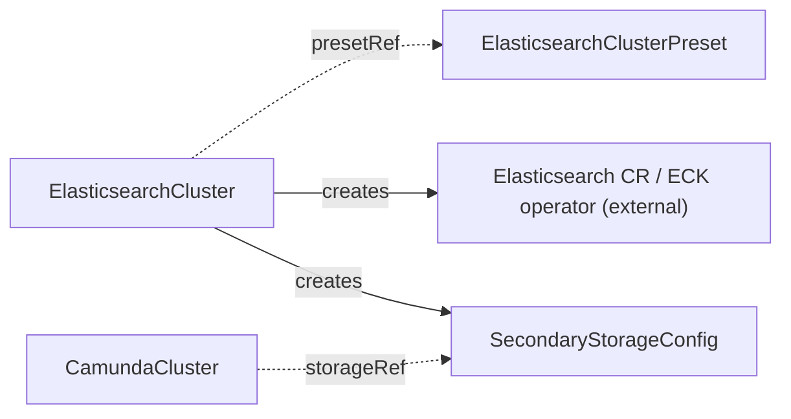

# ElasticsearchCluster

Manages the full lifecycle of an Elasticsearch cluster for use as secondary storage, deployed through the ECK operator.

## Purpose

`ElasticsearchCluster` provisions and operates an Elasticsearch cluster by creating an ECK `Elasticsearch` custom resource, monitoring its health, and publishing the connection details as a `SecondaryStorageConfig` contract CRD with auto-generated credentials.
The ECK (Elastic Cloud on Kubernetes) operator is an external prerequisite: this operator never deploys Elasticsearch workloads itself, it only manages the ECK CR that does.
You create this CR directly, or a composition layer above may create it on your behalf.
`ElasticsearchCluster` has an independent lifecycle: it never references a `CamundaCluster`, and no `CamundaCluster` references it directly — the two meet only through the `SecondaryStorageConfig` contract.
Camunda 8.9 also supports OpenSearch and RDBMS as secondary storage, but this CRD manages Elasticsearch only; for an RDBMS backend see [Database](database.md).

!!! note "Deviation from the original proposal"
    The proposal included an optional `eckResourceName` field to adopt a pre-existing ECK CR during migration.
    This operator is a clean slate with no migration path, so the field does not exist: the ECK CR name is always derived from the `ElasticsearchCluster` name.

## How it works

1. The operator resolves `spec.presetRef` to an `ElasticsearchClusterPreset` if set, then applies any pointer fields set inline on the spec as overrides; a field set on this CR replaces the preset's value for that field wholesale, and `scheduling` in particular replaces the preset's scheduling block entirely rather than merging.
2. It renders an ECK `Elasticsearch` CR (named after this CR) from the resolved configuration — version, node count, resources, storage — and applies it with Server-Side Apply (SSA) under the per-component field manager `ElasticsearchCluster/elasticsearch`.
3. It labels the Elasticsearch pods and data PVCs with `camunda.io/cluster: <this CR's name>` and `camunda.io/component: elasticsearch` through the ECK pod and volume claim templates, so extensions such as `PVCAutoResize` can discover them.
4. When `spec.serviceAccount` is set, it creates a dedicated ServiceAccount named `<name>-es` with `spec.serviceAccount.annotations`. It points the Elasticsearch pods at that ServiceAccount through the ECK podTemplate. The nodes then have the workload identity (IRSA, GCP Workload Identity, and more) that grants access to the snapshot bucket for backups. The `CamundaCluster` controller registers the snapshot repository itself inside Elasticsearch through the Elasticsearch API, authenticated with the `SecondaryStorageConfig` credentials. The bucket access of the Elasticsearch nodes comes from this workload identity.
5. It provisions a dedicated Camunda user through ECK's file realm, generates credentials for it, and stores them in a Secret it owns. The user carries the `superuser` role for now: snapshot-repository registration (done by the `CamundaCluster` controller with these credentials) needs cluster-manage rights, and narrowing to a dedicated role is deliberately deferred until that flow lands.
6. It creates and keeps current a `SecondaryStorageConfig` named `spec.secondaryStorageConfig` in this CR's own namespace, with `type: elasticsearch`, the in-cluster HTTPS endpoint of the ECK-managed service, a reference to the generated credentials Secret, and a `caSecretRef` pointing at the ECK-generated CA certificate Secret so consumers can verify the cluster's self-signed HTTPS endpoint.
7. It watches the ECK CR's health and reflects it in this CR's conditions.
8. When `spec.suspend: true`, it scales the ECK node set to zero and reports the `Suspended` condition; a composition layer above may suspend both a `CamundaCluster` and its `ElasticsearchCluster` through its own fields, but neither controls the other.
9. On deletion, the ECK CR, the credentials Secret, the `SecondaryStorageConfig`, and the optional ServiceAccount and ServiceMonitor are all garbage-collected through their owner references. No finalizer is needed.



## API reference

```yaml
apiVersion: core.camunda.io/v1
kind: ElasticsearchCluster
metadata:
  name: my-cluster-es
  namespace: my-cluster-ns
spec:
  # string. Optional. Name of a cluster-scoped ElasticsearchClusterPreset used as the configuration baseline; fields set below override it.
  presetRef: "standard"
  # string. Required unless the resolved preset provides it. Elasticsearch version to deploy; Camunda 8.9 supports 8.19+ and 9.2+.
  version: "9.2.4"
  # integer. Required unless the resolved preset provides it. Number of Elasticsearch nodes.
  replicas: 3
  # object (corev1.ResourceRequirements). Optional. CPU and memory for each Elasticsearch node.
  resources:
    requests: { cpu: "1", memory: "2Gi" }
    limits: { memory: "2Gi" }
  # string (resource quantity). Required unless the resolved preset provides it. Size of each node's data volume.
  storageSize: "64Gi"
  # string. Optional, default: the cluster's default StorageClass. StorageClass for the data volumes.
  storageClassName: "ssd"
  # object. Optional. ServiceAccount settings for the Elasticsearch pods. When set, the operator creates a dedicated ServiceAccount named <name>-es and points the pods at it through the ECK podTemplate.
  serviceAccount:
    # map[string]string. Optional. Annotations for workload identity (IRSA, GCP Workload Identity, ...); required for Elasticsearch to access the snapshot bucket for backups.
    annotations:
      eks.amazonaws.com/role-arn: "arn:aws:iam::123456789012:role/my-es-snapshot-role"
  # list (corev1.EnvVar). Optional. Extra environment variables for every Elasticsearch node.
  extraEnv: []
  # list (corev1.EnvFromSource). Optional. Extra environment sources (ConfigMaps, Secrets) for every node.
  extraEnvFrom: []
  # map[string]string. Optional. Extra labels applied to the Elasticsearch pods.
  podLabels: {}
  # map[string]string. Optional. Extra annotations applied to the Elasticsearch pods.
  podAnnotations: {}
  # object. Optional. Scheduling constraints for the Elasticsearch pods; when set, replaces the preset's scheduling block entirely (no merge).
  scheduling:
    # object (corev1.NodeAffinity). Optional. Node affinity rules.
    nodeAffinity: {}
    # object (corev1.PodAffinity). Optional. Pod affinity rules.
    podAffinity: {}
    # list (corev1.Toleration). Optional. Tolerations for the pods.
    tolerations: []
  # string. Required. Name of the SecondaryStorageConfig the operator creates in this CR's own namespace with the connection details and generated credentials.
  secondaryStorageConfig: "my-storage-config"
  # object. Optional. Prometheus scraping integration.
  monitoring:
    serviceMonitor:
      # boolean. Optional, default: false. Create a ServiceMonitor for the Elasticsearch service. It requires the prometheus-operator ServiceMonitor CRD. On a cluster without that CRD the resource is omitted.
      enabled: true
      # map[string]string. Optional. Extra labels applied to the ServiceMonitor.
      labels: {}
      # map[string]string. Optional. Extra annotations applied to the ServiceMonitor.
      annotations: {}
  # boolean. Optional, default: false. Scale the Elasticsearch node set to zero while keeping all data volumes.
  suspend: false
```

## Status

| Type | Reason | Meaning |
| --- | --- | --- |
| `Ready` | `Healthy` | The ECK-managed Elasticsearch cluster reports healthy and the `SecondaryStorageConfig` is in place. |
| `Ready` | `Progressing` | The ECK CR is applied but Elasticsearch has not yet reached a healthy state. |
| `Ready` | `InvalidReference` | `spec.presetRef` does not resolve to an existing `ElasticsearchClusterPreset`. |
| `Ready` | `Suspended` | The cluster is suspended and intentionally not serving. |
| `Suspended` | `Suspended` | `spec.suspend: true` and the node set is scaled to zero. |

The operator records the last reconciled generation in `status.observedGeneration`.

The per-component conditions `CredentialsReady`, `ElasticsearchReady`, and `StorageContractReady` also appear in `status.conditions`. They use the reason vocabulary of the component framework and give per-component operational detail beneath the aggregate `Ready`.

## Validation

- When `spec.presetRef` is unset, `version`, `replicas`, and `storageSize` must be set inline; with a preset, the merged result must contain them.
- `spec.version` must be a version supported by Camunda 8.9: Elasticsearch 8.19+ or 9.2+.
- `spec.storageSize` must not shrink: Elasticsearch data volumes cannot be reduced in place. Lowering an inline `storageSize` relative to its previous inline value is rejected at admission; a shrink relative to a preset-provided baseline (for example, setting an inline value below the preset's after having relied on the preset) cannot be checked at admission and surfaces as `Ready: False` from the controller instead.
- `spec.secondaryStorageConfig` must be a valid resource name.

!!! note "Deviation from the original proposal"
    The proposal's examples used Elasticsearch 8.16/8.17, which are below Camunda 8.9's minimum of 8.19.
    Verified against the Camunda 8.9 supported-environments matrix: the Orchestration Cluster requires Elasticsearch 8.19+ or 9.2+, and 9.2+ is the recommended line for new deployments.

## Relationships

- [ElasticsearchClusterPreset](elasticsearchclusterpreset.md) — optional configuration baseline referenced via `presetRef`.
- [Database](database.md) — the peer storage backend controller for RDBMS secondary storage; an orchestration cluster uses one or the other.
- [SecondaryStorageConfig](secondarystorageconfig.md) — created and kept current by this controller under the name in `spec.secondaryStorageConfig`.
- [CamundaCluster](camundacluster.md) — consumes the created [SecondaryStorageConfig](secondarystorageconfig.md) via its `storageRef`; it never references this CR directly. Its controller registers the backup snapshot repository inside this Elasticsearch through the Elasticsearch API, while the nodes' access to the snapshot bucket flows from the workload identity configured via `spec.serviceAccount.annotations` here.
- [PVCAutoResize](pvcautoresize.md) — never references this CR directly; the operator locates this ElasticsearchCluster as the producer of the consuming cluster's [SecondaryStorageConfig](secondarystorageconfig.md) (following the [CamundaCluster](camundacluster.md)'s `storageRef`) and patches the auto-resize annotations on the Elasticsearch data PVCs.

The ECK operator is an external prerequisite that reconciles the `Elasticsearch` CR this controller creates.

## Examples

A minimal manifest:

```yaml
apiVersion: core.camunda.io/v1
kind: ElasticsearchCluster
metadata:
  name: my-cluster-es
  namespace: my-cluster-ns
spec:
  presetRef: "standard"
  secondaryStorageConfig: "my-storage-config"
```

A realistic manifest:

```yaml
apiVersion: core.camunda.io/v1
kind: ElasticsearchCluster
metadata:
  name: my-cluster-es
  namespace: my-cluster-ns
spec:
  version: "9.2.4"
  replicas: 3
  resources:
    requests: { cpu: "2", memory: "4Gi" }
    limits: { memory: "4Gi" }
  storageSize: "128Gi"
  storageClassName: "ssd"
  podLabels:
    team: platform
  scheduling:
    tolerations:
      - key: dedicated
        operator: Equal
        value: elasticsearch
        effect: NoSchedule
  secondaryStorageConfig: "my-storage-config"
  monitoring:
    serviceMonitor:
      enabled: true
      labels:
        release: prometheus
  suspend: false
```
