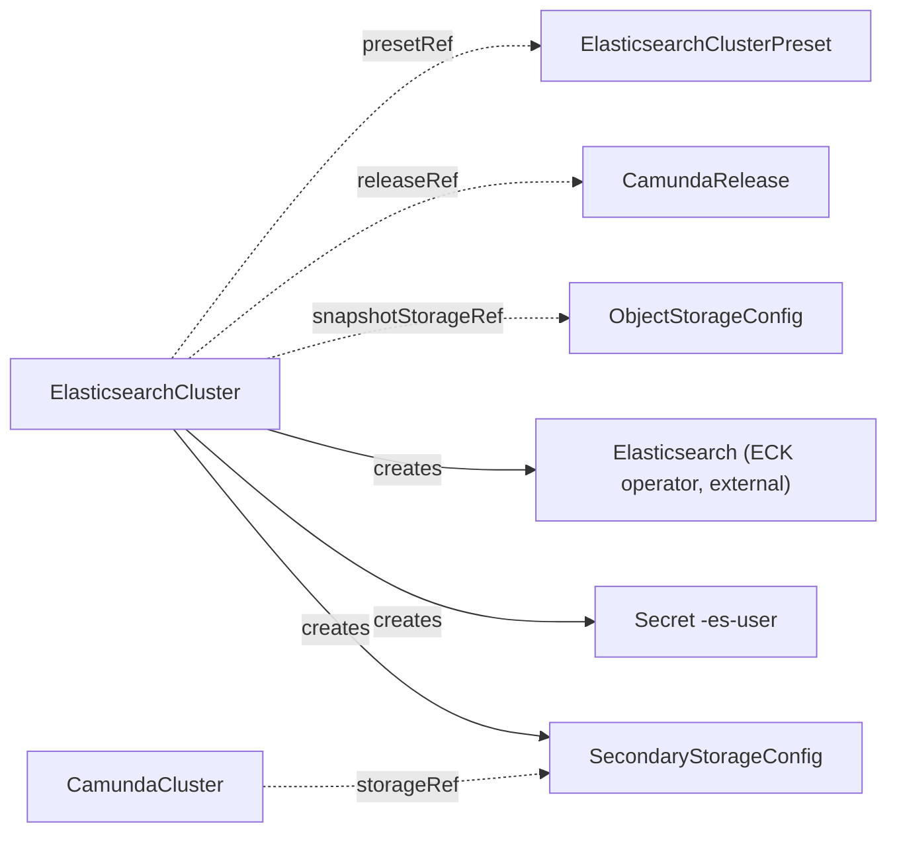

# ElasticsearchCluster

`ElasticsearchCluster` runs an Elasticsearch cluster for secondary storage through the ECK operator (Elastic Cloud on Kubernetes). You create it, or another tool creates it for you.

The operator does not run Elasticsearch itself. It creates an ECK `Elasticsearch` resource named `<name>`, and the ECK operator runs the nodes. Install ECK before you start the operator. The operator looks for the ECK CRDs only when it starts, so if you install ECK later, restart the operator.

Use this kind when you want the operator to own the Elasticsearch cluster, its credentials, and its snapshot repository. If you want PostgreSQL as secondary storage, use [Database](database.md) instead. An `ElasticsearchCluster` never references a `CamundaCluster`. The two meet only through the `SecondaryStorageConfig` that `spec.secondaryStorageConfig` names. The operator creates that [contract](index.md#contracts) in the same namespace, and it carries:

- The HTTPS endpoint `https://<name>-es-http.<namespace>.svc:9200`.
- The user `camunda`, in the Secret `<name>-es-user` (keys `username` and `password`).
- The CA of the self-signed certificate, in the Secret `<name>-es-http-certs-public` (key `ca.crt`).
- The node count, as `nodeCount`. Consumers take their default index replica count from it, so a one-node cluster stays green. [Node count](secondarystorageconfig.md#node-count) has the rule.
- `snapshotRepository`, once a repository is registered.

The Elasticsearch pods and their data volumes carry the labels `camunda.io/elasticsearch-cluster: <name>` and `camunda.io/component: elasticsearch`.

The smallest cluster names a preset, a release, and the storage contract to create:

```yaml
apiVersion: core.camunda.io/v1
kind: ElasticsearchCluster
metadata:
  name: my-cluster-es
  namespace: my-cluster-ns
spec:
  presetRef: "standard"
  releaseRef: "camunda-8-9-4"
  secondaryStorageConfig: "my-storage-config"
```


```mermaid
graph LR
    ESC[ElasticsearchCluster] -.->|presetRef| ESCP[ElasticsearchClusterPreset]
    ESC -.->|releaseRef| CR[CamundaRelease]
    ESC -.->|snapshotStorageRef| OSC[ObjectStorageConfig]
    ESC -->|creates| ECK["Elasticsearch (ECK operator, external)"]
    ESC -->|creates| SEC["Secret <name>-es-user"]
    ESC -->|creates| SSC[SecondaryStorageConfig]
    CC[CamundaCluster] -.->|storageRef| SSC
```

## Preset and release

Three layers make the configuration of a cluster. Each later layer wins over the one before it:

1. The [ElasticsearchClusterPreset](elasticsearchclusterpreset.md) that `spec.presetRef` names holds the shape: the node count, the volume size, the resources.
2. The [CamundaRelease](camundarelease.md) that `spec.releaseRef` names holds the version, in `spec.elasticsearch.version`.
3. The `ElasticsearchCluster` itself holds what belongs to this one cluster, and it overrides both.

A field set on the `ElasticsearchCluster` replaces the value of the layer below for that field. An object, a list, or a map is replaced as a whole. [Merge rules](elasticsearchclusterpreset.md#merge-rules) has the details. An edit of the preset or the release reaches every cluster that references it.

A preset rejects `version`. A cluster that follows a fleet version leaves `spec.version` unset and names a release. A cluster that must move before the fleet does sets `spec.version`, which wins over the release.

## Version

`spec.version` is the Elasticsearch version, as three segments. Camunda 8.9 supports Elasticsearch 8.19 and later, or 9.2 and later. A merged version below that floor gives `Ready: False` with reason `InvalidReference`.

```yaml
apiVersion: core.camunda.io/v1
kind: ElasticsearchCluster
metadata:
  name: my-cluster-es
  namespace: my-cluster-ns
spec:
  version: "9.2.8"
  # ... the rest of your cluster
```

## Storage

You can increase `spec.storageSize` at any time. You cannot decrease it. The API server rejects a lower inline value. If a preset lowers the size under a running cluster, the operator keeps the current size and records a Warning event with reason `StorageShrinkIgnored`. To get a smaller volume, delete and recreate the cluster.

## Snapshot repository

Set `spec.snapshotStorageRef` to an `ObjectStorageConfig` to take part in backups. Use the bucket that the `CamundaCluster` references in its `backupStorageRef`.

```yaml
apiVersion: core.camunda.io/v1
kind: ElasticsearchCluster
metadata:
  name: my-cluster-es
  namespace: my-cluster-ns
spec:
  snapshotStorageRef: "my-backup-bucket"
  # ... the rest of your cluster
```

The operator registers the snapshot repository `<namespace>.<name>` in Elasticsearch. The snapshots go under `<basePath>/<namespace>/<name>` in the bucket, where `<basePath>` comes from the `ObjectStorageConfig`. Because the name carries the namespace, two clusters of one name in two namespaces never share a repository. The operator gives the nodes the credentials or the workload identity of the bucket.

`SnapshotRepositoryReady` reports the registration. After it succeeds, `status.snapshotRepository` and the `snapshotRepository` field of the `SecondaryStorageConfig` carry the name. Until then, both are empty, and the `CamundaCluster` cannot take backups.

For an `AzureBlob` bucket, the endpoint must have the form `https://<account>.blob.<suffix>`, without a port or a path. Otherwise `Ready` reports `InvalidReference`.

## Credentials

The operator generates the password of the user `camunda` once and keeps it. To rotate it, delete the Secret `<name>-es-user`. The operator then generates a new password and publishes it in a new Secret. The `CamundaCluster` that uses the contract restarts its pods with the new password.

## Monitoring

Elasticsearch serves no Prometheus endpoint itself. With monitoring on, the operator runs the Prometheus `elasticsearch_exporter` in the Deployment `<name>-es-exporter`. It also creates the ServiceMonitor `<name>-es-metrics` when the Kubernetes cluster serves that kind. `MetricsReady` reports the exporter, and it is not part of `Ready`.

```yaml
apiVersion: core.camunda.io/v1
kind: ElasticsearchCluster
metadata:
  name: my-cluster-es
  namespace: my-cluster-ns
spec:
  monitoring:
    serviceMonitor:
      enabled: true
      labels:
        release: prometheus
  # ... the rest of your cluster
```

## Suspend

With `spec.suspend: true`, the operator deletes the ECK resource and keeps the data volumes. `Ready` is `True` with reason `Suspended`. The exporter stops as well, and `MetricsReady` reports `Suspended`. When you set `spec.suspend` back to `false`, the operator recreates the resource and ECK reattaches the volumes.

## Deletion

Deletion removes everything the operator created: the ECK resource, the Secrets, the `SecondaryStorageConfig`, and the exporter. The data volumes obey `spec.persistentVolumeClaimRetentionPolicy.whenDeleted`. With `Delete`, ECK removes them with the cluster. With `Retain`, the volumes stay and a later cluster with the same name reattaches them.

## Status

`kubectl get elasticsearchcluster` shows `Ready`, its reason, the Elasticsearch version, and the age.

| Type | Reason | Meaning | What to do |
| --- | --- | --- | --- |
| `Ready` | `ECKNotInstalled` | The ECK CRDs were not installed when the operator started. The operator does not create the ECK resource, the Secrets, or the `SecondaryStorageConfig`. | Install ECK, then restart the operator. |
| `Ready` | `InvalidReference` | `spec.presetRef`, `spec.releaseRef`, or `spec.snapshotStorageRef` names a resource that does not exist, or the merged spec lacks `version`, `replicas`, or `storageSize`. Or the version is below the floor, the bucket has settings that Elasticsearch cannot use, or a ServiceAccount with `create: false` does not exist. | Read the message. Create the missing resource, or fix the field it names. |
| `Ready` | `MissingSecret` | A Secret or a key does not exist. The message names it. It is a Secret that the bucket of `spec.snapshotStorageRef` names, or a Secret that ECK creates with the cluster: `<name>-es-elastic-user` or `<name>-es-http-certs-public`. | For a Secret of the bucket, create it with the keys that the `ObjectStorageConfig` names. For a Secret of ECK, wait. ECK creates it when the cluster starts. |
| `Ready` | `Suspended` | `Ready` is `True`. The cluster is suspended by `spec.suspend: true`. The data volumes stay. | Nothing. To serve again, set `spec.suspend: false`. To wait for a serving cluster, require `Ready=True` and a reason other than `Suspended`. |
| `Ready` | `ConnectionFailed` | The components are healthy, but the snapshot repository is not registered. See `SnapshotRepositoryReady`. | Read the message of `SnapshotRepositoryReady`. Make sure that the bucket and its credentials are correct. The operator retries on its own. |
| `Ready` | component status | `Ready` is `True` only when every component is `True`. The reason comes from the component that is not ready, for example `Creating` or `Updating` (also yellow health), `Failing` (also red health), or `Error`. The [grace period](../architecture.md#status-conventions) of the cluster is 30 minutes by default. After it, a cluster that is not ready reports `Degraded` on yellow health, and `Down` on red or no health. The message names the component. | Wait while the reason is `Creating` or `Updating`. For other reasons, read the component condition and the ECK resource `<name>`. If yellow health stays, find the Warning event `IndexReplicasExceedNodes` on the `CamundaCluster` or `CamundaOptimize` that writes here. That consumer asks for more index replicas than the nodes can hold. |
| `CredentialsReady`, `KeystoreReady`, `ElasticsearchReady`, `StorageContractReady` | component status | The detail of each component that makes up `Ready`. `KeystoreReady` is `Disabled` unless the bucket needs keystore entries. | Read the message of the component that is not `True`. |
| `SnapshotRepositoryReady` | `Healthy` | The snapshot repository `<namespace>.<name>` is registered. The condition is absent when `spec.snapshotStorageRef` is unset. | Nothing. |
| `SnapshotRepositoryReady` | `ConnectionFailed` | Elasticsearch did not answer, or it rejected the registration. `Ready` is `False` while this holds. | Make sure that the bucket, its credentials, and the identity of the pods are correct. |
| `SnapshotRepositoryReady` | `MissingSecret` | The `elastic` user Secret or the CA Secret of ECK does not exist yet. | Wait. ECK creates them with the cluster. |
| `MetricsReady` | component status | The exporter. It is not part of `Ready`. It is `Disabled` while monitoring is off and `Suspended` while the cluster is suspended. When the exporter is still not ready at the end of its grace period, 30 minutes by default, the reason is `Degraded` or `Down`. | Read the exporter Deployment `<name>-es-exporter` when it is `Failing`, `Degraded`, or `Down`. |

```yaml
status:
  version: "9.2.4"
  snapshotRepository: my-cluster-ns.my-cluster-es
  volumes:
    - name: elasticsearch-data-my-cluster-es-es-default-0
      capacity: 64Gi
  conditions:
    - type: Ready
      status: "True"
      reason: Healthy
    - type: SnapshotRepositoryReady
      status: "True"
      reason: Healthy
      message: snapshot repository "my-cluster-ns.my-cluster-es" is registered
```

`status.version` is the Elasticsearch version that runs, from the cluster, the release, or the preset. It is empty until the operator resolves the references of the cluster.

`status.snapshotRepository` is the registered snapshot repository. It is empty without `spec.snapshotStorageRef`, and until the first registration succeeds.

`status.volumes` lists the bound data PersistentVolumeClaims, sorted by name, each with `name` and `capacity`. The claims can differ in size when a claim was resized outside the spec.

`status.observedGeneration` is the last generation that the operator reconciled.

## Spec reference

Every field, with its type, whether it is required, and its default:

```yaml
apiVersion: core.camunda.io/v1
kind: ElasticsearchCluster
metadata:
  name: my-cluster-es
  namespace: my-cluster-ns
spec:
  # string. Optional. Name of a cluster-scoped ElasticsearchClusterPreset that is the baseline. A field set here replaces the value of the preset.
  presetRef: "standard"
  # string. Optional. Name of a cluster-scoped CamundaRelease that supplies the version. It wins over the preset and loses to this spec.
  releaseRef: "camunda-8-9-4"
  # string. Required unless the release provides it. Elasticsearch version as three segments. Camunda 8.9 supports 8.19+ and 9.2+. Rejected in a preset.
  version: "9.2.4"
  # integer. Required unless the preset provides it. Number of Elasticsearch nodes, at least 1.
  replicas: 3
  # object (corev1.ResourceRequirements). Optional. CPU and memory of each Elasticsearch node.
  resources:
    requests: { cpu: "1", memory: "2Gi" }
    limits: { memory: "2Gi" }
  # string (resource quantity). Required unless the preset provides it. Size of the data volume of each node. It can grow but not shrink.
  storageSize: "64Gi"
  # string. Optional, default: the default StorageClass of the Kubernetes cluster. StorageClass of the data volumes.
  storageClassName: "ssd"
  # string. Optional. Name of an ObjectStorageConfig in this namespace that holds the snapshot bucket. Set it to take part in backups. It must be the bucket that the CamundaCluster references.
  snapshotStorageRef: "my-backup-bucket"
  # object. Optional. ServiceAccount of the Elasticsearch pods. The operator creates one when this block is set, or when the snapshot bucket uses workload identity.
  serviceAccount:
    # string. Optional, default: <name>-es. Name of the ServiceAccount. A workload identity without an annotation binds the principal system:serviceaccount:<namespace>:<name>.
    name: "my-cluster-es"
    # boolean. Optional, default: true. With false, you manage the ServiceAccount. The operator does not create, annotate, or own it, and a missing one fails Ready.
    create: true
    # map[string]string. Optional. Annotations for workload identity (IRSA, GCP Workload Identity). A value set here wins over the one the operator derives from the bucket.
    annotations:
      eks.amazonaws.com/role-arn: "arn:aws:iam::123456789012:role/my-es-snapshot-role"
  # list of objects. Optional. Secrets that ECK loads into the keystore of every node. The bucket credentials are added by the operator, so this is for other keystore entries.
  secureSettings:
    - # string. Required. Name of the Secret, in the namespace of this resource.
      secretName: extra-keystore-entries
      # list of objects. Optional. Maps single keys to keystore entries. An empty list loads every key under its own name.
      entries:
        - # string. Required. Key in the Secret.
          key: someKey
          # string. Required. Keystore entry that the key becomes.
          path: some.secure.setting
  # list (corev1.EnvVar). Optional. Extra environment variables for every Elasticsearch node.
  extraEnv: []
  # list (corev1.EnvFromSource). Optional. Extra environment sources (ConfigMaps, Secrets) for every node.
  extraEnvFrom: []
  # map[string]string. Optional. Extra labels on the Elasticsearch pods.
  podLabels: {}
  # map[string]string. Optional. Extra annotations on the Elasticsearch pods.
  podAnnotations: {}
  # object. Optional. Scheduling constraints of the Elasticsearch pods. When set, it replaces the whole scheduling block of the preset.
  scheduling:
    # object (corev1.NodeAffinity). Optional. Node affinity rules.
    nodeAffinity: {}
    # object (corev1.PodAffinity). Optional. Pod affinity rules.
    podAffinity: {}
    # list (corev1.Toleration). Optional. Tolerations of the pods.
    tolerations: []
  # string. Required. Name of the SecondaryStorageConfig that the operator creates in this namespace.
  secondaryStorageConfig: "my-storage-config"
  # object. Optional. Prometheus scraping. A block set here replaces the whole monitoring block of the preset.
  monitoring:
    serviceMonitor:
      # boolean. Optional, default: false. Runs the elasticsearch_exporter and creates a ServiceMonitor. Without the prometheus-operator CRD the exporter still runs and the ServiceMonitor is omitted.
      enabled: true
      # map[string]string. Optional. Extra labels on the ServiceMonitor.
      labels: {}
      # map[string]string. Optional. Extra annotations on the ServiceMonitor.
      annotations: {}
    exporter:
      # string. Optional, default: the quay.io/prometheuscommunity/elasticsearch-exporter release that the operator pins. Exporter image.
      image: ""
      # object (corev1.ResourceRequirements). Optional. CPU and memory of the exporter container.
      resources: {}
  # object. Optional. What happens to the data volumes when this resource is deleted. Suspension always keeps them.
  persistentVolumeClaimRetentionPolicy:
    # string (Retain | Delete). Optional, default: Delete. Delete removes the data volumes with the cluster. Retain keeps them, and a later cluster with the same name reattaches them.
    whenDeleted: Delete
  # boolean. Optional, default: false. Stops the cluster and keeps its data volumes. Set it back to false to start the cluster again.
  suspend: false
```

### Validation rules

- `spec.secondaryStorageConfig` is required.
- `spec.storageSize` cannot shrink. The API server rejects a value that is lower than the previous inline value.
- `spec.version` must have three segments (`9.2.4`, not `9.2`). The operator then requires Elasticsearch 8.19+ or 9.2+ on the merged spec.
- `spec.replicas` must be at least 1.
- `version`, `replicas`, and `storageSize` must be present after the merge. Set them inline, or take `replicas` and `storageSize` from a preset and `version` from a release. The operator enforces this rule, not the API server.
- `spec.secondaryStorageConfig`, `spec.snapshotStorageRef`, and `spec.serviceAccount.name` must be valid resource names.
- `spec.persistentVolumeClaimRetentionPolicy.whenDeleted` must be `Retain` or `Delete`.

### A production-shaped example

```yaml
apiVersion: core.camunda.io/v1
kind: ElasticsearchCluster
metadata:
  name: my-cluster-es
  namespace: my-cluster-ns
spec:
  version: "9.2.4"
  replicas: 3
  resources:
    requests: { cpu: "2", memory: "4Gi" }
    limits: { memory: "4Gi" }
  storageSize: "128Gi"
  storageClassName: "ssd"
  snapshotStorageRef: "my-backup-bucket"
  podLabels:
    team: platform
  scheduling:
    tolerations:
      - key: dedicated
        operator: Equal
        value: elasticsearch
        effect: NoSchedule
  secondaryStorageConfig: "my-storage-config"
  monitoring:
    serviceMonitor:
      enabled: true
      labels:
        release: prometheus
  persistentVolumeClaimRetentionPolicy:
    whenDeleted: Retain
```

## Related

- [ElasticsearchClusterPreset](elasticsearchclusterpreset.md): the baseline that `spec.presetRef` names.
- [CamundaRelease](camundarelease.md): the version that `spec.releaseRef` names.
- [ObjectStorageConfig](objectstorageconfig.md): the snapshot bucket that `spec.snapshotStorageRef` names.
- [SecondaryStorageConfig](secondarystorageconfig.md): the contract that this kind creates under `spec.secondaryStorageConfig`.
- [CamundaCluster](camundacluster.md): references the `SecondaryStorageConfig` through `storageRef`. It must reference the same `ObjectStorageConfig` through `backupStorageRef`.
- [Database](database.md): the other secondary storage kind. An orchestration cluster uses one or the other.
- [Secondary storage guide](../guides/secondary-storage.md): how to choose and connect secondary storage.
- [Backup guide](../guides/backup.md): how the snapshot repository takes part in backups.
- [Operations guide](../guides/operations.md): suspend, resize, and rotate credentials.
- [Getting started](../getting-started.md): the first cluster, end to end.
