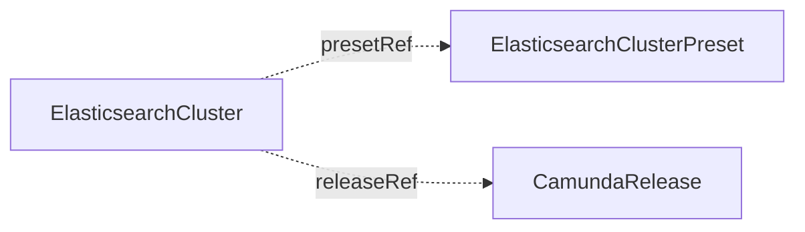

# ElasticsearchClusterPreset

`ElasticsearchClusterPreset` is a cluster-scoped baseline configuration for `ElasticsearchCluster` resources. You create it, or another tool creates it for you.

A preset holds one Elasticsearch sizing as data: node count, resources, storage, scheduling, and more. Each `ElasticsearchCluster` that references it stays small and consistent. A platform team can publish a set of presets, for example `small`, `standard`, and `large`, and each team picks one. What runs on that shape, the Elasticsearch version, lives in a [CamundaRelease](camundarelease.md), so a version roll never edits a preset.

A preset is passive data. It creates nothing and reports no status. An `ElasticsearchCluster` uses it through `spec.presetRef`.

The smallest preset sets a node count and a volume size:

```yaml
apiVersion: core.camunda.io/v1
kind: ElasticsearchClusterPreset
metadata:
  name: standard
spec:
  cluster:
    replicas: 3
    storageSize: "64Gi"
```



## Merge rules

`spec.cluster` of the preset is the baseline. The [CamundaRelease](camundarelease.md) of `releaseRef` merges over it, and the cluster spec merges over both. A field set on the `ElasticsearchCluster` replaces the value of the layer below for that field. A field left unset on the cluster comes from the layer below. An empty list or map (`extraEnv`, `extraEnvFrom`, `podLabels`, `podAnnotations`, `secureSettings`) counts as unset. To remove a list that the preset provides, set the list you want on the cluster, or reference a preset without it.

The blocks `scheduling`, `monitoring`, `serviceAccount`, `resources`, and `persistentVolumeClaimRetentionPolicy` are replaced as a whole, never merged field by field. A cluster that sets its own `scheduling` block drops every scheduling rule of the preset.

`version` is not part of a preset. It belongs to a [CamundaRelease](camundarelease.md) or to the cluster. An apply that sets it is rejected by the API server with `version belongs to a CamundaRelease and must not be set in a preset`. Move the version to a release, and point every cluster at it with `releaseRef`.

## Fleet settings

A preset can set `snapshotStorageRef`, `serviceAccount`, `secureSettings`, and `monitoring`. A preset alone can put every cluster that references it on one snapshot bucket. It can also give each cluster its `<name>-es` ServiceAccount and turn on metrics scraping.

## Changes

An edit of a preset reaches every `ElasticsearchCluster` that references it. A lower `storageSize` in the preset does not shrink a running cluster. That cluster keeps its current size and records a Warning event with reason `StorageShrinkIgnored`. A new cluster uses the new baseline.

## Deletion

Deleting a preset removes no cluster. Each `ElasticsearchCluster` that references it reports `Ready` `False` with reason `InvalidReference`.

## Status

A preset has no status. It reports no conditions and no `status.observedGeneration`. A problem with a preset shows on the `Ready` condition of the `ElasticsearchCluster` that references it. Examples are a `presetRef` that names no preset, or a merge that lacks a required field.

## Spec reference

`spec.cluster` has the same type as the spec of `ElasticsearchCluster`. The fields `presetRef`, `releaseRef`, `secondaryStorageConfig`, and `suspend` belong to one cluster and must stay unset in a preset, and so must `version`. Every other field is inheritable.

Every field, with its type, whether it is required, and its default:

```yaml
apiVersion: core.camunda.io/v1
kind: ElasticsearchClusterPreset
metadata:
  name: standard
spec:
  # object (ElasticsearchCluster spec type). Required. The baseline that clusters inherit.
  cluster:
    # integer. Optional. Number of Elasticsearch nodes, at least 1.
    replicas: 3
    # object (corev1.ResourceRequirements). Optional. CPU and memory of each Elasticsearch node.
    resources:
      requests: { cpu: "1", memory: "2Gi" }
      limits: { memory: "2Gi" }
    # string (resource quantity). Optional. Size of the data volume of each node.
    storageSize: "64Gi"
    # string. Optional, default: the default StorageClass of the Kubernetes cluster. StorageClass of the data volumes.
    storageClassName: "ssd"
    # string. Optional. Name of an ObjectStorageConfig in the namespace of each cluster that holds the snapshot bucket. See ElasticsearchCluster.
    snapshotStorageRef: "my-backup-bucket"
    # list of objects. Optional. Secrets that ECK loads into the keystore of every node. See ElasticsearchCluster.
    secureSettings: []
    # list (corev1.EnvVar). Optional. Extra environment variables for every Elasticsearch node.
    extraEnv: []
    # list (corev1.EnvFromSource). Optional. Extra environment sources (ConfigMaps, Secrets) for every node.
    extraEnvFrom: []
    # map[string]string. Optional. Extra labels on the Elasticsearch pods.
    podLabels: {}
    # map[string]string. Optional. Extra annotations on the Elasticsearch pods.
    podAnnotations: {}
    # object. Optional. Scheduling constraints. A cluster that sets its own scheduling block replaces this one as a whole.
    scheduling:
      # object (corev1.NodeAffinity). Optional. Node affinity rules.
      nodeAffinity: {}
      # object (corev1.PodAffinity). Optional. Pod affinity rules.
      podAffinity: {}
      # list (corev1.Toleration). Optional. Tolerations of the pods.
      tolerations: []
    # object. Optional. ServiceAccount of the Elasticsearch pods. See ElasticsearchCluster.
    serviceAccount:
      # string. Optional, default: <cluster name>-es. Name of the ServiceAccount.
      name: ""
      # boolean. Optional, default: true. With false, you manage the ServiceAccount.
      create: true
      # map[string]string. Optional. Annotations for workload identity.
      annotations: {}
    # object. Optional. Prometheus scraping. A cluster that sets its own monitoring block replaces this one as a whole.
    monitoring:
      serviceMonitor:
        # boolean. Optional, default: false. Runs the elasticsearch_exporter and creates a ServiceMonitor.
        enabled: false
        # map[string]string. Optional. Extra labels on the ServiceMonitor.
        labels: {}
        # map[string]string. Optional. Extra annotations on the ServiceMonitor.
        annotations: {}
      exporter:
        # string. Optional, default: the exporter image that the operator pins. Exporter image.
        image: ""
        # object (corev1.ResourceRequirements). Optional. CPU and memory of the exporter container.
        resources: {}
    # object. Optional. What happens to the data volumes when the cluster is deleted.
    persistentVolumeClaimRetentionPolicy:
      # string (Retain | Delete). Optional, default: Delete. Delete removes the data volumes with the cluster. Retain keeps them.
      whenDeleted: Delete
```

### Validation rules

- `spec.cluster` must not set `presetRef`, `releaseRef`, `secondaryStorageConfig`, or `suspend`. An empty `presetRef` and `suspend: false` count as unset, so templated YAML that renders zero values still applies. An empty `secondaryStorageConfig` is rejected by the name pattern. Omit the field instead.
- `version` is rejected in `spec.cluster`. It belongs to a [CamundaRelease](camundarelease.md) or to the cluster. An empty `version` is rejected by the three-segment pattern. Omit the field instead.
- The no-shrink rule of `ElasticsearchCluster` for `storageSize` does not bind a preset. You can lower the baseline at any time.
- Whether the merged configuration is complete is checked on the `ElasticsearchCluster`, not on the preset.
- Every other rule of the `ElasticsearchCluster` schema applies to `spec.cluster`: `replicas` at least 1, and valid resource names.

### A production-shaped example

```yaml
apiVersion: core.camunda.io/v1
kind: ElasticsearchClusterPreset
metadata:
  name: large
spec:
  cluster:
    replicas: 5
    resources:
      requests: { cpu: "4", memory: "8Gi" }
      limits: { memory: "8Gi" }
    storageSize: "256Gi"
    storageClassName: "ssd"
    snapshotStorageRef: "my-backup-bucket"
    scheduling:
      tolerations:
        - key: dedicated
          operator: Equal
          value: elasticsearch
          effect: NoSchedule
    monitoring:
      serviceMonitor:
        enabled: true
        labels:
          release: prometheus
    persistentVolumeClaimRetentionPolicy:
      whenDeleted: Retain
```

## Related

- [ElasticsearchCluster](elasticsearchcluster.md): references a preset through `spec.presetRef` and inherits `spec.cluster`.
- [CamundaRelease](camundarelease.md): the Elasticsearch version that runs on this shape. It merges between the preset and the cluster.
- [ObjectStorageConfig](objectstorageconfig.md): the snapshot bucket that `spec.cluster.snapshotStorageRef` names.
- [Secondary storage guide](../guides/secondary-storage.md): how to choose and connect secondary storage.
- [Getting started](../getting-started.md): the first cluster, end to end.
