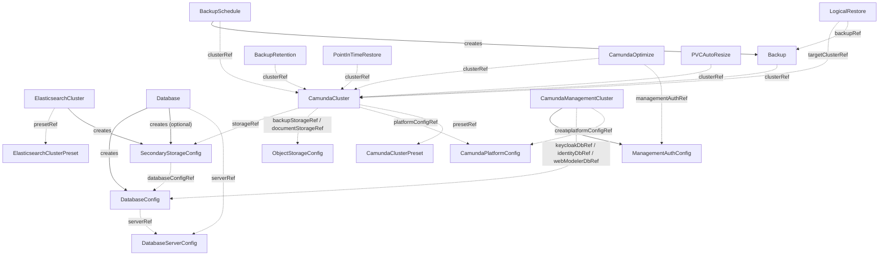

# CRD Overview

The operator defines 19 custom resource definitions: 17 with active controllers and 2 passive preset kinds that carry data for consumers to resolve.
Each CRD has its own reference page following a common structure: purpose, controller behavior, annotated API reference, status conditions, validation rules, relationships, and examples.

## Inventory

| Kind | File | Scope | Controller | Purpose |
| --- | --- | --- | --- | --- |
| CamundaCluster | [camundacluster.md](camundacluster.md) | Namespaced | Active | Core orchestration cluster |
| CamundaPlatformConfig | [camundaplatformconfig.md](camundaplatformconfig.md) | Cluster | Active | Shared OIDC, license, image registry |
| CamundaClusterPreset | [camundaclusterpreset.md](camundaclusterpreset.md) | Cluster | Passive | Standardized cluster sizing |
| ElasticsearchCluster | [elasticsearchcluster.md](elasticsearchcluster.md) | Namespaced | Active | Elasticsearch lifecycle via ECK |
| ElasticsearchClusterPreset | [elasticsearchclusterpreset.md](elasticsearchclusterpreset.md) | Cluster | Passive | Standardized ES sizing |
| Database | [database.md](database.md) | Cluster | Active | Logical database and user bootstrapping |
| DatabaseServerConfig | [databaseserverconfig.md](databaseserverconfig.md) | Cluster | Active (validation) | Contract: database server connection |
| DatabaseConfig | [databaseconfig.md](databaseconfig.md) | Cluster | Active (validation) | Contract: logical database connection |
| SecondaryStorageConfig | [secondarystorageconfig.md](secondarystorageconfig.md) | Cluster | Active (validation) | Contract: secondary storage backend |
| ObjectStorageConfig | [objectstorageconfig.md](objectstorageconfig.md) | Cluster | Active (validation) | Contract: bucket storage |
| ManagementAuthConfig | [managementauthconfig.md](managementauthconfig.md) | Cluster | Active (validation) | Contract: Management Identity OIDC |
| Backup | [backup.md](backup.md) | Namespaced | Active | One backup operation |
| BackupSchedule | [backupschedule.md](backupschedule.md) | Namespaced | Active | Cron-driven Backup creation |
| BackupRetention | [backupretention.md](backupretention.md) | Namespaced | Active | Old-backup deletion |
| PointInTimeRestore | [pointintimerestore.md](pointintimerestore.md) | Namespaced | Active | RDBMS in-place PITR |
| LogicalRestore | [logicalrestore.md](logicalrestore.md) | Namespaced | Active | Cross-cluster restore from a Backup |
| CamundaOptimize | [camundaoptimize.md](camundaoptimize.md) | Namespaced | Active | Optimize deployment per cluster |
| CamundaManagementCluster | [camundamanagementcluster.md](camundamanagementcluster.md) | Cluster | Active | Management plane (Console, Web Modeler, Identity) |
| PVCAutoResize | [pvcautoresize.md](pvcautoresize.md) | Namespaced | Active | topolvm auto-resize annotations |

## Reconciler dependency graph

How the controllers depend on each other through the CRs they produce and consume.
Solid arrows mean "creates/provisions"; dotted arrows mean "reads/references/patches".

## Implementation order

Controller implementation is fanned out in batches derived from the graph above: a controller can only be implemented and tested end-to-end once the contracts it consumes exist.

**Batch A (no dependencies): contract CRD validation controllers.**

- DatabaseServerConfig
- DatabaseConfig
- SecondaryStorageConfig
- ObjectStorageConfig
- ManagementAuthConfig

**Batch B (produce contracts): the storage backend controllers.**

- ElasticsearchCluster
- Database

**Batch C (consume contracts): the core cluster.**

- CamundaCluster
- CamundaPlatformConfig handling

**Batch D (attach to clusters): everything that references a running cluster.**

- Backup
- BackupSchedule
- BackupRetention
- LogicalRestore
- PointInTimeRestore
- CamundaOptimize
- CamundaManagementCluster
- PVCAutoResize
