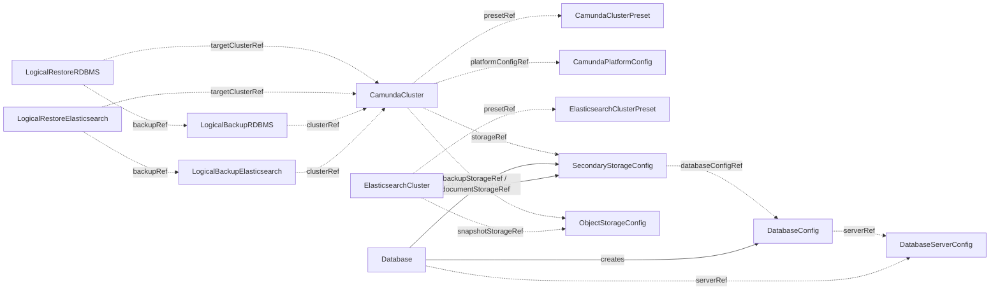

# CRD reference

The operator defines the custom resources below in the API group `core.camunda.io/v1`.
Each page opens with what the kind is and a minimal manifest, then covers one topic per section, and ends with the status conditions and the full spec reference.

## Cluster

| Kind | Scope | What it is |
| --- | --- | --- |
| [CamundaCluster](camundacluster.md) | Namespaced | One orchestration cluster: Zeebe, gateway, web applications, connectors. |
| [CamundaPlatformConfig](camundaplatformconfig.md) | Cluster | Settings shared by all clusters: authentication, license, image registry. |
| [CamundaClusterPreset](camundaclusterpreset.md) | Cluster | A baseline spec that clusters inherit. No controller. |

## Storage backends

| Kind | Scope | What it is |
| --- | --- | --- |
| [ElasticsearchCluster](elasticsearchcluster.md) | Namespaced | An Elasticsearch cluster run by ECK, published as a `SecondaryStorageConfig`. |
| [ElasticsearchClusterPreset](elasticsearchclusterpreset.md) | Cluster | A baseline spec that Elasticsearch clusters inherit. No controller. |
| [Database](database.md) | Cluster | A logical database and its users on an existing PostgreSQL server, published as a `DatabaseConfig`. |

## Contracts

A contract carries connection details and credential references. The operator validates it and reports `Ready`. It provisions nothing from it. You can write a contract by hand or let a resource above write it.

| Kind | Scope | What it carries |
| --- | --- | --- |
| [SecondaryStorageConfig](secondarystorageconfig.md) | Namespaced | The secondary storage of a cluster: Elasticsearch or a relational database. |
| [ObjectStorageConfig](objectstorageconfig.md) | Cluster | One bucket on S3, GCS, or Azure Blob, and how to authenticate. |
| [DatabaseServerConfig](databaseserverconfig.md) | Cluster | A database server, its admin credentials, and its point-in-time-recovery capability. |
| [DatabaseConfig](databaseconfig.md) | Namespaced | One logical database and its credentials. |
| [ManagementAuthConfig](managementauthconfig.md) | Cluster | The OIDC configuration of Management Identity. The operator validates it, but nothing reads it yet. |

## Backup

| Kind | Scope | What it is |
| --- | --- | --- |
| [LogicalBackupElasticsearch](logicalbackupelasticsearch.md) | Namespaced | One backup of a cluster on Elasticsearch. |
| [LogicalBackupRDBMS](logicalbackuprdbms.md) | Namespaced | One backup of a cluster on a relational database. |

## Restore

| Kind | Scope | What it is |
| --- | --- | --- |
| [LogicalRestoreElasticsearch](logicalrestoreelasticsearch.md) | Namespaced | Restore one Elasticsearch backup into one suspended cluster. |
| [LogicalRestoreRDBMS](logicalrestorerdbms.md) | Namespaced | Restore one relational logical backup into a suspended cluster. |
| [PointInTimeRestore](pointintimerestore.md) | Namespaced | Align the Zeebe primary storage of a PostgreSQL cluster with a database restored to a timestamp. |

## How the kinds relate

Solid arrows mean "creates". Dotted arrows mean "references".

## Planned kinds

These CRDs are installed with the operator, but the operator does not act on them yet. Their controllers and their installed spec are placeholders, so do not create them. Their pages describe the planned design and will be rewritten when the kind ships.

| Kind | Scope | Planned purpose |
| --- | --- | --- |
| [BackupSchedule](backupschedule.md) | Namespaced | Create logical backups of a cluster on a cron schedule. |
| [CamundaOptimize](camundaoptimize.md) | Namespaced | Run Optimize next to a cluster. |
| [CamundaManagementCluster](camundamanagementcluster.md) | Cluster | The management plane: Console, Web Modeler, Identity. |
| [PVCAutoResize](pvcautoresize.md) | Namespaced | Grow the volumes of a cluster on their own. |
