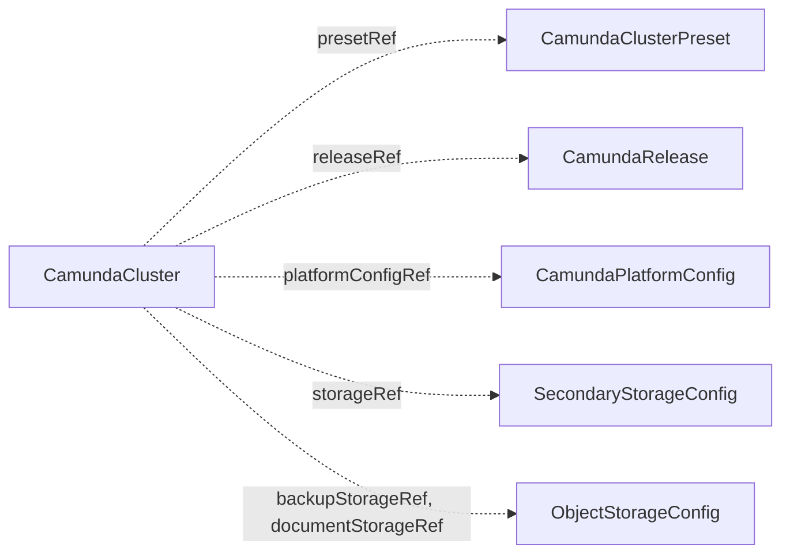
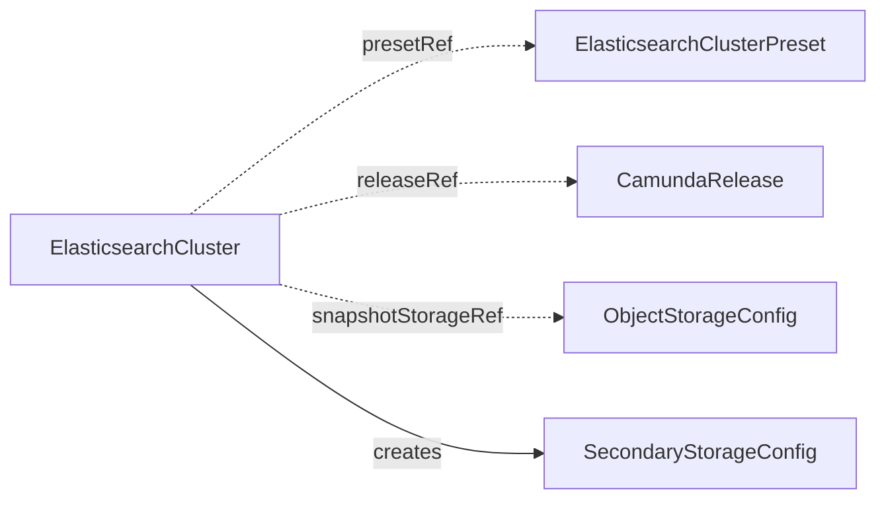
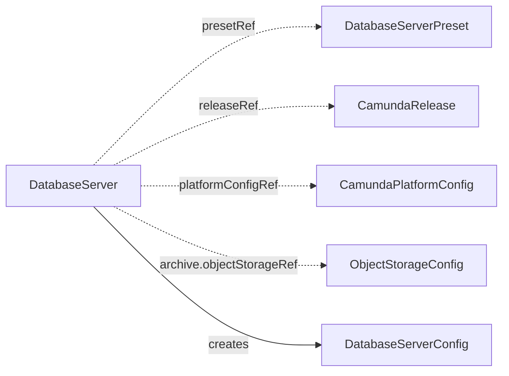
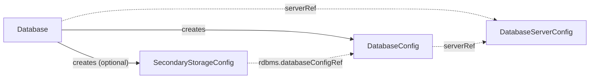
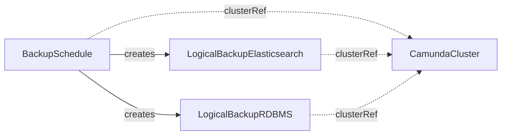
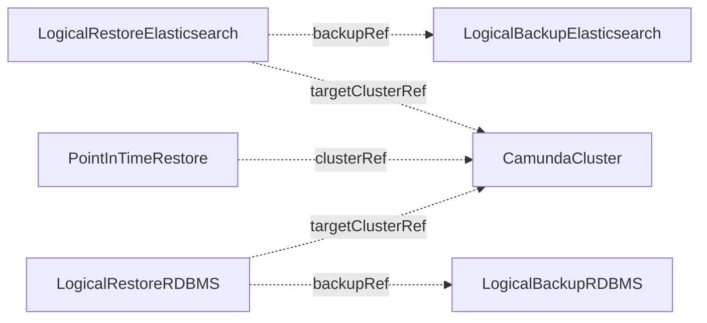
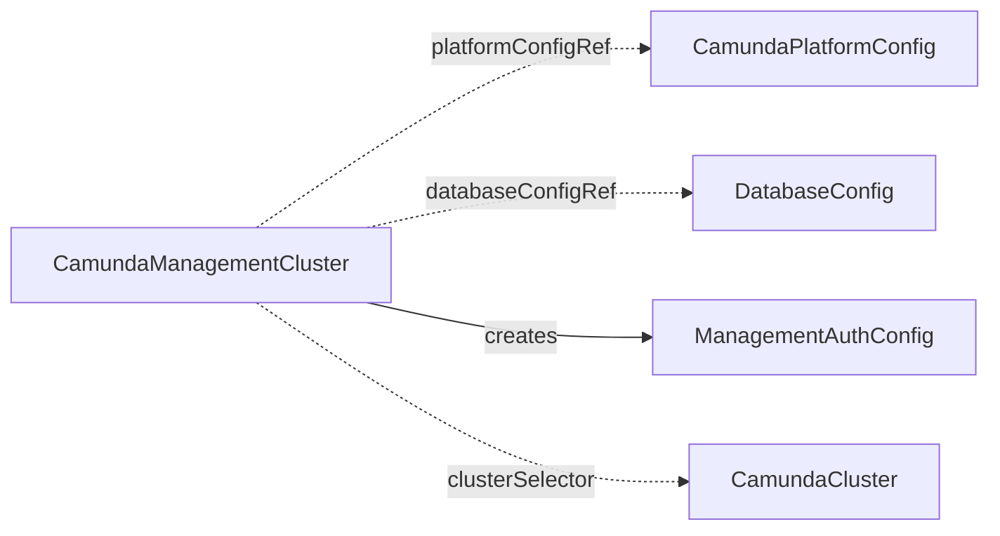
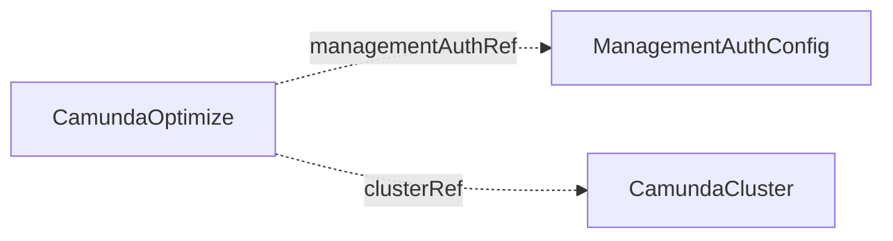

# CRD reference

The operator defines the custom resources below in the API group `core.camunda.io/v1`.
Each page opens with what the kind is and a minimal manifest. Then it covers one topic per section, and it ends with the status conditions and the full spec reference.

The [API reference](api-reference.md) lists every type and field of the API group on one page, with its default and its validation. The page is generated from the API types, so it matches the CRDs of the same release.

Some kinds need an operator that this operator does not install. `ElasticsearchCluster` needs the ECK operator. `DatabaseServer` needs the CloudNativePG operator, and `spec.archive` also needs the Barman Cloud plugin and cert-manager. `CamundaManagementCluster` with `spec.identityProvider.keycloak` needs the Keycloak Operator. Install what you use before the manager starts, or restart the manager after. See [Installation](../installation.md#requirements).

## Cluster

| Kind | Scope | What it is |
| --- | --- | --- |
| [CamundaCluster](camundacluster.md) | Namespaced | One orchestration cluster: Zeebe, gateway, web applications, connectors. |
| [CamundaPlatformConfig](camundaplatformconfig.md) | Cluster | Settings shared by all clusters: authentication, license, image repositories. |
| [CamundaClusterPreset](camundaclusterpreset.md) | Cluster | A baseline spec that clusters inherit. It has no status. Other kinds read it. |
| [CamundaRelease](camundarelease.md) | Cluster | One set of versions that a platform runs: Camunda, connectors, Elasticsearch, and PostgreSQL. It can pin images and add the environment that a version needs. It has no status. Other kinds read it. |

## Storage backends

| Kind | Scope | What it is |
| --- | --- | --- |
| [ElasticsearchCluster](elasticsearchcluster.md) | Namespaced | An Elasticsearch cluster run by ECK, published as a `SecondaryStorageConfig`. |
| [ElasticsearchClusterPreset](elasticsearchclusterpreset.md) | Cluster | A baseline spec that Elasticsearch clusters inherit. It has no status. Other kinds read it. |
| [DatabaseServer](databaseserver.md) | Namespaced | A PostgreSQL server run by CloudNativePG, published as a `DatabaseServerConfig`. It can archive to a bucket. |
| [DatabaseServerPreset](databaseserverpreset.md) | Cluster | A baseline spec that database servers inherit. It has no status. Other kinds read it. |
| [Database](database.md) | Namespaced | A logical database and its users on an existing PostgreSQL server, published as a `DatabaseConfig`. |

## Contracts

A contract is a resource that carries connection details and credential references from the resource that provides a backend to the resources that use it. The operator validates it and reports `Ready`. It provisions nothing from it. You can write a contract by hand or let a resource above write it.

| Kind | Scope | What it carries |
| --- | --- | --- |
| [SecondaryStorageConfig](secondarystorageconfig.md) | Namespaced | The secondary storage of a cluster: Elasticsearch or a relational database. |
| [ObjectStorageConfig](objectstorageconfig.md) | Namespaced | One bucket on S3, GCS, or Azure Blob, and how to authenticate. |
| [DatabaseServerConfig](databaseserverconfig.md) | Namespaced | A database server, its admin credentials, and its point-in-time-recovery capability. |
| [DatabaseConfig](databaseconfig.md) | Namespaced | One logical database and its credentials. |
| [ManagementAuthConfig](managementauthconfig.md) | Cluster | The OIDC configuration of Management Identity. A `CamundaManagementCluster` writes it, and `CamundaOptimize` reads it. |

## Management

| Kind | Scope | What it is |
| --- | --- | --- |
| [CamundaManagementCluster](camundamanagementcluster.md) | Namespaced | The management plane: Management Identity, its identity provider, Console, and Web Modeler. |

## Analytics

| Kind | Scope | What it is |
| --- | --- | --- |
| [CamundaOptimize](camundaoptimize.md) | Namespaced | Camunda Optimize for one cluster: the webapp, the importer, and the exporter settings they need. |

## Backup

| Kind | Scope | What it is |
| --- | --- | --- |
| [LogicalBackupElasticsearch](logicalbackupelasticsearch.md) | Namespaced | One backup of a cluster on Elasticsearch. |
| [LogicalBackupRDBMS](logicalbackuprdbms.md) | Namespaced | One backup of a cluster on a relational database. |
| [BackupSchedule](backupschedule.md) | Namespaced | Create logical backups of a cluster on a cron schedule and prune the ones it created. |

## Restore

| Kind | Scope | What it is |
| --- | --- | --- |
| [LogicalRestoreElasticsearch](logicalrestoreelasticsearch.md) | Namespaced | Restore one Elasticsearch backup into one suspended cluster. |
| [LogicalRestoreRDBMS](logicalrestorerdbms.md) | Namespaced | Restore one relational logical backup into a suspended cluster. |
| [PointInTimeRestore](pointintimerestore.md) | Namespaced | Align the Zeebe primary storage of a PostgreSQL cluster with a database restored to a timestamp. |

## How the kinds relate

Each diagram below shows one concern: which kind needs which other kind.
Solid arrows mean "creates". Dotted arrows mean "references", and the label names the field under `spec` that holds the reference.
If one label stands for more than one field, a table under the diagram lists the fields.
A kind that appears in more than one diagram, such as `CamundaCluster` or `SecondaryStorageConfig`, links those diagrams.

### Cluster inputs

A `CamundaCluster` reads its preset, its release, the platform settings, its secondary storage, and its buckets.

```mermaid
graph LR
    CC[CamundaCluster]
    CCP[CamundaClusterPreset]
    CR[CamundaRelease]
    PFC[CamundaPlatformConfig]
    SSC[SecondaryStorageConfig]
    OSC[ObjectStorageConfig]

    CC -.->|presetRef| CCP
    CC -.->|releaseRef| CR
    CC -.->|platformConfigRef| PFC
    CC -.->|storageRef| SSC
    CC -.->|"backupStorageRef, documentStorageRef"| OSC
```

You can write the `SecondaryStorageConfig` by hand. An `ElasticsearchCluster` or a `Database` can also create it, as the next diagrams show.

### Elasticsearch storage

An `ElasticsearchCluster` creates the `SecondaryStorageConfig` that a `CamundaCluster` reads in `storageRef`.

```mermaid
graph LR
    ESC[ElasticsearchCluster]
    ESCP[ElasticsearchClusterPreset]
    CR[CamundaRelease]
    OSC[ObjectStorageConfig]
    SSC[SecondaryStorageConfig]

    ESC -.->|presetRef| ESCP
    ESC -.->|releaseRef| CR
    ESC -.->|snapshotStorageRef| OSC
    ESC -->|creates| SSC
```

### PostgreSQL server

A `DatabaseServer` creates the `DatabaseServerConfig` that each `Database` on the server reads.

```mermaid
graph LR
    DBS[DatabaseServer]
    DBSP[DatabaseServerPreset]
    CR[CamundaRelease]
    PFC[CamundaPlatformConfig]
    OSC[ObjectStorageConfig]
    DBSC[DatabaseServerConfig]

    DBS -.->|presetRef| DBSP
    DBS -.->|releaseRef| CR
    DBS -.->|platformConfigRef| PFC
    DBS -.->|archive.objectStorageRef| OSC
    DBS -->|creates| DBSC
```

### PostgreSQL databases

A `Database` creates the `DatabaseConfig` of one logical database. If you set `spec.secondaryStorageConfig`, it also creates a `SecondaryStorageConfig` that a `CamundaCluster` can read.

```mermaid
graph LR
    DB[Database]
    DBSC[DatabaseServerConfig]
    DBC[DatabaseConfig]
    SSC[SecondaryStorageConfig]

    DB -.->|serverRef| DBSC
    DB -->|creates| DBC
    DB -->|"creates (optional)"| SSC
    DBC -.->|serverRef| DBSC
    SSC -.->|rdbms.databaseConfigRef| DBC
```

### Backups

Each backup references the `CamundaCluster` that it backs up. A `BackupSchedule` creates the backup kind that matches the secondary storage of the cluster.

```mermaid
graph LR
    BS[BackupSchedule]
    LBE[LogicalBackupElasticsearch]
    LBR[LogicalBackupRDBMS]
    CC[CamundaCluster]

    BS -->|creates| LBE
    BS -->|creates| LBR
    BS -.->|clusterRef| CC
    LBE -.->|clusterRef| CC
    LBR -.->|clusterRef| CC
```

### Restores

A logical restore reads one backup and restores it into a target `CamundaCluster`. A `PointInTimeRestore` references only the cluster.

```mermaid
graph LR
    LRE[LogicalRestoreElasticsearch]
    PITR[PointInTimeRestore]
    LRR[LogicalRestoreRDBMS]
    LBE[LogicalBackupElasticsearch]
    CC[CamundaCluster]
    LBR[LogicalBackupRDBMS]

    LRE -.->|backupRef| LBE
    LRE -.->|targetClusterRef| CC
    PITR -.->|clusterRef| CC
    LRR -.->|targetClusterRef| CC
    LRR -.->|backupRef| LBR
```

### Management plane

A `CamundaManagementCluster` creates a `ManagementAuthConfig` for Optimize. It serves the clusters that match its `clusterSelector`.

```mermaid
graph LR
    MC[CamundaManagementCluster]
    PFC[CamundaPlatformConfig]
    DBC[DatabaseConfig]
    MAC[ManagementAuthConfig]
    CC[CamundaCluster]

    MC -.->|platformConfigRef| PFC
    MC -.->|databaseConfigRef| DBC
    MC -->|creates| MAC
    MC -.->|clusterSelector| CC
```

The management plane reads one `DatabaseConfig` for each database that it runs:

| Field | Database |
| --- | --- |
| `spec.identity.databaseConfigRef` | Management Identity |
| `spec.identityProvider.keycloak.databaseConfigRef` | Keycloak, when the operator runs it |
| `spec.webModeler.databaseConfigRef` | Web Modeler, when `spec.webModeler` is set |

### Optimize

A `CamundaOptimize` serves one `CamundaCluster`. It reads the `ManagementAuthConfig` that a `CamundaManagementCluster` creates.

```mermaid
graph LR
    OPT[CamundaOptimize]
    MAC[ManagementAuthConfig]
    CC[CamundaCluster]

    OPT -.->|managementAuthRef| MAC
    OPT -.->|clusterRef| CC
```
